## **A Live Ethereum Transaction**

The first thing that we're going to need is an "ethereum wallet`.So go to `Metamask` because it's one of the most popular wallets and one of the easiest to use. Download the wallet, and it's going to be a little extension in the top right corner of your browser. This way, we can easily see at any time what we have in our wallet. Go ahead and install Metamask.

**Wallet Creation**

We're going to create a brand new wallet, so go ahead and hit "create a wallet." If you already have a wallet, you can import it via seed phrase.

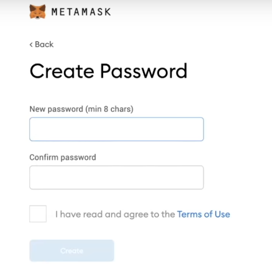

Now we'll create our password and make sure it is secure. If you want to use an account and put real Ethereum and real money into it, you need to back it up.

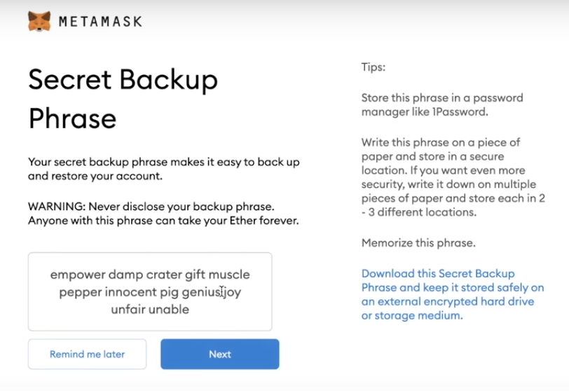

This is just a demo, but if you show this secret phrase to anybody else, they will have access to all your funds. So for everything that we're going to do, we're going to use fake money.

Hit confirm and it gives a couple of tips. Remember to take the tips seriously, especially if you're going to use the account for real money.

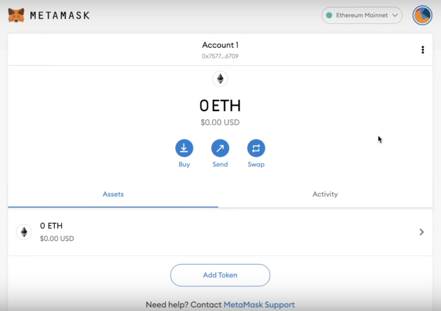

We can see the user interface of this wallet, and if you look in your extensions, you can pin it in your browser, and you can even just click it to get the same interface.

Our mnemonic phrase for that secret phrase that we got has given us access to a new account.

**Etherscan**

For the address of our account, we can use a tool like `Etherscan`.

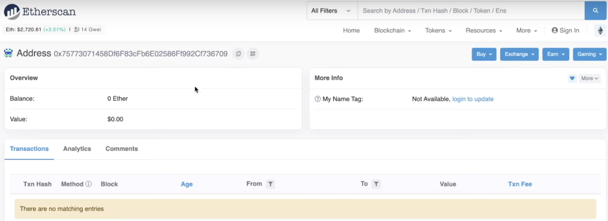

So if we look at this address that we just created, we can see that no transactions have happened. It's empty. It has zero ether. It has zero dollars' worth of value. The address above is the unique address that represents exclusively the single account that we just created.

**Multiple Accounts**

We can even click the circle and create more accounts and give them a different account name.

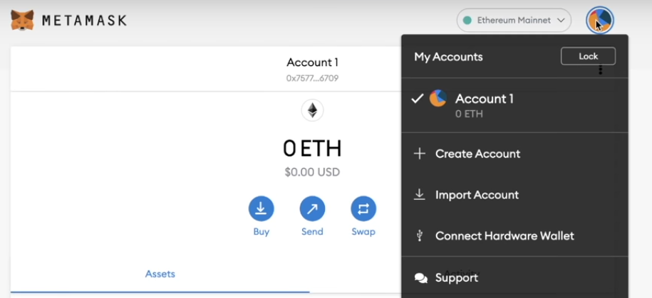

Account 2 will have a different account address.

**Public and private keys, as well as mnemonics**

The mnemonic that we've been given gives us access to create multiple accounts with the same mnemonic. So having that mnemonic will give us access to every single account that's ever been created with that mnemonic. This is why securing your mnemonic is so crucial, especially if you create multiple different accounts. Each account has a unique identifier associated with it as well. The account address is the public address. However, there's also a private key to work with this account, a secret key. We can view it by clicking three dots, going to account details, and exporting the private key.

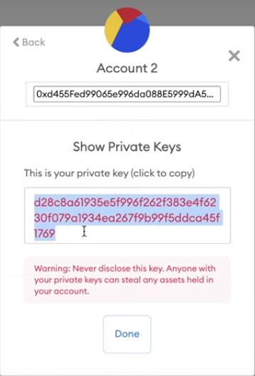

This is a single password associated with this account. If you give somebody access to this private key, they'll have access to account 2. They won't have access to my account 1 because the private key of account 2 is only associated with account 2. The mnemonic, however, is associated with all accounts.

**Mnemonic vs Private vs Public keys**

This is why when people say "store your keys in a safe place," they're referring to both private keys and mnemonics. If you lose your private key, you'll lose access to that account. If you lose your mnemonic, you lose access to all your accounts.

**Mainnet & Testnets**

What else is going on in Metamask? We can see this section here that says `Ethereum Mainnet`.If we click it, we can see a bunch of other networks here.

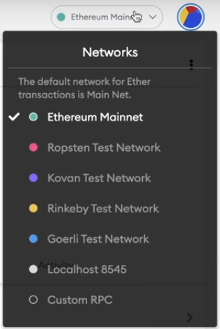

When you buy ETH and work with ETH, you're working on the Ethereum mainnet. When you interact with smart contracts or DEFI, you're going to be working on the mainnet with real value. However, since we're engineers, oftentimes we're going to want to test our applications, do some type of integration tests, or just make sure our code works. So there are also test nets. These are networks that resemble Ethereum and work the same way Ethereum does. However, they're not with real money and it's just for testing applications. We can even go to `Rinkeby Etherscan` and see the `Rinkeby Testnet Explorer`. We looked up our address and it's the exact same information here.

Later on, we're going to show you how to work with other EVM-compatible chains. Don't worry about EVM-compatible means for now, but we can work with Avalanche, Polygon, and other applications through network interfaces as well.

**Initiating our first transaction**

We're going to make our first transaction on the Rinkeby Testnet, and this will simulate exactly what it's like to make the transaction on the Ethereum Mainnet.

We're going to go to this application called the `Rinkeby Faucet`.This is where we're going to make our first transaction. Rinkeby is going to be one of the two testnets that we're going to work with. The other testnet that we're going to work with is going to be `Kovan`.It's important to know how to switch between testnets and EVM-compatible chains, which is why we're going to be working with both. For now, we're just working with Rinkeby.

`Faucet` is a testnet application that gives us free test Ethereum. Hence, it has no value because anybody can get it for free from one of these faucets. So to get testnet Ethereum with faucet.rinkeby.io, we have to post a tweet or a Facebook post with the tweet.

Now after the tweet, we're going to copy the link to the tweet and place it in the Rinkeby Faucet and hit "Give me ether" (18.75 ether/3 days).

If we take the account address and go over to Rinkeby Etherscan, we now see the balance is 18.75.

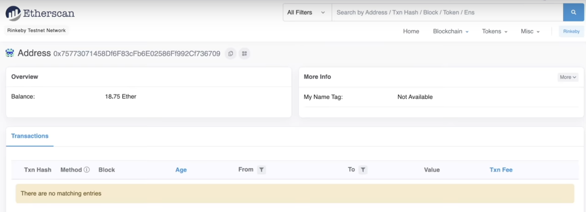

But if we look at `Ethereum Mainnet` we've nothing there. We've just completed our first transaction. And if we refresh the page, we can also see that this is our first transaction that was made. Some accounts sent us 18.75 ether. We can even look at the details of the transaction.

**Transaction details**

Etherscan is what's known as `Block Explorer`. Block Explorer is an application that allows us to see the details of things that happen on a blockchain easily. We can see the transaction details of the transaction that we made, and whenever we work with `Smart Contract` we'll also see them in a transaction similar to what we'll see in the transaction details.

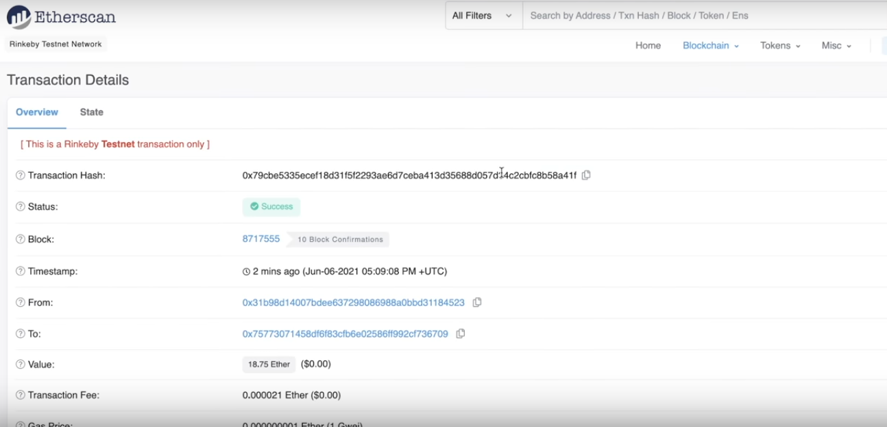

We can see the information above. We see a unique `transaction hash`.This hash or unique identifier uniquely identifies this transaction as the key of what this transaction is.

We can see the block number, which we can see in a little bit.

We can see this unique account, which is the faucet account.

**Gas fees, Transaction fees, Gas limit, Gas price**

"Gas refers to the fee paid to node operators for successfully including a transaction in a blockchain. Now, exactly how this works is going to change pretty soon, but the concept is that anytime you want to change the state of the blockchain, whether this is sending some Ethereum or making any type of transaction, you have to pay a little bit of Ethereum or a little bit of that native blockchain token to execute that transaction. Whenever we do something on the blockchain, it costs gas, and if we do something that would take a lot of energy for the blockchain to do, it will cost more gas. So if I send a single transaction, that's going to cost 21,000 gas. However, if I were to send a transaction that called the smart contract function and did a whole bunch of other stuff, it'd cost more gas. We see here that whoever sent us ETH also paid the blockchain miners or blockchain validators a little bit of Ethereum to include our transaction. We get to pick how much of a fee we want to send with our transactions.

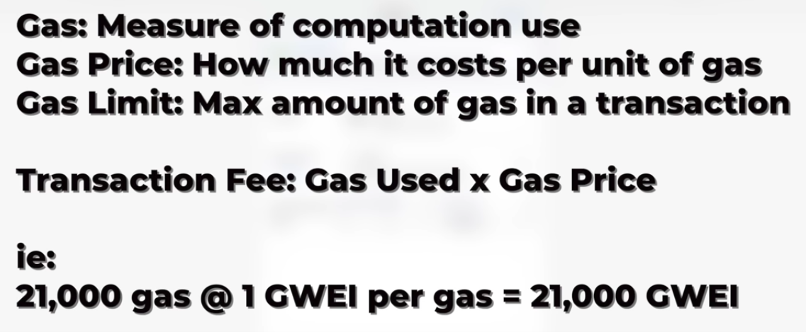

**Gas vs Gas price vs Gas Limit vs Transaction fee**

Why would we ever want to pay more for gas? Why do I even have the option to pay more?

A blockchain can only process so many transactions at a time, and nodes and blockchain nodes can only process so many at a time. So when I make a transaction, a node has to decide why they want to include my transaction in the block. If there are a ton of people looking to make these transactions, then the nodes are going to be highly incentivized to pick the transactions that are going to give them a high price that is going to give them a lot of money for including that transaction.

**Gas estimator**

We were able to obtain the blockchain gas estimator from ethgasstation.info.

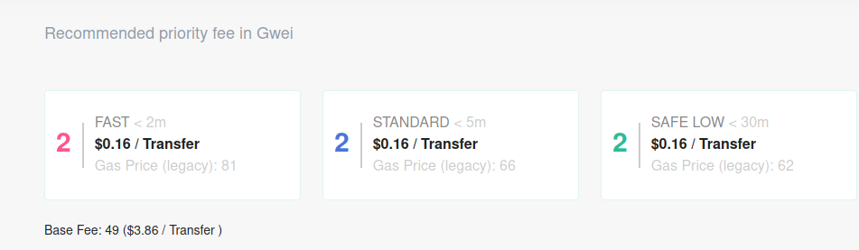

It currently says that if you want to get your transaction in right away, it's going to cost you 81 wei to do so. If you want to get it in less than 5 minutes, it's going to take you about 62 wei.

So the gas price of Ethereum fluctuates with how much people use it, and the gas prices of all these blockchains fluctuate with how much people use it.

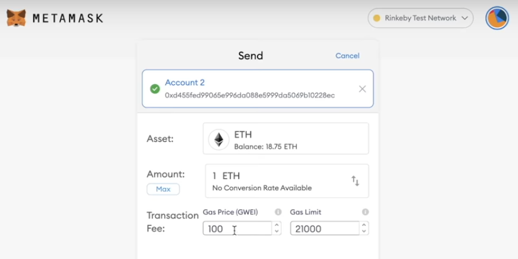

So typically, when you're setting your gas price in a transaction, you can take a look-see at your gas station to see the price based on your needs, but it all depends on how many people are looking to work with this blockchain at the same time.

The reason that these gas prices exist is that nodes can only put so many transactions into a block, so they're highly incentivized to input the transactions that are going to give them a higher fee. So, when there are a lot of people looking to use a blockchain, prices will be very high; when there aren't a lot of people looking to use a blockchain, prices will be very low.

With just this little bit of information, you now know how to interact with blockchains and how to interact with the Ethereum protocol. So if you don't want to learn how to code anything, you can go and you can start interacting with Ethereum and interacting with protocols with just this information.

Let's look under the hood of Ethereum and see what is going on with these transactions, with this gas, and with these blockchains. Let's learn all the fundamentals of blockchain technology.

## **How Blockchain Works/What Happens Inside Blockchain**

**Hash or Hashing or SHA256**

Before we get started, we need to take a look at this thing that we call the SHA256 hash. A hash looks like a bunch of random numbers and it's a fingerprint of some digital data.

The hash below starts with `e3b0` which is the hash of nothing.

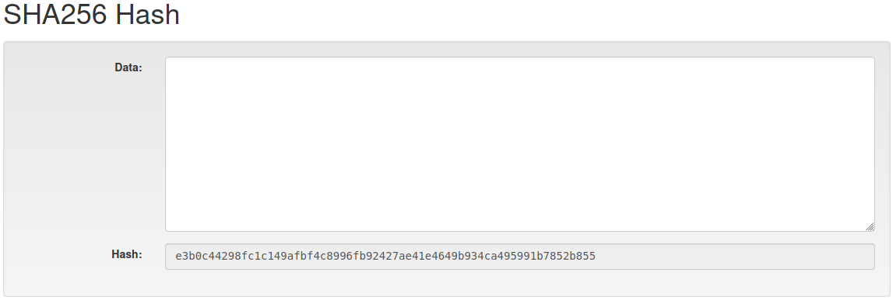

It just so happens it's a fingerprint of whatever I type in this box. If I type the text 'blockchain' into this box, you can see the hash has changed.

This is the hash of the text 'blockchain' in all lowercase, which starts with 5318. If I delete the text and type the same text again, it'll have the same hash. It's the `digital fingerprint` of the text 'blockchain'.

You could type tons and tons of text and you'd get a hash, and the interesting thing is that if there's a tiny amount of information, no information, or an entire library of congress, you're always going to get a hash that is this long as shown above. You're not going to be able to guess what it is. You'd always get the same hash regardless of how many times you put the same information in.

**Block**

Let's extend the idea of a hash into something that we're going to call a block.

This is a block, and it's exactly like the hash. It's just the data section that has been broken out into three sections: one called "block," which is just some kind of number or block number, a "nonce," which is just another number, and just some more data, very similar to the way that we had it before. However, the hash of this block includes all of the information shown in the above figure, which begins with four zeros. It's a relatively unusual hash, and most of them are not going to start with four zeros like the above hash. This one happens to, and because it is arbitrary, we can say the block is signed.

So what would happen if I were to change anyone's information in the above block?

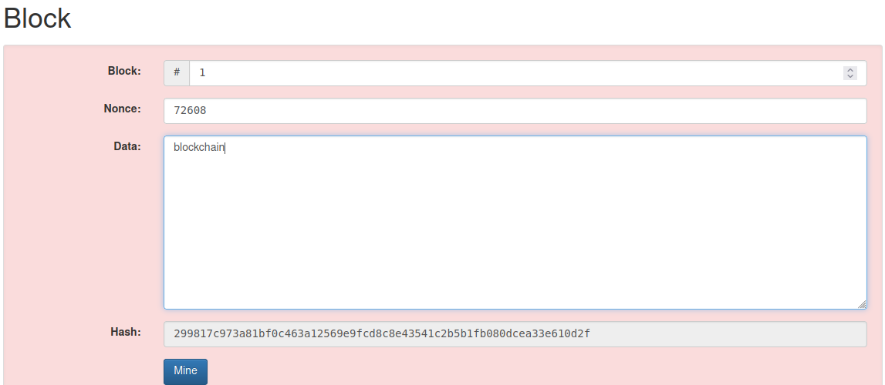

The above hash doesn't start with four zeros, and the big background has turned red. Now we know this block with this information in it is not a valid or signed block, and that's where `Nonce` comes in. This number is just a number that you can set to try to find a number that fits so that the above hash starts with four zeros again.

Above you can see the `mine` button. When I click the mine button, it's going to run through all the numbers from 1 up to try to find one where the hash starts with four zeros, and this process is called mining.

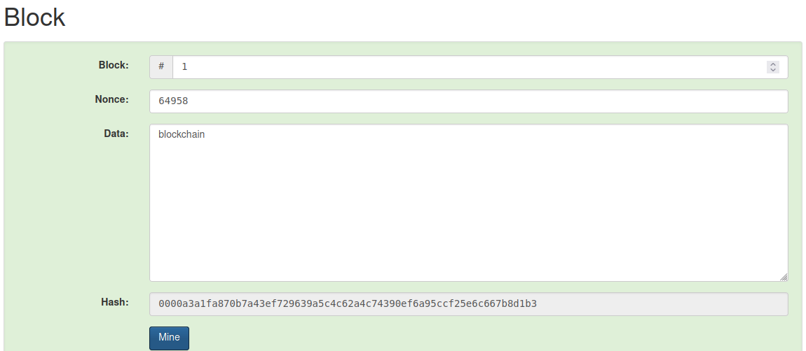

It stopped at 64,658 and that one just happens to hash out to something that starts with four zeros, so it satisfies the little definition of what a `signed block` is.

**Blockchain**

A blockchain is just the chain of these blocks. How do you put them together? Let's do that.

Just like before, block number 1 has none. There's some data area too, but then it has this `Prev` which is a bunch of zeros in the first block.

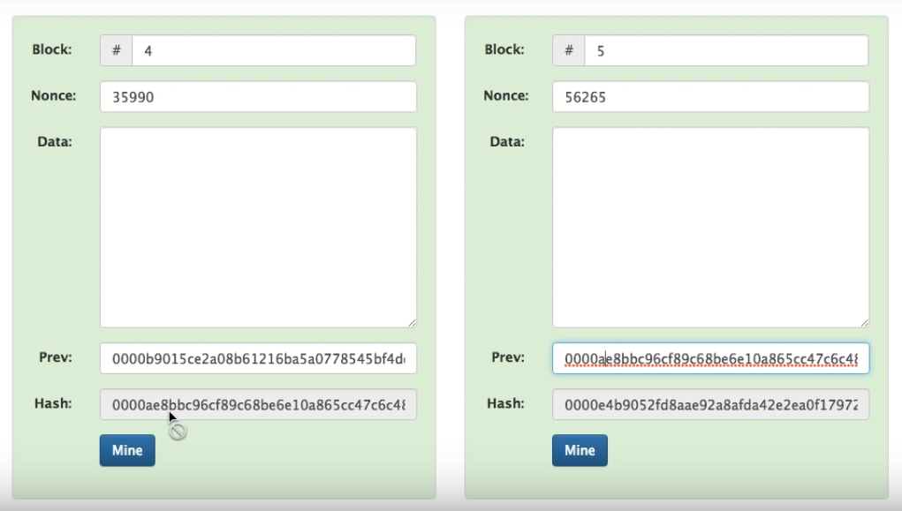

The `prev` is block 2, which starts with '0000ae', which is the hash of the previous block (block 4). Each block points backward to the one before it. You remember that in the first block, there is no previous, so its prev is just a bunch of zeros. It's just a fake number.

Just like we did before, what happens if I change some information in block 5?

It's going to change the hash of this block, and it's going to invalidate it.

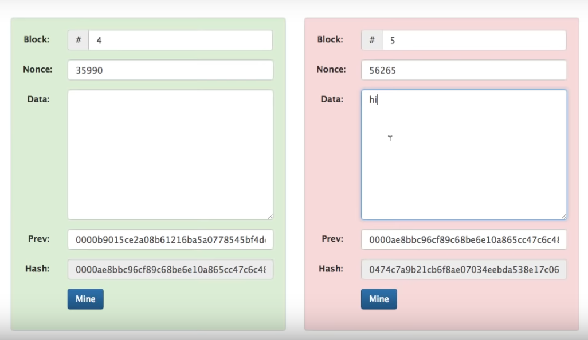

What would happen if I changed something in block 4?

It's going to change the hash, but that hash will get copied to the previous hash section of block 5, which changes block 5 too. So it should break both blocks.

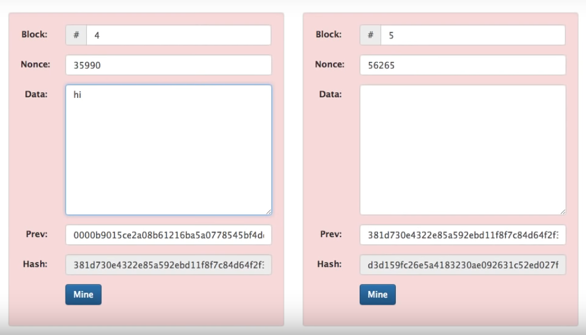

We can go back as far as we want to some point in the past and break that block, and it'll break all the blocks since then. Everything before was green.

If I wanted to change something in the blockchain, I could go over to block number 5 and change it. Then we could re-mine it and pick a different nonce. We could essentially alter the change.

What if I go back in time and break block 3?

Now I need to mine block 3, which picks a nonce that makes the hash out to four zeros, but blocks 4 and 5 will still be broken. Although block 3 starts with four zeros, adding the four zeros with different stuff in the prev section of block 4 still makes block 4 hash out incorrectly. So I also need to mine blocks 4 and 5, respectively.

What I wanted to say is that if I go and change the last block, all I've got to do is re-mine that last block. If I go way back in time to one of the blocks and make a change, I need to mine from that block. So the more blocks I go by in the past, it's harder and harder to make a change. That's how a blockchain is going to resist mutation and change.

`How do I know that my blockchain has been re-mined ?`

**Decentralized/Distributed Blockchain**

Let's take a look at `Distributed Blockchain`.

It looks exactly like the last blockchain but has a different peer for the blockchain. You can see that peer B has the same blockchain structure as peer A. The list could go on forever. There are many, many peers out there on the internet, and they all have a complete copy of the blockchain.

If I look at the hash of Peer A block 5, it starts with '0000e4', and if I go down to PeerB block 5, it also has a hash that starts with '0000e4'. They must be identical.

If I type something on Peer B block 4, and re-mine block 4 and block 5,

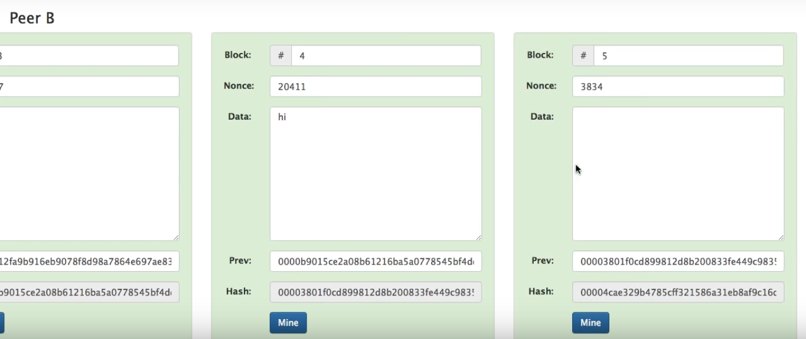

All the blocks in Peer B are green. However, the Peer A chain says that the last hash starts with '0000e4', Peer C says '0000e4', but the middle one says '00004c'. So just by glancing at Peer B's hash, something is wrong with that Peer B, even though all of the hash starts with four zeros. Essentially, it's two against one. Peer A argues it's' 000e4 ', Peer B argues it's' 00004c ', and Peer C argues it's' 000e4 '. So '0000e4' wins. So that's how a completely distributed copy works. Having a copy on many different computers can all very quickly see if all of the blocks are identical. Blockchains can have 400,000–500,000 blocks very easily, so rather than checking through all of them, all you have to do is to look at the hash of the most recent one and you can see if anything in the past was altered. You can tell by looking at the last block in the chain.

**Tokens/Transaction History**

That's the entire thing. There's nothing more to it than that, but it's kind of not useful because we don't have anything in this data area that means anything. I keep typing text that's sort of irrelevant information. So what we want is a `token`.Let's do a token on our blockchain.

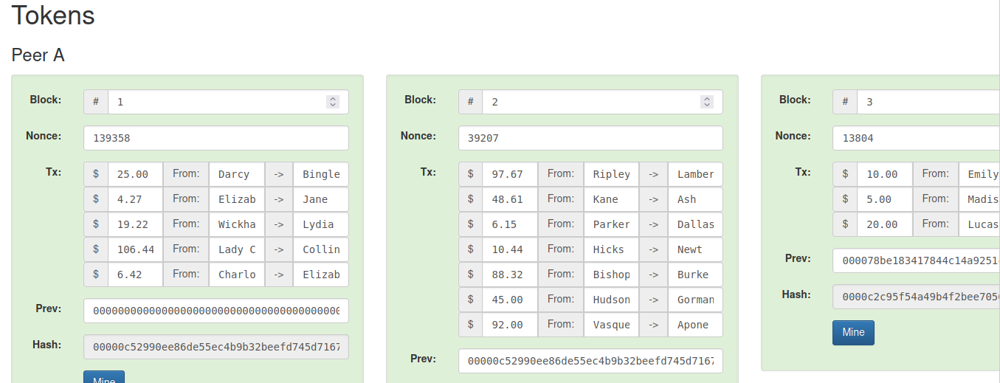

The above tokens are arbitrary, which means 25 dollars from 'Darcy' to 'Bingle'. 4.27 from 'Elizabeth' to 'Jane'. It's basically all the transactions that are happening. They replaced the data with these transactions, and just like we saw before, there are multiple blocks. It doesn't matter how many transactions there are. If we go down to other peers, we notice we have all these other copies of the same block. Now here's where immutability is important. If I change something in Peer A's block 4, the hash of the last block will be totally different from the other peers' last block hash. If I were to go back in time and change some values, we would notice. That's the whole point of using the blockchain to resist any kind of modification that has happened in the past.

We're not listing 'Darcy' has 100 dollars and she's 25 dollars to 'Bingle'. The only thing we're saying is that 'Darcy' gives 25 to 'Bingle'. We're not remembering a bank account balance, only remembering money movements. So this begs the question, `"Does Darcy have 25 dollars?"

We've got a problem in this version of the blockchain: we don't know if Darcy has 25 dollars. So let's look at a `Coinbase` transaction.

Coinbase is going to add a coinbase transaction to our blocks. This is saying that we're going to invest 100 dollars out of thin air and give it to 'Anders' and there's no transaction in the block because nobody had any money prior to this.

In the next block, another 100 dollars comes out of nowhere and goes to 'Anders'. Now we've got transactions and they're all from 'Anders' because 'Anders' is the only one who has any money at this point. 'Anders' is sending 10 of his dollars to 'Sophie'. `Does 'Anders' have 10 dollars?` Yes, he does because the coinbase transaction has given him the 100 dollars. Add all the transactions 'Anders' is sending and they don't go over 100, and it follows sort of a basic rule of a currency that you can't invent it out of thin air, you can't create money out of thin air. Its dispersion is controlled.

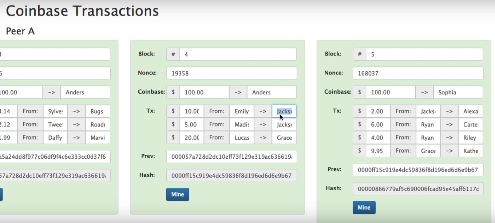

If we look at this blockchain that we've created and zip forward in time, we notice that 'Jackson' is giving 'Alexa' 2 dollars. Does Jackson have two dollars? We go back a block before and see that 'Emily' had gotten 10 dollars from 'Andres' and gave 10 to 'Jackson'.So 'Jackson' does have the money. That's one of the benefits of having a past in the block. It's easy to go backward.

**Summary**

- Ethereum runs on Keccak256.

- A hash is a unique fixed-length string to identify a piece of data.

- A hash algorithm is a function that computes data into a unique hash.

- Mining is the process of finding a "solution" to the blockchain's "problem".

- Nodes get paid for mining blocks.

- A block is a list of transactions mined together.

- Blockchains are decentralized and distributed because many independent users are going to run this blockchain software, and they'll check and compare against each other to see which blockchains are acting honestly and which ones are acting maliciously.

- Nonce is a "number used once" to find the "solution" to the blockchain problem.

- Nonce is also used to define the transaction number for an account or address.

