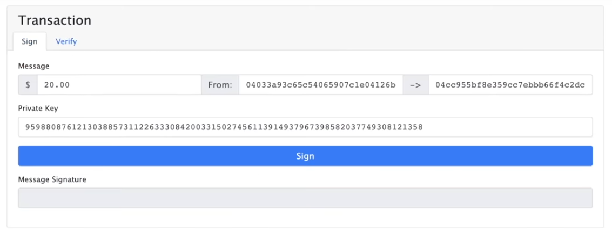

## **Signing and Verifying a Transaction**

We're going to talk about signing the transactions, private keys, and some other cryptography because in the blockchain below we see fantastic transactions, but how do we know that it was Darcy who was the one to send 25 dollars to Bingley? How do we know that it actually happened? This is where all those pieces that we just learned about in our test net in our Metamask account are going to come to life.

**Public & Private Keys**

Here we have an example of public and private keys.

Private key: only known to the key holder, it's used to "sign" transactions.

You really want to keep that secret because you're going to be using it as a kind of secret password for all the transactions.

I can pick any private key I want with this `Elliptic Curve Digital Signature Algorithm` for Ethereum and Bitcoin. They both use this elliptic curve digital signature algorithm. It's a variant of the digital signature algorithm, and it's going to create its own public key.

With that public key, we want everybody to have access to the right. The whole world can see this public key.

We're going to use the private key as a password to quote or unquote digitally signed transactions, and then people can verify them with this public key.

Let's see what this looks like.

**Signatures**

If we go to the signatures tab and let's say we have this message that we want, let's say "hi world."

What's going to happen is the private key that we created, which we can use to sign this data (hi world). We're using a digital signature algorithm to create this message signature.

What's powerful about how this algorithm works is that you can create this message signature with your private key, but somebody else can't derive your private key from the message signature. This is what makes this really, really powerful.

However, if we go to verify using our public key, anybody can verify that the signature is yours.

**Transactions**

If somebody tries to fake a transaction, they need to verify their signature against my public key, and very easily it turns red because it's not verified.

We can take that into transactions in the exact same way.

If I wanted to send 20 dollars from my account to another account using my private key, I could sign that transaction and anybody else in the world could verify the transaction. This is why people say to protect your keys.

Your Ethereum address is a piece of your public key. To get our address on Ethereum, all we have to do is take this public key we've created with our private key, hash it using that same Ethereum hashing algorithm, and take the last 20 bytes. That's how we'll derive our address.

Knowing the exact methodology of how to get the address doesn't really matter because it could change from blockchain to blockchain, but just know that's essentially how most of these addresses are derived.

Note: This isn't how we send the transaction. So this is just going to sign it and create a transaction for us to send. We'll learn later on how to send these transactions.

## **Concepts are the same**

Now we know all the cryptography pieces and all the little nitty-gritty of how the blockchain works, our signatures work, and how everything sticks together. Let's talk a little bit about how this works in actuality and what's going on.

For a lot of this, each different blockchain has slightly different algorithms, metrics, and criteria for doing a lot of this stuff. So when we're talking about specific implementations, keep in mind that the exact algorithm might be a little different, but the concepts are all still going to be the same. Hashing and hash functions are going to be the same no matter where you look. A decentralized blockchain is going to be the same no matter where you look. How it's implemented is a little bit different.

Traditionally, when you run an application, be it as a website or something that connects to some server, you're interacting with a centralized entity, unlike how we saw with the blockchain with multiple different peers. It's going to be run by a single centralized group. It can still be run on many different servers, but all those servers are still going to be controlled by the same centralized group. As we saw, blockchain, as we saw, runs on a network of independent nodes. When we saw peer A, peer B, peer C, and more, those were different examples of different independent users running the blockchain technology on their node.

**Node**

"Node" here means a single instance of a decentralized system. When I say single node, when I'm talking about a blockchain, I'm talking about one of those peers, A's, B's, and so on, running that blockchain software. I'm talking about one server running this technology, and again, it's the network. It's this combination of these nodes interacting with each other that creates this entire blockchain. What makes these so potent too is that anybody can join the network, which is why they're decentralized. The barrier to entry is a few hardware requirements. Anybody can join these networks and participate, and that's what makes them truly decentralized. In fact, you can go to Github right now and run your Ethereum node in a few seconds.

**Centralized entity vs Decentralized Blockchain**

In the traditional world, applications are run by centralized entities, and if that entity goes down, is maliciously bribed, or decides they want to shut off, they just can because they're the ones that control everything.

Blockchain technology, by contrast, doesn't have this problem. If one node or one entity that runs several nodes goes down, since there are so many independent nodes running, it doesn't matter. The blockchain and the system will persist so long as there is at least one node always running. Luckily for us, most of the popular chains like Bitcoin and Ethereum have thousands and thousands of nodes. As we've shown in our demo, if one node acts maliciously, all the other nodes will ignore that node and kick it out or even punish it in some systems, because they can easily check everybody else's node and see this one is out of sync with the majority, and yes, the majority rules when it comes to blockchain.

**Transactions are Listed**

Each blockchain keeps a full list of every transaction and interaction that's happened on that blockchain, and we saw that if a node tries to act maliciously, then all their hashes are going to be way out of whack and they're not going to match anybody else. This gives the blockchain an incredibly potent immutable trait where nothing can be changed or corrupted.

So, in essence, we can think of a blockchain as a decentralized database. And with Ethereum, it has an additional feature where it can also do the computation in a decentralized manner.

**Consensus**

When we went through that blockchain example and we did that mining feature, this is what's known as `proof of work`.Proof of work and proof of stake fall under the umbrella of consensus, and consensus is a really important topic when it comes to blockchain.

Consensus is defined as the mechanism used to reach an agreement on the state or a single value on the blockchain, especially in a decentralized system. I briefly alluded to this consensus mechanism in our blockchain example when I said if one changes something and the other two don't, then the majority will rule and kick that one out. This is part of that consensus mechanism.

Now, very roughly, a consensus protocol in a blockchain can be broken down into two pieces.

- `Chain Selection Algorithm`

- `Sybil Resistance mechanism`

**Proof of Work/Sybil resistance mechanism**

That mining piece we're doing or the proof of work algorithm is what's known as a Sybil resistance mechanism, and this is what Ethereum and Bitcoin currently use. Proof of work is known as a Sybil resistance mechanism because it defines a way to figure out who is the block author: which node is going to be the node that did the work to find that mine and be the author of the block so all the other nodes can verify that it's accurate.

### **Sybil Resistance**

Sybil Resistance is a blockchain's ability to defend against users creating a large number of pseudo-anonymous identities to gain a disproportionately advantageous influence over said system, and in laymen's terms, it's a way for the blockchain to defend against somebody making fake nodes so that they can get more and more rewards.

There are two types of Sybil resistance that we're going to talk about here, namely POW (Proof of Work) and POS (Proof of Stake).

### **POW**

In POW, this is Sybil resistant because a single node has to go through a very computationally expensive process called mining, which we demonstrated earlier to figure out the answer to the blockchain's riddle of finding that correct nonce.

In POW, this works because no matter how many pseudo-anonymous accounts you make, each one still has to undergo this very computationally expensive activity of finding the answer to the proof-of-work problem, which in our demonstration was finding a nonce with those first four zeros, but each blockchain might change the riddle or change the problem to be a little bit different.

**Block time**

Some of these blockchains make this riddle intentionally hard or intentionally easy to change, what's called block time. The block time is how long it takes between blocks being published and it's proportional to how hard these algorithms are. So these problems can change depending on how long they want the block time to be.

If the system wants the block time to be very very long, they just make the problem very very hard and vice-versa. We'll talk about civil attacks in a little bit and how they can affect the system, but with proof of work, it's a verifiable way to figure out who the block author is and be civil resistant.

**Chain selection rule**

Now you need to combine this with the chain selection rule to create this consensus. Some consensus protocols have more features, but very very roughly, there are two pieces that we're going to look at. The second piece is going to be the chain selection rule. How do we know which blockchain is the real blockchain and the true blockchain?

**Nakamoto consensus**

Bitcoin and Ethereum both use a form of consensus called `Nakamoto Consensus`, which is a combination of POW and longest chain rule. The decentralized network decides that whichever blockchain has the longest chain or the most number of blocks on it is going to be the chain that they use. This makes a lot of sense because every additional block that a chain is behind is going to take more and more computation for it to come up. That's why we saw confirmations on our transactions.

**Block Confirmations**

The number of confirmations is the number of additional blocks added on after our transaction went through in a block. So if we see confirmation two, it means the block that our transactions were in has two blocks ahead of it in the longest chain. Now I do want to point out that a lot of people use POW as a consensus protocol, and I do want to say that this is a little bit inaccurate, but sometimes people use it interchangeably. In Bitcoin and Ethereum, POW is a piece of the overall consensus protocol, which in Bitcoin and Ethereum's current case is Nakamoto consensus.

**Block rewards & transaction fees**

`This has recently changed as of EIP 1559`.

POW also tells us where these transaction fees and these block rewards go to. Remember how we made this transaction? We had to talk about gas and a transaction fee. So who's getting paid? Who's getting this transaction and how much of the transaction fee is going to the miners or validators?

In a POW network, they're called miners, and in POS, they're called validators. They are a little bit different, and we'll get into that when we talk about POS.

In this POW system, all these nodes are competing against each other to find the answer to the blockchain riddle. Remember, in our example it has to find a hash that has four zeros at the start, and again, depending on the blockchain implementation, that riddle is going to be a little bit different.

But all the nodes are trying as hard as possible to get this answer first. Why? Because the first node to figure out the answer to the blockchain rule is going to get that transaction fee. They're going to get paid from that.

When a node gets paid, it gets paid in two different ways. One is going to be with a transaction fee and the other piece is going to be the block reward.

- **Transaction fees**

Remember how we talked about changing the gas price?That's the transaction fee that we're going to pay to these blockchain nodes for including our transaction. The block reward is given to the nodes from the protocol of the blockchain itself.

- **Block Reward**

You've probably heard of the bitcoin halving before. The halving refers to this block reward getting cut in half, and it's supposed to be cut in half roughly every four years. This block reward increases the circulation amount of whatever cryptocurrency is being rewarded. For example, on Ethereum, the block reward is given out in Ethereum, and on Bitcoin, it's given out in Bitcoin.

So these nodes are competing against each other to be the first to find this transaction, to be the first one to find the answer to this problem, so that they can be the ones to win both this block reward and your transaction fee. Some blockchains, like bitcoin, for example, have a set time when they're no longer going to give out block rewards and the miners or the nodes are only going to get paid from transaction fees.

Gas fees are paid by whoever initialized the transaction. When we got our funds from the faucet, there were some servers and somebody else was paying the transaction fee for us. However, we sent ether from one account to another, and the first account paid a transaction fee to do so.

In POS, there's also a gas fee, but it's paid out to validators instead of miners, and we'll talk about that in a little bit.

Now let's talk about two types of attacks that can happen in this blockchain world.

**Sybil attack**

The Sybil Attack is when a user creates a whole bunch of pseudo-anonymous accounts to try to influence a network. Now, obviously on Bitcoin and Ethereum, this is really really difficult because the user needs to do all that work in POW or have a ton of collateral in proof of stake, which again we'll talk about in a little bit.

**51% attack**

As we saw as part of our consensus protocol, these blockchains are going to agree that the longest chain is the one that they're going to go with so long as it matches up with 51% of the rest of the network. This means that if you have the longest chain and you have more than 51% of the rest of the network, you can do what's called a fork in the network and bring the network onto your longest chain.

Like I said, Sybil attacks are when a single node or a single entity tries to affect the decentrality of the network by pretending to be multiple different people, although they're just the same person or entity, and like I said, it's really difficult to do in POW and POS.

### Longest Chain Rule

Now you can see that blockchains are very democratic. Whichever blockchain has the most buy-in and is the longest is the blockchain that the whole system is going to corroborate. When nodes produce a new block and add it to the longest chain, the other nodes will follow the longest chain that the rest of the network is agreeing with and add those blocks to their chain and follow up. When a blockchain selects a block from a different longest chain, places it on, and then has to swap it out for another block to continue with the different blockchain, very small reorganizations are fairly common.

However, if a group of nodes had enough nodes or enough power, they could essentially be 51% of the network and influence the network in whatever direction they wanted. This is what is known as a 51% attack. This happened on blockchains like Ethereum Classic, which is not Ethereum. This is why the bigger a blockchain is, the more decentralized and secure it becomes.

**Drawbacks of pow**

POW is fantastic because it allows us to very easily protect against these Sybil attacks and keep our blockchains decentralized and secure. However, it has some drawbacks as well.POW costs a lot of electricity because every single node is running as fast as they can to win this race to get the rewards. This leads to an environmental impact. Since POW and Nakamoto Consensus, a lot of other protocols have taken this idea and gone in a different direction with a different Sybil resistance protocol. A lot of them are a lot more environmentally friendly, and the most popular one is POS.

**proof of stake/Sybil resistance mechanism**

Some chains are already using this Proof of Stake protocol and are alive and thriving. Some of them are `Avalanche`, `Solana`, `Polygon`, `Polkadot`, `Terra` and additionally, Ethereum has decided to upgrade to ETH2, which will have this proof of stake algorithm as well.

It's a different sybil resistant mechanism. Instead of solving this difficult problem, POS nodes put up some collateral that they're going to behave honestly towards, aka they stake. In the example of Ethereum2, nodes put up some Ethereum as a stake. They're going to behave honestly within the network.

If they misbehave with the network, they're going to be slashed or removed from some of their stakes. Obviously, this is a very good Sybil resistance mechanism because if you try to create a whole bunch of anonymous accounts, then for each one of those accounts you have to put up some stake, and if you misbehave, you're going to run the risk of losing all the money that you put up as collateral.

**Validators**

In POS, miners are called `validators` because they're no longer mining anything. They're actually just validating other nodes. Unlike POW, in which every node is racing to be the first one to find the block, in POS, nodes are randomly chosen to propose the new block and then the rest of the validators will validate if that node has proposed the block honestly.

As you saw with our cryptography lesson, it's usually very easy for other nodes to verify if a proposal or a transaction is honest.

### Randomness

It's a really important topic when we're talking about blockchains because, keep in mind, these blockchains are deterministic systems. They're walled off against the rest of the world, and as you know, a deterministic system by definition can't have random numbers. So how do we choose the random validators in the system?

Well, it changes from blockchain to blockchain and choosing the node will change blockchain to blockchain, but in ETH2 they're using what's called "random," at least for the original implementation. This is a decentralized autonomous organization that collectively chooses the random number and collectively chooses which node is going to run next.

**pros & cons of pos**

POS has some pros and cons as well.

The pros are that, again, it's a great Sybil resistance mechanism and a great way to figure out who the author of a block should be, and the other pros are that it's way less computationally expensive to figure out a new block because instead of every single node on the network trying to do this, only one node needs to do this and the rest of the nodes just need to be validated.

The cons are that it's usually considered a slightly less decentralized network due to the upfront staking costs and that it costs to participate. This gets into a little bit of a philosophical battle on how decentralized is decentralized enough, and I think it's up to the community to decide. I think we'll learn more and more about how decentralized is decentralized enough. The general consensus among blockchain engineers, though, is that POS is very decentralized and very secure. This massive environmental impact improvement is one of the two main reasons why ETH is shifting to ETH2. It reduces the environmental impact by up to 99%.

**Scalability problem & Sharding solution**

- Scalability

When we're talking about gas prices, we're saying that gas prices can get high if a lot of people want to send a transaction because a block only has so much block space and the nodes can only add so many transactions. So when a lot of people want to use blockchain, the gas price skyrockets. This is not very scalable because we want to add more and more people to these blockchains. It's going to cost more and more to use the blockchain because more people are going to want to get into blocks. This means that there's kind of a ceiling to how many people can use the system because of the financial constraints that will be imposed as gas prices keep rising. Eth2 is not only attacking the environmental impact of POW by switching to POS, but they're also implementing this new methodology called `Sharding`.

- Sharding

Sharding is a solution to this scalability problem. A sharding blockchain just means that it's going to be a blockchain of blockchains. There's a main chain that's going to coordinate everything amongst several chains that hook into this main chain. This means that there are more chains for people to make transactions on, effectively increasing the amount of block space that there is. Sharding can greatly increase the number of transactions on a given blockchain layer 1. There's another term that might be the first time you've heard it. It's a layer1.

**Layer 1 & Layer 2**

Layer 1 refers to any base layer blockchain implementation. Avalanche, Bitcoin, and EthereumLayer 1: These are base layer blockchain solutions.

A layer 2 is any application that is added on top of layer 1; it is added on top of the blockchain. Some examples of layer 2 are going to be chainlink, Arbitrum, or Optimism. Arbitrum and Optimism are very interesting because they're layer 2s that also look to solve the scalability issue. They are known as `Rollups`.

**Rollups**

Arbitrum and Optimism roll up their transactions into a layer 1 like Ethereum. We're not going to go too deep into rollups and how they work, but all you need to know is that a rollup is kind of like a `sharded chain`. They derive their security from the base layer from layer1 like Ethereum and they bulk send their transactions onto layer1. They solve some of the scalability issues by being another blockchain that people can make transactions on, still on a kind of base Ethereum layer. Now they're different from `side chains` because side chains derive their security from their protocols. Rollups derive their security from the base layers. So, for example, Arbitrum and Optimism are going to be just about as secure as Ethereum.

**Summary**

- BTC and ETH are both Proof-of-Work blockchains that follow the Nakamoto Consensus.

- ETH2 will be a Proof-of-Stake sharded blockchain.

- Sybil attacks are prevented due to protocols like POW and POS.

- 51% attack grows increasingly harder with the size of the blockchain.

- Consensus is how blockchains decide what the state of the chain is.

- Sharding and rollups are solutions to scalability issues on layer 1.

- A layer1 is any base blockchain implementation like bitcoin or Ethereum.

- A blockchain scalability problem is that there's not enough block space for the number of transactions that want to get in them, which leads to a very high gas price.

- Gas prices are how much it costs to interact with a blockchain.
