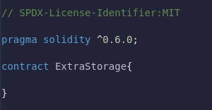
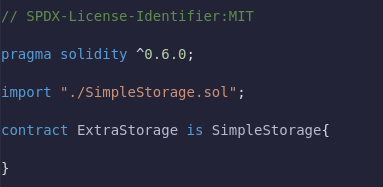
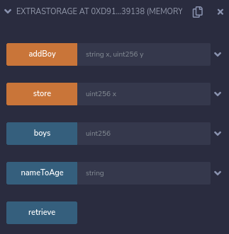
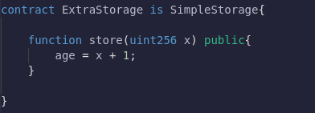
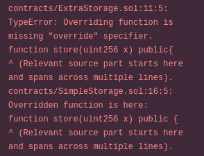
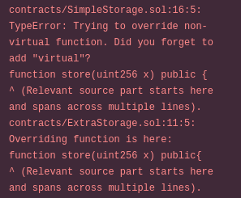
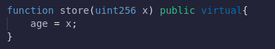
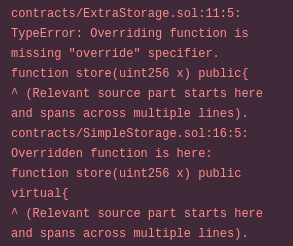
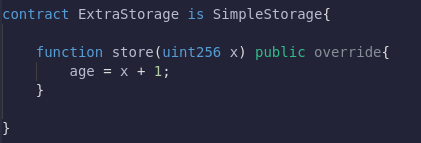
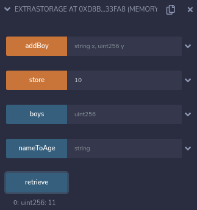

## **Storage Factory**

We've got our first contract out of the way. We're understanding some of the basics of solidity. Now let's move onward into a little bit more advanced with our smart contract and let's build a "Factory Pattern" of smart contracts.

**Factory Pattern**

We have our SimpleStorage contract which allows us to store age and age-associated with different people. What if though I wanna have a lot of these SimpleStorage contracts deployed? I wanna give people the ability to generate and deploy their lists based on the SimpleStorage contract.

This is where a Factory Pattern comes into play.

**New contract StorageFactory**

Let's go ahead and create a new contract called StorageFactory.sol in the same location where the SimpleStorage file lies. SimpleStorage and StorageFactory needs to be in the same folder.

Let's figure out how to get a contract to deploy another contract. We're gonna add those basics pieces that we added in that SimpleStorage contract.

**Import 1 contract into another**

So how can this contract deploy a SimpleStorage contract?

Well, the first thing we're gonna do is import SimpleStorage into our StorageFactory contract. We need to import it so that our StorageFactory contract knows what a SimpleStorage contract even looks like. The way we can import it is:

Importing with that line is equivalent to copying everything in SimpleStorage.sol file and pasting it above into the StorageFactory file.

It's interesting about having two contracts in the same file is that when you go to deploy, you'll have a choice of which one you want to deploy.

**Deploy a Contract from a Contract**

If we want this contract to be able to deploy a SimpleStorage contract we of course have to create a function that can do that.

We're going to create an object of type SimpleStorage contract, name it "genSS" which is going to be a new SimpleStorage contract.SimpleStorage contract takes no input parameters.

If we deploy this contract as is by going to our deploy tab, choosing the StorageFactory, and deploying.

We have a function that doesn't return anything. We're creating new contracts but can't read where those contracts are being created. We'd have to look on a block explorer like Etherscan.

**Track simple storage contracts**

Let's make a way for us to keep track of all the different SimpleStorage contracts that we deploy. We put them in a list or an array.

We create a SimpleStorage contract array of visibility public and named it "SSArray". And every time we create SimpleStorage contracts, we'll add them to our SSArray.

Let's see what happens when we deploy.

We have a blue button that stands for our SimpleStorage contract array. If I click createSSContract, I've created a transaction that's going to create a new SimpleStorage contract and push it onto our SSArray. If I try to access the 0th index, I'll get the address as shown in the above picture. This is the address to which the SimpleStorage contract was deployed.

We've successfully deployed a contract to the blockchain from another contract.

**Calling Store & Retrieve Functions from SF**

We can do more than just deploy the contracts. We can deploy contracts from another contract and call those functions as well.

Let's create a function where we call the store function and retrieve the function of the SimpleStorage contract from the StorageFactory contract.

The reason I'm choosing an index is that we're going to choose which SimpleStorage contract in our list we want to interact with. Then we're also gonna pass an age to call on the store function (it takes to age as a parameter) of the SimpleStorage contract.

**Address & ABI**

Anytime that you interact with a contract you need two things.

- You need the address of the contract you wanna interact with.
- ABI (Application Binary Interface)

For us, we figured out that we were going to push and get the address from the SSArray. We can get the ABI from the import command. We'll go into ABI later.

For us to interact with the SimpleStorage contract, we can just do:

We created a SimpleStorage object (addSS) which stores the address of the contract that we wanna interact with. Then we pass the age by calling the method for that contract (same as in OOP) to store the age.

Let's see what happens when we deploy.

CreateSS contracts create the contract and adds to our array "SSArray".
sfStore which stores an age to one of the contracts present in SSArray.
SSArray shows the address of the contract.

**Adding Retrieve Function **

We can't see the age because we didn't add retrieve functionality. So let's add that.

index as a parameter is used to choose a contract on the SSArray and return its age. Since we're only reading state so it's a view function.And we can return that object("addSS") retrieve method(like in OOP).

**Compiling**

If we compile the above code and deploy the SimpleFactory contract. We'll have the sfRetrieve function which retrieves the age of the contract present in SSArray.

**Making the Code lil bit Simpler**

We can even refactor the code to be a little bit simpler. We don't need to save the SimpleStorage contract address into its object. We can directly call the retrieve method and return that. The same goes for our sfStore too.

This is a way for us to deploy contracts and interact with contracts from another contract.

**Additional Note**

To deploy a contract we do need all the functionality of that contract imported. However, to interact with the contract we don't need all of the functionality. We'll learn about interfaces in the next lesson which will allow us to interact with the contract without having all the functions defined.

**Inheritance**

SimpleStorage has got cool functions and maybe I want all the functions inside StorageFactory. I want my StorageFactory to create SimpleStorage contracts and I want it to be a SimpleStorage contract itself.

Well, my StorageFactory can inherit all the functions of SimpleStorage without me having to copy-paste all the functions and variables over to StorageFactory.

I could do solidity's version of Inheritance.

Just by doing that line of code, my StorageFactory contract now will have all of the functions and variables of SimpleStorage.

Let's deploy the inherited contract.

Not only do we have all the functions originally defined in our StorageFactory but we additionally have all the functions from the SimpleStorage.

## Inheritance and overrides

Now let's say that we like the SimpleStorage contract but it doesn't do everything we wanted to do. Maybe we wanted to so that whenever we store age, doesn't store the age but age + 1. For some reason, you want a contract that everyone's age is one more than their actual age but we like everything else the contract has to offer. Let's create a new contract "ExtraStorage.sol". We're going to set it up the same way we normally would.

The first thing we could do is copy-paste all the SimpleStorage.sol code in ExtraStorage and then modify our ExtraStorage contract as we see fit. This seems a little bit redundant and a lot of work too.

What's another way we could get our ExtraStorage contract to be like our SimpleStorage contract? This is where we'll do `inheritance`. We can have our ExtraStorage contract be a child contract of the SimpleStorage contract. We can have ExtraStorage inherit all the functionality of SimpleStorage with two lines of code. So first for the ExtraStorage contract to know about SimpleStorage we once again need to import and say ExtraStorage is SimpleStorage.

Now our ExtraStorage contract is going to be the same as SimpleStorage. We can even see it after we deploy the ExtraStorage contract.

Now we can add functions to the ExtraStorage contract that will include all the functionality of SimpleStorage. One of the functions in SimpleStorage we don't like is the store function. All it does is take an x and then assign the global age to the age that we've given.

In our ExtraStorage we want the store function to do something different. We wanted to add 1 to any age that we've given. How can we achieve this?

We could do something like overriding and two keywords we're going to use i.e virtual and override. Now If I try to implement the store function for ExtraStorage, let's see what happens.

If we try to compile this right now, we'll run into two different errors.

If the parent contract which in our case is SimpleStorage has that same function (store), we need to tell solidity that we're going to override that function and we'll use the store function of the ExtraStorage contract.

But additionally, we get the other error.

For the function to be overridable we need to add a virtual keyword to the store function in the SimpleStorage contract.

Now it can be overridable. However, if we save and compile, we still have the issue of:

So we need to write the `override` keyword to our store function in the ExtraStorage contract.

Let's go ahead and deploy this.

**Recap**

- We learned to import entire chunks of code from other files into our files.
- We learned how to do inheritance.
- We learned how to deploy contracts from another contract.
- We learned to interact with different contracts from outside of our contract.
