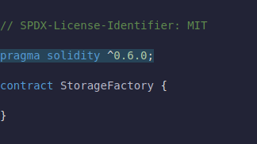
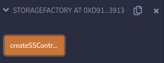
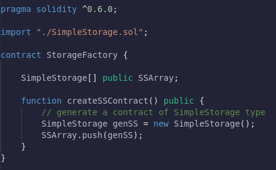
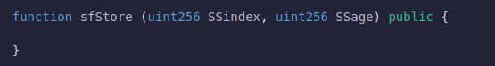
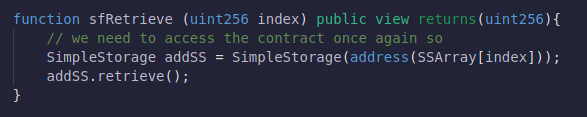

## **Storage Factory**

We've got our first contract out of the way.We're understanding some of the basics of solidity.Now let's move onward into a little bit more advanced with our smart contract and let's build "Factory Pattern" of smart contracts.

**Factory Pattern**

We have our SimpleStorage contract which allows us to store age and age associated with different people. What if though I wanna have a lot these SimpleStorage contracts deployed? I wanna give poeple the ability to generate and deploy their own lists based off the SimpleStorage contract.

This is where a Factory Pattern comes into play.

**New contract StorageFactory**

Let's go ahead and create a new contract called StorageFactory.sol in the same location where SimpleStorage file lies.SimpleStorage and StorageFactory needs to be in the same folder.

Let's figure out how to get a contract to actually deploy another contract.We're gonna add those basics pieces that we added in that SimpleStorage contract.

**Import 1 contract into another**

So how can this contract deploy a SimpleStorage contract?

well first thing we're gonna do is actually import SimpleStorage into our StorageFactory contract.We need to import it so that our StorageFactory contract knows what a SimpleStorage contract even looks like.The way we can import it is:

Importing with that line is equivalent to copying everything in SimpleStorage.sol file and pasting it above in StorageFactory file.

It's interesting about having two contracts in the same file is that when you go to deploy, you'll actually have a choice of which one you want to deploy.

**Deploy a Contract from a Contract**

If we want this contract to be able to deploy a SimpleStorage contract we're of course have to create a function that can do that.

We're going to create an object of type SimpleStorage contract, name it "genSS" which is going to be a new SimpleStorage contract.SimpleStorage contract takes no input parameters.

If we deploy this contract as is by going to our deploy tab, choosing the StorageFactory and deploying.

We've the function that doesn't return anything.We're creating new contracts but can't really read where those contracts are being created.We'd have to look on a block explorer like Etherscan.

**Track simple storage contracts**

Let's make a way for us to keep track of all the different SimpleStorage contracts that we deploy.We put then in a list or an array.

We create a SimpleStorage contract array of visibility public and named it "SSArray".And Everytime we create SimpleStorage contracts, we'll add to our SSArray.

Let's see what happens when we deploy.

We've blue button which stands for our SimpleStorage contract array.If I click createSSContract, I've created a transaction that's going to create a new SimpleStorage contract and push it onto our SSArray.If I try to access 0th index, I'll get the address as shown in above picture.This is the address that the SimpleStorage contract was deployed to.

We've successfully deployed a contract to the blockchain from another contract.

**Calling Store & Retrieve Functions from SF**

We can do more than just deploying the contracts.We can deploy contracts from another contract and call those functions as well.

Let's create a function where we call store function and retrieve function of SimpleStorage contract from StorageFactory contract.

The reason I'm chosing a index is because we're going to choose which SimpleStorage contract in our list that we want to interact with.Then we're also gonna pass a age to call on the store function(it takes age as a parameter) of SimpleStorage contract.

**Address & ABI**

Anytime that you interact with a contract you need two things.
- You need the address of the contract you wanna interact with.
- ABI (Application Binary Interface)

for us we figured that out that we're going to push and get the address from the SSArray.We can get the ABI from the import command.We'll go into ABI later.

In order for us to interact with SimpleStorage contract, we can just do:

We created a SimpleStorage object (addSS) which stores the address of the contract that we wanna interact with.Then we pass the age by calling the method for that contract (same like in OOP) to store the age.

Let's see what happens when we deploy.

CreateSS contracts creates the contract and adds into our array "SSArray".
sfStore which stores an age to one of the contract present in SSArray.
SSArray shows the address of the contract.

**Adding Retrieve Function **

We can't see the age because we didn't add retrieve functionality.So let's add that.

index as a parameter is used to choose a contract on the SSArray and return it's age.Since we're only reading state so it's a view function.And we can return that object("addSS") retrieve method(like in OOP).

**Compiling**

If we compile above code and deploy SimpleFactory contract.We'll have sfRetrieve function which retrieves the age of the contract present in SSArray.

**Making the Code lil bit Simpler**

We can actually even refactor the code to be a little bit simpler.We don't need to save SimpleStorage contract address into it's object.We can directly call retrieve method and return that.Same goes for our sfStore too.

This is a way for us to actually deploy contracts and interact with contracts from another contract.

**Additional Note**

To deploy a contract we do need all the functionality of that contract imported.However to interact with the contract we don't need all of the functionality.We'll learn about interfaces in the next lesson which will allow us to actually interact with the contract without having all the functions defined.

**Inheritance**

SimpleStorage has got really cool functions and maybe I want all the functions inside StorageFactory.I want my StorageFactory to create SimpleStorage contracts  and I want it to be a SimpleStorage contract itself.

Well my StorageFactory can actually inherit all the functions of SimpleStorage without me having to copy paste all the functions and variables over to StorageFactory.

I could do solidity's version of Inheritance.

Just by doing that line of code, my StorageFactory contract now will have all of the functions and variables of SimpleStorage.

Let's deploy the inherited contract.

Not only do we have all the functions originally defined in our StorageFactory but we aditionally have all the functions from the SimpleStorage.

**Recap**

- We learned to import entire chunks of code from other files into our files.
- We learned how to do inheritance.
- We learned how to deploy contracts from another contract.
- We learned to interact with different contracts from outside of our contract.

