**Safemath & Integer Overflow**

Since we're on the topic of math, let's talk briefly about some of the pitfalls of solidity especially when it comes to math.

Prior to solidity 0.8 if you added to the maximum size, a uint number could be wrap around the lowest number that it would be.For example:

if we add two uint8 number :
255 + uint8(1) = 0
255 + uint(100) = 99

This is because integer can actually wrap around once they reach their maximum cap.They basically reset.

This is something we need to watchout for when working with solidity.If we're doing multiplication on really big numbers, we can accidentally pass this cap.Luckily as a version 0.8 of solidity, it actually checks for overflow and it's defaults to check for overflow to increase readability of code even if that comes a slight increase of gas costs.

Just be aware if you're using a lower version that 0.8 you're going to have to do something to make up for this.

We could write whole bunch of code to check all of our math or we could just import "SafeMath" from another package.Similar to chainlink we can import SafeMath from tool called OpenZeppelin.

OpenZeppelin is a open source tool that allows us to use a lot of already pre-built contracts.

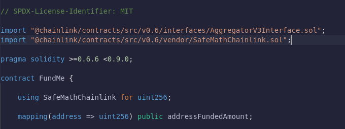

**Libraries**

Libraries is similar to contracts, but their purpose is that they are deployed only once at a specific address and their code is reused.

Using keyword:
The directive using A for B; can be used to attach library functions (from the library A) to any type (B) in the context of a contract.

In this case we're attaching a SafeMath chainlink library to uint256 so that these overflows are automatically checked for.

This is for those of you who are familier with SafeMath and integer overflows and underflows.We're not going to be calling the functions that SafeMath provides us like div, add, mull all those functions.Simply because in 0.8 moving forward we no longer have to use those.We can just use regular operator like '+' & '-'.

**Setting Threshold**

We know have a way to get the conversion rate of whatever eth is sent and turn it into USD.Now we can set a threshold in terms of USD but how do we guarantee that whatever amount that the users send when they call fund is going to be atleast 50$.

First set the minimum value by:

**Require statement**

Now that we have a minimum amount how do we actually make sure that this minimum amount is met in the value they send us?

We could do that by:

When a function call reaches a require statement, it'll check the truthiness of whatever require you've asked.In our case the converted rate of msg.value needs to be greater than or equal to our minUSD.If they didn't send us enough ether then we're going to stop executing.    

**Revert**
If the converted rate of msg.value is less than 50$, we're going to stop executing.We're going to kick it out and revert the transactions.This means user gonna get their money back as well as any unspent gas and this is highly recommended.We can also add a revert error message.   

**Deplying & Transaction**

Let's go and deploy the contract.If I try to fund less than 50$, below error message will be displayed.

The contract isn't even letting us to make the transaction.Whenever you see gas estimation failed errors usually that means something reverted or you didn't do something that was required.

**Withdraw Function**

Now we can fund this contract with a certain minimum USD value.You'll notice though that right now we don't do anything with this money.We're going to fund this contract however that's it and we don't have a function in here to actually withdraw the money.There's no way even though we just sent this contract some money.There's no way for us to get it back.How do we fix this?We could add a withDraw function.

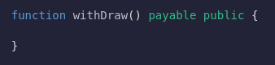

This is also going to be a payable function because we're going to be transferring eth.

**Transfer , Balance , This**

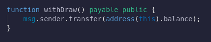

Transfer is a function that we can call on any address to send eth from one address to another.In this case we're transferring ethereum to msg.sender.We're going to send all the money that's been funded.So to get all the money that's been funded, we did `address(this).balance`

this is a keyword in solidity.Whenever you refer to "this", we're about contract that you're currently in and when we add address of this we're saying we want the address of the contract that we're currently in.

Whenever we call an address and then the balance attribute, you can see the balance in ether of a contract.So with that line we're saying whoever called the withdraw function because whoever calls the function is going to be a msg.sender transfer them all of our money.

**Deploying**

Let's fund the transaction with lots of ether.We fund it with one whole ether, hit the fund button and we're sending 1 whole ether into this contract.If we look at our balance it's will get down by 1 ether.Let's try to get it back.If we call withdraw function, once the transaction goes through we should get all of our ether back.

**Owner , Constructor Function**

Maybe we don't want anybody to be able to withdraw all the funds in this contract.We want only the funding admin to be able to withdraw funds so how do we set this up in a way that only the contract owner can actually withdraw funds?

Well we learned before that the require function can actually stop contracts from executing unless some certain parameters are met.We can do the same thing here with:

`require msg.sender = owner`

But we don't have an owner to this contract yet.How do we get an owner to this contract the instant that we deploy it?

We could have a function called createOwner but what happens if somebody calls this function right after we deploy it then we wouldn't be the owner anymore.

So we need a function to get called the instant we deploy this smart contract and that's exactly what the constructer does.So typically at the top of your smart contracts, you'll see a constructor and this is a function that gets called the instant your contact gets deployed.

**Deploying**

Let's deploy the contract now.We can see our address as the owner of the contract.

After we've owner, we can go to withDraw function and set the require statement.

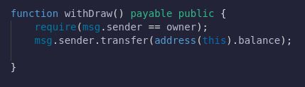

After we deploy again, if the contract has same address that deploy to withdraw, only then it'll successfully withdraw.

**Modifiers**

We can now require this withdraw function is only callable by the owner.Now What if we have a ton of contracts that want to use `require(msg.sender == owner)`?IS there an easier way to wrap our functions and some require or some other executable?

This is where modifiers come in.We can use modifiers to write in the definition of our function, add some parameter that allows it to only be called by our admin contract.

Modifiers are used to change the behaviour of a function in a declarative way.Let's create our first modifier:

What a modifier is going to do is before we run the function do the require statement first and then wherever your underscore is in the modifier run the rest of the code.

Now what we can do is make the withDraw function as admin.What's gonna happen is before we do the transfer, we're actually gonna check the modifier which runs the msg.sender == owner. 

**Deploying**

Let's deploy the contract in JavaScript VM, we can call withDraw from the address of the deployed account only.

**Resetting the Funders Balances to Zero**

The only thing that we're really missing is that when we withdraw from the contract, we're not updating our balances of people who funded this?So even after with we withdraw this is always gonna be the same.We need to go through all the funders in this mapping and reset their balances to zero but how do we actually do that?

**For loop**

We can actually loop through all the keys in a mapping.When a mapping is initialized, every single key is essentially initialized.We obviously can't go through every single possible key on the planet.However we can create another data structure called "Array".

Let's go and create a funders array that way we can loop through them and reset everyone's balance to zero.

**Summary**

- Right away when we deploy this we're set as owner.
- We can allow anybody to fund.
- They have to fund it with minimum USD value that we actually set.
- Whenever they fund we keep track of how much they're funding and who's been funding us.
- We can get the price of Ethereum that they send in the terms of USD.
- We can convert it and check to see if they're sending us the right amount.
- We have our admin modifier so that we're the only ones who can withdraw from the contract.
- When we do withdraw everything from the contract, we reset all the funders who have currently participated in our crowdsourcing application.

**Deploying & Transaction**

Let's see if everything works end to end.If we fund 0.1 eth to the contract, and we look at the 0th index of funders, we'll see the address that funded the contract.Even other account could fund the contract.

**Forcing a Trasacttion**

Let's try to be malicious.Let's have another account withdraw all the funds in here.If another account clicks withdraw function, the transaction will fail.We're relentlessly malicious we want to send the transaction regardless so even though I'm not the admin of the contract I've gone ahead and still tried to send those withdrawl.So what happens now?

We'll see remix saying something went wrong.

## Libraries

We've got a great way to actually start funding our contract but our code looks a little bit messy.We've got couple of different functions for getting the price and working with the prices.

Is there a way to make a math alot easier to use?

This is where we're going to introduce the concept of `Library`.Libraries are similar to contract but you can't declare any state variable and you can't send ether.We can also use libraries to add more functionality to different values.Well we can have `convert` to be a function of uint256.We could do something like:

`msg.value.convert()`

We can add functions as if uint256 was an object or a struct or contract that we actually created.

Let's create a new contracts in our contract folder "PriceConverter.sol".It's going to be a library that we're going to attach to uint256.

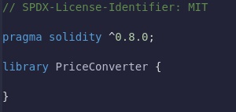

Libraries can't have a state variables, they also can't send ether and all the functions in the library are going to be internal.So we can go back to FundMe.sol, we can grab getVersion, getPrice and convert and paste them into our library.Since we're using AggregatorV3Interface, we can copy the import.All the function inside of our library needs to be internal and we're going to make library PriceConverter different functions to call on uint256.For example we will be able to do `msg.value.convert`.We're going to directly be able to get the conversion rate of the value of a uint256 as if that was a function for a whole time.

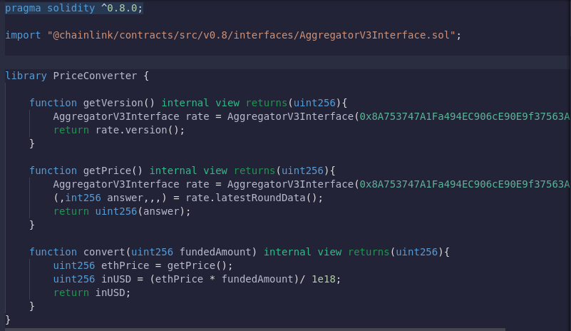

Now that we've library PriceConverter, back in our FundMe we can now import this PriceConvereter and attach it to uint256.

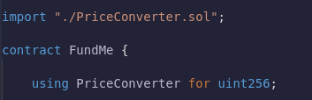

Now in our library the first variable that gets passed to the function is going to be the object thats going to called on itself.

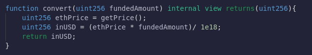

So in FundMe.sol we could do:

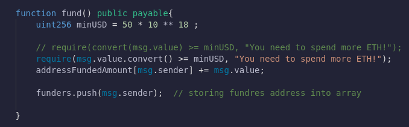

If we wanted another variable in convert function then we'll only pass second variable as an argument.

`msg.value.convert(second_variable)`

In doing this we've minimized our FundMe contract alot by moving alot of that math in PriceConverter library.

After resetting the array, we need to withdraw funds from the contract.To actually send ether, there're actually three different ways.
- transfer
- send
- call

Let's go ahead and start with transfer.Transfer is the simplest and at surface level makes the most sense.So if we wanna transfer the funds to whomever is calling the withdraw function, we would do:

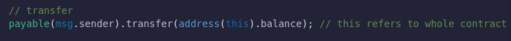

msg.sender is of type address where as payable(msg.sender) is of type payable address.In solidity inorder to send the native blockchain token like ethereum, we can only work with payable addresses to do that.

There're some issues with transfer.Our transfer function is capped at 2300 gas and if more gas is used, it throws an error.

Next one that we're using is going to be send which is also capped at 2300 gas and if it fails it returns a boolean.In transfer is code fails, it will error and revert the transaction.With send it won't error.It'll return a boolean of whether or not it was successfull.

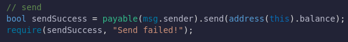

This way if this fails, we'll still revert by adding our require statement.Transfer automatically reverts if the transfer fails.Send will only revert the transaction if we add require statement.

Call is going to be a lower level command that we actually use in our solidity code because the call function is incredibly powerful and we can use it to call virtually any function in all of ethereum without even having to have the ABI.We'll leraned the advance way to use call much later.

Call is going to look very similar to send.

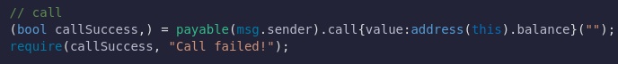

Inside call we'll put any function information or any information about the function that we wanna call on some other contract.We actually didn't wanna call function so we left it as blank by putting quotes("").It means we wanna use it like transaction.We're going to use call function as its a regular transaction so we can add stuff like msg.value.

Call function returns two variables, so we placed them inside the parenthesis.Two variables it's going to return is boolean and bytes object.Since call allows us to call different function, if that function returns some data or returns value, we'll save that in the bytes object.It also returns boolean to indicate function was successfully called or not.In our code we're actually not calling a function so we just use `,`.

Using call is the recomended way for most part to actually send and recieve blockchain native token.

We've completed all the basics.We're using a library and chainlink smart contracts to build some of the most powerful applications.We learned to use a library for any type we wanted. We're going to go through our code and make a number of tweaks. We're going to do a little more advanced solidity.

## Advanced Solidity Immutable & Constant

We're going to modify the contract to make it look a little bit more professional. We're going to look at some of the variables in the contract.In particular `owner` and `minUSD`.Owner gets set once in our contract and it never changes again. minUSD gets set once, even outside of the constructor. If we've got variables that only get set once, we can actually use some tools in solidity to make them more gas efficient.

For now, let's compile our FundMe contract and then deploy it to the JavaScript VM. Remember, we can deploy it. However, fund and withdraw isn't going to work because we don't have a chainlink network on our JavaScript VM. But we do care about how much gas it actually costs to send.

Right now we're creating this contract for about `seven hundred thirty nine thousand of gas, and we're going to add a couple of tricks to bring this number down. The two tricks that we're going to learn are the `constant` keyword and the `immutable` keyword. If you assign a variable once outside of a function and they never change it, you can add the constant keyword.

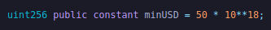

When you add a constant keyword, the minUSD no longer takes up a storage spot and is much easier to read. So now recompile it and deploy it to see if we saved any gas.

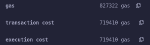

Wow, we saved almost 20 thousand in gas. It almost cost as much gas as it cost to send ether. Typically, constant variables have different naming conventions. Typically, you want them to be in all caps.

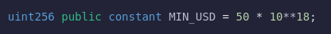

If we go ahead, compile the code and re-deploy. Even though MIN_USD is a view function, view functions do have a gas cost when called by a contract.

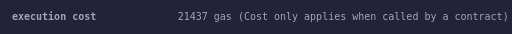

We can see the execution cost is `21437` gas. If we remove the constant keyword and re-deploy it.

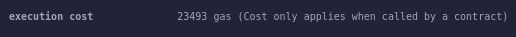

We can see that the gas price has indeed increased, i.e. 23493 gas. In a more expensive chain like ethereum, it's going to make a lot more difference.

So let's keep the constant keyword there.

Another variable that we set once is the owner variable. Variables that we set one time but outside of the same line where they're declared, we can mark as `immutable. Typically, a good convention for marking immutable variables is:

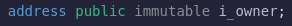

They have very similar savings to constant keywords. Owner, of course, isn't the variable that we can't set on declaration because inside global scope there's no msg.sender. There's only going to be msg.sender when we're inside of a function.

The reason that these two save gas is that instead of storing these variables inside of a storage slot, we actually store them directly into the byte code of the contract.

**Custom Errors**

How else can we make this contract a little more gas efficient?

Well, one of the ways is by updating our requirements. Right now, with our require statements, we have to store the error message as a string array.

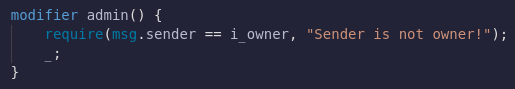

Every single one of these characters in this error log needs to be fixed individually. This string may not seem very big, but it's a lot bigger than the alternative to what we can do. As of 0.8.4 of solidity, you can now actually do [custom errors] (https://blog.soliditylang.org/2021/04/21/custom-errors/) for our reverts. We'll just call the error code as opposed to calling an entire string associated with the error.With all of our required statements, we can create custom errors.

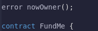

Now we can take this code and instead of doing require, we'll do an if statement.

This ends up saving lots of gas since we don't have to store and emit error messages.

In a lot of code today, you'll see require in a lot of places because these custom errors are pretty new in solidity. This revert keyword does the exact same with like require without the condition before hand.

**Receive & Fallback**

Sometimes people will try to interact with the contract that takes ethereum or the native blockchain token without actually going through the required function call. For example, on a JavaScript VM, I could actually send this contract money without calling the fund function. However, if I were to do that, what would happen?

Will our fund function get triggered? No.

We want to keep track of the funder, but we wouldn't have that person's information updated in the contract. So later on, we decide to give a reward, but we wouldn't know about those funders. Also, this wouldn't be great because people would send us money without us ever knowing. We wouldn't be able to give them credit.

Additionally, maybe they called the wrong function by accident and weren't using metamask, which is the tool that tells them the transaction is likely to fail. So what can we do in this case?

`What happens if someone sends this contract ETH without calling the fund function?`

Right now, if we were to send this FundMe contract ETH, it would just go to the contract. But there's actually a way for us to trigger some code when people send money to this contract or when people call a function that doesn't exist. "Solidity has two [special functions], receive and fallback (https://docs.soliditylang.org/en/v0.8.14/contracts.html?highlight=fallback # special-functions).

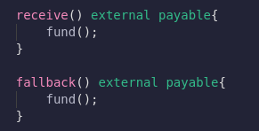

Now if somebody accidentally sends the money without calling our fund function, it'll still automatically route them over to the fund function.This means too, if someone doesn't send us enough funding, that transaction still gets reverted.

Now if we deploy the contract in actual testnet and copy the deployed contract address and from our metamask we can directly send the contract money without calling fund function.But we made recieve function which will trigger the fund function.

If they directly call fund function it's going to cost little less gas.

