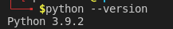
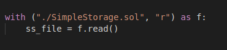
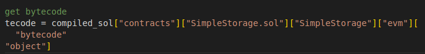
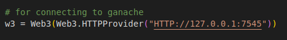
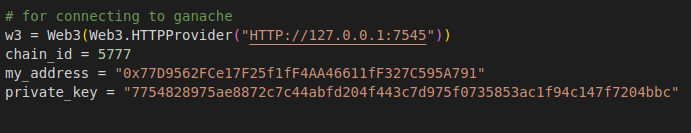
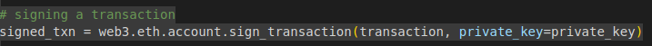
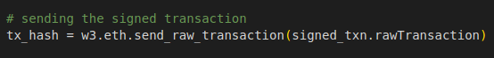

## **Python**
We've been working with remix so far to start our smart contract in our solidity development journey.Remix is an incredibly powerful web IDE .Remix should always be the starting ground for anybody looking to start their smart contract journey because it's a wonderfully friendly way to really show what's going on behind the scenes and it's easy to see everything we're doing with ethereum, chainlink and our smart contracts.

**Limitations of Remix**

- Can't integrate other parts of a project.
- Limited support for tests or custom deployments.
- Can't save files locally without a plugin.
- Any custom functionality requires a plugin.
- Needs an internet connection.
- Doesn't have python.

In order for us to deploy, test and automate everything about our smart contract development cycle, we want to connect our solidity and our smart contracts with more traditional programming language like python.This way we can customize our entire development environment in any way we like.

First we'll learn to work with `web3.py` which is an incredibly powerful python package for doing everything we wanna do with smart contracts.After we learn some basics of web3.py, we'll move on to `brownie` which is a smart contract development framework built on top of web3.py which makes our life even easier.However it's really important to learn web3.py because this will teach us what's going behind the scenes of brownie.

**VScode , Python , Solidity Setup**

For the rest of the journey I'm going to be working with visual studio code which is an incredibly powerful text editor that will give us a lot of formatting and a lot of really nice tools to work with deploying and interacting with our smart contracts.

You can download VScode [here](https://code.visualstudio.com/).

extensions to installed:
- python3
- solidity

**VScode features**

One of the amazing things about VScode is you can actually open a terminal up inside a visual studio code. You can go over to the top bar to terminal and select new terminal.

You can actually hit `ctrl` + `(backtick)` to toggle back and forth between having terminal open and closing it.

**Testing python install & Troubleshooting**

We can test in terminal to see if python is installed correctly.If we type `python --version`, you should get something like:

If it doesn't work you can look for troubleshoot in google.Whatever the error you've, you'll get a link which will lead you to the answer.

**Creating a new folder**

In our terminal we can create some folder.You can create one by doing:

`mkdir folder_name`

and to go inside the folder:

`cd folder_name/`

**SimpleStorage. sol**

We'll be working with SimpleStorage again the exact same contracts but instead we're going to be using web3.py.

We want our visual studio to know that we're in the folder where we wanna work.We can click files icon, click open folder and open the folder that you wanna work in.

**Remember to save**

Now the file is in VScode, we can see we've little dot here.

Whenever you see that dot, it means that your VScode file isn't saved.We wanna always save it otherwise when we compile, things might not work correctly.

We can see there's line under pragma.It's VScode way of telling there's an error at this position.This is just the extension being a little bit confused.We can safely ignore this but if it's really bothersome you can:

`right click it and do something like solidity change global compiler version` or 
`go to perferences then settings.Type solidity and change the remote compile version to 6.0.6`

Also we wanna fave format on save as checked.This allows to format our code whenever we save the code.

**Python Formatter & settings**

First thing we're gonna do is installed a black python formatter.To install it type this command in terminal:

`pip install black`

search for python formatting and set formatting provider to 'black'.

**Author's recommended Settings**

It's highly recommended to have both format on save for both python and solidity. 

**working with python**

Let's go ahead and create a new file and we'll call it deploy.py.

**Reading our solidity file in python**

First thing we wanna do is read SimpleStorage solidity file.We need to get the solidity file into deploy scripts so that our python file knows what it's going to deploy.

**Keyboard Shortcuts**

To look at keyboard shortcut's you could hit `ctrl` + `p`, add `>` type `keybord shortcut references` to see all the shortcuts reference.It'll bring to the keyboard reference page based off of what OS you've.

**Py-Solc-x**

Now that we can actually read from our SimpleStorage.sol file we actually have to compile it because back in remix every single time we did anything with our files, we'd to compile them first.We need some compiler in python.Luckily there's a fantastic python package called `Py-Solc-x`You can install it by:

`pip install py-solc-x`

**Importing solcx**

The way we can use it is by importing it into our python file.

**Compiled_sol**

We're going to save our compiled code to compiled_sol variable.

We're not gonna go too deep into what's this settings and output selection are actually doing but if you want to learn more you can go to the homepage of [pysolcx documenation](https://solcx.readthedocs.io/en/latest/).

You'll see we get the massive object which has whole bunch of basically unreadable pieces but that are the low level code that actually gets compiled whenever we use the compiler in remix or in python.

Remix actually does the exact same thing.Once we compile our contract, you can actually copy the byte code.You'll see whole bunch of stuff.There's also a `opcode` which are low level code that the contract are actually doing that actually governs how the code works.

You'll also see ABI which we're gonna output in our deploy.py.If you copy and past the ABI in new file, you'll see long json object.It explains all the functions and variables.It's a lowest digestible way to say here's where all the functions are,here's what the parameters types are, return type gonna be and everything like that.

**Saving Compiled Code/writing**

This takes our compiled_sol json variable and dump it into the `compiled_code.json` file.It's going to keep it in the json syntax.

**Deploying in Python (Bytecode , ABI)**

We've compiled our solidity and stored our solidity code to compiled_code.json file.Now we probably want to deploy it and test it out.So how do we actually do it?

First we actually get the byte code.We need the bytecode of the file so that we can actually deploy it.

Now that we have out byte code we also need ABI.

Now we've two main pieces to deploy, all we've to do is deploy.

**Which Blockchain/Where to deploy**

The question that becomes is where are we gonna deploy it to.Which blockchain are we going to deploy to?In remix when we're first playing around, we're using a JavaScript VM, we absolutely could and we'll learn to deploy to a testnet because that's going to be the same way that we're going to deploy to a mainnet.But before we do that we should learn how to deploy on a simulated environment.

**Ganache Chain**

This is where `Ganache` going to come to the rescue.Ganache is a simuated blockchain that we can actually use to deploy our smart contracts to and have it interact like it's a real blockchain.Ganache is going to allow us to spin up our own local blockchain.

You can download Ganache from [here](https://trufflesuite.com/ganache/).

User interface is really nice because it allows us to do one click blockchain or create our own local blockchain.That means this blockchain isn't connected to any other blockchain out there but it'll act like a blockchain and will be lot faster than us having to interact with a testnet and we control the entire blockchain because it's only one node.Ganache is our JavaScript VM.

**Ganache UI**

We go ahead and click quickstart which will automatically upload and get started with our own local fake blockchain.

You can even see it gives us some accounts.Each one of these addresses has a private key.In your ganache if you click key, it'll show key.

Let's learn how to connect to this ganache blockchain from the UI first and then we'll learn how to do the command line version.

**Introduction to Web3. py**

This is when we finally start working with web3.py.we just do below command in VScode terminal:

`pip install web3`

Now we can start working with web3.py.

**Http/Rpc provider**

To connect the contract to blockchain we choose http provider.If we look at ganache instance, we've rpc server which has the url HTTP://127.0.0.1:7545.This is the url that we're going to use to connect to this blockchain.In remix we're actually using our metamasks directly to connect to the blockchain.However we wanna connect directly to our simulated blockchain.

**Connecting to Ganache(RPC server,Documentation,Chain ID,address,Privatekey)**

With everything that we show you, you probably going to want to get really familier with the documentation because even after being a pro, you're going to want to use it more and more and more if you want to learn about other providers.You can go to providers page of the documentation. 

The next thing that we always gonna need is `chain id` or `network id`.What is the id of the blockchain? For ganache it's 5777.We also need address.We can grab fake address to work with.

Similar to how in remix when we working with the JavaScript VM we're given a bunch of fake addresses.We're doing the same thing but with ganache.Then we also want our private key.We need the private key to sign our transactions.

Whenever you add a private key in python, you need to add `0x` to the front.Python is always gonna look for the hexadecimal version of the private key.

Now we've all the parameters we need for interacting with and connecting to our ganache local chain.

**Deploy to Ganache**

It's time to finally deploy our SimpleStorage.sol contract.Let's do it.So the credit contract that we're going to deploy with web3.py.

Does this mean we've deployed it ?Well no this just means we've a contract now.We've created a contract object.

How do we actually deploy this?

**Building a Transaction**

we need to actually build our transaction because again whenever we interact with the blockchain, whenever we make a state change and in our case we'd be deploying a contract we're going to make a state change So we need :
- Build the contract deploy transaction
- Sign the transaction
- Send the transaction

To do all that we need to talk about `Nonce` thing.

**Nonce**

Remember way back in our blockchain demo when we used a nonce to solve the answer to that really difficult mining problem.Well defination of nonce is just a word coined or used for just one occasion and in cryptography it's an arbitrary number that can be used just once in a cryptographic communication.The nonce that is used to find the answer is going to be different from another nonce that we're actually gonna need to make our transaction.

If we look at our metamask, look at our activity and look at one of the transactions we've made recently on etherscan, we can see nonce here as well.

This nonce is the number of transaction that our account has actually made.Everytime we make another transaction, our transaction is hashed with a new nonce.This is what going on behind the scenes with our transaction and we need this to send our transaction.

**Getting Nonce**

We can actually get our nonce by just grabbing our latest transaction count

 
 
We'll get our ans as 0 if we print the nonce because on our local blockchain the address we're using hasn't been used before.

**Create a Transaction**

Let's create a transaction object.

As you might have pointed out our SimpleStorage.sol doesn't actually have a constructor.Every contract technically has a constructor.In our case it's just blank.We're not telling our SimpleStorage.sol to do anything.

**Transaction Parameters**

In web3.py we need to give atleast a  couple of parameters.We always have to give `chainId`, `from` and `nonce`.

If we print the transaction, we could see even more parameters.We have `value` which is the ether that we're going to send, `gas`, `gasPrice` which we can arbitrarily set if we'd like, `chainId`, `from`, `nonce`, `data` and `to` which is just empty because it's sending it to the blockchain.

The giant data object there is encompassing everything that's happening in SimpleStorage.sol.

**Signing Our Transaction(signed_txn)**

This is just a transaction and anybody could actually send the transaction as long as it's signed by them.So we've the transaction but we need to sign it from somebody.Since we're sending it from our address, our private key is going to be the only key that's going to work to sign the transaction.

Remember when we were talking about public private keys, we right now have a message that is defining how to deploy SimpleStorage but it's not signed yet.So we're gonna need to use our private key to sign it to create unique message signature that we're the only ones that can create the private key but anybody else can verify it was us who signed it.

If you encounter the following error:
- [Transaction must not include unrecognized fields](https://stackoverflow.com/questions/70458501/typeerror-transaction-must-not-include-unrecognized-value-solidity-python)
- [ValueError: Method eth_maxPriorityFeePerGas not supported](https://stackoverflow.com/questions/70104101/valueerror-method-eth-maxpriorityfeepergas-not-supported-web3-py-with-ganache)

**Never Hardcode your Private keys**

It's a really bad practice if you push the code to source or github.Somebody else can see your private key and steal all your funds.So we don't wanna hard code our private keys in our code like we're doing here.

Let's take this time to talk about environment variables and how to set them.

**Environment variables**

Environment variables are variables that can set and then we set in our terminal and in our command lines.Following is a way to set an environment variables in MacOS and Linux only.Don't worry we'll show a way to make an environment variable in windows as well.

You can set an environment variable by running something like:
`export PRIVATE_KEY = 0x63b38f9ed50c65b9e48595d8a4b0e398559d2317d3d20ff05162895e4b6ef547`

Now if you type `echo $PRIVATE_KEY`, it'll display the private key.

Setting environment variables with windows the process that we're going to do is actually a little bit different.You can check this [link](https://www.youtube.com/watch?v=tqWDiu8a4gc&t=40s&ab_channel=Twilio) for setting a environment variable in windows.

**Limitations of Exporting  Environment Variables**

It's important to note that this export method we're doing here for creating a environment variables only works for the duration that our shell is live.If we were to close out of our shell and then reopen it, our environment variable that we set would be gone.We'd have to re-run that export command. 

We're gonna show you a way to set environment variables so that you don't have to keep doing that.

It's also not great to have in a plain text on your computer.However it's alot better than hard coding it into our script.

**Private key PSA**

Remember if you're using an account that has real money in it which I highly recommend you don't do, don't send this environment variable or private key or any of the code anywhere because then people can steal all of your funds.Once we move to brownie we'll show you more effective way for private key management but for now be cautious here.If you've followed along and set up a brand new account that has no real money and only test that money in it then great who cares because it's test and fake money anyways.

**Accessing Environment Variables**

We can actually access the environment variable in Python.To create an evn variable:

`export PRIVATE_KEY="your_private_key_without_double_quote"`

to view the key
`echo $PRIVATE_KEY`

to retrieve using python:

**.env file, .gitignore, pip install python-dotenv **

Other thing we can do is create a `.env` file.A .env is typically where people store environment variables.It's important to not push this to source if this is what you're going to do.In this .env file in python, we could do:

`export PRIVATE_KEY="0xyour_private_key_without_double_quote"`

If you're going to do this way always set .gitignore and make sure .env is in there.This will help make it harder for you to accidentally push your .env folder or file to github.

**load_dotenv()**

Python actually has a way of loading directly from a .env file without having to export on our environment variables or run source.env or export or really anything.We can do it with python.env package.

If we close our shell and reopen it, run echo and the saved variable we'll get none.If you run python deploy.py, it's print none as our private key.However we can use `dotenv` to pulled it directly from our .emv.We could do:

`pip install python-dotenv`

load_dotenv() looks for .env file and automatically imports it into our scripts.

If we print our signed_txn, we could see a signed transaction.This is exactly what happening when we were looking back at public private keys.We are signing a transaction that is actually deploying a contract to the blockchain that anybody can easily verify.

**Sending the signed Transaction**

We finally have our signed transaction.We want to send this to the blockchain so it can actually deploy.

**Deployment**

This will send our transaction to the blockchain.Now if we look at our local ganache and we look at transaction right now, we can see that a transaction actually did go through.

