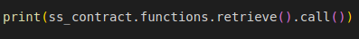

**Block confirmation(wait_for_transaction_reciept)**

One other thing that's really good practice whenever sending a transaction is we wait for some block confirmations to happen.

This will have our code stop and wait for this transaction hash to go through.

**interact/work with thee contract**

We've deployed the contract but how do we actually interact and work with the contract.Let's start doing that.When working with contracts, working on chain, we always need to things.
- Contract Address
- Contract ABI

**Address & ABI**

We need to make new contract object to work with contract.Let's go ahead and create that SimpleStorage contract so we can actually interact with it.

We've address and the abi we can start interacting with the contract exactly as we did in remix.

**Retrieve() , Call & Transact**

Let's do a print statement to get that initial value that is returned from our retrieve function.It should be initialized to zero.

We get this function retrieve bound to in these parentheses.What's going on?

**Call Vs Transact**

When making transactions in the blockchain, there's actually two different ways that we can interact with them.We can interact with the call or with a transact.When we use a call, this is just to simulate making the call and getting a return value.Calls don't make a state change to the blockchain.It's similar to how in remix we would call the blue buttons and nothing on the blockchain would actually change.We can actually also call orange buttons and just not actually make a state change.Remix defaults the blue buttons to be calls and orange buttons to be transacts.In python we can actually pick which one we want to do.

A transact call is when we actually make a state change and this is when we actually have to build a transaction and send a transaction.You can always just call a function no matter what that function is but just keep in mind you won't make a state change.You can also always transact on a function even if it's just a view and this will attempt to make a state change.

Something like retrieve even if we transact on it, it won't make a state change.

If we run this, you'll see we do get the zero because now we're actually calling the transaction.

**Store function**

We've our initial value for our retrieve function.Let's try to update the age using store function.

We know that the store function is orange and we'll make a transaction but if we wanted to we can even just use call on it.

When we send this,it'll return a blank because the store function has no return typr.If we give it a return(uint256) and return an age, you'll see the age returned back.

If we go to the ganache you'll see that we keep making whole bunch of different contract but none of these are contract interactions.That's because we call a function.We just simulate working with it.If we call retrieve again right afterwards, you'll see that it's still zero.

**Creating Transaction(Store_transaction)**

Let's build a new transaction to actually store some value into this contract.Since we want to make a transaction, we gotta go through the same process as we deployed the contract.

**Signing Transaction(signed_store_txn)**

Now we've the transaction let's go ahead and sign it.

**Sending Transaction(send_store_tx,tx_receipt)**

Then ofcourse we need to send it.

**Deployment**

Let's run this.Alright we still have the print function printing out the current value of retrieve.Let's go over to ganache and see if there's anything different here.

There is instead of all the contract creations, we now have a contract call.If we call our retrieve function again, it'll print out new updated value.

**ganache-cli**

Ganache UI is really nice because we can see alot of things that are going on.However it's a little tricky to do alot of progammatic stuff.Oftentimes engineer will use what's called a command line interface of ganache.

We're going to use the ganache-cli and this is what brownie is going to use on the backend when we move to brownie.Let's learn how to do that.

**install Nodejs**

In order to use the ganache-cli, first thing we need to do is download node.js.You can come to this [download page](https://nodejs.org/en/download/) and choose your OS and download it accordingly.

**install yarn**

Next we're actually going to install yarn.Yarn is a package manager.similar to pip which allow us to actually download pieces and packages like the ganache-cli from the package repository.

We can install it with:

On Debian or Ubuntu Linux, you can install Yarn via our Debian package repository. You will first need to configure the repository:

`curl -sS https://dl.yarnpkg.com/debian/pubkey.gpg | sudo apt-key add -
echo "deb https://dl.yarnpkg.com/debian/ stable main" | sudo tee /etc/apt/sources.list.d/yarn.list`

Then you can simply:

`sudo apt update && sudo apt install yarn`

Then we want to install actual ganache-cli.We're gonna be installing it with yarn.so to install this:

`yarn global add ganache-cli` on a terminal.

This will install ganache-cli as a global command in our terminal.We can test to see if we've done it right.

**Run ganache cli , ganache documentation**

We can test the ganache-cli by running `ganache-cli --version`.

If this didn't work our for you then you can install using npm:

first install npm: `sudo apt-get install npm`

then install ganache-cli: `npm install -g ganache-cli`

If you've your ganache UI open, please close it otherwise it'll conflict.So to run a local blockchain from the command line all you need to do is :

`ganache-cli`

and the node will start running directly in the terminal.If you scroll up, you can see lots of familier pieces.

We can see the available accounts just like on the UI and whole bunch of different private keys.This ganache spins off with bunch of random addresses and random private keys.If we wanted to always spin up with the exact same private keys so we don't have to update our private key every time, we can do :

`ganache-cli --deterministic`

This way we'll always get the exact same private keys and the exact same addresses.You can check out the documentation to see bunch of other flags that you can use to run this and you can see it's listening on 127.0.0.1:8545.`127.0.0.1` is also known as loopback address or local host.

**update privatekeys,addresses,http provider**

To work with ganache in the command line all we need to do now is update our private keys and our addresses.Let's also update http provider.

**open new terminal & deploy**

Let's open up a new terminal  and run `python deploy.py`

You can see the exact same output as we got when working with the UI.If we flip to the node terminal, you can see different calls to our blockchain.

Each one of these calls is a specific json rpc call to our blockchain that we're making to interact with it.We can also see the information of the transaction that we send.

**deploy to testnet/mainnet**

How do we actually deploy this to testnet or mainnet? When we were working with remix, all we had to do was switch to injected web3 and we used our metamask as our blockchain connection.Well in our script we don't have metamask natively with our script.So we need some way to connect to the blockchain.We can see that when we're connecting to our own blockchain we just use a rpc url that connects to our local blockchain.

To connect to the testnet or mainnet, we can exactly do the exact same thing.All we have to do is swap the rpc url with the url that connects us to a mainnet or a testnet.We can also run our own blockchain node similar to how we're running our own local blockchain node.

We can run a node that actually connects to a real blockchain.However it's not always practical or really easy to do this.So sometimes we wanna use an external or third party client that actually run a blockchain for us.

**Infura, Alchemy**

Let's learn a little about [Influra](https://infura.io/).It's an application that'll give you a blockchain url for you to connect with for you to run whatever you want to run and you can get started for free.Let's go ahead and register.

There's other services out there that you can also check out like [alchemy](https://www.alchemy.com/) which is another fantastic blockchain as a service platform.

**Create project**

Click create new project and name it brownie.We'll have a whole bunch of project keys and project secrets.We will also have endpoint section as well.This is how we're going to be deploying to the different networks.

**update the rinkeby url, Chain id ,  address &  private key**

We copy the url and back in our script all we have to do is swap rpc provider with a new url we just copied.

We also have to change the chain id, our address and the private key.If you ever are confused as to what is the chain id of the chain that you're working on, you can always check [here](https://chainlist.org/).

The address and the private that we gave it aren't gonna have any testnet.We need to go in our metamask and grab the address and place it in for address.Then account details, export private key, grab the private key and past it in our .env file.

Since I've my private key stored as an environment variable, I need to run `source .env` so that my private key is now updated.

The reason we're using metamask address and private key is since we're making transactions to a testnet, we need some testnet eth.

Now we've everything updated for deploying to rinkeby.Let's go ahead and run the script now.It'll take a lot longer but we can see we got the exact same responses.

If you take the address and go to rinkeby etherscan, you can verify what just happened.

**Summary**

We've learned alot about python, deploying our own local blockchain, deploying to a testnet and mainnet, working more with private keys, creating transactions, signing transactions and then sending transactions.

