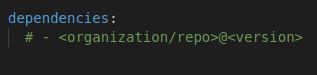
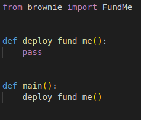
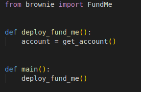
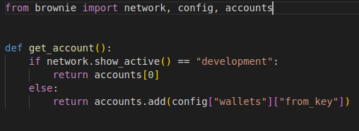
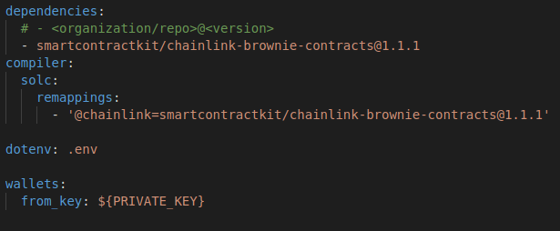
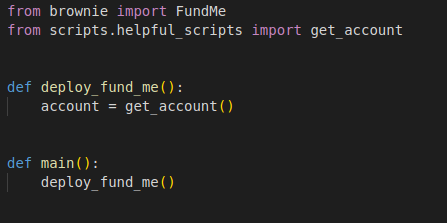
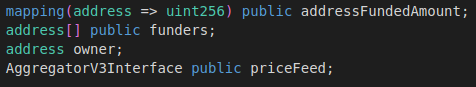
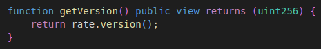
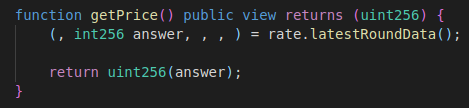
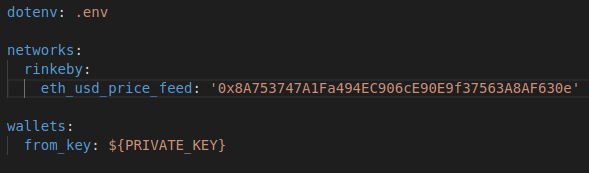

**Brownie Fund Me**

All right let's move on to our next project.We're going to take the fundme contract that we made recently in remix and actually import that one into brownie.With this we're going to go over a lot more advanced features that brownie has to offer us and we're getting into some more sophisticated testing and deployment mechanisms for this.

**Initial Setup**

I'm going to make a new directory `mkdir brownie_fundme`

After you're inside brownie_fundme project, initialize a new project.

`brownie init`

We're going to create a new contract called `FundMe.sol` which is going to be exact what we had before for our FundMe contract.Just copy past the code.

Typically this is where in our last project we just ran brownie compile.

What happens if we run `brownie compile` here? Brownie is going to give us error saying the source wasn't found.Well remix understands that `@chainlink/contracts` is an npm package that it can import from however brownie isn't aware of npm packages and brownie can't actually download directly from npm .However brownie can download directly from `Github`.So we've to tell brownie where it should be downloading external third party packages from so that we can use them in our contracts.

Let's change the global compiler version to 0.6.6  and the compiler version to ^0.6.6 so that our linter is happy.

We need to tell brownie where to import those `@chainlink/contracts...` from.From github instead of npm.Intentionally there's a package out there specifically created for downloading chainlink contracts.

**Dependencies**

The way that we can tell brownie where to get these contracts is in our brownie config.In here we're going to create a dependencies section and this is where we tell brownie:

So to get these chainlink contracts, we can look up [here](https://github.com/smartcontractkit/chainlink-brownie-contracts).Instead of downloading from npm, we're just going to download directly from the github repo.We need to tell brownie the organization(smartcontractkit), repo_name(chainlink-brownie-contracts) and the versions.

 It does look like the latest version went backwards but as of a recent release as a 1.2.0 version of the package, all the releases of the chainlink-brownie-contracts are going to match exactly the @chainlink/contracts npm tag.So that's why it looks like an earlier version.
 
 
 
 So now brownie knows to download this repo from Github.Once we do that everything in the contract section will be available for our solidity code to import and use.However that's not the final story here.We also need to tell brownie what @chainlink thing means because we're downloading from smartcontractkit/chainlink-brownie-contracts but what's that chainlink thing.
 
 **Remappings**
 
 So we need to tell brownie whenever we're using @chainlink we're actually referring to `smartcontractkit/chainlink-brownie-contracts@1.1.1` this import.We need to tell the compiler this.Let's add a new section.
 
 
 
 Let's go ahead and try to compile.We'll see it compile successfully and if we look at our build folder in the contract section we've new folder called dependencies.It downloaded AggregatorV3Interface and SafeMathChainlink because we're using both of those files in our solidity code.  
 
 
 Let's write our first script to deploy to a development ganache chain(brownie's built-in chain).

**Rinkeby Deploy Script**

Let's go ahead and create a new file(deploy.py) inside scripts.We'll build a simple script to work with rinkeby and then we'll actually learn how to deploy this to our own local ganache development chain.

Let's build this deploy_fund_me function.So first we're going to need to get an account and same as last time we used a function called get account which would know to switch back and forth between if we're on development or if we're with an actual testnet that we could pull from our config.We can copy that function and use that in our script here.

What I like to do with this get_account() is add it into it's own file called helpful_scripts inside scripts folder.In that file I'll add that get_account function.

And in our config we're going to have to add wallets and from_key.

Now that we've added get_account() to it's own scripts.How do we actually use that in our deploy script.

**__init__.py**

Depending on the version of python that you're in you might actually have to create a new file first named `__init__.py`.You might not bust just incase let's make it inside scripts folder.With this `__init__.py` python knows that it can import from other scripts and other packages in this project.Now we could do:

We're importing get_account function from our helpful_script.We gonna make get_account function a little more robust a little bit later but for now it'll work perfectly for what we're looking to do.

**Deploying to Rinkeby**

Now we could just run our typical deploy function.

`brownie run scripts/deploy.py --network rinkeby`

**Contract Verification**

Our contract is deployed but if we look at our contract, it's kind of like blank jarble of bytes.Nobody can actually see the contract and easily interact with it.We want to make our contracts easy to interact with.

**The mannual way**

What we can do on etherscan is verify and publish our smart contracts.To verify our smart contracts all we've to do is hit that verify button, choose solidity compiler type which we know is going to be 0.6.6 and we know we're working with MIT license.Now to continue we then have to add in all the rest pieces.We'd have to do optimization, enter our solidity contract code which importing fundme like we did wouldn't actually work because etherscan dowsn't know what `@chainlink/contracts` is.We'd have to copy paste the code from these imports to the top of our contract.Removing the imports and copy pasting the code associated with that files is known as `flattening` and this is an important concept for verifying our smart contracts on platforms like etherscan.

**Programatic way to verify**

However brownie has a really nice way to get around this actually.What you can do is go to their [main site](etherscan.io), you can sign in and sign up and get an api key.You can go to `My Profile` and scroll down to `API-KEYs`.This is where we can create an API key for us to interact with and programmatically verify our smart contracts on etherscan.

**Create an API Key**

Hit add, give name which will create an api token that allows us to verify our smart contracts.What we'll do to use that token in brownie is we'll copy that api key and we'll move back to our scripts.Sets that API key as an environment variable.So we'll do:

`export ETHERSCAN_TOKEN=*your_api_key*`

Now to verify this all we've to do then is once we deploy this contract we'll tell brownie whether or not we want to verify the contract.

If we re-run this script let's see what happens?

We'll see waiting for an api-rinkeby.etherscan.io to process contract and we're submitting our code for verification.It'll say verification complete: pass verified,  where the contract has been deployed and what's been done with it.

Now if we go back to rinkeby etherscan, paste the address, we now have a little checkmark associated with our contract.If we click contract we can see all of the code for our contract.If we scroll up the code we can see they indeed flatten the contract.We can even read the contract, see the different public variables such as the getVersion, getPrice and all the exact same buttons that we saw in remix.The read contract section is for the view function the ones that aren't going to be making a state change.Write contract is when we want to call something like fund or withdraw and we could even interact with it.

For example we could connect to web3 metamask and it'd automatically get connected to our metamask and we can call fund and withdraw just like we did in remix.

Sometimes verification process can be a little bit touchy and for version of solidity 0.8.4 there's currently a bug that makes it verifying a little bit tricky but it's being worked on.

**Deploying to ganache**

We've written a deploy script for deploying directly to rinkeby however as you know we're always going to want to be able to deploy to our own local blockchains or brownie's built-in development chain so we can test alot quicker and we can write some tests.

We've a little bit of an issue here.The first issue being here is that our fundme contract currently has an address hard-coded to work with the rinkeby chain.So infact the way it's written right now it's going to be hard to work with any other chain other than rinkeby.The second is that the price feed contracts don't exist on a local ganache chain or a ganache chain that brownie spins up.There's two ways we can get around this:

- Forking
- Mocking 

We can do what's called forking and work on a forked simulated chain or we can deploy a mock or deploy a fake pricefeed contract on our ganache local development chain.

**Mock**

Deploying mocks is a common design pattern used across all software engineering industries and what it applies doing is deploying a fake version of something and interacting with it as if it's real.Right now if I run `brownie run scripts/deploy.py` and I don't set the network flag, we're going to actually have a default spinning up a ganache chain.It's even going to try to verify it which it's going to run into an issue because we can't verify on a ganache chain.

So we've a couple issues that we need to address here in order for us to get this work on a ganache chain.

Similar to how in `get_account` function in our helpful_scripts, we do a little bit of checking.If we're on a development network, use the developments version otherwise pull from our config.We can do exact same mentality but working with mocks.

So the first thing we need to do is we need to parameterize our fundme solidity smart contract so that we don't have hard-coded address.

**Constructor Parameters**

Right when we deploy the contract we'll tell it what price feed address it should use.Right when we call our deploy function instead of having hard-coded and add this parameter to our constructor.

Instead of creating `AggregatorV3Interface` contracts right in the functions, we're just creating a global one.

And right in our constructor when we create it we'll set:

Now what we can do is just delete AggregatorV3Interface part from getVersion and getPrice function.We can do that exact same thing in our constructor when we deploy the contract.

We can even verify running `brownie compile`.

Our deploy function is going to need to look a little bit different.We're going to need to pass price feed address to our fund me contract.To do this all we've to do is paste that address before we've our {"from":account}.

This is how we can actually pass variables to constructors.Anything inside constructor function you can pass through brownie in our deploy script like we did.We could always just pass the rinkeby address but that's not really going to solve our problem obviously right.The problem is that the we always have the rinkeby address when we say if we are on a persistent network like rinkeby use that address other wise deploy mocks.

We'll talk about mocks and get into them in a second.But first let's set it up.

We can check what network we're on by importing from brownie network bit.

In our brownie-config we can add different addresses for different networks.

Now what we can do in our deploy script is if we're not on a development network let's grab the address from our networks section and we also need to import config in our deploy script.

What if we're on a development chain?Well we're going to have to deploy a mock.Right now on all these live networks that we're working with there's a version of the price_feed_address.Our development chain obviously there won't be one because it's going to start off as blank.What we can do is we can deploy our own version of the price_feed contract.This is known as mocking and we can interact with it accordingly.In order for us to deploy price_feed contract ourselves we're obviously going to need to have the solidity code associated with it.

In our contract section we'll create a new folder called test.When you create a test folder in your contract folder, this is typically where mock contracts are going to go and we'll create a `MockV3Aggregator.sol` file inside test.This is where we'll add the code for us to deploy our own price feed.I'm going to show you another repo pretty soon called the [chainlink-mix](https://github.com/smartcontractkit/chainlink-mix) that we're going to work with.For now if you're looking for one of these mocks I highly recommend just pulling it from the chainlink-mix repo.We can grab it by going to contracts/test and grabbing MockV3Aggregator.sol.We can just copy the whole code and paste it into our MockV3Aggregator. This has all the same exact functions as a real pricefeed contract such as decimals and latest answer which we're going to be using the most.We can also see it's constructor which it takes variables whenever the contract is deployed.Once we've this contract in our test section we can run `brownie compile` and brownie will go ahead and compile it.

Same way we import FundMe we'll be importing MockV3Aggregator.We setted decimals to 18 and initial answer to 2000.Since we're deploying we need to send the address.Let's go ahead and even try this on a development network.We could do:

`brownie run scripts/deploy.py`We don't need a network flag here.

We'll spin up the ganache and we even will deploy a mock aggregator contract first then we'll do our fundme part.Of course we're running to an issue because we're trying to verify a contract on a chain that doesn't exist.Etherscan doesn't know about our local ganache chain.To fix this instead of doing `publish_source=True`, we can have this published source be again based on what chain that we're on.We'll go to brownie-config.

Back in our deploy scripts we now say publish_source is going to be pulled from our config:

Now if we run this again we'll spin up our ganache, deploy a mock pricefeed contract, deploy our fund me contract and it completes successfully.We have a way our fund me contract that uses a price feed contract to our own local development environment with a mock aka a fake pricefeed contract.

