**Refactoring**

This is great but our deploy script is starting to look a little bit big and a little bit clunky.So actually cleans this up to make it look a lot nicer.

First we wanna do is fix big `2000000000000000000000` number.Looking at right away I'm not exactly sure how many zeroes it has.So to make it little bit nicer and more readable we can once again call on our friend web3.py

This toWei function will just add 18 decimals to this 2000.This is much more readable that the inital value for this is going to be 2000.The next bit is that we're always deploying this MockV3Aggregator and if we already have a mock deployed to whatever network that we're working on, we don't need two mocks.

If the length of MockV3Aggregator is less that equals to 0, only then we deploy it.MockV3Aggregator is just going to be a list of all the different V3Aggregators that we've deployed.

Insted of using mock_aggregator.address we can just use 

This is going to used recently deployed MockV3Aggregator.Then ofcourse we no longer need to set it as a variable and that looks a little bit cleaner and we'll make this a little bit more efficient.

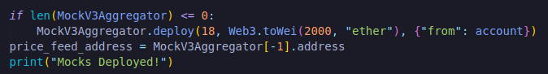

Deploying mock bit though is going to be something that we're actually going to do relatively frequently.So what I like to do is put this whole mock deploying bit in its own function in our helpful scripts.

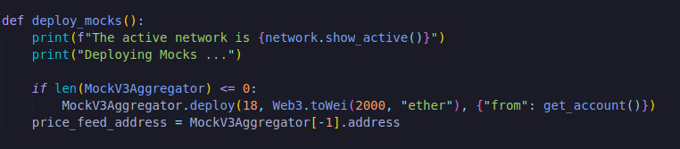

We need to import MockV3Aggregator, Web3 and instead of account variable we'll use get_account function.

In our deploy.py we'll place deploy_mocks() in that code and import it from helpful_Scripts.py and we can delete web3 import in deploy.py

This is starting to look lot more sophisticated and this is great because now we have a way to deploy base off if we're on a live chain or a development chain.And one more thing I'd like to do so that everything is parameterized, I'll set MockV3Aggregator parameters as static variable.

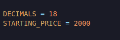

**Deploying to a persistant ganache**

So let's say now that I wanted to deploy to my own ganache instance.Well what we can do is we can open up our ganache here, click quickstart and we'll just quickly create our own ganache blockchain.

Instead of brownie spinning of it's own ganache, brownie is smart enough to detect if you're running your own ganache instance and will automatically attach itself to it knowing that is going to be a development environment.If we go to our ganache we'll see we've two transactions which are going to be contract creations.This is great for testing quickly and locally but there's an issue with this.

For development networks again brownie doesn't keep track of those so in our build folders if we go to deployments we only are saving stuff from the rinkeby chain here.So we need to tell brownie that there's another network that we want you to work with and we want it to remember the deployments to that chain.

**Adding network to brownie**

We can add a new network to our brownie networks list.We want to deploy to ganache chain and we want brownie to remember those deployments.Well we can add a network in ganache network list.

`brownie networks add Ethereum ganache-local host=http://127.0.0.1:7545 chainid=5777`

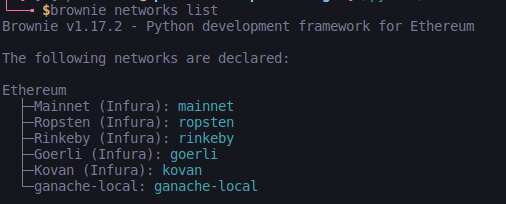

We can see a new blockchain called ganache-local and this is going to reach out to our ganache UI or our ganache CL depending on what we're running.

If I try to deploy deploy.py in our ganache-local, we'll get this issue

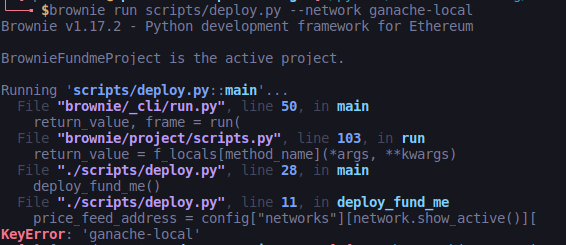

Ganache-local isn't development.It's going to go ahead and try to pull from our config file.We don't want this.We want to actually deploy mock for our local ganache if a mock hasn't been deployed.So we can extend our definition of what a development environment is.

In our helpful_Scripts we can add a flag.

We can import this environment into our deploy.py

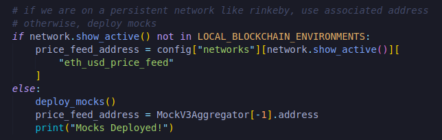

This is saying whatever network that we're on if it isn't development or ganache-local then go ahead and use config.If it's one of these two, we're going to deploy a mock.

Now we've this let's try this again.

We run into a different issue saying we don't actually have enough gas.

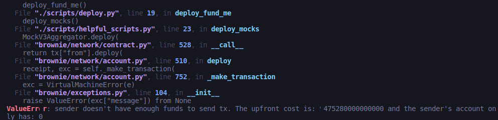

Why's this? Let's look at our get_account function which is directly looking for development chain only.So we could do

`if network.show_active() in LOCAL_BLOCKCHAIN_ENVIRONMENTS:`

If the network that we're working on is development or ganache-local, return accounts[0].

Let's try this.

Now we're running to this key error of ganache-local.In our config we'll add this new network.

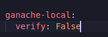

Let's try this one more time.

Perfect mocks has been deployed and our fundme has been deployed.If we look in our build folder in deployments we now have new chain id for 5777 for saving these deployments and it looks like in our ganache chain we've it actually saved in.

Important this to note if you were to close or delete ganache chain, all of your contracts will be lost.You won't be able to interact with them again.

**Withdraw and Fund**

Now that we've deployed this let's write a script to interact with it.Create a new file inside scripts directory naming it fund_and_withdraw.py.

Since it's going to resemble ethUSD pricefeed, it actually only has 8 decimals because getPrice function has only 8 decimal places.

And for MockV3Aggregator we're going to use those exact values.We're not going to do web3 converting.

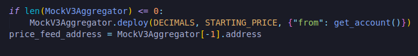

I've added a getEntranceFee function to our contract(FundMe.sol).

First we're going to run `brownie run scripts/deploy.py --network ganache-local` because we changed FundMe.sol

and then we can run `brownie run scripts/fund_and_withdraw.py --network ganache-local`

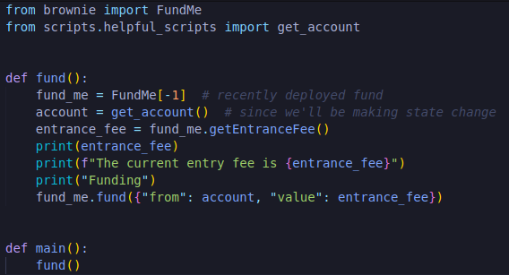

and run the fund_and_withdraw.py which will work fine.

**Withdraw**

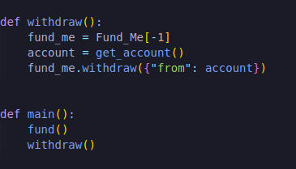

You need to return fund_me contract in FundMe.sol.

Let's run the script.You can see both funding and withdraw transaction going through.

This is the script we can run on a main network if we like.

**Testing**

We're going to move into actually writing those tests and for these tests we're going to want to quit our ganache UI.Let's go ahead and write some of these tests in test_fund_me.py file.

We're on this test we're going to want it to be able to work independent of the network that we're working on.We write a test to see if we can fund or withdrawl.

**Default Network**

You may be wondering why sometimes we use --network flag sometimes we don't.In our network section of "brownie-config.yaml" file, brownie automatically picks a default network to use and the default is always set to development.However we could set this to be anything we wanted.We could set the default to be ganache-local or rinkeby.Whatever you set for your default in your brownie config is what the network will be defaulted to.

Right now when we run brownie test this is equivalent to writing brownie test --network development.

We can also run the test in Rinkeby but oftentimes we don't wanna tets all of our functionality on rinkeby or live networks because it's going to take a long time for them to run.Sometimes we only want to run tests on our local chains.

We can use pytest skip functionality to do so.To work with pytest we need to install it.So go ahead and run `pip install pytest`.

To demonstrate this lets create a test that makes sure only the owner can withdraw and nobody else can.

Well we want this to happen.How do we test that we wnt this to happen?We just need to tell our test that we want this to happen.

First we need to import exceptions from brownie.This way we can tell our test exactly what exception we're expecting to see.

If it reverts with the VirtualMachineError that's good.We want it to revert when we try to withdraw from different account. 

We can see it passes the test which is exactly we're expecting.

**Mainnet fork**

Mainnet forking is incredibly powerful when we're working with smart contracts on mainnet that we wanna test locally.Let's talk about forking for a minute.

In a blockchain there's a whole bunch of blocks and huge chain that we can actually work with.All the information is public information.Block gonna have lots of transaction.In addition to transaction, it's going to have pricefeed contracts, aave contracts etc.It's going to have all these different contracts in it.So if hypothetically if its already there, we should be able to basically copy the whole blockchain and do some simultions ourselves and that exactly what forking does.

A forked blockchain literally takes a copy of an existing blockchain and bring it into our local computer for us to work with.We actually have control over the forked blockchain since it's going to run on our local computer similar to ganache.All the interaction we do on the local blockchain are not going to affect the real blockchain becuse it's our local chain.

Mainnet fork is a built in part of brownie and also pulls from infura the same way it works with rinkeby and coven and everything else.We can start to interact with the mainnet fork contracts the exact same way therefore.

We can take the whole rinkeby section(brownie-config.yaml), copy it, paste it and we'll just change eth_usd_price_feed address to it's mainnet address.We'll go [docs.chain.link](https://docs.chain.link/docs/ethereum-addresses/), copy that address and put it on config file.

Since it's going to be a fork, verify needs to be False.

If you try to run one of our scripts like brownie run scripts/deploy.py --network mainnet-fork, you'll see we'll actually run into an issue saying insufficient funds for transfer.

In our deploy script when we do our get_account function call and in our helpful scripts right now we're using accounts.add[config["wallets"]["from_key"]) which our account has 0 money in it on mainnet.So we need to tell brownie when we're working with mainnet fork it should create us a fake account with a hundred ether.However we don't want it to deploy a mock because the price feed contracts already exist but we do want it to get an account.

Now if we run this we'll still get an error saying index out of range.Brownie built in forking mechanism doesn't actually come with it's own accounts here.

**Custom mainnet-fork**

I like to create my own custom mainnet fork right in brownie.

`brownie networks add development mainnet-fork-dev cmd=ganache-cli host=http://127.0.0.1 fork=https://eth-mainnet.alchemyapi.io/v2/ISvH6u9dX3dloFAfYbic-eIht63naI20 accounts=10 mnemonic=brownie port=8545`

command to run the fork is ganache-cli
fork is going to be from [alchemy](https://dashboard.alchemyapi.io/apps/5lw6891y7yijsa51) instead of infura because performance wise forking from infura pretty much always give an issue.So go ahead and create account in alchemy and create a project, view details and view key to copy http address to fork it.You'll know you've done it right if you can something like:

In our config we'll change mainnet-fork to mainnet-fork-dev and in our helpful scripts we'll add mainnet-fork-dev without removing mainnet-fork.

Now our get_account function should return accounts[0] for mainnet-fork-dev and it should actually work.

And we should be able to test exactly the same way.

**Adding to Github**

We're going to teach you how to actually share you code and enter the world of open source and decentralized code.First initialize you repository by:

`git init -b main`

and add your username and email to our config
`git config user.name "demo"`
`git config user.email "demo@gmail.com"`

We're going to do couple of things to push all of our code to github however we don't want to push .env.Add .env in .gitignore file.This will help us prevent accidentally pushing our .env file to Github.

We can choose what file we wanna push by doing

`git add .`

and if we do git status, it'll show us all the different files that we have staged to push to github.

To remove .env if accidentally pushed

`git rm --cached .env`

Add .env back to .gitignore file and do git status and git add .

Now we commit by

`git commit -m "First commit"`

Now we can add the folder to the Github by:

`git remote add origin *repo url.git*`

`git push -u origin main`

You'll see all of your files in Github repo.

**Where should I run my tests?**

The default for every single one of your contracts is as follows:
- Always 100% need to have tests that pass on a local brownie spun up ganache instance.This means you need to deploy mocks.
- Testnet: Always (but only for integration testing)
- Brownie mainnet-fork: Optional
- Custom mainnet-fork: Optional

Testing on mainnet fork can be done and should be done whenever all of your contracts and all of your interactions are going to be on chain, on one chain without any external off-chain components.

- Self/Local Ganache: Not necessary, but good for tinkering

Now let's move to our most challenging example.Once you complete this example you basically will have all the tools to be an incredibly powerful smart contract developer.Then after that we're going to show you the chainlink mix package and how to do what's called a brownie bake to automatically open up this package with all these scripts and all these contracts pre-built in which makes easier and faster for deploying our smart contracts.However let's go through the process of understanding all the pieces that are going to be inside of this brownie mix.
