## *Smart Contract Lottery*

Let's get into our most advanced smart contract project that we've made so far.This is going to be the best example of a full scale application. By full scale I mean end-to-end full suite of our brownie.

**Decentralized Lottery**

What we're going to do is create a lottery application where anybody can enter the lottery and a random winner is selected.So let's do it and let's get started.

**Setup**

First of course we're going to make a new directory.
`mkdir smartcontract-lottery`

and open that folder in visual studio.

Let's go ahead and start a new project.

`brownie init`

and create a quick readme.md file to explain what we're trying to do here.

**Wait..is this really decentralized?**

Since we've an admin here this means that our application isn't necessarily going to be truly decentralized because we've a single person chooses when the lottery is over.

**Could we make it decentralized?**

We could scale this out to have maybe a dow being the admin or something like that.

**Chainlink Keepers**

Or we could have the lottery automatically open and closed based off some time parameters.

But for the moment this is the setup that we're going to have.

**Lottery.sol**

First thing that we're going to get started with of course is our lottery contract and let's begin with our initial setup.

**Main functions of Lottery.sol**

Think for a second on what some of the functions that are going to be.What our main function going to be.

We'll probably have a function enter.
function called getEntranceFee.
function called startLottery.
function called endLottery.

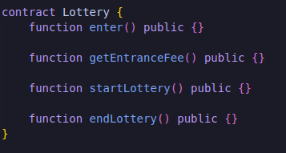

Let's get started with the enter function just because this is most likely going to be the entry point. As we know since we're going to want them to pay using this entry function in ethereum, we're going to need to make this function payable. In here we're going to need to keep track of all the different players.Everybody who signs up for this lottery.

**address payable[]**

To keep track of all the players we're going to make an address payable array.We'll make it public and called players.

And anytime somebody enters we'll just do:

**require minimum payment**

However we're not checking to see how much value that they're actually sending.We want to set the price of this to be atleast $50.Here we're gonna have to do a require statement requiring them to do at least $50.In order to do that we're probably going to need to have some function to get the entrance fee to check whether or not how much they're sending is actually $50.

**getEntranceFee**

Since we're just returning a number for getEntranceFee, we can make it a view and have it return uint256.

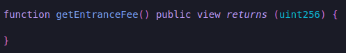

To get this entrance fee we're first going to have to have stored somewhere what the entrance fee is.We're going to store the $50 minimum somewhere.This is something we'd probably wanna set right when our contract is deployed.So where we can put stuff like that.Well in our constructor.

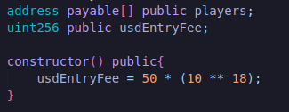

Since we're going to get a conversion rate, we're going to want to use a [chainlink price feed](https://docs.chain.link/docs/ethereum-addresses/).

We're going to need to pull from the price feed to convert fifty dollars to fifty dollars in eth.

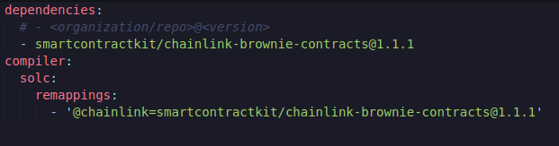

We'll compile it and we can see everything works our properly.

So now we've pricefeed let's go ahead and set up this entrance fee.Of course we're going to need to get a price from the price feed.We can check the [documentation](https://docs.chain.link/docs/get-the-latest-price/) on how to do that.
We can call this latestRoundData function.

Now we're going to want to do a little bit of quick math.Typically if we're setting the price at $50 and we've a pricefeed of $2000 per eth, we'd just wanna do 50/2000 but ofcourse solidity doesn't work with decimals we can't actually just do this.So we'll have to do 50 * (somebignumber) / 2000.But first convert the price from int256 to uint256.

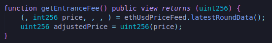

Since we know we're going to be using an ethereum / usd pricefeed that has eight decimals.Let's also just convert it to having 18 decimals as well.

`uint256 adjustedPrice = uint256(price) * 10**10;`

Now that we've adjusted price we'll do:

usdEntryFee is also multiplied by some big number.This way usdEntryFee has 18 decimals but it has an additional 18 decimals here that'll be canceled out with our pricefeeds.

Now ofcourse since we're doing some math here,it's recommended to use safe math and use safe math functions.We're going to skip over the safe math functions here again because in the newer version of the solidity you don't really have to use them but I think it's important to note here that sending this code this exact code into production would be a bad idea for atleast the reason of safe math functions.

**Testing**

Let's go ahead and do some testing as we code just to make sure our getEntranceFee function is working properly.

Based off of our last lesson let's talk about how do we want to test this?

Well we could do a mainnet-fork here because we're only working with some on-chain contracts and some maths.We'll at some point have to do our development with mocks and of course our test-net.

Let's try our mainnet fork just for now just to see if this is making any sense.The current price of ethereum is $3000 and we want price of this to be $50 we do 50/3000 =0.016666667.This should be approximately what we get for our eth value.

So if we were to test the function, we'd expect to get 0.016666667 or in wei 0.016666667 * 10**18.

Let's go ahead and create a function that tests this.

 

We need to import Lottery and in order to deplot it we need to get an account.We're going to import our helpful scripts from the last project to this one too so we can get our get_account function but for the time being we can actually just use accounts[0] from brownie accounts.

We've a parameter of _priceFeedAddress in the constructor of the contract.So for now let's hard code that in our config.And we can do our quick test.

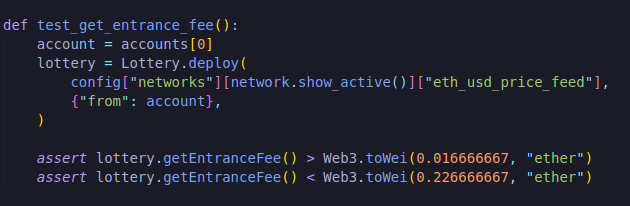

These numbers are of course going to be a little bit different for you and if you want you can go ahead and skip the part so that you don't have to do the math but it's kind of nice to do quick sanity check saying based off what things are right now or what would this price end up to be.

In our last section we made a mainnet-fork-dev network.I'm going to go ahead and customize our mainnet fork the way we showed you guys how to do mainnet-fork-dev.

To do this we're first gonna have to delete brownie's internal built in mainnet-fork.

`brownie networks delete mainnet-fork`

and now add our own mainnet-fork using alchemy.

`brownie networks add development mainnet-fork cmd=ganache-cli host=http://127.0.0.1 fork=https://eth-mainnet.alchemyapi.io/v2/YObK6vh1zJzmWL_IP2d_oIDI6tdl3ua5 accounts=10 mnemonic=brownie port=8545`

Great mainnet-fork has been added.Now that we've this here we can go ahead and run our test.

`brownie test --network mainnet-fork`

costToEnter should be divided by adjusted price i.e `uint256 costToEnter = (usdEntryFee * 10**18) / adjustedPrice;`

Of course we know that we're gonna change assert statement because this isn't a great way to actually test our contracts but it can be a nice sanity check and we know we're gonna have to refactor the code as well for mocks and for accounts but we'll get to that in a little bit.

We're getting a cost to enter correctly.We can do in our enter function that value must be greater than getEntrancefee function.

We've a way for them to enter and we've a way to get the entrance fee.

**Enum**

But we wanna make sure that we're not ending the lottery before the lottery even starts or ending the lottery hasn't even begun.So we're gonna want a way to iterate through the different phases of this lottery and we can do that with what's called an enum.

According to solidity documentation, enums are another way to create user-defined types in solidity.We saw an earlier version of doing this with a struct.Enums are little bit different in that they're explicitly convertible to and from all integer types.So for our lottery contract we're gonna want to create the new type that represents the lottery state.

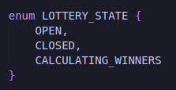

This means that we've a new type called LOTTERY_STATE with three positions.These different states are actually represented by numbers. So open is actually 0, closed is 1 and calculating winner is 2. Now that we have this new type we can create a variable of type LOTTERY_STATE.

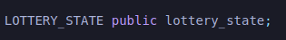

Right when we initialize our contract, we're gonna want to set our lottery_state being Closed.

Since states are represented by numbers as well we could also just do `lottery_state = 1;` however it's much more readable to do LOTTERY_STATE.CLOSED.

Now that we've a lottery state, in our enter function we can require lottery to open.

We can only enter if somebody started this lottery and that's exactly what we're gonna do in our start lottery.

**startLottery**

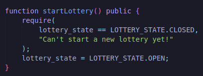

Now when somebody starts the lottery they'll be able to enter.Of course the startLottery bid here need to be called only by our admin.So this is where our onlyOwner modifier is once again going to come into place.

We could write our own only owner modifier or we can once again use open zeppelin's access control and open zeppelin's ownable function instead which is what I'm going to use here.

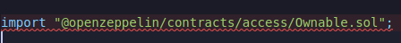

and we'll say our lottery is ownable.

Now we can finally move into our endLottery function.This is where we're actually going to choose a random winner here.We only want the admin to be the one to end the lottery.so let's add the onlyOwner modifier in endLottery function as well.

**Randomness**

We're looking to get a random winner.As you know blockchain is a deterministic system and this is super ambitious because that allows us to do all these smart contracts and have this system that can actually reach consensus very easily.Random numbers are much harder.

If you've a blockchain with a whole bunch of different nodes and each nodes responds and gives their own random value, well each node is never going to be able to sync up and agree on a random number.

What you could do is base the random number on some other attributes in the system but it's not really random.It's actually going to be pseudo random.So getting truly random numbers in a deterministic system is actually impossible and if you know about computer science you actually know that even if you call math.random in your javascript or C++, what your computer is really doing is it's looking at some place in memory, grabbing some value and saying this is probably random enough here go ahead and use this.

Now in smart contracts especially when working with any type of financial application such as a lottery, having an exploitable randomness function means that your lottery is at risk of being hacked or destroyed.

So I'm going to show you this insecure way first and the reason that I'm gonna show you is that it's a quick and dirty way to get a pseud random number but please don't use this in any production use cases.

**pseudorandom numbers**

Im gonna show you a method that's often used to teach people how to get random numbers and then we're gonna explain why it's so vulnerable and not a good method of randomness and what some insecure protocols will do is they'll use globally available variable and hash it.So in your smart contracts there's actually number of globally available variables.One of those we saw above is `msg.value`.It's going to be the value that's sent with the transaction.Another globally available variable is going to be `msg.sender`.You can actually see a whole list of these different globally available variables in the solidity documentation [here](https://docs.soliditylang.org/en/latest/units-and-global-variables.html).

Since there are these globally available variables, alot of times some will see something like block.difficulty which returns the current block difficulty.Now one of these globally available variables is going to be block difficulty.Remember how I said the time between different block generation is called the block time.Well you can always keep that block time as is by changing the block difficulty over time.The harder the problem or harder the POW algorithm, the longer it's gonna take or more nodes you gonna need to solve that problem.There's this constantly recalculating metric called `Ethereum Difficulty` or block difficulty depending on the chain that you're working on that constantly changes.

You might think this would be a great use of randomness because it's a somewhat hard to predict number.So what alot of people do is they think that these sound pretty random  and use them as a unit of randomness and you'll see something like.

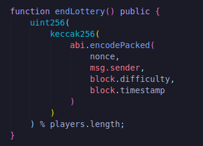

We're converting into uint256.The reason that we're doing this is because we want to pick a random winner based off of an index.Somebody some random winner in our players array or our players list.Whatever number we're going to use that's gonna be the index of the winner that we're gonna randomly pick.Then we'll use Keccack256 which is our hashing algorithm.So they hash a whole bunch of variables together and they do this abi.encodePacked which is another keyword for some low level work and they'll add nonce, message.sender,block.difficulty and block.timestamp.Basically what they tryna do here is take a bunch of seemingly random numbers,mash them all together in a hashing function and say yeah this is pretty random.

But the issue here is that the hashing function itself here isn't random here.The hashing function is always going to be exactly the same Keccack256.It's always gonn hash everything exactly the same way.So we're not actually making it more random by hashing it.All these numbers inside are the pieces that actually determined how random it is.If the block.difficulty is random then this will be a random method.If the block.difficulty isn't random then this won't be a random method and block.difficulty isn't random.Block.difficulty can actually be manipulated by the miners.Timestamp, nonce and msg.sender are predictable.

When using a random number in this way the hashing algorithm is always gonna be the same, uint256 is always gonna be the same.We've predictable number, predictable address, a predictable timestamp and then a manipulatable value.So all the code is really doing is giving the miners the ability to win the lottery.So this isn't going to be an effective way to get a random number.This is an unacceptable way to get a random number in our applications.Yes we do have the onlyOwner modifier here which means that we're the ones who are going to choose when to call this.So it's still a centralized in that regard but let's just jump into best practices for working with random numbers.

**True Randomness with Chainlink VRF**

In order to get the true random number we're gonna have to look outside the blockchain.Blockchain itself like I said is a deterministic system.So we need a new number outside the blockhain but what we can't do is we can't use just an api that gives a random number.If that API becomes corrupted if they're malicious if they go down if something happens etc etc what we need is a provable way to get a random number  and chainlink vrf is actually that solution.

Chainlink-verf stands for chain-link verifiably randomized function and it's a way to get a provably random number into your smart contract.It has an on chain contract that checks the response of a chainlink node to make sure the number is truly random.Using some cryptography magic it's able to check a number of the parameters that the chainlink vrf started and ended with to make sure that it's truly random.It's already used for protocols like avagochi, ethercards, pool together and a wholebunch of other protocols as well because it'a a secure, reliable and truly provable way to get a random number which is incredibly powerful in a decentralized system.So that's how we're actually gonna get our random number here.Let's work on getting that.

We can head over to [chainlink documentation](https://docs.chain.link/docs/get-a-random-number/v1/).IF you ever get lost or confused you can always come right back to here to work with it.What we're gonna do is deploy their simple version in remix to work with chainlink vrf.

You can see that this is actually using a different chain than what we've been using.We've been mostly working with rinkeby but for this demo It's actually on Kovan.Remember if you do want to stay with rinkeby you can go to contract addresses section of the vrf and grab the addresses.

So what's going on in this contract? How do we actually use it? Well first thing that happens is we're importing some code from the chainlink package and our contract is inheriting the abilities of this vrf consumer base contract.We can see what functions we're actually going to use that are inherited from this contract.And the first thing that we notice is we can see that our constructor in here does some weird stuff.Looks like it almost has two constructors.So what's actually going on here?Let's look at VRF ConsumerBase.sol contract in the [chainlink github](https://github.com/smartcontractkit/chainlink/blob/develop/contracts/src/v0.6/VRFConsumerBase.sol).As we can see the vrf consumer base that we're importing has it
s own constructor.

It takes an address for the vrf coordinator this is the on chain contract that actually checks to make sure our numbers are random and the address of the chainlink token which we'll talk about ERC20s in a little  bit.

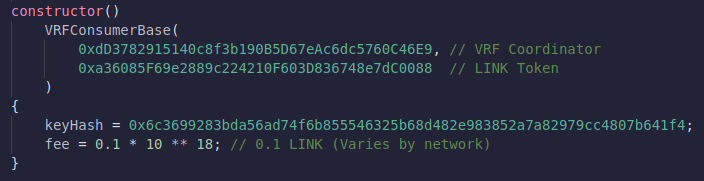

What we're doing is also inheriting the constructor into our contract.So this is our constructor for our random number consumer but we can also use the constructor of the VRFConsumerBase and this is actually how we go ahead and do it.We grab the constructor of the vrf consumer base and pop it in.It's taking two addresses.It's taking vrf cordinator  and the link token like I said vrf cordinator is a contract that's been deployed on chain that's going to verify that the return of the chainlink node is truly random and we're going to use the link token as the payment to the chainlink node fro it's services and then we also have a key hash and a fee defined inside of the constructor.As well as the key hash uniquely identifies the chainlink node that we're going to use and the fee is how much link we're actually going to pay to the chainlink node for delivering us this random number.

**Oracle Gas and Transaction Gas**

In ethereum whenever you make a transaction, you've to pay some eth gas or transaction gas.This is to pay smart contract platform a little bit of eth for performing our transaction with a smart contract.With a smart contract that operates with an oracle we've to pay some link gas or oracle gas.This is to pay the oracles a fee for their services for providing data or doing some type of external computation for a smart contract.

The question that might follow up is "Why didn't we pay oracle gas when working with chainlink price feeds?"

Well for price feeds somebody has actually already paid for the data to be returned and if we go to data.chain.link we can see list of sponsors that're paying to get this data delivered.They're already paying oracle gas to bring this data on chain for us.

Since no other protocol is getting a random number for us we're actually going to have to pay the oracle gas here.

Now in this RandomNumberConsumer.sol, we've a function called getRandomNumber which is gonna return a bytes 32 and what it's gonna do is call this request randomness function which is inherited from this VRFConsumerBase.If we look in here we look for request randomness, we can see there's a function right here called request randomness.This function is gonna send our oracle fee or the link token and it's gonna call this specific to the link token function called transferAndCall which is going to call a chainlink node.I'm not gonna go into exactly how it's doing that now but we'll talk about it in a little bit.So we call this request randomness function and we send the key hash and the fee.Remember the key hash uniquely identifies the chainlink node and the fee is going to be how much oracle gas we're going to pay.

If you ever get lost on how much to pay or what the contract addresses are, you can always head over to this vrf contract section and see where the most recently deployed vefs are, how much the fee is etc etc.

**Request and Receive**

Getting a random number is actually follows what's called the request and receive style of working with data.Let's go ahead and try this out and i'll explain what this means once we see it.We're saving the answer to  randomResult variable here and let's just go ahead and try this and see what happens.

**Kovan**

We're gonna switch to injected web3 and since we're now swapping to a new test network this means that we've to get tested eth and test that link again.We can always look for the [link token contracts page](https://docs.chain.link/docs/link-token-contracts/) to find the most upto date faucets. 

Now that we've some testnet ethereum and some testnet link we can proceed.We need to make sure we're on Kovan test network and we're gonna deploy our RandomNumberConsumer -gist.Metamsk pop's up and we're gonna confirm it.I didn't explined fulfillRandomness function intentionally you'll see why in a second.

randomResult is 0 at the begining because we haven't got a random number.

**Gas Estimation Failed**

I'm going to do something intentionally wrong because there's a good chance that you'll run into this at some point.If I hit getRandomNumber right now, we'll see the error `Gas estimation failed`.We've plenty of eth why would this fail? The reason that it's failing is because the contract doesn't have any oracle gas.So we got that gas estimation failed because we need to fund this contract address with some link to actually get a random number.So let's copy the contract address, come to the metamask and to that address we're gonna send some link.

**After Link transaction completes**

Now that this contract has some testnet link, we can call this getRandomNumber button because we can actually pay the chainlink node to actually return our random number.We're also paying a little bit of transaction gas to make this transaction to make the request and then we're paying a little bit of oracle gas to make the transaction.

**After transaction completes**

After the transaction confirmed but if I hit random result now it's still going to be zero.So why's that?What's going on?

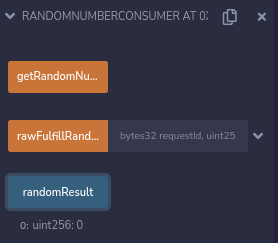

**Request and Receive**

Getting a random number like this actually follows request and receive cycle of getting data.You can read more about it [here](https://docs.chain.link/docs/architecture-request-model/).So in one transaction we actually request some data or in our case a random number and then in a second transaction the chainlink node itself will make a function call and return the data back to the smart contract.In this case the function that we're calling is fulfillRandomness.It calls fulfillRandomness with bytes32 requestId which is going to be the request number of when we call requestRandomness and it's going to return with random number called randomness.So after we wait a little bit and hit randomResult, we can see indeed our random number is in here.

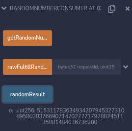

**Asynchronous 2 Transactions**

Again the reason that it's in there because we actually had two transaction occur.One paid by us when we called getRandomNumber and one paid by the chainlink node when it called fulfillRandomness.

**Clarification**

Now I lied to you a little bit technically that VRF Cordinator contract calls fulfillRandomness function and then the chainlink node calls VRF Cordinator function but for simplicity's sake you can kind of think of it as the chainlink node itself is calling this fulfillRandomness function.

So now that we know how to do in Remix let's go ahead and add this to our brownie project.
