**endLottery**

Before even get a random number let's change the state of our lottery.

While this is happening no other functions can be called. This will lock out. Nobody could start a lottery and nobody can enter a lottery while we're calculating the winner. Now that we know a little bit more about random numbers and everything that we're doing here. Let's go head and try implementing this. In our chainlink smartcontract docs, in our get a [Random number section](https://docs.chain.link/docs/get-a-random-number/v1/).First thing we're gonna do is import the VRFConsumerBase code and we'll inherit it into our Lottery contract.

If we scroll down to the constructor of VRFConsumerBase, we can see it address of the vrfCoordinator and the address of the chainlink token as parameters. We can use a constructor of a contract inherited in our contract inside our constructor. So what we'll want to do is we want to come down to our constructor and right after the public keyword we can add any aditional constructors from inherited smart contracts.

Similar to priceFeedAddress vrfCoordinator and link addresses are gonna change based on the blockchain that we're on. So it'll probably makes sense for us to parameterize them the same way we parameterize the pricefeed address. So in our top level constructor parameters we'll add an address for the vrfCoordinator and pass that to the constructor of the vrfConsumerBase. We'll also grab ab address for the link token and pass it to the vrfConsumerBase constructor as well.

Great what else we need to make this work?Well back in the [documentation](https://docs.chain.link/docs/get-a-random-number/v1/) we can see:

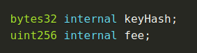

We need fee and the keyHash.The fee is associated with the link token needed to pay for this request.So we'll make a public variable for fee.

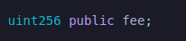

Since fee might change blockchain to blockchain we'll have fee as an input parameter as well.

We need a keyHash.The key hash is a way to uniquely identify the chainlink vrf node.

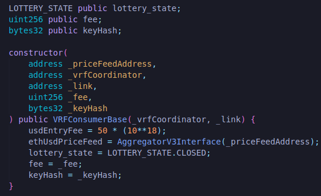

Now that we've the main pieces that we need. How do we then request this random number? Well if we scroll down to ou documentation we can see we have this requestRandomness function that we need to call. If we scroll back to our vrfConsumerBase contract, this requestRandomness function is a built-in function from the vrfConsumerBase. So our contract can natively call this requestRandomness function right in our contract. You can see it takes keyHash and a fee as it's parameters. So right in our endLottery function we can add this requestRandomness function and we can also see requestRandomness returns requestId of bytes32.

**returns(type variableName)**

This return syntax is very powerful. You can actually identify the name of the variable you want to return right in your function declaration. So by saying bytes32 requestId we're saying we're going to return a bytes32 variable named requestId.

This function call follows again what we've talked about as the request and receive mentality. This means that in this first transaction we're going to request the data from the chainlink oracle. In a second callback transaction the chainlink node is going to return the data to this contract into another function called fulfillRandomness.

**fulfillRandomness**

Again if we look back in our vrfConsumerBase, we can see it has this function rawFulfillRandomness.We can read in comments that says "rawFulfillRandomness calls fulfillRandomness after validating the origin of the call". There's a little bit of contract tag going on but it's gonna eventually call fulfillRandomness function which is gonna be what we define in here and that's how our contract gonna know what to do once it gets the random number back.

So in our first transaction we're gonna end the lottery, request a random number and then a second transaction later on once the chainlink node has created a provably random number it's gonna call a second transaction itself based off of what we  define. We just have to call it.

We don't want anyone else to be able to call this function. We only want our chainlink node to call this function so we can return a truly random number. So we made it an internal function. It's internal because actually the chainlink node is calling the vrfCoordinator and then the vrfCoordinator is calling our fulfillRandomness. So we made it internal so that only the vrfCoordinator can be the one to call and return this function.

**override**

This override keyword means that we're overriding the original declaration of the fulfill randomness function. Our vrfConsumerBase has a function fulfillRandomness defined but it doesn't have any parameters or anything about this function actually laid out. This function is meant to be overriden by us and that's exactly what we're doing here.

So in this fulfillRandomness function let's define what's gonna happen once we get random number back. Before we can process this random number let's just check to make sure we're even in the right state. So we'll do:

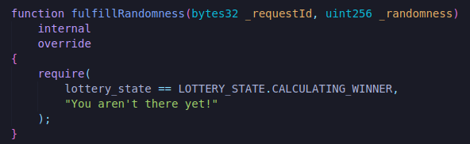

Then just do another check to make sure we actually get a response.

Now we need to pick a random winner specifically our of our list of players. List of payable public players. So our players array is just a list of players.

**Modulo(Mod Operation %)**

What we can do to pick a random winner?We can do a modulo function.We can use mod function in our fulfillRandomness with the length of our players.

And just to keep track let's make a new variable called recent winner.

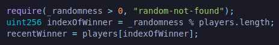

Now that we got a winner wallet we want to pay them all of the money gathered from our enters. We'll do is transafer the entire balance of the address.

We'll transfer them everything we've. Then of course we're gonna want to reset the lottery so that we can start from scratch. We can start blank again. So we'll do:

We're gonna change our lottery state to being closed because the lottery is now complete. And I often also like to keep track of the most recent random number. So at the top we'll declare public randomness.

**Some of the changes I need to fix to compile properly is here:**

I need to have v0.6 instead of 0.8 in my code while importing VRFConsumerBase.sol.

`import "@chainlink/contracts/src/v0.6/VRFConsumerBase.sol";`

also need to make recentWinner variable payable.

`address payable public recentWinner;`

and LOTTERY_STATE state to be CALCULATING_WINNER instead of CALCULATING_WINNERS.

Let's now move into our testing and developing phase. As you're starting to figure out we can ignore these file import callback not supported bugs in vscode for now. I'm sure solidity linter will get better as time progresses.

**Lottery Testing**

Let's go ahead into our scripts and we'll make a deploy script first.

Our default network is not defined.So in our brownie-config.yaml:

If we run this `brownie run scripts/deploy_lottery.py`, ganache will spin up and nothing will happen because our deploy_lottery function doesn't do anything right now.

**deploy_lottery.py**

First thing we need always to deploy a contract is we need an account.

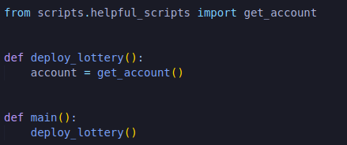

Files inside our scripts directory are:

And this is what get_account function looks like in our last project.

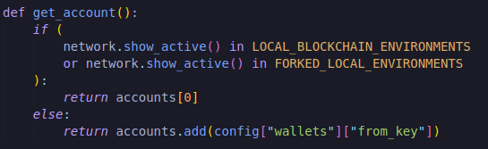

Along with the function we also had imports and vriables.

**get_account refactored**

Let's flush this out just a little bit more so it's even more robust. Right now we've a way to use brownie's ganache accounts and use our environment variables. However there's a third method that we learned that isn't identified here is accounts.load("id"). If you still have your account and you still have all your brownies set, up you could do:

`brownie accounts list`

You could see couple accounts or atleast one. We want our get_account to be even more liberal so that if you wanted to use one of the listed account, we could. Let's modify our get_account script.

First get rid of else and that indent.

What this will do is that this getting from config will be our default.IF nothing that we define prior to this, we'll just default to grab from the config. Since we're doing that let's create our .env file. We'll paste our privatekey, infura and etherscan token here. And in our brownie-config ofcourse we'll:

Let's add index and id.

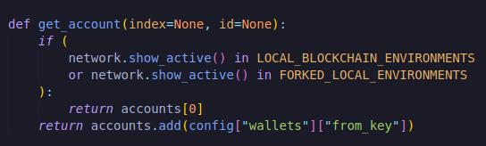

This way if we pass an index to our get_account function, we'll just use index from accounts variable and if we pass an id, we'll have try to do accounts.load.Let's change a little bit.

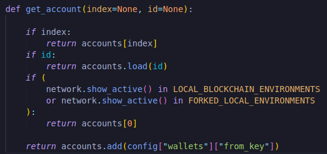

Now we've much more liberal get_account function. So now we've a account we can actually deploy our lottery.

We're gonna have to add in all these different variables so if we go back to our lottery we can see :

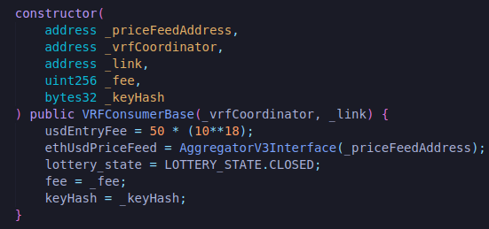

We need to give it a _priceFeedAddress, _vrfCoordinator, _link, _fee and a _keyhash.Now the way we did that in fund me is that we did it in way where we check to see if we are on a local chain or not. If we weren't on a local chain then we must pull our addresses directly from our config. If we weren't on a local chain though we'd deploy some mocks and use the address of those mocks.

We're gonna wanna do the same thing here but let's make our lives little bit easier. We can wrap all of the mocking and checking into a single function get_contract which we'll add in helpful_scripts and import it to deploy_lottery.

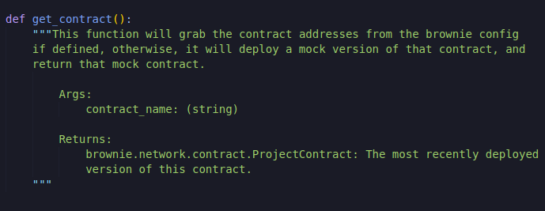

If this is little confusing to you we'll go over to chainlink mix in a little bit and inside of this has a more robust description of what's going on this get_contract. You can check that out if you want to learn more.

So we obviously want contract name as a parameter.Meaning that this get_contract function will get something like:

`get_contract("eth_usd_price_feed")`

That's gonna be the same as what's defined in our brownie-config.yaml file. From this name we're gonna get the type of contract that it is. To do that we're gonna have to create some mapping that'll map the contract names to their type.

**contract_to_mock**

eth_usd_price_feed is gonna be of type MockV3Aggregator and also we need to import MockV3Aggregator.

Now we need to check do we actually need to deploy a mock. Let's check if we're on a local blockchain. And we'll skip the forked local environments because again we don't need to deploy a mock pricefeedAddress on a forked local environment. Also we'll check if one of the contracts in contract_type has been deployed or not.

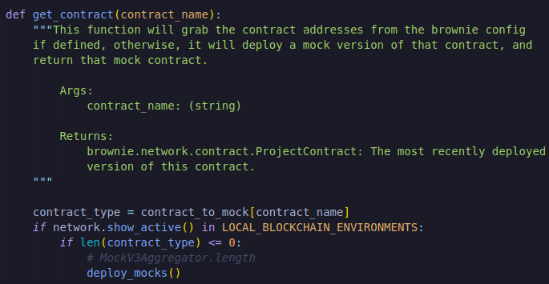

`if len(contract_type)<=0 is equivlent to MockV3Aggregator.length`

We're checking how many MockV3Aggregators have actually been deployed. If none of them have been deployed, we'll be deploying them.

We're gonna have to create this deploy_mocks function which is going to be same as what we did in our brownie FundMe.

Now we have a way to actually deploy the mock pricefeed. Let's go back to our get_contract function. So we have a way to deploy the mock if one isn't deployed. Now what we're gonna want to do is we want to get that contract. WE want to get that mock.

This is saying let's grab the most recent deployment of the MockV3Aggregator which is exactly what we want. This will work perfectly for our development context. However we're not always going to just want to deploy to a development network. We're also going to want to deploy to testnets.

For example if it's eth_use_price_feed, contract_name will be eth_usd_price_feed and the way we're setting it up it's got to be the same as what's in our contract_to_mock dictionary. Inside If the way we did it was we actually got the contract because we had it's contract type based off of brownie. Here we've to interact with the contract getting those two pieces that we always need:

- Address
- ABI

We actually have the ABI from our MockV3Aggregator type and we just got the address.So we can create the new contract type.

**Contract.from_abi**

This contract package can be imported from brownie and it has this function from_abi that allows us to get a contract from it's abi and it's address.

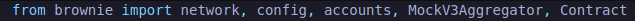

We gave it a name(contract_type._name)

MockV3Aggregators and all these contracts have a .abi attribute that returns the abi.
 They also have ._name which returns their name.

This is how we'll get the contract otherwise. And then at the end of all this we'll just return contract.

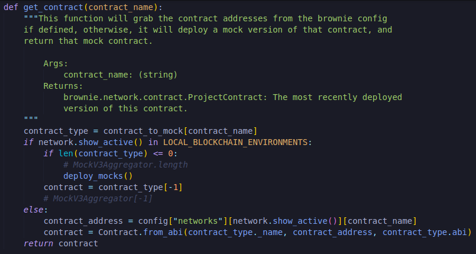

This is an incredibly powerful function for us to get a contract based off of if it's already deployed as a mock or it's a real true contract.

Now that we've this function let's go back to our deploy_lottery.

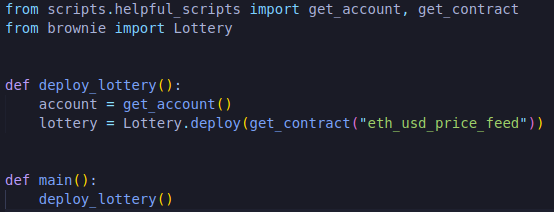

Let's go this again. This Lottery.deploy get_contract is gonna get an eth_usd_price_feed. If we don't have a mock deployed, it's gonna deploy a mock pricefeed for us and we're goint to return that mock pricefeed. However if we're on a testnet or a real network, we're gonna grab it's actual address and return a mock contract of it. Our mock contract has all the same functions of a regular contract. So we can just use it as the same. This way we don't have to adjust deploy_lottery function for whether or not we're deploying to a testnet or to an actual address.

The only additional piece we should put in here just for clarity is we should add .address because get_contract is gonna return the actual contract and we really only want the address.

This is going to make our coding alot more robust for moving between development environments and testnet environments and working with scripts in a really effective manner. 

Let's go back to lottery and figure out what are the different pieces we need.

We also need a _vrfCoordinator.

So to do this we're gonna go back to docs.chain.link, then to [contract addresses](https://docs.chain.link/docs/vrf-contracts/) and we could do mainnet here but let's also just set this up to work with rinkeby. We'll copy the address of Rinkeby's vrfCoordinator and add it to a new network in config file and while we're doing this let's also get the rinkeby address for our [pricefeed](https://docs.chain.link/docs/ethereum-addresses/), grab the address for eth/usd and add it in a config file. 

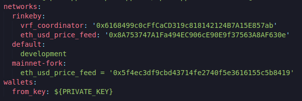

**Adding vrfCoordinatorMock**

Now we can do to get vrfCoordinator contract address.

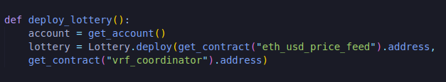

Ofcourse we're gonna have to go back to our helpful scripts because there's currently no mapping between what a vrf_coordinator is and what it's mock needs to be. We need to get a mock vrf_coordinator. First of all we don't even have our MockV3Aggregator. So let's go grab that as well. We can grab both of these at [chainlink-mix](https://github.com/PatrickAlphaC/smartcontract-lottery/tree/main/contracts/test).Let's go to VRFCoordinatorV2Mock and grab whole thing and create new directory "test" inside contracts and inside test create "VRFCoordinatorMock.sol" file and past the code there.Also create file for MockV3Aggregator and past the code.

VRFCoordinatorMock has different functions for actually working with the vrf_coordintor. One of the specific ones in particular is this callback with randomness that we're going to use in our tests. So our vrf_coordinator is also going to get mapped to our VRFCoordinatorMock and we'll also import it from brownie.

Just to double check everything's working we wanna run quick `brownie compile` to make sure we're importing our mocks correctly and everything is compiling.

We need a link token now. The chainlink token is just another smart contract. So we're gonna do the exact same thing here.

This means in our config for rinkeby let's add a link token address. Go to chainlink documentation and to [link token contract](https://docs.chain.link/docs/link-token-contracts/), grab the address and put it in config file.

Now we've it in our brownie-config. We also need to add it to our helpful_scripts.We need a mock link token for that which we can get from [here](https://github.com/PatrickAlphaC/smartcontract-lottery/blob/main/contracts/test/LinkToken.sol).We can just go ahead and grab everything, create a new file "LinkToken.sol" inside test folder and past it inside the file. In our helpful_scripts we're gonna map link_token to LinkToken and import LinkToken from brownie.

We need a _fee and a _keyHash. The _fee and the _keyHash are both just numbers. These aren't actually contracts. We don't need to put this through get_contract bit. What we can do is just in our config, in our development network, we just add a default for the keyHash and fee. I'm just gonna set my development keyhash and fee equal to the rinkeby ones. You can grab these from [here](https://docs.chain.link/docs/vrf-contracts/v1/).

In our deploy_lottery we can just grab this directly from a brownie config because we're always gonna have the default keyhash and fee.

Then ofcourse our last bit here.

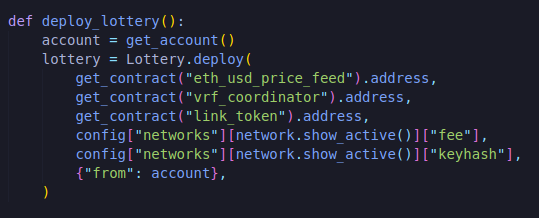

Then additionally as we learned last time if we want to publish this :

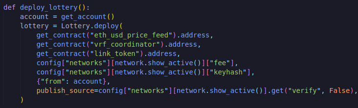

What this is saying is get that verify key but if there's no verify key there just default to false. This way if we don't set a verify key in development, that's fine it won't get verified. For rinkeby set verify to true. So we can actually verify this on a rinkeby chain.

Alright let's try this out.We'll do :

`brownie run scripts/deploy_lottery.py` for default development network

We run into this error.

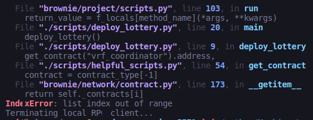

We get an issue with our get_contract function. We forgot to add deploying the mocks in our deploy_mocks function. Right now our deploy_mocks only deploys the MockV3Aggregator. Let's add the rest of the mocks in here. We're gonna need to deploy VRFCoordinatorMock and LinkToken. So let's open up those contracts see what they need. LinkToken doesn't have a constructor. We can just have it to be blank.

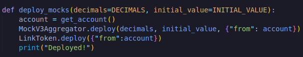

Let's see what that VRFCoordinatorMock takes.

It takes the link token as an address.

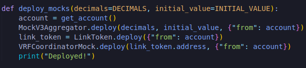

Let's try again deploying it again.

We can see that our MockV3Aggregator was deployed then our LinkToken was deployed then our VRFCoordinatorMock was deployed and then our lottery was deployed with those mocks defined. We deployed the lottery.

We could 100% go ahead and then run this script on an actual testnet because our config is set up well. Let's write more functionality for actually interacting with this lottery before we actually do that and then we can actually just run a script which will do all this functionality end to end because again deploying to testnet takes long time and we really only want to do that when we're done and fairly confident that everything's working well.

**Python Lottery Scripts/Functions**

What's the next thing that we'd want to do?Well we probably want to go ahead and start the lottery. Let's write a script that can actually do that.

**Start Lottery**

We said that the lottery is gonna be the most recent deployment of the lottery and we're gonna call startLottery function of Lottery.sol. It is indeed changing state. So we do have to make a transaction. Then in our main function we call the start_lottery function. So if we run this again on our development chain.

We did run into an issue and this is something you'll see something from time to time.

Typically workaround is you wanna wait for that last transaction to actually go through. So we'll say:

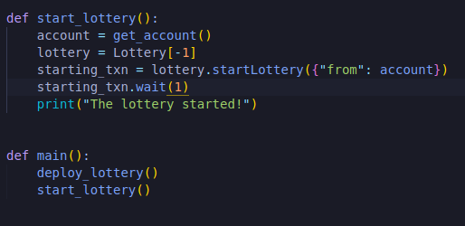

**enter_lottery**

Next we wanna do is enter the lottery. We need to pick some value to send when we call the enter function because we need to send the entranceFee with it and just to be safe I usually will tack on a little bit of wei as well because sometimes it might be off by like 1 or 2.

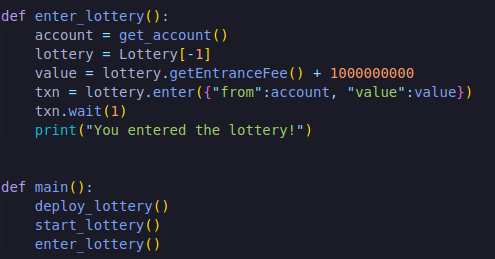

**end_lottery**

Before we actually end the lottery, we're gonna need some link token in this contract because our endLottery function calls the requestRandomness function. We can only requestRandomness if our contract has some chainlink token associated with it. So we're gonna need to first fund the contract and then end the lottery.

**Funding with LINK**

Since funding our contracts with the link token is gonna be a pretty common function that we use. Let's go ahead and turn this also into a helpful_scripts.

We have a contract address then we wanna who we're gonn fund with link. We'll set default account to be none. We'll do same with the link token as well. If you want to use a specific link token you can otherwise we'll just grab it ourselves and then we'll also do a default amount which will set to 0.1 LINK.

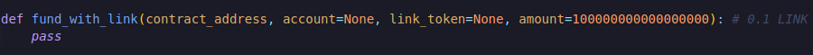

First we get an account. We'll be doing a little clever python stuff. We'll say account = account if somebody sent it otherwise we'll call our get_account function. Then we'll do the same thing with the link token. Now that we've the link_token contract from our get_contract function which again is basically the equivalent of Contract.from_abi on our link token, pulling from our config or from our mock. Now we can just call functions on the link_token. We're gonna transfer token to contract_address with a certain amount and from account. 

**brownie interfaces**

I do however wanna show you another way to work with this. Using the interfaces. Instead of doing the link_token.transfer directly on the contract, we can use the interfaces section to actually interact with some contracts. Right now we've our LinkToken inside contracts/test directory and it has all the definations and all the functionalities defined. Sometimes you're gonna have contracts that you don't have everything. You don't have all the functionality and maybe only have the interface or some functions definitions. So we can still interact with contracts with just an interface because again that interface will compile down to our ABI.

So as a another way of teaching us how to actually work with some of these contracts, what we can do is we can use the link token interface basically the same way as we use the link token contract [here](https://github.com/PatrickAlphaC/smartcontract-lottery/blob/main/interfaces/LinkTokenInterface.sol).  This will compile down to a way that our brownie package knows how to interact with these contracts. If you wanted to, you can just grab it, go to our brownie sections and inside interfaces, create a new file "LinkTokenInterface.sol" and paste the code.

What we can do in our helpful_scripts instead is first import interface from brownie and pass contract address. 

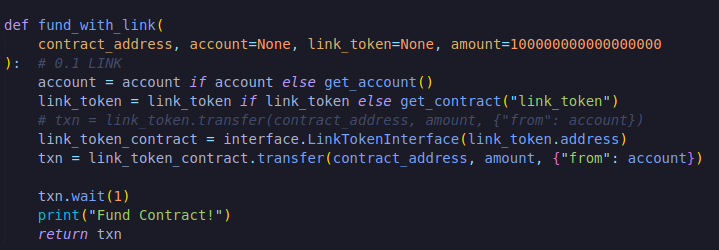

This is an another way we can actually create contracts to actually interact with them. So saw up in the code that Contract.from_abi which is great and interface is another way we can do the exact same thing.

If we've the abi, we can just pop it into Contract.from_abi. If we've the interface we don't even need to compile down to the abi ourselves because brownie is smart enough to know that it can compile down to the abi itself.

For now I'm gonna comment these two lines though and we'll just use the link_token.transfer for now.

Now that we've a funding function we can import fund_with_link from our helpful_scripts.

We're only passing contract_address in a fund_with_link functions because the way we've set the function will just automatically grab a default otherwise. And Once we were funded with link, we called endLottery function because again this is going to call that requestRandomness function from the chainlink vrf.

**waiting for callback**

From our end this is really all that we need to do but remember when we call the endLottery function, we're gonna make a request to a chainlink node and that chainlink node is going to respond by calling the fulfillRandomness function. So we actually have to wait for that chainlink node to finish. Typically it's within a few blocks. So normally what we can do is sleep for some time and we also need to import time.

We can see who that recent winner is if that chainlink node responded with a recent winner.

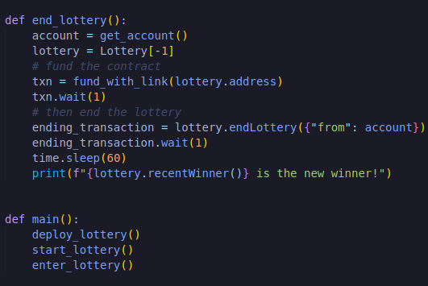

You might be thinking "There's no chainlink node watching our local ganache" and you're exactly correct.

What happens when we add our end_lottery function to our main function? Do you think that we're actually gonna get a recent winner back?Let's give it a shot.

`brownie run scripts/deploy_lottery.py`

While we're waiting here, this is when a chainlink node would go ahead and stat responding with our randomness. However as you probably astutely telling there's no chainlink node that's going to call this fulfillRandomness function right now. So for our ganache chain this will hypothetically end with nothing because there's no chainlink node actually responding.

For our testing purposes we're gonna figure it out how to actually get around that end the deal with that. We want to make sure that our tests are really solid on a development chain before we actually test this on an actual testnet. So let's jump into some of these tests.

We've already started with test_lottery.py but we're gonna iterate on this and make this even better. Now before we get into these tests there's a couple of things we wanna talk about.

**Integration Tests Vs Unit Tests**

Unit tests is a way of testing the smallest pieces of code in an isolated instance. We're going to use it loosely define testing independent functions in our lottery contract.

We also want to do integration testing which is gonna be testing across multiple complex pieces. Typically I like to run my unit tests exclusively on a development environment and my integration tests on a testnet. This is really helpful because we can test the majority of our application like we said on a development network and then still be able to see what actually happens on a real testnet and etherscan.

Typically what people do is in their test folder they'll create two different folders. One for unit and another for integration. Since for this demo we're only going to have one file for both. I'll not create those folders but it's pretty common practice. Instead I'm gonna rename the test file "test_lottery.py" to "test_lottery_unit.py" for unit tests and we're gonna create a new file called "test_lottery_integration.py".

**Unit Testing**

Now when writing the unit tests we really wanna test hypothetically every single line of code in our smart contract. This is incredibly important of course because smart contracts are open to everybody to see and interact with. So we really want to test every single line of code we've in Lottery.sol file.

Let's go ahead and finish writing a getEntranceFee test that will work on a local development network. As you can see we're already gonna refactor our test_get_entrance_fee function. So delete everything inside that function.

First we need to deploy our lottery. Since we've a deploy_lottery script already, we can just use the deploy_lottery script as well. If we wanted to we could just copy paste the whole code inside deploy_lottery function into our test but we'll work from the deploy_lottery script.

Now we import the deploy_lottery function.

And in our unit test we'll say:

`lottery = deploy_lottery()` which will give us our lottery.

Once we've our lottery contract, we can just call getEntranceFee.

`entrance_fee = lottery.getEntranceFee()`

And we wanna make sure the entrance_fee is what we expected it to be. So what we expect it to be? Well again in our helpful_scripts is going to deploy mocks and the initial_value is 2000. So if the price of eth is 2000 eth/usd, and the usd entry fee is 50, we'd say 2000/1 == 50/x  == 0.025. We can go ahead and even do the math in the script.

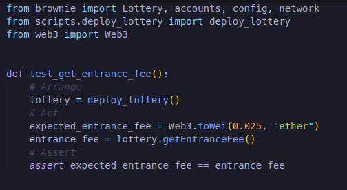

And to test it we'll do `brownie test -k test_get_entrance_fee`

This is working exactly as we anticipated.

**pytest.skip**

As we mentioned since this is a unit test, we really only want to run this when we're working  on a local blockchain environment or local development network. So we'll go ahead and do this with pytest again.

If you try to run this `brownie test -k test_get_entrance_fee --network rinkeby`, it should skip the test.

**test_cant_enter_unless_started**

Enter if going to be the first thing that these developers do. We can be more specific than that. We don't want people to enter our lotteries unless the lottery is actually started. So we make sure `require (lottery_state == LOTTERY_STATE.OPEN)` of enter function actually works.

Now when people try to enter a lottery that hasn't started yet it's gonna revert.

And ofcourse we gonna have to import get_account from scripts.helpful_scripts and exceptions from brownie.

Let's go ahead and test this `brownie test -k cant_enter_unless_started`. That'll pass as well.

**test_can_start_and_enter_lottery**

We've tested whether or not they can't enter. Let's test whether or not they can enter.

We asserted to check that we've correctly added a player to the lottery because we've our players array and we're asserting that pushing them onto our array correctly. Let's try this now `brownie test -k test_get_entrance_fee`.

**test_can_end_lottery**

Let's test to see if we can actually end a lottery.

Now we actually end the lottery we do need to send the link because we're calling requestRandomness. We use our fund_with_link function that we've in our helpful_scripts. We'll call fund_with_link on our lottery contract. Once we fund with link we'll then call endLottery.

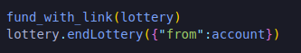

Then how do we actually know that endLottery is being called correctly?Well if we look back in our lottery contract. When we call endLottery, we're not doing a whole lot. All we're doing is changing our state. So let's go ahead and check to see if our calculating_winner state is different.

Calculating_winner is in position 2.

**test_can_pick_winner_correctly**

Now let's test the most interesting piece of this entire lottery contract. We're gonna test whether or not our fullfill function actually works correctly. 
+ Does fulfillRandomness function of Lottery correctly choose a winner?
+ Does it correctly pay the winner?
+ Does it correctly reset?

Let's go ahead and build our most complicated and most important test of this whole contract.

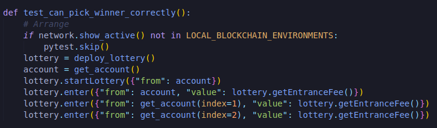

These are going to be different accounts because we want to test for multiple different people. This unit test is getting drastically close to being an integration test but as I said we're being a little bit loose with the definitions. Now we're gonna want to fund it with link and now we're gonna choose a winner here. This is where we actually have to modify one more thing in our lottery contract.

**Events and Logs**

In order to test actually calling this fulfillRandomness function and testing everything in here, we're going to need to call this fulfillRandomness function .If we look in our VRFCoordinatorMock, we've this function called callback with randomness and this is the function that actually calls this rawFulfillRandomness.selector which eventually will call that fulfillRandomness function but this is the entry point that the node actually calls. We've to pretend to be a chainlink node and call callBackWithRandomness function. We're gonna return a random number, choose the contract we want to return to but we also have to pass the original request_id associated with the original call.

Now in our lottery contract, our endLottery function isn't gonna return anything and even if it did, it'd be really difficult for us to get that return type in our Python. So what we wanna do is to keep track of when this contract actually entered the calculating_winner state is we want to do what's called `emitting an event`.

Events are pieces of data executed in the blockchain and stored in the blockchain but are not accessible by any smart contracts. Events are much more gas efficient than using a storage variable. You can kind of think of them as the printlines of blockchain.

You can go to the logs section in etherscan which also includes all the different events. We're actually going to do an event ourself just so that we can see what this really looks like.

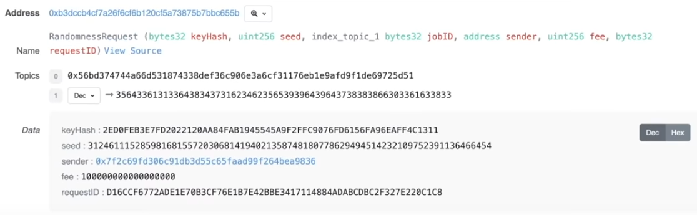

When we called endLottery function, in the logs if we scroll to the bottom, there's an event here called `RandomnessRequest` which was spit out by the vrfConsumerBase that we inherited and it even has some data that's already been decoded. One of those pieces of data is the request_id.

Now to add an event we first need to create our event type.

Now we've identified a new type of event called RequestedRandomness. It's really similar to enum in this regard. To omit one of these events, all we've to do in our endLottery bit is we'll emit RequestedRandomness.

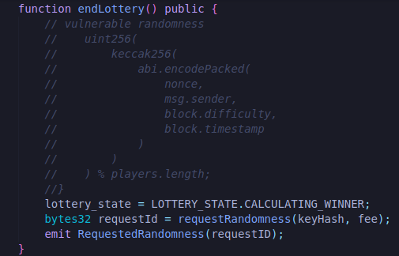

Because RequestedRandomness takes a bytes32 as an input parameter and we're gonna pass it that requestID as an input parameter. Now that we've this event being emitted, back in our test when we call endLotter, it'll actually emit one of these events to our transaction.

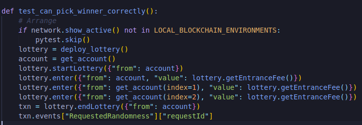

Txn has a attributes called events which stores all of our events. We can then looked for a certain event name which we know is RequestedRandomness and in there in that RequestedRandomness event find the requestId.

These events are really helpful for writing tests, upgrading our smart contracts or understanding when a mapping is updated.

Now that we've this request_id we can pretend to be the chainlink node and use this callBackwithRandomness function to dummy getting a random number back from the chainlink node. So we're gonna call our get_contract function to get that vrf_coordinator and we're gonna callback with callBackWithRandomness function.

**callBackWithRandomness**

We need to pass the request_id of random number and then the contract to return to. STATIC_RGN is some random number which is the random number that we're gonna return and lottery.address because we're gonna return it to the lottery. From account because it's making a state change.

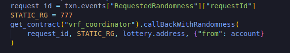

This is us dummying getting a response from a chainlink node and this is how we mock responses in our tests to make our lives way way easier.

Now that we've got our callback we can do our asserts. We can figure our who the winner of the lottery actually is. There are 3 entries that means it's 777 % 3 = 0 i.e our account is gonna be the winner.

We transfer them some money

Test this function out.

So go ahead and do our last bit. Create our integration test which we'll run on an actual chain and then if we wanted to we go ahead and try our deploy_lottery function on a real chain as well.

**Integration Test**

This is where we're actually going to test on a real live chain. We're gonna use rinkeby because that's the network that we've been using this whole time. Now I'm being a little bit liberal in the way that we're doing our tests here and we're just gonna do one test for this integration test but keep in mind you're gonna test every piece of your code. So let's just create a test.

This is going to be opposite of our unit test. Our unit tests only going to be on our local blockchains. We're gonna skip if it's not on our local blockchains. We're gonna do the opposite of pytest.skip thing.

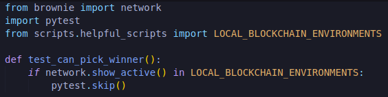

Rest will be similar like we did in unit test.

account is twice cause we want two people to enter the lottery.

After endLottery is where this is gonna be a little bit different from our unit tests. In our unit tests we pretended that we're the vrfCoordinator and we called the callback with randomness. We pretended that we're a chainlink node. But here we're not a chainlink node because we're on a actual network. So we're just going to wait for that chainlink node to respond. So for simplicity we'll just do  `time.sleep(60)` for it to respond. And since we're using time, we need to import it. And then since account was the only one to actually be in this. So we'll do assert for it. Also we'll do assert for balance.

we've an integration test which is going to run through pretty much vast majority of our functionality here. We can go ahead and test this with `brownie test -k test_can_pick_winner --network rinkeby -s` and before we run this we need to make sure we've test ethereum and link.-s flag will print out whatever brownie is going to print our.

**Test deployment**

Now that we've added our test, we can run our entire test.

for development `brownie test`

for testnet `brownie run scripts/deploy_lottery.py --network rinkeby`

First we go ahead and deployed our lottery. We got our addresses with our get_contract method, got our fee, keyhash, published_source and everything. Then we went ahead and verified it because it has this published_source. So if we grab the address "lottery deployed address", jump over to rinkeby etherscan, past the address in there we'll see the contract is checked mark. If we go to the read contract, we can see all the public variables and all public functions. We can go to write contract and see all the transacting functions that we can interact with.

After we get verified and things get deployed we went ahead and called our startLottery function to actually start the lottery then we entered lottery. We then funded the contract with linkSo we can get our random winner back. Right now our endLottery is confirmed and we're just waiting this 60 seconds because we did time.sleep.We can see on the transaction of that deployed lottery address in rinkeby etherscan, you can see different methods calls.

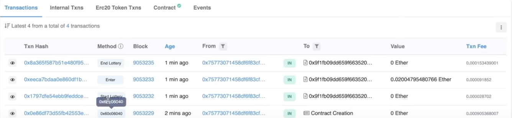

We can also go to events and we can see some events that we created.

We can see the first event is RequestedRandomness event. This is the event that we called. We can also see an OwnershipTransferred function that got called when we actually deployed this in the first place.

**Topics**

So topic 0 hash represents entire event. Hash near Hex is our topic 1 which represents that requestId. That is the requestId.

**Conftest.py**

One additional piece that I wanna talk about again in our testing a file that you often gonna see is "conftest.py".P ython automatically knows to look for this conftest file and we'll grab different functions from it. We can also add external plugins, fixtures, hooks and test root paths. It adds alot of fantastic features and is a common thing that you'll see. We skipped here for simplicity but in future projects you'll probably see this conftest file which has alot of really nice testing configuration pieces.
