**aave_borrow.py**

Let's go ahead and start with our account.

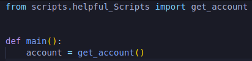

We're gonna get WETH address or we can even just do our ERC20 address because the WETH token is in ERC20 and maybe we wanna deposit some other ERC20.

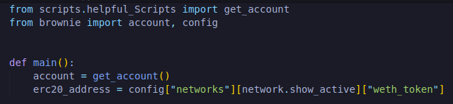

And now we wanna call this get_weth function just in case we don't already have.We'll import get_weth from scripts but we don't actually need to call it right now because we already have some wrapped ethereum in our Kovan address.If you wanna test this though on our local mainnet-fork we probably will want to call this get_weth.So I'm just gonna add a little if statement.

When we call get_account in our scripts, it actually knows that it's a local environment that we're working with and it'll just return accounts[0].Instead of us having to actually load a private key in every single time and we want to actually wait for our transaction to complete in our get_weth function.

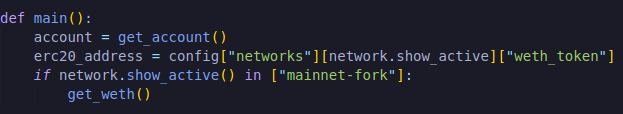

We can run `brownie run scripts/aave_borrow.py --network mainnet-fork`

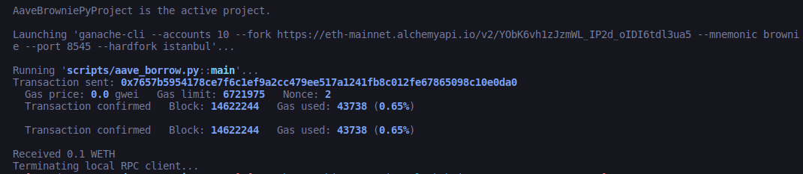

Testing everything on mainnet-fork is going to give us a really accurate view of what doin this on mainnet actually is going to give us.We don't need to do any mocking.We can literally just fork all of mainnet and go from there.We're still gonna test on Kovan though in a little bit just so we can see all the transactions that go through, how long it takes for stuff to happen etc.

So now that we've got some weth, we actually need to go into our second bit.We're going to deposit some ETH in Aave.In our case some WETH.So how do we actually do that?

Well everything that we need is going to be in [Aave documentation](https://docs.aave.com/developers/getting-started/readme).

**Lending Pool**

Where we deposit and borrow from in Aave is in their contract LendingPool.It have all of the functions that we need.It has deposit where we deposit our asset as a collteral, withdraw where we take it back, borrow, repay and a couple other interesting ones which we'll go into later.But for now we just really need to focus on repaying, borrowing, withdrawing and depositing.So as you probably guessed deposit is the function that we're gonna work on right now.Since this is the contract that we're gonna work with, as always two things you need when working with a contract are gonna be the `ABI` and the address.So we're gonna get this lending pool contract.

**LendingPool Address Provider**

Something about this lending pool is that the lending pool address can actually change little bit depending on alot of different pieces.There's this address provider which gives us the address of a specific or particular market.If we go back to the [Aave UI](https://classic.aave.com/#/markets), there's actually different markets.

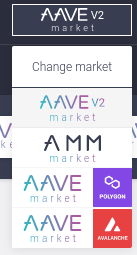

There's different types of ways we can interact with aave.We're just gonna work with the basic Aave V2 because it's easily the most used on mainnet.As well as the address provider registry will give us so this address provider will give us the address of the lending pool for our market.If we want to go across different markets, we have to go to [address provider registry](https://docs.aave.com/developers/core-contracts/pooladdressesproviderregistry) to find it but the addresses in here don't change.There's just one function that we need to work with this is getLendingPool which will give us the address of the actual lending pool.

So don't let it confuse you too much.Basically all we're trying to do is we're saying where's aave located right now and aave has a contract that will always tell us where the main aave contracts are and that's this addresses provider.So This is another contract that we've to work with.

Again when we've a contract, we need ABI and address.So we can absolutely once again we could go ahead and use interface because life is great with an interface.If we know we're only gonna work with one or two functions, we can actually just make the interfaces ourself.So an interface, we could do new file and give it a name "ILendingPoolAddressProvider.sol" and we can just add it in here ourselves.

Tips: You don't need the whole interface.Just define the functions that you'll work with. 

We know that there's only one function called getLendingPool and we're not exactly sure what getLendingPool is defined as but what we can do is we can go to [aave's github](https://github.com/aave/protocol-v2/blob/master/contracts/interfaces/ILendingPoolAddressesProvider.sol) where we can see:

It's an external view and returns address.Let's make our getLendingPool the same.

We could run with this and this would work perfectly fine but this leads us to the next point we might just as well grab the whole thing.This way we know for fact we're not getting anything wrong.If we wanted to, our interface could be this only because this is going to compile down to an abi and the abi is gonna say "There's a function here."and that's all the abi is really doing.It's just telling us how we can interact with a contract but let's go ahead and everything so that if we want to interact with more things, we can.

So now we've the abi, we also now need an address which we can definitely find from the [aave documentation](https://docs.aave.com/developers/v/2.0/deployed-contracts/deployed-contracts).We're gonna find LendingPoolAddressProvider, copy that and put it in our brownie-config.

Now that we've an abi and the address for both Kovan and mainnet-fork, what we can do now is first get the lending pool addresses provider from the interface.

Then we want to return the address of the lendingPool.

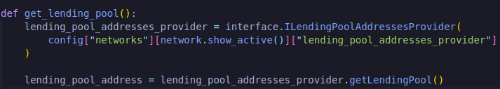

Because the address provider has this getLendingPool which returns the address of the lending pool.Now that we've the address, we can actually return the lending pool contract by once again getting the abi and the address of the actual lending pool.So we have the address, we just need the abi which once again we can work with our wonderful interfaces "ILendingPool.sol".

There's only gonna be couple of functions we're going to work with but aave actually gives us the [interface](https://docs.aave.com/developers/v/2.0/the-core-protocol/lendingpool/ilendingpool).

**Fixing Importing Dependencies**

We do need to actually change one thing in ILendingPool.sol.This interface imports locally with `./`.So we actually just need to change these imports to actually import directly from github instead of importing locally.Luckily this is something we already know how to do.So let's go to our brownie-config.

This way brownie will download this right from github and now we can just use @aave instead.So back in our ILendingPool.sol, we can change `./` to 

Now we've actually imported this interface for us to use,we can go ahead and just compile just to make sure that everything is working correctly.

`brownie compile`

If these interfaces had an issue, they actually wouldn't compile through brownie.

Now that we've the interface, we know that these interfaces compile down to the abi and we already have the address.So to actually interact with the lending pool now.

Now we've a function that goes through the lending pool addresses provider from the aave documentation and returns the lending pool contract that we can now interact with.

Now that we've the actual address, what we're going to do now is we're gonna take this WETH that we've got this ERC20 version of Eth and we're going to deposit it into this contract just like what we did in the UI.In order to actually first deposit it, we need to approve this ERC20 token.

ERC20 tokens have an approve function that makes sure that whenever we send a token to somebody or whenever a token calls, a function that uses our tokens, we actually have given them permission to do so.So that's the first thing that we actually have to do is we're gonna have to approve sending our ERC20 tokens and this resembles so.Since I know we're going to have to approve alot, I'm actually just going to go ahead and make an approve ERC20 token function similar to what we did with the getLendingPool.

How do we actually call this approve function on a token contract?Well as always we're gonna need the abi and the address of the token contract.Now we could create our interface ourselves, looking at the functionalities of the ERC20 tokens or grab it from [here](https://github.com/PatrickAlphaC/aave_brownie_py_freecode/blob/main/interfaces/IERC20.sol).Copy everything and paste it inside IERC20.sol inside interfaces.So you can see number of different functions.We can check the allowance, balanceOf different addresses, how many decimals a token has, the name, the symbol, do some transfer and then the function that we're gonna be using is approve function.We can see the parameters the approve function takes.We're gonna need to have a spender and how much they can actually spend.So 

if we come back to approve_erc20, we know for input parameters are amount, spender address, erc20 token address and account.

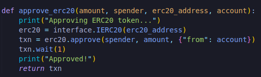

So back up in our main function, we could call approve_erc20 for some amount, the spender is gonna be the lending_pool address, erc20_address and account.The only thing that we haven't defined right now is some amount which we can make it really whatever we wanna be.To keep things standard let's make it 0.1. 

Now we can run `brownie run scripts/aave_borrow.py --network mainnet-fork`

We can see that our approve function is working as intended.It's annoying to do --network mainnet-fork so we'll change our default to mainnet-fork.

Now we just need to deposit it into aave.Since we know we're probably gonna use this alot too, let's go ahead and create a deposit function.

**deposit function**

Since we've everything approved we can now go ahead and use the lending pool deposit method and we can check the [documentation](https://docs.aave.com/developers/v/2.0/the-core-protocol/lendingpool) to see what the parameters that it takes are.

First thing is gonna be the address of the asset which we know is gonna be erc20_address, amount of the token, address onBehalfOf is just gonna be our account.address.We're depositing the collateral for ourselves and then referral code which is actually deprecated and workloads don't actually work anymore so we're always gonna be passing 0.

Now we can run it to see if everything's working fine or not.

`brownie run scripts/aave_borrow.py`

If you get the `"SafeMath Substraction Overflow error"` then change the datatype of amount in ILendingPool.sol to int256 run the script.It'll run fine and again keep the datatype as it was before i.e uint256.

Now that we've some collateral deposited, we can go ahead and actually take out a borrow.We can go ahead and borrow some other asset.The question gonna be how much.How much can we actually borrow?How much should be borrow?What would result in positive health factor?

**getUserAccountData**

Maybe we should actually pull off chain some of our stats.How much do we actually have deposited?How much collateral we've?How much debt we've and so on and so forth.That way in the future when we don't start clean, we can take some inventory of where we stand with our collateral in our debts.

At the [aave documentation](https://docs.aave.com/developers/core-contracts/pool), we can go ahead and see the getUserAccountData function.This is going to return the user account data across all reserves.So it's gonna get the totalCollateralETH that we've deposited in terms of ethereum, total debt in terms of ETH, how much we can borrow: the borrowing power we have, liquidation threshold or how close to that liquidation threshold will be, loan to value ratio and again health factor.This health factor is obviously incredibly important because if it drops below 1 or reaches 1, users can call liquidation call.This function all these variables but for now we really only care about how much collateral we've, how much debt we've and how much we're available to borrow.So let's go ahead and write a function that will actually sort that for us.

We're looking to call get_borrowable_data function on the lending pool from an account.So let's go ahead and call that function.

If we look at the API, all that it needs is a user's address to get started and it return 6 variables.

getUserAccountData is a view function so we don't need to spend any gas.All of the variables are gonna be returned in terms of wei.So let's just go ahead and convert these from wei to something that makes a little bit more sense to us.

 
 
 The reason that we'd to add float variable is that without it some of the math that we're gonna try to later won't pan out.
 
 Now we've this function get_borrowable_data and we're gonna pass lending_pool and account.Since we're returning available_borrow_eth and the total_debt_eth, we do:
 
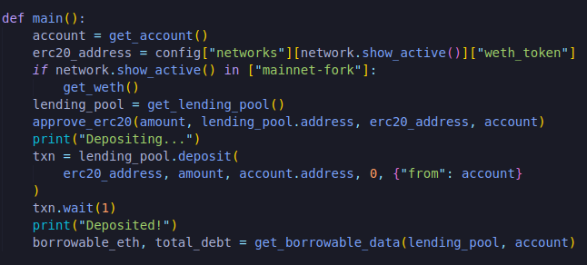

Let's go ahead and try this out.

`brownie run scripts/aave_borrow.py`

We've deposited 0.1 worth of ETH, 0 ETH borrowed and we can borrow 0.08 worth of ETH.The maximum amount that you can borrow will always be less than your collateral.This is because of the `liquidation threshold`.

**liquidation threshold**

In the [risk parameters documentation](https://docs.aave.com/risk/asset-risk/risk-parameters), we can see different liquidation thresholds on different assets.We can see Ethereum has 80% loan to value(ltv).With Ethereum we can only borrow upto 80% of the deposit assets that we've.And If we have more than 82.5% borrowed, will actually get liquidated.It also tells about the liquidation bonus, reserve factor and some other helpful pieces.

**Borrowing DAI**

Now that we've this borrowble ETH amount, we can go ahead and actually borrow some DAI.

**Getting DAI conversion rate**

In order for us to borrow some DAI, we also need to get the conversion rate.We need to get DAI in terms of ETH.We're going to have to use some price feed here.Luckily we already know how to work with chainlink and how to get pricefeeds.Aave uses the chainlink pricefeeds as well.So we're using the exact same conversion rate tools that aave's gonna use.Let's create a function to get us the conversion rate.

we passed the dai_eth_price_feed which will be the address of the dai ethereum conversion rate.Let's go ahead and create get_asset_price function.

First thing we're gonna need is this die_eth_price_feed address.Where can we get this?As we know per usual we'll head over to [chainlink documentation](https://docs.chain.link/docs/ethereum-addresses/), grab the address and paste it into our config for mainnet-fork and for Kovan as well.

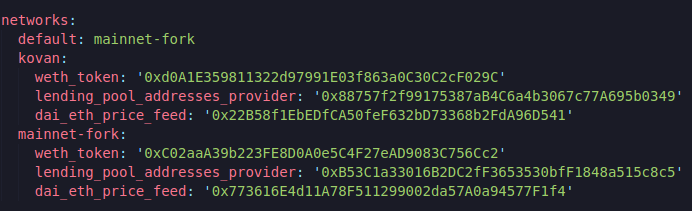

and then we can get the address of the same way we got the address of the WETH token.

Now we've a way to change the price feed address depending on what network we're on.So in our get_asset_price function, we're gonna do the same exact thing that we always do.We're gonna grab an ABI and an address to work with the contract.Again we can get the ABI by just working directly with the [interface](https://github.com/smartcontractkit/chainlink/blob/develop/contracts/src/v0.6/interfaces/AggregatorV3Interface.sol).

Now the dai_eth_price_feed is gonna be a contract that we can call a function on.We can always refer back to [get the latest price documentation](https://docs.chain.link/docs/get-the-latest-price/) to see how to actually wort with it.Even simple python code is there for working with it in Web3.We're gonna go ahead and call latestRoundData function which we can also find in our AggregatorV3Interface which returns roundId, answer, startedAt, updatedAt and answeredInRound.All we're really concerned with is answer.The way we can do this is :

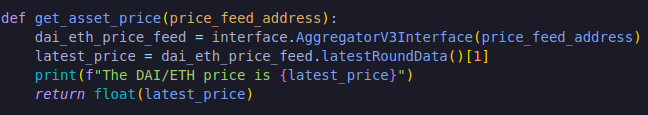

So let's go ahead and run this:

`borwnie run scripts/aave_borrow.py`

We know that DAI/ETH price feed has 18 decimal place.The number that shown of the screen isn't the real price.The real price is divisible by 10**18.But this number is difficult to read.So what we can do is we can use the method of fromWei from Web3.

Now we've DAI/ETH price.We're getting really close to borrow this actual asset.Let's even return the converted_latest_price just so that we're always working in units that we understand.

Now we can calculate the amount of DAI that we want to borrow.

And just to be safe we times it by 0.95 to make sure our health_factor is better.This line we're converting our borrowable eth to borrowable dai and then we're timsing it by 95%.We're timing it by 95% because we don't wanna get liquidated.Remember how we slid that sliding scale around to make it safer and less safe.Well the lower percentage that we actually borrow maybe we even borrow 50% of our collateral the safer that we're gonna be.Keep that in mind when you're deciding how much to actually borrow if you wanna run this in a production environment.

Finally we'll borrow now.Looking at the [aave documentation](https://docs.aave.com/developers/core-contracts/pool), we can look at their borrow function.Let's go ahead and call this function.

**Getting DAI address**

First we should get a DAI address which once again we'll want to put it in our config.We'll add the dai_token which we can find from [etherscan dai token](https://etherscan.io/token/0x6b175474e89094c44da98b954eedeac495271d0f?a=0x2faf487a4414fe77e2327f0bf4ae2a264a776ad2#writeContract).

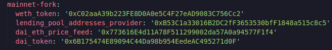

If you want to run this on Kovan you're also gonna need to have a DAI token for Kovan.

**Aave Testnet Token Addresses**

On testnets aave actually changes up where the tokens for it's testnets are actually going to be.So if we go to their documentation, we go to deployed contracts and we go to Kovan.

It's gonna be the same thing for tokens.And you can get the address of DAI from [here](https://docs.aave.com/developers/deployed-contracts/v3-testnet-addresses).

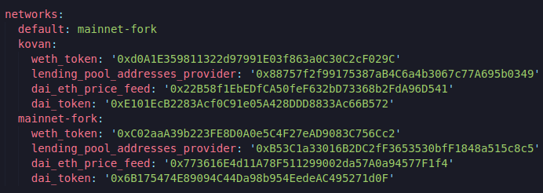

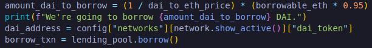

Now let's move on to the next parameter.The amount which we just figured in the code above but we do need to change it back to Wei.Then our interest rate mode which is gonna be either stable or variable.Stable is where the interest rate will always be exactly the same.Variable will change depending on alot of different things going on with aave.For safety we're just gonna go with stable.Then we're gonna do referral code and onBehalf.Referral code no longer exists so we'll pass 0 and it's gonna be on behalf of ourselves.

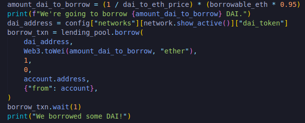

If we've done this right we should have borrowed some DAI programmatically from the Aave protocol.And we can once again call our get_borrowable_data function since this function will print out our new account information for how much we've borrowed.

Let's go ahead and run this in our mainnet-fork again.If we've done this correctly we now see that we've borrowed some DAI.

**Repaying**

We've learned how to borrow everything which is fantastic.Let's go ahead and actually repay that back.So we're gonna call their repay function and we'll put it into their own function called repay_all and we'll give the amount that we want to repay, lending_pool address and our account.

So if we're gonna pay back first thing we need to do is actually call the approve function to prove that we're going to pay back.So we need to approve that erc20.

Our ERC20 already calls wait so we don't have to call it.So once we approve we're gonna be using the DAI that we've borrowed to pay most of what we've borrowed back.Now we're going to call repay function.

First we passed the asset that we're gonna use to repay, amount, the rate mode which we hard coded to 1 and the address on behalf of.

Let's see if this works:

`brownie run scripts/aave_borrow.py`

**Kovan Run**

If you want to what we can also do is we can see if this will work with our wallet address.What I can do is copy the address of the metamask, go to Kovan etherscan and test everything you'll run through the script.

You've essentially learned everything that we need to do through to become quantitative defi wizards and build really robust financial applications in the defi world.

**Testing**

Something I wanna point out.Even though this isn't a python course and we're learning more about solidity and smart contracts, it's still in your best interest to test these functions.Yes I know they're python functions but it's still gonna be in your best interest to test them to make sure your application always works as you expect it to.This is actually gonna be even easier than that lottery contract that we did since we're just testing python functions and we can test with `brownie tests`.  

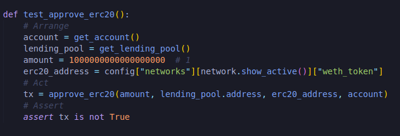

