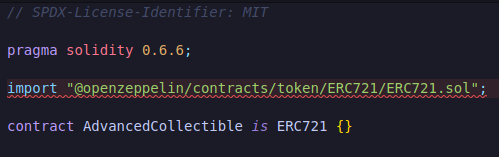
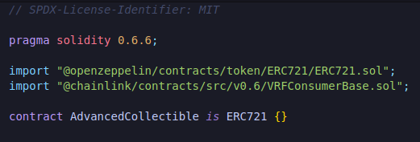
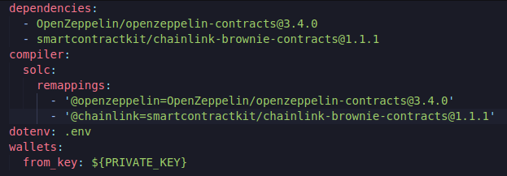
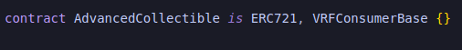
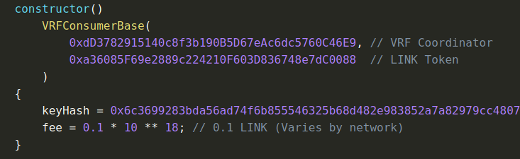
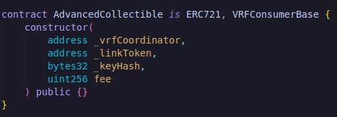
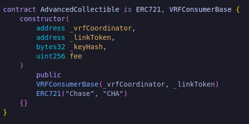
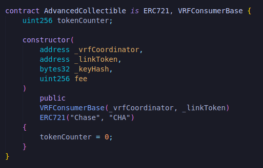
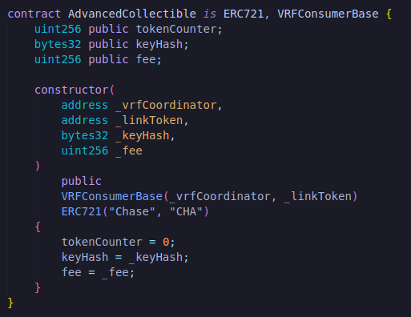
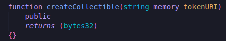

**Advanced NFT**

Let's go ahead and create a new file in our contracts "AdvancedCollectible.sol".What we're gonna do here is we're gonna make again an NFT contract, token URI can be one of 3 different cats.When you mint NFT you'd get random image from your image directory.I'm not going to go over stat generation and like creating battling NFTs or really games out of these but if you wanna see a version of those contracts check out this [repo](https://github.com/PatrickAlphaC/dungeons-and-dragons-nft) to see and it actually creates characters that can do battle and have like stats and attributes like attack.The repo is done with truffle as opposed to being done with brownie but all the contracts are going to be the same other than migration.sol.

Since we're gonna work with chain-link VRF to get a provably random NFT, we're also importing VRFConsumerBase.

We're gonna go back to config and add chainlink in our dependencies.

Our AdvancedCollectible is ERC721 and VRFConsumerBase.

So same as always let's go ahead and start with the constructor.We knoe from our lottery smart contract that we're actually wanna parameterize alot of the pieces for working with the VRFCoordinator for working on different chains and testnets.We can always head to [chainlink docs](https://docs.chain.link/docs/get-a-random-number/v1/) to get a random number just in case we forgot what some of the parameters are.

**Double Inherited Constructor**

Of course we need to do the VRFConsumerBase constructor and the ERC721 constructor so:

We know we're also gonna need to do tokenCounter(looking from SimpleCollectible.sol).

We're gonna need a keyHash and fee too.

This is a combination of alot of stuff we did in our lottery smart contract and some of the pieces that are from ERC721.We need the keyHash, fee, vrfCoordinator and linkToken all for the VRFConsumerBase and we need "Chase", "CHA" and tokenCounter for ERC721.So now we're gonna create our function createCollectible.

