**Advanced deploy_and_create.py**

Now let's create our advanced collectible scripts and alot of what we're going to do is going to be the same as the simple one deploy_and_create.py.Copy paste everything of simple collectible deploy_and_create.py to advanced collectible deploy_and_create.py script but we're going to change a couple of things.

**Refactoring**

Opeansea url we're accessing in couple of different scripts.So we're actually gonna take it and move it to our helpful_scripts.

Now in our simple deploy_and_create, import OPENSEA_URL from helpful_scripts.

Now OPENSEA_URL is going to come from helpful_scripts and same for deploy_and_create for Advanced.So I've now copied and pasted all the code form deploy_and_create of Simple Collectible to deploy_and_create of AdvancedCollectible.Let's go ahead and modify this now.

This is going to be our starting point.

**Deploying AdvancedCollectible**

Our advanced collectible has a different constructor.It's got a VRFCoordinator, link token, keyHash and a fee.So we're gonna have to add those as the parameters.We wanna work with rinkeby for this because the opensea marketplace right now for testnets only works with rinkeby.So let's get started and grab those rinkeby addresses first.

Our advanced collectible needs a VRFCoordinator and a link token.So if we head over to [chainlink documentation](https://docs.chain.link/docs/vrf-contracts/#rinkeby) for the VRF, grab the VRF Coordinator for Rinkeby and same as before we'll jump into our config add it there.We'll do need the link token, keyHash and fee as well.

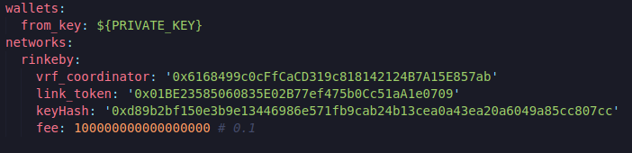

Now in our advanced collectible deploy_and_create, we can go ahead and add those variables.Since we're going to be interacting with actual contracts that are on-chain and we're going to want to be able to flip back and forth between the mock versions of them we're gonna bring back that get_contract function that we used before.This is the function that's going to be smart enough to know if we need to deploy a mock or just grab from an actual contract.

Feel free to copy and paste from our last project.Something that we do need to talk about though is our deploy_mocks function.The syntax here is basically exactly the same however we do need to deploy a couple of mocks.So make sure you have these in your deploy_mocks function.

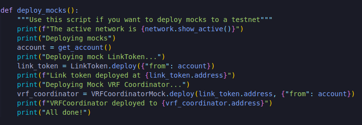

**Continuing our deploy script**

We can go back to our advanced collectible deploy_and_create, import get_contract from helpful_scripts.

Then for keyHash and fee since these can be whatever we want and these aren't really contracts, we can go back to our config we'll add the development network and add keyHash and fee.

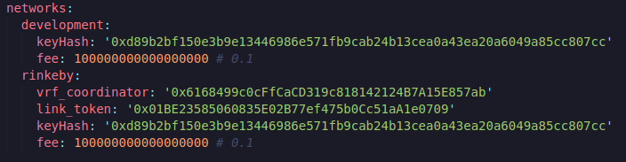

So keyHash and fee on our deploy_mocks gonna be:

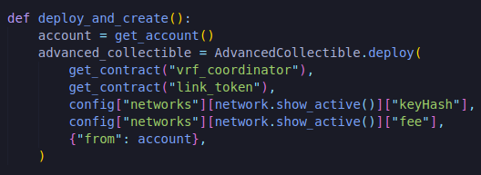

and get the VRFCoordinatorMock.sol and LinkToken.sol file inside contracts directory.

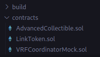

Now let's go ahead and run this on the development network.

`brownie run scripts/deploy_and_create.py`

IF you get this error:

`cannot import VRFCoordinator Mock from brownie`

In your deploy_and_create.py script do the import changes.

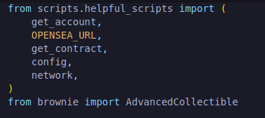

and then in your helpful_scripts.py do this import.

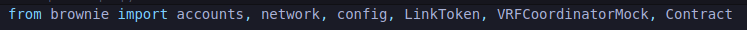

then run `brownie run scripts/deploy_and_create.py`

It should be fine now :)

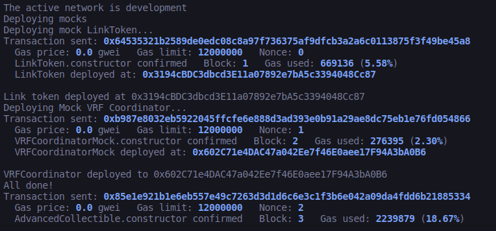

We can see we did couple of things here.First we deployed the Mock LinkToken, then we deployed our Mock VRFCoordintor and then we deployed our AdvancedCollectible all on a local network.

Once we deploy this code we're gonna want to fund this contract with some LINK because we can call the random number.I like to have my funding with link also in a function and we'll give it the address of the advanced_collectible.Let's go ahead and create fund_with_link function.Feel free to copy this function from past projects.

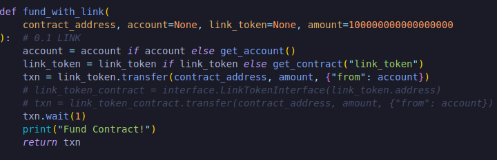

and call that function in deploy_mocks.

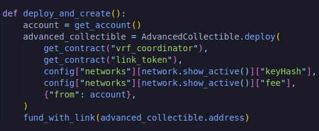

All we have to do now is call our createCollectible function .

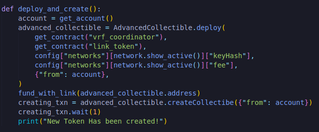

We definitely want to test this because we've number of custom scripts.So let's go ahead and do a manual test.

`brownie run scripts/deploy_and_create.py`

If you get this error:

`createCollectible Sequence has incorrect length, expected 1 but got 0`

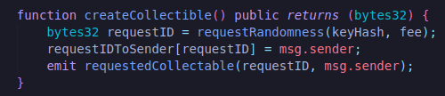

Now ideally we would have ofcourse write some tests but I want to show some things that are easier to demonstrate on an actual testnet.So we're gonna go ahead and deploy this to an actual testnet before we write our tests. 

`brownie run scripts/deploy_and_create.py --network rinkeby`

If you get error like:

`ValueError: Gas estimation failed: 'execution reverted'. This transaction will likely revert. If you wish to broadcast, you must set the gas limit manually.`

I was following the VRF v2 guide but my code was using the vrf v1 and thus I was using the wrong contract address and keyhash. In order to fix it, I need to retrieved the contract address and keyhash of [VRFV1](https://docs.chain.link/docs/vrf-contracts/v1/).

`
 vrf_coordinator: '0xb3dCcb4Cf7a26f6cf6B120Cf5A73875B7BBc655B'
 link_token: '0x01BE23585060835E02B77ef475b0Cc51aA1e0709'
 keyhash: '0x2ed0feb3e7fd2022120aa84fab1945545a9f2ffc9076fd6156fa96eaff4c1311'
 `
 
 

