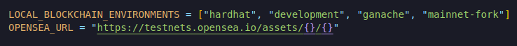
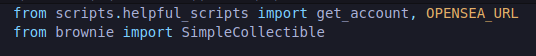

**Advanced deploy_and_create.py**

Now let's create our advanced collectible scripts and alot of what we're going to do is going to be the same as the simple one deploy_and_create.py.Copy paste everything of simple collectible deploy_and_create.py to advanced collectible deploy_and_create.py script but we're going to change a couple of things.

**Refactoring**

Opeansea url we're accessing in couple of different scripts.So we're actually gonna take it and move it to our helpful_scripts.

Now in our simple deploy_and_create, import OPENSEA_URL from helpful_scripts.

Now OPENSEA_URL is going to come from helpful_scripts and same for deploy_and_create for Advanced.So I've now copied and pasted all the code form deploy_and_create of Simple Collectible to deploy_and_create of AdvancedCollectible.Let's go ahead and modify this now.

This is going to be our starting point.
