**Integration Testing**

Let's go ahead and make a integration test.Our integration test is actually going to look really similar to our advanced collectible unit test.So I'm just going to go ahead and copy everything.Create a new folder under tests called "integration" and paste everything on a file inside "test_advanced_collectible_integration.py".

The only thing that we're going to change is that we're not going to be the ones to callBackWithRandomness function and also don't need the requestID anymore since the chainlink node is going to be responding.This means the breed that we're gonna get is actually gonna be random.

All we need to do is wait for the transaction to get called back.So we're going to import time and instead of us calling  with randomness we're just going to do and we're giving a different function name.

 
 
 
 Now we should be able to tests this on a rinkeby chain and our token counter should indeed increase with the chainlink node actually responding.
 
 `brownie test -k test_can_create_advanced_collectible_integration --networks rinkeby`
 
 
 
 Oh whoops right now we're skipping it because we're saying only for Local testing.Since this is going to be our integration test we're going to do the opposite.
 
 
 
 So now we've quick and dirty integration testing that we can run.We're not going to run it for now because we're going to be working alot with this rinkeby chain and we're going to de deploying alot of different things and we don't want to wait so long.
 
 We've a way to deploy this, we've a way to get these new collectible tokens and create them but if we're to take this address righ now and try to view this token on something like opensea, we'd get nothing back.We wouldn't get any result.Right now our token doesn't have a way to be viewed or be visible by everybody else.These NFT platforms don't know what they look like and again this is where that setTokenURI is going to come into play.So we have to figure out a way to host an image and host all the metadat for our token URI and the way we're gonna do this is by using `IPFS` and this is lot better than actually hosting on our own server because anybody then can go ahead and host the image or metadata themselves.
 
 Now there's further improvements with Filecoin where you actually pay to have your image hosted forever.However IPFS can hook into Filecoin in the future and and is going to be a good enough solution for what we're looking to do here.Just keep in mind what we don't want to do is run this on a centralized sever.When we spin up our IPFS node, we'll be the only node that actually runs and actually hosts our image.However the image is open for anyone to pin to their nodes as well.So it's much easier for us to host our images in a decentralized manner.What's bad obviously is if we just had the image stored on our centralized server because if our server goes down then that url no longer exists.If at least 1 node on the IPFS network is hosting the image, it'll be available for anybody to see.So that's why it's going to be a much better solution than some centralized server.As I mentioned decentralized storage is a topic that's getting better and better and we're looking forward to seeing more and more ways to interact with them.
 
 In any case we need to create an IPFS node that's gonna host some metadata or like what we saw with our SimpleCollectible it needs to host metadata.We both have to host a metadata file and an image URI file which will host the actual image.Both of these needs to be stored in IPFS.So let's go ahead and create a new scripts called "create_metadata.py".
 
 **create_metadata.py**
 
 It'll read off-chain and create our metadata file.
 
 
 
 Once we've this advanced collectible we can loop through all of the tokens and actually figure out the metadata for each one of them.
 
 
 
 Because we want this create_metadata to create the metadata for every single token that we've created.
 
 We even run this real quick.
 
 `brownie run scripts/create_metadata.py --network rinkeby`
 

If I were to run our create_collectible script again and then our create_metadata script would of course get more but right now we only have one collectible.

Now loop through all these collectibles and create their metadata, so we're going to create that file that has metadata which is going to have the name which is going to be based off of the random breed that I got, going to have description which is based off of the random breed again, going to have an image which is also based on the random breed.

**get_breed**

Now Advanced Collectible.tokenIDToBreed is going to return an integer because again in our AdvancedCollectible.sol, the enum Breed is going to be 0, 1 or 2.We actually want to create a quick mapping that represents that 0 is persian, 1 is bengal and 2 is minx.So I'd actually like to create in a helpful_scripts called get_breed.

So Instead of doing "advanced_collectible.tokenIDToBreed(token_ID)", we can now just do:

Now that we've the breed we can start creating the metadata file.We're going to have some type of format for our contract to always pull from.So I'll create a new folder called metadata and in this folder I'll have a new file called "sample_metadata.py".

**sample_metadata.py**

Attributes should be blank because we don't actually have any on-chain attrubutes but I'm just gonna go ahead and add some to show you what you could do if you wanted to give your cat some stats.You know maybe cuteness, maybe power, maybe speed whatever you want to do.

So now once we've this sample_metadata file, we can import this to our scripts in create_metadata.

Another quick note you might want to put a "__init__.py" file in that metadata folder if you're working on older versions of python and we start creating our new metadata file for the breed.We want to save each collectible under their network and with their token id.Let's go ahead and create new folder inside metadata called rinkeby and this is where we'll save all of the rinkeby metadata for all the token ids.Before we actually save it though we should just check to make sure that the file doesn't already exist because if the file already exists that means that we've already created the metadata for that token and we don't need to.

We can even just print this out to do a quick mannual test :

`brownie run scripts/create_metadata.py --network rinkeby`

Now we can actually check this to see if this already exists and we're going to use a python library called `path`.

So let's go ahead and start creating metadata file.We have to give it a name, description and image uri.Since template in a dictionary or a mapping in python, we can actually just go ahead and start mapping.

Now we're gonna need for image uri.

**Uploading Image to IPFS**

This is where we're going to have our image already uploaded to IPFS so we can assign it to our metadata.Well we're probably gonna need some upload_to_ipfs function which returns our image uri and then we can just set that image_uri to the collectible metadata of image.So let's go ahead and start doing that.

Now in order to upload to IPFS, we ofcourse need to have our images ourselves.To make this little bit generic, we'll have this upload to IPFS take a filepath that way we can pass the image uri upload to IPFS.We're going to give it some type of file path.So we'll grab that image file name.

Then we can pass this to upload to IPFS.So this filepath is going to be the location of the object that we're going to upload to IPFS.We're going to use path library to actually grab that path to upload it to IPFS.

What we're doing is we're taking the "filepath", opening the file, "rb" means we're gonna open it in binary.Since these are images that's how we open it and upload the binary actually to IPFS.As "fp" So we're saying is opened file is gonna be named fp.And fp.read is how we read the whole binary.Now the whole image is stored as binary.

Now we're going to do the upload stuff.

**Download IPFS Command Line**

To get started here we actually going to have to download the [command line](https://docs.ipfs.io/install/command-line/#official-distributions) for IPFS and in there there's a instruction to download it for system that you're working on.

You'll know you've done it right if you can type:

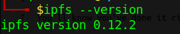

Important to note we could also do the IPFS download desktop and we could download the desktop version of this and we could see user interface, upload our file manually and then manually go ahead and grab those files and place it into our scripts but we're engineers we want to do this programmatically.

**HTTP IPFS DOCS**

In any case once we have this API downloaded, we can actually follow the documentation of http api reference for actually uploading our code.We're going to be mainly working with [`/api/v0/add`](https://docs.ipfs.io/reference/http/api/#origin-based-security).As this is the endpoint that's actually going to add our file or directory to IPFS.

Now what we're going to want to do is we're going to actually upload our images to our own IPFS node.we can run our own IPFS node by doing:

`ipfs init` and then `ipfs daemon`

We can even see a webUI using.Congratulations you're running your own IPFS node.As you can see it's currently running on our own localhost at ` http://127.0.0.1:5001`.So to actually upload this we first need to get that IPFS url which is going to be the webUI.

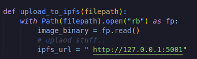

Now we want to make an API call or a post request to this endpoint using `/api/v0/add`.What we're going to do to keep working with our scripts is you should have a little plus button somewhere on your vscode, hit that button and we're actually going to have two different shells.One which is running our IPFS node and one which is running our bash.

Now that we've the ipfs_url, we're going to grab the endpoint.

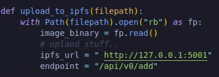

and we can make a post request to it.

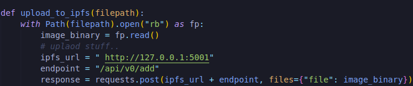

Now if you go back to the ipfs documenatation, we can scroll down to see what the response looks like.

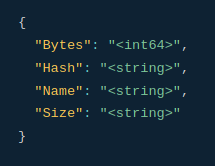

It's going to return bytes, hash, name and size.Now if you look at the sample_token_uri in SimpleCollectible.sol, we can see the api call there.

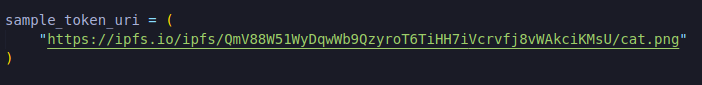

IPFS stores all its data using a hash and if we're looking at this simple collectible the hash there is the hash that represents cat.png.Everything in IPFS gets hashed and every single piece of data has a unique hash which is why it's so fantastic.If we're to change anything with this image this hash would be drastically different.All we need to do is get the hash that IPFS gives the image that we upload and we go ahead and plug it into a template url like in simpleCollectible.sol.

So what we're gonna do then is:

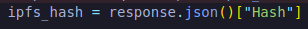

Since we're going to jsonify the response we used response.json() and we're grabbing that hash.Then we're giving it a filename.

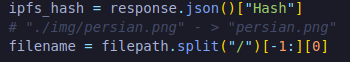

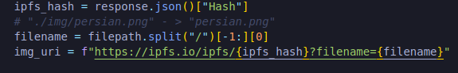

It's this format which will give us uri like in SimpleCollectible.sol.This is what exactly we need.We'll do quick print of the img_uri and return that img_uri.

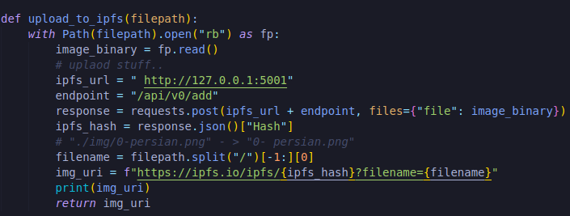

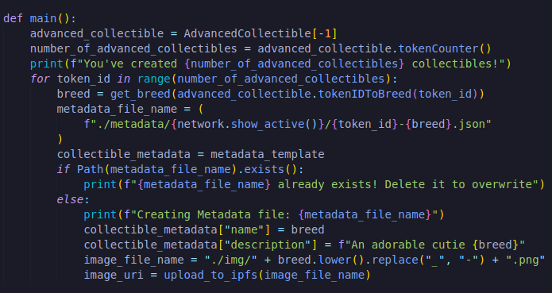

Now since we're actually going to be testing this with IPFS we can add a new integration test called "test_ipfs_upload.py"(As a challenge).For now we're just going to manually test it.

`brownie run scripts/create_metadata.py --network rinkeby`

If we go ahead and copy the url and paste it in our browser, we should be able to see the image.

**Alternative: Pinata**

Now I wanna show you guys actually another service and another way we can actually upload these to IPFS.Some people don't want to run their own IPFS node because they're not actually going to be keeping it running the whole time.Anytime their node goes down this means that nobody will be able to see your image.Unless somebody else pins your image or uses your image.

So what I also like to do is upload it to some other third-party service as well as uploading it to my own IPFS node.So I like to create another script called "upload_to_pinata.py".

So [pinata](https://www.pinata.cloud/) is an IPFS file management service and they actually will pin whatever files that we're working with as well.So we'll have it pinned in our node and they will have it pinned as well.So we can go ahead and register.

**Upload to Pinata**

So let's go ahead and upload our image to Pinata so that when our node goes down our images don't go down.We're going to be using [pin file to IPFS documentation](https://docs.pinata.cloud/api-pinning/pin-file).We can see there's a endpoint.

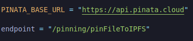

We're going to choose some filepath.

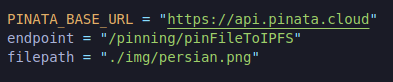

Ofcourse if you wanna upload some other image you can change the filepath or you could even do some type of for loop to pin everything in the img section.Again for filename, we're going to do the same syntax.

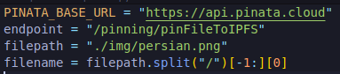

and we also need to use some headers in the post request.

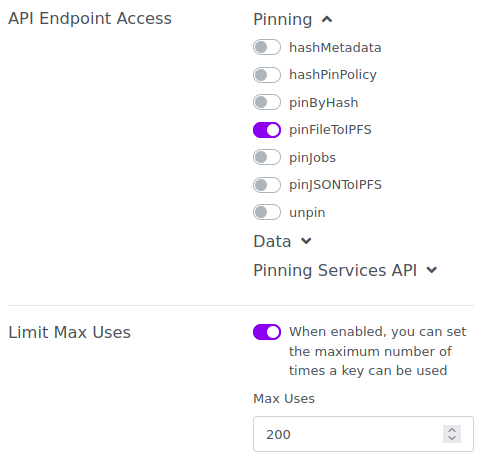

Copy API key and in our .env file and export the key.

Now that we've them in our .env file, it's going to be environment variables that we can use and brownie's going to automatically put them into our environment.So in our upload_to_pinata script:

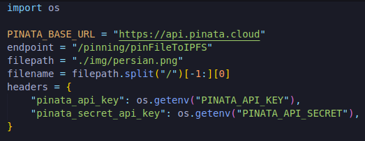

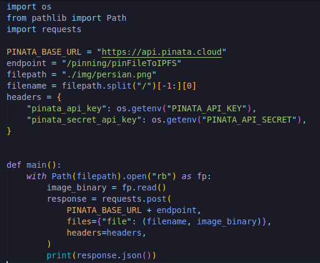

We can run this inside of our brownie.

`brownie run scripts/upload_to_pinata.py`

   
 
