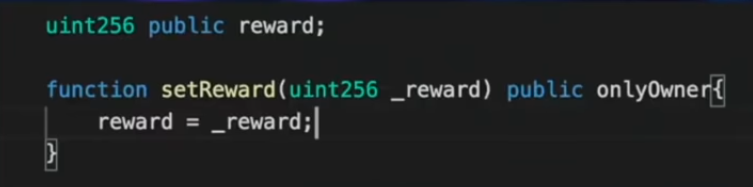

## Lesson 12: Upgrades

When deploying your smart contracts on-chain, we all know that those smart contracts are immutable or unchangeable but what if I told you that they were mutable? Well technically I wouldn't be correct however smart contracts actually can change all the time.When people transfer tokens, when people stake in a contract or really do any type of functionality those smart contracts have to update their balances and update their mappings and their variables to reflect this.The reason that they're immutable is that the logic itself never changes and will be on-chain like that forever.So technically once they're deployed they're immutable and this is actually one of the major benefits of smart contracts in the first place that nobody can tamper with or screw with our smart contracts once we deploy them.

However this can be an issue if for example we want it to updrage our smart contract protocol to so more things or we want to fix some glaring bug or issue that we have.Now even though we can't change the specific code that's been deployed to an address, we can actually do alot more than you think.We're going to explain the different methodologies behind upgrading your smart contracts and then we're going to show you how to do it.

Now at first glance you might be thinking "If you can upgrade your smart contracts then they're not really immutable".In a way you'd be right.So when explaining kind of different philosophies and patterns that we can use here we don't need to keep in mind the philosophies and decentralization implications that each one of these patterns have as they do all have different advantages and disadvantages and yes some of the disadvantages here are going to affect decentrality.So we need to keep that in mind and this is why it's so important that before you go ahead and jump in and start deploying upgradable smart contracts you understand the trade-offs.We're going to look at three different ways to upgrade your smart contracts.
- Not Really / Parameterize
- Social YEET / Migration
- Proxies

**Not Really / Parameterize**

So let's talk about the not really upgrading method or the parameterization method.This is the simplest way to think about upgrading your smart contracts and it really isn't upgrading your smart contracts because we can't really change the logic of the smart contract.Whatever logic that we've written is there.We also can't add new storage or state variables so this is not really upgrading but it is something to think about.Upgrades is just parameterizing everything.Whatever logic that we've deployed is there and that's what we're interacting with.
- Can't add new storage
- Can't add new logic

This function means that we've just a whole bunch of setter functions and we can update certain parameters like maybe we've a reward parameter that gives out a token at 1% every year or something like that.Maybe we've a setter function that says to update to 2%, just a setter function that changes some variables.Now the advantages here are obviously this is really simple to implement.The disadvantage is that if you didn't think of some logic or some functionality the first time you deployed their smart contract, that's too bad you're stuck with it.You can't update the logic or really update anything with the parameterization aka not really method.
- Simple but not flexible

**Who the admins?**

The other thing you have to think about is who the admins are? Who has access to these setter functions to these updating functions.If it's a single person  guess what you've a centralized smart contract.Now of course you can add a governance contract to be the admin contract of your protocol and that would be a decentralized way of doing this.So keep that in mind.You can do this method, just need a governance protocol to do so.

Another example of this might be a contract registry and this is actually something actually early versions of Aave used.Before you call function, you actually check some contract registry that is updated as a parameter by somebody and you get routed to that contract and you do your call there.Again this really doesn't allow us to have the full functionality of upgrades here.You can argue that this registry is a mix of one of the later versions but for all intents and purposes this deesn't really give us that flexibility we want for our upgrades.

**Are upgradeable smart contracts decentralized?**

But some people might think that upgrading your smart contract is ruining the decentrality and one of the things that makes smart contracts so potent is that they're immutable and this is one of the benefits they've.So there're some people who think that you shouldn't add any customization or any upgradability you should deploy your contract and then that's it.Trail of Bits has actually argued that if you deploy your contract knowing that it can't be changed later.You take a little bit extra time making sure you get everything right and there're often less security vulnerabilities because you're just setting it for getting it and not looking it again.

Now if I were to deploy a smart contract and I wanted to upgrade it with this philosophy in mind that we got to keep it immutable, we could use the social yeet method to actually upgrade to new versions.

**Social YEET / Migration**

The social yeet method or the migration method is just when you deploy your new contract not connected to the old contract in any way and by social convention you tell everybody "Hey new contract we just deployed and this is the real one now".It's just by convention of people migrating and over into using this new one that the upgrade is donce.

This has the advantage of truly always saying "This is our immutable smart contract and this is our new one".This is really truest definition of immutable because since you give it no way of being upgraded in place then if somebody calls that contract in 50000 years in the future, it'll respond exactly the same.

Pros:
- Truest to blockchain values
- Easiest to audit

Another huge disadvantage here is that you've a totally new contract address.So if you're an ERC20 token for example you've to go convince all the exchanges to list your new contract address as the actual address.Keep in mind that when we do this we do have to move this state of the first one over to the second one.So for example if you're an ERC20 token moving to a new version of that ERC token, you do have to have a way to take all those mappings from the first contract and move it to second one.Obviously there are ways to do this since everything is on-chain but if you have a million transfer calls I don't want to have to write the script that updates everyone's balance and figures out what everyone's balance is just so I can migrate to my new version of the contract.

Cons:
- Lot's of work to convince users to move
- Different addresses

So there's a ton of social convention work here to do.[Trail of bits](https://blog.trailofbits.com/2018/10/29/how-contract-migration-works/) has actually written a fantastic blog on upgrading from V1 to V2 or etc with this YEET methodology and they give lots of steps for moving your storage and your state variables over to the new contract.
