Now that we know alot more about upgrades and how they actually work and some different methodologies behind them.Let's go ahead and learn how to actually implement some of these strategies and implement our contract so that we can upgrade them.

There's a brownie upgrade mix directly in the brownie mixes organization that if you want to use, you absolutely can.Once again to do that it's:

`brownie bake upgrades-mix`

This will have all the code that we're going to teach you how to use right now. 

**Coding Upgradeable Smart Contracts**

But let's go ahead and build this up from scratch ourselves.

`brownie init`

We're going to be using the open zeppelin's proxy contracts to actually work with this and run with this.The methodology that we're going to be working with is "TransparentUpgradeableProxy.sol".Now they've been using the Universal Upgradeable Proxies a little bit more however the Transparent Upgradeable Proxy is really fantastic and easy to understand.So that's going to be the one that we're going to be working with here.

**Box.sol**

We're going to create a really simple contract that we can easily tell if it's upgraded or not.We're going to be using the exact same ones that open zeppelin actually uses.So let's create a new file "Box.sol".We're just going to have store and retrieve some type of value.For this we're going to be use 0.8.0.Oftentimes you're going to have to quickly pick up new versions of solidity anyways.

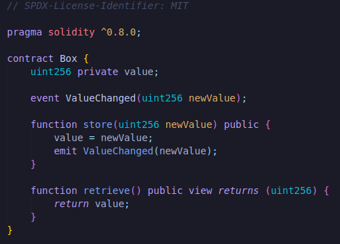

Now we're going to copy all of this code and create a new contract called "BoxV2.sol".We're going to paste it in and BoxV2 is going to be exactly the same except we're going to add one more function called increment.

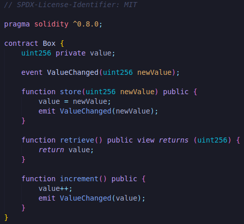

This is going to be really easy for us to check to see is a contract has been upgraded or not.If we can call increment on the same address that we originally deployed box to then this means that the contract has been upgraded.we shouldn't be able to call increment on the Box.sol but we should be able to call it on BoxV2.sol.

**Getting Proxy Contracts**

To actually work with the proxies and the transparent proxy that we're going to be working with, we do need to add them to our brownie project.So we're going to create a new folder inside contracts called "transparent_proxy" and we're going to add "ProxyAdmin.sol & TransparentUpgradeableProxy.sol".We're going to grab all the code from the open zeppelin's [proxy contract](https://github.com/OpenZeppelin/openzeppelin-contracts/blob/master/contracts/proxy/transparent/ProxyAdmin.sol).

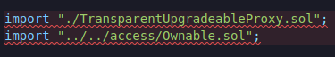

Since this code is pulling directly from open zeppelin package, we're going to have to fiddle with the imports a little bit to make a match so brownie can actually compile it and of course since we're going to be working with another package, we've to add the dependencies to our brownie config.

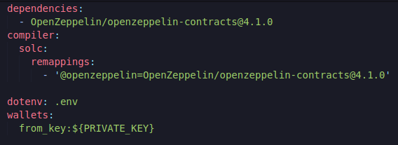

We can now just have this be:

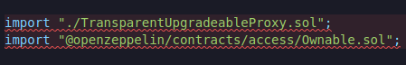

We don't need to change at all for TransparentUpgradeableProxy.sol because we're actually going to keep this [TransparentUpgradeableProxy.sol](https://github.com/OpenZeppelin/openzeppelin-contracts/blob/master/contracts/proxy/transparent/TransparentUpgradeableProxy.sol).

And same thing with the import of TransparentUpgradeableProxy.sol file.

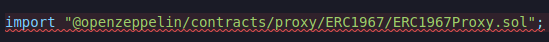

Now if we've done this right we should be able to run :

`brownie compile`

If you get this error :

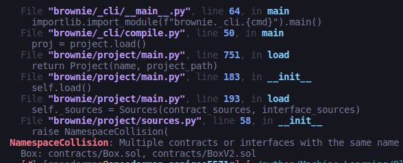

You got to change the contract of BoxV2.sol to BoxV2.

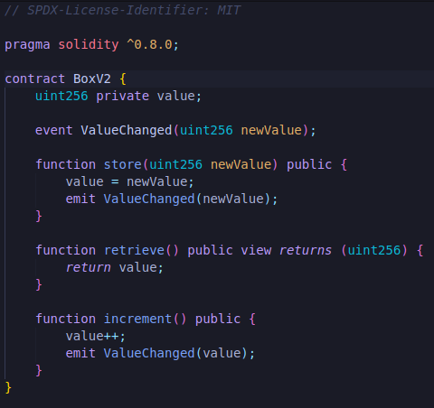

So we've our Box, BoxV2 and proxy contracts that we can use to upgrade the Box to a new version.we can even look at the ProxyAdmin.sol in open zeppelin's github, we can see it has the function "upgradeAndCall".

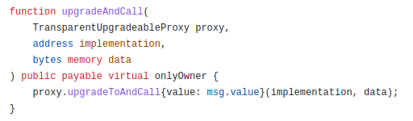

It calls the upgradeToAndCall on the proxy contract.If we look in the transparent proxy's upgradeToAndCall

which is been imported actually.IF we go back to ERC1967Upgrade.sol

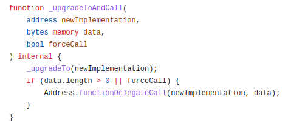

This is the function that it's actually going to call.It calls the _upgradeTo function which calls _setImplementation function and all we're doing is 

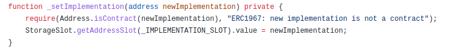

setting the implementation slot to being the new address that we wanted to use and we can see if we look in the [proxy contract](https://github.com/OpenZeppelin/openzeppelin-contracts/blob/master/contracts/proxy/Proxy.sol) the way that it actually works is it has the _Fallback function.

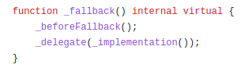

Where it's always going to delegate our calls to whatever the implementation contract is.The _delegate function if we look at it, is a little bit of low level assembly here:

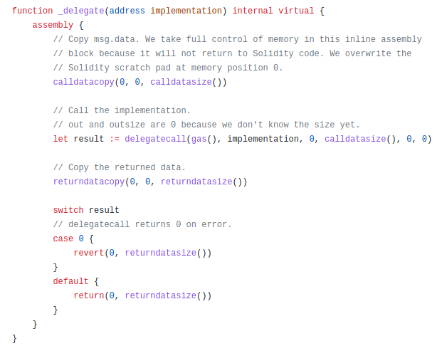

It uses the low level delegate call to send any function call or any call to the implementation contract.So this is exactly the function doing all that delegation.

So now that we've dug deep into the code, let's actually script this out and turn this into script.So let's create a new file inside scripts directory "01_deploy_box.py".This is gonna be how we're actually gonna deploy the box.So since this is a brownie script:

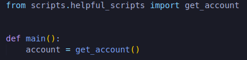

Let's go ahead and create a new file "helpful_scripts.py".Again we're just going to paste in that get_account function from our past helpful_Scripts.

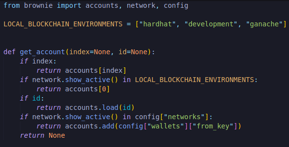

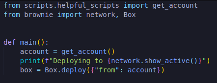

This alone should just deploy the box contract.This means we could call retrieve function and get 0 value.

`brownie run scripts/01_deploy_box.py`

If you get this error:

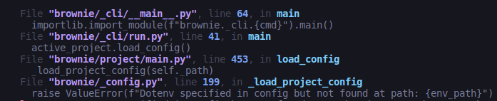

You need to add .env file.You don't have to put anything yet because we're not actually deploying to a real network.

However though if we run box.increment(), this should error out.

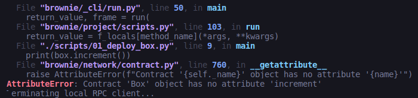

This is what's known as our implementation contract.This box is implemented.

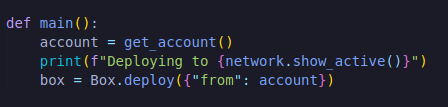

Now we've to hook it up to a proxy.

**Hooking up a proxy to our implementation contract**

Let's first give it a proxy admin and proxy admins are optional.It's also recommended that if you do have a proxy admin, you're going to use some type of defi protocol.Sometimes it's great to have your proxy admin be something like [multi-sig gnosis safe](https://help.gnosis-safe.io/en/articles/3876461-create-a-safe).

Let's go ahead and do a proxy admin because they're really helpful.We could optionally just set ourselves to be the proxy admin but let's set it to be the Box contract.

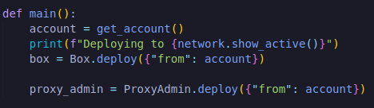

If we look at the ProxyAdmin.sol, we can see a couple functions like `getProxyImplementation` which is just going to return the address of the implementation, `getProxyAdmin` which going to be us, `changeProxyAdmin`, `upgrade` which is just going to call that upgrade function on the proxy and then we've `upgradeAndCall` which changes the implementation to the new implementation and then calls that initializer function.

`Proxies don't have constructors.`

**Initializer**

Since we want these to be proxies, you can see in the contract that we don't have a constructor.This is intentional.Instead we could have some type of initializer function.For example maybe we want to have Box store function via constructor.Instead of having constructor what we do is we call what's called our initializer function the instant we deploy the contract.For the demo here we're just not going to have an initializer.

So now we've the proxy_admin and implementation contract, let's hook them up to the actual proxy.First thing that we need to do is encode the initializer function.

 
