Now that we know alot more about upgrades and how they actually work and some different methodologies behind them.Let's go ahead and learn how to actually implement some of these strategies and implement our contract so that we can upgrade them.

There's a brownie upgrade mix directly in the brownie mixes organization that if you want to use, you absolutely can.Once again to do that it's:

`brownie bake upgrades-mix`

This will have all the code that we're going to teach you how to use right now. 

**Coding Upgradeable Smart Contracts**

But let's go ahead and build this up from scratch ourselves.

`brownie init`

We're going to be using the open zeppelin's proxy contracts to actually work with this and run with this.The methodology that we're going to be working with is "TransparentUpgradeableProxy.sol".Now they've been using the Universal Upgradeable Proxies a little bit more however the Transparent Upgradeable Proxy is really fantastic and easy to understand.So that's going to be the one that we're going to be working with here.

**Box.sol**

We're going to create a really simple contract that we can easily tell if it's upgraded or not.We're going to be using the exact same ones that open zeppelin actually uses.So let's create a new file "Box.sol".We're just going to have store and retrieve some type of value.For this we're going to be use 0.8.0.Oftentimes you're going to have to quickly pick up new versions of solidity anyways.

Now we're going to copy all of this code and create a new contract called "BoxV2.sol".We're going to paste it in and BoxV2 is going to be exactly the same except we're going to add one more function called increment.

This is going to be really easy for us to check to see is a contract has been upgraded or not.If we can call increment on the same address that we originally deployed box to then this means that the contract has been upgraded.we shouldn't be able to call increment on the Box.sol but we should be able to call it on BoxV2.sol.

**Getting Proxy Contracts**

To actually work with the proxies and the transparent proxy that we're going to be working with, we do need to add them to our brownie project.So we're going to create a new folder inside contracts called "transparent_proxy" and we're going to add "ProxyAdmin.sol & TransparentUpgradeableProxy.sol".We're going to grab all the code from the open zeppelin's [proxy contract](https://github.com/OpenZeppelin/openzeppelin-contracts/blob/master/contracts/proxy/transparent/ProxyAdmin.sol).

Since this code is pulling directly from open zeppelin package, we're going to have to fiddle with the imports a little bit to make a match so brownie can actually compile it and of course since we're going to be working with another package, we've to add the dependencies to our brownie config.

We can now just have this be:

We don't need to change at all for TransparentUpgradeableProxy.sol because we're actually going to keep this [TransparentUpgradeableProxy.sol](https://github.com/OpenZeppelin/openzeppelin-contracts/blob/master/contracts/proxy/transparent/TransparentUpgradeableProxy.sol).

And same thing with the import of TransparentUpgradeableProxy.sol file.

Now if we've done this right we should be able to run :

`brownie compile`

If you get this error :

You got to change the contract of BoxV2.sol to BoxV2.

So we've our Box, BoxV2 and proxy contracts that we can use to upgrade the Box to a new version.we can even look at the ProxyAdmin.sol in open zeppelin's github, we can see it has the function "upgradeAndCall".

It calls the upgradeToAndCall on the proxy contract.If we look in the transparent proxy's upgradeToAndCall

which is been imported actually.IF we go back to ERC1967Upgrade.sol

This is the function that it's actually going to call.It calls the _upgradeTo function which calls _setImplementation function and all we're doing is 

setting the implementation slot to being the new address that we wanted to use and we can see if we look in the [proxy contract](https://github.com/OpenZeppelin/openzeppelin-contracts/blob/master/contracts/proxy/Proxy.sol) the way that it actually works is it has the _Fallback function.

Where it's always going to delegate our calls to whatever the implementation contract is.The _delegate function if we look at it, is a little bit of low level assembly here:

It uses the low level delegate call to send any function call or any call to the implementation contract.So this is exactly the function doing all that delegation.

So now that we've dug deep into the code, let's actually script this out and turn this into script.So let's create a new file inside scripts directory "01_deploy_box.py".This is gonna be how we're actually gonna deploy the box.So since this is a brownie script:

Let's go ahead and create a new file "helpful_scripts.py".Again we're just going to paste in that get_account function from our past helpful_Scripts.

This alone should just deploy the box contract.This means we could call retrieve function and get 0 value.

`brownie run scripts/01_deploy_box.py`

If you get this error:

You need to add .env file.You don't have to put anything yet because we're not actually deploying to a real network.

However though if we run box.increment(), this should error out.

This is what's known as our implementation contract.This box is implemented.

Now we've to hook it up to a proxy.

**Hooking up a proxy to our implementation contract**

Let's first give it a proxy admin and proxy admins are optional.It's also recommended that if you do have a proxy admin, you're going to use some type of defi protocol.Sometimes it's great to have your proxy admin be something like [multi-sig gnosis safe](https://help.gnosis-safe.io/en/articles/3876461-create-a-safe).

Let's go ahead and do a proxy admin because they're really helpful.We could optionally just set ourselves to be the proxy admin but let's set it to be the Box contract.

If we look at the ProxyAdmin.sol, we can see a couple functions like `getProxyImplementation` which is just going to return the address of the implementation, `getProxyAdmin` which going to be us, `changeProxyAdmin`, `upgrade` which is just going to call that upgrade function on the proxy and then we've `upgradeAndCall` which changes the implementation to the new implementation and then calls that initializer function.

`Proxies don't have constructors.`

**Initializer**

Since we want these to be proxies, you can see in the contract that we don't have a constructor.This is intentional.Instead we could have some type of initializer function.For example maybe we want to have Box store function via constructor.Instead of having constructor what we do is we call what's called our initializer function the instant we deploy the contract.For the demo here we're just not going to have an initializer.

So now we've the proxy_admin and implementation contract, let's hook them up to the actual proxy.First thing that we need to do is encode the initializer function.

**encoding the initializer function**

If we wanted to store to be our initializer function like I said, we could do something like:

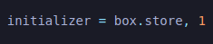

What we then have to do is we'd have to encode this for our proxy.If we look at our "TransparentUpgradeableProxy.sol", look at the constructor:

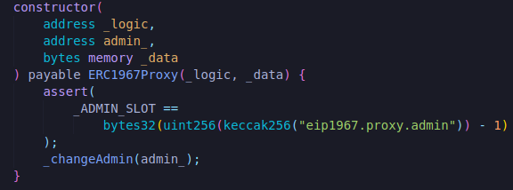

We've address _logic, address admin and _data.The logic is that implementation.This is going to be the address of our box.The admin is going to be ourselves or in our case it's going to be that proxy admin contract.Then data is gonna be that initializer function.If we go into the [ERC1967Proxy](https://github.com/OpenZeppelin/openzeppelin-contracts/blob/master/contracts/proxy/ERC1967/ERC1967Proxy.sol) and look at this one's constructor:

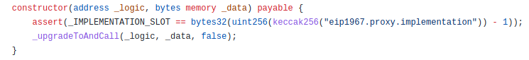

You can see the _data bit there.Once this is built with the constructor, it's immediately going to call the _upgradeToAndCall.So it's going to call _upgradeToAndCall initializer.IF we go to [_upgradeToAndCall](https://github.com/OpenZeppelin/openzeppelin-contracts/blob/master/contracts/proxy/ERC1967/ERC1967Upgrade.sol)

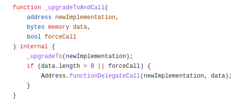

It's going to call Address.functionDelegateCall.This is how it actually calls that initailizer function.We have to actually encode the `box.store, 1` into bytes.So we've to say box.store is the function a call and then 1 is going to be the first parameter.

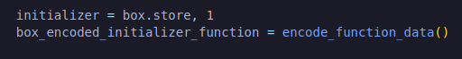

This is where it gets a little bit tricky but I usually have this encode_function_data once again in our helpful_scripts.

**get_encode_function**

It's going to take initializer which we're going to start off as none and then any number of arguments after that.Like : `initializer = box.store, 1, 2 , 3`.For us we only have one variable that can be put into store but this is how you'd do it.

 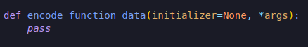

To do this brownie actually has a built-in function that can actually do this.We just return  initializer.encode_input.

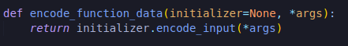

However there's a bit of an issue here when we do length of the args to zero.

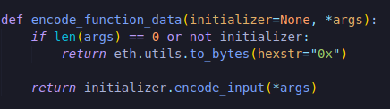

We do have to import eth_utils and of course we'd have to `pip install eth_utils`

Basically what we're doing like I said is we're encoding it into bytes so that our smart contracts actually know what function to call and if it's blank or there's no initializer we're going to return an empty hex string and our smart contract will understand arguments are blank here.

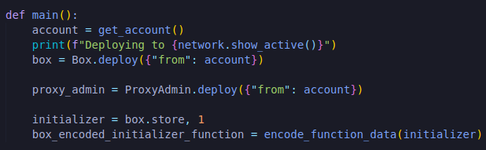

Now that we've this, we could go ahead and run box_encoded_initializer_function equals to encode_function_data which we'd import from our helpful_scripts.This is what we use when we call the constructor for our transparent upgradeable proxy.

I'm just going to have it be blank for now but feel free to fiddle around and try to actually use an initializer after we run through the code.

So the box_encoded_initializer_function is going to be blank.We're saying don't use an initializer and it's fine.If we were to add some stuff, we'd say use an initializer.

So now we can actually deploy the transparent upgradeable proxy.What are those variables we need?We need the address of the logic which is gonna be our implementation contract (box.address), then we're gonna need our admin which we could just say is us but we're going to use the proxy_admin (proxy_admin.address) and we need the function selector(box_encoded_initializer_function).For us it's just blank but we still need it.we have to add from account and I also noticed that sometimes it's helpful to add some gas limit.

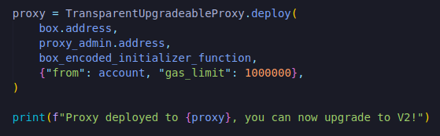

**Assigning V2 to proxy**

On the proxy's address we can call functions.Typically if you want to call function on the box contract, we do box.retrieve or box.store(1), however we want to actually call on the proxies because box contracts address is always going to be the same address and can't change.The proxy code can change.We want to always call these functions to the proxy and not to the box.The way we do that is:

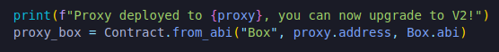

We're assigning the proxy address, the abi of the box contract and this is gonna work because the proxy is gonna delegate all of it's calls to the box contract.Typically if you put an ABI on top of an address that doesn't have those functions that the ABI defines it would just error but the proxy is actually going to delegate all those calls to the box.So we could actually go ahead and try something like:

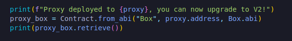

Even though we're using the proxy_address here, we're going to delegate the call to box.

So let's go ahead and run this:

`brownie run scripts/01_deploy_box.py`

It's going to deploy the box, deploy the admin, going to encode that initializer function which we've set to nothing then it's going to deploy our transparent upgradeable proxy and it's going to call retrieve on the transparent upgradeable proxy instead of our box.

If you get this error:

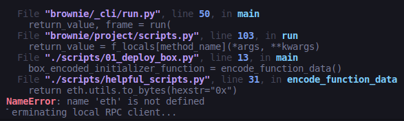

solve it by:

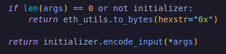

The output you should get is:

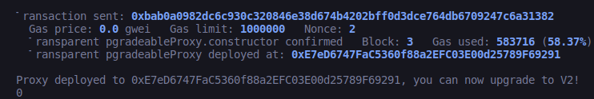

Now that we've deployed it let's learn how to upgrade it.Change script name from "01_deploy_box.py" to "deploy_and_upgrade.py".Let's go ahead and now upgrade this.We can always point to the proxy_box address and it's going to be the most recent upgrade.It's always going to have the code that we want it to have.Let's go ahead and upgrade from box that doesn't have that increment to BoxV2 that does indeed have increment function.

**Upgrade Python Function**

First we need to do is we actually need to deploy that BoxV2.Then all we need to do is call an upgrade function.Basically all we have to do is call `upgradeTo function` but depending on if we've added a proxy admin contract, if we're using initializer function, there might be couple of different ways to go about this.So I like to just wrap everything up into it's own upgrade function.We're going to pop into our helpful scripts and create a new one called upgrade.For parameters in there is we're gonna take some type of account so that we've something to account to deploy from, use the proxy which is again gonna be that proxy contract, need a new implementation address, proxy admin  which could be None.For us we're gonna have one.Then we're gonna have an initializer which also could be none and args for the initializer which also could be none.

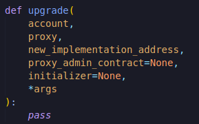

This start is special thing in python which says any number of arguments will just get stored into the list called args.

First let's check to see if there's a proxy_admin_contract, then we check to see if there's an initializer, then first we wanna encode that function data then all we have to do 

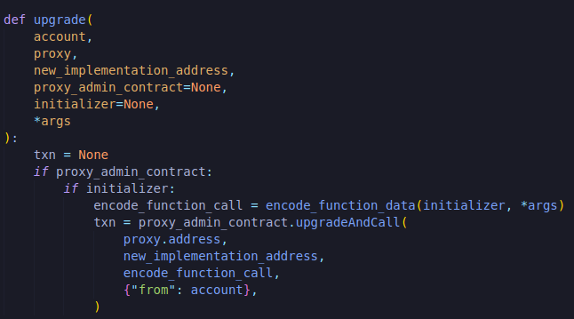

This upgradeAndCall if we look in that ProxyAdmin.sol which just call upgradeToAndCall of the proxy contract. 

If it doesn't have initializer then:

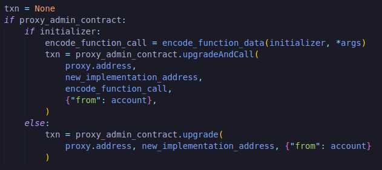

It also just has regular upgrade.

Now if it doesn't have proxy admin contract, this means that the admin is just going to be a regular old wallet.

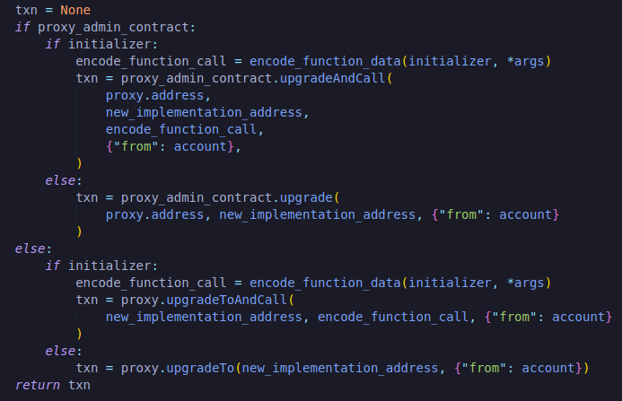

Now that we've our upgrade function, we can use it in our "deploy_and_upgrade.py".

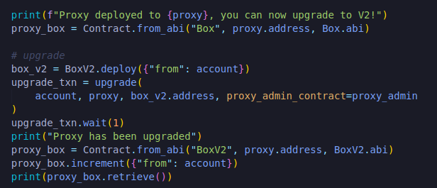

So let's go ahead and run this:

`brownie run scripts/deploy_and_upgrade.py`

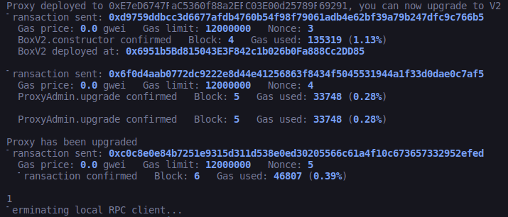

**Testing our upgrades**

We want to make sure our project always stays in sync and upto data.So let's write couple of tests.Create a new file called "test_box_proxy.py" and for this we're really going to test to see that our contracts work.We're going to see that the box actually is going to work correctly.

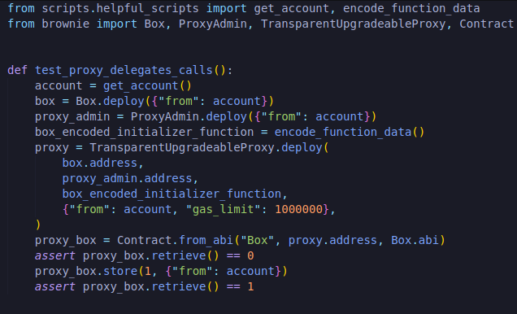

We're using the proxy contract ("proxy") and gave the abi on top of it.We're just testing to see that our proxy is working correctly.So we can go ahead and test this then.

`brownie test`

**Testing our proxy**

Now let's go ahead and create a new script for testing the upgrades.Create a new file called "test_box_v2_upgrades.py".

What we're trying to do is slapping the BoxV2 abi onto the proxy address.We're going to try to call a function only boxV2 could call.However we know that like we tested before it actually should revert.So we can actually check for reverts by importing pytest. 

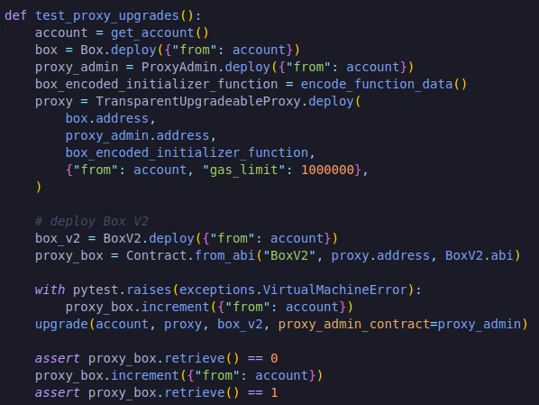

So let's go ahead and run this test:

`brownie test -k test_proxy_upgrades`

With these there comes alot of risk at least in the form of centralization risk.If you're the only wallet that controls the proxy that means your application is centralized.So if you're gonna deploy anything with proxies to mainnet absolutely be sure to get it audited beforehand.

**Upgrades on a testnet**

Before we close this project up, let's actually deploy this to an actual testnet.So that we can see everything that goes on when we call the deploy_and_upgrade.py.

`brownie run scripts/deploy_and_upgrade.py --network rinkeby`

 
