## Lesson 13: Full Stack Defi

This is going to be the most advanced project and combine all the knowledge that we've learned so far into one project.Then we're additionally going to put a `frontend` or a `User Interface` onto this project.When we build our own applications, we're going to need a way for non-devs to actually interact with it in a meaningful way.

**Staking and Depositing**

Our application allows users to stake or deposit their tokens into token farm contract.Once they've some token deposited, that's when you can kind of go get creative with what you want those tokens to do.You could use it as staking in some governance.You could go ahead and invest it in something like AAVE or another defi protocol to gain interest.You could build a yeild aggregator.There's a ton of different features that you can do once you've users stake their tokens.

Here's how we do from the UI side.We'll be having a butten called "Connect" which we could go ahead and click connect on.Metamask is going to pop up and we're automatically gonna sign in.That's going to connect our metamask to the User Interface.After getting connected, I could stake some of my tokens into the contract which is `WETH`, `FAU` which is mimicking DAI and `DAPP` token.The DAPP token is going to be the reward token that our platform gives users as an incentive for staking on our platform.Once we stake, we can actually then unstake.

I'm going to go ahead and make a new directory called "defi-stake-yeild-brownie" and open the folder in VS code.First thing that we want to work with is going to be our contract.

`brownie init`

**DappToken.sol**

We're going to make our DappToken.sol.This is going to be the token that we're going to give out to users who are staking on a platform.This is our reward token.You might have heard of yeild farming or liquidity mining.This is our token that allows users to actually engage and participate in that and this is regular old ERC20.So you guys already know we've done this before.We're going to go ahead and use [open zeppelin](https://docs.openzeppelin.com/contracts/2.x/erc20) again.We can even just copy paste the import from the documentation.As we're using @openzeppelin in the import, we need to add dependencies.

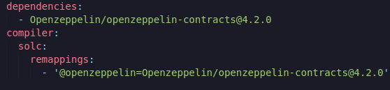

We can go back to DappToken.sol and do some basic ERC20 bits there.

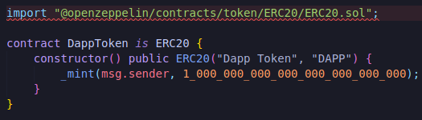

Now that we've our first contract we can try to compile it.

`brownie compile`

**TokenFarm.sol**

We're gonna go on and create our more interesting contract "TokenFarm.sol".We can even take a quick second and figure out what we want this to be able to do.We want to be able to stake tokens, unstake tokens, issue tokens(token rewards), add allowed tokens(add more tokens to be allowed to be staked on our contract) and we're probably going to want some type of getETHValue function where we can actually get the value of the underlying stake tokens in the platform.Let's go ahead and start with the staking of the tokens because that's going to be the most important piece of our application.

We want to stake some amount of some token(address).There's couple of things we need to keep in mind here.
- What tokens can they stake?
- How much can they stake?

For our application we're just going to say "You can stake any amount greater than 0".We can even add that.

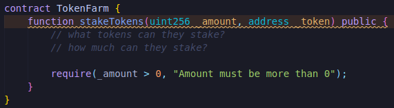

Now we only want specific tokens to be stacked on our platform, we could say :

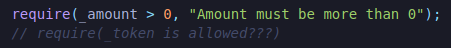

So we might have to actually create a token is allowed function.Let's go ahead and create that.

**tokenIsAllowed**

It'll take some token address and return true if that token is allowed or false if it's not allowed.

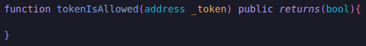

So how do we know if a token is actually allowed?We probably want some list or some mapping of these tokens and whether or not they're allowed.After all we've probably learned that there are definitely some trade offs between lists and mappings.For simplicity's sake we're just going to stick with a list for now.So we're going to create an address array.For our tokenIsAllowed function we'll just loop through the list and see if that token is in there.

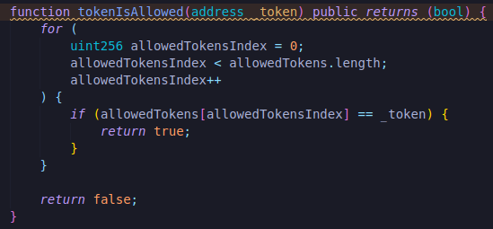

Now we've a way to check to see if allowed tokens are there.Let's actually write a function to add allowed tokens.

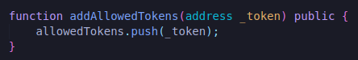

Adding allowed tokens is probably something we only want the admin wallet or the owner of the contract to do.So we'll add onlyOwner as a modifier to the function and we'll make TokenFarm Ownable.

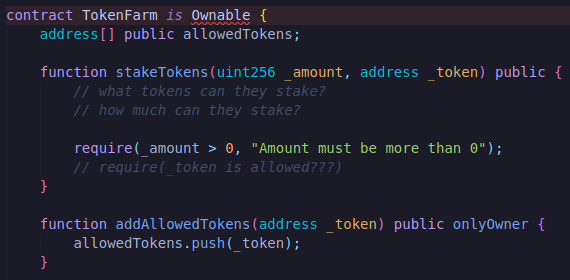

and we'll import from open zeppelin here too.

`import "@openzeppelin/contracts/access/Ownable.sol";`

Let's do quick compile : `brownie compile`

Now that we've a little bit of functionality, it might be a good time to actually go ahead and start writing some tests if you want to.Since I know that we're going to change the constructor a little bit and we're going to change a little bit of how this is actually formatted, I'm just going to keep going but now might be a great time for writing tests.

In any case now that we've these two functions, we can go ahead and actually start checking to see if the tokens that these stakers are going to stake is actually allowed.So what we can do now is we're going to add this require statement in.

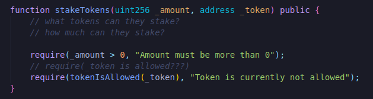

Now we have two required statements that answer the questions.Now we just have to call transferFrom on the ERC20.

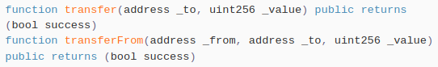

ERC20s have two transfer type functions.They have transfer and transferFrom.Transfer only works if it's being called from the wallet who owns the tokens.If we don't own the token, we've to do transferFrom and they have to call approve first.

So we're going to call the transferFrom function on the ERC20 since our TokenFarm contract isn't the one that owns the ERC20.We also have to have the ABI to actually call the transferFrom function.We're going to need `IERC20 interface`We'll grab it from open zeppelin.

We're using the interface here because we don't need the whole contract.

Let's wrap the token address as an ERC20(IERC20(_token)) token so that we've the ABI via interface and the address and we'll call transferFrom from the msg.sender, send it to the TokenFarm contract and the amount.

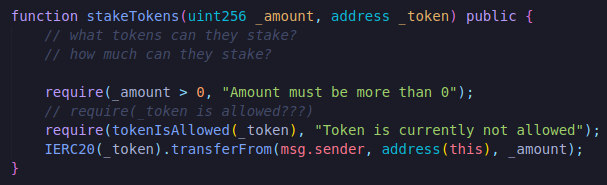

Now we just need to keep track of how much of these tokens they've actually sent us.So we're going to create some type of mapping.The mapping is going to map token address to staker address to the amount.This way we can keep track of how much of  each token each staker has staked.So it's a mapping per token per staker per amount.

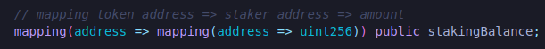

Now that we've the mapping, in our stakeTokens function:

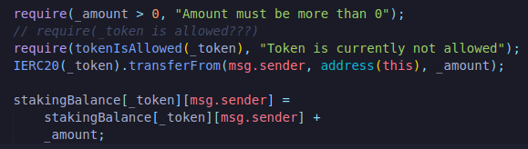

Now we've a way for users to stake different tokens that we've actually allowed them to stake on our platform.

So what do we want them to be able to do?We want them to unstake tokens, issue some reward and get the ETHValue based on the reward.Typically you might want to do this unstake tokens bit first however I know that we're actually going to need some additional functionality in our stakeTokens function for us to actually issue tokens properly.So let's just go ahead and do the issueTokens bit.

Remember the issueTokens is a reward we're giving to the users who use our platform so we want to issue some tokens based off the value of the underlying tokens that they've given us.

**Valued Staked Tokens**

For example maybe they've deposited 100 ETH and we want to do a ratio of 1:1 for every 1 ETH, we give one DAPP token.That's pretty for us to figure out.However they've 50 ETH and 50 DAI staked, and we want to give a reward of 1 DAPP / 1 DAI.Well then we've to convert our ETH into DAI so we know that conversion ratio for the DAPP token.So that's the problem that we're going to work on now.

**issueTokens**

This is going to be a function only callable by the owner.

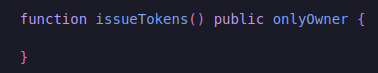

So how do we actually go ahead and issue tokens?Well first though would be to loop through a list of all the stakers that we've but right now we don't have a list of stakers.We've a mapping of stakers and a list of allowed tokens.We'll we probably going to need to have a list of stakers because we can't loop through a mapping.

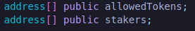

This is just a list of all the different stakers on our platform.Now when somebody stakes a token, we're going to have to update the list.We want to make sure thay're only added if they're not already on the list.So in order for us to do this we should get an idea of how many unique tokens a user actually has.So I'm going to create a function called "updateUniqueTokensStaked".

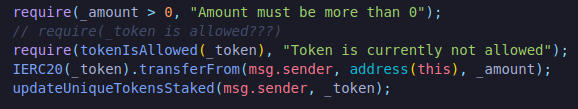

It's going to get a good idea of how many unique tokens a user has and if a user has 1 unique token, we can add them to the list.If they've more than one, we know that they're alredy been added to the list.So we don't need to add them there.

So let's create the updateUniqueTokensStaked function.

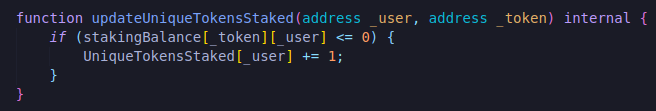

Since we've the new mapping called "uniqueTokensStaked", we'll make that as well.

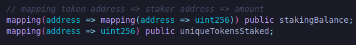

So this way we know how many different tokens each one of these addresses actually has staked.

Now that we've a better idea of the unique tokens each one of the users has staked.What we can do is we can figure out whether or not we want to push them onto the stackers list.If they're already on there, we don't want to push them.IF they're not on there then we do wanna push them.

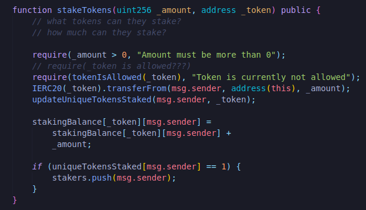

This is going to be our completed stakeTokens function.We had to add the little extra functionality between the unique tokens to figure out how to actually issue some reward for them.

But now that we've the list and it's going to get updated and also get updated when we unstake.What we can do now is just loop through the list of stakers.

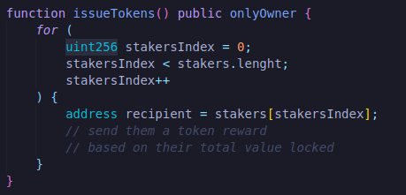

So we've to send them a token reward.We've to figure out how to actually send them the token and then we also have to get their total value locked.To send them a token reward which is going to be a Dapp token that we created in the beginning.Right when we deploy the contract, we need to know what a reward token is actually going to be.So we need to create a constructor.Right when we deploy the contract, we need to know what is the address of the dapp token.

Now we've the dapp token with it's associated address, what we can do now is call functions on `issueTokens`.For example: we can call `dappToken.transfer`.We can call transfer here because our TokenFarm contract is going to be the contract that actually holds all the dapp tokens and we're going to send the token to recipient with certain amount.

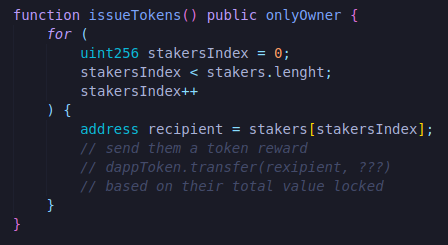

Well we need some function to get the total value.

**getUserTotalValue**

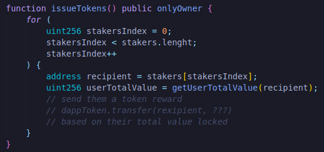

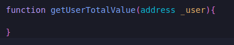

This is where we do a lot of looping.We gotta find out how much each of these tokens actually has.Now what alot of protocols do instead of them actually sending and them issuing the tokens, they actually just have some internal method that allows people to go and clain their tokens.You've probably seen that before people claiming airdrops that's because it's alot more gas efficient to have users claim the airdropped instead of the application actually issuing the tokens.It's going to be very gas expensive to do looping through all the addresses and checking all the addresses right.

We're going to do it though because we're a wonderful amazing protocol and we want to give our users the best experience.

This is going to be a public view function that will return uint256.

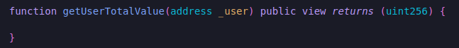

because we want to return the total value to our issue tokens function.So how do we actually get started?

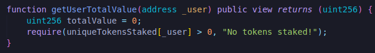

If the require statement is true(has some token staked), we'll go ahead and find it.We're going to loop through those `allowedTokens`  and we're going to find how much the user has for each one of the allowedTokens.

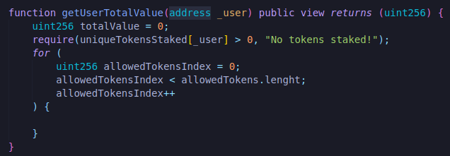

We'll add the total value and we'll say totalValue will be equal to totalValue + however much value the person has in the tokens.getUserTotalValue is the total value across all the different tokens.We need a way to get the total value across one token.So we're going to create a new function called "getUserSingleTokenValue" where we'll pass it user and single token that we're right on.

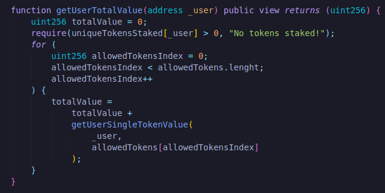

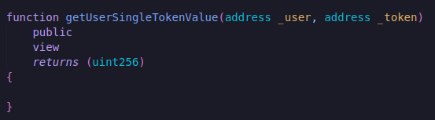

We want to get the value of how much the person staked of the single token.For example: If they staked 1 ETH and the price of 1 ETH is $2000, we wanna make sure that it returns 2000 or if they have 200 DAI stakes and the price of 200 DAI is $200, we wanna make sure this returns 200.So we're getting that conversion rate exactly how much value the person has staked in our application.

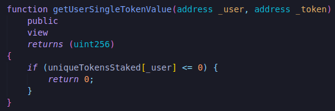

We don't want to do a require here because we want this to actually keep going.If `totalValue` is zero, we don't want the transaction to actually revert.So how do we actually get the value of a single token?Well we're going to need to get the staking balance but we also need the price of that token.`So we're going to need to get the price of the token and then multiply that by the staking balance of the token of the user.`So once again we need to create another function called "getTokenValue".

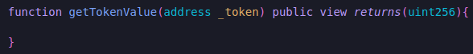

This is ofcourse where we need pricing information.This is where we're going to actually work with the chainlink pricefeeds once again.We're going to need a pricefeed address that's the first thing we're going to need.So we're going to actually have to map each token to their associated pricefeed addresses.We're going to need some mapping that does that.

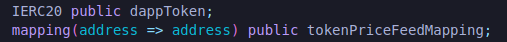

It's going to map token to their associated price feeds and with that means we're going to have a function called "setPriceFeedContract" where we actually set the pricefeed associated with a token.

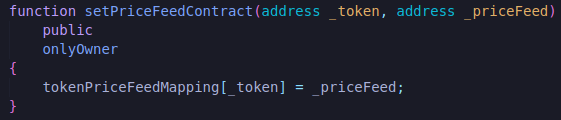

Now that we've a way to set the pricefeed contracts.We've a way to map the tokens to their price feeds.Again go to [docs.chain.link](https://docs.chain.link/docs/ethereum-addresses/), we can find the different price feeds there and this where we're going to set those pricefeeds.Now back down in our `getTokenValue`, we can grab that pricefeed address now by:

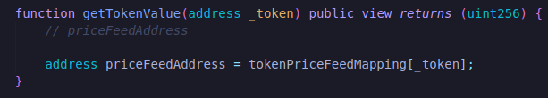

Now that we've the address, we can use it on AggregatorV3Interface.Again we can always go back to docs [here](https://docs.chain.link/docs/get-the-latest-price/), grab the import and past it on our contract.

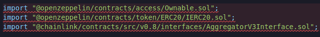

Since we're doing the import, we're gonna go to our brownie config :

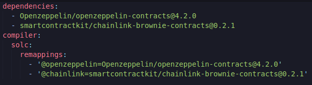

Now that we've imported that we can now grab that AggregatorV3Interface for the price feed.

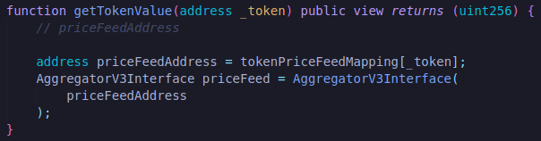

Then once we've the pricefeed contract, we can call .latestRoundData().we can check the documentation to see what that function actually looks like.

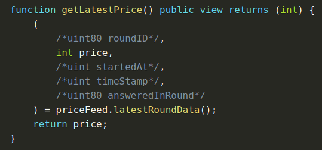

It's going to return whole bunch of stuff but we only care about the price.

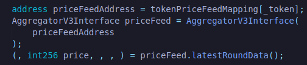

We also care about the decimals.We need to know how many decimals the price feed contract has that way we can match everything up to be using the same units.So we'll do:

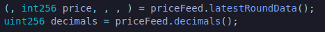

Now we can return both of these.So we'll add another uint256 in return.

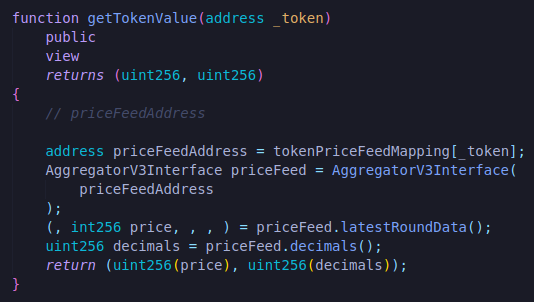

Now we can go ahead and start scrolling back up and adding all the stuff in getTokenValue function call.

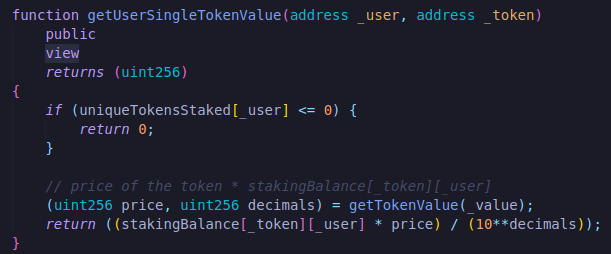

We're taking the amount of token that the user has staked.For example 10 ETH and we're taking the price of that ETH.Maybe we've all of our contracts, all of these tokens get converted back to the USD price.So we've ETH/USD.Let's say the price is $100 per USD.First bit is going to do that 10 ETH * $100 = 1000 value.The only thing is we also have to divide by the decimals.So our stakingBalance is going to be in 18 decimals so ETH gonna be 1_000_000_000_000_000_000 and let's say our ETH/USD only has 8 so 10_000_000_000.So we need to multiply these first and then divide by the decimals that way we can arrive at a price that can actually makes sense.This is going to be a function that we definitely going to need to test to make sure that we're doing everything right so that we're doing all the math correctly.

Now that we the getUserSingleTokenValue, we go ahead and come back up to our getUserTotalValue and we can literally finish this function by returning totalValue.

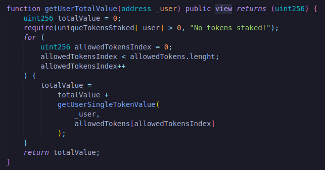

then we call pull up to our issueTokens.Now that we've the total value that the user has actually logged, we can just transfer the amount of tokens that they've in total value.

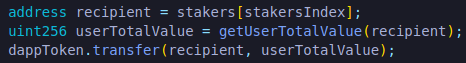

We'll say however much they have in total valued staked on our platform, we'll issue them as a reward and this is our issueTokens function.

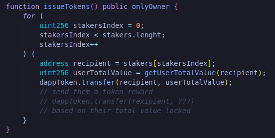

So we've a way to stake.Done :) We've a way to issue Done :) We've a way to get getValue :D We've added a way to addAllowedTokens :D
