All we've to do now is add some way to unstake the tokens.Let's go ahead and create this function.

**unStakeTokens**

First thing we're going to do is fetch the staking balance.How much of the token does the user have?

Once we actually transfer the token, we'll do :

Because we're going to transfer the entire balance here and then we're going to update how many of those unique tokens that they have.

**Can this be reentrancy attacked?**

Quick note here.Later on we're going to learn about `reentrancy` attacks.So at some point come back here and figure out whether this is vulnerable to reentrancy attacks.

Now the last thing we could do is we probably should actually update our stakers array to remove the person if they no longer have anything staked.This is a little bit sloppy but we're just going to skip doing that for the time being however if you wanna go back and add the functionality to remove the stakers list as they unstake.It's not a big deal if we don't actually do this because our issue tokens function is actually going to check to see how much they actually have staked and if they don't have anything staked then they're not going to get sent any tokens.

That's basically all of the functionality here.Let's just try quick sanity check with a brownie compile. 

Just because it's compiling correctly though doesn't necessarily mean that we're doing everything correctly.Typically now we'd want to go ahead and start doing our tests.

**Scripts and Tests**

I'm actually gonna go ahead and build one of our scripts first.The reason I'm going to build on of the scripts first is because I'm going to use my deploy script pretty regularly in my test.I'm going to use it as part of my testing.This way I can also test some of my scripts as well in addition to the contracts.So let's go ahead and make our deploy script and __init__.py.

First thing we're going to do as always is get our account and I'm going to copy couple of those helpful scripts from our past projects.

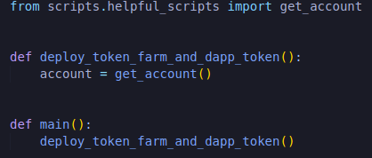

Now we're going to want to start deploying some contracts.We're going to deploy that Dapp token first.

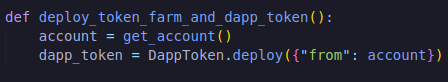

Then we're going to deploy our token farm which takes dapptoken address.

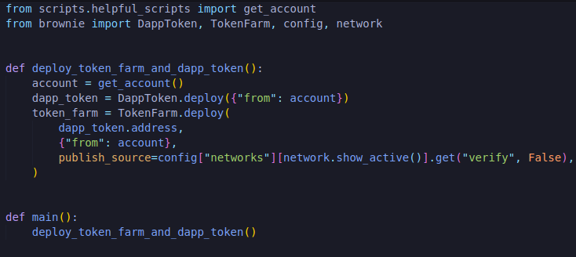

And in our config, we'll do:

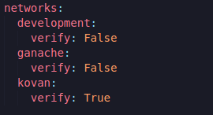

Once we've deployed the tokenfarm contract, we need a couple of things.We're going to need to send this some dapp tokens.We're going to send pretty much all the dapp tokens so that I can actually give those tokens out as a reward.

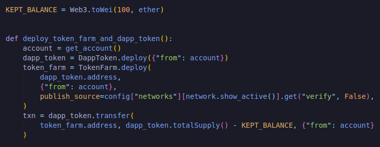

We're going to keep 100 dapp tokens from the total supply so we can do some testing just in case.

Now we're sending our token farm basically 99.9% of the total supply of the dapp token so that it has token to actually give out as a reward.

If we look at our TokenFarm, we know that our stakeTokens function, we can only stake tokens that are allowed.In each one of these tokens also is going to need to have some price feed associated with it in our tokenPrice.So we're going to add those.

What we're going to do is create a function called add_allowed_tokens and is going to take couple things.We're going to want to take that token_farm because we're going to need to call the allowedTokens function on it.We're going to take a dictionary of allowed tokens and it's going to be a dictionary of different token addresses and their associated price feeds.So we're just going to price everything in USD so we can figure out the value of everything in USD and the last we're going to need an account.

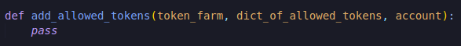

Let's look at the different inputs that we're going to put into the function.So obviously we're going to do token_farm but then we're going to need to make the dictionary of allowed tokens.We're going to need the address of the different tokens that we want to have.`How do we get the addresses of the different tokens that we're going to use and what are the tokens that we're even going to use here?`

For simplicity we're just going to start with three tokens.We're going to allow our platform to allow three different tokens to be staked.We'll use the dapp_token weth_token because that's pretty much standard in most smart contract platforms and then we're also going to use and fau_token which stands for faucet token and we're going to pretend that this faucet token is DAI.The reason that we're going to use the faucet token is because there's the [ERC20 faucet](https://erc20faucet.com/)which allows us to get the fake faucet token.We can get unlimited amounts of faucet token on different test nets.We're going to pretend that the faucet token is going to be DAI.

So how do we actually get these addresses?Well dapp_token we know, weth token what we can do in our config so can actually add those addresses there.

`weth_token: '0xd0a1e359811322d97991e03f863a0c30c2cf029c'`
 
 `fau_token: '0xFab46E002BbF0b4509813474841E0716E6730136'`

We could grab the address from config and always get from our config.Or we could use our get_contract method that we grab from our helpful_scripts which will deploy a mock weth_token which doesn't exist in config networks.That's what we want because we're going to want to test this locally so we're going to deploy our own fake weth_token.So we'll say:

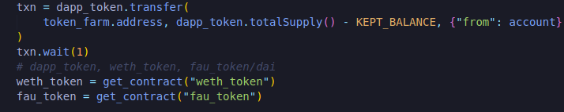

What we put in `get_contract("weth_token")` here, our string that we put there, needs to match our string in our config.Now in order for get_contract to work for weth_token and fau_token, we're actually going to have to modify our helpful_scripts here.So if we copied and pasted it directly from our chainlink-mix, we're going to have : We're importing all of our mocks which we can go ahead and copy paste these as well from chainlink-mix; test for our mock contracts, forking implementation, contract_to_mock which tells us based off of the key what token or what contract we use to mock, get_account which we use all the time.

In order for us to do contract_to_mock correctly, we're going to have to mock weth and fau and actually we only need eth_usd_price_feed among all others there.We do need eth_usd_price_feed later on so I'm leaving it there.

We definitely need fau_token mock to something and weth_token which is also mock to something else.So what are these tokens going to be mocked to?well they're each an ERC20 mock but we want to give them kind of their own identity.So we're actually going to make a mock ERC20 for both fau and weth.So inside our contracts/test we're going to create a new file "MockDAI.sol" and this is going to mock that fau token.We're just going to make it a basic ERC20. 

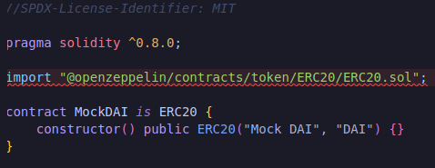

We'll copy the code and do the same thing for MockWETH.sol.

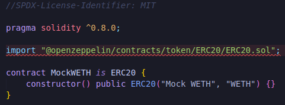

So now that we've these mocks, we can change fau_token to MockDAI and weth_token to MockWETH.

we can import those from brownie and also get rid of oracle and VRFCoordinator.

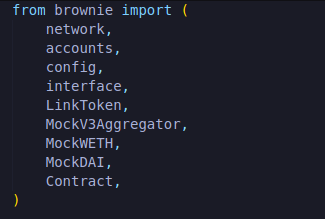

Since we've dai_usd_price_feed and eth_usd_price_feed, we're going to make sure we have these in our mocks and then we're also gonna have to deploy these in our deploy mocks script.So if we go to deploy_mocks function in helpful_scripts, it's currently pulling directly from the chainlink-mix.We go ahead and delete the VRFCoordinator and the mock Oracle and instead, we'll deploy those mockWETH and mockDAI.

Now additionally we've our eth_usd_price_feed in contract_to_mock left over from the chainlink-mix, we also need the dai_usd_price_feed.

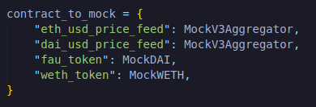

We could parameterize the MockV3Aggregator up so that the mockV3Aggregator takes maybe some different decimals or different initial value so that they could be different but for the sake of testing, we're just going to leave them being the same.

So we've the address of the weth_token and fau_token.If those don't exist on the network that we're working on, we're going to deploy a mock.So now that we've all these addresses, we could do a dictionary of allowed tokens:

We're just going to route each one of the contract like dapp_token to it's equivlent price_feed.For the dapp_token and fau_token which are going to be equal to dai and our weth_token is going to be eth.So we're going to get a dai_usd_price_feed, another dai_usd_price_feed and an eth_usd_price_feed.

So in our config:

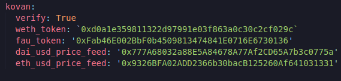

So to complete the deck, we can do get_contract again and we'll deploy mock price feeds if they don't exist.

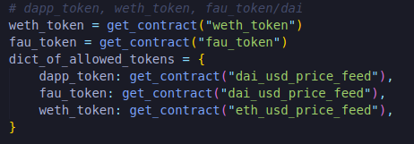

Now we've dictionary of allowed tokens that we can pass to our add_allowed_tokens which will map the tokens and their addresses with their associated price feeds so we can get them all to equal the same value in our contracts.We can go ahead and create a function called "add_allowed_tokens".We'll pass the token_farm, dictionary of allowed tokens and the account.In our add_allowed_tokens function, we're going to loop through all different tokens and call the add allowed function on it.

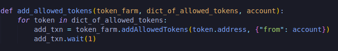

then we're going to call setPriceFeedContract function.So we're actually going to set the price_feed associated with that token.

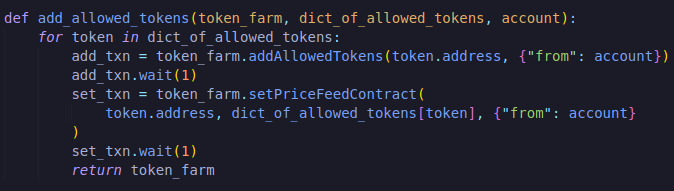

Great the deploy script look pretty good and infact we're going to end our deploy_token_farm_and_dapp_token with returning token_farm and dapp_token.This way we can actually use deploy script in our tests.Let's give this an initial test on a local ganache chain:

`brownie run scripts/deploy.py`

