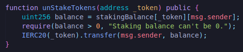
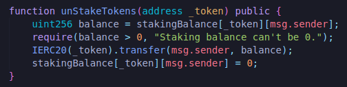
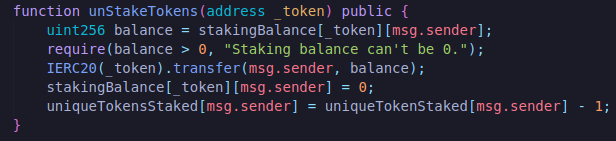

All we've to do now is add some way to unstake the tokens.Let's go ahead and create this function.

**unStakeTokens**

First thing we're going to do is fetch the staking balance.How much of the token does the user have?

Once we actually transfer the token, we'll do :

Because we're going to transfer the entire balance here and then we're going to update how many of those unique tokens that they have.

**Can this be reentrancy attacked?**

Quick note here.Later on we're going to learn about `reentrancy` attacks.So at some point come back here and figure out whether this is vulnerable to reentrancy attacks.

Now the last thing we could do is we probably should actually update our stakers array to remove the person if they no longer have anything staked.This is a little bit sloppy but we're just going to skip doing that for the time being however if you wanna go back and add the functionality to remove the stakers list as they unstake.It's not a big deal if we don't actually do this because our issue tokens function is actually going to check to see how much they actually have staked and if they don't have anything staked then they're not going to get sent any tokens.

That's basically all of the functionality here.Let's just try quick sanity check with a brownie compile. 

Just because it's compiling correctly though doesn't necessarily mean that we're doing everything correctly.Typically now we'd want to go ahead and start doing our tests.

**Scripts and Tests**

I'm actually gonna go ahead and build one of our scripts first.The reason I'm going to build on of the scripts first is because I'm going to use my deploy script pretty regularly in my test.I'm going to use it as part of my testing.This way I can also test some of my scripts as well in addition to the contracts.So let's go ahead and make our deploy script and __init__.py.

