## Front End / Full Stack

Now that we've got the contract work, we're going to learn something totally new that we haven't covered yet.We're going to learn to do some front end development.This isn't a front end course and the focus isn't going to be on front end.Undestanding how these font end applications work is really helpful and it'll give you a massive incredible skill to actually build front ends for your smart contracts.Having a really solid user interface is really important in the web3 and the blockchain world.If people can't use your contracts then what good is your application.So with that being said let's jump on and let's build our front end.

**React and Typescript**

We're going to be working with `typescript` here which is a improved version of javascript and catches a ton of the different bugs and allows us to be much more explict with how we're working with our front end.We're also going to be working with react.We're going to be working with `create react app`.This is a front end framework that allows us to quickly spin up a front end to build for our applications.We're also going to be working with `useDapp` which is a framework for rapid dapp developent and works great with react.So let's get started building the front end.

**create react app**

First thing we're going to do to build a front end for our full stack application is create react app boilerplate.So you should have npx install.Run npx --version and it should shows the versions.This should be installed when we installed npm.

**install packages**

If you don't have npx install you can run :

`npm install -g npx`

Additionally we're going to install yarn.To install yarn, you just run:

`npm install --global yarn`

Once you've those, we can actually create a folder with all of our boilerplate code in it.We're going to run:

`npx create-react-app front_end --template typescript`

For those of you who've never worked with typescript before and who've worked with javascript, don't worry the syntax is nearly identical.For those of you who've never worked with either, don't worry we're going to walk through everything that we do.

Now that we've downlaoded our create react app, we've the new folder called front_end.

Now typically what different applications will actually do is they'll have one repository for all their python and for all their contracts but they'll additionally have a different folder or different repository for their front end application and their front end work.This is really good practice.We're just going to bundle everything up into the same repo here just to get started and just to make it easier for us getting started here.

However what you'll see across different projects is they'll have a totally seperate repo for their front end.So let's take some inventory on what's actually going to inside the folder.

**Create React App Layout**

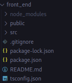

So the first folder you'll see is `node_modules`.These are basically the pip installs.These are the different packages pulled in from javascript and typescript.We can pretty much ignore this folder for the majority of what we're working with.

Next we've our `public` folder.We're also not really going to go in here but it's got some nice little images, basic index.html which has the html that we're going to be running with and has a `manifest.json`.The manifest is something that we want to change.It tells our browsers a little bit about what our app is and what our app actually does.So this is something that we'd change but everything in there is pretty self-explanatory and then roberts.txt which helps web searchers and indexers learn a little bit more about your site.

Most part we're not going to do anything in the public folder or the node_modules folder.

`Src` folder is however we're going to be spending alot of time in it.It has our App.css which includes whole bunch of formatting for html, App.test.tsx which is going to be testing our front end, App.tsx is one of our main places to write some code, index.css again a formatting and styling file.Anything that ends in css is some type of formatting and styling.All the tsx are going to be typescripts.

`package.json` tells our project what dependencies it needs and node.js packages.

`tsconfig.json` which gives us some options on how to work with typescript.

If you're unfamiliar with alot of stuff don't worry too much about it.

Now that we've created the basic create react app, we can actually go ahead and right now we can see what  front end will look like.

`cd front_end/`

`yarn` : just to make sure we've everything installed.It installs all of our dependencies.Anything in package.json, yarn is going to to go out and download these dependencies and store them into node_modeules and then yarn.lock is going to tell us exactly what it downloaded.

`yarn start`

If you wanna know where this's coming from, if you go in your package.json and you look under scripts:

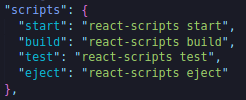

These are the four different scripts that we actually run.Running yarn start runs this npx react-script start which will actually start our front end.After a little bit of time, we'll get something that look like:

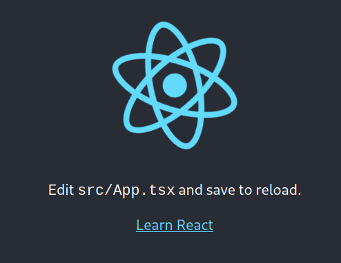

This is a super simpler front end.Obviously this isn't at all what we're looking for but we've now started a front end.

We're going to stop the front for now by hitting `ctrl` + `c`.

We've a really basic setup for working with a front end.

**connecting your wallets**

If we look at an application like [aave](https://app.aave.com/), you'll see they've connect button that pops up and they've got some nice user interface tools for actually working with the blockchain.We don't have to reinvent the wheel and build all these custom tools for doing this.So we're going to use the application called `useDapp`.To get started installing all we have to do is run:

`npm install @usedapp/core`

This will install all the usedDapp pieces into our frontend so we can actually work with useDapp and not reinvent the wheel with working with wallets and working with ethereum and other smart contract applications.Now that we've that installed, we can actually go ahead and start building our front end now. 

We're going to go to App.tsx file and start adjusting some bits in there.We can do yarn start.We can go ahead and do something like change anything in there.Like the line `Edit src/App.tsx and save to reload.` to `Hello` then save it and recompile and display hello.

This is how we upload and update our front end.This is also our starting point for allowing our application to be web3 compatible.

So if we go to the useDapp [documentation](https://usedapp-docs.netlify.app/docs), we've a little example here that shows what something should look like.It's not exactly clear where we put all this code.So they've wonderful step-by-step bit.This is probably the most helpful bit here it says "The first thing you need to do is setup DAppProvider with optional config and wrap your whole app in it".So we're going to use DAppProvide tags to wrap around our app.

We can see the whole return thing in our App.tsx:

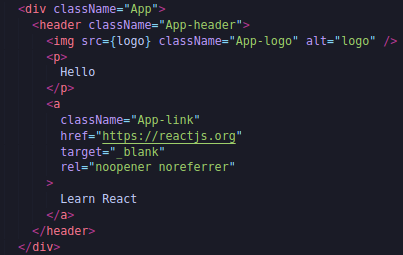

is our app.If we delete whole thing and save it, our front end is going to have nothing.The function App is getting exported to default App and it's getting rendered in `index.tsx`.But in any case we wanna wrap the whole thing with DAppProvider tag.

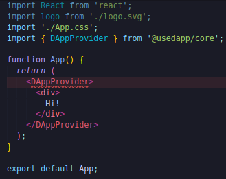

If we hit save we get the error like:

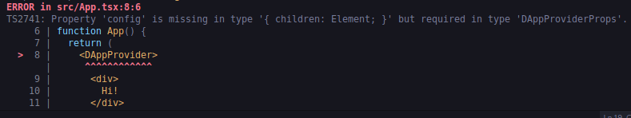

That's because the DAppProvider needs a config asscociated with it.We need to add the config bit into the DAppProvider.

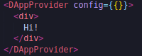

First bracket says we're going to type in typescript and the second bracket is saying we're an object here.So in this config we're going to tell our application a couple of different things.We're going to tell it what suported chains there are, what are the networks that our application can actually work with.The default value for supported chains is going to be mainnet, goerli, kovan, rinkeby, ropsten and xDai.Since we're going to be testing only on Kovan and Rinkeby, we could just do:

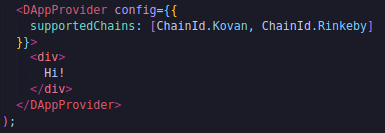

If we wanted other chain ID, we could just go ahead and put in in there.If we wanted to work with our ganache we could just do 1337 or if we wanna work with random chain we can put other numbers there.And this is all we need to get started working with in a web3 blockchain compatible application.

We're going to spend lots of time in source folder and since we're going to be here lot, let's do some clean ups just to cut down on the amount of fat we've with that create react app.So App.css, App.test.tsx, logo.svg we're going to toss them.

**Header Component**

We're going to create a component.In react components are basically where you put modular parts of your front end and we're going to create one of these components is going to be our header component.To do this create a new folder inside scr called "components" and inside it create a new file called Header.tsx.This is where we're going to put our header stuff and we're looking to put a little botton up on corner.

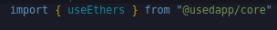

Again if we look at the documentation real quick ,

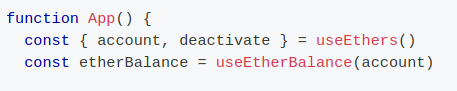

This useEthers thing has got activate browser wallet thing and account thing.We're going to start by exporting constant variable.

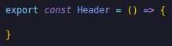

This is some fancy typescript syntax which means Header is a function and what's the function gonna do.We're going to use this useEthers thing to get a couple variables.

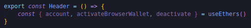

In order for us to actually use these though, we need to figure out first if the user is connected.

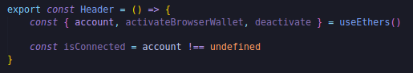

So we're saying is the account is undefined, we're not connected.If it's not undefined then we're connected.We're literally just looking to see if there's an account here and whether or not we're connected we'll decide if we show a connect button or not.So to do that we're going to return some html stuff.

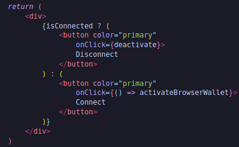

We're using the `?` which is knows as a tertiary operator which means if the account is connected we're going to do something and if it's false we're going to do something else.If we're connected we're going to create a button and we'll put deactivate function pulled from useEthers when we click the button and we're calling the button disconnect.This is what if account is connected does.

After colon(:) represents what we're going to do if it's not connected.We're going to show a different button and when click we're going to do a function of activateBrowserWallet and call the button as Connect.

So if we're connected, we're going to show a disconnect button and then if we're not connected, we're going to show a connect button.Save this and if we look at our UI nothing is changed.

Well why isn't anything changed? Well this component that we just made it's living inside of components folder and we've exported the header variable however it's actually not in our App function.If we look at our index.tsx, App is only getting rendered which we pulled in from ./App.So index.tsx is really our true ground zero.This is where everything really comes from.This is kind of our entry point.This is our main function you can kind of think that way that pulls from App file that we've.You can see we don't have any reference to header.We've our DAppProvider, div tag sying "hi" but we don't have the header in here.

So we need to import  the component we just made into our App.tsx.

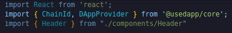

Now we can take the header bit and place it inside our header tags.

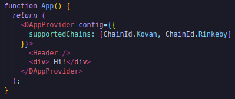

Now we can see a little connect button in the browser.

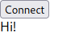

Obviously it doesn't look great but we've the functionality here which is what we want.If we hit the connect button, our metamask will actually pop up and say "Would you like to connect?"If I go to supported networks like Kovan, we could see Disconnect and if I click it I get disconnected.

This how we can take our metamask and actually inject it into our front end so we can actually use the front ends.

Now you might be saying "This is cool but it doesn't look very good.Can we style this up?Can we make this look alot nicer?" and the answer is absolutely yes.

**Material-UI**

There's alot of different styling packages out there.You can also 100% write your custom ones.We're going to to using one called "Material-UI"It's a popular react framework for creating components and just doing alot of styling.So we're going to be adding this to our project as well.

`yarn add @material-ui/core`

This will give us access to some really nice libraries for styling all these buttons and installing alot of things that we're going to be working.So back in our header we can add the styling.

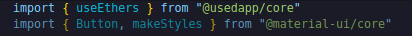

We're gonna use it's button and make styles.If we look in the [documentation](https://v4.mui.com/components/buttons/), it shows what their default buttons look like.We're also going to be taking advantage of their make styles.So make styles is a way to actually do styles for based off of different themes that you can actually use with materials UI.We're not going to be wroking with css files because we're going to be working with make styles instead.If you prefer css, you can absolutely easily translate it to css files.So we're going to add some used styles first of all using make styles.

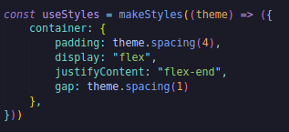

This is relly just some typical css stuff.Now we're going to take the useStyles constant that we just made and down there we do:

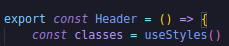

We're going to take the classes object in our isConnected thing.

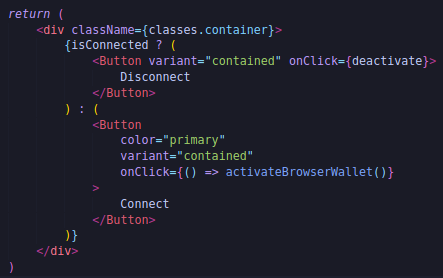

We're wrapping whole thing inside the div.This is going to style whole button div.Now if we go and do `yarn start`, we can see it's going to look a little bit different.

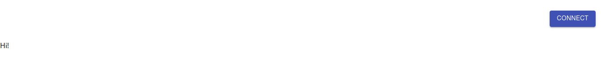

It's been moved over to the corner where there's padding and look little bit nicer.We're going to change all of our buttons to being built-in button from the materials UI.

Let's create a component that will contain the meat of our application.From materials UI, we're going to use containers.It allows us to style and make different sections.We can import container bit from material UI in App.tsx.

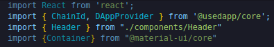

In our header we'll make a little container.

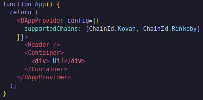

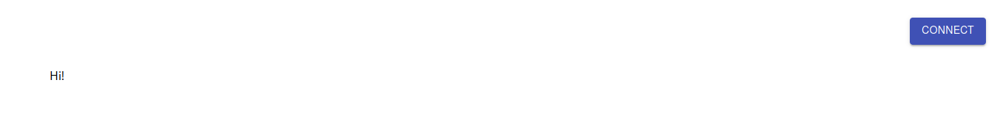

We can see that it's been formatted little bit.It's been pushed over from the side.we're going to give it a max width.

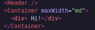

If we look at the [docs](https://mui.com/material-ui/api/container/) again on materials UI,

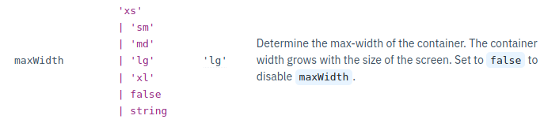

these are the different sizes.

It's time to add our main pieces.We're going to need that top piece for staking and the bottom piece for unstaking.So we're actually going to create a new component called "main".This is going to be our main component.So we're going to create a new file in components called "Main.tsx".So let's just start by showing some information about our wallet.Showing what we have in our wallet associated with what we've in the smart contracts.

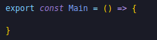

In order for us to show what amounts that we've in our current wallet, we're going to need to know what chain that we're even on because the network that we're on is going to determine where the addresses are because it's going to be on Kovan or Mainnet etc.Now this is where it get's a little bit interesting.Obviously with brownie we know where the address are and brownie keeps track of this.It does it in our build/deployments folder.If we look there now, if you actually deploy to Kovan, you'll see the 42.

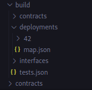

You can see the map.json which has the most recent deployments of our tokens and our tokenfarm.If you haven't deployed it to Kovan, I highly recommend you doing that.This way we can test our front ends against a real testnet.

So in order to get these addresses, we're going to have to ask brownie about the addresses, where these coming from.So we're going to need to grab some information from the brownie config.

**Sending brownie config to the UI**

We're basically going to need to get all the information that's in the brownie config because it has the addresses already.However it's really hard for node.js to work outside of source folder.So what we're going to do is we're going to send that brownie config to our front end.We're going to modify by adding a new function in deploy.py.

Now the only reason this works because we've both our contracts and our frontend in the same repository.In the real world once you deploy your contracts those addresses are pretty much set.So you can just copy paste them over to your front end repository but for us we don't have set contracts yet.So we need a way to update our front end.

We're going to send that brownie config over to the front end that way our main can know where those addresses are.We're also going to need to send build folder because this will have access to the dapp_token address or any other mock address that we're using.We're going to open up our brownie config and we're going to paste and we're going to dump the config into that source folder.Now typescript doesn't work with yaml, but it works with json really well.So we're actually going to convert it from yaml to json and dump it to the front end.

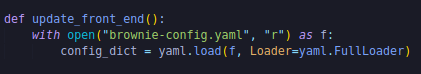

Yaml is going to allow us to load our yaml into a dictionary.To install yaml, we need to run:

`pip install pyyaml`

Now that we've got this in a dictionary, we're going to want to send this to the front end.We're going to write this dictionary as a json object to our front end. 

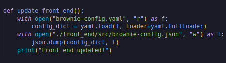

Now we could do when we run our deploy token and dapp token  we can just add update front end function.

Now we don't want always update the front end.we only want to do when we're working with the front end.So in our deploy_token_farm_and_dapp token:

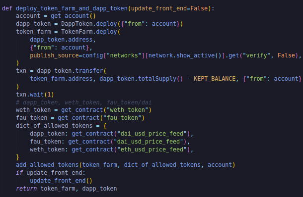

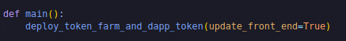

Now if we deploy this to Kovan or Rinkeby we'll automatically update and send the brownie config.But we're not always going to redeploy so let's also create an update_front_end.py script and this will call that function that we just made.

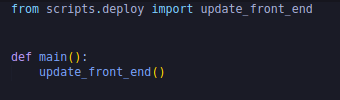

Let's open up a new shell by hitting a little plus button and we could do `brownie run scripts/update_front_end.py`.

If you get the error like:

RPCProcessError: Unable to launch local RPC client

You just need to downgrade your node into 16.13.2

`curl -o- https://raw.githubusercontent.com/creationix/nvm/v0.33.1/install.sh | bas`

`source ~/.nvm/nvm.sh`

`nvm install 16.13.2`

If we did this right, we should now have a brownie-config.json in our front_end/src directory.It's going to give us some of the addresses but it's not going to give us everything.What about dapp token?Dapp token isn't going to be something in our brownie-config.It is going to be deployed by us.So we need to send that to the front end too.we need to send basically our whole build folder.So we need to update update_front_end function.

I know that we're actually going to be copying a number of different folders so I'm just going to go ahead and make a new function called copy_folders_to_front_end.We're going to do couple of clever python.It's going to take source and the destination.Copy build folder and move it to some folder in front end.First we're going to check that destination exists and if exists we're gonna kill.

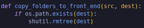

We're just going to copy everything over from our build folder.

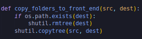

First thing is going to be with builf folder.

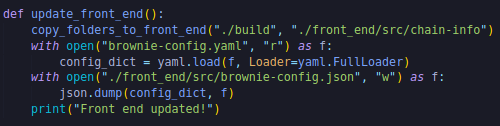

So now we can run that `brownie run scripts/update_front_end.py`

Now we can actually start working with the pieces in our front end.Let's figure out how to get the dapp token address.Well to get the dapp token address, we're going to need that map that we just from chain-info in our deployments and we're also going to need to know what chain that we're currently on.Like what we saw before:

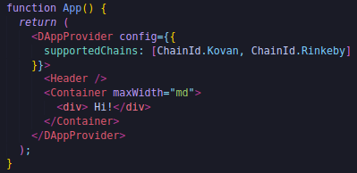

We've the chain id from @usedapp/core which will tell us what chain id of the current network that we're on.We can import that in our Main.tsx as well.

Now that we've the chain id we're going to map it to the name of the network because our brownie-config has the network section but it's mapped by the name of the network not by the ID.We're going to create a helper config in our src.

**Helper Config**

It's literally just going to be a json object that maps numbers to their associated chain names.

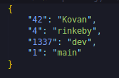

Now that we've this helper config we can do import helper config.

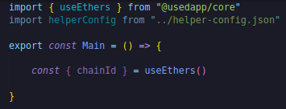

Before we even get the dapp token address, we can do :

Now typescript is actually going to get a little bit mad at us here.So we need to add little bit more to the line.We need to say "Only grab from this helperConfig if chain id exists" because there might be chance that chain id is nothing.

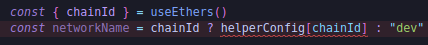

Whenever we want to return one of these components or try to use one of these components, we're always going to have to return some type of html or div tag like this:

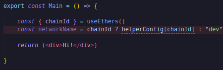

We head over to our App.tsx, we add our main bit here.

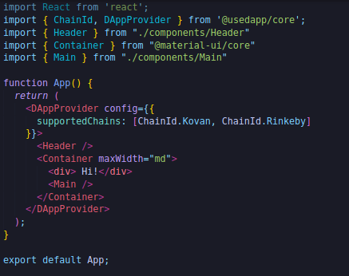

Now depending on your setup, you might actually run into this error:

"Element implicitly has an 'any' type"

To make our lives easier,we're going to tone down typescripts strictness here.In our tsconfig.json, we are going to add:

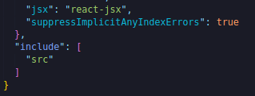

We're basically supressing when we get this type of error because it's not ever actually going to affect anything.We can also console.log the chainId and networkName.We can see in our console exactly what these are gonna look like.

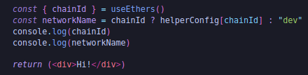

We can go hit inspect in our browser, go to the console and we'll see 42 and Kovan gets printed out in the console.

So we've our network name and chain id, we've got a way for us to update our front end with a new script.Let's finally get those different addresses that we need.Dapp token address is going to be something from chain-info folder that we created.We've map.json and since I've already deploy to Kovan, we've dapp token and token farm on the Kovan Network.So we can then use that :

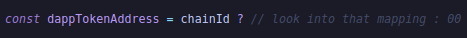

If we're connected to chainId then look into that mapping else we're just going to use 0 address.So how do we actually get the mapping?

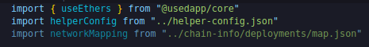

We're going to take this network mapping object and we're going to say if the chain id exists then inside the network mapping json object we're going to cast that chain id as a string then grab the name of the dapp token and we're going to grab whatever address is at the top.Otherwise if we're not on a chain id we're just going to use 0 address.

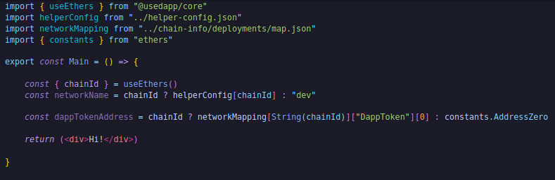

If you don't already have ethers installed here, you can do:

`cd front_end/`

`yarn add ethers`

We're not going to do the same thing for the weth token or the fau token because those tokens are defined in the brownie config as opposed to being defined in our map.json.So to get those ones:

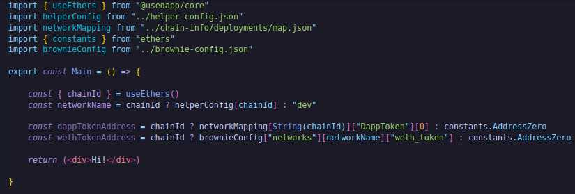

then we're going to do the exact same thing for the fau/dai token.

 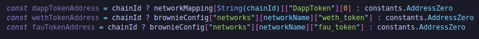
 
 We've gotten what network we're on, what chainId we're on and gotten different addresses for different tokens.So as you can probably see the place that we're actually going to put stuff in the front end is in the return statement.
 

