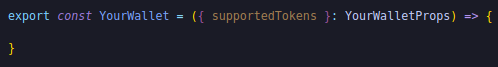
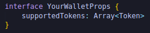
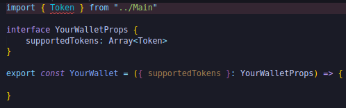
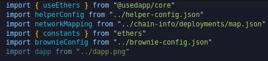

**YourWallet**

To do this we're actually going to make another component called your wallet.This component is going to be a part of this main component.It's a component inside of a component that is literally only going to address our wallet needs.So in our little components tab, we're going to create a new folder call it "yourWallet".We'll create a new file because we're actually going to make a couple files and our first one is just going to be "YourWallet.tsx".

This is going to be our component that's just going to deal with getting our wallet, getting the token balances of different tokens that we've.Since we know we're going to put this component in Main and Main is in our home base our App.tsx, you know that we're going to do an export YourWallet function.

In order to actually show these tokens, we do need to get some information from our other component.we need to get some information on what the supported tokens even are.So we're going to have our main actually pass a variable to our wallet.

Just to tell typescript what the supported tokens is going to look like we're going to say:

we're going to grab that token type from Main as well. 

and in our Main, we're going to pass the Token and some supported tokens to our wallet.So right underneath those three token addresses back in main we're going to do:

Above in the main we do export of type token.

So we're creating a new type called Token in our main function.We're creating supportedTokens which is an array of tokens and will be equal to array syntax.

So our first token is going to be have an image that we haven't defined yet, address is going to be dapp token address and the name is going to be dapp.Now we're going to need a couple images.So at this point you should see where we're going with this.we create this array of supportedTokens first is our dapp token and we need an image for the dapp token.Pop the image into src and name it dapp.png.

Now we can import this :

we can take the dapp image and under image I'll put it.
 
