**YourWallet**

To do this we're actually going to make another component called your wallet.This component is going to be a part of this main component.It's a component inside of a component that is literally only going to address our wallet needs.So in our little components tab, we're going to create a new folder call it "yourWallet".We'll create a new file because we're actually going to make a couple files and our first one is just going to be "YourWallet.tsx".

This is going to be our component that's just going to deal with getting our wallet, getting the token balances of different tokens that we've.Since we know we're going to put this component in Main and Main is in our home base our App.tsx, you know that we're going to do an export YourWallet function.

In order to actually show these tokens, we do need to get some information from our other component.we need to get some information on what the supported tokens even are.So we're going to have our main actually pass a variable to our wallet.

Just to tell typescript what the supported tokens is going to look like we're going to say:

we're going to grab that token type from Main as well. 

and in our Main, we're going to pass the Token and some supported tokens to our wallet.So right underneath those three token addresses back in main we're going to do:

Above in the main we do export of type token.

So we're creating a new type called Token in our main function.We're creating supportedTokens which is an array of tokens and will be equal to array syntax.

So our first token is going to be have an image that we haven't defined yet, address is going to be dapp token address and the name is going to be dapp.Now we're going to need a couple images.So at this point you should see where we're going with this.we create this array of supportedTokens first is our dapp token and we need an image for the dapp token.Pop the image into src and name it dapp.png.

Now we can import this :

we can take the dapp image and under image I'll put it.
 
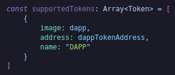

Now let's do the other tokens.

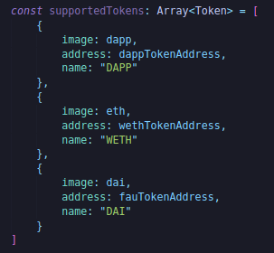

If you vs code is yelling at you about can't find module while importing image, we're going to do at the top of our code.

`/* eslint-disable spaced-comment */`

`/// <reference types="react-scripts"/>`

Save and that issue will go away.

Well now that we've our supported tokens token array, we can actually pass this to yourWallet bit.

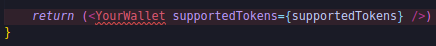

Of course we need to import YourWallet.

We're actually going to make a new file in our yourWallet folder called "index.ts" and we're just going to export YourWallet.

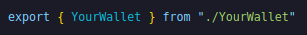

Now we've some supported tokens, we have a wallet, exporting our wallet with our index.ts in our yourWallet folder.Now finish our YourWallet implementation.

We're getting this error:

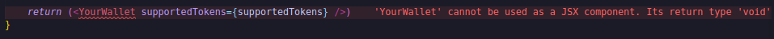

because we don't have return in our YourWallet bit.

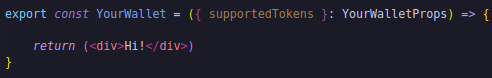

If you getting error like this:

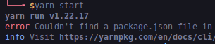

It's because you're not inside front_end directory so it could found the dependency packages to start.

`cd front_end/`

`yarn start`

Let's keep diving into YourWallet here because this is gonna be where we're doing all of the stuff about what's in your wallet.We're going to use couple of components from the material UI to get started.To start we're just going to use the [box](https://mui.com/material-ui/react-box/).Box component serves just as a wrapper component for most of the css utility needs.It's a box that we can put on our front end.We're going to put everything in return statement inside the box.

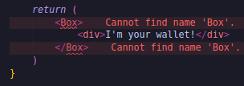

We need to import the box.

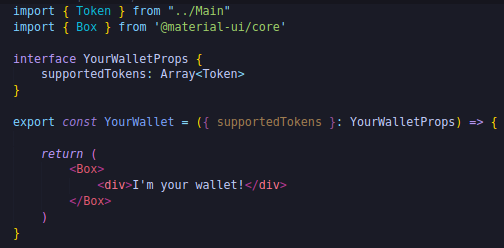

We'll give box a little header.

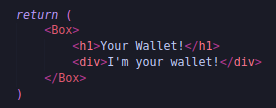

We'll get rid of div tag and create another box and in there we're going to add all of our functionality for what is in our wallet.

We're going to use some `tabs` from the material UI to swap between the tokens.We're going to have one tab for fau token, another tab for dapp token and for wrapped ether we're going to use tab.So to work with tabs, we need to import some tab stuffs.

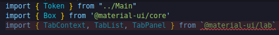

`@material-ui/lab` are some componenets that they're not quite ready to move to the core.So we do have to add these as well.

`yarn add @material-ui/lab`

Let's get into the box and make our first TabContext.The first tab that we're going to have to use is going to be whatever token we've selected.To select token, we're going to use what's called `State Hook`.

**State Hook**

We're going to create a state hook inside YourWallet.

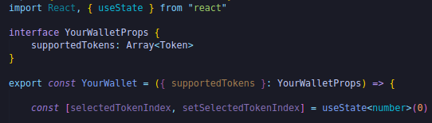

It's going to create one variable selectedTokenIndex: this is going to do be whatever token that we're on and then setSelectedTokenIndex is going to update the selectedTokenIndex.The useState component thing is a way of saving state between renders of components.

So in our little box, we're going to start with our own tab.

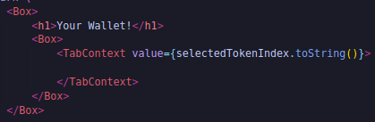

Value is whatever token we currently have selected.We're going to have to make a list of tokens in our tab context.we're gonna have to add some way to change between the tabs.When we change between the tabs, we want different token to be selected and we're going to make a tab list that's going to change whenever we click different tabs.We're going to add some functionality to this but for now we're just going to give it an "aria".

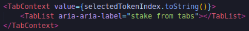

Based off the suported tokens in a mapping of token to index, we're going to call a function where we return a tab.

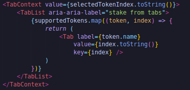

Now if we look at our UI, we can now see we got a couple different buttons.

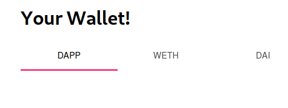

Now ofcourse if we click the different buttons, nothing actually happens.So we do need to handle a change.We do need to code some functionality to handle a change whenever we do something different.So in our Tab List we're going to add:

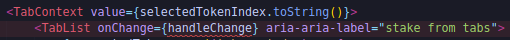

I'm going to code a little functionality at the top to actually handle a change.

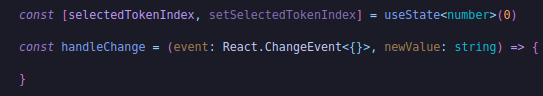

We're going to use our little state hook here.

So what's happening here?We've added this new functionality where whenever we change on of those tabs, we're going to change the selectedToken.The selectedToken number is going to be different and what we do is map the indexes to a token.In our front end we can see we do indeed swap between tabs.

But we need a big stake button.The reason that we need to swap between the tokens is because we need a way to stake between them.So when we're on one of these tabs, we're going to add a stake form here.

**Stake Form**

We're going to add a big button that allows us to stake.

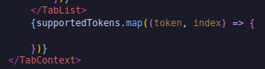

We're mapping that token and index again and in here we're going to return a different tab panel.

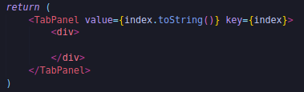

We're gonna need to put two pieces in here.We're gonna need to be putting our wallet balance and then also a big stake button.How do we actually get our wallet balance and one of these big stake buttons?Well we're probably going to need some type of component to get our actual wallet balance that we're going to stick in here.So yup you already know we're going to go into yourWallet folder, create a new file and this is where we're going to define wallet balance component "WalletBalance.tsx".

 and we're going to import our WalletBalance into our wallet in YourWallet.tsx so that we can actually see the balance of our wallet right in the front end.This is where we're actually be reading `off-chain` finally after alot of typescript and react setup.Since we're going to be importing WalletBalance into YourWallet component, we're going to start with export.

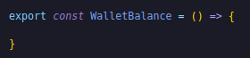

We're probably going to pass this the token, the token that we want to get the balance of.So we're even set it up like this:

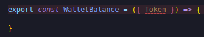

and we'll define what it looks like with the interface called "WalletBalanceProps".

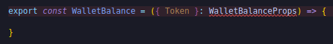

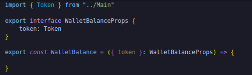

It's the same token type that we defined before in our Main.This is our initail set up here.We'll grab from the token that we've passed, we'll get the image, address and the name from that token.

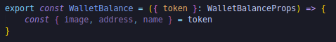

We'll grab the account because we're going to need the account with along the token.

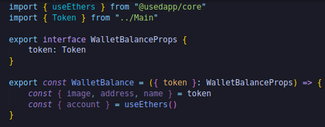

usedapp/core has a nice little hook called `usedTokenBalance` that we're going to use.It provides a way to fetch the balance of ERC20 tokens specified by tokenAddress.It makes our lives alot easier. 

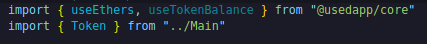

All we have to do really is:

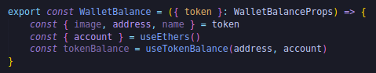

We can even do quick console.log to see if we're doing correctly and we take the WalletBalance and import it into YourWallet.we should be able to see something.

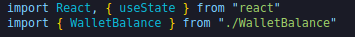

and down inside our very large return function, we'll add new component :

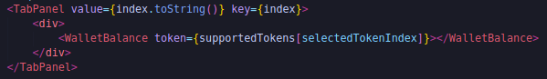

We do need to do a return in our WalletBalance function in WalletBalance.tsx so that it's actually a jsx component.

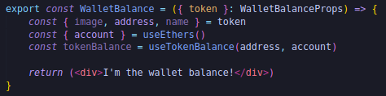

We want to show the token balance obviously in our UI.We don't want to have people to have to go to the console.log to actually see it.First we should probably format it because balance is in units of wei.

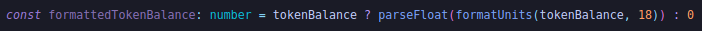

formatUnits is a nice little import that we're going to grab from ethers project.

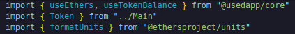

and we need to install ethersproject.

`yarn add @ethersproject/units`

Now the formattedTokenBalance is going to be the tokenBalance that we just got but formatted much nicer and in our div we could just add that formattedTokenBalance.

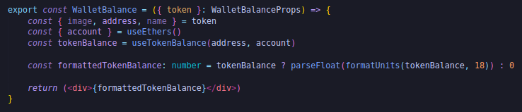

We can the balance when we slide through the tabs.Let's make it look a little bit nicer.Instead of just returning a div like above, let's actually make a new component called "BalanceMsg" and use this instead.It'll format up the way we actually show the formatted tokens.Here we'll pass it couple of variables.We'll pass the component an amount, label and tokenImgSrc.

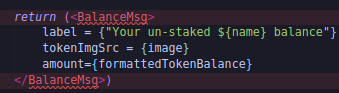

BalanceMsg component is going to make us have the balance look a little bit nicer.So in yourWallet folder, we're going to create a new file called "BalanceMsg.tsx".Pretty usual we're going to export BalanceMsg.

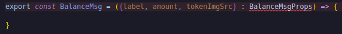

Of course we need to tell typescript what this looks like. 

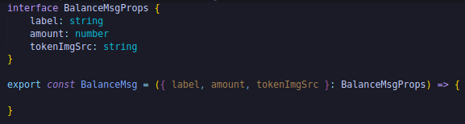

In here we're once again do that useStyles bit from materials UI because we want to style this up a little bit.

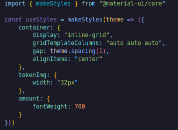

So now that we've our useStyles, we can go to our export below :

 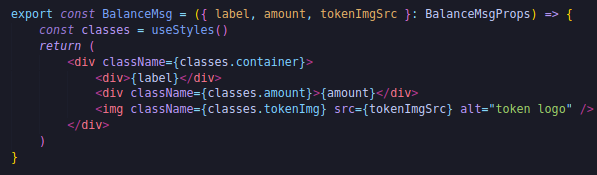
 
In our WalletBalance the BalanceMsg that we just created, we'll import that.Before that actually I know that we're going to use BalanceMsg a little bit later so I'm actually going to grab it and drag it into components folder.

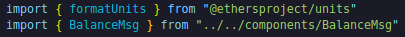

and in our return we need to fix it:

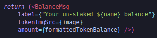

Let's try out the front and we can see we're looking a little bit nicer.Let's add the stake button.So when they see in a tab, they can actually stake and interact with our contract.So to do this, we need to create another component called "StakeForm.tsx" inside yourWallet folder.This is where we're going to add a little button and an amount for the users to actually stake on our contract. 

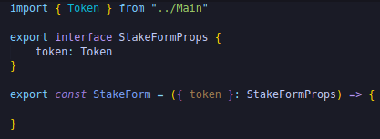

This is our starting point for this.We're going to create a stake form with a big button that says "Stake" and the user can actually choose how much they wanna stake on our smart contract.So we're going to do similar stuff as we did before.

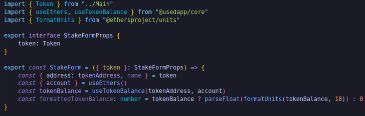

Importing here we've gotten some starter boilerplate.Let's just go ahead and grab those buttons because those are really the things that we're going to care about here.Let's just return some stuff here so something can show up on our front end.Whenever we return something, it's all gonna be in one tag.

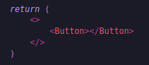

We're going to pull Button from material UI and back in YourWallet.tsx, let's add the button in there inside of our tab panel right below our WalletBalance and we need to pass the token object.

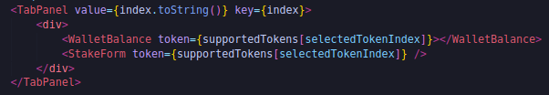

We'll give some stuff to the button in StakeForm.tsx.

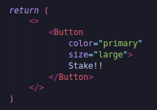

Now we can start adding some implementation.We can have it do some stuff now.When we hit the stake button, what we want it to do?we want to do two things.We want to approve whatever token that we've and then we want it to stake that amount.we also need to have some type of form here.we need to know how much we want to stake.So we're going to need some little input box that we can add a certain amount in.

well we can do that too with a little input box from material UI and then we're going to use this little input box before button.

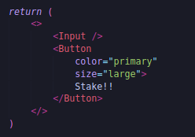

Now if we save and refresh the front end we could see:

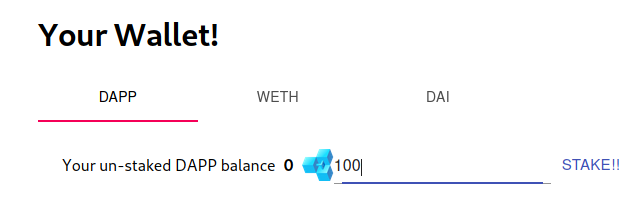

To do this though we need to keep track of how much amount is in here.We're going to inspect on the front end, go to console and see if we can follow along with how much is in the wallet.To do this we're going to make another one of those stake hooks to track that amount in there.

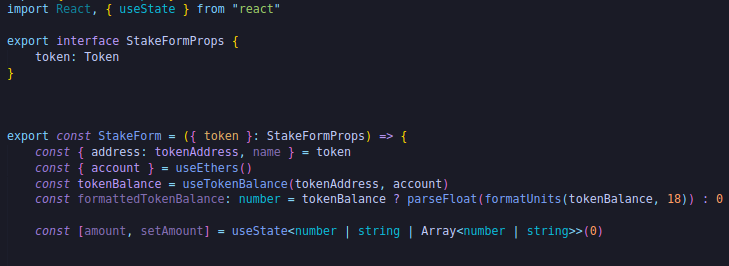

Now that we've stake hook that we can use to track the amount that's gonna be put in there.With our input tag here, we're going to do:

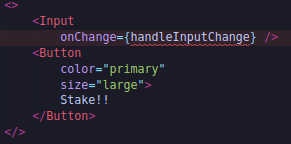

This is going to handle the input change and we're going to create this function.This is going to take an event of html input element.

Whenever we changed that value in that field if it's equal to nothing then we're going to do nothing otherwise we're going to caste whatever in there as a number.Then we're going to setAmount to the newAmount.

Now that I've a way to actually get that amount with the input, we're going to need to weigh to send that amount as a part of our stake.First we're going to call that approve function with the amount and then we're going to have to call from our TokenFarm.sol stake method.How do we get it to call this approve function?

**Calling Approve**

Well to do these we're actually going to make some new stake hooks that we're going to use in our staking form.we're going to make stake hooks for approving and fro staking and even for unstaking.So back in our front_end, we're going to create a new folder called "hooks" and we're going to add different hooks.First hook that we're going to make is going to be called "useStakeTokens.ts" and this is something that we're going to import into our stake form so we can actually stake some tokens.The way we want to do it too is that once we hit stake, it kicks off the approve and then actually right afterwards it kicks off send.We want to run these two functions sequentially and we're going to make stake token hook clever enough to do in that order.

Hooks are basically just like components except for they're more functionality wise.So since we know we're just like components, we're going to do:

and as input we're going to take token address which is string.

Inside of this we're going to have some intelligent scripts to know if it's already been approved.If not already been approved and what we need to do.We know we're going to need some approve thing and some stake tokens thing.So let's atleast try to approach this approve thing first before we get too creative.How do we approve the transaction?

To get an approve we're going to need a couple of things.We're going to need the address, we probably going to need ABI and chain id.So let's go and grab those.

We're also going to want the ABI of the token farm.Where do we get the ABI from?We've imported it in our `chain-info`.So we should be able to do:

and now we can say:

We're going to need the token address ofcourse.We're also going to need our token farm address and we can find that exact same way we found it before.Once again we're going to use that networkMapping.we can even go to Main.tsx and see how we did there for the dapp token address.

We'll say if the chainId exists, we'll pull from that networkMapping.So we got to import networkMapping.

`Hooks folder should be in src`.

Now we're going to interact with token farm address contract.We're going to want to run that approve function.We want to create like an interface so we can do:

and we could import utils from ethers.Now that we've an interface, we'll create a contract.

`yarn add @ethersproject/contract`

Now that we've a contract we can actually call some functions which we totally can but right we need to call the approve first.So let's get the token contract before we even work with the stakeToken.So to work with the token, we're going to do the same thing.

We've the tokenfarm contract, erc20 contract.Now we should be able to go ahead and call some functions.

**useContractFunction**

To actually send one of these we're going to use useContractFunction.It's a hook in useDapp that returns an object with two variables: `state` and `send`.The state bit is used to represent the status of the transaction and that's how we're actually going to automatically kick off the stake after we approve.To send a transaction we have to actually have to use this send function.So we're going to use useContractFunction to get a state and a send.So that's what we're going to first need to do.

We passed the token contract, the name of the function and little object call it as transactionName in useContractFunction.Now we've two pieces here.This send function(approveErc20Send) and this state function(approveErc20State).State is going to be the status of our transaction and Send is going to be the actual function that we use.If we wanna call approve function, we can return calling the approve function.

then we'll just have useStakeTokens return the approve function and then also state.We also want to return state, so we're going to turn state into hool as well.

So in our StakeForm,we're going to grab those two variables.

Now that we've these two functions : approve and the state of the function, we can add a handle submit functionality for our button.

We're going to create the function called handleStakeSubmit.

So we're going to grab the stake hook's amount and turn it into a string.Then we can return approve function with the amount.

Now if we hit stake, we should call the approve function.Metamask pops up, we do get allow localhost to spend your dapp.We're doing it.We're actually sending a transaction.

The approve function is working perfectly.Now we gotta go one step further.we need to have to call stake after it's been approved.

**useEffect**

This is where we're going to do a little something called useEffect.we can import it from react.

It allows us to do something if some variable has changed.It takes function as an input and then we'll do comma and similar to stake hooks, we'll do an array of different things we wanna track.If anything in the array changes, we'll kick off the useEffect and do something.So one of the things that we definitely want to track is approvedErc20State.If approvedErc20State comes back successful then we want to do some stuff.

To do a stake function, we're going to follow the exact same methodology that we did for the approve.

now the stakeSend, we can just call it in this approveErc20State.status bit.If we look back in our TokenFarm.sol, stakeTokens take amount and token address as an argument.So we've to put some amount and token address.

Where do we actually get the amount from?Well when we originally called approve function, this is when we actually do it.You might be asking "How come we wrapped this approveErc20Send into a stakeSend function?" but we're not going to do that here.I'll tell you in just a second.We're going to have a stake hook for how much we want to actually stake.

We're just going to get this defaulted to 0 and what we're going to do actually is once we call the approve function the first time, we're going to setAmountToStake to be the amount.

and what we should do is instead of calling it approve, we'll call it approveAndStake.Since it's this function that's going to kick off our approveErc20Send but it's also going to change the amount that we're going to stake and later on once the transaction succeeds, it'll also then kick off our stakeSend.

and below we've to return approveAndStake not approve and for stakeSend, the amount is going to be amountToStake which we got from our original approveAndStake.

and also we need to change to approveAndStake in StakeFarm.ts as well.

Realistically that's all we really need to do here.So if we save and go back to our front end, if you hit stake button approve will come up and once it actually confirms then another transaction should pop up telling us to actually stake.

However there's a couple issues here.

**Notifications**

There's no indication for us of what was really going on.Got no notifications.We're totally left in the dark.Additionally the front end still looks disgusting.So we want to clean this up.we want to make it look alot nicer.

For switching between these, we want to actually just change our useEffect.So we do wanna check let's approveErc20Stake but we also want to see if we switch the tokenAddress and if amountToStake also change.

This is great but we're going to want to get some notifications that these transactions are going through, these transactions are pending and these transactions finished.So we actually add those pieces.

Well useDapp has `useNotifications`.This notifications bit will help us actually get notified on whether or not our transactions are completing.So to use these notifications we're going to do couple of different things here.

First all the way back in our App.tsx, we're actually going to change our config here.

So basically we're saying "Every second check the blockchain on our transactions that we send".Now that we've the notifications bit identified, in our StakeForm, we can add this bit.

Now we can start using some of these notifications here.Right at the top do:

We can actually start working with some of these notifications now.We're going to want to see if anything in any of these notifications actually change and if these notifications change, we're going to want to do something.Since we're going to want to check to see if notification changes, we're going to use a useEffect.

If the transaction succeeded and the name is Approve ERC20 transfer then we're going to do something.For now we'll do console.log("Approved"!) and we can also do the same thing for Stake. 

Now that we've a way to actually track some of these notifications and track what actually happens on the blockchain.Console.logging stuff is great but we want to actually see it in our UI.We're going to want to do is show a little waiting thing on UI while we're waiting for it to be approved and then it'll pop up when it actually gets approved.

