## Events and Logging in Solidity

**Events**

You've might have always wondered how chainlink or the graph or other off-chain protocols work under the hood.We're going to learn about logging and events in solidity, viewing those events on an ether scan, and working with them in brownie as well.

Now it's the Ethereum virtual machine, or EVM, that makes a lot of these blockchains tick, like Ethereum, and the EVM has this functionality called "logging functionality." When things happen on a blockchain, the EVM writes these things to a specific data structure called the "log." We can actually read these logs from our blockchain nodes that we run.In fact, if you run a node or you connect to a node, you can make an eth_getLogs call to get the logs.

Now inside these logs is an important piece of logging called events, and this is the main piece that we're going to be talking about. Events allow you to "print" information to the logging structure in a way that's more gas efficient than actually saving it to something like a storage variable.These events and logs live in a special data structure that isn't accessible to smart contracts. That's why it's cheaper because smart contracts can't access them. So that's the trade off here.We can still print some information that's important to us without having to save it in a storage variable, which is going to take up much more gas.

Each one of the events is tied to the smart contract or account address that emitted the event in the transactions.Listening to events is incredibly helpful. Let's say, for example, you want to do something every time somebody calls a transfer function. Instead of always reading all the variables and looking for some to flip the switch, all you've got to do is say "Listen for event to be emitted." Instead of writing some weird custom logic to see if the parameters changed at a certain time or some weird stuff like that, when a transaction happens, an event is emitted, and we can listen for these events. This is how a lot of off-chain infrastructure works.

When you're on a website and that website reloads when a transaction completes, it actually listens for that transaction to finish. It was listening for the event to be emitted so that it could reload or do something else. It's incredibly important for front ends.It's also incredibly important for things like chainlink and the graph.

In the chainlink network, a chainlink node is actually listening for request data events for it to get a random number, make an API call, etc. Sometimes there are way too many events and you need to index them in a way that makes sense. so that you can query all these events that happen at a later date. The graph listens for these events and stores them in the graph so that they're easy to query later on. So events are incredibly powerful and have a wide range of uses.They're also good for testing.

Now that we know what events are, let's take a look at what they look like, what we can use them for, and how we might use them in our smart contract development suite.

Here's what the event is going to look like:

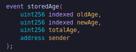

We've got an event here called "storedAge." So we basically have a new type of event called "storedAge." We're saying, "Hey smart contract, we've got this new event thing.We're going to be emitting things of the type storedAge in the future." When we emit this event, it's going to have these four parameters.It's going to have a uint256 called "oldAge," a uint256 called "newAge," a uint256 called "addedAge," and an address called "sender." You might have noticed there's another keyword in here.The `indexed` keyword

When we emit one of these events, there are two kinds of parameters. There are two types of parameters: indexed parameters and non-indexed parameters.You can have up to three indexed parameters, and they're also known as `topics`.So if you see a topic, you know that's going to be an indexed parameter.Indexed parameters are parameters that are much easier to search for and much easier to query than the non-indexed parameters.In fact, way back in the `eth_getLogs` function, it even has a parameter allowing us to search for specific topics. So it's much more searchable than the non-indexed one.The non-indexed ones are harder to search because they are ABI encoded and you have to know ABI to decode them.

Now this just told our smart contract that there's a new type of storedAge, a new kind of event.We need to actually emit that event in order to store that data into the logging data structure of the EVM.To do that, we need to do something like:

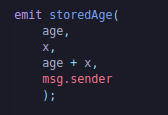

It looks very similar to calling a function.So you call it emit and then the name of the emit and then you add all the parameters in there that you like. Let's jump into Brownie to learn how to use them in our smart contracts and access them with brownie.

We're going to create a new directory called "events" and open it in VSCode. We're going to create a new brownie project:

`brownie init`

Let's grab the SimpleStorage.sol contract and put it in our contracts directory.

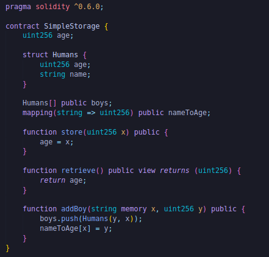

Let's add an event to our contract.

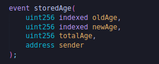

We want to emit an event to tell people, "Hey, something has happened." Something has changed. In our store function, we're going to emit an event.

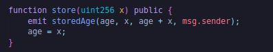

Normally, you'd want to change them before emitting an event, but whatever.

To check if everything is done correctly, hit the `brownie compile`

Let's go ahead now and we'll create a script.We're going to create our own deploy.py script. This is going to deploy the contract and then we're going to call that store function so we can see how this works.The first thing we're going to do is get an account.

So we're going to create our helpful_scripts.

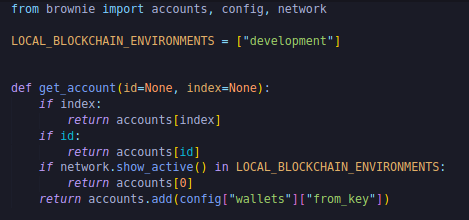

as well as our brownie-config.yaml

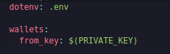

and we can import the get_account function in our deploy scripts. We need to deploy our contract.

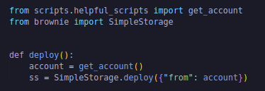

After we deploy our contract, we can do:

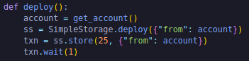

So we've got the transaction. This transaction has a whole bunch of stuff.So let's print it and run the script on a development chain.

`brownie run scripts/deploy.py`

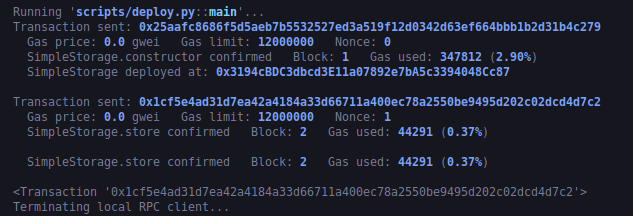

We get the transaction object.This transaction has all the events in it.So we could print the events.

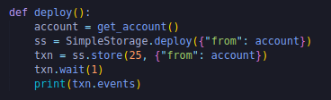 

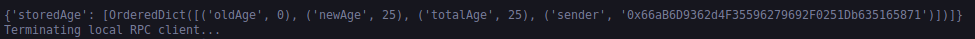

oldAge and newAge are the indexed parameters or the topics, and the totalAge and the sender are going to be non-indexed. We can read them here because we've got the ABI. We've got the contract code and we know what totalAge and sender are called. If we didn't have the contract code, non-indexed would show up as mumbled garbage. Since there's only one event, we could even do:

`print(txn.events[0]["newAge"])`

Let's deploy this to etherscan and see what it looks like on etherscan because working with the etherscan events and understanding how those events work and what they look like on etherscan is really important too.So in our config:

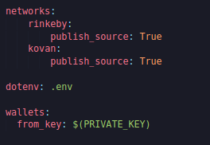

Let's verify the contract.

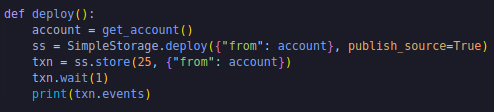

Put the etherscan API key in your .env file.

`brownie run scripts/deploy.py --network kovan`

If you get an error like:

`"Non-hexadecimal digit found"`

Then, in your configuration, make the following change:

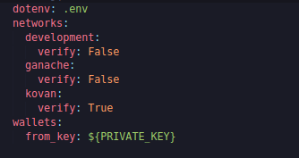

So we've deployed and verified this.Let's go take a look at this on-chain.In our Kovan etherscan of that contract that we just deployed and verified.If we go to the transaction and its log, we can see its event.

The topic 0 is always going to be the whole signature of the event.

## Multicall?

So to do anything on a blockchain, you've got to send a request to the blockchain node or an external third party like alchemy or infura. Whether you're deploying a contract, calling a function, or apping into the new avalanche pool on the aave protocol, you've got to make some type of API call to some type of blockchain node. Now if you're running your own node, you can sort of have at it right.You can make as many API calls as you like, but if you're using a third-party external blockchain node, then you might get rate limited, bump up your subscription, or wait way too long for all your calls to return.

For example, if I wanted to call 50 different view functions, I'd have to make 50 API calls. In this course, we're going to learn how to use multicall to combine all of our read calls into a single API call to one of our nodes.

Now, if we want to read data off the blockchain, the simplest way we can do that is just with single requests for every piece of data we want to read. For example, if I wanted to read the latest price of a chainlink pricefeed, I could make an API call to a blockchain saying, "Hey, get me that latest pricefeed." And if I wanted to do that across many pricefeeds, I would just make several API calls across several pricefeeds.

The actual request that's being made behind the scenes looks something like this:

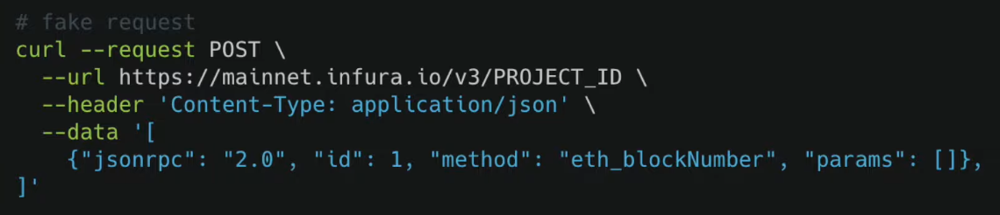

**Batch Requests**

Now one step better is doing what's called "batching your requests." So you can actually batch your API call requests into a single API call.

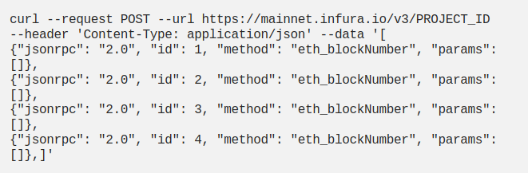

This means it's the blockchain node that has to kind of parse and go through all these requests, queue them, and figure all that stuff out.

Now you think, "Let's just do everything like this." Well, in practice, we found out that these batching requests can be a little bit tricky for the nodes to actually work with, and some services don't even offer functionality for this. So maybe your external provider doesn't even offer batching requests, and if you make too many batch requests, your call could infinitely hang. So the most effective way to read a ton of data off the blockchain is by using what's called `multi-call`.

Multi-call goes back to making a single read request on-chain but calling a very specific on-chain.It makes a single request to a specific contract that has multi-call functionality. For the demo, we're going to be using the uniswap multi-call contract and the function that we're going to be calling is the function called "tryAggregate."

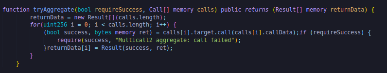

As input parameters, it actually takes a call array. This is an array of contract calls for us to make.So we input an address and the function that we want to call, and this single function call will loop through our list and return it to us. We're actually making one function call to this function with just all of our calls as input parameters to this function call, and it's more efficient and saves us API calls.

So let's look into actually using this though, where we'll call the last 50 rounds of a chainlink pricefeed update, which normally would be a little bit tricky to get in a single API call.

Create a directory called "multicall" and open it in VSCode. After that, do `brownie init`.We're going to be creating a script called "multicall.py" and this is going to be our ground zero.

What do we want to do?

Well, we want to call the last 50 rounds in a chainlink pricefeed in 1 call.

So let's go ahead and get this started.The first thing we want to do is get the price feed contract.

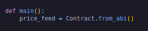

This is how we define a new contract and the from_abi. We need to give it a name, an address of the price feed([mainnet](https://docs.chain.link/docs/ethereum-addresses/) and the abi([AggregatorV3Interface](https://github.com/smartcontractkit/chainlink/blob/develop/contracts/src/v0.8/interfaces/AggregatorV3Interface.sol))).We did ABIs by using the interface instead of getting the ABI from json. 

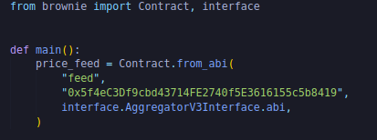

Since we want the last 50 updates, let's go ahead and get the latest round first.

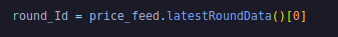

Now here's where the magic really happens.So this is where we're going to do the multi-calling and in our multi-call we've got to pass that [multi-call contract address](https://docs.uniswap.org/protocol/reference/deployments).

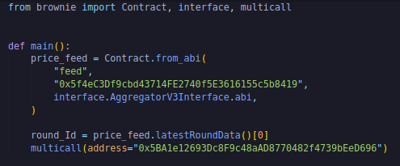

Now that we've defined the address that we want to work with, we can do it with multicall. We can loop through all these rounds and, on one call, we can get the last 50 round updates.

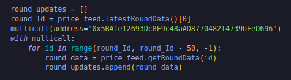

So we're looping through round_Id, going back one round at a time (that's why -1 is used in the loop) and all the way to 50 rounds ago, and we're just adding round_data to our round_updates array.

So in order to do this, you, of course, need your Infura key for this. So in your .env file, export your private key and your infura project id, and in your config add .env then run:

`brownie run scripts/multicall.py --network mainnet`

If you get an error like this:

`Unable to expand environment variables in the host setting:`

Add your Infura project id and private key in .env and add .env in config.

It gives us a massive response from a single API call.

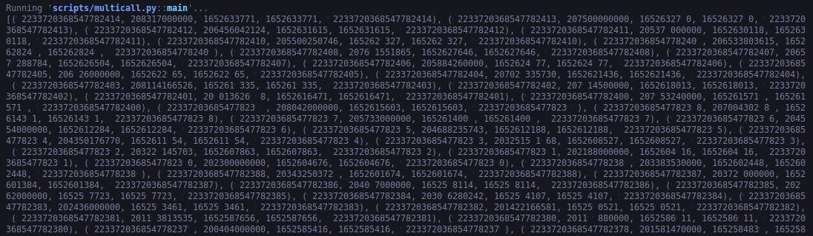

This by itself isn't that cool.Let's make this a little cooler.We're going to create a new file inside scripts called "multicall_plot.py".In this script we're going to do the same thing.We're going to call the last 50 rounds of chainlink pricefeed in one call and then plot it. Copy and paste the entire code into the multicall_plot file.We're going to make a couple of modifications to this code. We're going to turn the output of rounds into a graph so we can actually basically visualize it for our own UI purposes or pythonic purposes.

So all we're going to do is in our multicall, we're going to do more stuff.

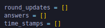

So we're going to plot the answers on the y-axis and the timestamps on the x-axis.

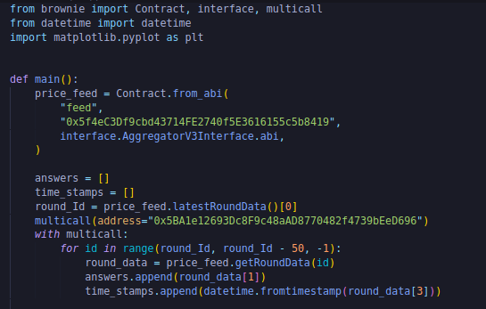

We're going to use "matplotlib".Since I've installed brownie with pipx, I can't just do pip install matplotlib.Since I installed it with pipx, this means brownie's running in its own virtual environment. So I need to inject matplotlib into the eth-brownie virtual environment.

`pipx inject eth-brownie matplotlib`

You might have to restart your terminal after that.Once we've injected it, we can import it:

`import matplotlib.pyplot as plt`

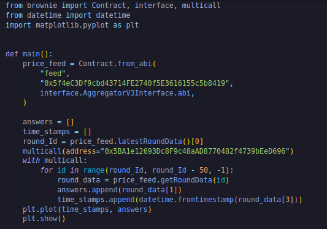

Now we can do:

`brownie run scripts/multicall_plot.py --network mainnet`

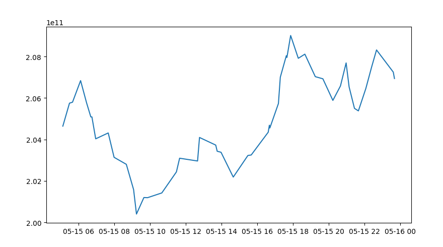

