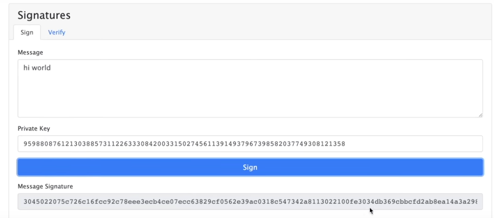
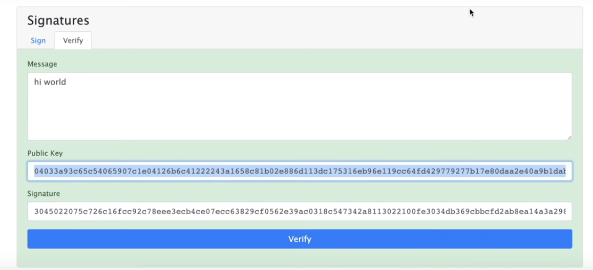

## **Signing and Verifying a Transaction**

We're going to talk about signing the transactions, private keys and some other cryptography bacause in the blockchain below we see fantastc transactions but how do we know that it was Darcy who was the one to send 25 dollars to Bingley.How do we know that actually happened?This is where all those pieces that we just learned about in our test net in our metamask account are really going to come to life .

**Public & Private Keys**

Here we've an example of public and private keys.

Private key: Only Known to the Key holder, it's used to "sign" transactions.
    
You really wanna keep secret because you're going to be using this as a kind of your secret password for all the transactions .

I can really pick any private key I want with this `Elliptic Curve Digital Signature Algorithm` for ethereum and bitcoin they both use this elliptic curve digital signature algorithm.It's a variant of the digital signature algorithm and It's going to create it's public key.

That public key we want everybody to have access to right.Whole world can see this public key.

We're going to use the private key as like a password to quote/unquote digitally signed transaction and then people can verify them with this public key.

Let's see what this actually look likes

**Signatures**

If we go to signatures tab and let's say we have this message that we want let's say "hi world"

What's going to happen is the private key that we created, we can use to sign this data(hi world).We're using digital signature algorithm to create this message signature.

What's really powerful about how this algorithm works is that you can create this message signature with your private key but somebody else can't derive your private key from the message signature.This is what makes this really really powerful.

However if we go to verify using our public key, anybody can verify that the signature is yours.

**Transactions**

If somebody try to fake a transaction, they need to verify their's signature against my public key and very easily it turns red cause it's not verified.

We can take that into transactions into exact same way.

If I wanna send 20 dollars from my account to another account using my private key, I can sign that transactions and anybody else in the world could verify the transactions.This is why people say to protect your keys.

Your Ethereum address is actually a piece of your public key.To get our address to ethereum all we have to do is take this public key we've created with our private key, hash it using that same ethereum hashing algorithm and take the last 20 bytes and that's how we'll actually derive to our address.

Knowing the exact methodology of how to get the address doesn't really matter because it could change blockchain to blockchain but just know that's essentially how kind of these addresses are derived.

Note : This isn't how we send the transaction.So this is just going to sign it, create a transaction for us to send.We'll learn later on how to send these transactions.

## **Concepts are same**

Now we know all the cryptography pieces and all the little nitty grittes of how the blockchain actually works and how our signatures work and how everything sticks together.Let's talk a little bit about how this works in actuality and what's really going on.

For alot of this each different blockchain has slightly different algorithms, metrics and criteria for doing alot of this stuff.So when we're talking about specific implementations keep in mind the exact algorithm might be little different but the concepts are all still gonna be exactly the same.Hashing and hash function is going to be same no matter where you look.A decentralized blockchain is going to be same no matter where you look.How it's actually implemented is a little bit different.

Traditionally when you run an application you know be it as a website or something that connects to some server, you're interacting with a centralized entity and unlike how we saw with the blockchain with multiple different peers.It's going to be run by a single centralized group.It still could be run on many different servers but all those servers are still going to be controlled by the same centralized group.Blockchain as we saw run on a network of independent nodes.When we saw peerA, peerB, peerc and more, those were different examples of different independent users running the blockchain technology on their node.

**Node**

Node here means single instance of a decentralized system.When I say single node,when I'm talking about a blockchain, talking about one of those peerA's peerB's and so on running that blockhain software.I'm talking about one server running this technology and again it's the network it's this combination of these nodes interacting with eachother that creates this entire blockchain.What makes these so potent too is that anybody can join the network and that's why they're decentralized.The barrier to entry is a little bit of hardware requirements.Anybody can join these networks and participate and that's what make it truly decentralized.In fact you can go to github right now and run your ethereum node in a few seconds.

**Centralized entity vs  Decentralized Blockchain**

In the traditional world applications are run by centralized entities and if that entity goes down or is maliciously bribed or decides they wanna shut off they just can because they're the ones that control everything.

Blockchain by contrast don't have this problem.If one node or one entity that runs several nodes goes down since there're so many independent nodes running that it doesn't matter.The blockchain and the system will persist so long as there is atleast one node always running.Luckily for us most of the popular chains like bitcoin and ethereum have thousands and thousands of nodes.As we've showed in our demo if one nodes acts maliciously, all the other nodes will ignore that node and kick that out or even punish it in some systems because they can easily check everybody else's node and see this one is out of sync with the majority and yes majority rules when it comes to blockchain.

**Transactions are Listed**

Each blockchain keeps a full list of every transaction and interaction that's happened on that blockchain and we saw if a node tries to act maliciously then all their hashes are going to be way out of whack and they're not going to match anybody else.This gives the blockchain incredibly potent immutabilty trait where nothing can be changed or corrupted.

So in essence we can think of a blockchain as a decentralized database and with ethereum it has an extra additional feature where it also can do computation in a decentralized manner.

**Consensus**

When we went through that blockchain example and we did that mining feature this is what's known as `proof of work`.Proof of work and proof of stake fall under the umbrella of consensus amd consensus is a really important topic when it comes to blockchain.

Consensus is defines as the mechanism used to reach an agreement on the state or a single value on the blockchain especially in a decentralized system.I briefly alluded to this consensus mechanism in our blockchain example when I said if one changes something and the other two don't then majority will rule and kick that one out.This is part of that concensus mechanism.

Now very roughly a consensus protocol in a blockchain can be broken down into two pieces.
- `Chain Selection Algorithm`
- `Sybil Resistance mechanism` 

**Proof of Work/Sybil resistance mechanism**

That mining piece we're doing or the proof of work algorithm is what's known as a sybil resistance mechanism and this is what ethereum and bitcoin currently use.Proof of work is known as a sybil resistance mechanism because it defines a way to figure out who is the block author: which node is going to be the node who did the work to find that mine and be the author of the block so all the other nodes could verify that it's accurate.

### **Sybil Resistance**

Sybil Resistance is a blockchain's ability to defend against users creating a large number of pseudo-anonymous identities to gain a disproportionately advantageous influence over said system and in laymen's term it's basically a way for blockchain to defend aganst somebody making a fake nodes so that they can get more and more rewards.

There are two types of sybil resistance that we're gonna talk about here namely POW (Proof of Work) and POS (Proof of Stake).

### **POW**

In POW this is sybil resistant because a single node has to go through a very computationally expensive process called mining which we demonstrated earlier to figure out the answer to the blockchain's riddle of finding that correct nonce.

In POW this works because no matter how many pseudo-anonymous accounts you make each one still has to undergo this very computationally expensive activity of finding the answer to the proof-of-work problem which again in our demonstration it was finding a nonce with that first four zeros but each blockchain might change the riddle or change the problem to be little bit different.

**Blocktime**

In fact some of these blockchain make this riddle intentionally hard or intentionally easy to change what's called block time.The block time is how long it takes between blocks being published and it's proportional to how hard these algorithms are.So these problems can actually change depending on how long they want the block time to be.

If the system want the block time to be very very long they just make the problem very very hard and viceversa.We'll ralk about civil attacks in a little bit and how they can affect the system but with proof of work it's a verifiable way to figure out who the block author is and be civil resistant.

**Chain selection rule**

Now you need to combine this with the chain selection rule create this consensus.There are some consensus protocols that have more features but very very roughly there are two pieces that we're going to look at.The second piece is going to be chain selection rule.How do we know which blockchain is actually the real blockchain and the true blockchain?

**Nakamoto consensus**

On Bitcoin and Ethereum they both use a form of consensus called `Nakamoto Consensus` and this is a combination of POW and longest chain rule.The decentralized network decides that whichever blockchain has the longest chain or the most number of blocks on it is going to be the chain that they use.This makes lot of sense because every additional block that a chain is behind it's going to take more and more computation for it to come up.That's why we saw on our transaction we actually saw confirmations.

**Block Confirmations**

The number of confirmations is the number of additional blocks added on after our transaction went through in a block.So if we see confirmations is two it it means the block that our transactions was in has two blocks ahead of it in the longest chain.Now I do wanna point out that a lot of people use POW as a consensus protocol and I do wanna say that this is a little bit inaccurate but sometimes people use it interchangeably.POW is a piece of overall consensus protocol which in bitcoin and ethereum  one's current case is nakamoto consensus.

**Block rewards & transaction fees**

`This has recently changed as of EIP 1559`.
POW also tells us where these transaction fees and these block rewards go to.Remember how we made this transaction we had to talk about gas and a transaction fee.So who's getting paid? Who's getting this transaction and this transaction fee is going to the miners or validators?

In a POW network they're called miners and in POS they're called validators.There are little bit different and we'll get into that when we talk about POS.

In this POW system all these nodes are competing against eachother to find the answer to the blockchain riddle.Remember in our example it has to find hash that has four zeros at the start and again depending on the blockchain implementation that riddle is going to be a little bit different.

But all the nodes are trying as many as possible to try to get this answer first why because the first node to figure out the answer to the blockchain rule is going to get that transaction fee.They're going to get paid from that.

When a node get's paid they actually gets paid in two different ways.One is going to be with a transaction fee and another piece is going to be the block reward.

 - **Transaction fees**

Remember we talked about alternating the gas price that's the transaction fee that we're gonna pay to these blockchain nodes for including our transaction.The block reward is given to the nodes from the protocol from the blockchain itself.

 - **Block Reward**

You've probably heard of the bitcoin halving before.The halving is referring to this block reward getting cut in half and it's supposed to be cut in half roughly every four years.This block reward increases the circulation amount of whatever cryptocurrency that is being rewarded.For example on ethereum the block reward is giving out ethereum and on bitcoin it's giving out bitcoin.

So these nodes are competing against eachother to be the first one to find this transaction to be the first one to find the answer to this problem so that they can be the ones to win both this block reward and your transaction fee.Some blockchain like bitcoin for example has a set time when they're no longer going to give out block rewards and the mminers or the nodes are only going to get paid from transaction fees.

Gas fees are paid by whoever initialized the transaction.When we got our funds from the faucet there were some server and somebody else was paying the transaction fee for us.However we send ether from one account to another our first account actually paid some transaction fee to send that ether.

In POS there's also a gas fee but it's paid out to validators instead of miners and we'll talk about that in a little bit.

Now let's talk about two types of attack that can happen in this blockchain worlds.

**Sybil attack**

The Sybil Attack is when a user creates a whole bunch of pseudo-anonymous accounts to try to influence a network.Now obviously on bitcoin and ethereum this is really really difficult because the user needs to do all these work in POW or have a ton of collateral in proof of stake which again we'll talk about in a little bit.

**51% attack**

As we saw as part of our consensus protocol these blockchains are going to agree that the longest chain is the one that they're going to go with so long as it matches up with 51% of the rest of the network.This means that if you have the longest chain and you've more than 51% of the rest of the network you can do whats called a fork in the network and bring in the network onto your now longest chain.

Sybil attacks obviously are when a single node or a single entity tries to affect the decentrality of the network by pretending to be multiple different people although they're just the same person or entity and like I said it's really difficult to do in POW and POS.

### Longest Chain Rule

Now you can see that blockchains are very democratic.Whichever blockchain has the most buy-in and is the longest is the blockchain that the whole system is going to corroborate.When nodes produce a new block and add to the longest chain the other nodes will follow this longest chain that the rest of the network is agreeing with add those blocks to their chain and follow up.So very small reorganizations are actually pretty common when a blockchain picks a block from a different longest chain puts it on and then has to swap it out for another block and continue with the different blockchain.

However if a group of nodes had enough nodes or enough power they could essentially be 51% of the network and influence the network in whatever direction they wanted.This is what known as 51% attack.This happened on blockchains like Ethereum Classic which is not Ethereum.This is why the bigger a blockchain is the more decentralized and the more secure it becomes.

**Drawbacks of pow**

POW is fantastic because it allows us to very easily protect against these sybil attacks and keep our blockchains decentralized and secure.However it has some drawbacks as well.POW costs a lot of electricity because every single node is running aa fast as they can to win this race to get the rewards.This leads to obviously an environmental impact.Since POW and Nakamoto Consensus a lot of other protocols have taken this idea and gone in a different direction with a different sybil resistance protocol.Alot of them with the intention to be alot more environmentally friendly and the most popular one rn is POS.

**proof of stake/sybil resistance mechanism**

There are some chains that are already using this Proof of Stake protocol and that are live and thriving.Some of them are like `avalanche`, `solana`, `polygon`, `polkadot` and `terra` and additionally ethereum has decided to upgrade to eth2 which will have this proof of stake algorithm as well.

It's a different sybil resistant mechanism instead of solving this difficult problem POS nodes put up some collateral that they're going to behave honestly aka they stake.In the example of ethereum 2 nodes put up some ethereum as a stake they're going to behave honestly in the network.

If they misbehave to the network they're going to be slashed or removed some of their stake.Obviously this is a very good sybil resistance mechanism because if you try to create a whole bunch of anonymous accounts then each one of those accounts you have to put up some stake and if you misbehave you're going to run the risk of loosing all the money that you put up as collateral.

**Validators**

In POS miners are actually called `validators` because they're no longer mining anything.They're actually just validating other nodes.Unlike POW which every node is racing to be the first one to find the block in POS nodes are randomly chosen to propose the new block and then the rest of the validators will validate if that node has porposed the block honestly.

As you saw with our cryptography lesson it's usually very easy for other nodes to verify if a proposal or a transaction is honest.

### Randomness

It's a really important topic when we're talking about blockchains because keep in mind these blockchains are deterministics systems.They're walled garded from the rest of the world and as you know a deterministic system by definition can't have random numbers.So how do we choose the random validators in the system?

Well it changes from blockchain to blockchain and actually choosing the node will change blockchain to blockchain but in eth2 they're using what's called randow at least for the original implementation.This is a decentralized autonomous organization that collectively chooses the random number and collectively chooses which node is going to run next.

**pros & cons of pos**

POS obviously has some pros and cons as well.

Pros are that again it's a great sybil resistance mechanism and a great way to figure out who the author of a block should be and the other pros are that it's way less computationally expensive to figure out new block because instead of every single node on the network trying to do this only one node needs to do this and the rest of the nodes just need to be validate.

Cons are that it's usually considered a slightly less descentralized network due to the upfront staking costs, it costs to participate.This gets into a little bit of a philosophical battle on how decentralized is decentralized enough and I think it's upto the community to decide and as we progress I think we'll learn more and more about how decentralized is decentralized enough.The general consensus among blockchain engineers though is that POS is very very decentralized and very secure.This massive environmental impact improvement is one of the two main reasons why eth is shifting to eth2.It reduces the environment impact by upto 99%.

**Scalability problem & Sharding solution**

- Scalability

When we're talking about gas prices we're saying that the gas prices can get really high if a lot of people want to send a transaction because a block only has so much block space and the nodes can only add so many transactions.So when alot of people wanna use blockchain the gas price skyrockets.This is not very scalable because we wanna add more and more people to these blockchains it's going to cost more and more to use the blockchains because more people are going to want to get into blocks.This means that there's kind of a ceiling to how many people can use the system because of the financial constraints will get imposed as gas prices keep rising. Eth2 is not only attacking the environmental impact of POW by switching to POS but they're also implementing this new methodology called `Sharding`.

- Sharding

Sharding is a solution to this scalability problem.A sharding blockchain really just means that it's going to be a blockchain of blockchains.There's a main chain that's going to coordinate  everything amongst several chains that hook into this main chain.This means that there's more chains for people to make transactions on effectively increasing the amount of blockspace that there is.Sharding can greatly increase the number of transactions on a blockchain layer1.There's another term that might be the first time you've heard it's a layer1.

**Layer 1 & Layer 2**

Layerr1 refers to any base layer blockchain implementation.Bitcoin's,Ethereum and Avalanche a layer1.These are base layer blockchain solutions.

A layer2 is any application that is added on top of layer1;added on top of blockchain.Some examples of layer2 are going to be chainlink, arbitrum or optimism.Arbitrum and optimism are very interesting because they're layer2s that also look to solve the scalability issue.They are known as `Rollups`.

**Rollups**

Arbitrum and Optimism roll up their transaction into a layer1 like ethereum.We're not gonna go to deep into rollups and how they actually work but all you really need to know is that a rollup is kind of like a `shraded chain`.They derive their security from the base layer from the layer1 like ethereum and they bulk send their transactions onto the layer1.They solve some of the scalability issues by being another blockchain that people can make transactions on still on kind of base ethereum layer.Now they're different from `side chains` because side chains derive their security from their own protocols.Rollups derive their security from the base layers.So arbitrum and optisium for example is going to be just about as secure as ethereum.

**Summary**

- BTC and ETH are both Proof-of-Work blockchains that follow Nakamoto Consensus.
- ETH2 will be a Proof-of-Stake shraded blockchain.
- Sybil attacks are prevented due to protocols like POW & POS.
- 51% attack grows increasingly harder with the size of blockchain.
- Consensus is how blockchains decide what the state of the chain is.
- Sharding and rollups are solution to scalability issues on layer1's.
- A layer1 is any base blockchain implementation like bitcoin or ethereum.
- A blockchain scalability problem is that there's not enough block space for the amount of transactions that want to get in them which leads to very high gas price.
- Gas prices are how much it costs to interact with a blockchain.
