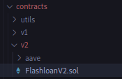
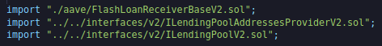
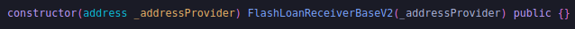
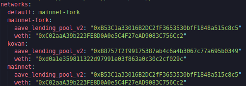
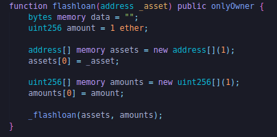
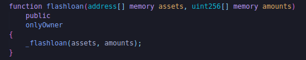
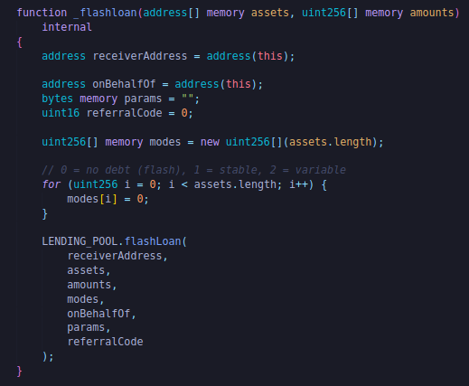
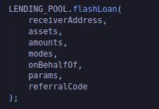
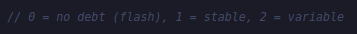
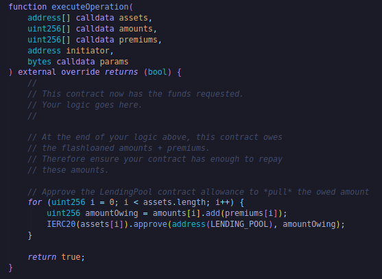

## Flash Loans

We must remember that these are simply tools that, when used correctly, can actually do more good than harm.If your protocol is susceptible to flash loan attacks, it's really your protocol's fault in the first place. Using flash loans can actually do a lot of fantastic things, such as leveraged arbitrage or swapping collateral out of loan positions without having to repay the debt of the loan positions.

Traditionally, when you look at a loan or you do some type of loan, the simplest way to talk about a loan is to actually put down some collateral. If I want a loan, I've got some collateral, maybe a house or land. I can say, "I really need to lend money." I'll put down my land as collateral if you give me the money. " The lender inspects the land, and if everything is great, he lends me the money. Now that I've put land as collateral, I clearly don't want to lose my house. Typically, the loan money given to me is less valuable than my home, so if I do not repay, the lender will repossess my home. This is known as `over collateralized lending`.Now that I've lent money, I can do whatever I want. One of those things I can do is what's called `arbitrage`.

Let's say we have two exchanges. One says ETH is $50 and the other says $100. An easy way for me to make money is to do arbitrage.I take my borrowed money and buy a ton of ETH at a $50 price, and then I sell it at a $100 price. I've essentially just made $50 if I buy 1 ETH at $50 and sell that 1 ETH at $100.I've now just made $50.Now I can go back to my lender and give the loan money back, get my house back, and also have a $50 profit.

The issue is that sometimes you're broke as hell and you can't actually put down any cash. You don't have anything to put down. But if you see an arbitrage opportunity or a position where you know you need a lot of collateral quickly, wouldn't it be great if you put nothing down? That'd be great, but that thing doesn't exist outside of the blockchain world.

In the blockchain world, if you borrow money and repay it in the exact same transaction, Ethereum and lending protocols go, "Yep, looks good to me." In a flash loan, I borrow money, use that money to buy ETH, sell that ETH for a nice profit, and return the money all in the exact same transaction. Ethereum allows this to happen because in that same transaction, Ethereum knows and can test in code whether or not you can pay back that money in the exact same transaction. Often times, the lenders have a really small premium or a really small fee for borrowing that in the first place. They're happy because they're getting paid either way. This is clearly a really powerful tool that we can use. We can borrow something with almost no money.You have got to pay a little bit of the premium and also gas fees.

**Doing Programatically*

To get started here, we could do:

`brownie bake aave-flashloan-mix`

We're going to be working with V2 of the AAVE flash loans because V2 is better.

This is the contract that actually interacts with the AAVE protocol.

We've got to grab a couple of imports.

We've got to grab the FlashLoanReceiverBase, ILendingPoolAddressesProvider, and ILendingPool. The last two imports are interfaces for the lending pool.These are the pools in AAVE that say, "Hey, we're the lenders. We'll give out the collateral or flash loan. " We also import FlashLoanReceiver contracts to make our contracts flash loan contracts.

So in our constructor when we get setup, all we gotta do is give the address of the address provider, which is going to be the ILendingPoolAddressProvider.

You can check the address in your config file.

This is the main bit we need to do.

Now when we make flash loans, we have to write functionality for making the loans, getting the funds, and then repaying the funds in the specific function that they call.

We've got a function called "flashloan."

It will take the address of some asset, which will be an ERC20 asset. It's going to ask for 1 ETH worth of the asset (amount). It's 1 chainlink or wrapped ether or anything, but we're going to be working with wrapped ether. We're going to be flash lending 1 ETH.

In one transaction, we can actually flash loan a whole bunch of different tokens. So we added that to the array of tokens (assets). Once we decide, "We want WETH," we'll add the WETH address to the list of assets and we'll add the amount to the list of amounts. The 0th position of an asset matches with the 0th position of amounts. If we put in the wrapped eth address first and the amount of 1 ether first, we're saying "We want to borrow 1 ether from the AAVE loan contract" and then we'll call the flash loan function.

which all it really does is call another flash loan function with the two arrays that we created.This flashloan function is the main function that we're going to be working with.

Basically, it just grabs all the parameters together so that we can call `LENDING_POOL.flashLoan`.LENDING_POOL is going to be the address that we gave it. This is the function that it can call. It's actually imported.

This is the main function of the flash loan. We've got the receiver address, which for our contract is this contract (using this keyword): we want to get the ETH into this contract. Assets is the list of assets, which for us is going to be 1 WETH. Amounts again is just going to be 1 WETH. Modes are the ways to actually change between a no flash loan and a regular loan on a protocol.

onBehalfOf is also going to be this address, and don't worry about params and referralCode.

This is the main function that gets called.We're going to call this, and if we can, it's going to go ahead and give us 1 WETH.

How does it know we can actually call this?Well, it's going to check to see if it can call the executeOperation function and get its money back.

The LendingPool is actually going to call the executeOperation function. So we need to actually approve the token transfer back to the lending pool so we can actually repay when it calls. This is also the logic we can add to do the rest of our functionality, and yes, we're paying the gas even though lendingPool actually executes it.

Now once it's done, done all your logic, you need to approve LendingPool to get the tokens back because the lending contract is actually going to call transferFrom and try to get the funds back and if it can't it's going to null out everything you're going to do.

You do need to set Infura project ID and Private key set up in your .env file.Once you've done all that, we're actually going to work with Kovan testnet so that we can really see what a transaction looks like on Kovan.

