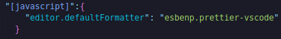
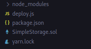
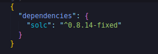
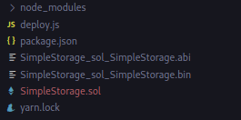
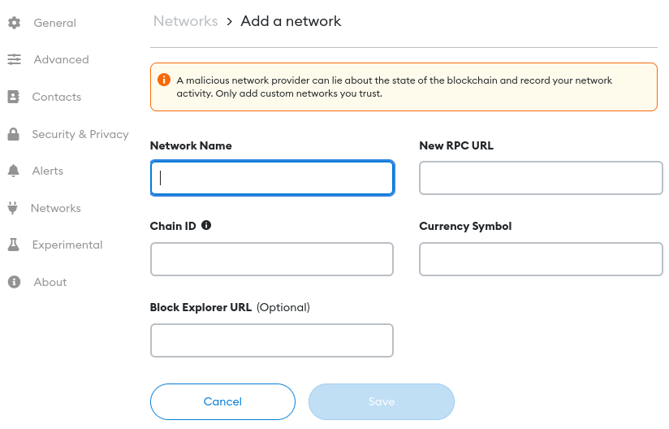
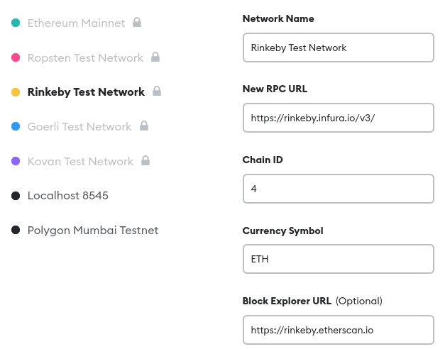
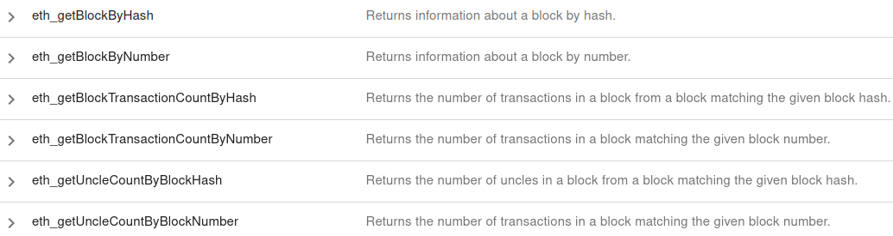
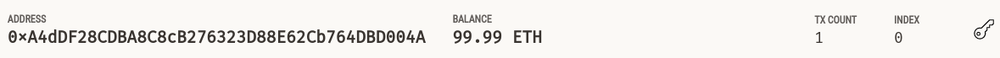
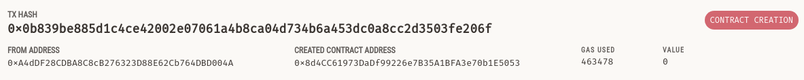

## Ethers.js Simple Storage

Before we can actually learn `HardHat`, we've to learn `Ethers.js` which is a javascript based library for working with smart contracts and it also powers Hardhat.Under the hood of hardhat, there's lot of ethers.js.So it's important for us to learn Ethers.js so that we can understand what hardhat is actually doing.

**Installation**

Once you've VS code installed, the next thing that we're going to install is going to be [node js](https://nodejs.org/en/download/).

`sudo apt install nodejs`

next we're going to install git

`sudo apt install git-all`

Now we're going to start working with ethers and start learning to code our transactions and our contract deployment everything programmatically at a relatively low level.We're going to learn how to deploy and interact with the contract using the `ethers.js` package.

Now let's create a folder where we put all our contracts.

`mkdir ethers-simple-storage`

to go inside the folder

`cd ethers-simple-storage/`

We can create a new file called "SimpleStorage.sol".Change the verion to 0.8.0.

Let's also add our default formatter for our JavaScript code.Let's create our new file called "deploy.js".

Install `prettier` extension in VS code and then open settings.json



which will format our JS code when we hit save.

We got our JS formatter as well.Let's start writing some JavaScript code.


**Tiny JavaScript Refresher**

Now that we've our solidity code, it's time for us to actually learn how to deploy our contract using JavaScript.This is going to teach us lot about transaction and what's going on under the hood and even what's going on under the hood in remix.In remix we just hit compile button and then hit a deploy button and that's really it.In JavaScript we're actually going to create our own functions that are going to help us do both of those.

Let's set up our deploy.js script to actually deploy our SimpleStorage.sol.

Well first let's learn how to run a script using JavaScript and nodeJS.

If you want to do printline or print something to your terminal, you could do

```javascript
console.log("hello world!");
```

and open your terminal and run 

`node deploy.js`

and it'll print out hello world!.

`node` is how we say we wanna run JavaScript code using nodeJS.Other language you might be familar with use something like `python deploy.py`.Since the frontend and backend JavaScript are different, we run code on the backend with node.

With JavaScript you could do lots of thing that you could see in solidity.For creating variable:

```javascript
let x = 10;
```

This is kind of similar in solidity like

```solidity
uint256 x = 5;
```

But in JS we use let or var or const.

and then I can print the code:

```javascript
console.log(x);
```

JavaScript is optional on whether or not you wanna have semicolon`;`.

JavaScript automtically starts with whatever code you've at the top of your file.

```javascript
console.log("hello world!");
let x = 10;
console.log(x);
```

It does console.log first then x and again console.log.However a good practice is to actually wrap everything you wanna do in a main function and then run that main function.

```javascript
function main() {
  console.log("hello world!");

  let x = 10;
  console.log(x);
}

main();
```

Now this is going to be the setup for most for our scripts moving forward including the scripts that we write when we get to hardhat.However there's going to be one major difference.Instead of regular function we're actually going to use `async function` and we're going to do `asynchronous programming` to do this.

```javascript
async function main() {
  console.log("hello world!");

  let x = 10;
  console.log(x);
}

main();
```

**Asynchronous programming in JavaScript**

So far the programming that we've done is synchronous and solidity is an example of programming language that is synchronous.Synchronous means it's just goes one line after another.On our code without async keyword, main function is the first thing that gets to called then we do console.log, x=5 and console.log again.This is synchronous programming in JavaScript.All of our solidity is synchronously programmed.There will be some exceptions to this when working with oracles but for now everything is synchronous.

JavaScript can be asynchronous meaning that we can actually have code running at the same time.Good example to understand the difference is cooking.In synchronous programming :

```javascript
// Synchronous 
// 1. Put popcorn in microwave
// 2. Wait for popcorn to finish
// 3. Pour drinks for everyone
```

This is synchronous programming.

Now it might be little bit weird for you just to put the popcorn in the microwave and then stare at it waiting for it to finish and then pour the drinks.You typically can pour the drinks while your popcorn is in the microwave.This is where asynchronous programming comes in.

```javascript
// Asynchronous 
// 1. Put popcorn in microwave
// 2. Pour drinks for everyone
// 3. Wait for popcorn to finish
```

So asynchronous programming is a way for us to do stuff without waiting around for things to finish and this is really advantageous.In JavaScript by default allows us to do asynchronous programming.However sometimes we do wanna wait for our popcorn to finish.For example instead of just pouring drinks, next thing was `place salt on popcorn`. Of course if we wanna place salt on our popcorn, we do have to wait for our popcorn to get out of the microwave.Eventhough popcorn in the microwave has wait time, we need to be able to tell our code "I want to actually wait for". 

Functions that comes with waiting period returns something called a `promise`.If put popcorn in the microwave was a function in JavaScript, it'd be a promise based function.A promise can either be either
- Pending
- Fulfilled
- Rejected

This is how we know our popcorn is done.Putting popcorn in microwave was a function, when we're waiting for the popcorn to finish, it's in a pending state.When the popcorn is finished, it'd be fulfilled and if we aborted halfway through and stopped waiting, it'd be rejected.Putting the popcorn in the microwave returns a promise.With the promise we've to tell our code to wait for the popcorn to finish or you can go ahead and keep doing stuff.

Let's put all this together with JavaScript syntax.We're setting up for movie night.

```javascript
// Cook popcorn
// Pour Drinks
// Start Movie
```

let's write some pseudo code to pretend what this code will look like if this was actually a function.

```javascript
function setUpMovieNight() {
  cookPopCorn();
  pourDrinks();
}
```

Now here's the thing.We only wanna start the movie, once our popcorn has been cooked and drinks have been poured.If either one of the function retun the promise like cookPopCorn for example:

```javascript
function cookPopCorn() {
  // some code here
  return Promise(/* some code here */);
}
```

we need to tell our code above to actually wait for the popcorn to finish because cookPopCorn is going to be a function where we can say:

```javascript
  let status = cookPopCorn();
```

While the popcorn is being cooked, the status is going to be pending.Once the popcorn gets cooked, it'll be fulfilled and if the microwave breaks, the status would be rejected.But we don't want status to be in a pending situation before we move on.We only wanna start our movie once these two functions have completed and say both of the function return promises thing.We need to tell our code to wait for cookPopCorn and pourDrinks to finish.

Without getting to deep into how this works, one of the easiest thing we can do is turn this function into async function.When our function are async, we could get access to keyword called `"await"`.The await keyword tells any promise based function to wait for that promise to be fulfilled or rejected.

```javascript
async function setUpMovieNight() {
  await cookPopCorn();
  await pourDrinks();
}
```

We're saying, "We want to wait for our popcorn to cook and also wait for to pour drinks."and then we can start the movie.We only start the movie here, once these two functions have been completed.

Most of the functions that we're going to be working are asynchronous.Example is when we deploy a contract,we've to wait for it to be deployed.If we don't use asynchronous programming, we wouldn't wait for our contract to get finished.Obviously if we don't wait for it to get deployed and we try to run some code on a contract that has finished deploying it, it's not going to work.So we want our main function to be an async function so that we can wait for our contracts to get deployed, wait for things to happen.We can have the flexibility to tell our code to either wait for popcorn to finish or continue on.

Now that we've our main function as a async function, we're going to add some code to the main function while calling it.The code that's added here is some syntax to work to async function and if this part if confusing,don't worry about it now.We'll try to understand it later.

```javascript
main()
  .then(() => process.exit(0))
  .catch((error) => {
    console.error(error);
    process.exit(1);
  });
```

Basically what this allows us to do is we've our main async function.So when we call the main function, extra code is other syntax for waiting for it to basically finish and printing any errors it get. 


Now we've our basic setup let's go ahead and start coding.

**Compiling our Solidity**

All of our code basically is going to be inside async main function which is going to be our main script for deploying our SimpleStorage.sol.Our deploy script is going to replicate exactly what goes in remix.In remix first thing that we always do is compile all of our code.So we're going to compile our code in JavaScript project as well.In order for us to compile our SimpleStorage contract, we're going to use tool called [`solc-js`](https://github.com/ethereum/solc-js).JavaScript has a way to install projects directly into our setups.

NPM is the package manager and we actually installed npm just by installing nodeJS.We can install it with npm but I like to install with `yarn` package manager.

`corepack enable`

after that you should be able to do:

`yarn --version`

Now that we've yarn, we can actually use yarn to install all of our projects instead of npm.Back in solc-js Github it says, "npm install solc", we can do the yarn equivalence of npm install solc which is going to be:

`yarn add solc`

If we click file explorer in VS code, we can see this added couple of different folders.



It first added package.json.Package.json is a file that tells us alot about our project and the dependencies it works with.



We've installed the solc package of 0.8.14.Our yarn.lock tells us the exact version of all the different packages of our project.The reason this is so important too because solc has a ton of dependencies as well.Yarn.lock tells us exactly what version of solc and all the different dependencies of solc in any other project that we add.

Final bit we get is node_modules where all the installed code that we just downloaded is.For example inside node_modules, we can see there's a solc folder and inside it, there's all the code associated with solc package that we just installed.

To add the specific version, we could do:

`yarn add solc@0.8.7-fixed`

Now that we've solc, we've the ability to actually compile our contracts.We can either compile them in our code and have it automatically run when we hit deploy or we could compile them seperately.

If you wanna go back after this section, there's a example in  [solc-js repository](https://github.com/ethereum/solc-js), that shows how to actually compile solc.We're actually going to compile them seperately using a solc-js command.The `yarn` command is both used to install dependencies and it can be used to run scripts.If you go to solc-js repo, you can see in order to use the command line you actually need to install it globally.If you want to install it globally, you can do:

`yarn global add solc@0.8.14-fixed`

However since we're inside of the folder "/ethers-simple-storage" which has the yarn.lock, package.json and node_modules, yarn will be smart enough to know that we're looking for solc in the folder.We can actually go ahead and compile our contract using yarn and solc-js.If you wanna see all the different commands solc-js allows, we can just run:

`yarn solcjs --help`

Now to actually compile SimpleStorage.sol, let's run the compilation command.

`yarn solcjs --bin --abi --include-path node_modules/ --base-path . -o . SimpleStorage.sol`

`--bin` cause we want the binary
`--abi` since we also want the abi
`--include-path node_modules/` Since we want to include any contracts or files in our node_module.We aren't using any for this project but in the future you'll need to include this.
`--base-path .` here . means base path is `ethers-simple-storage` folder
`-o .` is we want to output the compiled binary and abi to `ethers-simple-storage` folder
and finally SimpleStorage.sol which is the contract that we want to compile

You'll see two files get output.



Back in remix if you compile SimpleStorage.sol, you can actually look at `"Compilation Details"` like the `ABI` or the `BYTECODE`.

Now we've compiled our contracts here.We can add scripts section in package.json to shorten some yarn scripts for us.

```json
{
  "dependencies": {
    "solc": "^0.8.14-fixed"
  },
  "scripts":{
    "compile": "yarn solcjs --bin --abi --include-path node_modules/ --base-path . -o . SimpleStorage.sol"
  }
}
```

Now instead of typing that whole thing out, as long as we're in the same folder that our package.json is in, we can run:

`yarn compile`

which will run whole scripts for us without having us to type that whole thing.

Scripts are really useful way for us to make it easier for us to run long commands.

**Ganache & Networks**

Now that we've SimpleStorage.sol compiled, let's learn how we can actually deploy this thing.Remember in Remix we actually deployed to one of the two different places.we deployed it to either JavaScript VM or with our Injected Web3 with our metamask.Let's learn first to how to do the JavaScript VM and then we'll learn how to do Injected Web3.

So in order for us to actually deploy this to a JavaScript virtual environment or kind of fake blockchain, we're going to get fake blockchain.Now in the future, we're going to be using Hardhat runtime environment as a JavaScript VM but for this section we're going to be using [`ganache`](https://trufflesuite.com/ganache/).Ganache is similar to VM in remix.It's a fake blockchain that we can run locally to actually test deploy and run code.It's also a nice way to see things that're going in a blockchain.Let's go ahead and spin up the ganache application.Ganache application will look something like this:


and to spin up fake blockchain really quickly, you can just go ahead and click quick start.This will spin up fake blockchain that's running locally on your computer.It comes with whole bunch of fake accounts exactly like how remix comes with a ton of fake accounts with a 100 ether each.They also come with the private keys that we can use in our applications to actually take control of the fake accounts.

In our code one of the first thing that we're going to need to do is actually connect to our blockchain.Remix does this little bit behind the scene.If we're choosing JavaScript VM, remix chooses it's own fake blockchain that it runs.If we choose an Injected Web3, as we know metamask pops up and it connects to our metamask.This connection that remix does is actually doing something interesting.It's not just connecting to our metamask by some magical powers, it actually connecting to our metamask which has a connection to the blockchain behind the scene.

If you open up your metamask, and select add network, you'll get popped into the UI that looks like this:



If we select networks over here, we can actually see informtion about different networks.One of the main thing that we can see is all these networks have `RPC URL`.RPC stands for remote procedure call and the URL is uniform resource locator.



This RPC URL stands for connection to blockchain node that somebody is running.This URL connects us to make an API calls and to interact with a blockchain node.Blockchain nodes run with software and some of them exposed in an API call.IF you look at the [`go-etherum`](https://github.com/ethereum/go-ethereum), there're actually instructions for you to run own blockchain node or a real blockchain like ethereum.Most of these has flags like `--http.addr` to expose these RPC endpoints.So if you ever wanna run your own node, your own real blockchain node instead of using metamask or any of the providers that we're going to go through, you can use go-ethereum.

This RPC URL that allows us to connect to the Rinkeby and it's going to be the way that we're going to connect to our ganache blockchain that we're running inside of ganache applications.So if you look at the top of your ganache,


there's actually a `RPC Server` and this is the end point of our ganache node.Now that we've the end point hypothetically with just this we can start making an API calls to this endpoint.We can go to [`JSON-RPC Specification`](https://playground.open-rpc.org/?schemaUrl=https://raw.githubusercontent.com/ethereum/execution-apis/assembled-spec/openrpc.json&uiSchema%5BappBar%5D%5Bui:splitView%5D=false&uiSchema%5BappBar%5D%5Bui:input%5D=false&uiSchema%5BappBar%5D%5Bui:examplesDropdown%5D=false), we can actually see different calls we can make directly to our node to get different informations.



Making these API calls directly is little bit annoying to do ourselfs.IF you wanna do it, you ansolutely can using an API endpoint like axeious or fetch.However we're going to use a wrapper to interact with our node and do things like deploy and interact and other such thing with our blockchain.This is finally where ethers come into play.

**Introduction to Ethers.js**

[Ethers.js](https://docs.ethers.io/ethers.js/v3.0/html/) is one of the most popular JavaScript based tooling kit that allows us to interact with different blockchains and hazzle the wrapper that make all the API calls with Ethereum and any EVM compatible chain.The other incredibly popular that does the same thing is [`web3.js`](https://web3js.readthedocs.io/en/v1.7.3/).The reason that we're using Ethers.js is that Ethers.js is the main tool that powers the hardhat environment.

To install ethers we can just do:

`yarn add ethers`

Now in your package.json, you should see ethers.

```json
{
  "dependencies": {
    "ethers": "^5.6.8",
    "solc": "^0.8.14-fixed"
  },
  "scripts": {
    "compile": "yarn solcjs --bin --abi --include-path node_modules/ --base-path . -o . SimpleStorage.sol"
  }
}
```

Now back in our code we're going to import ethers into our deploy.js script so that we can use all the wonderful tools it comes with.

```javascript
const ethers = require("ethers");
```

Now that we've ethers in here we can create our provider object inside main function.The reason that we pulled ethers out of the main function is because we do wanna pull package into our scripts before we call main.We wanna make sure all the import is done first.`const` is a keyword similar to let.Const keyword makes so that ethers can't be changed.So we can change this ethers variable anytime we use const.Require is a function for us to import the ethers package.

Now remix does all this behind the scenes.The way we're going to do in our code is:

```javascript
async function main() {
  const provider = new ethers.providers.JsonRpcProvider(
    "http://127.0.0.1:7545"
  );
}
```

So this is the way that our script is going to connect to our local blockchain.Now let's get an actual wallet with a private key and a balance.we can see all of our wallets and balance in our Ganache.The way to get this setup is:

```javascript
const provider = new ethers.providers.JsonRpcProvider(
    "http://127.0.0.1:7545"
  );

  const wallet = new ethers.Wallet(
    "392368f795c9a96d274ab29d5ee48bf9cfb19ab8b31f4bd706f52d395d88187e",
    provider
  );
```

We can grab private key from Ganache if we hit key icon on the UI and copy the private key.

Now pasting your private key directly into your code a huge no no and we're going to learn how to avoid this in the future.It's okay right now because we're just using one of the ganache private key and you've no risk of having any money associated with this account.

These two lines alone give us everything that we need to interact with smart contract.They give us connection to the blockchain and they give us a wallet with a private key so we can sign different transactions.

Now that we've provider and wallet, let's go ahead and grab the contract object from the bin and abi file.In order to deploy the contract, we're going to need the ABI and the binary compiled code of the contract.So we're going to need to read from those two files.To read from this two files, we're going to use the package called "fs".So back on the top:

```javascript
const fs = require("fs-extra");
```

This `fs-extra` should come directly with your node project but if not you can do:

`yarn add fs-extra`

Now we can get the ABI and binary.

```javascript
const abi = fs.readFileSync("./SimpleStorage_sol_SimpleStorage.abi", "utf8");
```

readFileSync because we're going to synchronouly read from this file.We could do asynchronously but we want to wait for the file to get done.

```javascript
const binary = fs.readFileSync(
    "./SimpleStorage_sol_SimpleStorage.bin",
    "utf8"
  );
```

Now that we've the binary and abi, we can create `"Contract Factory"` which is not to be confused with the Factory Pattern.In Ethers contract factory is just an object that you can use to deploy contracts.

```javascript
  const contractFactory = new ethers.ContractFactory(abi, binary, wallet);
```

We passed the abi so that our code knows how to interact with the contract, the binary obviously because this is the main compiled code and our wallet so that we've private key  we can use to sign deploying the contract.

Now we can actually deploy this contract with ethers by doing:

```javascript
  const contract = await contractFactory.deploy();
```

This is the first time we've seen `await` keyword.We can only use this await keyword inside async function.The reason that we want this await keyword is we're telling our code to wait for our contract to get deployed and await keyword will reserve the promise.Now I can do something like:

```javascript
console.log(contract);
```

Let's see what happens when we run this code.

`node deploy.js`

We can see the massive object that gets printed out.This is the contract object that we just deployed and in fact if we go over to our ganache, we can see the address that we've used for our wallet has little bit less balance and has a transaction count of 1.



If we go into transactions sectio of Ganache, we can see the transaction that we just created.



We can also see different blocks.

You just deployed your contract to your own local blockchain with ethers.js.
