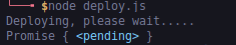
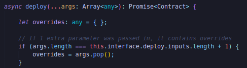
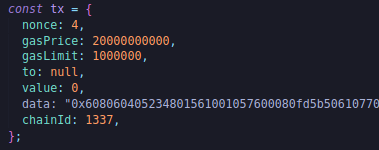
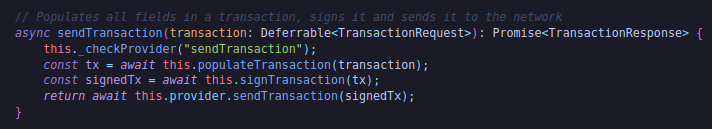
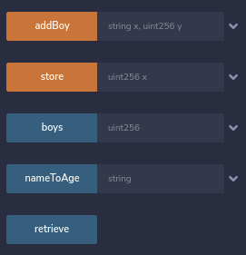
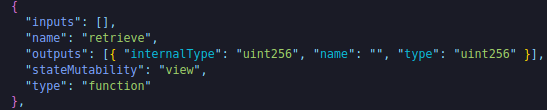
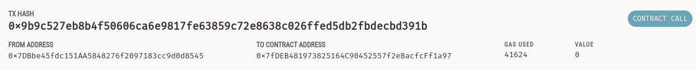
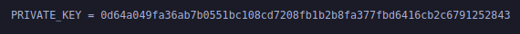
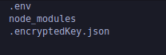

**A note on Await Keyword**

Now let me show you what happens if we don't use the await keyword.We're not telling our code to stop.We're saying to deploy the contract and then just keep going.we never actually check to see if the deploy function finished.Let's see what happens when we run instead.



Instead of that big contract object we get the promise in it's pending state because our code actually finished before our contract could finished deploying.This is why the await keyword is so important.Await keyword also reserves the promise.It'll wait for the promise to exit it's pending state and then it'll return whatever the pending promise returns.So `contractFactory.deploy()` returns the promise that returns a contract.

**Adding Transaction Overrides**

What else can we do?

Remember how in remix and metamask, we can add whole bunch of stuff.We can add a "GAS LIMIT", "VALUE" and when we're doing transact, we could press the transact button.When we're working with metamask we wanna send some money between our accounts, we can actually choose our gas price, priority fee and all the other stuffs.we can actually do all that in Ethers as well.So if we want await contractFactory.deploy with certain gas price, we can add these overrides in the deploy function.

Another really neat trick that your VS code might have is if you click command and click into a function and see where it's defined and see everything about the function.



These args inside deploy function are lists of overrides that we can specify with some brackets.We can put some brackets in our deploy function and specify certain things like for example we can specify gasPrice to being some number.

```javascript
  const contract = await contractFactory.deploy({ gasPrice: 1000000000 });
```

Now if we're to run this, we'll deploy this contract with a gas price of 1000000000.We can add a whole bunch of different overrides in our deploy function here.

**Transaction Receipts**

We can wait for certain number of blocks for our contract to finish with.So we've deployed the contract but maybe we wanna wait 1 block to make sure it actually gets attached to the chain.we can do:

```javascript
  const deploymentReceipt = await contract.deployTransaction.wait(1);
  console.log(deploymentReceipt);
```

and specify the number of confirmations that we actually wanna wait.Here we wait for 1 block confirmations.

we can run the script by:

`node deploy.js`


We can see "to" is null because we're creating a contract,"from" is going to be ganache address that we got the private key for, "contractAddress" that we created and many more information about transaction.

Something to take note of is the `deploymentReceipt` and the `deploymentTransaction`.

```javascript
  const transactionReceipt = await contract.deployTransaction.wait(1);
  console.log("Here is the deployment transaction: ");
  console.log(contract.deployTransaction);
  console.log("Here is the transaction receipt: ");
  console.log(transactionReceipt);
```

`You only get a transactionReceipt when you wait for a block confirmations otherwise you're going to get the contract object which has the deployTransaction with it.Deployment Transaction or the transaction response is what you get when you just create your transaction.` 

**Sending a "raw" transaction in etherjs**

Now you can actually see when we print the receipt, we got all the stuff because deploying a contract is actually just sending a transaction.So if we wanna see what's really going on under the hood, we can actually create a transaction ourselves and create a contract ourselves just by specifying transaction information.

Let's deploy our contract again but only purely using transaction data.This is going to be a way that you can deploy or send transactions purely with transaction data.You can send any transaction data.This gives you unlimited flexibility with the transaction that you want to send.

The first thing that we're going to need is nonce.We go back to our transaction count and we're on 3rd transaction.So we'll use the nonce 4 because that's going to be the nonce that we haven't used before.Everytime you send a transaction, it comes with one of those nonces.Nonce when we're talking about wallets talks about a number associated with a unique transaction.Nonce when we're talking about blockchain mining is a value used to solve that hard problem.They both mean the same thing but different in different context.

We'll pick a gasPrice of ganache and a gasLimit with some big number.To is going to be null exactly like what we saw in our receipt and responses because we're creating a contract.Value is going to be a 0 since we're creating a contract.We don't wanna send any etha and then data is going to be that massive binary object in our binary bit and then finally we're going to add the chainId.



This is the transaction with all the information propagated.However the transaction isn't signed.So nobody's sending the transaction.This is just the transaction detail of what somebody wants to do.We actually needs to sign this transaction and then send it to our blockchain.

```javascript
// const contractFactory = new ethers.ContractFactory(abi, binary, wallet);
// console.log("Deploying, please wait.....");

// const contract = await contractFactory.deploy();
// const transactionReceipt = await contract.deployTransaction.wait(1);
// console.log("Here is the deployment transaction: ");
// console.log(contract.deployTransaction);
// console.log("Here is the transaction receipt: ");
// console.log(transactionReceipt);
const signedTxResponse = await wallet.signTransaction(tx);
console.log(signedTxResponse);
```
Back in our ganache, we see we've four blocks in there.Let me ask.If we do this signed transaction and we get the signed transaction response, will we propogate another block?Well let's find out.

`node deploy.js`

We'll get the massive thing in our output but if we go back to ganache, we actually don't see another transaction sent.That's because we're only signing a transaction.We're not actually sending it.So this signed transaction response, the big number on our output represents signed transaction but not a sent transaction.

We can actually send one of the transactions by:

```javascript
const sendTxResponse = await wallet.sendTransaction(tx);
```

then once we send the transaction, we can do:

```javascript
await sendTxResponse.wait(1);
```

We have to wait for one block confirmation to make sure the transaction actually goes through.Then we can run

`node deploy.js`

It looks like like it's done but if we actually scroll up the output, we actually got an error here.

If you got an error like "ChainId is invalid" then change the network id in Ganache through settings>server to 1337.

```javascript
 console.log("Let's deploy with only transaction data!");
  const tx = {
    nonce: 0,
    gasPrice: 20000000000,
    gasLimit: 1000000,
    to: null,
    value: 0,
    data: "0x60800033.....",
    chainId: 1337,
  };
```

To get nonce with function call:

```javascript
  const nonce = await wallet.getTransactionCount();
```

We can verify it on ganache and we do indeed see our transaction added in ganache.

I actually showed you how to signed transaction but we didn't actually signed our send transaction.If you `ctrl + click the sendTransaction function`, you can actually see it's code:



We can actually see before it sends the transaction, even in ethers it signs the transaction first and then sends the transaction.

We've learned how to send a transaction using pure JavaScript and using pure ethers.One of the main takeaways from this is that everytime we change the blockchain, evertime we change the state, everytime we use gas, we're sending a transaction that looks pretty much like we did before.The data is going to be the differentiator.The data in our code is saying to create a new contract.When we make transaction like adding people or storing the data that we're going to be passing in our transaction is going to be data associated with calling the functions.

When we actually call functions in ethers or in hardhat, we're not going to do raw const Tx and list out all the stuff and list out the raw data because that's really really hard.Ethers and hardhat are going to make this process alot easier.So for our let's comment out the whole section of sending our transaction and let's uncomment so that we deploy our contract using kind of ethers much easie to read way than weird tx stuff.

**Interacting with Contracts in Ethersjs**

Now that we've actually deployed our contract, we can learn how to interact with our contract through code as well the same way as we click buttons in remix.We're going to code it out ourselves here.If we look at SimpleStorage, we've:



We can call the retrieve in ethers by:

```javascript
  const age = await contract.retrieve();
```

The contract object that we've is what's returned from our contractFactory as long as we waited it.

```javascript
const contract = await contractFactory.deploy();
```

contract object is going to come with all of the functionality described in an ABI.That's why we had to pass the ABI to our contractFactory.

```javascript
  const contractFactory = new ethers.ContractFactory(abi, binary, wallet);
```

If we look inside our ABI piece, we can see it has a tons of information on the different function that we can call, types it has and the return types and everything like that.



This block of code defines what a retrieve function can do.As I said ABI is incredibly important for working with our contracts.If we give our code just the huge bytecode thing, it's going to really hard for any processor to decompile it or understand what exactly what the functions are that are going on.

Let's print the age.

```javascript
console.log(age);
```

We're going to connect our ganache instance, connect our wallet with a private key that we got from top for our ganache, grab the ABI and binary of our contract and connect them to new contract factory object which is connected to that wallet.So that wallet will be the one to actually deploy the contract.We'll deploy the contract, wait 1 block for the transaction to finish and then we're going to call `contract.retrieve()` which should return age.Since this is a view function, this contract call won't cost us any gas.


So what's this BigNumber response? `Big Number` is a library that comes with the ethers application that helps us work with numbers.You would expect age to be just 0 but it returns this weird hex thing.So solidity can't use decimal places and JavaScript has a hard time with decimal places.Instead of numbers, you'll see strings like "0" or "10000000000" in JS and BiGNumber.

Now if I try to pass a number like this "1000000000000000000000000000000000000000" in javacript, this number would be too big for javascript to understand.So we want to use BigNumbers or strings when working with ethers.Now we can make this more readeable by adding .toString and printing out the string version of the BigNumber.

```javascript
  console.log(age.toString());
```

Now if I re-run this code, we can see we got 0.This is what our current age is.
Let's make console.log a little bit more syntactical.We're going to use something called string interpolation so we can interpolate our string with variables.

```javascript
  console.log(`Current age is ${age.toString()}`);
```

Let's update on the contract the age by calling the store function.

```javascript
const txResponse = await contract.store("7");
const txReceipt = await txResponse.wait(1);
const updatedAge = await contract.retrieve();
console.log(`Updated age is ${updatedAge}`);
```

Passing 7 in a string is because we want to pass some crazy massive number,JavaScript would get confused.So it's usually best practice to pass variables to contract functions as strings.

If we go to our ganache instance, we go to transactions, we can see we now have a contract call at the top.



You've successfully deployed a contract to your own local ganache instance.

**Environment variables**

Now let's clean the code little bit because if we look in our code, both the connection to the blockchain(rpc url) and our private key stored directly in our code.If we're to push this code to Github, people will be able to see our code.Remember if you give out your private key, whoever has your private key owns your funds.So even though this is a fake private key that doesn't have any real money in it, we still don't want it to hard code our private keys into our code just in case we accidentally share code with somebody.

Well on of the most popular methods is creating ".env" file.Create a .env file and this is going to be a file where you store your sensitive information and this is going to be a file that we're never going to share with anybody.This .env file will stuck variables of our choosing into the environment of our code.



So now we've a private key in an environment variable.Well in our deploy.js, we want to grab this private key and stick it into our script so that our script can then stick it into our environment.So we're going to add a tool called `dotenv` to make this easier.

`yarn add dotenv`

and we need to do at the top of deploy.js.

```javascript
require("dotenv").config();
```

Now that we've pulled it in, we actually get access to our private key environment variable.You can access environment variables in JS by `process.env`.

```javascript
  const wallet = new ethers.Wallet(process.env.PRIVATE_KEY, provider);
```

To make sure this works properly, we do:

`node deploy.js`

Now our RPC URL here isn't really something that we need to secure however maybe we're going to use a certain API key or maybe a certain endpoint that only we want to have access to.We don't want anybody else to be using our RPC endpoint.So we're going to add this to our .env file.

```javascript
const provider = new ethers.providers.JsonRpcProvider(process.env.RPC_URL);
```

**Better Private Key Management**

Well what we can do is actually encrypt our private key and store our encrypted key locally.That way if for some reason somebody does get into our account, our private key isn't just sitting around in plain text.It's encrypted and you'll need to know a password that only you know to get into to it.

First we're going to create a new file called "encryptKey.js".

```javascript
async function main() {}

main()
  .then(() => process.exit(0))
  .catch((error) => {
    console.error(error);
    process.exit(1);
  });
```

imports in our scripts:

```javascript
const ethers = require("ethers");
const fs = require("fs-extra");
require("dotenv").config();
```

We're going to set this script up to run our encrypt key one time and then we can remove our private key from anywhere in our working space so that it's no longer in plain text anywhere. 

```javascript
async function main() {
  const wallet = new ethers.Wallet(process.env.PRIVATE_KEY);
  const encryptedJsonKey = await wallet.encrypt(
    process.env.PRIVATE_KEY_PASSWORD,
    process.env.PRIVATE_KEY
  );

  console.log(encryptedJsonKey);
}
```

This encrypt function is going to return an encrypted Json key that we can store locally and that we can only decrypt it with the password.It takes a private key password and a private key.

`node encryptKey.js`

We can see the JSON object is what our key looks like encrypted.If somebody gets into our account and they see this, they'll have to know the password to decrypt the JSON object back into the private key.

Now that we've encrypted it, we'll save it.

```javascript
  fs.writeFileSync("./.encryptedKey.json", encryptedJsonKey);
```

and in our .gitignore file, we can add:



Now we've an encrypted key, we can delete our private key and password from .env file so that the password isn't hanging around in plaintext.Now that we've our encrypted key, back in our deploy script, we can change the way that we actually get a wallet.

```javascript
  // const wallet = new ethers.Wallet(process.env.PRIVATE_KEY, provider);
  const encryptedJson = fs.readFileSync("./.encryptedKey.json", "utf8");
  let wallet = new ethers.Wallet.fromEncryptedJsonSync(
    encryptedJson,
    process.env.PRIVATE_KEY_PASSWORD
  );
  wallet = await wallet.connect(provider);
```

The reason that I use `let` here is because we connected our wallet back to our provider.

`PRIVATE_KEY_PASSWORD=password node deploy.js`

We're able to no longer have our private key in our .env file not in plaintext anymore.It's in the encryptedKey so just in case somebody hacks our computer, they won't be able to send in new transactions unless they know the password.

One more thing to know, if you type history, if somebody got into your computer, a hacker could actually see your password.But if you run history -c, it'll clear your history.

**Optional Prettier Fromatting**

There's one or two more things that we want to do just to clean this all up.Right now when we're autosaving, the VS code plugin for us to auto format.However in the future, if anybody else comes across our repository, they might not have the VS code auto formatter on.we want to give users a way to format their code so it matches the styles that we use.We've the `prettier` extension installed, we can also add prettier as a node js module that can tell other users who don' t have a VS code exactly how to how to format both their JavaScript and the solidity.

There's a [prettier-plugin-solidity repo](https://github.com/prettier-solidity/prettier-plugin-solidity) and if we scroll down, we can see how to install with npm install but we're going to use yarn.

`yarn add prettier prettier-plugin-solidity`

We're install both prettier and the solidity plugin for prettier.We can create a new file called ".prettierrc" and in this file we can define what we want for both JavaScript and solidity.

```json
{
    "tabWidth": 4,
    "semi":false,
    "useTabs": false,
    "singleQuote": false
}
```

And then for all your open source repos, and all your projects that you make, you want to make README.md. README files are generally where people put instructions or information about your project or anything like that.This way whenever anybody comes across your project, they'll know what's it's about.

**Deploying to a Testnet or a Mainnet**

The last thing that we're going to do is deploy this to a testnet and interact with this on a testnet.We're going to use the Rinkeby testnet.Now looking at your code, you might already have a good idea how to actually make this slight change.Based off of our last section, we know that all we need is an RPC URL and a private key and we can begin making transactions on a blockchain.So we're probably going to need a Rinkeby RPC URL and a rinkeby private key.

We're going to use a third party RPC URL [Alchemy](https://www.alchemy.com/).Alchemy has a node as a service and allows us to connect to any blockchain that they have support for.We can create the project and after we've made it, we can select view key to see API key, http and web socket.We're only concerned with the HTTP endpoint.This is going to be our RPC URL that connects to rinkeby.We can copy the HTTP, come over to visual studio code and in our .env, we can substitute this our for their actual testnet value.For our private key we can use our MetaMask and put that private key in .env file.

Now that we've our private key and rinkeby, we can now try to run this on an actual testnet.But before we run the script let's add script to console log our contract address.

```javascript
console.log(`Contract Address: ${contract.address}`)
```

`node deploy.js`


