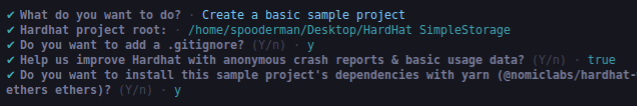
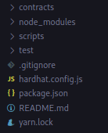
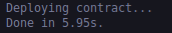
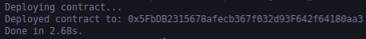
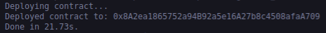

## Hardhat Simple Storage

Now that we've learned about ethersjs and how to do some more raw JavaScript coding, we're going to move into hardhat. We saw with our ether SimpleStorage that deploying a contract can take a lot of code.And there are a number of things we didn't even do there. Like we didn't save where the SimpleStorage contract was deployed.So we'd have to go back and remember where it was deployed every time. Instead of having it added programmatically, we didn't write any tests here. We'd have to build our own testing infrastructure.Maybe we want to make this a cross-chain application and we want more than just one private key and an RPC URL. You can absolutely work with your smart contracts in JS purely through ethers and small scripts like SimpleStorage, but we want a more robust framework for doing all this.

**Hardhat**

That's where the hardhat comes into play. Hardhat is a development environment which allows:

- Flexible JavaScript based Development Environment to compile, deploy, test, and debug EVM based smart contracts

- Enables easy integration of code and external tools

- Local Hardhat Network to simulate Ethereum

- Extensible plugin features

- High level of debugging features

Let's create our next project using Hardhat.

**Hardhat Setup**

Create a new folder:

`mkdir hardhat-simple-storage`

to navigate inside the folder.

`cd hardhat-simple-storage/`

and open the folder in the VS code.

to create a new project using yarn:

`yarn init`

and if we look at the package. json,

```json

{

  "name": "hardhat-simple-storage",

  "version": "1.0.0",

  "main": "index.js,"

  "license": "MIT"

}

```

We're going to delete main for now from the json. Now we're going to add a hardhat.

`yarn add --dev hardhat`

So far, we've just been running `yarn add *our package name*` but for most of what we're doing, we really want to do `yarn add --dev`.The reasons for this are nuanced. The main difference is that `dependencies` are required to run your project, where as `devdependencies` are required only to develop. For the most part, we're just doing --dev. When we get to the frontend portion of this course, we'll install more packages that we don't need just for development.

Now in the same directory where we installed hardhat, you can run `npx hardhat`.

The yarn equivalent of NPM is just yarn. So, yarn = npm. The yarn equivalent of NPX is also yarn. You can replace pretty much every time you see something like npm do something or npx do something with yarn.

To create a hardhat project:

`yarn hardhat`



Now if we look at our package.json,

```json

{

  "name": "hardhat-simple-storage",

  "version": "1.0.0",

  "license": "MIT",

  "devDependencies": {

    "@nomiclabs/hardhat-ethers": "^2.0.0",

    "@nomiclabs/hardhat-waffle": "^2.0.0",

    "chai": "^4.2.0",

    "ethereum-waffle": "^3.0.0",

    "ethers": "^5.0.0",

    "hardhat": "^2.9.7"

  }

}

```

We've added a number of dependencies like hardhat-ethers, hardhat-waffle, chai, and more. Great, we now have a sample hardhat boilerplate project. Let's walk through what we just installed here.



The first thing we've got is a contracts folder, which comes pre populated with Greeter.sol. Following that is node_modules, which contains our installed JS dependencies. Some of the node_modules start with the @ sign and then a lot of them don't. What's the difference between those two?

These @ signed mode modules are known as scoped packages, which effectively allow NPM packages to be namespace or yarn packages. This allows organizations to make it clear what packages are official and which ones are not.For example, if the package has the scope @angular, you know it's published by the Angular core team.

Then we've got a script section. This is where we're going to be adding our scripts that we want to write, like deploying contracts, interacting with contracts, etc., and then we've got a test folder. We haven't started building any tests yet, but tests are incredibly important for working with smart contracts.

It also adds hardhat.config.js. You can think of it as the entry point of all the scripts that we write.It's the configuration file that determines how the rest of our code is going to work and interact with the blockchain.

**Deploying SimpleStorage from Hardhat**

Let's go and try to do the same thing we did with ethers before, but with a hardhat. Let's go ahead and rename "Greeter.sol" to "SimpleStorage.sol".We're going to copy and paste all of our code from our previous SimpleStorage into this file. We can make sure that our SimpleStorage is compiling correctly by running:

`yarn hardhat compile`

After compilation is successful, we should see information about SimpleStorage in artifacts.Now that we've got a SimpleStorage contract in here, the next thing we want to do is learn how to deploy. This is where we're going to write our deploy script.We're going to rename "sample-script.js" to "deploy.js".

Now the setup for our deploy script is going to look really similar to the setup of our deploy script from the ethersjs section. We're going to do imports at the top, have our async main function, and then we're going to call the main function.

```javascript

// imports

// async function

// main

```

So let's go ahead and define our main function.

```javascript

// imports

// async function

async function main() {}

// main

main()

  .then(() => process.exit(0))

  .catch((error) => {

    console.error(error);

    process.exit(1);

  });

```

To get rid of those semicolons, we're also going to add prettier and our solidity prettier plugins.

`yarn add --dev prettier prettier-plugin-solidity`

Then we can go ahead and create a ".prettierrc" file and we're going to add:

```json

{

    "tabWidth": 4,

    "useTabs": false,

    "semi":false,

    "singleQuote": false

}

```

We're also going to add ".prettierignore" which tells prettier not to format some files.

```

node_modules

package.json

img

artifacts

cache

coverage

.env

.*

README.md

coverage.json

```

Unlike in our ethersjs section, where we had to grab our contract code a little bit more manually, with hardhat, there are actually a number of different ways to grab compiled contracts. The first thing we're going to do is use ethers. Now this is where one of the first confusing changes actually comes in.Previously, we did:

```javascript

const {ethers} = require("ethers")

```

And this is how we worked with ethers.However, you'll notice in our package.json, devDependencies, we've got a dependency called `hardhat-ethers`.Hardhat-ethers is a package that actually wraps a hardhat with its own built in ethers. This is really advantageous because it allows Hardhat to keep track of different deployments, different scripts, and all these other things for us. So instead of importing ethers directly from ethers, we're actually going to import ethers directly from hardhat instead.

```javascript

const {ethers} = require("hardhat")

```

Now we're pulling in ethers, we can actually immediately grab a contract factory using ethers.

```javascript

async function main() {

    const ssFactory = await ethers.getContractFactory("SimpleStorage")

}

```

Now if we pulled right from ethers, the package ethers doesn't know about the contracts folder and ethers doesn't know we've already compiled SimpleStorage.sol, which is in our artifacts. Hardhat, on the other hand, does know about the contracts folder and does know that it's already compiled, which is why the `ssFactory` grabbing works so well.

Once we've got our factory here, we can do the same thing that we did in the etherJS section and deploy the contract.

```javascript

async function main() {

    const ssFactory = await ethers.getContractFactory("SimpleStorage")

    console.log("Deploying contract...")

    const simpleStorage = await ssFactory.deploy()

}

```

Boom! With that little bit of code, we're already able to deploy our SimpleStorage contract. Then, to make sure it's deployed, we need to wait.

```javascript

const simpleStorage = await ssFactory.deploy()

await simpleStorage.deployed()

```

Now let's see what happens when we run the deploy script. As we know in our last section, we've got to put in our private key and RPC URL. Right now we don't have either one of those defined.So what do you think?Should the script actually work, or do you think it'll break? because we didn't define what blockchain we were going to deploy. We also didn't define the private key.We can run the scripts in our terminal by:

`yarn hardhat run scripts/deploy.js`



What's really happened here?Well, let's add one more line to the code.

```javascript

 console.log(`Deployed contract to: ${simpleStorage.address}`)

```



Huh, what's going on here?

***Networks in Hardhat***

Hardhat has this fantastic tool built in called the `Hardhat Network.` local Ethereum network node designed for development, which allows us to deploy our contract, run your tests, and debug your code.

Whenever we run a command in Hardhat or a script in Hardhat or a task in Hardhat, we by default deploy to this fake Hardhat network. The Hardhat network is very similar to Ganache, which runs in the background of our scripts.

In fact, if we go to hardhat.config.js, scroll down to the module.exports section, and add more information about our default networks, If we don't have anything in module.export, by default, it adds:

```javascript

module.exports = {

    // defaultNetwork: "hardhat",

    solidity: "0.8.4",

}

```

So anytime we run a script without specifying a network, it automatically uses this fake hardhat network, and this network comes automatically with an RPC URL and a private key for you. So you don't even have to add one in.This is one of the major advantages of working with a hardhat. However, in any script you run, you can choose whatever network you want to work with. So if I want to explicitly say I want to run our deploy scripts on our fake hardhat network, I can do:

`yarn hardhat run scripts/deploy.js --network hardhat`

Having the network flag makes it incredibly easy to switch across different chains, different blockchains, different private keys, etc. We can add other networks as well.

```json

module.exports = {

    defaultNetwork: "hardhat",

    networks: {

        rinkeby: {},

    },

    solidity: "0.8.4",

}

```

So I should just be able to change the network flag to rinkeby, right?

Well, not quite. If you try to run that, you're going to get "Invalid value undefined for HardhatConfig.networks.rinkeby.url-Expected a value of type string." It's expecting you to know what the URL is. Since this isn't the hardhat network, we need to tell hardhat exactly how we're going to connect to Rinkeby. This is where a lot of what we learned before is going to come in handy. We're going to do exactly the same as before. We're going to create a new .env file and we're going to add the rinkeby url to this file.

 ```javascript

 const RINKEBY_RPC_URL = process.env.RINKEBY_RPC_URL

 ```


 To pull from .env, we need to add the dotenv package again.


 `yarn add --dev dotenv`


And at the top of our hardhat config, we're going to add:


 `require("dotenv").config()`


 This means we should be able to pull RINKEBY_RPC_URL from our.env. Now we have that, in our rinkeby network, we can add:


```javascript

networks: {

        rinkeby: {

            url: RINKEBY_RPC_URL,

        },

    },

``` 

Well, we usually need a private key to work with an actual network.Grab the private key from Metamask because Hardhat isn't going to provide an account and test ETH for testnets. 

```javascript

const RINKEBY_RPC_URL = process.env.RINKEBY_RPC_URL

const PRIVATE_KEY = process.env.PRIVATE_KEY

module.exports = {

    defaultNetwork: "hardhat",

    networks: {

        rinkeby: {

            url: RINKEBY_RPC_URL,

            account: [PRIVATE_KEY],

        },

    },

    solidity: "0.8.4",

}

```

One more thing I'd like to give is the chain id of the network.

```javascript

rinkeby: {

            url: RINKEBY_RPC_URL,

            account: [PRIVATE_KEY],

            chainId: 4,

        },

```

Now that we've got the RPC URL and private key, we can go ahead and test deploying the script to an actual testnet.

`yarn hardhat run scripts/deploy.js --network rinkeby`

But you'll get an error that says:

"Can not read properties of null (reading 'sendTransaction')"

It looks like it's having a hard time understanding what the private key or what the account of this is.

In your hardhat config, it should be accounts.

```javascript

 rinkeby: {

            url: RINKEBY_RPC_URL,

            accounts: [PRIVATE_KEY],

            chainId: 4,

        },

```




