**Programatic Verification**

So we've deployed to rinkeby using hardhat.This is fantastic.Now something that we noticed once again is our contract isn't verified? Well back in our deploy script, we can add some code to automatically verify right after we deployed.

Right below our main function, we're going to create a new function called "verify" and we're going to have it passed a contract address and some arguments for the contract.Since our SimpleStorage doesn't have a constructor, the arguments for SimpleStorage are just going to be blank.But in the future, when we've contracts that do have constructors, the arguments are going to be populated.

```javascript
async function verify(contractAddress, args){
    
}
```

We're going to add some code in here to automatically verify our contracts after they've been deployed.This auto verification process works on block explorers like ether scan.It might not work on block explorer like ethpolrer.Now etherscan in most other block explorer have a section in their website called [API documentation](https://docs.etherscan.io/v/rinkeby-etherscan) or something to do with APIs.These are ways for us to programatically interact with etherscan and do stuff with them.One of the main things that we can do is actually verify our contracts through API.

Hardhat is an extensible framework meaning you can add plugins to it.We can see some of the popular [plugins](https://hardhat.org/plugins) nomic labs has created.One of the most used hardhat plugins is going to be hardhat etherscan plugins that makes verification process much easier.To install it, we'll do:

`yarn add --dev @nomiclabs/hardhat-etherscan`

Now that we've this plugin, we can go to our hardhat.config and add this plugin at the top.

```javascript
require("@nomiclabs/hardhat-etherscan")
```

In order for us to use the verification, we actually need an API key from etherscan.This is basically a password for allowing us to use the etherscan API.We're going to go ahead and create our account in [etherscan](https://etherscan.io).Now that we're logged in, on the left hand side, we can scroll down to API keys and create a new API key.In our .env we're going to add that API key.

Now that we've our API key, back in our hardhat config, we're going to create a new section in "module.exports", tell hardhat that we've etherscan API key.

```javascript
const RINKEBY_RPC_URL = process.env.RINKEBY_RPC_URL
const PRIVATE_KEY = process.env.PRIVATE_KEY
const ETHERSCAN_API_KEY = process.env.ETHERSCAN_API_KEY

module.exports = {
    defaultNetwork: "hardhat",
    networks: {
        rinkeby: {
            url: RINKEBY_RPC_URL,
            accounts: [PRIVATE_KEY],
            chainId: 4,
        },
    },
    solidity: "0.8.4",
    etherscan: {
        apiKey: ETHERSCAN_API_KEY,
    },
}
```

Now in our terminal let's do:

`yarn hardhat`


Wow we did get a new verification here.When we run `yarn hardhat`, hardhat actually looks into our hardhat.config.js and checks for any plugins.If there're new plugins there, it'll add them there as a new task that we can do.Let's build this verification function.In our code, we can actually run any tasks from hardhat using a run package.So up at the top "run" from hardhat as well.

```javascript
const { ethers, run } = require("hardhat")
```

So in our code, we're going to do:

```javascript
async function verify(contractAddress, args) {
    console.log("Verfying contract ...")
    await run("verify")
}
```

Now hardhat allows you to add different parameters as well in this run and it's usually best that you add them in here so that we're really specific with what we're doing.If you do:

`yarn hardhat verify --help`
 
 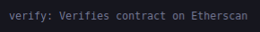
 
 Second parameters that goes inside run is list of actual parameters.Second parameter here is just the kind of sub task, if you will of our verify task.
 
 ```javascript
 async function verify(contractAddress, args) {
    console.log("Verfying contract ...")
    await run("verify:verify", {
        address: contractAddress,
        constructorArguments: args,
    })
}
 ```
 
 Normally just this should be enough for us to go ahead and use the verify contract in our main function but we're going to add one additional thing to it.Because in practice sometimes there's some errors that can come up.On of the errors that often comes up when running a wait is that the contract has already been verified.So we can add try catch to the await.
 
 ```javascript
 async function verify(contractAddress, args) {
    console.log("Verfying contract ...")
    try {
        await run("verify:verify", {
            address: contractAddress,
            constructorArguments: args,
        })
    } catch (e) {
        if (e.message.toLowerCase().includes("already verified")) {
            console.log("Already verified!")
        } else {
            console.log(e)
        }
    }
}
 ```
 
The reason that we did this is because of that error our verification function will break and our whole script will end.We don't want our whole script to end.We want our script to keep continuing if the verification doesn't work.

We now have a verify function using the "verify" task in hardhat.Let's go ahead and use this now in our main function.But before we call verify function, let's think for a quick second.`What happens when we deploy to our hardhat network?`

Well remember if we deploy to our hardhat network, will our contract need to be verified in etherscan?We know there's a rinkeby etherscan, kovan etherscan, mainnet etherscan but is there's a hardhat etherscan?No of course not.The hardhat runtime environment is a network local to our machine.So it doesn't makes sense for us to verify a hardhat network deployed contract on etherscan.

So we actually don't want to call the verify function, when we're working with our local network.This is where `chain ids` are going to come in quite useful.We can check to see if the network that we're running on is a live or testnet or network that can actually be verified.We can actually get network configuration information by importing network.

```javascript
const { ethers, run, network } = require("hardhat")
```

Our `network.config` contains a ton of information about the current network that we're on.

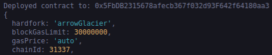

You can see here that the chainId of the hardhat network is actually 31337.This chainId is really important because we can use this chainId to figure out which one is a testnet or which one is a live network.We only want to verify on a testnet.So,

```javascript
// console.log(network.config)
if (network.config.chainId === 4 && process.env.ETHERSCAN_API_KEY) {
    await verify(simpleStorage.address, [])
}
```

In JS "===" is nearly the same as "==" except no type conversion is done which just means:

```javascript
4 == 4     // true
4 == "4"   // true
4 === "4"  // false
```

We've added a way to actually verify our contract but we're not quite done.On ether scan or all other block explorer the instant we deploy the contract and the instant we send the contract, etherscan might not know about the transaction yet.It might take a hot second for etherscan and to be upto speed with where the blockchain.It's usually best practice to wait for a few blocks to be mined untill you actually run your verification process.

```javascript
 if (network.config.chainId === 4 && process.env.ETHERSCAN_API_KEY) {
        await simpleStorage.deployTransaction.wait(6) 
        await verify(simpleStorage.address, [])
    }
```

So we'll wait for 6 blocks and then run the verification process.

Let's finish the main function and we'll run everything all together.

**Interacting with Contracts in Hardhat**

So we've deployed our contract, and automatically programmatically verified our contract.What's next?Well what did we do last time? We started interacting with the contract.

```javascript
    const currentAge = await simpleStorage.retrieve()
    console.log(`Current Age: ${currentAge}`)

    // Update the current age
    const txnResponse = await simpleStorage.store("7")
    await txnResponse.wait(1)
    const updatedAge = await simpleStorage.retrieve()
    console.log(`Updated age: ${updatedAge}`)
```

Now this is our whole script.

To run on the hardhat,

`yarn hardhat run scripts/deploy.js`

Let's also try this on rinkeby.

`yarn hardhat run scripts/deploy.js --network rinkeby`

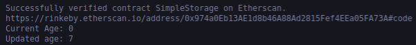

Hardhat will automatically recompile it for you especially is there's no artifacts folder.

**Custome Hardhat Tasks**

We've got now successful deploy.js script that can deploy, verify and then interact with our code.We can actually write our own tasks in hardhat and in our hardhat.config, it defaulted with task account.

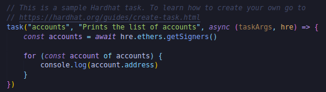

Task accounts prints the list of accounts.One of ways you can define tasks is directly in our hardhat.config.js but typically what people do is they have a new folder called "tasks" where they put all their tasks.For now let's delete that account task and we're going to create our own tasks.Now if we run `yarn hardhat`, we can no longer see accounts task.

We're going to create our own tasks and we're going to call it "block-number.js".We'll use this to get the current block number or whatever blockchain that we're working with.So let's create this task.

First we need to import the task function.

```javascript
const { task } = require("hardhat/config")
```

To define a task, we'll give it a name and the description.

```javascript
task("block-number", "Prints the current block number")
```

Now that we've this task, there's couple of things we can actually do with it.we can add different parameters to it by using the `.add` command which allows us to pass parameters to the task and then we can also set actions which defines what the task should actually do.For use we're just going to do setAction and define what we want this function to do.

```javascript
task("block-number", "Prints the current block number").setAction(
)
```

So we're going to make this an async function that's going to take as an input(`task arguments` which are going to be blank for us and the `hre`).

```javascript
task("block-number", "Prints the current block number").setAction(
    async (taskArgs, hre) => {
    }
)
```

This syntax might look little bit weird but this is what's know as `JavaScript arrow function`.In JavaScript, you can actually define functions without even using the function keyword.For example if we go back to our deploy script, we've `async function verify` there.However another way we could have defined this is without using the function word at all and actually turning the whole code into a variable.

```javascript
const verify = async (contractAddress, args) => {
    console.log("Verfying contract ...")
    try {
        await run("verify:verify", {
            address: contractAddress,
            constructorArguments: args,
        })
    } catch (e) {
        if (e.message.toLowerCase().includes("already verified")) {
            console.log("Already verified!")
        } else {
            console.log(e)
        }
    }
}
```

These twi functions are essentially equivalent.There's some slight difference between using the function keyword and having your function be a variable.For now let's say they're basically the same which means without assigning to a verify or variable is a function with isn't assigned.

```javascript
async (contractAddress, args) => {}
```

The same syntax, we're doing in our task.You can imagine it to be like:

```javascript
async (taskArgs, hre) => {}
// const blockTask = async function() => {}
// async function blockTask() {}
```

The major difference is that we're never giving our function a name.This is know as `anonymous function` in JavaScript because it doesn't have a name.Now that we've a function in there, we can call some function to get the block number.

Well how can we get the block number?

When we run tasks, we automatically pass our anonymous functions, the task arguments which in this one we don't have any and we also pass hre object.The hre is a `hardhat runtime environment`.Back in our deploy script, this is basically the same as `require("hardhat")`.So this hre can access alot of the same packages that hardhat package can.So we can do `hre.ethers` just like how we imported in our deploy script.In our ethers package, there's actually a number of functions we can use like `.provider.getBlockNumber`.

```javascript
task("block-number", "Prints the current block number").setAction(
    async (taskArgs, hre) => {
        const blockNumber = await hre.ethers.provider.getBlockNumber()
        console.log(`Current block number: ${blockNumber}`)
    }
```

Now though if I try to run this task, you'll notice it doesn't show up in the hardhat list of tasks.

`yarn hardhat`

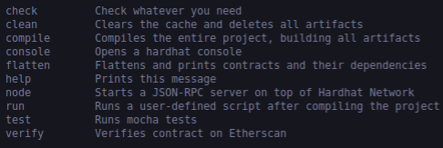

Hmm, I don't see blockNumber in here.Well this is because we need to add it to our config.In our config, we'll add:

```javascript
require("./tasks/block-number")
```

and in order for us to import it, let's add module.exports in block-number.js.

```javascript
module.exports = {}
```

Now that we've required it, if I run `yarn hardhat`, now I can see block-number is one of the tasks that I can use.

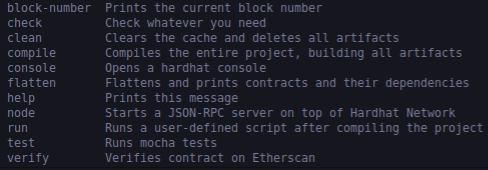

Now if I run `yarn hardhat block-number`

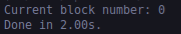

But if I run `yarn hardhat block-number --network rinkeby`

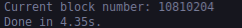

Now scripts and tasks both can basically do the same thing.They both can interact with contracts, both can deploy smart contracts, both pretty much can do everything.I prefer scripts just as a general rule of a thumb because I don't always think adding a special thing from a command like makes sense.I prefer scripts but you'll see a ton of tasks examples out there as well.I think tasks are really nice for specific use cases.I think tasks are better for plugins and scripts are better for your own local development environment. 


**Hardhat Localhost Node**

As you starting to see, this config piece is pretty powerful and we can use it to modify our entire code base and our project more functionality.What else can this do?

Well right now as you can see everytime we work with a hardhat network, everytime we run a script, we run that script and the hardhat network is deleted.we can interact with our contracts anymore.Well there's actually a way for us to run a hardhat network similar to how we ran a ganache network with a user interface.What we can do in hardhat is run:

`yarn hardhat node`

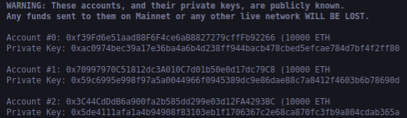

It'll spin up a node on a local network, exactly the same as ganache but in a terminal.Just like Ganache, it comes packed with all the different accounts and private keys.Interestingly enough this node that we're running isn't on the hardhat network.We can actually create a new terminal to try to interact with it and in our new terminal let's run:

`yarn hardhat run scripts/deploy.js`

Well we deployed our contract but if we look at our node in another terminal, it doesn't look like any transaction went through.We don't see any logging there.So what's going on?

Well our hardhat network is actually different from this locally running node network.This locally running network we often wanna refer to as our local host.So it's slightly different than the hardhat network.It's still using the hardhat runtime environment but it's just not this default hardhat network.It's considered it's own seperate network when we're running a node that's going to live past the duration of a script.

So we can actually interact with this by adding a new network to our hardhat.config.js.

```javascript
rinkeby: {
            url: RINKEBY_RPC_URL,
            accounts: [PRIVATE_KEY],
            chainId: 4,
        },
        localhost: {
            url: "http://127.0.0.1:8545/",
            chainId: 31337,
        },
```

We got the url right from our terminal and chainId is same as default hardhat network because even though it's considered a different network, it actually has the same chainId as hardhat.We actually don't need to give it accounts because when we run this local host hard hat will automatically give us the fake accounts.

Now if we go back to another terminal where we deploy our scripts, let's re run the scripts and we'll do --network localhost and we should be pointing to the node.When I run this script, we should see some logging output on the node terminal.

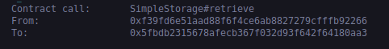

This is incredibly powerful for quickly testing and working with things on a local JavaScript VM or a hardhat network to be able to see how your contracts will interact on a real testnet.This is much quicker then working with a real testnet.

Now additionally any process that's running on the terminal, you can kill it with `Ctrl + C`.

**The Hardhat Console**

So running scripts is great but what if I don't what to have to code an entire scripts to do some things?What if I just tinker around with the blockchain?Well hardhat comes packed with the `console`.The console is a JavaScript environment for us to run JavaScript commands to interact with any blockchain.We can jump into the console by running:

`yarn hardhat console --network localhost`

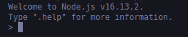

In this shell we can do everything that we do in a deploy script and we don't even have to run imports because everything with hardhat is automatically imported into our console.So for example let's say I wanted to get SimpleStorage Contract Factory, I can run exactly the same code of deploy scripts.


And if we flip back to our node, we'll see we just deployed another SimpleStorage.

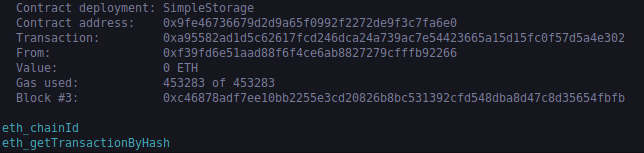

Now I could do:

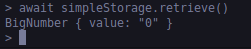

This is a great way to quickly interact with any blockchain that we want.This console works with any network.We can even do:

`yarn hardhat console --network hardhat`

and we'll get dropped into a hardhat network.

**Running Tests**

Now there couple other tasks that are really helpful.To delete and clear out your cache, you can just do:

`yarn hardhat clean`

One of the biggest things that hardhat is fantastic for is running tests.Running tests is absolutely critical to your smart contract development journey.The reason that writing tests is so important is that we want to make sure our code does exactly what we want it to do.Especially in the defi and the decentralized smart contract world, all of our code is going to be open source for anybody to interact with and potentially exploit.There's sites like [rekt](https://rekt.news/) that goes through a ton of previous hacks and how thay actually got hacked and what happened in the smart contract to enable these hacks to occur.So writing really strong tests is always going to be our first line of defense.

So we're going to create a new file called "test-deploy.js" inside test folder.We want to be able to test all of our solidity code locally so that we know exactly what's it doing.We can have a programmatic way to make sure that our code does what we want it to do.So let's write a basic test for our SimpleStorage contract so that we can be sure that it's doing exactly what we want it to do doing.

Hardhat testing works with the `[Mocha](https://mochajs.org/)` framework, which is a javascript based framework for running our tests.You actually can write tests directly in solidity if you'd like to.There's a bit of back and forth on whether testing with pure solidity is better or testing with the modern programming language.The argument goes that the testing with the modern programming language, you have more flexibility to do more stuff to interact and test you smart contracts.

So to get started with our mocha tests, we're going to write a describe function.Describe is a keyword that hardhat and mocha will recognize and it takes two parameters.It takes a string which we're just going to write "SimpleStorage" for now and then also takes a function.We could make another function and write some stuff there and then pass that function in the describe as a argument but a common convention is to make it as an anonymous function which we can create by:

```javascript
// describe("SimpleStorage", () => {})
describe("SimpleStorage", function () {})
```

We've described a SimpleStorage and then our function which is going to have all of our tests in it.Inside each one of our describe blocks, we're going to have something called `beforeEach` and a bunch of `it`'s.

```javascript
describe("SimpleStorage", function () {
    beforeEach()

    it()
})
```
beforeEach function is going to tell us what to do before each of our its.So we're going to have ton of it and then we're going to have a beforeEach.All of our it's are going to be where we actually write the code for running our tests and beforeEach is going to be code that tells us what to do before each one of the it's.We can also actually have describe inside of describe which again have more before each and more before it's.Having these nested describes can be really helpful for seprating and modularizing our tests.

So in order to tests our smart contracts, before we actually run our tests we're probably going to need to deploy the smart contracts first.So inside of our beforeEach we're going to pass beforeEach a function that's going to tell our testing framework what to do before each test.So we're going to pass it an async function.

```javascript
 beforeEach(async function(){
})
```
and in here we want to deploy our SimpleStorage contract.so to do that we're going to need to get the ethers framework and do exactly what we did in our deploy script.

```javascript
const { ethers } = require("hardhat")
```

then in our beforeEach function, we'll say:

```javascript
 beforeEach(async function () {
        const ssFactory = await ethers.getContractFactory("SimpleStorage")
        const simpleStorage = await ssFactory.deploy()
    })
```

Since right now our "simpleStorage" and "ssFactory" are scoped just inside the beforeEach, we actually need to stick these variables outside of the beforeEach, so all of our "it's" can interact with them.So instead of having "simpleStorage" & "ssFactory" be constant variables, we're going to define them outside of "beforeEach" with a "let" keyword.  

```javascript
describe("SimpleStorage", function () {
    let ssFactory, simpleStorage
    beforeEach(async function () {
        ssFactory = await ethers.getContractFactory("SimpleStorage")
        simpleStorage = await ssFactory.deploy()
    })

    it()
})
```

Now we've "ssFactory" and "simpleStorage" that we can use inside of "it" function.Now we've a beforeEach section.So before each one of our tests, we're going to deploy our SimpleStorage contract.So we've a brand new contract to interact with for each one of our tests.

Now inside of "it" this is where we're going to say what we want this specific test to do and then describe the code.

```javascript
it("Should start with age of 0", async function () {
    })
```

and inside the anonymous function, we'll actually write the code to make sure that our contract does exactly what we intend to do. 

```javascript
  it("Should start with age of 0", async function () {
        const currentAge = await simpleStorage.retrieve()
        const expectedAge = "0"
    })
```

We can either the `assert` keyword or the `expect` keyword which we're going to import both of these from a package called `Chai`.we actually installed chai automatically when we downloaded the basic packages for hardhat.So at the top we're going to say:

```javascript
const { expect, assert } = require("chai")
```

Assert has a tons of built in function that helps us make sure this is what we expected it to be.So I can do:

```javascript
 it("Should start with age of 0", async function () {
        const currentAge = await simpleStorage.retrieve()
        const expectedAge = "0"
        assert.equal(currentAge.toString(), expectedAge)
    })
```

We changed the currentValue to sting because it's a bigNumber and to actually run this:

`yarn hardhat test`

Let's write one more test just to make sure that things are good.

```javascript
it("Should update when we call store", async function () {
        const expectedAge = "7"
        const txnResponse = await simpleStorage.store("7")
        await txnResponse.wait(1)

        const updatedAge = await simpleStorage.retrieve()
        assert.equal(expectedAge, updatedAge.toString())
    })
```

To only run one test, we can do:

```javascript
it.only("Should update when we call store", async function () {})
```

and this will only run this test.

Now the other way, you'll see the test written is with instead of assert, it'll use the expect keyword.

```javascript
// assert.equal(currentAge.toString(), expectedAge)
expect(expectedAge.toString()).to.equal(currentAge)
```

These two lines do exactly the same thing and it's sort of up to you on which one you want to use.

**Hardhat Gas Reporter**

Now that we've some tests, we can actually start testing to see how much gas each one of our functions actually costs.One of the most popular extensions for hardhat is the `[hardhat-gas-reporter](https://www.npmjs.com/package/hardhat-gas-reporter)`.This is an extension that gets attached to all of your tests, and automatically gives us an output like this:

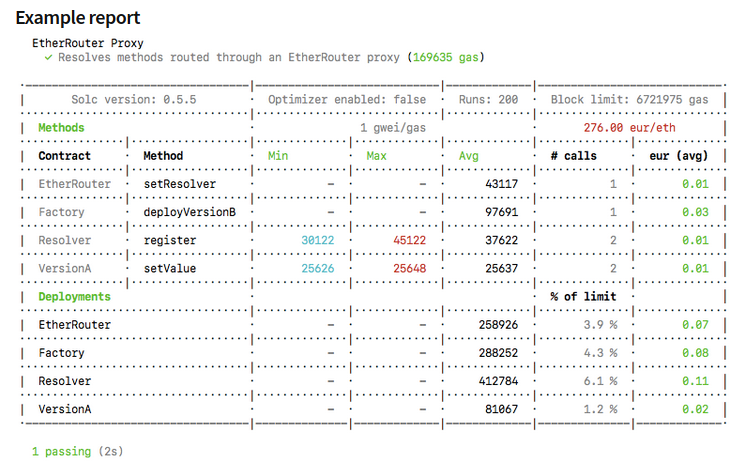

This tells how much gas each one of our functions cost.To install it:

`yarn add hardhat-gas-reporter --dev`

Now that package is installed, we can go over to our config and add some parameters in there so that we can work with gas bit.Underneath our etherscan section, we're going to add a new section called gasReporter.To have it run whenever we run tests, we're going to enable it.

```javascript
 gasReporter: {
        enabled: true,
    },
```

and up at the top, we can add it by:

```javascript
require("hardhat-gas-reporter")
```

Now that we've it in our config, we can do:

`yarn hardhat test`

and after we run our test, it will automatically run the gas reporter.

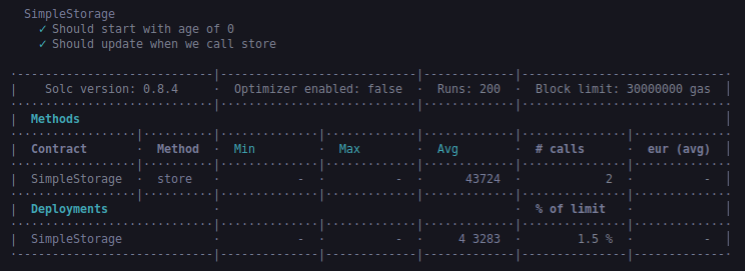

So our store function looks like cost approximately 43724 gas and our simpleStorage costs approximately 453283 gas.This is incredibly helpful for figuring out how to optimize our gas as best as possible.

Having a gas outputted like that is nice but we can make it even better.I'd like to output it to a file.

```javascript
gasReporter: {
        enabled: true,
        outputFile: "gas-report.txt",
    },
```

and then in .gitignore, add the "gas-report.txt".

```javascript
 gasReporter: {
        enabled: true,
        outputFile: "gas-report.txt",
        noColors: true,
    },
```

The reason that we add noColors is when we output to a file, the colors can get messed up basically.And the biggest addidtion we could do is we can add a currency in there.

```javascript
gasReporter: {
        enabled: true,
        outputFile: "gas-report.txt",
        noColors: true,
        currency: "USD",
    },
```

So that we can get the cost of each function in USD for a blockchain like Ethereum.Now in order to get a currency in here, we actually need to get an API key from `coinmarketcap`.Just like we did with etherscan, we can create our account in [coinmarketcap](https://pro.coinmarketcap.com/signup/) to get the API key.

Now in our coinmarketcap dashboard, we can copy our key and drop it into our .env file.After we've our API key in .env file, in our config we can:

```javascript
const COINMARKETCAP_API_KEY = process.env.COINMARKETCAP_API_KEY

gasReporter: {
        enabled: true,
        outputFile: "gas-report.txt",
        noColors: true,
        currency: "USD",
        coinmarketcap: COINMARKETCAP_API_KEY,
    },
```

This is going to make an API call to coinmarketcap whenever we run our gas reporter.We can run the test now.

`yarn hardhat test`

Now it has the USD price of each one of the transactions.

Hardhat gas reporter actually comes with different options though, if you're going to be deploying to different network.For example let's say we wanted to deploy the polygon, let's see how much deploying to polygon would cost.Well in our config, we'll add:

```javascript
coinmarketcap: COINMARKETCAP_API_KEY,
token: "MATIC",
```

and re-run the test.

Sometimes when we're working with our code, if we don't have environment variables specified, hardhat might get a little bit upset with us.So oftentimes I'll code so that environment variables are always populated because we didn't specify our "RINKEBY_RPC_URL", RINKEBY_RPC_URL is going to be undefined and that might throw some errors below.So often times, I'll add "||"(Or) parameter.

```javascript
const RINKEBY_RPC_URL =
    process.env.RINKEBY_RPC_URL || "https://eth-rinkeby/example"
```

Just so that I don't make hardhat mad if I don't use rinkeby.

**Solidity Coverage**

As we progressed, we're going to learn more and more tools that we can use to make sure that our SimpleStorage contract is safe and secure and we take all the steps we can to prevent any hacks happening if we deploy in real life.One of those tools is called "solidity coverage".This is also a hardhat plugin that we can use for our code.Solidity coverage is a project that goes through all of our tests and sees exactly how many lines of code in our SimpleStorage.sol are actually covered in test.And this could be a good tip off, if we don't cover some line of code solidity coverage will say "Hey you don't have ant tests for this line.Maybe you should write tests for it."

We can add solidity coverage the same way we've been adding all of our packages.

`yarn add --dev solidity-coverage`

and we can add this to our config, same way we've been adding everything to our config.

```javascript
require("solidity-coverage")
```

Now we can run :

`yarn hardhat coverage`

I'll get "coverage.json"file which is basically the chart broken down little bit more.I'll often put coverage.json in .gitignore.

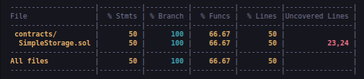

We can see about 50% of our statements in SimpleStorage.sol are covered.About 2/3 of our functions and 50% of our lines are covered.It'll even give us what lines are tested right now i.e 23,24.Also add coverage folder in .gitignore.

**Hardhat Waffle**

Last thing we didn't talk about here is what is `[@nomiclabs/hardhat-waffle](https://www.npmjs.com/package/@nomiclabs/hardhat-waffle)` in config.Hardhat waffle is actually a plugin to work with the waffle testing framework.Waffle is one of the frameworks that allow us to do some really advanced testing.
