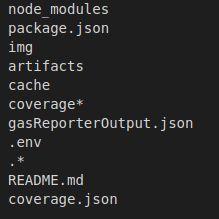
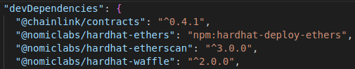
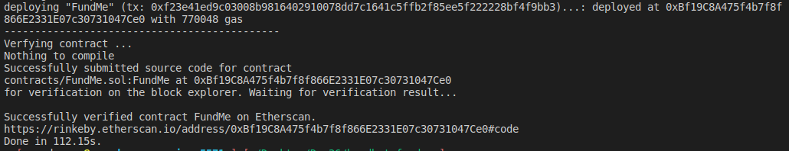

## Hardhat Fund Me

We've learned really just the basic of all the different things we can do with hardhat.Hardhat fund me and hardhat smart contract lottery are really going to be the basics of all the fundamentals of all the tools that we're going to learn in hardhat.

**Hardhat Setup**

We're going to make new directory for this project.

`mkdir hardhat-fund-me`

We're going to go inside the directory.

`cd hardhat-fund-me/`

then type `code .` or open the folder in VS code.

We're going to go ahead and add hardhat here.

`yarn add --dev hardhat`

Now that we've hardhat, in our package.json and in our node_modules, we can go ahead and run :

`yarn hardhat`

I'm going to choose the advanced sample project here, just to show you what's going on.

Let's me walk you through some additional things here.It comes with `.eslintignore` and `eslintrc.js`.`ESLint` is known as a JavaScript linter which helps you find and automatically fix problems in your code.`.npmignore` helps helps ignore files if you want to push your project up to be an NPM package.This advanced project looks pretty similar to what we're going to be working with anyways.

**Linting**

So what is that solhint file? Solhint is know as a solidity linter that we can use to lint our code.Linting is the process of running a program that will analyze code for potential errors.It also does little bit of formatting oftentimes.We use prettier to format our code, and we can use solhint to lint our code.They are often used a little bit interchangeably even though that's not exactly correct as they are little bit different.We can run the linter in our code by running:

`yarn solhint contracts/*.sol`

Linter is a good way to check for some best practices for running your code.

So in our prettierrc, we're going to add the same piece of code.

```json
{
    "tabwidth":4,
    "useTabs":false,
    "semi":false,
    "singleQuote":false
}
```

also update our .prettierignore.



and in our contracts add FundMe.sol and PriceConverter.sol.

Now the first thing we want to do is run `yarn compile` to make sure that our code is actually working we wanted to.And before we hit compile, we need to make sure that we're using correct solidity version in our hardhat.config.json.

**Importing from NPM**

You'll see we actually got an error here.

"The library @chainlink/contracts, imported from contracts/PriceConverter.sol, is not installed."

In remix we just imported `@chainlink/contracts` right from our NPM or Github but in our local code, we've to tell hardhat specifically where to get this from.We want to download this specifically from the NPM package manager "@chainlink/contracts".We can download it simply by running:

`yarn add --dev @chainlink/contracts`

Now that we've downloaded it into our file, we'll be able to see it in node_modules.Hardhat is smart enough to know that "@chainlink/contracts" is going to point to that node_module that we have.So we can now run:

`yarn hardhat compile`

**Hardhat Deploy**

So now we've contracts in here and our code is compiling successfully.We're probably going to want to deploy our code.Now in our last section, I know we use this "deploy.js" scripts.However something that you'd notice, the more you work with just raw ethers, or even just hardhat is that keeping track of all of our deployments can get a little bit tricky.If you just use a deploy script, it's not saving our deployments to any file.Additionally having everything in the deploy script for deploying can make the tests and the deploy scripts maybe not work exactly hand in hand and there're couple of other things that might be tricky to work on.

We're actually going to work with a package that makes everything I just mentioned and couple of other things way easier and the package that I'm talking about is "hardhat-deploy" package.It's a hardhat plugin for replicable deployments and easy testing.To install it:

`yarn add --dev hardhat-deploy`

Once done installing, we need to import it into our hardhat.config.json.

```javascript
require("hardhat-deploy")
```

Now if you run `yarn hardhat`, you can see bunch of new tasks and one of them being deploy tasks.This deploy task is going to be the main task that we use to deploy our contracts.Instead of writing our deploy scripts in the scripts folder, we're actually going to create a new folder "deploy".This deploy folder is going to be where alot of hardhat deploy module looks to deploy code and it's going to be where we're writing our scripts.To write our scripts,we usually need to add one more thing in here.Since we're going to be using ethers.js in all of our scripts, we want to add `hardhat-deploy-ethers` to our package.

`yarn add --dev @nomiclabs/hardhat-ethers@npm:hardhat-deploy-ethers ethers`

We're taking "@nomiclabs/hardhat-ethers" and we're overriding it with "hardhat-deploy-ethers". 

Remember in our last project we used hardhat-ethers so that hardhat could override ethers.To use hardhat deploy, we use hardhat-deploy-ethers so that hardhat-deploy can override hardhat which overrides ethers.

This will enable ethers to keep track of and remember all the different deployments that we actually make in our contract.So if we look in our package.json,



we can see our "@nomiclabs/hardhat-ethers" version of it is going to be "npm:hardhat-deploy-ethers".Our package.json is basically saying the hardhat-ethers package is now overridden by the hardhat-deploy-ethers package.

Alright now that we've our setup, we can start writing our deploy scripts.The way the hardhat deploy works is all the scripts that get added to deploy folder will get run when we run `yarn hardhat deploy`.So a good practice is usually to number them so that they run in the order that you want them to run it.So since we only have one contract to deploy, we're going to do "01-deploy-fund-me.js" and in this script, this is going to be where we define how to deploy the FundMe contract.

Traditionally we did imports, main functions and calling of main function but hardhat deploy is a little bit different.We still going to import our libraries and packages but we're not going to have main function and not going to call it.When we run hardhat deploy, hardhat deploy is actually going to call a function that we specify in the script.

We're going to create a function "deployFunc" and export the function as the default function for hardhat deploy to look for.

```javascript
function deployFunc(){
    console.log("Hi!")
}

module.exports.default = deployFunc

```

and we can now run:

`yarn hardhat deploy`


If this syntax is easier for you to understand, go ahead and use this syntax and we're going to be passing the hardhat runtime environment as a parameter to the function.

```javascript
function deployFunc(hre){
    console.log("Hi!")
}

module.exports.default = deployFunc

```

However if we go to hardhat-deploy [documentation](https://github.com/wighawag/hardhat-deploy#an-example-of-a-deploy-script-), syntax looks a little bit different.

So instead of defining everything like before and defining the function name, we're actually going to be using a nameless asynchronous function.We're going to make it an anonymous function.

```javascript
async (hre) => {

}
```
then we're going to wrap this whole thing in module.export.

```javascript
module.exports = async (hre) => {}
```

This syntax is nearly identical to what we did before.We just don't have a name for our async function.So this is how we're going to set it up instead.Now the next thing that most of the documentation does is it pulls out the variables and functions our of the "hre" that we're going to use."hre" is a hardhat runtime environment.Whenever we run a deploy script, hardhat deploy automatically calls the function and just passes the hardhat object into it.Similar to back in "hardhat-simple-storage", in our deploy scripts, we add ethers, run and network come form hardhat.

```javascript
const { ethers, run, network } = require("hardhat")
```

Instead of coming from hardhat, we're coming from hre which is basically the same thing as hardhat.For our script, we're only going to use two variables from hre.

```javascript
module.exports = async (hre) => {
    const { getNamedAccounts, deployments } = hre
}
```

JavaScript has something called syntactic sugar.So instead of doing the code in two lines, we can actually do that whole bit on one line.

```javascript
module.exports = async ({ getNamedAccounts, deployments }) => {
}
```

We just extrapolate those two variables right in the function declaration.This is an asynchronous,nameless function using the arrow notation for working with our deploy scripts.

So we're using the deployments object.Reasons to use this deployments object is to get two functions i.e deploy and log.

```javascript
const { deploy, log } = deployments
```

and also we're going to do:

```javascript
const { deploy, log } = deployments
const { deployer} = await getNamedAccounts()
```
 
What's this getNamedAccounts function? This getNamedAccounts is a way for us to get named accounts.When working with ethers, we can actually get our accounts based off of the number in accounts section of each network.For example in the list of private keys, it might get a little confusing to remember which one is which.So instead of working like that, we can add a section at the bottom called named accounts where we can name each one of those spots in the accounts array.so we'll do:

```javascript
 namedAccounts: {
    deployer: {
      default:0,
    }
  }
```

We're saying the 0th account is going to be deployer.We can also specify which number is going to be the deployer account across different chains.For example, on Rinkeby we wanted the deployer account to be the first position something like `4: 1`, or int hardhat, we could do like `31337: 1`.We can create multiple users like for example uses for some test or something, we could say:

```javascript
namedAccounts: {
    deployer: {
      default:0,
    },
    user:{
      default:1,
    }
  }
```

So back in our deploy-fund-me, we're going to say we're going to grab that deployer account from our namedAccounts and finally we're going to grab our chainId for reasons that'll come clear pretty soon.

```javascript
module.exports = async ({ getNamedAccounts, deployments }) => {
    const { deploy, log } = deployments
    const { deployer} = await getNamedAccounts()
    const chainId = network.config.chainId
}
```

**Mocking & helper-hardhat-config**

How do we actually deploy this FundMe contract?Well let's think about this for a little bit.When working with remix, it was pretty easy.We just deployed it to a testnet.That's kind of an issue there.Deploying to a rinkeby testnet is a little bit slow.We don't always want to have to deploy to one of these slow testnets or even a mainnet when tinkering and fiddling with our contracts.Do we? No that's going to be really bad.We really want to deploy to a testnet as a last stop after we've done all of our testing locally or we can deploy to a testnet to see some very specific code work like for example with the chainlink documentation.

So ideally, we deploy this to a local network first but can we just do that.Well if you look at our PriceConverter.sol, we've the hard coded address.If we go to [docs.chain.link](https://docs.chain.link/docs/ethereum-addresses/), that address on PriceConverter.sol is the ETH/USD specifically for Rinkeby.What if we work on Hardhat Network?If we're deploying to the hardhat network, hardhat network is the blank blockchain and it gets destroyed everytime our scripts finished or even if we're working with a local node.The pricefeed contract won't exist one of the code there won't be any updated data.So what do we do?How do we test and interact with our code locally? Is there a way we can do this?

Well one of the ways that we can do this that we will learn little bit later is actually forking a blockchain where you can keep stuff hard coded.But usually it's still better to figure out how to do everything with something called `mocks`.

"Mocking is primarily used in unit testing. An object under test may have dependencies on other (complex) objects. To isolate the behavior of the object you want to replace the other objects by mocks that simulate the behavior of the real objects. This is useful if the real objects are impractical to incorporate into the unit test.

In short, mocking is creating objects that simulate the behavior of real objects." 
                     taken from [here](https://stackoverflow.com/questions/2665812/what-is-mocking)
                     
Basically we want to make a fake price feed contract that we can use and we can control when working locally.

Well what happens when we want to change chains?

There are ton of different blockchains that have price feeds on them and on each one of these blockchains, the ETH/USD pricefeed is going to be a little bit different.The address for ETH/USD for Ethereum Mainnet is different from the address of the ETH/USD for Rinkeby.We also need a way for us to modularize or parameterize the address so that no matter what chain we deploy to, we don't have to change any of our code.We can always have our code exactly the same.Let's keep all that in mind as we write the rest of this.

Now in order to parameterize the address, we actually want to parameterize and do a little refactoring of our FundMe.sol.Right now we've the constructor which automatically gets called whenever we deploy our contract.Right now it's just updating the owner variable to be whoever sent in the contract.But we can actually have it do much more than that.since this constructor is a function just like every other function, we can actually have it take parameters.One of the parameters that we might like it to have is going to be the address of the pricefeed.So let's go and add these and figure out how to refactor all this code.

```solidity
constructor(address priceFeedAddress){
        owner = msg.sender; // sender of the message is us
                            // one that deploys the smart contract
    }
```

When we deploy our contract now, we're going to pass it the ETH/USD pricefeed address depending on what chain we're on.Now that our constructor takes a parameter for the pricefeed, we can actually save an AggregatorV3Interface object as a global variable.In our PriceConverter, we just create a priceFeed variable of type AggregatorV3Interface which again we're importing from chainlink repo which is an interface object which gets compiled down to the ABI.If you match an ABI up with an address, you get a contract that you can interact with.So we're going to do the same thing here.  

```solidity
AggregatorV3Interface public priceFeed;

    constructor(address priceFeedAddress){
        owner = msg.sender; // sender of the message is us
                            // one that deploys the smart contract
        priceFeed = AggregatorV3Interface(priceFeedAddress);
    }
```

Now we've the priceFeed that's variable and modularized depending on whatever chain we're on.Now what we can do is we can grab the priceFeedAddress and can use it for our PriceConverter.So where are we using our PriceConverter?Just a quick reminder.We're using PriceConverter for uint256.

`using PriceConverter for uint256;`

We're calling "msg.value.convert" in our fund function.So if we look in our PriceConverter, we've a function called "convert" which takes fundedAmount as an initial parameter which again since this is a library, it automatically passes the "msg.value" into the "convert" function.But we could also pass in the priceFeed and therefore we wouldn't need to hardcode it in the getPrice anymore.So let's figure it out how to do.

we'll stick priceFeed in the convert function in FundMe.sol.

```solidity
require(
            msg.value.convert(priceFeed) >= minUSD,
            "You need to spend more ETH!"
        );
```

and then we'll have to update our convert function so that it takes a second parameter.

```solidity
function convert(uint256 fundedAmount, AggregatorV3Interface priceFeed)
        internal
        view
        returns (uint256)
    {}
```

Now when we call our getPrice function, we can pass the priceFeed to the getPrice function.

```solidity
uint256 ethPrice = getPrice(priceFeed);
```

And up in our getPrice function, we can have:

```solidity
function getPrice(AggregatorV3Interface priceFeed)
        internal
        view
        returns (uint256)
    {}
```

Now we longer need to hard code in the price feed and we can just delete those lines and have it compiled like this:

```solidity
function getPrice(AggregatorV3Interface priceFeed)
        internal
        view
        returns (uint256)
    {
        (, int256 answer, , , ) = priceFeed.latestRoundData();
        return uint256(answer);
    }
```

Now we've done that refactoring, let's make sure it works:

`yarn hardhat compile`

Let's comeback to deploy-fund-me script and let's learn how to actually deploy the rest of it.In order for us to deploy a contract, we remember from our last section we use contract factories.With hardhat-deploy, we can just use the deploy function and to use the deploy function we'll say:

```javascript
 const fundMe = await deploy("FundMe", {
         from: deployer,
         args: [],
         log: true,
     })
```

FundMe is the name of the contract that we're deploying then the list of overrides that we want to add.We're going to pass any arguments to the constructor in the args piece which we just added priceFeedAddress and also some custom logging so that we don't have to do all that console.log stuff that we've been doing this whole time.

We can just do `const address = "0xhhashsdshd"` and stick that address in the args but we're not really parameterizing that.We're kind of just back to hard coding.so what can we do instead? We can actually use the chainId to do something like `If chainId is X use address Y` and to enable this functionality, we actually take a page out of [AAVE Github](https://github.com/aave/aave-v3-core).AAVE is another protocol that's on multiple chains and has to deploy their code to multiple chains or work with multiple chains and work with multiple different addresses.So what they do is they use a number of different useful tricks.But one of the main one is using the [helper-hardhat-config.ts](https://github.com/aave/aave-v3-core/blob/master/helper-hardhat-config.ts).With this config, they have different variables depending upon what network that they're actually on and depending on the network that they're on, they use different variables.so they use this network config almost to do exactly what we're trying to do in our code.

So we're going to create a new file at the root directory and call it "helper-hardhat-config.js".This is where we're going to define that network config.

```javascript
const networkConfig = {
    4: {
        name: "rinkeby",
        ethUsdPriceFeed: "0x8A753747A1Fa494EC906cE90E9f37563A8AF630e",
    },
}
```

Now we've a simple methodology of keeping track of different pricefeed of different contract addresses across different chains.Let's say for example we wanted to deploy to polygon as well.

```javascript
const networkConfig = {
    137: {
        name: "polygon",
        ethUsdPriceFeed: "0x0715A7794a1dc8e42615F059dD6e406A6594651A",
    },
}
```

Well what about the hardhat network? We'll get to that in just a second.

Then at the bottom, we need to export the networkConfig.So our scripts can actually work with it.

```javascript
module.exports = {
    networkConfig,
}
```

And we're going to export a couple of things from this file which is why we're doing it like this instead of that default way that I showed you before.

So back in our script what can we do?

Well first we want to go ahead and import that networkConfig.

```javascript
const { networkConfig } = require("../helper-hardhat-config")
```

Now that we've this networkConfig in our code, we can do this part where we say "If chainId is X use Address Y".Since our helper-config is nicely in dictionary key-value pair style, we could do:

```javascript
const ethUsdPriceFeed = networkConfig[chainId]["ethUsdPriceFeed"]
```
Now no matter what chain we're on, whenever we run hardhat deploy, the chainId is going to be the respective chain's id and it's going to use it's priceFeedAddress.This is exactly what we want.But is it everything that we want?

This is how we go to testnet and mainnet but what about a local network?So we've modularized our code and parameterize our code so that we're going to use the address based off of the chain that we're on.But what if we use a chain that doesn't even have a priceFeedAddress on it?What did we do there?

This is where we actually create those mock contracts.The idea of mock contract here is if the contract doesn't exist, we deploy a minimal version of it for our local testing and deploying mocks is technically a deploy script.So back in our deploy folder, we're going to create a new file called "00-deploy-mocks.js".We're actually going to deploy our own mock PriceFeed contracts and in our deploy-fund-me script, we're going to use our own contracts instead of already established contracts.If we're on a network that doesn't have any pricefeed contracts like hardhat or local.So let's write our deploy mock script.

The setup of this is nearly identitical to deploy-fund-me.

```javascript
const { network } = require("hardhat")

module.exports = async ({ getNamedAccounts, deployments }) => {
    const { deploy, log } = deployments
    const { deployer} = await getNamedAccounts()
    const chainId = network.config.chainId
}
```

This is going to be same because we're setting up to deploy some stuff.Now we want to deploy a new contract but if we look at our "contracts" folder, we only have FundMe and PriceConverter.So we;re going to need to add this mock this fake contract to our contracts folder.In our contracts folder, we want to seperate this file from the rest of our files so that we know this isn't part of our project but it is part of our testing.So create a new folder called "test" and inside of this folder create a new file called "MockV3Aggregator.sol".This is where we're going to define our MockPriceFeed Aggregator ourselves.So how can we create our own fake PriceFeed contract so we can test everything locally? 

Well one thing we could do is go to chainlink [github repo](https://github.com/smartcontractkit/chainlink/blob/develop/contracts/src/v0.6/tests/MockV3Aggregator.sol), which we can use as our mock.So we can copy paste everything but we'd have to revamp a little bit of it because it's taking to other contracts that are locally in its file structure that are not going to be in our file structure.So instead though, we can use the node_modules package to our advantage.

```solidity
// SPDX-License-Identifier: MIT

 pragma solidity ^0.6.0;

 import "@chainlink/contracts/src/v0.6/tests/MockV3Aggregator.sol";
```

Boom this is actually all we need.If we just import the code like this, this is exactly the same as copy pasting MockV3Aggregator contract into our project.Now I can run:

`yarn hardhat compile`

We've an issue here saying:

"The Solidity version pragma statement in these files doesn't match any of the configured compilers in your config. Change the pragma or configure additional compiler versions in your hardhat config."

You're going to get into situations where you'll be working with contracts that are not the same version of solidity as you because contracts keep being deployed all the time and there're a ton of contracts that are in version 0.4 solidity, 0.5 or how many solidity version will come to be.So in our config, we can actually add multiple solidity versions so that our compiler can compile multiple versions of solidity.

```javascript
 solidity: {
    compilers: [
      {version: "0.8.4"},
      {version: "0.6.6"},
    ]
  },
```

Now we re-run `yarn hardhat compile`.

Now that we've our mock contract compiled, we now have a contract that we can use to deploy a fake priceFeed to a blockchain.So how do we actually do this?

Well it's going to be the exact same way we deployed the FundMe contract but we're going to add a little if statement.We don't want to deploy the mock contract to a testnet or a network that actually has a priceFeed on it.I'd like to specify which chains are going to be my development chains.In my helper-hardhat-config, I'll define these chains.

```javascript
const developmentChains = ["hardhat", "localhost"]

module.exports = {
    networkConfig,
    developmentChains,
}
```

and back in deploy mocks, I'll import these.

```javascript
const { developmentChains } = require("../helper-hardhat-config")
```

and now I'll say :

```javascript
    if (developmentChains.includes(chainId)) {
        log("Local network detected! Deploying mocks...")
        await deploy("MockV3Aggregator", {
            contract: "MockV3Aggregator",
            from: deployer,
            log: true, 
            args: [],
        })
    }
```
We need to pass the constructor parameters for the MockV3Aggregator in args.

```solidity
constructor(
    uint8 _decimals,
    int256 _initialAnswer
  ) public {
    decimals = _decimals;
    updateAnswer(_initialAnswer);
  }
```

It takes a decimals and and initialAnswer and if we read through the code, we'll learn that decimals object is going to be equivalent to the decimals function and initailAnswer is basically just going to be what is the priceFeed starting at.We actually get to pick the price of the priceFeed which works our really well because that works out great for testing.I usually like to define decimals and the initalAnswers somewhere outside of the function so that I can access it later.One good place you can add it is once again in our helper-config.

```javascript
const DECIMALS = 8
const INITIAL_ANSWER = 200000000000 // 2000 and since 8 decimals we need to add 8 0's

module.exports = {
    networkConfig,
    developmentChains,
    DECIMALS,
    INITIAL_ANSWER,
}
```

So now we can import them in deploy-mock.

```javascript
const { developmentChains, DECIMALS, INITIAL_ANSWER } = require("../helper-hardhat-config")
```

and in our args, we'll pass DECIMALS and then INITIAL_ANSWER because that's the order of the parameters in constructor.

```javascript
if (developmentChains.includes(chainId)) {
        log("Local network detected! Deploying mocks...")
        await deploy("MockV3Aggregator", {
            contract: "MockV3Aggregator",
            from: deployer,
            log: true, 
            args: [DECIMALS, INITIAL_ANSWER],
        })
    }
```

Our deploy mocks script is actually done but our deploy-fund-me script isn't quite done.Is there a way we could run only our deploy mocks script? Well Yes there is.What we can do at the bottom of our deploy mock script, we can add:

```javascript
module.exports.tags = ["all", "mocks"]
```

Now we could run `yarn hardhat deploy --tags mocks`

If you get this saying:


In our helper-config development chains is actually hardhat and localhost and I said"We're going to try to do with the chainId."We're going to do like this:

```javascript
 // const chainId = network.config.chainId

    if (developmentChains.includes(network.name)) {
        log("Local network detected! Deploying mocks...")
        await deploy("MockV3Aggregator", {
            contract: "MockV3Aggregator",
            from: deployer,
            log: true, 
            args: [DECIMALS, INITIAL_ANSWER],
        })
        log("Mocks Deployed!")
        log("-----------------------------------------------------")

    }
```

This log true means it's going to spit out stuff like mock address.This means our deploy-mocks script is working perfectly.So how do we apply that back to our deploy-fund-me script?

Well we're going to do the exact same thing here.Instead of making ethUsdPricefeed a constant variable, we're going to say let so that we can actually update it.What we can do with hardhat-deploy is we can just get the most recent deployment using a command called literally "get".

```javascript
// const ethUsdPriceFeed = networkConfig[chainId]["ethUsdPriceFeed"]
    let ethUsdPriceFeed
    if (developmentChains.includes(network.name)){
        const ethUsdAggregator = await deployments.get("MockV3Aggregator")
    }
```

So we'll get the address like this then we'll say:

```javascript
 // const ethUsdPriceFeed = networkConfig[chainId]["ethUsdPriceFeed"]
    let ethUsdPriceFeed
    if (developmentChains.includes(network.name)){
        const ethUsdAggregator = await deployments.get("MockV3Aggregator")
        ethUsdPriceFeed = ethUsdAggregator.address
    } else {
        ethUsdPriceFeed = networkConfig[chainId]["ethUsdPriceFeed"]
    }
```

Now we should have a very robust script to flip between a local development chain and a testnet chain or a mainnet chain and allow us to deploy literally everywhere without changing any of our solidity.And then we take ethUsdPriceFeed and stick to the args of "fundMe".

```javascript
// when going for a localhost or hardhat network we want to use mock
     const fundMe = await deploy("FundMe", {
         from: deployer,
         args: [ethUsdPriceFeed],
         log: true,
     })
     log("---------------------------------------------")
```

and then at the bottom we could do:

```javascript
module.exports.tags = ["all", "fundme"]
```

Now if we did all this right, we should be able to run `yarn hardhat deploy` and it should work on our local chain, our hardhat chain and then it should also work on any testnet that we give it.Let's give this a try.

Now what are the awesome things abour hardhat deploy? When we run our local blockchain our own blockchain node, hardhat deploy will automatically run through all of our deploy scripts and add them to our node.So now if I run `yarn hardhat node`, we're going to spin up new blockchain node but it's already going to have all of our deployed contracts on it.So everytime we spin up a local node, now it's going to come  automatically packed with the contracts that we want on it.

**Utils Folder**

So we'll do this on a testnet on a Rinkeby but before we actually test it on Rinkeby, I'm going to add a little bit of the auto verification piece in here as well.So right after we deploy our fundme, we could say:

```javascript
if (!developmentChains.includes(network.name) && process.env.ETHERSCAN_API_KEY){
            // verify
     }
```

Now before our verify code, right in our deploy code we're going to to something different here.Instead of having our verify code in our deploy script, we're actually going to create a new folder called "utils" and this is where we're going to add different scripts that we can use across different deployments.Because let's say we've 50 deploy scripts,we're not going to make 50 deploy functions.We're just going to add them to our utils folder.In our utils folder we'll create a new file called "verify.js"and add that code from our last project in here.

```javascript
const { run } = require("hardhat")


const verify = async (contractAddress, args) => {
    console.log("Verfying contract ...")
    try {
        await run("verify:verify", {
            address: contractAddress,
            constructorArguments: args,
        })
    } catch (e) {
        if (e.message.toLowerCase().includes("already verified")) {
            console.log("Already verified!")
        } else {
            console.log(e)
        }
    }
}

module.exports = { verify }
```

Now that we've a verify script in our utils folder, back in our deploy-fund-me, we're going to say:

```javascript
const { verify } = require("../utils/verify")
```

Since now in our verify.js have alot of try and catch stuff, we can just do:

```javascript
 // when going for a localhost or hardhat network we want to use mock
    const args = [ethUsdPriceFeed]
     const fundMe = await deploy("FundMe", {
         from: deployer,
         args: args,
         log: true,
     })
     log("---------------------------------------------")

     if (!developmentChains.includes(network.name) && process.env.ETHERSCAN_API_KEY){
         await verify(fundMe.address, args)
     }
```

**Testnet Demo**

Now let's go ahead and deploy this to the Rinkeby testnet.

```javascript
const RINKEBY_RPC_URL = process.env.RINKEBY_RPC_URL 
const PRIVATE_KEY = process.env.PRIVATE_KEY
const COINMARKETCAP_API_KEY = process.env.COINMARKETCAP_API_KEY
const ETHERSCAN_API_KEY = process.env.ETHERSCAN_API_KEY

networks: {
    rinkeby: {
      url: RINKEBY_RPC_URL || "",
      accounts: [PRIVATE_KEY],
      chainId: 4,
    },
  },
```

Copy paste the gasReporter from last section:

```javascript
gasReporter: {
    enabled: true,
    outputFile: "gas-report.txt",
    noColors: true,
    currency: "USD",
    coinmarketcap: COINMARKETCAP_API_KEY,
    token: "MATIC",
},
```

and then finally we're going to add one more thing in here.Remember how in our last project, before we actually verified, we waited some block confirmations.That way Etherscan could make sure to catch up.well we could do the exact same thing in our hardhat.config.

```javascript
rinkeby: {
      url: RINKEBY_RPC_URL || "",
      accounts: [PRIVATE_KEY],
      chainId: 4,
      blockConfirmations: 6,
    },
```

Now back in our deploy fundme script, I can add:

```javascript
const fundMe = await deploy("FundMe", {
         from: deployer,
         args: args,
         log: true,
         waitConfirmations: network.config.blockConfirmations || 1,
     })
```

The reason that we want to wait for approximately 6 block confirmations is we want to give Etherscan a chance to index our transactions.All right let's try this out:

`yarn hardhat deploy --network rinkeby`




