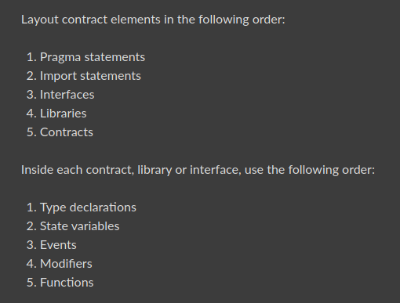
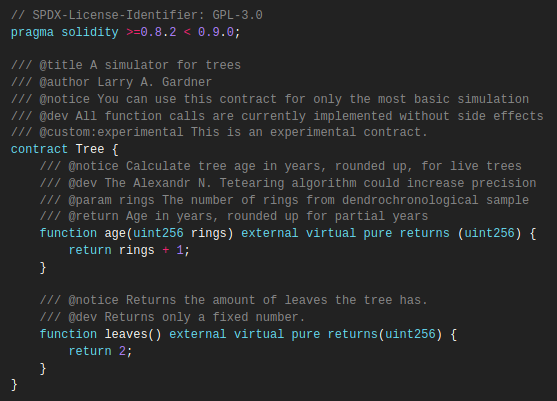
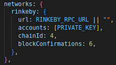
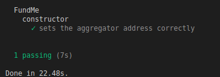
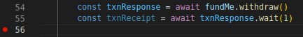

**Solidity Style Guide**

We're going to clean up our FundMe contract a little bit to make it look a little bit more professional.While we go through this we're going to learn why some of these conventions exists including learning a little bit of low level solidity.Let's go ahead and tweak a little bit of our contracts here.

Now when I'm talking about tweaking the contract to make it look professional, I'm talking about [solidity style guide](https://docs.soliditylang.org/en/latest/style-guide.html).There are some conventions of naming and ordering that we can follow to make our code look a little bit better.

The main thing we wanna look out is the [order of the layout](https://docs.soliditylang.org/en/latest/style-guide.html#order-of-layout).



So let's go in our code and make sure we're up to speed.We want our pragma first, we did exactly that.Then our imports, we've those too.Something that's not in the style guides is error codes which we generally want next.As of recent, it's sort of becoming a best practice to add the name of your contract and the name of your error, whenever you're running into an error.This makes it alot easier to understand which contract is throwing the error.So for our FundMe contract, we're going to say:

```solidity
import "./PriceConverter.sol";

error FundMe__NotOwner();

contract FundMe {}
```

then in our revert, set it like this:

```solidity
modifier admin() {
        // require(msg.sender == owner);
        if (msg.sender != owner) revert FundMe__NotOwner();
        _;
    }
```

This way when if we ever run into FundMe_NotOwner error, we know the error is coming from the FundMe contract not from the AggregatorV3Interface or the PriceConverter.So that's how we want to write our error code.

If we'd any interface or libraries not imported, we'll add them after `error FundMe_NotOwner()`.Then Finally we'll add our contract which is our FundMe contract.

Next thing we want to learn about as far as style guides go is `[Natspec](https://docs.soliditylang.org/en/latest/natspec-format.html#natspec)`.NatSpec stands from Ethereum Natural Language Specification Format and it's basically a way of documenting our code inspired by `Doxygen`.It uses Doxygen style comments and tags who help document our code.

Whenever we've a contract or function that needs documentation, we can add some syntax that look like this:



So for example if we wanted to add to our code, we can add a comment explaining the FundMe contract.To start a piece of NatSpec, you can do `///` or `/** */`.Everything you put inside of the comment section basically get's turned into a comment.For the start of our contract, we'll do `@title` to explain basically what this contract is.

```solidity
/**@title A contract for crowd funding
 */
```

We can add another * and then `@author` which is going to be your name.

```solidity
/**@title A contract for crowd funding
 * @author Spoods
 */
```

Then we'll add a notice which is kind of a note to people.

```solidity
/**@title A contract for crowd funding
 * @author Spoods
 * @notice This is to showcase a funding contract
 */
```

We can also add `@dev` which is a note specifically to developers.

```solidity
/**@title A contract for crowd funding
 * @author Spoods
 * @notice This is to showcase a funding contract
 * @dev This implements pricefeed as our Library
 */
```

The reason that we want to add these tags is we can use the NatSpec to automatically create documentation for us.If we download solc, we can actually run `solc --userdoc --devdoc FundMe.sol` to automatically generate documentation.You can use the NatSpec for as many as or few functions as you like.

Now that we're inside the contract, we can follow the order inside the contract.WE're first going to start with `type declarations` which we don't have any except for the fact that we're using PriceConverter for uint256.Next after our type declarations, we're going to do `state variables`.In this state variables section, this is where we're actually going to change the name of some of our state variables.Now in the solidity style guides kind of adhere to the naming styles.We used upper and lower case, used total caps.However these state variable of our contract are going to change in the functure in this section.However for now we're going to leave them as they're because the reason why we're going to change them isn't going to be quite clear yet.

After state variables comes events and modifiers.We don't have any events but we do have a modifier.So we'll cut our modifier and after state variables, we'll put modifiers there.

```solidity
    // type declarations
    using PriceConverter for uint256;
    
    // state variables
    mapping(address => uint256) public addressFundedAmount;
    address[] public funders;
    address public immutable owner;

    AggregatorV3Interface public priceFeed;

    // modifiers
    modifier admin() {
        // require(msg.sender == owner);
        if (msg.sender != owner) revert FundMe__NotOwner();
        _;
    }
```

Then we've all of our functions.We actually want to group our functions in this order:
- constructor
- receive
- fallback
- external 
- public
- internal
- private
- view / pure

So our functions order looks like this:

```solidity
constructor(address priceFeedAddress) {}

receive() external payable{}

fallback() external payable{}

function fund() public payable {}

function withDraw() public admin {}
```

If we want we can do the syntax of NatSpec for each functions.If we have parametes, you can do `@param` and say what the parameters is and if we have returns, we can say `@returns` or `@return` and whatever it returns.

We'll come to that state variables bit in a while.

**Testing FundMe**

Let's go ahead and start write some tests and after we write these tests, we're actually going to run that gas estimator and using that gas estimator, we're gonna go back and update the contract one more time to make this even cheaper to use and work with.Remeber that's the advantages of writing tests is how we can optimize our contracts to be even faster, more gas efficient etc.We want to make sure that we write really good tests and this is going to one of our first jumps into these more professional test setups.

In our last section we went over a really a minimalistic test however when we get bigger and bigger projects, we are going to want to start testing more and more different things.we're going to more and more into atleast two different types of testing.So if we `cd test/` into our test folder, we're going to make one directory called "staging" and another called "unit".

Unit testing is a software testing method by which individual units of source code are tested.Basically what we wanna do is in our contracts, we want to test minimal portions of our code to make sure that they work correctly.Then once our small pieces of the test work, we want to do a staging test or maybe an integration test.This might be where we run our code on a testnet or some actual network.You can think of a staging test as kind of last stop before you deploy to a mainnet.

Now unit test can be done with either local hardhat or forked hardhat network.We'll talk forked network later but right now let's build these unit tests.These are basically going to be what we saw in out last section.So let's jump in and write some of these unit tests.So in our test/unit let's create a new file called "FundMe.test.js".Our test here is going to look little bit different.We're actually going to use hardhat deploy to automatically set up our tests as if both of these deploy functions had been run.So let's go ahead and get this started.

```javascript
describe("FundMe", function () {
    beforeEach()
})
```

Now since we want to unit test this, we're going to go a little bit heavier on the test here then with our last project.If we run `yarn hardhat test` right now, we're going to get 0 passing.If we run `yarn hardhat coverage`, we're going to get lots of missing testing.So let's try to cover some more lines with our tests and one way we can do that is actually we can group our tests based off of different function.So let's have our first set of tests be around constructor.To do that inside of our first describe, we can add another describe and have this describe be just the constructor.

```javascript
describe("FundMe", function () {
    describe("constructor", function () {
    })
})
```

This larger scope will be for the entire FundMe contract and everything inside constructor describe will be just for the constructor.

But before we even work on the describe, we probably want to deploy our FundMe contract.

```javascript
describe("FundMe", function () {

    beforeEach(async function () {
        
    }) 

    describe("constructor", function () {

    })
})
```

and we're going to deploy contract using hardhat deploy. Since we use hardhat-deploy, our FundMe contract will come even with our mocks and everything.So above the beforeEach, let's do:

```javascript
let fundMe
```

and we're going to deploy FundMe.We're going to deploy our FundMe contract is first by pulling in our deployments objects from hardhat-deploy.So we'll do:

```javascript
const { deployments } = require("hardhat")
```

and this deployments object has a function called `fixture` which allows us to basically run our entire deploy folder with as many tags as we want.You notice that I added "all" tags in both of our scripts.

```javascript
module.exports.tags = ["all", "mocks"]
```

This means that in this deployments.fixture, I'll run through our deploy scripts on our local network and deploy all of our contracts that we can use them in our scripts and in our testing and we can deploy everything in that deploy folder with just this one line.

```javascript
    let fundMe
    beforeEach(async function () {
        await deployments.fixture(["all"])
    }) 
```

Now once all of our contracts have been deployed, we can start getting them.

```javascript
beforeEach(async function () {
        await deployments.fixture(["all"])
        fundMe = await ethers.getContract("FundMe")
    }) 
```

This will give me the recently deployed contract.

Now we're going to make bunch of transactions in our FundMe to test it of course.we can also tell ethers which account we want connected to FundMe.So I can say:

```javascript
const { deployments, ethers, getNamedAccounts } = require("hardhat")

describe("FundMe", function () {
    let fundMe
    beforeEach(async function () {
        const { deployer } = await getNamedAccounts()
        await deployments.fixture(["all"])
        fundMe = await ethers.getContract("FundMe")
    }) 

    describe("constructor", function () {
    })
})
```

In our deploy scripts, we imported getNamedAccounts inside of our input parameters for our deploy functions.Remember getNamedAccounts and deployments was abstracted from the hardhat runtime environment.

Now we can connect our deployer to our FundMe account.So whenever we call a function with fundMe, it'll automatically be from that deployer account.

```javascript
fundMe = await ethers.getContract("FundMe", deployer)
```

Another way you can get different accounts directly from your hardhat config is:

```javascript
const accounts = await ethers.getSigners()
```

`ethers.getSigners` is going to return whatever is in the accounts section of your network.



If you're on your default network hardhat, it's going to give you a list of 10 fake accounts that we can work with.You then ofcourse can do somthing like:

```javascript
accountZero = accounts[0]
```

So now we've our FundMe contract, let's go ahead and write some tests for testing the constructor and we probably want to use this deployer object.So we'll do:

```javascript
describe("FundMe", function () {
    let fundMe, deployer
    beforeEach(async function () {
        // const accounts = await ethers.getSigners()
        // accountZero = accounts[0]
        deployer = (await getNamedAccounts()).deployer
        await deployments.fixture(["all"])
        fundMe = await ethers.getContract("FundMe", deployer)
    }) 
```

We're wrapping getNammedAccounts to just get the deployer.

Now we'll create our first test. 

```javascript
describe("constructor", function () {
        it("sets the aggregator address correctly", async function () {
            const response = await fundMe.priceFeed()
        })
    })
```

then we want to make sure the priceFeed is going to be the same as our MockV3Aggregator because we're going to to running the test locally.So we should get our MockV3Aggregator on top.

```javascript
    let fundMe, deployer, mockV3Aggregator
    beforeEach(async function () {
        // const accounts = await ethers.getSigners()
        // accountZero = accounts[0]
        deployer = (await getNamedAccounts()).deployer
        await deployments.fixture(["all"])
        fundMe = await ethers.getContract("FundMe", deployer)
        mockV3Aggregator = await ethers.getContract("MockV3Aggregator", deployer)
    }) 
```

So we want to say:

```javascript
it("sets the aggregator address correctly", async function () {
            const response = await fundMe.priceFeed()
            assert.equal(response, mockV3Aggregator.address)
        })
```

and of course we want to say :

```javascript
const { assert } = require("chai")
```

Now let's go ahead and try this out:

`yarn hardhat test`



This means that we're indeed assigning the price feed address correctly to the MockV3Aggregator.I think for now that's we really want to do for our constructor.

WE're going to skip writing tests for fallback and receive for now.

we're going to move to fund and writing some tests.First thing we should look at is the require statements.We should write a test to see if the contract actually does fail if not enough ETH is send.So let's go ahead and do it:

```javascript
describe("fund", function () {
        it("Fails if you don't send enough ETH", async function() {
        })
    })
```

Now how do we test to see if something fails?Right now we've done assert equals but if something fails, we might run into an issue.So for example if I run `await fundMe.fund()` but I don't pass any value to the transaction.Let's see what happens.

"Error: VM Exception while processing transaction: reverted with reason string 'You need to spend more ETH!'" 

Our test is actually going to break.We want this to break but we want to tell our test that this is okay.This is where waffle testing comes into play.With waffle and testing, we can use the `expect` keyword and expect transactions to be reverted and for transactions to fail.So instead of using assert, we're actually going to run :

```javascript
 describe("fund", function () {
        it("Fails if you don't send enough ETH", async function() {
            await expect(fundMe.fund()).to.be.revertedWith("You need to spend more ETH!")
        })
    })
```

We need to pass the exact reverted error otherwise it throws an error.We also need to import expect from chain.

```javascript
const { assert, expect } = require("chai")
```

Now we've a way to both assert things and expect things to fail.

Now we probably want to update "addressFundedAmount" data structure.   

```javascript
        it("Updates the amount funded data structure", async function () {
        })
```

Here we're going to need to call fundMe.fund however we need to pass some value with the transaction.For now we'll just hard code the value that we're going to send.

```javascript
const sendValue = "1000000000000000000" // 1 ETH
```

Another way we can write this though is we can ethers utility to make this a little bit easier to read.

```javascript
// const sendValue = "1000000000000000000" // 1 ETH
const sendValue = ethers.utils.parseEther("1")
```

This parseEther utility converts this 1 into that 1 with 18 zeros.So this is the send value that we're going to use for our fund.

```javascript
await fundMe.fund({ value: sendValue })
```

and this is definitely going to be more than our minimum USD of 50.So after we call this fund function, we'll say:

```javascript
const response = await fundMe.addressFundedAmount(deployer)
```

addressFundedAmount is a mapping of each address and how much they actually funded.So if we use the deployer address, it should give us the amount that we actually sent.Now we can run assert.

```javascript
it("Updates the amount funded data structure", async function () {
            await fundMe.fund({ value: sendValue })
            const response = await fundMe.addressFundedAmount(
                deployer
            )
            assert.equal(response.toString(), sendValue.toString())
        })
```

response is going to be the BigNumber version of how mucn has been funded by that account.

We can run just this one test by running:

`yarn hardhat tets --grep "amount funded"`

Are we all done testing our fund function? well, probably not.Well we're also adding funders to funders array.So let's go ahead and test for that.

```javascript
it("Adds funder to array of funders", async function () {
            await fundMe.fund({value: sendValue})
            const funder = await fundMe.funders(0)
            assert.equal(funder, deployer)
        })
```

Now let's go ahead and move on to the withdraw function.

```javascript
describe("withdraw", function () {
    })
```

Let's see what withdraw funtion does.Only the owner of the contract is going to be able to get the balance back and also going to reset all of the amounts that each one of these users is done.so let's go ahead and do some withdrawing.

Now in order for us to test withdraw, we probably first want the contract to actually have some money in it.So what we can do actually is we can add another beforeEach in the describe to automatically fund the contract before we run any tests.So we can say :

```javascript
describe("withdraw", function () {
        beforeEach(async function() {
            await fundMe.fund({value: sendValue})
        })
    })
```

Now for all of our tests in this withdraw scope, we're first going to fund it with ETH.This is going to be a longer test so I'm arranging this way:

```javascript
it("Withdraw ETH from single founder", async function() {
            // Arrange
            // Act 
            // Assert
        })
```

It's sort of a way to think about writing tests.You want to arrange the test, then you want to act and you want to run the assert. 

We want to actually check that we're currently withdrawing the ETH from the single founder.So first we're going to get the starting balance of the FundMe contract and the starting balance of the deployer. 

```javascript
// Arrange
const startingFundMeBalance = await fundMe.provider.getBalance(fundMe.address)
```

So we're going to start with the balance of the FundMe after it's been funded with some ETH.We're also going to get starting balance of the deployer.

```javascript
const startingDeployerBalance = await fundMe.provider.getBalance(deployer)
```

So we're getting the starting balance of the FundMe and the deployer so that we can test later on how much these numbers have changed based off of what happens when we call withdrawl function.Now we've done a little bit of setup, we can actually run this withdraw function.We can do that act here.

```javascript
const txnResponse = await fundMe.withdraw()
const txnReceipt = await txnResponse.wait(1)
```

Now we should be able to check to see that the entire fundMe balance has been added to the deployer balance.So now we can say:

```javascript
// Act 
const txnResponse = await fundMe.withdraw()
const txnReceipt = await txnResponse.wait(1)
            
const endingFundMeBalance = await fundMe.provider.getBalance(fundMe.address)
const endingDeployerBalance = await fundMe.provider.getBalance(deployer)
```

And now we can just check to see if the numbers work out here.

```javascript
// Assert
assert.equal(endingFundMeBalance, 0)
assert.equal(startingFundMeBalance + startingDeployerBalance, endingDeployerBalance)
```

Now couple of notes here.Since `startingFuneMeBalance` is calling from the blockchain, it's going to be of type BigNumber.We want to use `BigNumber.add` actually instead of the plus sign here just because it'll make working with our BigNumbers a little bit easier.

```javascript
assert.equal(startingFundMeBalance.add(startingDeployerBalance), endingDeployerBalance)
```

Other thing about this is when we call "withdraw", our deployer did what? Our deployer spent a little bit of gas.So equals in an assert isn't accurate.We actually also need to calculate the gas cost.So we'd need to do:

```javascript
// Assert
assert.equal(endingFundMeBalance, 0)
assert.equal(startingFundMeBalance.add(startingDeployerBalance).toString(), endingDeployerBalance.add(gasCost).toString())
```

**Breakpoints & Debugging**

Now we don't have gasCost.So let's figure out how to get the gas cost from the transaction so we can add it to our "endingDeployerBalace" to run the assertion.We can find the gas cost from the "txnReceipt".

What we can do with VS code is create some breakpoints.



Click on the line that you want to create a breakpoint and the red dot will appear.Breakpoint stops the script at that line and allows us to drop into something called debug console and see all the variables that are happening at the time.We want to look at `txnReceipt` and see if the total gas cost is in there.This is also incredibly helpful for dropping into tests and dropping into scripts and seeing exactly what's going on that's wrong.

We can move down to "`run and debug`" section.


and click `JavaScript debug terminal` which will create a new terminal in our terminal section.Now what happens here is that if we run `yarn hardhat test`, it'll run our testing and everything but when it hits the breakpoint, it'll stop.Currently there's no gas cost so remove it for now so that we can compile and work with everything.

```javascrip
assert.equal(startingFundMeBalance.add(startingDeployerBalance).toString(), endingDeployerBalance)
```
If we run `yarn hardhat test`, it's going to say "Debugger has been attached", start running our tests and going to stop at the breakpoint.If we look at the variable section on the left hand side, we can see ton of the variables that are in there.If we go to the debug console, we can type `txnReceipt` and can see ton of information about that txnReceipt object.We're looking for anything to do with the gas.Looks like there is.There's a gasUsed BigNumber and also an effectiveGasPrice.So the amount of gasUSed * effectiveGasPrice is going to give us all the money that we paid for gas here.

Now we can exit the debugger, trashcan the javascript debugger,remove the breakpoint and we'll grab those two variables.

**Gas**

We can pull them right our of the txnReceipt object.

```javascript
const { gasUsed, effectiveGasPrice } = txnReceipt
```

Now that we've these object, we can create the total gasCost.

```javascript
const gasCost = gasUsed * effectiveGasPrice
```

Since these are both BigNumbers so we can use BigNumber function.

```javascript
const gasCost = gasUsed.mul(effectiveGasPrice)
```

Now that we've this total gas cost, in our assert we can say:

```javascript
 assert.equal(
                startingFundMeBalance.add(startingDeployerBalance).toString(),
                endingDeployerBalance.add(gasCost).toString()
            )
```

First off the fundMe comes with the provider.we could have also done `ethers.provider.getBalance` but we're using `fundMe.provider` because we're using the provider of the fundMe contract.We do the same thing with `startingDeployerBalance`.The reason that we need the starting balances is because we wanted to compare it to the ending balances to see if all the money went to the right places.

We then call the withdraw function and from the `txnReceipt`, we grabbed the gasUsed and the gasPrice.If you want to debug your JavaScript code, you can add a breakpoint.Using debugger, we pulled the gasUsed and effectiveGasPrice from the txnReceipt and used them to get the total gas cost of the transaction.We then got the ending fundMe balance and the ending deployer balance and used all those variables to make sure all the money went to the right places.

We can check this bu running:

`yarn hardhat test --grep "Withdraw ETH"`

**Console.log & Debugging**

Now another incredibly powerful debugging tool that we're not really going to go over here but it's important to know about because it's going to be really helpful is that you can actually use `console.log` in your solidity with [hardhat](https://hardhat.org/tutorial/debugging-with-hardhat-network#solidity-console-log).If you're inside of a hardhat project, you just import `"hardhat/console.log"` and then right in your solidity, you can do console.log and type pretty much whatever you want.When you execute the console.log in solidity,similar to how we do in JavaScript those will actually console.log out to your terminal.

**Testing FundMe II**

So we tested that withdrawing ETH when there's a single funder works perfectly.Let's test withdrawing ETH, if there are multiple funders. 

```javascript
it("allows us to withdraw with multiple funders", async function(){
})
```

Let's do this `await fundMe.fund({ value: sendValue })` but with a number of different accounts.So we can create a whole bunch of different accounts by saying:

```javascript
it("allows us to withdraw with multiple funders", async function () {
            const accounts = await ethers.getSigners()
        })
```

We can loop through these accounts and have each one of these accounts call the fund function.We're going to do this with an for loop.We're going to start with the first index of accounts because 0th will be the `deployer`.

```javascript
  for (let i = 1; i < 6; i++) {
                const fundMeConnectedContract = await fundMe.connect(
                    accounts[i]
                )
            }
```

So we need to call the connect function because right now our fundMe contract is connected to the deployer account and anytime we call a transaction with fundMe, the deployer is the account that is calling the transaction.

```javascript
fundMe = await ethers.getContract("FundMe", deployer)
```

We need to create new objects to connect to all of these different accounts.

```javascript
// Arrange
            const accounts = await ethers.getSigners()
            for (let i = 1; i < 6; i++) {
                const fundMeConnectedContract = await fundMe.connect(
                    accounts[i]
                )
                await fundMeConnectedContract.fund({ value: sendValue })
            }
```

Then same as we did above, we need to grab those starting balances.

```javascript
const startingFundMeBalance = await fundMe.provider.getBalance(
                fundMe.address
            )
const startingDeployerBalance = await fundMe.provider.getBalance(
                deployer
            )
```

Now we're going to move into Act.I'm going to call that withdraw function again.We're going to do everything as we did before by getting the txnReceipt and the gasCost so we can get everything correct.

```javascript
 // Act
            const txnResponse = await fundMe.withdraw()
            const txnReceipt = await txnResponse.wait(1)
            const { gasUsed, effectiveGasPrice } = txnReceipt
            const gasCost = gasUsed.mul(effectiveGasPrice)
```

Once we've done the Act, we can move on into Assert and we're going to do very similar things to what we did above.

```javascript
// Assert
            const endingFundMeBalance = await fundMe.provider.getBalance(
                fundMe.address
            )
            const endingDeployerBalance = await fundMe.provider.getBalance(
                deployer
            )
            assert.equal(endingFundMeBalance, 0)
            assert.equal(
                startingFundMeBalance.add(startingDeployerBalance).toString(),
                endingDeployerBalance.add(gasCost).toString()
            )
```

But we also want to make sure the funders are reset properly.To do that we can check to see that if looking at the 0th position throws an error.

```javascript
// Make sure that the funders array is reset properly
await expect(fundMe.funders(0)).to.be.reverted
```

Then we want to loop through all the accounts and make sure that in our mapping all their amounts are zero.

```javascript
for (i = 1; i < 6; i++) {
                assert.equal(
                    await fundMe.addressFundedAmount(accounts[i].address),
                    0
                )
            }
```

We're making sure that all of these mappings (addressFundedAmount) are correctly updated to zero.So let's go ahead and test this:

`yarn hardhat test --grep "withdraw with multiple funders"`

The otherthing that we want to test is our admin modifier working's.We want only the admin(owner) to be able to withdraw the funds from here.So we'll create a new section .

```javascript
it("Only allows the owner to withdraw", async function () {
            const accounts = await ethers.getSigners()
            const attacker = accounts[1]
            const attackerConnectedContract = await fundMe.connect(attacker)
            await expect(attackerConnectedContract.withdraw()).to.be.reverted
        })
```

This means when other accounts tries to withdraw, it automatically gets reverted.

Now we can be more explicit to make sure that the correct error code is being thrown, not just that it's reverted.It can be reverted because they sent eth or they did something weird.We want to make sure it reverted with our specific error code.

```javascript
await expect(
                attackerConnectedContract.withdraw()
            ).to.be.revertedWith("FundMe__NotOwner")
```

**Storage in Solidity**

We've some basic unit tests here and we're going to write some staging tests pretty soon but before we actually do that,let's go ahead and add the gas estimator and we'll see how much gas these contracts and these functions are taking.We'll turn teh gasReposter to true but we won't do coinmarketcap.

```javascript
gasReporter: {
        enabled: true,
        outputFile: "gas-report.txt",
        noColors: true,
        currency: "USD",
        // coinmarketcap: COINMARKETCAP_API_KEY,
        token: "MATIC",
    },
```

Now re-run all of your test.

`yarn hardhat test`

Well it looks like the fund function is taking a decent chunk of gas, withdraw function taking some gas too.We can see the min, average and the max.Average gas release is lot more than we've expected.Is there a way for us to make it a little cheaper?


We go back to our FundMe contract.We're going to look at first gas optimization technique you can take to drop the gas number down and it has to do in our FundMe contract called state variables and how they're actually stored and how the contract actually keeps track of all the stuff.

Let's talk about what happens when we actually save or store these state variables.Whenever we've these global variables, they're stuck into something called `storage`.


We can think of storage as a big giant array or list of all the variables that we actually create.So when we say we've some contract called "FunWithStorage" and a variable called "favoriteNumber".We're basically saying we want the favoriteNumber to persist.The way it persist is it gets stored in the place called storage.A storage box is a giant list associated with the contract where every single variable and every single value in the storage section is slotted into a 32 byte long slot in the storage array.For example the number 25 in it's bytes implementation is 0x000 with a tons of zeros19.This is the hex version of the uint256 that's why we do so much hex translation, the bytes implementation of uint256.Each slot increments just like an array starting from zero.


For example our next global variable just gets slotted at the next slot that's available.Booleans gets transformed from their bool version to their hex and we modified our some bool variable to be true and hex edition of the true boolean is 0x00...01.Everytime you save an additional global variable or more correctly storage variables, it takes up an additional storage slot.

What about variable that're dynamic in length?


Well for dynamic values like a dynamic array or a mapping, elements inside the array or inside the mapping are stored using some type of hashing function.The object itself does take up a storage slot but it's not going to be the entire array.For example myArray variable here has storage slot two doesn't have the entire array in stoarge slot two.What it has actually is just the array length.The length of the array is stored at storage slot two.But for example if you do `myArray.push(222)`, we do some hashing function and we'll store the number 222 at that location in storage.The hex of 222 is 0x00..00de.This is good and intentional because 32 bytes maynot be nearly big enough to store my array if our array gets massive and it wouldn't make sense for to put the elements inside the array at subsequent number because again the size of the array can change and you're never going to be sure how many subsequence that you need.For mappings it does have a storage spot as well similar to array, but it's just blank.It's blank intentionally so that solidity knows there's a mapping here and it needs a storage slot for attaching function to work correctly.

Now interestingly, constant variables and immutable variables don't take up spots in stoarge.


The reason for this is because contant variables are actually part of the contracts byte code itself.You can imagine what solidity does is anytime it sees constant variables name, it just automatically swaps it out with whatever number it actually is.You can kind of think as NOT_IN_STORAGE is just a pointer to 123 and it doesn't take up a storage slot.


When we have variables inside of a function, those variables only exist for the duration of the function.They don't stay inside the contract.They don't persist.So variables inside the functions like newVar don't get added to storage.They get added in their own memory data structure which gets deleted after the function has finished running.

Well why do we need memory keyword especially when it comes to strings?

Strings are technically the dynamically sized array and we need to tell solidity we're going to do this on the storage location or in the memory location where we can just wipe it.

Arrays and mappings can take up lot more space so solidity just want to make sure where are we working with this.Is it storage? Is it memory?


**Gas Optimizations using storage keyword**

Anytime you read or write to and from the storage, you send a ton of gas.Opcodes represents what the machine code is doing and they represent how much computational work it takes to actually run our code and do stuff with our code.The way that gas is actually calculated is by the [opcodes](https://github.com/crytic/evm-opcodes).We can see on the link exactly how much each opcodes cost.For example anytime we add, it costs 3 gas, anytime we multiply that's 5 gas.We have all of these opcodes that cost different amount of gas.The `SLOAD` and `SSTORE` cost a ton of gas.These are two of the most important opcodes which stands for storage load and storage store respectively.Anytime one of these opcode fires, we're spending 20,000 or 800 gas.As developers, anytime we work with some stuff in storage, we want to go "This is about to cost me a lot of gas" and the best convention, to make sure that we know that we're working with a storage variable and we're about to spend a lot of gas is to append `s_` right before them which stands for storage.

```javascript
// state variables
    mapping(address => uint256) public s_addressFundedAmount;
    address[] public s_funders;

    // Could we make this constant?  /* hint: no! We should make it immutable! */
    address public immutable i_owner;
    uint256 public constant MINIMUM_USD = 50 * 10**18;

    AggregatorV3Interface public s_priceFeed;
```

Now that we've updated everything in the code, we can read through our code and go "Where are we reading and writing to storage way more often then we probably need to?"That's where we get to the withdraw function.We can see we're doing a for loop and everytime we loop, we're doing compare with `s_funders.length`.This means the longer our funder array is, the more times we're going to be reading from storage, that's incredibly expensive.We're reading from storage and saving it to the memory variable(`address funder = s_funder[funderIndex]`) and then updating our storage variable with it(`s_addressFundedAmount[funder] = 0`).Then we've to reset our funders array, there's really no way around it.

We could probably create a withdraw function that's a lot cheaper.So let's go ahead and create a function called "cheaperWithdraw".We don't want to keep reading from storage inside the loop.

```javascript
for (uint256 funderIndex = 0;funderIndex < s_funders.length;funderIndex++) {
    address funder = s_funders[funderIndex];
}
```
We can read the entire array into memory one time and then read from memory instead of constantly reading from storage.Quick note `mappings can't be in memory.`We can read and write from memory variable much much cheaper and update storage when we're all done.

```javascript
 function cheaperWithdraw() public payable admin {
        address[] memory funders = s_funders;
        for (
            uint256 funderIndex = 0;
            funderIndex < funders.length;
            funderIndex++
        ) {
            address funder = funders[funderIndex];
            s_addressFundedAmount[funder] = 0;
        }
        s_funders = new address[](0);

        (bool callSuccess, ) = payable(msg.sender).call{
            value: address(this).balance
        }("");
        require(callSuccess, "Call failed");
    }
```

Let's go back to our test and let's run same multi test but with our cheaper function.Copy the withdraw section of test,change the name inside double quote and at one call we've used withdraw, change it to cheaperWithdraw.

```javascript
it("cheaper withdraw testing...", async function () {
    const txnResponse = await fundMe.cheaperWithdraw()
})
```
change funders to s_funders, priceFeed to s_priceFeed and addressAmountFunded to s_addressAmountFunded in our test script.

If we're successful in making our withdraw function cheaper, we'll run `yarn hadrhat test` to see the result.

Now if we look at our gas report, we can see the difference between cheaperWithdraw and the withdraw.We see cheaperWithdraw on average was more expensive than our regular withdraw and the reason for this is actually, our cheaperWithdraw we only tested on the multi withdraw.So we had to reset many more accounts.So average was technically its maximum as well and if we compare the maximum of cheaperWithdraw to the maximum of the withdraw, it looks cheaper withdraw was indeed cheaper.

**Solidity Chainlink Style Guide**

Right now all of our state variables are public.Actually internal and private variables are also cheaper gas wise and we don't need to make every single one of our variables public, because anybody could read them off the chain anyways.So one more refactoring we're going to do is we're going to set the visibility of the state variables to private or internal and then we'll create getters at the bottom of our function.

MINIMUM_USD we want to keep it as public because we want other people to know what the minimum usd of our contract is without having to go right through storage.The owner of our contract isn't important for others to know or other contracts to know so we can make it private.

```javascript
address private immutable i_owner;
```

Then at the bottom add a function getOwner.

```javascript
function getOwner() public view returns (address) {
        return i_owner;
    }
```

s_funders can be private as well.

```javascript
address[] private s_funders;
function getFunder(uint256 index) public view returns (address) {
        return s_funders[index];
    }
```

s_addressFundedAmount can also be private.

```javascript
mapping(address => uint256) private s_addressFundedAmount;
function getAddressFundedAmount(address funder)
        public
        view
        returns (uint256)
    {
        return s_addressFundedAmount[funder];
    }
```

s_priceFeed can also be private.

```javascript
AggregatorV3Interface private s_priceFeed;
function getPriceFeed() public view returns (AggregatorV3Interface) {
        return s_priceFeed;
    }
```

The reason why we did this is because we want to have this `s_` so that we as a developers could know it as a storage variable but we don't want people who interact with our code to have to deal with this `s_` stuff and we want them to give an API that makes sense and that's easy and readable.Also changing the visibility can save gas in the long run.

Of course we do need to upgrade the test one more time. 

change s_funders to getFunder, s_addressFundedAmount to getAddressFundedAmount and s_priceFeed to getPriceFeed.

Let's run test to make sure that we refactor it correctly.

`yarn hardhat test`

One more gas optimization we could make and an optimizations for errors as well is we could update all of our requires to instead be revert because with our requires, we're actually storing the massive string on chain.Error codes are much cheaper.

```javascript
function fund() public payable {
        // require(
        //     msg.value.convert(s_priceFeed) >= MINIMUM_USD,
        //     "You need to spend more ETH!"
        // );

        if (msg.value.convert(s_priceFeed) < MINIMUM_USD) {
            revert FundMe__BalanceNotEnough();
        }
        // require(PriceConverter.getConversionRate(msg.value) >= MINIMUM_USD, "You need to spend more ETH!");
        s_addressFundedAmount[msg.sender] += msg.value;
        s_funders.push(msg.sender);
    }
```

**Staging Tests**

Let's now write some staging tests and these are the test that we can use on an actual testnet.This is a test that we're basically going to run after we've deployed some code just to see if everything is working approximately the way we want it to.We'll create a new file inside staging directory called "FundMe.staging.test.js" and it's going to look really similar to what we're doing with our unit tests.

```javascript
const { getNamedAccounts, ethers } = require("hardhat")

describe("FundMe", async function () {
    let fundMe, deployer
    const sendValue = ethers.utils.parseEther("1")
    beforeEach(async function () {
        deployer = (await getNamedAccounts()).deployer
        fundMe = await ethers.getContract("FundMe", deployer)
    })
})
```

We're not going to do any `fixture` like we did in our unit tests because in our staging test, we're assuming that it's already deployed at `fundMe` and also we don't need a mock because on a staging, we're assuming that we're on a testnet.

we can actually wrap the whole describe to make sure that we're on a testnet by using our helper config and looking for our developmentChains.We only want to run our describe bit if we're on a development chain.

```javascript
const { developmentChains } = require("../../helper-hardhat-config")

developmentChains.includes(network.name)
    ? describe.skip
    : describe("FundMe", async function () {}
```

[ternary operator](https://developer.mozilla.org/en-US/docs/Web/JavaScript/Reference/Operators/Conditional_Operator)

Now we're only going to run this if we're not on a development chain and we'll do the exact same thing in our unit test.

```javascript
// unit test
const { developmentChains } = require("../../helper-hardhat-config")
!developmentChains.includes(network.name)
    ? describe.skip
    : describe("FundMe", async function () {}
```

```javascript
  it("allows people to fund and withdraw", async function () {
              await fundMe.fund({ value: sendValue })
              await fundMe.withdraw()
              const endingBalance = await fundMe.provider.getBalance(
                  fundMe.address
              )
              assert.equal(endingBalance.toString(), "0")
          })
```

`yarn hardhat deploy --network rinkeby` after it's all deployed, we'll run our staging test.

`yarn hardhat test --network rinkeby`

**Running Scripts on a Local Node**

Now we've written all these test, we can also write a script called "fund.js" inside scripts directory and this is going to be really similar to tests.In the future, if we want to just fund one of our contracts very quickly, we can run this script.

```javascript
const { getNamedAccounts, ethers } = require("hardhat")

async function main() {
    const { deployer } = await getNamedAccounts()
    const fundMe = await ethers.getContract("FundMe", deployer)
    console.log("Funding Contract...")
    const txnResponse = await fundMe.fund({
        value: ethers.utils.parseEther("1"),
    })
    await txnResponse.wait(1)
    console.log("Funded!")
}

main()
    .then(() => process.exit(0))
    .catch((error) => {
        console.error(error)
        process.exit(1)
    })

```

We can run this script by running `yarn hardhat node`, will run a local node with all of our contracts deployed and we can run scripts by `yarn hardhat run scripts/fund.js --network localhost`

Let's now write a withdraw script:

```javascript
const { getNamedAccounts, ethers } = require("hardhat")

async function main() {
    const { deployer } = await getNamedAccounts()
    const fundMe = await ethers.getContract("FundMe", deployer)
    console.log("Withdrawing...")
    const txnResponse = await fundMe.withdraw()
    await txnResponse.wait(1)
    console.log("Withdraw completed!")
}

main()
    .then(() => process.exit(0))
    .catch((error) => {
        console.error(error)
        process.exit(1)
    })
```

**Adding scripts to your package.json**

In our package.json, we can add scripts section to make our lives lot easier and condense all these long tests into a yarn script for us.

```javascript
"scripts": {
    "test": "yarn hardhat test",
    "test:staging": "yarn hardhat test --network rinkeby",
    "lint": "yarn solhint 'contracts/*.sol'",
    "lint:fix": "yarn solhint 'contracts/*.sol' --fix",
    "format": "yarn prettier --write .",
    "coverage": "yarn hardhat coverage"
  }
```


