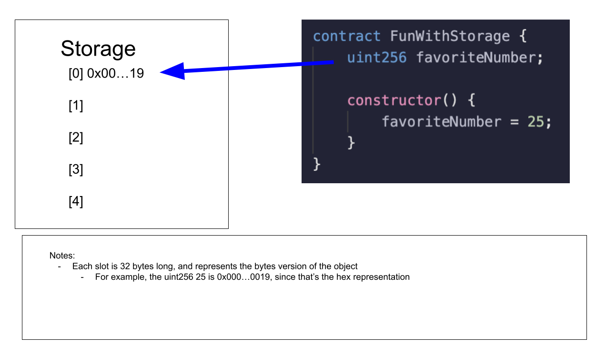
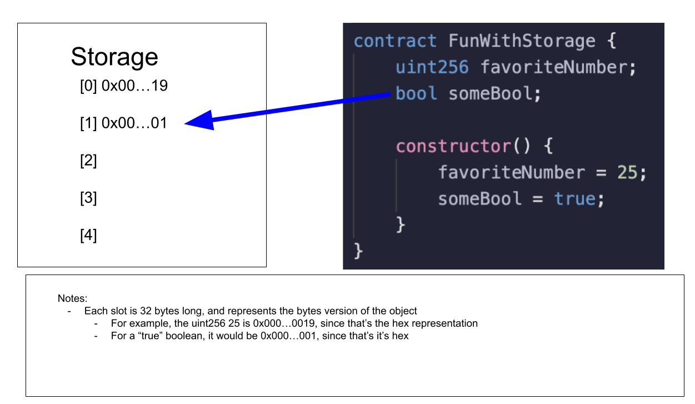
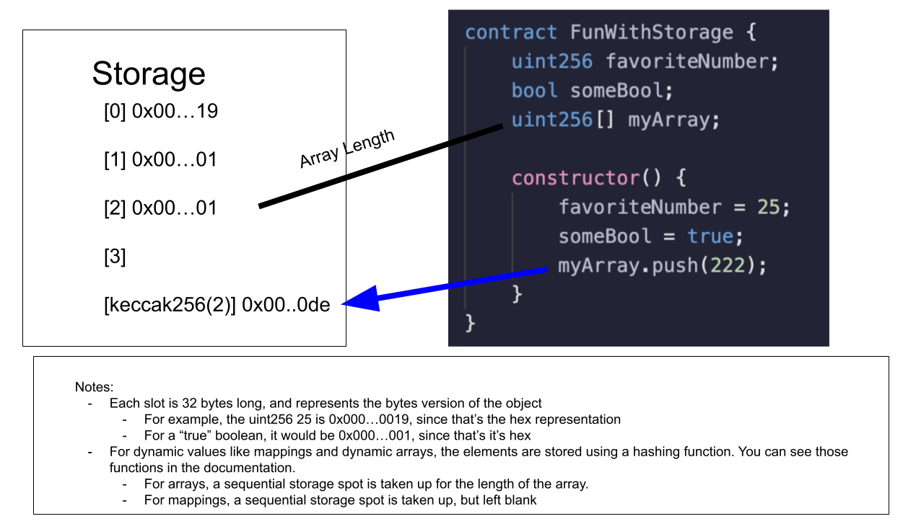
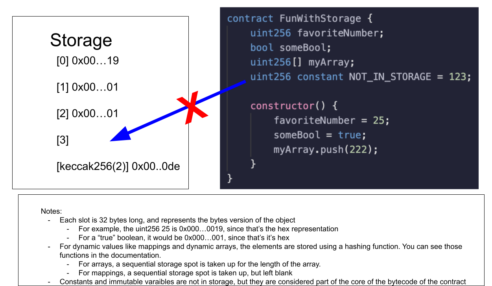
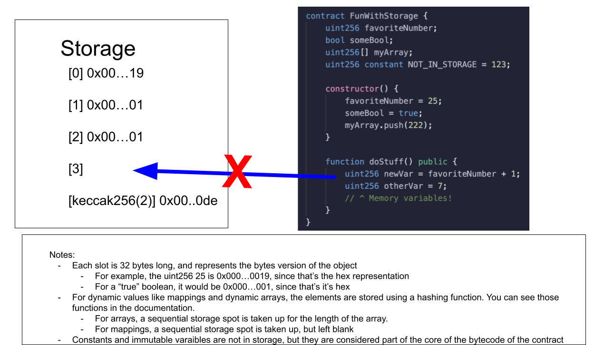

**Storage in Solidity**

We've some basic unit tests here and we're going to write some staging tests pretty soon but before we actually do that,let's go ahead and add the gas estimator and we'll see how much gas these contracts and these functions are taking.We'll turn teh gasReposter to true but we won't do coinmarketcap.

```javascript
gasReporter: {
        enabled: true,
        outputFile: "gas-report.txt",
        noColors: true,
        currency: "USD",
        // coinmarketcap: COINMARKETCAP_API_KEY,
        token: "MATIC",
    },
```

Now re-run all of your test.

`yarn hardhat test`

Well it looks like the fund function is taking a decent chunk of gas, withdraw function taking some gas too.We can see the min, average and the max.Average gas release is lot more than we've expected.Is there a way for us to make it a little cheaper?


We go back to our FundMe contract.We're going to look at first gas optimization technique you can take to drop the gas number down and it has to do in our FundMe contract called state variables and how they're actually stored and how the contract actually keeps track of all the stuff.

Let's talk about what happens when we actually save or store these state variables.Whenever we've these global variables, they're stuck into something called `storage`.



We can think of storage as a big giant array or list of all the variables that we actually create.So when we say we've some contract called "FunWithStorage" and a variable called "favoriteNumber".We're basically saying we want the favoriteNumber to persist.The way it persist is it gets stored in the place called storage.A storage box is a giant list associated with the contract where every single variable and every single value in the storage section is slotted into a 32 byte long slot in the storage array.For example the number 25 in it's bytes implementation is 0x000 with a tons of zeros19.This is the hex version of the uint256 that's why we do so much hex translation, the bytes implementation of uint256.Each slot increments just like an array starting from zero.



For example our next global variable just gets slotted at the next slot that's available.Booleans gets transformed from their bool version to their hex and we modified our some bool variable to be true and hex edition of the true boolean is 0x00...01.Everytime you save an additional global variable or more correctly storage variables, it takes up an additional storage slot.

What about variable that're dynamic in length?



Well for dynamic values like a dynamic array or a mapping, elements inside the array or inside the mapping are stored using some type of hashing function.The object itself does take up a storage slot but it's not going to be the entire array.For example myArray variable here has storage slot two doesn't have the entire array in stoarge slot two.What it has actually is just the array length.The length of the array is stored at storage slot two.But for example if you do `myArray.push(222)`, we do some hashing function and we'll store the number 222 at that location in storage.The hex of 222 is 0x00..00de.This is good and intentional because 32 bytes maynot be nearly big enough to store my array if our array gets massive and it wouldn't make sense for to put the elements inside the array at subsequent number because again the size of the array can change and you're never going to be sure how many subsequence that you need.For mappings it does have a storage spot as well similar to array, but it's just blank.It's blank intentionally so that solidity knows there's a mapping here and it needs a storage slot for attaching function to work correctly.

Now interestingly, constant variables and immutable variables don't take up spots in stoarge.



The reason for this is because contant variables are actually part of the contracts byte code itself.You can imagine what solidity does is anytime it sees constant variables name, it just automatically swaps it out with whatever number it actually is.You can kind of think as NOT_IN_STORAGE is just a pointer to 123 and it doesn't take up a storage slot.



When we have variables inside of a function, those variables only exist for the duration of the function.They don't stay inside the contract.They don't persist.So variables inside the functions like newVar don't get added to storage.They get added in their own memory data structure which gets deleted after the function has finished running.

Well why do we need memory keyword especially when it comes to strings?

Strings are technically the dynamically sized array and we need to tell solidity we're going to do this on the storage location or in the memory location where we can just wipe it.

Arrays and mappings can take up lot more space so solidity just want to make sure where are we working with this.Is it storage? Is it memory?


**Gas Optimizations using storage keyword**

Anytime you read or write to and from the storage, you send a ton of gas.Opcodes represents what the machine code is doing and they represent how much computational work it takes to actually run our code and do stuff with our code.The way that gas is actually calculated is by the [opcodes](https://github.com/crytic/evm-opcodes).We can see on the link exactly how much each opcodes cost.For example anytime we add, it costs 3 gas, anytime we multiply that's 5 gas.We have all of these opcodes that cost different amount of gas.The `SLOAD` and `SSTORE` cost a ton of gas.These are two of the most important opcodes which stands for storage load and storage store respectively.Anytime one of these opcode fires, we're spending 20,000 or 800 gas.As developers, anytime we work with some stuff in storage, we want to go "This is about to cost me a lot of gas" and the best convention, to make sure that we know that we're working with a storage variable and we're about to spend a lot of gas is to append `s_` right before them which stands for storage.

```javascript
// state variables
    mapping(address => uint256) public s_addressFundedAmount;
    address[] public s_funders;

    // Could we make this constant?  /* hint: no! We should make it immutable! */
    address public immutable i_owner;
    uint256 public constant MINIMUM_USD = 50 * 10**18;

    AggregatorV3Interface public s_priceFeed;
```

Now that we've updated everything in the code, we can read through our code and go "Where are we reading and writing to storage way more often then we probably need to?"That's where we get to the withdraw function.We can see we're doing a for loop and everytime we loop, we're doing compare with `s_funders.length`.This means the longer our funder array is, the more times we're going to be reading from storage, that's incredibly expensive.We're reading from storage and saving it to the memory variable(`address funder = s_funder[funderIndex]`) and then updating our storage variable with it(`s_addressFundedAmount[funder] = 0`).Then we've to reset our funders array, there's really no way around it.

We could probably create a withdraw function that's a lot cheaper.So let's go ahead and create a function called "cheaperWithdraw".We don't want to keep reading from storage inside the loop.

```javascript
for (uint256 funderIndex = 0;funderIndex < s_funders.length;funderIndex++) {
    address funder = s_funders[funderIndex];
}
```
We can read the entire array into memory one time and then read from memory instead of constantly reading from storage.Quick note `mappings can't be in memory.`We can read and write from memory variable much much cheaper and update storage when we're all done.

```javascript
 function cheaperWithdraw() public payable admin {
        address[] memory funders = s_funders;
        for (
            uint256 funderIndex = 0;
            funderIndex < funders.length;
            funderIndex++
        ) {
            address funder = funders[funderIndex];
            s_addressFundedAmount[funder] = 0;
        }
        s_funders = new address[](0);

        (bool callSuccess, ) = payable(msg.sender).call{
            value: address(this).balance
        }("");
        require(callSuccess, "Call failed");
    }
```

Let's go back to our test and let's run same multi test but with our cheaper function.Copy the withdraw section of test,change the name inside double quote and at one call we've used withdraw, change it to cheaperWithdraw.

```javascript
it("cheaper withdraw testing...", async function () {
    const txnResponse = await fundMe.cheaperWithdraw()
})
```
change funders to s_funders, priceFeed to s_priceFeed and addressAmountFunded to s_addressAmountFunded in our test script.

If we're successful in making our withdraw function cheaper, we'll run `yarn hadrhat test` to see the result.

Now if we look at our gas report, we can see the difference between cheaperWithdraw and the withdraw.We see cheaperWithdraw on average was more expensive than our regular withdraw and the reason for this is actually, our cheaperWithdraw we only tested on the multi withdraw.So we had to reset many more accounts.So average was technically its maximum as well and if we compare the maximum of cheaperWithdraw to the maximum of the withdraw, it looks cheaper withdraw was indeed cheaper.

**Solidity Chainlink Style Guide**

Right now all of our state variables are public.Actually internal and private variables are also cheaper gas wise and we don't need to make every single one of our variables public, because anybody could read them off the chain anyways.So one more refactoring we're going to do is we're going to set the visibility of the state variables to private or internal and then we'll create getters at the bottom of our function.

MINIMUM_USD we want to keep it as public because we want other people to know what the minimum usd of our contract is without having to go right through storage.The owner of our contract isn't important for others to know or other contracts to know so we can make it private.

```javascript
address private immutable i_owner;
```

Then at the bottom add a function getOwner.

```javascript
function getOwner() public view returns (address) {
        return i_owner;
    }
```

s_funders can be private as well.

```javascript
address[] private s_funders;
function getFunder(uint256 index) public view returns (address) {
        return s_funders[index];
    }
```

s_addressFundedAmount can also be private.

```javascript
mapping(address => uint256) private s_addressFundedAmount;
function getAddressFundedAmount(address funder)
        public
        view
        returns (uint256)
    {
        return s_addressFundedAmount[funder];
    }
```

s_priceFeed can also be private.

```javascript
AggregatorV3Interface private s_priceFeed;
function getPriceFeed() public view returns (AggregatorV3Interface) {
        return s_priceFeed;
    }
```

The reason why we did this is because we want to have this `s_` so that we as a developers could know it as a storage variable but we don't want people who interact with our code to have to deal with this `s_` stuff and we want them to give an API that makes sense and that's easy and readable.Also changing the visibility can save gas in the long run.

Of course we do need to upgrade the test one more time. 

change s_funders to getFunder, s_addressFundedAmount to getAddressFundedAmount and s_priceFeed to getPriceFeed.

Let's run test to make sure that we refactor it correctly.

`yarn hardhat test`

One more gas optimization we could make and an optimizations for errors as well is we could update all of our requires to instead be revert because with our requires, we're actually storing the massive string on chain.Error codes are much cheaper.

```javascript
function fund() public payable {
        // require(
        //     msg.value.convert(s_priceFeed) >= MINIMUM_USD,
        //     "You need to spend more ETH!"
        // );

        if (msg.value.convert(s_priceFeed) < MINIMUM_USD) {
            revert FundMe__BalanceNotEnough();
        }
        // require(PriceConverter.getConversionRate(msg.value) >= MINIMUM_USD, "You need to spend more ETH!");
        s_addressFundedAmount[msg.sender] += msg.value;
        s_funders.push(msg.sender);
    }
```

**Staging Tests**

Let's now write some staging tests and these are the test that we can use on an actual testnet.This is a test that we're basically going to run after we've deployed some code just to see if everything is working approximately the way we want it to.We'll create a new file inside staging directory called "FundMe.staging.test.js" and it's going to look really similar to what we're doing with our unit tests.

```javascript
const { getNamedAccounts, ethers } = require("hardhat")

describe("FundMe", async function () {
    let fundMe, deployer
    const sendValue = ethers.utils.parseEther("1")
    beforeEach(async function () {
        deployer = (await getNamedAccounts()).deployer
        fundMe = await ethers.getContract("FundMe", deployer)
    })
})
```

We're not going to do any `fixture` like we did in our unit tests because in our staging test, we're assuming that it's already deployed at `fundMe` and also we don't need a mock because on a staging, we're assuming that we're on a testnet.

we can actually wrap the whole describe to make sure that we're on a testnet by using our helper config and looking for our developmentChains.We only want to run our describe bit if we're on a development chain.

```javascript
const { developmentChains } = require("../../helper-hardhat-config")

developmentChains.includes(network.name)
    ? describe.skip
    : describe("FundMe", async function () {}
```

[ternary operator](https://developer.mozilla.org/en-US/docs/Web/JavaScript/Reference/Operators/Conditional_Operator)

Now we're only going to run this if we're not on a development chain and we'll do the exact same thing in our unit test.

```javascript
// unit test
const { developmentChains } = require("../../helper-hardhat-config")
!developmentChains.includes(network.name)
    ? describe.skip
    : describe("FundMe", async function () {}
```

```javascript
  it("allows people to fund and withdraw", async function () {
              await fundMe.fund({ value: sendValue })
              await fundMe.withdraw()
              const endingBalance = await fundMe.provider.getBalance(
                  fundMe.address
              )
              assert.equal(endingBalance.toString(), "0")
          })
```

`yarn hardhat deploy --network rinkeby` after it's all deployed, we'll run our staging test.

`yarn hardhat test --network rinkeby`

**Running Scripts on a Local Node**

Now we've written all these test, we can also write a script called "fund.js" inside scripts directory and this is going to be really similar to tests.In the future, if we want to just fund one of our contracts very quickly, we can run this script.

```javascript
const { getNamedAccounts, ethers } = require("hardhat")

async function main() {
    const { deployer } = await getNamedAccounts()
    const fundMe = await ethers.getContract("FundMe", deployer)
    console.log("Funding Contract...")
    const txnResponse = await fundMe.fund({
        value: ethers.utils.parseEther("1"),
    })
    await txnResponse.wait(1)
    console.log("Funded!")
}

main()
    .then(() => process.exit(0))
    .catch((error) => {
        console.error(error)
        process.exit(1)
    })

```

We can run this script by running `yarn hardhat node`, will run a local node with all of our contracts deployed and we can run scripts by `yarn hardhat run scripts/fund.js --network localhost`

Let's now write a withdraw script:

```javascript
const { getNamedAccounts, ethers } = require("hardhat")

async function main() {
    const { deployer } = await getNamedAccounts()
    const fundMe = await ethers.getContract("FundMe", deployer)
    console.log("Withdrawing...")
    const txnResponse = await fundMe.withdraw()
    await txnResponse.wait(1)
    console.log("Withdraw completed!")
}

main()
    .then(() => process.exit(0))
    .catch((error) => {
        console.error(error)
        process.exit(1)
    })
```

**Adding scripts to your package.json**

In our package.json, we can add scripts section to make our lives lot easier and condense all these long tests into a yarn script for us.

```javascript
"scripts": {
    "test": "yarn hardhat test",
    "test:staging": "yarn hardhat test --network rinkeby",
    "lint": "yarn solhint 'contracts/*.sol'",
    "lint:fix": "yarn solhint 'contracts/*.sol' --fix",
    "format": "yarn prettier --write .",
    "coverage": "yarn hardhat coverage"
  }
```


