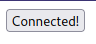
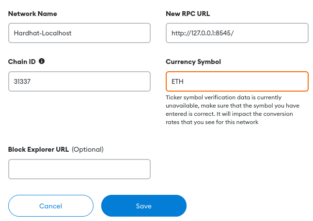
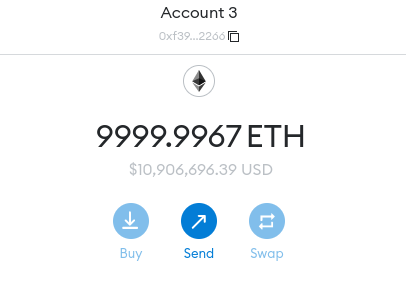
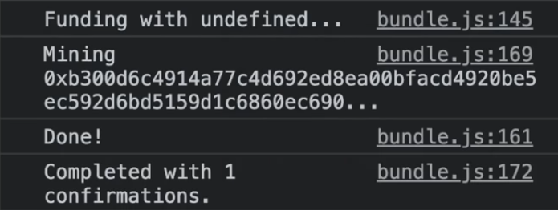
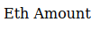
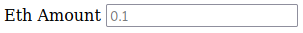

## HTML / JavaScript Fund Me

#### Intro to front end / full stack

In this section, we're going to see some of the differences between nodeJS between that backend javascript, and javascript in the browser or front end javascript.

People can programmatically interact with smart contracts at any time.However, most of our users are not going to be developers. So we need to create a website and create a user interface for them to interact with our smart contracts and interact with our protocols. It's going to be an introduction to building these front ends on top of our smart contracts.Here we're actually going to make our first front end, our first website using the blockchain using web3, and it's going to be an incredibly minimalistic website. We're not going to have any styling.We're just going to show you how to get the functionality.We're going to do a couple of things that aren't really recommended and are definitely not best practices. The reason we're going to do this is the same reason that in math class, before you learn the tricks for derivatives, you learn what a derivative actually is. so that you can understand what's going on on the websites when you interact with them and when you work with them.

We already saw this with faucets.chain.link, where we can connect our wallet and we can work with the faucets. All decentralized applications have this website and have this setup where you can connect your wallet and then you can interact by clicking buttons that make these function calls to the blockchain. This section is just going to teach you what's going on under the hood so you can really understand how to build these applications at a professional level.

When building Dapps, you usually have 2 repos.

- One for the smart contracts

- One for the front end/website

It's going to be the combination of these two repos that makes up the full stack. So when people are talking about full stacks, they're talking about smart contracts, which is going to be our backend, plus html/javascript/website stuff, which is going to be our frontend.

Smart contracts (backend) + HTML/Javascript/Website stuff (frontend) = Full Stakc

We need to understand what exactly is going on when work with websites that use the blockchain.

**How websites work with web3 wallet?**

Typically you'll see connect button and when you click metamask or some other wallet, connector will pop up.After the buttons show connected, you can execute functions and interact with our smartcontracts.This is something that you see in AAVE.So what is actually going on in the browser when we connect and what do we need to do?

Right click and hit inspect, and on the right side, a debugger will pop up. Now if you go over to sources, you'll see a few things like the file explorer in VS Code. We'll see the URL, which will be localhost and a metamask wallet. Metamask is what is injected from our browser extensions. The reason that we see metamask things is because I've got metamask installed. Now, what happens when we have extensions installed is that they automatically get injected into a window object in JavaScript.

If we do `window.ethereum` in the console, we'll see the object. This object only exists if we have a metamask.If you want to look at some other web3 wallet, you do `window.solana`.In order for our browsers to know there's metamask, those extensions automatically add them to our window objects, and that's something that we can check for in our JavaScript.

The reason that these wallets are so important is that, built into them underneath the hood, they have a blockchain node connected to them, and in order to interact with the blockchain, we always need a node. And you might have seen URLs from alchemy or infura because you need them to interact with the blockchain.Alchemy and Infura are third-party blockchains that you can interact with and basically rent, but you need them to create the provider or a node to send your transactions to. So you could do it in Javascript as shown in [alchemy documentation](https://docs.alchemy.com/alchemy/introduction/getting-started/sending-txs).You take that Alchemy URL, stick it into some object, and use that to send your transaction. This is something you can do in the backend.

But on the front end, you normally want to use the user's metamask.There are a ton of other different types of wallets to connect, like ledger, mew wallet, coinbase, etc., and there are different ways to set those up, but they all do the same thing where they expose some URL, expose some node under the hood. The way metamask does it with `windows.ethereum`.If we go to the network section of Metamask, we can see the RPC URL of each network.It's the HTTP RPL URL connection of the blockchain node that's running.Metamask just has a really nice way of taking that URL and sticking it in the browser for us in window.ethereum. This is the main thing that we need to know.We always need a connection with the blockchain, and the browser wallet is an easy way to do that.

**HTML Setup**

In this section, we're going to be using raw HTML and JavaScript in conjunction with our smart contracts to build the website. Let's go ahead and create our HTML for our website.We'll call it "index.html" and this is going to be the basic scaffolding or the basic bones of what our website is going to look like.In VS code, if you type `!` and press enter, it'll automatically populate your file with some basic html setup.

```html

DOCTYPE html>

<html lang="en">

<head>

    <meta charset="UTF-8">

    <meta http-equiv="X-UA-Compatible" content="IE=edge">

    <meta name="viewport" content="width=device-width, initial-scale=1.0">

   

head>

<body>

    

body>

html>

```

However, for simplicity, we don't need most of these. So we're going to make this a little bit easier.

```html

DOCTYPE html>

<html lang="en">

<head>

    <title>Fund Me Websitetitle>

head>

<body>

    

body>

html>

```

And then, inside of the body, we can do something like:

```html

<body>

    Hello!

body>

```

Now we've got the bare bones to create a website just with this. Now to show this on a website, I recommend installing the extension `live server`.This allows us to easily spin up html websites. Once this is installed, you should have `go live` button at the bottom.

**Connecting HTML to MetaMask**

Let's update the HTML so that it has those buttons and can actually connect and work with any blockchain. Another thing you can do in HTML is write JavaScript inside your HTML, which we can do using the script tag.

```html

<body>

    Hello!

    <script>

        

    </script>

body>

```

Anything inside a script tag is going to be JavaScript. So I could do console.log("Hi!!"), return to our frontend, right click and select inspect, go to console, and see "Hi!!" printed out.As we learned before, in the console, we can check for window.ethereum to see if metamask is installed. Again, a lot of what we are working on is right in the [metamask documentation](https://docs.metamask.io/guide/ethereum-provider.html#using-the-provider).Using window.ethereum is just one of the ways we're actually going to connect to the blockchain.There are actually multiple ways because there are multiple different kinds of wallets out there. But for now, we're just going to pretend that window.ethereum and the metamask are the only extensions out there.

So we want to check to see if window.ethereum exists. This is the first thing that we should be doing, because if this doesn't exist, it means that they can connect to the blockchain.

```html

    <script>

        if (typeof window.ethereum != "undefined"){

            console.log("I see metamask wallet :D")

        }

    </script>

```

We could automatically try to connect to a metamask if we see that there's a metamask. We could run `eth_requestAccounts` method, which is basically going to be how we connect our MetaMask. The new EIP-1102 specifies this, but in older documentation and tutorials, you may see ethereum.enable(), which essentially does the same thing.

```html

<script>

        if (typeof window.ethereum != "undefined"){

            window.ethereum.request({method: "eth_requestAccounts"})

        }else {

            console.log("No metamask :(")

        }

</script>

```

Now if you save it, you can actually see the metamask pop off and say "Let's connect." We'll automatically connect our metamask to our website, and if we look at our metamask, we'll see the connected thing. It's saying our account is connected to the website.This means that the website can now make API calls to our metamask.We still have to be the ones to approve them, but it can go ahead and connect and try to run transactions.

The way that we've got our code currently is that anytime we hit refresh, metamask is going to pop up, which is going to be really annoying. We're going to wrap the if statement into an asynchronous function.

```html

<script>

        async function connect(){

            if (typeof window.ethereum != "undefined"){

                window.ethereum.request({method: "eth_requestAccounts"})

            }else {

                console.log("No metamask :(")

            }

         }

</script>

```

We need to call connect function. We can add a button underneath our script tag.We'll give it an id, and call the button "Connect".When we click it, we'll call the connect function.

```html

<button id="connectButton" onclick="connect()"> Connect button>

```

So if we save and go back to our frontend, we now see we've  little "Connect" button and if we press connect, metamask is going to pop up and connect it.We can add await to the connection so that we can finish before moving on.

```javascript

await window.ethereum.request({method: "eth_requestAccounts"})

```

We can also update our website accordingly so that we can let users know that we're connected.We can grab the connect button element id and say that we're connected, once we're connected.

```html

<script>

        async function connect(){

            if (typeof window.ethereum != "undefined"){

                await window.ethereum.request({method: "eth_requestAccounts"})

                document.getElementById("connectButton").innerHTML = "Connected!"

            }else {

                document.getElementById("connectButton").innerHTML = "Please install MetaMask"

            }

         }

</script>

```

After metamask is connected, our button will look like this:



***JavaScript in it's own files***

Now we want to actually go ahead and do some functions here.This is where we want to create some more functions and more buttons that we're going to use ethers that package that we've become so familiar with.As we code our script section is going to get bigger and bigger so oftentimes, we actually want to put our code in a JavaScript file itself.

We're going to create a new file "index.js" and instead of putting our JavaScript inside script tags, we're going to put it in the index and then import the index.js into our html.

```html

<body>

    Hello!

    <script src="./index.js" type="text/javascript"> </script>

    <button id="connectButton" onclick="connect()"> Connect button>

body>

```

Even with index.js in different file, when we hit connect, it still calls our connect function.

**ES6 (FrontEnd JS) VS NodeJS**

Now we want to create our fund function and then later on, we're going to create withdraw function.This is where frontend JavaScript code and nodeJS are a little bit different.In nodeJS we've been using the `require` keyword to import dependencies.In fronend JavaScript, you can't use require.Later on we're going to use the import keyword which is the better way to do this and this is where our first differences going to be.Using the import keyword for frontend is much better than the require keyword especially since the require keyword doesn't actually work.

To make our fund function, what we normally do?Well, we'd create an async function called fund.In this fund function, we probably want to take some eth amount as a parameter because we want to fund it with some amount of ethereum.

```javascript

async function fund(ethAmount) {

}

```

We can call this fund function, the same way we call connect.So in our index.html, we'll create a new button.

```html

<button id="fund" onclick="fund()"> Fund button>

```

To send the transaction, what are the things that we need? Well we need a provider/ connection to the blockchain, signer / wallet / someone with some gas to actually send it and we probably need the contract that we're interacting with.To get that contract, we're going to need ABI and address.With these all together, we can send any transaction.

So get our provider, we're actually going to go ahead and work with ethers again.We're going to do a little bit differently.Before the way we worked with ethers is `const { ethers } = require("ethers")`.This is how we pulled ethers.Like I just said to you though, require doesn't work in the frontend and we actually don't want to install ethers with a node modules package.

If we go to the [ethers documentation](https://docs.ethers.io/v5/getting-started/), they've a section about importing using node js which uses require or imports and then they also have some documentation for working with the web browser.So instead of doing node modules, we'll copy the [ethers library](https://cdn.ethers.io/lib/ethers-5.6.esm.min.js) to our own directories and serve it our selves. Copy the massive file which is ethers but in frontend addition, and make a new file "ethers-5.6.esm.min.js" and paste all that massive thing in here.Now we can import this file in our index.js.

```javascript

import { ethers } from "./ethers-5.6.esm.min.js"

```

Now we only need to do this weird copy pasting of the file import thing in this HTML / JavaScript.In future with nodeJS, we're going to do yarn add ethers kinda like we've normally seen. The frameworks like react and nextJS that we're going to use are going to automatically convert those yarn added packages to their frontend version.But for now this is how we're going to import the ethers package.

The other thing that we've to do is in our frontend is we've to change `type="text/javascript"` to `type="module"`.Changing this to module allows us to import modules into our code which we're going to be importing `ethers` and we're going to import another modules as well.

Instead of calling "Connect" function from the frontend like we did, we're going to remove the `onClick`'s 

```html

<body>

    Hello!

    <script src="./index.js" type="module"> </script>

    <button id="connectButton"> Connect button>

    <button id="fundButton"> Fund button>

body>

```

and in our index.js we'll add those connect buttons.

```javascript

const connectButton = document.getElementById("connectButton")

const fundButton = document.getElementById("fundButton")

```

Then we'll say:

```javascript

connectButton.onclick = connect // function name

fundButton.onclick = fund

```

This is all due to type being module.If it was text/javascript, that onclick button adding was as it as.

Since we've got `connectButton` and `fundButton` in our index.js we might as well update the button inner html change.

```javascript

async function connect() {

  if (typeof window.ethereum != "undefined") {

    await window.ethereum.request({ method: "eth_requestAccounts" })

    connectButton.innerHTML = "Connected!"

  } else {

    connectButton.innerHTML = "Please install MetaMask"

  }

}

```

Now connect button is going to be same as running `document.getElementById`.

```javascript

const connectButton = document.getElementById("connectButton")

```

**Sending a Transaction from a Website**

Let's go back to continuing our fund function.

```javascript

if (typeof window.ethereum != "undefined") {

    const provider = new ethers.providers.Web3Provider(window.ethereum)

  }

```

Web3Provider is an object in ethers that allows us to basically wrap around stuff like MetaMask.The Web3Provider is really similar to that `JsonRpcProvider` where we put in exactly that our alchemy endpoint.Web3Provider takes that http endpoint and automatically sticks it in ethers for us. 

This line of code basically looks at our MetaMask and goes "Okay I found the HTTP endpoint inside their MetaMask."That's going to be what we're going to use as our provider.

Since our provider is connected to MetaMask, we can get a signer or we can get a wallet just by :

```javascript

const signer = provider.getSigner()

```

This is going to return whichever wallet is connected from the provider.If we're connected as the Account1, it's going to return Account1 as the signer.After we console.log(signer), when we hit fund, we've our JsonRpcSigner.The signer is going to be the account that we've connected to our frontend.

We've provider and the signer.Now we're going to need our contract by getting the ABI and the address.How are we going to get our contract?Well this is where we're going to need to know the ABI and the address of what we're working with.Typically what you'll see alot of projects so since once a contract is deployed, the addresses is going to change is they're going to have some type of constants file "constants.js" and inside the file, they'll add address, abi and anything like that for us to use in our fund piece here.

As we're developing and as we're building, the backend and the frontend team are gonna have to interact a little bit or if it's just you doing the full stack, you're going to have to interact with your backend.So this is why it's so important it have both your frontend and your backend code nearby.so if we go back to our hardhat fund me project that we just made, we can find the abi if we go to artifacts/contracts/FundMe.sol/FundMe.json. Copy the ABI and save it as variable in "constant.js" and back in our index.js, we can import it with:

```javascript

import { abi } from "./constants.js"

```

Well we've the ABI but what about the address? Since we're going to be running this locally, we want to get the contract address of the locally run contract.We can do that a couple of ways.One way is you can have two windows open one with your frontend code and one with your backend code.The one with your backend code, you can run `yarn hardhat node` which will spin up our blockchain node for us and give us the address.

Or what we can do is in your window with your frontend code, create a new terminal and in second one, we're going to run `yarn hardhat node` only if we're inside the hardhat-fund-me directory.This is going to spin up our local blockchain where we've deploying fundme with certain address.So in our constants.js, we're exporting both abi and contract address.

```javascript

export const contractAddress = "0xe7f1725E7734CE288F8367e1Bb143E90bb3F0512"

```

and in our index.js, we'll import the contractAddress.

```javascript

import { abi, contractAddress } from "./constants.js"

```

Now we've both the ABI and the address of the contract.Now we could do:

```javascript

const contract = new ethers.Contract(contractAddress, abi, signer)

```

Now we've an ethers contract object that's connected to our signer and we've the contract address and the abi.Now that we've a contract object, we can go ahead and start making transactions the exact same way we've made transactions before.We can just run:

```javascript

const txnResponse = await contract.fund({

            value: ethers.utils.parseEther(ethAmount),

        })

```

This is how we're going to go ahead and create our transaction.If you take this right now and go to our frontend, give it a little refresh, make sure we're connected and we hit fund, we're going to get the error "value must be string" that's because ethAmount right now being passed as nothing.Normally we'll pass parameters directly to our functions but we're going to do for now is hard code this.

```javascript

async function fund() {

    ethAmount = "1"

    }

```

If we hit fund now, we'll get the other error saying "Insufficient funds for intrinsic transaction cost." that's because we're not actually connected to our local hardhat node.Well if we look at metamask, we're not connected to the right blockchain.We're connected to the rinkeby, kovan or mainnet.We need to get connected to the local host.If you look at your networks, you'll have local host object already but let's just be super specific and we'll add a new network here.We're going to add something called "Hardhat-Localhost", the RPC URL we can find from where the node is running, chainId is going to be 31337, currency Symbole be ETH and we're not going to have a blockexplorer.



Now we've an account here connected to the local blockchain.Let's refresh and hit fund one more time, we can see a transaction does indeed pop up.But our account here doesn't have any money.We don't have any local hardhat ethereum.So we're actually going to need to import one of our accounts from hardhat into our metamask which we can do.You can do this for any account with a private key.Hardhat gives the fake account and we're going to import the private key of account0 into the metamask.So we're going to copy the private key and in our metamask, hit import account, select type private key and we're going to paste private key there.



If you choose JSON file, remember back in our ether section, we encrypted our key into a JSON file with a password.You can actually import acounts with that JSON file with the password.So if you encrypt the key and you want to add it to metamask, you can add it in just like this.

We can see now that we've a ton of ETH from our local blockchain.Now we refresh onw more time. hit connect and we make sure our account3 is connected, hit fund and we now see that we can fund this contract, go ahead and hit confirm, but nothing's going to happen in our frontend because we didn't tell our frontend to do anything once we confirm, but if we go to our blockchain we can see our fund function was called.

We've just made our first transaction on a blockchain from our own frontend.

But it's probably little confusing to the user, if nothing happens here.They're going to hit the fund function and be like "Okay cool but what happens now?"We probably want to make it more obvious that something just happened.One more thing if I hit fund and then I hit reject, it's going to freak out saying "Idk what to do now."

So we're going to make our code a little bit more robust by adding a try catch.

```javascript

try {

            const txnResponse = await contract.fund({

                value: ethers.utils.parseEther(ethAmount),

            })

        } catch (error) {

            console.log(error)

        }

```

Now if I hit fund and then reject, it still be little bit mad but at least we're catching it not going to break and destroy everything.

**Resetting an Account in MetaMask**

One other point something that you run multiple times as we're doing this.If you get an error "[ethjs-query] while formatting outputs from RPC....Nonce too high Expected 2 but got 4".The reason this happens is because you've closed your hardhat node and then restarted it and your hardhat node goes "Well I'm starting fresh.I'm starting from zero" but MetaMask isn't smart enough to know that.

So we want to come to our MetaMask, go down to settings, go to advanced and then reset account.This isn't something ideally that you'd like to do with an actual account with actual money. On a local network this is fine.If you reset the account and you reset the node, we can go ahead and confirm the transaction and it doesn't give that error anymore.

**Listening for Events and Completed Transactions**

We've the transaction response and we probably want our frontend to give the user some indication"Hey the transaction went through."So we want to listen to the blockchain for this to finish.We can either for tx to be mined or for an event.For now we just listen for the tx to be mined.We're actually going to create a new function called `listenForTxMined` which is going to take txnResponse and a provider.

```javascript

function listenForTxnMined(txnResponse, provider){

}

```

Now you'll notice that this isn't a async function.For this this is intentional.You'll see why in a second.We're going to be using JavaScript promise, JavaScript async functionality to its massive advantage and this is why JavaScript actually works so well on the frontend is because of how it's asynchronous.

We're going to create this function listen for mined transaction, we're going to await in our fund function and we're going to have this return a promise.

```javascript

async function listenForTxnMined(txnResponse, provider) {

    console.log(`Minign ${txnResponse.hash}...`)

}

```

All of our transaction response object have a hash which just represent that hash.Then we're going to return a new promise.The reason we're going to return a promise is because we need to create a listener for the blockchain.We want to listen for the event to happen but we want to tell JavaScript "Hey wait for this thing to finish looking."

```javascript

async function listenForTxnMined(txnResponse, provider) {

    console.log(`Minign ${txnResponse.hash}...`)

    return new Promise()

}

```

Now here it get's little bit tricky.In our fund function, after we create the transaction, we basically want to tell JavaScript"Hey wait for this txn to finish."So our code is going to look as simple as :

```javascript

try {

            const txnResponse = await contract.fund({

                value: ethers.utils.parseEther(ethAmount),

            })

            await listenForTxnMined(txnResponse, provider)

        } catch (error) {

            console.log(error)

        }

```

We're saying listen for the transaction to finish and we're using await keyword which says "okay we're going to stop right here untill the function is complete".

Now in listenForTxnMined, we've to define how we're actually going to listen for this.Ethers actually comes with the way for us to listen for transactions and listen for events.So we can go to the ethers docs, look up [once](https://docs.ethers.io/v5/api/contract/contract/#Contract-once).There's a whole bunch of listeners that we can use to listen for events and listen for different things to happen.We can do this called "`provider.once`" where we listen for some event and once that event fires, we call some other function that we've defined.

One of the events that we can wait for is the `transaction Receipt` to finish that means the transaction has actually finished going through.So we can use the provider.once syntax to wait for the transaction receipt which is going to be our event which isn't really an event then we're going to call some listener function that we've defined.We only care about this transaction going one time so using `.once` instead of `.on`.

```javascript

async function listenForTxnMined(txnResponse, provider) {

    console.log(`Minign ${txnResponse.hash}...`)

    // return new Promise()

    provider.once(txnResponse.hash, () => {})

}

```

Once this txnResponse finishes, we're going to take a txnReceipt as a input parameter and we're going to log the confirmations with txnReceipt.

 ```javascript

 provider.once(txnResponse.hash, (txnReceipt) => {

        console.log(`Completed with ${txnReceipt.confirmations} confirmations`)

    })

 ```

 So once provider.once sees that there's a transaction hash, it's going to give as an input parameter to our listner function the `txnReceipt` kind of same syntax that we've been seeing the whole time, once a txnResponse finishes, we get the txnReceipt and we can do stuff with it and we see how many block confirmations it has.For us this pretty much should always be one.

 

 Now if we save this, go back to our frontend, hit fund, it's going to work.We're going to give the user some indication that it worked but it's not really going to work the way we want it to work.If we add `console.log(done!)` after await listenForTxnMined, we come back and we hit fund, it actually doesn't go in the order that we wanted to go.

 

 

 

 What's going on here? We should write "completed" before we write "done" because that's the order that we've.

 

 When we call listenForTxnMined, this function is going to kick off but it's going to kick off provide.once as it's own process.So await listenForTxnMined will kick off the listener but it doesn't wait for the listener to find the txnResponse.So listener function will actually finish before provide.once finishes.So after it kicks off the listener, it'll run to the next line of code which is `console.log("done!")`.Or frontend will go "You kicked off a listener earlier.Let me go back down and recheck to see if it's finished and if it has finished I'll go do what it told me to do."This is where what's known as the `event loop` kicks in.We don't actually wait for the provide.once to finish.We add the provider.once on this queue called `event loop` and our frontend is going to periodically check back to it to see if it's finished.

 

 So we want to adjust our code so we wait for the listener to finish listening which is where we're going to get into promises here.We want to adjust the provider.once to return a promise.We're going to say "Hey wait for the listener to finish listening."We're going to wrap the provider.once into a promise.

 

 `Promise` takes a function itself as an input parameter.It'll take two input parameters: resolve and reject.

 

 ```javascript

 return new Promise((resolve, reject) => {})

 ```

 

 Resolve says "If the promise works correctly, call this resolve function" and for us this promise is going to be done when the listener finishes listening and then we would reject if there was some type of timeout.We're not going to write the reject function but for production in the future, you'd add some timeout as a reject parameter.Basically you're saying "Hey once the listener finishes listening, we're going to resolve and if it takes too long, we'll say you look too long."We're going to close promise on a provider thing.

 

 ```javascript

 return new Promise((resolve, reject) => {

        provider.once(txnResponse.hash, (txnReceipt) => {

            console.log(

                `Completed with ${txnReceipt.confirmations} confirmations`

            )

        })

    })

 ```

 

 And only once the transaction gets fired, we're going to resolve the promise.

 

 ```javascript

 provider.once(txnResponse.hash, (txnReceipt) => {

            console.log(

                `Completed with ${txnReceipt.confirmations} confirmations`

            )

            resolve()

        })

 ```

 

 So we're going to put the resolve inside of the provide.once.So we're saying ,once the transaction hash is found then we're going to call the anonymous function passing "txnReceipt" and then we're going to resolve.The promise only returns, once resolve or reject is called and we're telling it only resolve or only finish, when once function txnResponse.hash is found because it's going because it's inside the braces for provider.once.The promise right now only resolves after it fired it's event.

 

 Now that we've updated this, we can come to our frontend, hit the fund button and everything will go in order.The reason for this is because again our await keyword is now waiting for the promise to either resolve or reject and we only resolve the promise once our provider finds the transaction hash.

 

 Now we're giving frontend some indications of what's going on.

 

 **Input Forms**

 

 Our fund function is done.Right? Well not really.Because righ now we're hard coding the ethAmount to 1 and on the front end we probably don't want to hard code it, we probably want to allow users to fund as much or as little as they want.So we actually need to change this from just a button to a input form.So to do, we're going go into our html and change the fund section here.We're going to add some form information.We're keeping the button as it is and add a little textbox to input as much ETH as they want.

 

 ```html

 

    Eth Amount 

 ```

 

 This is basically just going to create a label and if we go to our frontend, we've our ETH Amount label.

 

 

 

 Now we're going to create a `input`.

 

 ```html

 <input id="ethAmount" placeholder="0.1"/>

 ```

 

 If we flipped to the frontend, we've ethAmount labeling the little textbox with a place holder of 0.1 and we can add stuff in there.

 

 

 

 Right now we're calling fund and not passing any parameteres.Let's update our fund to no longer be hardcoding ethAmount and we'll have our fund function populated by whatever we put in this Eth Amount input box.

 

 ```javascript

 async function fund() {

    // ethAmount = "1"

    ethAmount = document.getElementById("ethAmount").value

    }

 ```

 

 So we're going to grab whatever value is in the input box.Now in our frontend, if we do 2 in the input box and hit fund, we now see in our console "Funding with 2" and we get 2 in our metamask fund section.

 

 Now we've a little text box so people can fund as much or as little as they want.There's also a form tag but we're going to use this for now.

 

 **Reading from the blockchain**

 

 We probably want button to keep track of how much is actually in our contract.So let's add a really simple balance button.  

 

 ```html

 <button id="balanceButton">getBalancebutton>

 ```

 

 Let's go back to index.js and create a getBalance function.

 

 ```javascript

 async function getBalance() {

    if (typeof window.ethereum != "undefined") {

        const provider = new ethers.providers.Web3Provider(window.ethereum)

        const balance = await provider.getBalance(contractAddress)

        console.log(ethers.utils.formatEther(balance))

    }

}

 ```

 

 This formatEther function is to make reading ethers formatted numbers much easier to read.

 

 Then we're going to create a fundButton onclick event.

 

 ```javascript

 const balanceButton = document.getElementById("balanceButton")

connectButton.onclick = connect

fundButton.onclick = fund

balanceButton.onclick = getBalance

 ```

 

 We're going to come back to our frontend, do quick refresh, hit getBalance and we can see the balance in the console window.

 

 **Withdraw Function**

 

 So create a withdraw function which is going to look really similar to what we've done so far.In our index.html, let's create a new withdraw button.

 

 ```html

<button id="withdrawButton">Withdrawbutton>

 ```

 

 then in our index.js, create a onclick event button.

 

 ```javascript

 const withdrawButton = document.getElementById("withdrawButton")

withdrawButton.onclick = withdraw

 ```

 

 Now let's make a withdraw function.

 

 ```javascript

 async function withdraw() {

    console.log("Withdrawing the fund...")

    if (typeof window.ethereum != "undefined") {

        const provider = new ethers.providers.Web3Provider(window.ethereum)

        const signer = provider.getSigner()

        const contract = new ethers.Contract(contractAddress, abi, signer)

        try {

            const txnResponse = await contract.withdraw()

            await listenForTxnMined(txnResponse, provider)

        } catch (error) {

            console.log(error)

        }

    }

}

 ```

 

 Now we'll refresh, we'll make sure we're connected, check the balance and we go ahead and hit withdraw button.If we look at metamask, our balance will have increase by the amount that was funded.After the withdraw, if we hit getBalance, we do indeed see 0.

 

 We've created a minimalistic website that allows us to connect to the blockchain and call functions from a frontend and from a website.This will give an idea of exactly what's going on behind the scenes when we're working with those more advanced frontends and we'll style them so they look a little bit better than this.
