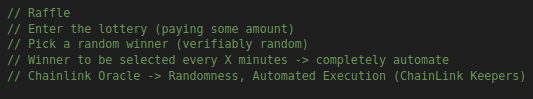

## Hardhat Smart Contract Lottery / Raffle

We're building an application that allows users completely decentralized to allow us to engage in a fair and verifibaly random lottery.This is the application that would actually fix the McDonald's issue.We'll have a connect wallet button that we'll use to connect to more than just MetaMask.WalletConnect, True Wallet, Math Wallet etc are wallets that we'll customize even more.One can enter the raffle and allow anybody to pay 0.1 ETH to enter our smart contract.We'll get the notification that says transaction complete.We track the number of player that entered the lottery.We'll run the lottery on a timer and is going to automatically trigger somebody to win and to do this, to get a pure verifiable random number, we're going to be use ChainLink VRF to get a pure verifiable random number and then we're going to use chainlink keepers to trigger the automation to automatically have one of the winner get picked everytime those time intervals is up.

Once the keepers kick it off, they will pick a winner, our lottery will display the recent winner and they'll get all the money from the lottery making it perfectly fair decentralized lottery.This is going to be the project if you learn this, you have the skill to learn all the rest of the smart contracts and you're going to be able to do great things in the space.

**Hardhat Setup**

Let's create a new folder.

`mkdir hardhat-raffle`

then we're going inside the directory

`cd hardhat-raffle/`

and we're going to open this up in VS code.

`code .`

Now we're going to create our new hardhat project.

`yarn add --dev hardhat`

Now we'll do `yarn hardhat` to get started with the new project and we're going to select empty hardhat.config.js because we know what a basic project looks like and we're going to give this project the customizations that we want to see.Now we've an empty hardhat.config.js.We're starting completely from scratch.

Now we're going to add all of our dependencies here and oftentimes you'll add sequentially as you build but we're going to add them all in one line.

`yarn add --dev @nomiclabs/hardhat-ethers@npm:hardhat-deploy-ethers ethers @nomiclabs/hardhat-etherscan @nomiclabs/hardhat-waffle chai ethereum-waffle hardhat hardhat-contract-sizer hardhat-deploy hardhat-gas-reporter prettier prettier-plugin-solidity solhint solidity-coverage dotenv`

Now that we've all those dependencies installed, if we look at our package.JSON, we'll have massive devDependencies.We've everything in node_modules and in yarn.lock.And of course as we know in order for any of these to actually work, we need to add them into our hardhat config.

```javascript
require("@nomiclabs/hardhat-waffle")
require("@nomiclabs/hardhat-etherscan")
require("hardhat-deploy")
require("solidity-coverage")
require("hardhat-gas-reporter")
require("hardhat-contract-sizer")
require("dotenv").config()
```

Again to remove all those semicolons as the end of the statement, we're going to create a .prettierrc file.

```json
{
  "tabWidth": 4,
  "useTabs": false,
  "semi": false,
  "singleQuote": false,
  "printWidth": 100
}
```

"printWidth" just changes how long a line can be before it goes onto a new line.

Now if we look at solidity version, we're currently using "0.7.3".Let's go and update that to 0.8.8.

Now that we've our basic setup, we can begin coding our smart contract.

**Raffle.sol Setup**

So first we need to create a new folder "contracts" where we're going to store all of our contracts.Let's create a new file inside contracts called "Raffle.sol".

Before we jump in and create it, let's figure out what we're going to do.So we're going to create our raffle contract and what we want people to be able to do?

- We want people to enter the lottery paying some amount
- We probably want to pick a random winner.We want this to be verifibaly random.
- We also want winner to be selected every X minutes aka completely automated.So we want to deploy this smart contract and almost have no maintainence almost nobody ever has to touch it again and it'll just automatically run forever.

Since we're picking a random number and we've some event driven execution, we know that we're going to need to use chainlink oracle since we're going to get the randomness from outside the blockchain and we're going to have that automated execution because a smart contract can execute itself.We need somebody to automatically trigger these.So to trigger and selecting a winner, we're going to have to use `chainlink keepers`.



Now that we've a good idea of where we going, let's build it.So pre usual let's do SPDX License Identifier, pragma version and contract declaration.

```solidity
// SPDX-License-Identifier: MIT
pragma solidity 0.8.8;

contract Raffle {}
```

Just make sure we're not doing crazy by doing `yarn hardhat compile`

We want to be able to enter the lottery so maybe we'll create a function called "enterRaffle", we want to pick a random winner so we'll also create a function called "pickRandomWinner".

```solidity
function enterRaffle() {}

function pickRandomWinner() {}
```

In the past we've created projects like FundMe where people can send ether to our contract using the msg.value based off of some USD value.For this we're just going to have the entrance fee instead be USD based, it's just going to be that native asset.So for our enterRaffle, we don't have to set a USD price, we can set minimum ETH price.So let's pick our minimum price.From our last section knowledge, we know that entranceFee is going to be a storage variable.So we're going to append `s_` before it's name.

```solidity
uint256 s_entranceFee;
```

Let's make it a private variable because we always want to set our visibility and let's have an entranceFee be configurable.

```solidity
constructor(uint256 entranceFee) {
        s_entranceFee = entranceFee;
    }
```

Well if we're only going to set this one time, we might as well make this a constant or an immutable variable.So let's make this an immutable variable so we save some gas and we'll change the variable name from `s_` to `i_`.

```javascript
uint256 private immutable i_entranceFee;

constructor(uint256 entranceFee) {
    i_entranceFee = entranceFee;
}
```

Now we probably want other users to see the entranceFee, so we'll create a function called "getEntranceFee" which will be a public view function that will return the entranceFee.

```solidity
function getEntranceFee() public view returns (uint256) {
        return i_entranceFee;
    }
```

Now we've a function that users can call to get the entrance fee but we as developers can use `i_entranceFee` to know that this is an immutable variable.This is pretty cheap gas wise for us to read from.

In our enterRaffle, we've done ton of require statements.all we need to do is just require the msg.value greater than that entrance fee.But we've learned before about those error codes, so we could either do require msg.value or we could do custom errors which is going to be alot more gas efficient because instead of storing the string, we're just going to store an error code in our smartcontract.

```solidity
error Raffle__NotEnoughETHEntered(); // outside of contract

function enterRaffle() {
        // require(msg.value > i_entranceFee, "Not enough ETH!");
        if (msg.value < i_entranceFee) {
            revert Raffle__NotEnoughETHEntered();
        }
    }
```

Now that we know they're calling enterRaffle with enough value, we probably want to keep track of all the users who actually enter our raffle.That way when we pick a winner we know who's in the running.So let's create an array of player at the top.

```solidity
address[] players;
```

Now the players, of course is going to have to be in the storage because we're going to be modify this alot.We're going to be adding or subtracting players all the time.So we're going to make this `s_`, make this private as well and we're going to make the address payable because one of these players wins, we're going to need to have to pay them.

```solidity
address payable[] private s_players;
```

Since we're going to make this private and it's probably good that we know who's in the players array, we'll create a function called getPlayer.

```solidity
function getPlayer(uint256 index) public view returns (address) {
        return s_players[index];
    }
``` 

We definitely want our enterRaffle to be public and payable.Since we're having people send message.value and we want anyone to be able to enter our raffle.

```solidity
function enterRaffle() public payable {
        // require(msg.value > i_entranceFee, "Not enough ETH!");
        if (msg.value < i_entranceFee) {
            revert Raffle__NotEnoughETHEntered();
        }
    }
```

Now that we've our array and someone's entered the raffle, we'll push the msg.sender.Now only pushing msg.sender doesn't work because msg.sender isn't a payable address.So we need to typecast it as a payable address just by wrapping it in payable.

```solidity
 function enterRaffle() public payable {
        // require(msg.value > i_entranceFee, "Not enough ETH!");
        if (msg.value < i_entranceFee) {
            revert Raffle__NotEnoughETHEntered();
        }
        s_players.push(payable(msg.sender));
    }
```

So now we've a way to keep track of all the players that are entering a raffle.

**Events**

Whenever we update a dynamic object like an array or a mapping, we always want to emit an event.So we're going to start adding events to our smart contracts whenever we update one of these dynamically sized data structures.If you want to know more about events, checkout out [Day29](https://github.com/spo0ds/Journey-to-become-a-Blockchain-Engineer/blob/main/Day29/Day29.md) of my repo.Remember these events get emmited to a data storage outside of the smart contract.Let's create an event called RaffleEnter.A good naming convention for events is with the function name reversed.So for enterRaffle, we're going to say RaffleEnter event and we'll have this RaffleEnter take one indexed parameter.

```solidity
/* Events */
event RaffleEnter(address indexed player);
```

So in our enterRaffle, we're going to emit an event.

```solidity
emit RaffleEnter(msg.sender);
```

**Chainlink VRF (Randomess in Web3)**

So in it's minimalistic sense, we essentially have a way for people to enter our raffle.Now we need a way to pick a random winner and this is where we're going to need chainlink VRF and chainlink keepers.You can check [True Randomness with Chainlink VRF](https://github.com/spo0ds/Journey-to-become-a-Blockchain-Engineer/blob/main/Day13/Day13.md) in my Day13 of the repo.We're going to use the sample contract in [chainlink docs](https://docs.chain.link/docs/get-a-random-number/) to create our function that's going to pick our random winner.This is on chain contract that coordinates with a verifiably random chainlink node to give us a random number.

**Implementing Chainlink VRF**

So we're going to create our function here called "pickRandomWinner".This function is going to be called by the chainlink keepers network so that this can automatically run without us having to interact with it. 

Now our pickRandomWinner function, we're not actually going to make public.We're going to make external.`External functions are little bit cheaper than public functions` because solidity knows that our own contract can't call this.

In order for us to pick a random winner, we actually have to do two things.We first have to request the random number and then once we get it, do something with it.Chainlink VRF is a `two transaction process` and this is actually intentional.Having random numbers in two transactions is actually also much better than having it in one.If it's just one transaction, then people could just brute force tries simulating calling the transaction to see what they can manipulate to make sure that they are the winner.We want to make sure that this is absolutely fair and nobody can manipulate our smart contract into having them be the winner of the lottery.This pickRandomWinner is actually going to request it and then in a second function the random number is going to be returned and the transaction that we actually get the random number from the chainlink network, that's when we actually send the money to the winner.

If we go to the chainlink documentationm the function that the chainlink node calls is "fulfullRandomWords".

```solidity
// Taken from chainlink docs
function fulfillRandomWords(
    uint256, /* requestId */
    uint256[] memory randomWords
  ) internal override {
    s_randomWords = randomWords;
  }
```

So our pickRandomWinner is the requesting one.We change the name to "requestRandomWinner" and we'll make a function fulfillRandomWords which is going to be an internal override.

```solidity
function requestRandomWinner() external {}

function fulfillRandomWords() internal override {}
```

Now in order for our Raffle contract VRFable, we've to import the chainlink code.We can go back to the documentation and grab the bottom line.

```solidity
import "@chainlink/contracts/src/v0.8/VRFConsumerBaseV2.sol";
```

Since we're importing `@chainlink/contracts`, we need to add that in by running `yarn add --dev @chainlink/contracts`.We're going to need to make our Raffle VRFComsumerBaseable.We need to inherit VRFConsumerBase.If we go to our node_modules/@chainlink/src/v0.8/VRFConsumerBaseV2.sol, it comes with the function fulfillRandomWords and it's an internal virtual function.Virtual means it's expecting to be overwritten.The reason that it's in the VRFConsumerBaseV2 is so that the VRFCordinator which we'll use in a bit knows that it can call the fulfillRandomWords and this is the function that we're overriding.So back in our Raffle.sol, we're going to inherit it by doing :

```solidity
contract Raffle is VRFConsumerBaseV2 {}
```

Now in our fulfillRandomWords, we can add any input parameters for fulfilledRandomWords which are going to be requestId and randomWords array.

```solidity
function fulfillRandomWords(uint256 requestId, uint256[] memory randomWords)
        internal
        override
    {}
```

Our linter will now notice that it's expecting to override fulfillRandomWords which takes the parameters that we've just given.Now if we look in our docs, in our constructor, we need to pass the VRFConsumerBaseV2's constructor and pass that VRFCoordinator.Again this `VRFCoordinator` is the `address` of the contract that does the `random number verification`.So right next to our contructor, we'll add the VRFConsumerBaseV2 constructor.

```solidity
constructor(uint256 entranceFee) VRFConsumerBaseV2() {
        i_entranceFee = entranceFee;
    }
```

and we need to pass the VRFCoordinatorV2 address.So in our main constructor, we'll add that as a parameter as well and pass that as a parameter to VRFConsumer.

```solidity
constructor(address vrfCoordinatorV2, uint256 entranceFee) VRFConsumerBaseV2(vrfCoordinatorV2) {
        i_entranceFee = entranceFee;
    }
```

Now that we've this we shouldn't see the underscore in our Raffle anymore and we should be able to run `yarn hardhat compile`.

**Hardhat Shorthand**

I'd prefer to write as little keys as possible.Hardhat also would like us to write as little keys as possible.So hardhat comes with a [Shorthand and autocomplete](https://hardhat.org/guides/shorthand).So to install it:

`yarn global add hardhat-shorthand`

Now instead of running `yarn hardhat compile`, we can just run `hh compile`.

**Implementing chainlink VRF (The Request)**

So now we actually need to have our requestRandomWinner function requests a random winner.We can look at the documentation and see how it works.

```solidity
function requestRandomWords() external onlyOwner {
    // Will revert if subscription is not set and funded.
    s_requestId = COORDINATOR.requestRandomWords(
      keyHash,
      s_subscriptionId,
      requestConfirmations,
      callbackGasLimit,
      numWords
    );
  }
```

On the VRFCoordinator address we call the requestRandomWords function.We're going to need to call requestRandomWords function on the Coordinator contract.To get the Coordinator contract, we're going to use VRFCoordinatorV2Interface and the vrfCoordinator address.We can do that once again in our constructor.We have the address being passed to the VRFConsumerBase.Let's also keep it as a state variable for us.first of all let's get the interface so that we can interact with the contract.

```solidity
import "@chainlink/contracts/src/v0.8/interfaces/VRFCoordinatorV2Interface.sol";
```

Now that we import this interface, same as we did with priceFeeds, we can do:

```solidity
VRFCoordinatorV2Interface vrfCoordinator;
```

We can save the vrfCoordinator using the address that we pass in our constructor and we're going to wrap that address around the interface and now we can work with the vrfCoordinator contract.

```solidity
constructor(address vrfCoordinatorV2, uint256 entranceFee) VRFConsumerBaseV2(vrfCoordinatorV2) {
        i_entranceFee = entranceFee;
        vrfCoordinator = VRFCoordinatorV2Interface(vrfCoordinatorV2);
    }
```

Now we're only going to set our vrfCoordinator one time right in our constructor.So let's do private and immutable and change the name to `i_` at the beginning.

```solidity
VRFCoordinatorV2Interface private immutable i_vrfCoordinator;

constructor(address vrfCoordinatorV2, uint256 entranceFee) VRFConsumerBaseV2(vrfCoordinatorV2) {
        i_entranceFee = entranceFee;
        i_vrfCoordinator = VRFCoordinatorV2Interface(vrfCoordinatorV2);
    }
```

In order to request the random word, we need to give it a number of parameters.Copy the line from the documentation and change "COORDINATOR" to "i_vrfCoordinator".

```solidity
function requestRandomWinner() external {
        i_vrfCoordinator.requestRandomWords(
            keyHash,
            s_subscriptionId,
            requestConfirmations,
            callbackGasLimit,
            numWords
        );
    }
```

So we're going to call requestRandomWords on that vrfCoordinator contract.We need to pass it the `keyHash` or the `gasLane`.If we go to the chainlink docs, go to [contract addresses](https://docs.chain.link/docs/vrf-contracts/), we can see different gas lanes and different configuration parameters for different networks.This keyHash is going to be the gas lane of the key hash which tells the chainlink node the maximum price you're going to pay for your gas in Wei.If for example gas prices skyrocket, and it's going to cost you a ton of money to get that random number, setting a ceiling will make it so that the random number doesn't comeback.For us to pick a gasLane, we probably want to have this keyHash stored somewhere.So let's go ahead and make that a parameter of our constructor as well and we'll save that as a state variable. 

```solidity
bytes32 private immutable i_gasLane;

constructor(
    address vrfCoordinatorV2,
    uint256 entranceFee,
    bytes32 gasLane
) VRFConsumerBaseV2(vrfCoordinatorV2) {
    i_entranceFee = entranceFee;
    i_vrfCoordinator = VRFCoordinatorV2Interface(vrfCoordinatorV2);
    i_gasLane = gasLane;
}
```

Now we can swap keyHash with i_gasLane in our requestRandomWinner function.

```solidity
function requestRandomWinner() external {
    i_vrfCoordinator.requestRandomWords(i_gasLane,,,,);
}
```

What's next? 

We need a subscription Id which is goign to be the subscription that we need for funding our requests.There's actually a contract on-chain, which we can use to fund any subscription for any of these external data or external computation bits and in the contract there's a list of the subscriptions for people to make requests to.So we need the Id of the subscription that we're using to request a random number and pay the link oracle gas.The subscription Id is also going to be something that we're going to pass as a parameter to our lottery.So once again let's go to our constructor and add a new parameter. 

```solidity
uint64 private immutable i_subscriptionId;

constructor(
        address vrfCoordinatorV2,
        uint256 entranceFee,
        bytes32 gasLane,
        uint64 subscriptionId
    ) VRFConsumerBaseV2(vrfCoordinatorV2) {
        i_entranceFee = entranceFee;
        i_vrfCoordinator = VRFCoordinatorV2Interface(vrfCoordinatorV2);
        i_gasLane = gasLane;
        i_subscriptionId = subscriptionId;
    }
```

Now we can change to i_subscriptionId in requestRandomWinner function.

requestConfirmations is a uint16 which says how many confirmations the chainlink node should wait before responding.So if you make a request and there's only one block confirmations, maybe you don't actually send it because you're afraid of some type of blockchain reorganization or something.We're not going to worry to much of it.We're just going to make it a constant of three.

```solidity
uint16 private constant REQUEST_CONFIRMATIONS = 3;
```

callbackGasLimit is goign to be the limit for how much gas to use for the callback request to your contracts's fulfillRandomWords.This sets a limit for how much computation are fulfilledRandomWords can be.This is a good way to protect ourselves from spending way too much gas.If for example we accidentally code our contract in a way where fulfillRandomWords is incredibly gas expensive.It'll block the random number from responding.We're going to make this paramaterizable because we want to change it depending upon how we code our fulfillRandomWords.

```solidity
uint32 private immutable i_callbackGasLimit;
```

numWords is going to be how many random numbers that we want to get.We only want one so we'll create a constant variable.

```solidity
uint32 private constant NUM_WORDS = 1;
```

Now the requestRandomWords function returns a uint256 requestId.It's a unique Id that defines who's requesting this and all other information.

```solidity
function requestRandomWinner() external {
        uint256 requestId = i_vrfCoordinator.requestRandomWords(
            i_gasLane,
            i_subscriptionId,
            REQUEST_CONFIRMATIONS,
            i_callbackGasLimit,
            NUM_WORDS
        );
    }
```

For now we're going to emit an event with the requestId but we'll discuss on the reason a little bit later.

```solidity
event RequestRaffleWinner(uint256 indexed requestId);

function requestRandomWinner() external {
        uint256 requestId = i_vrfCoordinator.requestRandomWords(
            i_gasLane,
            i_subscriptionId,
            REQUEST_CONFIRMATIONS,
            i_callbackGasLimit,
            NUM_WORDS
        );
        emit RequestRaffleWinner(requestId);
    }
```

Now we've a function that we can use to request a random winner using chainlink VRF.Now again we're going to set this up so that the chainlink keepers call this on an interval but we'll do that in a little bit.For now let's figure out what to do once we get that random number.

**Implementing Chainlink VRF (The Fulfill)**

Once we get that random number, we're going to want to pick a random winner from our array of players.Let's pick a random winner using module function.Now we're going to get an array back of randomWords.Since we're only requesting one random word, the randomWords array is going to be of size one with one random word in it.This randomWord is a uint256.So this random word could be massive big number.Our players array is only going to be so big.So how do we get a random winner from this potentially massive random number?

We can use something called the modulo function.

```solidity
function fulfillRandomWords(uint256 requestId, uint256[] memory randomWords) internal override {
        uint256 indexOfWinner = randomWords[0] % s_players.length;
        address payable recentWinner = s_players[indexOfWinner];
    }
```

Now we've the address of the person that going to be verifiably random winner.

Now it might be kind of cool to brag to people that you're the recent winner.So let's go ahead and at the top, we'll create a new state variable for our most recent winner.

```solidity
address private s_recentwinner;
```

As we get winner, we update it with recent winner.

```solidity
function fulfillRandomWords(uint256 requestId, uint256[] memory randomWords) internal override {
        uint256 indexOfWinner = randomWords[0] % s_players.length;
        address payable recentWinner = s_players[indexOfWinner];
        s_recentwinner = recentWinner;
    }
```

and we probably want people to know who the recent winner is, so we'll create a getRecentWinner function.

```solidity
function getRecentwinner() public view returns (address) {
        return s_recentwinner;
    }
```

Now that we've a recent winner, we probably want to send them the money in this contract.So we're going to do exactly what we did before with sending the money.

```solidity
(bool success, ) = recentWinner.call{value: address(this).balance}("");
```

We're going to be little bit more gas efficient.So we're going to create our own custom error and use that in our if statement.

```solidity
error Raffle__TransferFailed();

function fulfillRandomWords(uint256 requestId, uint256[] memory randomWords) internal override {
        uint256 indexOfWinner = randomWords[0] % s_players.length;
        address payable recentWinner = s_players[indexOfWinner];
        s_recentwinner = recentWinner;
        (bool success, ) = recentWinner.call{value: address(this).balance}("");
        // require(success);
        if (!success) {
            revert Raffle__TransferFailed();
        }
    }
```

Now that we've picked a winner, right now we don't have the way to keep track of list of previous winners.So we're just going to emit an event so there's always going to be that easily queriable history of winners.so we're going to create a new event called "WinnerPicked".

```solidity
event WinnerPicked(address indexed winner);

emit WinnerPicked(recentWinner); // inside fulfillRandomWords
```

You'll notice that the requestId has little underscore here.


It's saying unused function parameter.Since we don't use this but we still need for fulfillRandomWords to take a requestId and a randomWords array.But we don't use requestId, we can just comment out just the requestId part.

```solidity
function fulfillRandomWords(
        uint256, /*requestId*/
        uint256[] memory randomWords
    ) internal override {}
```

This tells our function that you need a uint256 but we're not going to use the requestId.

Now let's compile our code.

`yarn hardhat compile`


