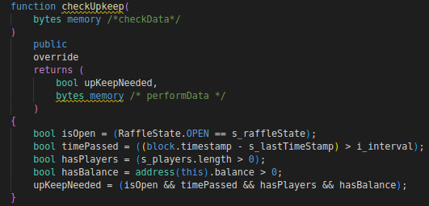
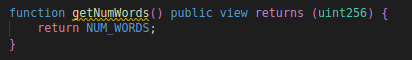
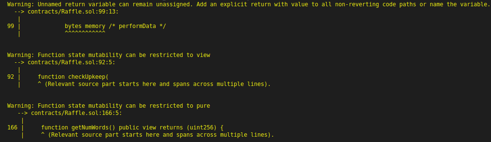

 **Introduction to Chainlink Keepers**

So we've added the chainlink VRF where we have a way to verifiably get a random winner.Now let's update the contract not only it can pick a verifiable winner but it can also do this all programmatically and automatically trigger picking a random winner based off of some time interval without us having to interact with it and in a decentralized context.

In order for us to trigger smart contracts based off of some parameter be a time parameter, maybe the price of of some asset is some number, maybe there's certain amount of money in the liquidity pool or really whatever trigger that you want, we can use chainlink keepers to do this.

**Implementing Chainlink Keepers (checkUpkeep)**

Let's update our code so that requestRandomWinner automatically happens using chainlink keepers and if we look at the [example contract](https://docs.chain.link/docs/chainlink-keepers/compatible-contracts/), we need a checkUpkeep and a performUpkeep function in our code.So instead of requestRandomWinner, this is going to be the performUpkeep that we're going to change but first let's make checkUpkeep.It's basically going to be checking to see is it time for us to get the random number to update the recent winner and send them all the funds.so let's go ahead and make that function. 

```solidity
function checkUpkeep() external override {
        
    }
```

If we see this override keyword, there's probably a performUpkeep somewhere else and if we scroll to the top in documentation example, we're going to import `KeeperComaptible` interface so that we make sure that we implement both checkUpkeep and performUpkeep in our code.If you want you can just import KeeperCompatible or just the  KeeperCompatible Interface.

```solidity
import "@chainlink/contracts/src/v0.8/interfaces/KeeperCompatibleInterface.sol";
```

and we're going to say:

```solidity
contract Raffle is VRFConsumerBaseV2, KeeperCompatibleInterface {}
```

This KeeperCompatibleInterface inheritance just make sure that we add checkUpkeep and performUpkeep.If we look at the docs, checkUpkeep takes bytes calldata checkdata as an input parameters.

```solidity
function checkUpkeep(bytes calldata checkData) external override {}
```

This arguments allows us to specify really anything that we want when we call the checkUpkeep function.Having the checkData of type bytes means that we can even specify this to call other functions.There's lot of advanced thing you can do by just having input parameter as type of bytes.For us though we're going to keep it little bit simple and we're actually not going to use the checkData piece.

```solidity
    function checkUpkeep(
        bytes calldata /*checkData*/
    ) external override {}
```

Look back in the documentation, we can see the checkUpkeep returns both an upKeepNeeded and a performData which again we're going to ignore.This upKeepNeeded is going to be either true or false.If it's true that means it's time to get a new random number.

```solidity
/**
     * @dev This is the function that the Chainlink Keeper nodes call
     * They look for the `upKeepNeeded` to return true
     * The following should be true in order to return true:
     * 1. Our time interval should have passed
     * 2. The lottery should have atleast 1 player and have some ETH
     * 3. Our subscription is funded with LINK
     * 4. The lottery should be in an "open" state
     */
    function checkUpkeep(
        bytes calldata /*checkData*/
    ) external override {}
```

Something that we want to avoid when we're waiting for a random number to return and when we've requested a random winner, we're technically in the weird state where we're waiting for random number to be returned and we really shouldn't allow any players to join.So we actually want to create some state variable telling us whether the lottery is open or not and while we're waiting for our random number to get back, we'll be in a closed or a calculating state.

**Enums**

Now at the top of our contract, we could say :

```solidity
bool private s_isOpen; // set to true if open otherwise false
```

What if we have ton of different states?What if we wanted to be like pending, open, closed, calculating etc? We could make it a state. 

```solidity
uint256 private s_state; 
```

To keep tracking of the state having 0 be pending, 1 be open, 2 be closed, 3 be calculating etc. 

But this can be little tricky to keep track of.So a better way to actually keep track of all is to use an enum.Enums can be used to create custom with a finite set of constant values.For us we're going to create a new type.

```solidity
/* Type Declaration */
    enum RaffleState {
        OPEN,
        CALCULATING
    }
```

When we're create enum like this, we're secretly creating an uint256 where 0 equals OPEN and 1 equals CALCULATING.However enum is much more explict that we know what each one of these numbers actually means.

Now that we've created this new type called RaffleState, we cn create a new lottery state variable of type RaffleState.

```solidity
RaffleState private s_raffleState;
```

In our constructor right when we launch the contract, we should open up this raffle.

```solidity
constructor(
        address vrfCoordinatorV2,
        uint256 entranceFee,
        bytes32 gasLane,
        uint64 subscriptionId,
        uint32 callbackGasLimit
    ) VRFConsumerBaseV2(vrfCoordinatorV2) {
        i_entranceFee = entranceFee;
        i_vrfCoordinator = VRFCoordinatorV2Interface(vrfCoordinatorV2);
        i_gasLane = gasLane;
        i_subscriptionId = subscriptionId;
        i_callbackGasLimit = callbackGasLimit;
        s_raffleState = RaffleState.OPEN;
    }
```

Now we know that raffle is in open state and we only want checkUpkeep to work is if the lottery is actually open.Additionally we probably want people to enter if the lottery is open.So let's go and create another if statement and revert if the lottery, isn't open.

```solidity

error Raffle__NotOpen();

function enterRaffle() public payable {
        // require(msg.value > i_entranceFee, "Not enough ETH!");
        if (msg.value < i_entranceFee) {
            revert Raffle__NotEnoughETHEntered();
        }
        if (s_raffleState != RaffleState.OPEN) {
            revert Raffle__NotOpen();
        }
        s_players.push(payable(msg.sender));
        emit RaffleEnter(msg.sender);
    }
```

Additionally when we're requesting a random word, let's update the state to be calculating so other people can't jump in here.

```solidity
function requestRandomWinner() external {
        s_raffleState = RaffleState.CALCULATING;
        uint256 requestId = i_vrfCoordinator.requestRandomWords(
            i_gasLane,
            i_subscriptionId,
            REQUEST_CONFIRMATIONS,
            i_callbackGasLimit,
            NUM_WORDS
        );
        emit RequestRaffleWinner(requestId);
    }
```

So that nobody can enter our lottery and nobody can trigger a new update and then once we fulfill after we pick our winner, we'll open the lottery again.

```solidity
function fulfillRandomWords(
        uint256, /*requestId*/
        uint256[] memory randomWords
    ) internal override {
        uint256 indexOfWinner = randomWords[0] % s_players.length;
        address payable recentWinner = s_players[indexOfWinner];
        s_recentwinner = recentWinner;
        s_raffleState = RaffleState.OPEN; // opening here again
        (bool success, ) = recentWinner.call{value: address(this).balance}("");
        // require(success);
        if (!success) {
            revert Raffle__TransferFailed();
        }
        emit WinnerPicked(recentWinner);
    }
```

Something else that we forgot to do was after we pick a winner from s_players, we need to reset our players array.

```solidity
s_raffleState = RaffleState.OPEN;
s_players = new address payable[](0);
```

**Implementing Chainlink Keepers (checkUpkeep continued)**

Now that we learned about enum, let's add it to our checkUpkeep.We're going to check these four things:

- Our time interval should have passed
- The lottery should have atleast 1 player and have some ETH
- Our subscription is funded with LINK
- The lottery should be in an "open" state

And if they all pass, checkUpkeep will be true and will trigger the chainlink keepers to request a new random winner.

```solidity
function checkUpkeep(
        bytes calldata /*checkData*/
    ) external override {
        bool isOpen = (RaffleState.OPEN == s_raffleState);
    }
```

This boolean is going to be true if s_raffleState is in open state and will be false if s_raffleState is in any other state.

We also need to check to make sure that our time interval is passed.Well we don't have a time interval yet.So let's create a time interval.In order to check the time, we can use another solidity's globally available variables with `block.timestamp`.It returns the current timestamp of the blockchain.To get the current timestamp, we need block.timestamp but to get if enough time has passed, we're going to need to get the current - lastblock timestamp which we don't have yet.Let's go ahead and create a state variable to keep track of the previous block timestamp.

```solidity
uint256 private s_lastTimeStamp;
```

Right when we deploy this contract, we'll update the current timestamp as the last timestamp.

```solidity
constructor(
        address vrfCoordinatorV2,
        uint256 entranceFee,
        bytes32 gasLane,
        uint64 subscriptionId,
        uint32 callbackGasLimit
    ) VRFConsumerBaseV2(vrfCoordinatorV2) {
        i_entranceFee = entranceFee;
        i_vrfCoordinator = VRFCoordinatorV2Interface(vrfCoordinatorV2);
        i_gasLane = gasLane;
        i_subscriptionId = subscriptionId;
        i_callbackGasLimit = callbackGasLimit;
        s_raffleState = RaffleState.OPEN;
        s_lastTimeStamp = block.timestamp;
    }
```

Now we've a last block timestamp but we're going to need to check the difference between the current timestamp and the last timestamp is greater than some interval.So we also need to create an interval.This is going to be some number in seconds of how long we want to wait between lottery runs.So let's go ahead and add this to our constructor as well.

```solidity
uint256 private immutable i_interval;

constructor(
        address vrfCoordinatorV2,
        uint256 entranceFee,
        bytes32 gasLane,
        uint64 subscriptionId,
        uint32 callbackGasLimit,
        uint256 interval
    ) VRFConsumerBaseV2(vrfCoordinatorV2) {
        i_entranceFee = entranceFee;
        i_vrfCoordinator = VRFCoordinatorV2Interface(vrfCoordinatorV2);
        i_gasLane = gasLane;
        i_subscriptionId = subscriptionId;
        i_callbackGasLimit = callbackGasLimit;
        s_raffleState = RaffleState.OPEN;
        s_lastTimeStamp = block.timestamp;
        i_interval = interval;
    }
```

Now that we've all this we can actually create a boolean to check to see if enough time has passed.

```solidity
function checkUpkeep(
        bytes calldata /*checkData*/
    ) external override {
        bool isOpen = (RaffleState.OPEN == s_raffleState);
        bool timePassed = ((block.timestamp - s_lastTimeStamp) > i_interval);
    }
```

So we've boolean to check to see if we're open and it'll be true if we're open and we'll have a boolean to see if enough time has passed.

Well we should check to see if we've enough players.

```solidity
bool hasPlayers = (s_players.length > 0);
```

Also we'll check to see if we have a balance.  

```solidity
bool hasBalance = address(this).balance > 0;
```

Then finally, we're going to take all these booleans and turn then into the return variable that we're looking for.

```solidity
bool upKeepNeeded = (isOpen && timePassed && hasPlayers && hasBalance);
```

If upKeepNeed returns true, it's time to return a new random number and it's time to end the lottery.If this is false, it's not time yet.If we go to the chainlink docs, checkUpKeep needs to return the boolean upKeepNeeded  and some bytes memory performData.So we need to update our function here.

```solidity
function checkUpkeep(
        bytes calldata /*checkData*/
    )
        external
        override
        returns (
            bool upKeepNeeded,
            bytes memory /* performData */
        )
    {}
```

And since, we've initialized bool upKeepNeeded in the declaration, we don't need to say what type of upKeepNeed is.

performData is something that we can use, if you want to have some checkUpkeep do some other stuff depending upon how the checkUpkeep went.

Now we've a checkUpkeep, we've a way to check to see if it's time to trigger picking a random winner of our lottery.

**Implementing Chainlink Keepers (performUpkeep)**

Now that we learned how to do the trigger, let's write the function that gets executed after the function returns true.This is going to be our performUpkeep function which we can see an example again in the documentation.

Now when it's time to pick a random winner actually what we're going to do is just we're just going to call requestRandomWinner function.So instead of having this requestRandomWinner a extra function, let's just transform our requestRandomWinner function into this performUpkeep .Since once checkUpkeep returns true,the chainlink nodes will automatically call the performUpkeep function.So let's rename requestRandomWinner to performUpkeep and we'll have it take the input parameter byes calldata performData.

```solidity
function performUpkeep(
        bytes calldata /* callData */
    ) external {
        s_raffleState = RaffleState.CALCULATING;
        uint256 requestId = i_vrfCoordinator.requestRandomWords(
            i_gasLane,
            i_subscriptionId,
            REQUEST_CONFIRMATIONS,
            i_callbackGasLimit,
            NUM_WORDS
        );
        emit RequestRaffleWinner(requestId);
    }
```

If in our checkUpkeep, we had a performData, we'd automatically pass it to our performUpkeep.We're not going to pass anything to performUpkeep, we can leave it commented out.Since performUpkeep is identified in KeepersCompatibleInterface, we now have to override that function.

```solidity
function performUpkeep(
        bytes calldata /* callData */
    ) external override {}
```

Now we want to do a little bit of validation before we continue here because right now anybody can call our performUpkeep function.So we want to make sure that it only gets called when checkUpkeep is true.An easy way for us to do that is to actually call our own checkUpkeep function.Righnow our checkUpkeep is external, we can't call our own checkUpkeep function.So let's change it to public so that even our own smart contracts can call the checkUpkeep function.

```solidity
function checkUpkeep(
        bytes calldata /*checkData*/
    )
        public
        override
        returns (
            bool upKeepNeeded,
            bytes memory /* performData */
        )
    {}
```

Now that we've made it a public, in performUpkeep we can call checkUpkeep passing nothing  and return the upKeepNeeded and performData.

```solidity
function performUpkeep(
        bytes calldata /* callData */
    ) external override {
        (bool upKeepNeeded, ) = checkUpkeep("");
        }
```

Now we want to make sure that this is true in order to keep going with the function.

```solidity
    function performUpkeep(
        bytes calldata /* callData */
    ) external override {
        (bool upKeepNeeded, ) = checkUpkeep("");
        if (!upKeepNeeded) {
            revert Raffle__UpKeepNotNeeded();
        }
    }
```

We're going to pass some variables to this custom error so that whoever was running into this bug can hopefully see why they're getting this error.We'll pass the balance of the contract just in case there's no ether in here, we'll pass players length just in case there's no players and we'll add a uint raffleState to make sure that the raffle is open.

```solidity
error Raffle__UpKeepNotNeeded(uint256 currentBalance, uint256 numPlayers, uint256 raffleState);

if (!upKeepNeeded) {
            revert Raffle__UpKeepNotNeeded(
                address(this).balance,
                s_players.length,
                uint256(s_raffleState)
            );
        }
```

Something that we forgot to do back in fulfillRandomWords is we actually forgot to reset timestamp.Everytime a winner is picked, we want to reset the timestamp as well so that we can wait another interval and let people participate in the lottery for that interval.So right after we reset players, we'll also reset the timestamp.

```solidity
function fulfillRandomWords(
        uint256, /*requestId*/
        uint256[] memory randomWords
    ) internal override {
        uint256 indexOfWinner = randomWords[0] % s_players.length;
        address payable recentWinner = s_players[indexOfWinner];
        s_recentwinner = recentWinner;
        s_raffleState = RaffleState.OPEN;
        s_players = new address payable[](0);
        s_lastTimeStamp = block.timestamp;
        (bool success, ) = recentWinner.call{value: address(this).balance}("");
        // require(success);
        if (!success) {
            revert Raffle__TransferFailed();
        }
        emit WinnerPicked(recentWinner);
    }
```

**Code Cleanup**

Let's add a little bit of NatSpec to make this look even more professional and give people who are reading our contract even more information.

```solidity
/** @title Raffle Contract
 * @author Spoods
 * @notice This contract is for creating an untamperable decentralized smart contract
 * @dev This implements Chainlink VRF v2 and Chainlink Keepers
 */
contract Raffle is VRFConsumerBaseV2, KeeperCompatibleInterface {}
```

Well we peobably want to give people the chance to get a raffle state.

```solidity
function getRaffleState() public view returns (RaffleState) {
        return s_raffleState;
    }
```

We probably want to give people the chance to get the number of words and this is going to be a little bit interesting.So if we do:

```solidity
function getNumWords() public view returns (uint256) {
        return NUM_WORDS;
    }
```

If we run `yarn hardhat compile`,

If we get this error:

`Invalid implicit conversion from literal_string "" to bytes calldata requested.
   --> contracts/Raffle.sol:112:45:
    |
112 |         (bool upKeepNeeded, ) = checkUpkeep("");`

since we're passing this empty string here and checkUpkeep needs a calldata.Calldata actually doesn't works with string.So we need to make this bytes memory instead.



You might see some squiggles here.We could make this a view function since we're not actually modifying any state but we're keeping it public for reasons I'll show you a little bit.

But finally we get the yellow squiggly in our getNumWords function.



and if we run `yarn hardhat compile`, we should see a warning in our compiler as well.



We need this bytes memory in here because that's what the keepers are looking for.

You could make checkUpkeep view if you want but I'm going to keep it public for reasons I'll show you a little bit later.

Finally "function state mutability can be restricted to pure".Since NUM_WORDS is actually in the bytecode, since it's a constant variable.Technically isn't reading from storage and therefore this can be a pure function.

```solidity
function getNumWords() public pure returns (uint256) {
        return NUM_WORDS;
    }
```

Returning NUM_WORDS doesn't actually read in storage, it literally will go and read the number 1 which we have define.So doing getNumWords in solidity with NUM_WORDS being constant variable, is going to literally be the exact same as saying `return 1`.

We might also want to get the number of players.

```solidity
function getNumberOfPlayers() public view returns (uint256) {
        return s_players.length;
    }
```

We also probably want the latest timestamp.

```solidity
function getLatestTimeStamp() public view returns (uint256) {
        return s_lastTimeStamp;
    }
```

and maybe we want to do requestConfirmatons.

```solidity
function getRequestConfirmations() public pure returns (uint256) {
        return REQUEST_CONFIRMATIONS;
    }
```

We have a way in a decentralized contract to automatically execute picking a random winner.We have a way for people to enter a raffle to enter this lottery and we have a bullet proof way to solve creating a truely fail decentralized lottery.

Let's do one more compile for good measure.


