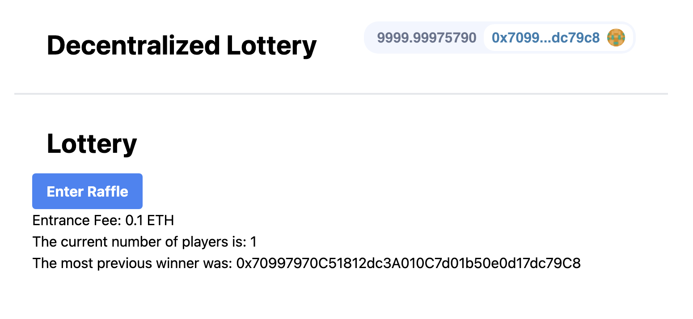
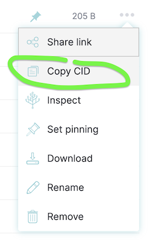

# NextJS Smartcontract Lottery (Raffle) FCC

This is a section of the Javascript Blockchain/Smart Contract FreeCodeCamp Course.

*[⌨️ (16:34:07) Lesson 10: NextJS Smart Contract Lottery (Full Stack / Front End)](https://www.youtube.com/watch?v=gyMwXuJrbJQ&t=59647s)*

[Full Repo](https://github.com/smartcontractkit/full-blockchain-solidity-course-js)



[Example App here!](https://fancy-dream-3458.on.fleek.co/)
[Example App on IPFS here!](ipfs://Qme4KacFx21y6pYuTC6veAU2usryXB3fNWqLkX3a2hMvDe)

Built with ❤️ using:
NextJS
Solidity
Chainlink
Moralis
web3uikit
Ethers
Hardhat
IPFS

- [NextJS Smartcontract Lottery (Raffle) FCC](#nextjs-smartcontract-lottery-raffle-fcc)
- [Getting Started](#getting-started)
  - [Requirements](#requirements)
  - [Quickstart](#quickstart)
  - [Typescript](#typescript)
    - [Optional Gitpod](#optional-gitpod)
  - [Formatting in VSCode](#formatting-in-vscode)
- [Useage](#useage)
  - [Testing](#testing)
- [Deploying to IPFS](#deploying-to-ipfs)
- [Deploy to IPFS using Fleek](#deploy-to-ipfs-using-fleek)
- [Linting](#linting)
- [Thank you!](#thank-you)

This project is apart of the Hardhat FreeCodeCamp video.

Video coming soon...

# Getting Started

## Requirements

- [git](https://git-scm.com/book/en/v2/Getting-Started-Installing-Git)
  - You'll know you did it right if you can run `git --version` and you see a response like `git version x.x.x`
- [Nodejs](https://nodejs.org/en/)
  - You'll know you've installed nodejs right if you can run:
    - `node --version` and get an ouput like: `vx.x.x`
- [Yarn](https://yarnpkg.com/getting-started/install) instead of `npm`
  - You'll know you've installed yarn right if you can run:
    - `yarn --version` and get an output like: `x.x.x`
    - You might need to [install it with `npm`](https://classic.yarnpkg.com/lang/en/docs/install/) or `corepack`

## Quickstart

```
git clone https://github.com/PatrickAlphaC/nextjs-smartcontract-lottery-fcc
cd nextjs-smartcontract-lottery-fcc
yarn
yarn dev
```

## Typescript

If you want to get to typescript and you cloned the javascript version, just run:

```
git checkout typescript
```

### Optional Gitpod

If you can't or don't want to run and install locally, you can work with this repo in Gitpod. If you do this, you can skip the `clone this repo` part.

[](https://gitpod.io/#github.com/PatrickAlphaC/nextjs-smartcontract-lottery-fcc)

## Formatting in VSCode

To have VSCode extension prettier auto-format `.jsx` and `.tsx`, add the following to your settings.json file:

```
  "[typescriptreact]": {
    "editor.defaultFormatter": "esbenp.prettier-vscode"
  },
  "[javascriptreact]": {
    "editor.defaultFormatter": "esbenp.prettier-vscode"
  }
```

# Useage

1. Run your local blockchain with the lottery code

> In a different terminal / command line

```
git clone https://github.com/PatrickAlphaC/hardhat-fund-me-fcc
cd hardhat-fund-me-fcc
yarn 
yarn hardhat node
```

> You can read more about how to use that repo from it's [README.md](https://github.com/PatrickAlphaC/hardhat-fund-me-fcc/blob/main/README.md)


2. Add hardhat network to your metamask/wallet

- Get the RPC_URL of your hh node (usually `http://127.0.0.1:8545/`)
- Go to your wallet and add a new network. [See instructions here.](https://metamask.zendesk.com/hc/en-us/articles/360043227612-How-to-add-a-custom-network-RPC)
  - Network Name: Hardhat-Localhost
  - New RPC URL: http://127.0.0.1:8545/
  - Chain ID: 31337
  - Currency Symbol: ETH (or GO)
  - Block Explorer URL: None

Ideally, you'd then [import one of the accounts](https://metamask.zendesk.com/hc/en-us/articles/360015489331-How-to-import-an-Account) from hardhat to your wallet/metamask. 

3. Run this code

Back in a different terminal with the code from this repo, run:

```
yarn dev
```

4. Go to UI and have fun!

Head over to your [localhost](http://localhost:3000) and play with the lottery!


## Testing

I didn't write any front end tests 😢

If you'd like to create some tests for this repo, please make a PR!

# Deploying to IPFS

1. Build your static code.

```
yarn build
```

2. Export your site

```
yarn next export
```

> Note: Some features of NextJS & Moralis are not static, if you're deviating from this repo, you might run into errors. 

3. Deploy to IPFS

- [Download IPFS desktop](https://ipfs.io/#install)
- Open your [IPFS desktop app](https://ipfs.io/)
- Select `import` and chose the folder the above step just created (should be `out`)

4. Copy the CID of the folder you pinned



5. Get [IPFS companion](https://chrome.google.com/webstore/detail/ipfs-companion/nibjojkomfdiaoajekhjakgkdhaomnch?hl=en) for your browser (or use [Brave Browser](https://brave.com/))

5. Go to `ipfs://YOUR_CID_HERE` and see your ipfs deployed site!


# Deploy to IPFS using Fleek

You can also have [Fleek](https://fleek.co/) auto-deploy your website if you connect your github. Connect to fleek and follow along the docs there. You'll get an IPFS hash and a "regular" URL for your site. 


# Linting

To check linting / code formatting:
```
yarn lint
```


# Thank you!

If you appreciated this, feel free to follow me or donate!

ETH/Polygon/Avalanche/etc Address: 0x9680201d9c93d65a3603d2088d125e955c73BD65

[](https://twitter.com/PatrickAlphaC)
[](https://www.youtube.com/channel/UCn-3f8tw_E1jZvhuHatROwA)
[](https://www.linkedin.com/in/patrickalphac/)
[](https://medium.com/@patrick.collins_58673/)
