## NextJS Smart Contract Lottery

We're getting into more advanced fullstack / frontend development.We've done the backend development.We've created smart contracts(raffle) in our last section.Previously we learned to build the frontend with raw HTML and JavaScript with our FundMe project.We created a frontend with just pure HTML and JAvaScript.Just creating application with HTML and JavaScript is great but doing it with those vanilla protocols has some limitations and working with a framework is going to make our lives alot easier.We're going to be able to develop quicker, have more functionality and do more in less time.

**NextJS Intro**

In particular we're going to be using NextJS framework.NextJS is a react based framework.React is a framework for building frontend and full stack applications.NextJS is a framework on top of the React framework.So if you aleady know react most of it ig going to come very naturally to you.The reason that we're using React and NextJS is because React is easily as of right now one of the most popular frameworks and languages out there with protocols like Uniswap and AAVE also using ReactJS.The react that we're using NextJS on top of ReactJS is that NextJS makes working with React much easier.NextJS is getting ton of steam and has some really advanced and easier to use features than just raw React.

**NextJS Setup**

Now I'm currently in hardhat raffle project that we did.We're going to create a new folder, although we're going to be coming back to the hardhat raffle from time to time to make a couple of updates.But let's go down the directory.`cd ..`and we're going to create a new directory `mkdir nextjs-raffle` then we go inside the directory `cd nextjs-raffle/` and open it in VScode.

To create a NextJS project:

`yarn create next-app .`

`.` create a NextJS project in the current folder.

Once we do this, in our file explorer section, we can now see all the different files that come boilerplate with.

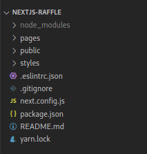

node_modules is going to be the packages in the installation.

pages is going to be the different pages on our site.To run the whole thing, we can just do : `yarn run dev`, and you can see on localhost 3000, we've our page.Index.js is our default page.We can create new pages.NextJS is basically based on React, you'll see the pages are with the weird combination of both JavaScript and HTML.React and NextJS allow us to do the combination of JavaScript and HTML._app.js is going to be our entry point for everything.The way React and NextJS work is everything called `component` based.In all of our files, you're going to see `export default function function_name`.What React and NextJS do is they say "Hey, The huge clump of HTML stuff that has a hodgepodge of JavaScript inside of it is considered a component."So all of our pages get wrapped through the `_app.js`You can think of _app.js is kind of the whole application or whole frontend and on the component, it sticks index.js.`api` is what we wanted to do like HTTP GET, HTTP POST requests but we're not to do any of that so we can pretty much ignore that.

public is going to be some public images.

styles is going to be the CSS of our project.

So most of what we're going to do is actually inside the pages folder and also going to create a couple of other folders that're going to be our main stuff.Let's add `.prettierrc` and `.prettierignore` so that I can format my code a little bit nicer.

.prettierrc
```json
{
    "tabWidth": 4,
    "useTabs": false,
    "semi": false,
    "singleQuote": false,
    "printWidth": 99
  }
```
You can grab prettierignore from last project.

Then we'll do `yarn add --dev prettier` so that we can auto format all of our code.

We're going to be using multi terminal feature.Right now I've one running my frontend and then I'll have one to do my scripts.We've `yarn run dev` running right now and if we go to our package.json, running "yarn run dev" just runs `next dev`.

```json
"scripts": {
    "dev": "next dev",
    "build": "next build",
    "start": "next start",
    "lint": "next lint"
  },
```

This next command comes built in once we installed next.

We want to build our frontend to enable people to interact with our lottery in a fair way and connect with the smart contract that's running.Let's create simple frontend pieces for this.First thing we're going to do is go to index.js, we're going to delete everything except that head piece.

```javascript
import Head from "next/head"
import Image from "next/image"
import styles from "../styles/Home.module.css"

export default function Home() {
    return (
        <div className={styles.container}>
            <Head>
                <title>Create Next App</title>
                <meta name="description" content="Generated by create next app" />
                <link rel="icon" href="/favicon.ico" />
            </Head>
        </div>
    )
}
```

We're going to change the name to "Raffle".

```javascript
import Head from "next/head"
import Image from "next/image"
import styles from "../styles/Home.module.css"

export default function Home() {
    return (
        <div className={styles.container}>
            <Head>
                <title>Raffle</title>
                <meta name="description" content="Decentralized Lottery" />
                <link rel="icon" href="/favicon.ico" />
            </Head>
            Hello!
        </div>
    )
}
```

**Manual Header I**

One of the first thing that we're going to need to do is to create a connect button.We've done this in the past with raw JavaScript but now we're going to do it with NextJS and React.The one that we've made previouslt is pretty minimalistic.It checked to see if there's window.ethereum and then went and requested and connected.

Now what it didn't do was alot of things that we would want our application to do.When we change networks, our application didn't detect that.When we change users our application didn't detect that.It was really stringent in the functionality that it actually had for connecting to a wallet.We're going to make our wallet connect button incredibly powerful so that you can connect with the button, you can switch networks, accounts, pretty much do anything in our application will know.Our application will be responsive.So that's going to be the one of the first things that we're going to do.We're going to create a header and connect button nav bar.

Now we can build our whole connect button on index.js and stick in inside the div tag but instead we're going to make it a component.So we're going to create a new folder called "components" and create a new file in here called "Header.js".You might also see a lot of people do `.jsx` both do the exact same thing.You can do either one.I'm going to do `.jsx` as a reminder that this is a react file that we're creating.This is a component that we're creating.If you want to learn a little bit about components, you can refer to [W3Schools](https://www.w3schools.com/react/react_components.asp).

They're basically independent and reusable bits of code.They serves the same purpose as the JavaScript functions but work in isolation and return HTML.Basically we're going to create a chunk of HTML that we're going to export into our index.js.Like just we've done in the past this helps to modularize and reuse this header component across our project.Now we're only going to use our header in one area however it's still nice to modularize the project regardless.To get started, this is going to be a functional component.So we're going to basically create a function called "Header" pretty much what we see in JavaScript except it's going to return some HTML.

```javascript
function Header() {
     return (<div>Hi from Header!</div>)
}
```

This is going to be a real minimilistic component.This is a valid component.Now we've this function that returns HTML and to give other application the ability to use this component, we'll do:

```javascript
export default function Header() {
     return (<div>Hi from Header!</div>)
}
```

and then in our index.js, we can import it.

`import Header from "../components/Header"`

So now we've imported our header in index.js, if we go back to our frontend,we don't see it there.Index.js is importing our header but it's not returning our header.Now that we've imported our header, we need to actually add our header.

```html
</Head>
<Header />
```

Now that we've returned the header, what do you think we'll see in the frontend?

We see "Hi from Header!" and then we see "Hello!".

Now anything that we do in our Header.js, will see reflected on our frontend.So this is going to be our section where we're going to make our header or navbar or all the functionality for the connect button.Let's learn the hardway first then after we become familiar with it and get idea of what's actually going on behind the scenes, we'll learn the easy way.

In our HTML FundME we just use raw ethers to kind of do everything and you absolutely can use raw ethers to do everything.However there're some packages especially for react that make life developing a front end substantially better.Some of the libraries are:

- Web3React
- wagmi
- react-moralis
- useDapp
- Web3Modal
- useMetamask

[React-Moralis](https://www.npmjs.com/package/react-moralis) is going to be the one that we're using.To get started, we can just do:

`yarn add moralis react-moralis`

You'll notice that I'm not doing them as dev dependencies because for our production builds, when we actually create the website, you'll need Moralis and you'll need react-moralis.We don't need prettier to create a website.Prettier is a tool that we're using as a developer.So in all of our project so far we've been using just devDependencies.That's because we've only been building ur projects for developers.They haven't been made to build a website.They've only been to do things on the backend.For our website, we're actually going to be building a frontend.So we need to put moralis and react-moralis in the dependencies section because we need to say "Hey these are the ones that we need to bundle up together for the frontend and you can ignore devDependencies bit".

```json
"dependencies": {
    "moralis": "^1.8.0",
    "next": "12.1.6",
    "react": "18.2.0",
    "react-dom": "18.2.0",
    "react-moralis": "^1.4.0"
  },
  "devDependencies": {
    "eslint": "8.18.0",
    "eslint-config-next": "12.1.6",
    "prettier": "^2.7.1"
  }
```

We're going to change the name from Header.jsx to ManualHeader.jsx.

```javascript
export default function ManualHeader() {
     return (<div>Hi from Header!</div>)
}
```

```html
</Head>
<ManualHeader />
```

The reason that we're doing this is because we're going to create a much simpler header after we create this kind of harder one.We're going to want to create a connect button which again we made in HTML FundMe by called `eth_requestAccounts`.In Moralis, we can just do this thing called `enableWeb3`. 

```javascript
import { useMoralis } from "react-moralis"

export default function ManualHeader() {

     const {enableWeb3} = useMoralis()

     return (<div>Hi from Header!</div>)
}
```

`useMoralis` is what's known as a `hook` as a React hook and it's a way to keep track of state in our application.Now in order to use moralis, our entire applications needs to be wrapped around what's called a `MoralisProvider` which is going to be a context provider for us.Basically we need to add the MoralisProvider to our app.js.So in our app.js, we're going to import.

```javascript
import { MoralisProvider } from "react-moralis"
```

and we're going to wrap our entire app around the MoralisProvider.

```javascript
return (
        <MoralisProvider>
            <Component {...pageProps} />
        </MoralisProvider>
    )
```

We get this error in our frontend.

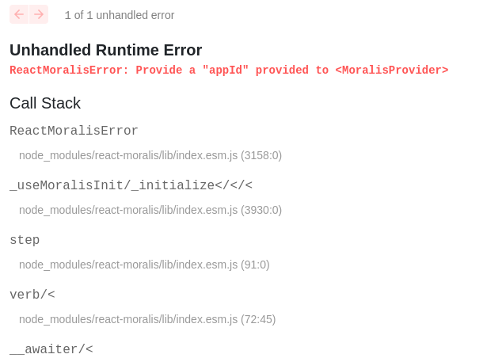

So we need to do:

```javascript
return (
        <MoralisProvider initializeOnMount={false}>
            <Component {...pageProps} />
        </MoralisProvider>
    )
```

This `initializeOnMount` is the optionality to hook into a server to add some features to our website.We don't want to hook into a server for this application, we just want eveything to be open source and we don't need any of the additional functionality.

**React Hooks**

This useMoralis is what's known as hook and hooks can be a little bit confusing to understand at first glance but they're incredibly powerful and de facto way for us to build react projects.If you're familiar with class components, we're not going to be using them because hooks are much better.We want our application to be different if we're connected to MetaMask versus if we're not.If we're not connected, we want to say "Please connect to a wallet" and then when we're connected we want to go ahead and be connected.Let's say if I don't have the hook and a variable connected.At the begining it's false.Let's say I've some button that connect us and changes connected to be true.

```javascript
export default function ManualHeader() {

     // const {enableWeb3} = useMoralis()
     let connected = false

     // some button that connects us and changes connected to true

     return (<div>Hi from Header!</div>)
}
```

Changing connected to be true is great and all but it won't rerender our application.We want to change our application based upon whether we're connected or not.We want our frontend to rerender when we're connected.If I just use a variable like connected inside of our component, our frontend isn't going to rerender or even worse if I use it outside, our component doesn't even know anything about this changing.

So hooks are a way for us to actually work with state especially and automatically rerender when something changes and enableWeb3 is going to be a function that we get from the useMoralis hook to do that.So for lot of our components, instead of declaring variables, we're going to be doing in hooks.For the most part, we usually want our website to change based off of if some variable has changed.enableWeb3 is a function that we get from the hook useMoralis that says "Ok, Go ahead and connect".enableWeb3 is basically the equivalence of saying `try await ethereum.request({method: "eth_requestAccounts"})`.

Now the way that we're going to use enableWeb3 only works with MetaMask but we'll show you how to work with different wallets.

**Mannual Header II**

Let's go ahead and create a button, that's going to do the same as what we did in our HTML FundMe.In our return bit, instead of "Hi from Header!", we're going to add a new button tag and call it "Connect".

```javascript
export default function ManualHeader() {

     const {enableWeb3} = useMoralis()

     return (<div>
          <button>Connect</button>
     </div>)
}
```

Now we see a little button that says Connect.We're going to give this some functionality.We're going to have our onclick call enableWeb3.

```javascript
export default function ManualHeader() {

     const {enableWeb3} = useMoralis()

     return (<div>
          <button>Connect</button>
     </div>)
}
```

Essentially with just this we've done pretty much everything that we'd back in big connect function in HTML FundMe.

Now in our frontend if we hit connect, we can see MetaMask popping us and gets connected.Now we've a way to actually get connected.

Let's add some functionality to make our application smart enough to have the connect button if we're connected and if we're not connected, not have that button.useMoralis comes with another hook called `isWeb3Enabled` which is just a variable part of our hook that keeps track of whether or not our MetaMask is connected.But we can actually do one better.We can actually check to see if there's an account because maybe web3 is connected but they didn't connected to an account.So we'll import `account` from useMoralis and will check to see if there's an account.

```javascript
export default function ManualHeader() {

     const {enableWeb3, account} = useMoralis()

     return (<div>
          {account ? (<div>Connected!</div>) : (<button onClick={async ()=>{
               await enableWeb3()
          }}>Connect</button>)}
          
     </div>)
}
```

If there's no account, we want to add connect button but if there's an account, we'll just show that we're connected.

Now if we go back to our frontend, we see connected.

Instead of just saying connected, we'll do:

```javascript
{account ? (<div>Connected to {account}</div>) : (<button onClick={async ()=>{}
```

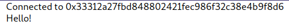

What a lot of people do is:

```javascript
{account ? (<div>Connected to {account.slice(0,6)} ...{account.slice(account.length-4)}</div>) : (<button onClick={async ()=>{}
```

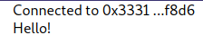

Because of this hooks, when I switch accounts and I connect with these new accounts, it even automatically rerenders switching accounts.So these hooks are really good for re-rendering our websites whenever some value changes.


**useEffect Hook**

Now here something that it doesn't do.If I hit refresh, I've to re-hit the connect button.Even though my MetaMask says, "Hey, we're connected" but if I hit refresh, I've to re-hit the connect button.Why is this happening?Or When I hit refresh, our website doesn't know that we've hit enableWeb3 already because we basically go back to blank when I refresh and then I've to hit connect which is really obnoxious.We want to add some functionality so that automatically the instant we render, we go ahead and check to see if we're already connected.If we're connected to, show connected.

To do that we can use another hook called "useEffect" and this is the core react hook.

```javascript
import { useEffect } from "react"
```

It's one of the most popular out there along with the useState.We basically have the useEffect function which takes two parameters, function as a first parameter, second it optionally takes a dependency array.This useEffect is going to keep checking the values in the dependency array and if anything in the dependency array changes, it's going to call some function and then re-render the frontend.For example useMoralis comes with the function called isWeb3Enabled.If we add this to our dependency array, in our useEffect function paramete, we could do:

```javascript
const {enableWeb3, account, isWeb3Enabled} = useMoralis()

useEffect(() => {
          console.log("Hi!")
          console.log(isWeb3Enabled)
     }, [isWeb3Enabled])
```

useEffect is constantly be running and it's listening to see if isWeb3Enabled changes.Anytime we run enableWeb3, isWeb3Enabled becomes true.Now if we go to the frontend, do a little refresh, we see:

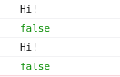

Now why do we see this twice?isWeb3Enabled only changed once? Well this is because of the strict mode.But if we go back to our frontend, hit connect, we now see:

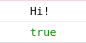


Because it saw isWeb3Enabled change to true because enableWeb3 made isWeb3Enabled returned true and it ran the code inside useEffect function again and that's how it actually works.

We actually don't even need to give an array.What happens if we don't give this as array?

Well hit refresh, hit connect and we'll see it still ran couple of times.So if we don't give it a dependency array, it'll run anytime something re-renders.You need to be careful with this because then you can get circular renders.If you have useEffects that changes some value and you've another useEffect that re-renders when the value changes while they're both just going to keep changing back and forth.So no dependency array, will run anytime something re-renders.

We'll give it a blank dependency array, it'll just run one time.


**Local Storage**

Now we're going to use the useEffect thing to make sure that when we hit refresh, it remembers that we're actually connected.So how do we do that?

Inside useEffect we're going to use isWeb3Enabled thing and the first thing that we just want to do is:

```javascript
useEffect(() => {
          if(isWeb3Enabled) return
          console.log("Hi!")
          console.log(isWeb3Enabled)
     })
```

If we're already connected to web3 then we don't need to do anything.

Now if we're not connected and we don't have an account, we want to go ahead and call enableWeb3.

```javascript
useEffect(() => {
          if(isWeb3Enabled) return
          enableWeb3()
     })
```

So now if I go back to our frontend, you'll see with just this code, I'm just automatically calling enableWeb3 but this can get really annoying because if I disconnect, hit refresh, it's going to always call enableWeb3.That's no good.We want to actually see if we're connected.

So the way we do this is to use our local storage.We want our application to remember that somebody hit the connect button and they went and connected to us.In our onClick function, we're not just going to call `await enableWeb3()`, we also going to store little remembrance here saying, "Hey, we actually did connect recently."So we'll do:

```javascript
{account ? (<div>Connected to {account.slice(0,6)} ...{account.slice(account.length-4)}</div>) : (<button onClick={async ()=>{
               await enableWeb3()

               window.localStorage.setItem("connected", "injected")
          }}>Connect</button>)}
```

window.localStorage relates to the local storage section of the application and we're going to set a new key value because in the future maybe we wanna do "connected" to "coinbase-wallet" or something but we're just going to say injected meaning we're connected to that metamask.In some version of NextJS, we can just do:

```javascript
if (typeof window !== "undefined"){
    window.localStorage.setItem("connected", "injected")
}
```

We're making sure there's a window.

Now if I go to the frontend and hit connect, we see now in our application's local storage, we'll see we've added the connected:injected bit here.

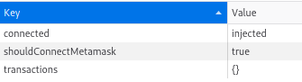

We're storing in the browser that we're indeed connected to the wallet.Now that we've added this into our browser, in our useEffect, if they're already connect we're done but before we do anything, let's check to see if we've the key pair in our storage and if they're already connected, let's just run that connect bit.

```javascript
useEffect(() => {
          if(isWeb3Enabled) return
          if (typeof(window) !== "undefined") {
               if (window.localStorage.getItem("connected")){
                    enableWeb3()
               }
          }
          // enableWeb3()
     }, [isWeb3Enabled])
```

Now we've some functionality in here which even when we refresh, it'll automatically run enableWeb3 for us.Now if I go ahead and hit refresh, we don't have to press that connect button anymore because it goes, "Oh! I see that locally we stored the connected key."Whenever you refresh, it checks for the key first and  sees it and then runs enableWeb3.

Now on the other side though, if we disconnect and then we refresh connect to MetaMask will show up and everytime we hit refresh, it'll keep showing up which we don't want.We want it to be when we disconnect, we tell it"Hey we've gone ahead and disconnected here."So back in our application, we can add another useEffect to check to see if we've disconnected.

In our new useEffect, we wanna say "Whenever there's a re-render, we want to run if any account has chnaged" and moralis has some functionality for us to do this as well.From useMoralis, we're going to import Moralis.

```javascript
const {enableWeb3, account, isWeb3Enabled, Moralis} = useMoralis()
```

and then in our useEffect, we'll do:

```javascript
useEffect(()=>{
          Moralis.onAccountChanged((account) => {
               
          })
     },[])
```

onAccountChanged takes a function as an input parameter.

```javascript
Moralis.onAccountChanged((account) => {
    console.log(`Accounts changed to ${account}`)
})
```

We can check to see if an account is null.

```javascript
console.log(`Accounts changed to ${account}`)
if (account == null) {
    window.localStorage.removeItem("connected")
}
```

If the account is null, we can assume that they've disconnected.

we'll also run deactivateWeb3 function which we import from useMoralis.

```javascript
if (account == null) {
    window.localStorage.removeItem("connected")
    deactivateWeb3()
}
```

deactivateWeb3 is going to set isWeb3Enabled to false.

In our frontend, We'll connect the metamask.If we just switch accounts, and go back to console it will say, "Account changed to ...".If we go to the storage, disconnect now, we can see the connected key and it's pair been removed from local storage.Also if I hit refresh, nothing will happen.

Now we've essentially made way more robust connect button where it goes back and forth with when we're connected.

**isWeb3Enable Loading**

One more thing that we wanna do when we hit connect, we want to disable the connect button.We don't want it to be able to be pressed.We'll use isWeb3EnableLoading from useMoralis.It checks to see if MetaMask has popped up.

```javascript
const {enableWeb3, account, isWeb3Enabled, Moralis, deactivateWeb3, isWeb3EnableLoading} = useMoralis()
```

In our button after the onclick section, we can add:

```javascript
return (<div>
          {account ? (<div>Connected to {account.slice(0,6)} ...{account.slice(account.length-4)}</div>) : (<button onClick={async ()=>{
               await enableWeb3()

               if (typeof window !== "undefined"){
               window.localStorage.setItem("connected", "injected")
               }
          }}
          disabled={isWeb3EnableLoading}
          >
          Connect</button>)}
</div>)
```

Now if we hit connect, we can see the button can't be clicked.

**web3uikit**

Now that we've learned to do the mannual way, let's learn the easy way.In our components, let's create a new file "Header.js" and we're going to install the `web3uikit`.It's a frontend kit and has a whole bunch of the components already built for us.So we can build like a header component and a connect button component just by using this.So to install it, we're going to run:

`yarn add web3uikit`

Again we don't want it to be devDependency because we want it to be a part of our website.

Then in our Header.js, we're going to import ConnectButton from web3uikit.

```javascript
import { ConnectButton } from "web3uikit"
```

In our function, we can use that ConnectButton.

```javascript
import { ConnectButton } from "web3uikit"

export default function Header() {
    return (
        <div>
            <ConnectButton moralisAuth={false} />
        </div>
    )
}
```

This connectButton does everything that the MannualHeader bit we've done so far.So back in our index.js, we'll comment importing ManualHeader and then import Header.

```javascript
import Header from "../components/Header"
```

Then instead of MannualHeader, we'll just do Header.

```html
<div className={styles.container}>
            <Head>
                <title>Raffle</title>
                <meta name="description" content="Decentralized Lottery" />
                <link rel="icon" href="/favicon.ico" />
            </Head>
            {/* <ManualHeader /> */}
            <Header />
            Hello!
</div>
```

we start our app with `yarn dev` again, and go to our page, we now see we have a connect button.

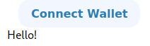

We can hit ConnectButton and it'll give us little model asking us which wallet we want to connect to.

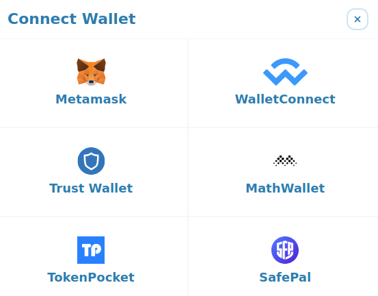

Asking us which wallet we want to connect to is kind of similar to our MannualHeader to the setItem("connected", "injected").For WalletConnect we'll do connected walletconnect etc.It allows us to connect in different ways and if we hit MetaMask, we go ahead and connect like so.

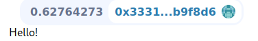

Even it has some nice styling here where it gives us our wallet address and the balance.Again if we go ahead and disconnect, it automatically disconnects.Setting the local storage in the background so that it knows where it's actually connected.But for headers moving forward, ueb3uikit is all you need.

**Introduction to Calling Functions in NextJS**

The main thing that the app need to do is just have a big button that says "Enter the lottery" and ideally show how many people are in the lottery and the recent winner as well.We'll create a new component called "LotteryEntrance.js".

```javascript
export default function LotteryEntrance() {
    return <div>Hi from lottery entrance</div>
}
```

Now that we do that, we need to import it in our index.js.

If we go back to our website, we see "Hi from lottery entrance!".

Well what is the first thing that we need to do in LotteryEntrance?

We're going to have a function to enter the lottery.Let's go ahead and do this.Let's go with how we did with html FundMe.We call that fund function like this:

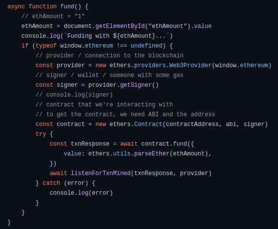

Doing it like this won't rerender and there's a whole lot of other functionality that doing it like this won't give us.So we're going to use Moralis to actually call some of these functions because in react-moralis, they've hooks to do pretty much anything we want it to do and one of these hook is called `[useWeb3Contract](https://www.npmjs.com/package/react-moralis#useweb3contract)`.It gives us a hook that will give us the data returned from a function call, error returned, function that we can use to call any function and also really helpful isFetching and isLoading.

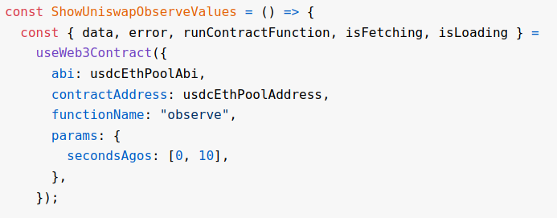

So if we want everyone to have our UI or our website so something while it's fetching or while it's loading the transaction, we can use these two variables to do that and all we need to do is pass the contract information to the useWeb3Connect.We're going to use the above syntax to make that transaction to the blockchain and to call these functions.

```javascript
export default function LotteryEntrance() {

    const {runContractFunction: enterRaffle} = useWeb3Contract({
        abi://,
        contractAddress: //,
        functionName://,
        params: {},
        msgValue://,
    })

    return <div>Hi from lottery</div>
}
```

Remember back into our Raffle, it doesn't take any parameters.All it takes is the `msg.value` bit.

**Automatic Constant Value UI Updater**

So how do we get all these stuff?We're going to comment it out for now.This is what we need to do but we need to get all these stuff into our code.So how do we actually get all these stuff?

Well ABI is easy.ABI isn't going to change at all no matter what network that we're on.It's always going to stay the same.Now if you've already deployed your smart contracts and you know exactly what address it is because you've deployed to a mainnet or a testnet all the stuff isn't really going to change and we can hard code it all in another file or we could do what alot of people do is create a new folder "constants" and in here we'll add like abi.json, contractAddresses.json etc.

We're going to build our application in a way we can actually test locally using our own hardhat network and then compare it to what it looks like on the actual test net.So we're going to make it network agnostic so that frontend work exactly the same no matter what network that we're on.

We go back to one directory,go inside hardhat-lottery and spin up our node here with `yarn hardhat node` and we'll use this as a blockchain that we're going to connect to.The thing is if I go back to my smartcontract and I'm building the frontend and I be like this would be better if I did X, Y, Z and maybe I change the name of some functions.I want that change to be reflected on my frontend and I want to be able to code my frontend as such.Since we're the only developer right now, we kind of have the ability of where we both know the back end code and the frontend code.So to make lot easier let's create a updateFrontEnd deplot script.So after we deploy stuff, we run a scripts that will create a constants folder for us with a whole bunch of stuff.It'll give an ABI, contract addresses and anything else we might need in our frontend from our backend.

We'll come back to our original code, in our deploy scripts, we'll create a new file called "02-update-frontend.js".We should always make this the last in our deploy folder.We can write a little script that's connected to our frontend so that whenever we deploy contracts no matter what chain, we can update that constants folder on our frontend.So let's go ahead and create that scripts right now.

```javascript
module.exports = async function () {}
```

We don't need to deploy any contracts because we're just updating the frontend.So the parameters are blank. 

Other thing that I like to do is sometimes I don't care about the frontend so I'll only update the frontend if we've specified a .env variable.So we'll create a .env variable called UPDATE_FRONT_END and set it to true.

Now in our scripts, we can say:

```javascript
module.exports = async function () {
    if (process.env.UPDATE_FRONT_END) {
        console.log("Updating front end...")
    }
}
```

So I'm going to create one function called updateContractAddresses and this function we're going to use to update contract addresses and then one called updateABI where we update the ABI's on the frontend.

```javascript
async function updateContractAddresses() {
}
```

First we're going to get that raffle contract since we're going to need to get the address.

```javascript
const { ethers } = require("hardhat")

async function updateContractAddresses() {
    const raffle = await ethers.getContract("Raffle")
}
```

We're going to pass this raffle address to our frontend.Since this is going to be a variable that we might use alot of places, we can just use it like:

```javascript
const FRONT_END_ADDRESSES_FILE = "../nextjs-raffle/constants/contractAddresses.json"
const FRONT_END_ABI_FILE = "../nextjs-raffle/constants/abi.json"
```

Now in our updateContractAddresses function, we can do:

```javascript
async function updateContractAddresses() {
    const raffle = await ethers.getContract("Raffle")
    const currentAddresses = JSON.parse(fs.readFileSync(FRONT_END_ADDRESS_FILE, "utf8"))
}
```

This is going to be our currentAddresses and we're going to update the list of currentAddresses with some new address because our contractAddresses we want it to be chain agnostic, we would do `4:address` on rinkeby and so on.We want to be able to keep track of all different addresses across all the different chains.

If we don't have raffle.address, we're going to go ahead and add the new address.

```javascript
if (chainId in getContractAddress) {
        if (!contractAddresses[chainId].includes(raffle.address)) {
            contractAddresses[chainId].push(raffle.address)
        }
    }
```

And then if the chainId doesn't even exist, we're going to go ahead and add the new address array.

```javascript
async function updateContractAddresses() {
    const raffle = await ethers.getContract("Raffle")
    const currentAddresses = JSON.parse(fs.readFileSync(FRONT_END_ADDRESS_FILE, "utf8"))
    const chainId = network.config.chainId.toString()
    if (chainId in getContractAddress) {
        if (!contractAddresses[chainId].includes(raffle.address)) {
            contractAddresses[chainId].push(raffle.address)
        }
    }
    {
        contractAddresses[chainId] = [raffle.address]
    }
}
```

Then finally that we've updated the object, we're going to write it back to the FRONT_END_FILEs.

```javascript
fs.writeFileSync(FRONT_END_ADDRESSES_FILE, JSON.stringify(currentAddresses))
```

Now we export the module.

```javascript
module.exports.tags = ["all", "frontend"]
```

We updated the contract address but we also need the ABI so we'll also create a function for it.

```javascript
async function updateAbi() {
    const raffle = await ethers.getContract("Raffle")
    fs.writeFileSync(FRONT_END_ABI_FILE, raffle.interface.format(ethers.utils.FormatTypes.JSON))
}
```

To pass just the ABI, we got it directly from the raffle object.raffle.interface turns a contract into a interface but it's different from a solidity interface but it allows us basically just to get the ABI.

Now in our backend, if we run `yarn hardhat deploy`, we should automatically update our contract addresses and abi.json.
