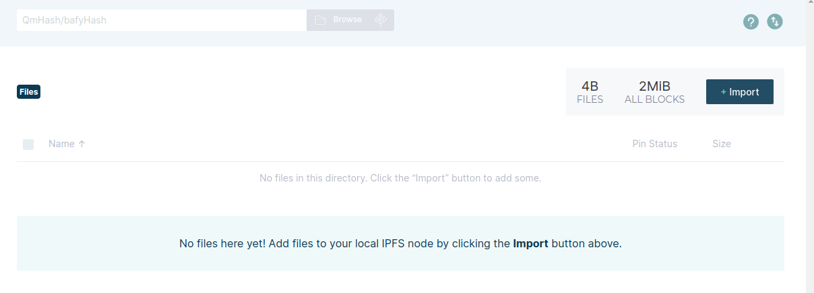
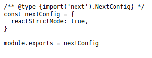
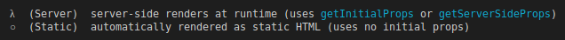
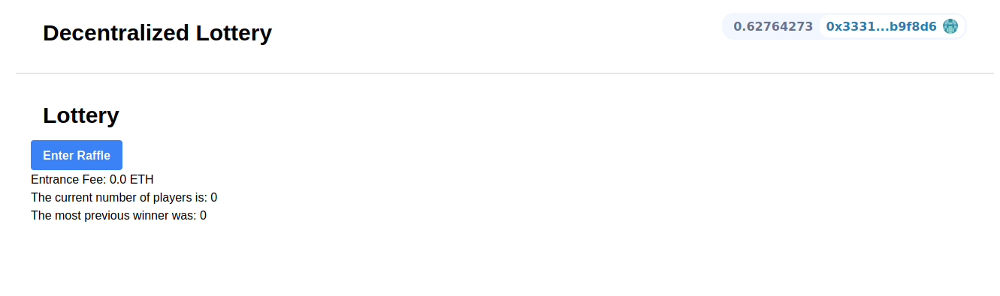
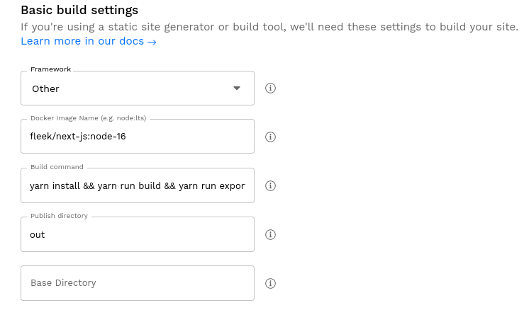
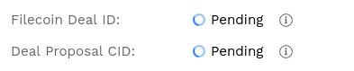

Back to our LotteryEntrance function.We just automated the process of updating our ABI's and then our contracts.Now we can import them into our files.We could import them at different line like `import abi from "../constants/abi.json"` or we could export them into the same file.So we'll create a new file inside components directory called "index.js" and in here we can import them and export them in one file.

```javascript
const contractAddress = require("./contractAddresses.json")
const abi = require("./abi.json")

module.exports = {
    abi,
    contractAddress,
}
```

Now we export them like this back in our LotteryEntrance, we can import them in just one line.

```javascript
import { abi, contractAddresses } from "../constants"
```

we can just specify the folder instead of each individual files because we've index.js which basically represents the whole folder.


**runContractFunction**

Back in our runContractFunction, let's uncomment and fill what we've.

```javascript
const {runContractFunction: enterRaffle} = useWeb3Contract({
        abi:abi,
        contractAddress: contractAddresses, // specify network Id
        functionName:"enterRaffle",
        params: {},
        msgValue://,
    })
```

How do we get the chainId and the msgValue?

ChainId is something that we can get easily with moralis.Once again we're going to import useMoralis hook from react-moralis.

```javascript
const {chainId} = useMoralis()
console.log(chainId)
```

The reason that moralis knows about what chain we're on is because back in our header component, the header actually passes up all the information about the MetaMask to the Moralis provider and then the Moralis provider pass it down to all the components inside those Moralis provider tags. 


This result is the hex version of our chainId.So chainId gives the hex edition of the chainId.

```javascript
const { chainId: chainIdHex } = useMoralis()
console.log(parseInt(chainIdHex))
```


Now the raffle address is something that we're actually going to use it alot, we might as well have it at the top of our code.We're going to be changing the raffle address.So we don't need to put it in a hook.We're going to be technically changing the address when we change networks but our header app takes care of rerendering and dealing with all that.

`const { chainId: chainIdHex } = useMoralis()` This line means pull out the chainId object and then rename it to chainIdHex.

```javascript
const { chainId: chainIdHex } = useMoralis()
const chainId = parseInt(chainIdHex)
// console.log(parseInt(chainIdHex))
const raffleAddress = chainIdHex in contractAddresses ? contractAddresses[chainId][0] : null
```

Now we've a raffle address and we can stick it on our function.

```javascript
const {runContractFunction: enterRaffle} = useWeb3Contract({
        abi:abi,
        contractAddress: raffleAddress, // specify network Id
        functionName:"enterRaffle",
        params: {},
        msgValue://,
    })
```

All we need now is the msgValue.If you remember back to our raffle we actually set that fee dynamically.We have i_entrance fee passed in constructor, so we wanna call the getEntranceFee function .This is one of the ways we send a transaction and also send functions.

One of the ways that we're going to do it is right when our lotteryEntrance loads, we're going to run a function to read that entrance fee value.How do we do that? Well we can use one of our hooks again.

```javascript
useEffect(() => {})
```

useEffect can run when something changes.We only try to get that raffle entrance fee, if web3 is enabled.So we'll pull isWeb3Enabled from useMoralis.

```javascript
const { chainId: chainIdHex, isWeb3Enabled } = useMoralis()
```

So in our function, we could say if web3 is enabled, we'll try to read the entrance fee.

```javascript
useEffect(() => {
    if (isWeb3Enabled) {
        // try to read the entrance fee
    }
})
```

We can use the useWeb3Contract wagan again.Let's go ahead and copy paste it and we'll use the same setup there.Except instead of enterRaffle, we're going to be doing getEntranceFee.functionName will also be getEntranceFee and msg.value nothing.

```javascript
const { runContractFunction: getEntranceFee } = useWeb3Contract({
        abi: abi,
        contractAddress: raffleAddress, // specify network Id
        functionName: "getEntranceFee",
        params: {},
    })
```

We're going to be calling the getEntranceFee function and now I'll show you how to actually call one of these in our contracts.Down in our useEffect, we're going to call useWeb3Contract.

Now if we just call getEntranceFee like this.
```javascript
if (isWeb3Enabled) {
            // try to read the entrance fee
            const entranceFee = getEntranceFee()
            console.log(entranceFee)
        }
```

If we look at our logs, we don't see anything.getEntranceFee is going to be an async function.Once again we need to do await getEntranceFee.But there's an issue:


well we can actually make an async function and stick these code inside the function.

```javascript
if (isWeb3Enabled) {
            // try to read the entrance fee
            async function updateUI() {
                const entranceFee = await getEntranceFee()
                console.log(entranceFee)
            }

            updateUI()
        }
```

Now if we go to our frontend, we still see nothing.Well isWeb3Enabled actually changes.So the first time the useEffect hook runs, isWeb3Enabled is probably is false but when it turns to true, we want to run the section.In our little dependency array, we're going to add isWeb3Enabled.The reason that it's false to start with is because of exactly what we showed in that manual header.Well in manual header, it first checks to see after we do a refresh, if `window.localStorage.getItem("connected")` then we call enableWeb3 which will make it enabled.So in our lotteryEntrance, isWeb3Enabled starts off as false when we do refresh and then the browser checks the local storage and says "Oh web3 should be enabled.Let's enable it." and turns it to true.

```javascript
useEffect(() => {
        if (isWeb3Enabled) {
            // try to read the entrance fee
            async function updateUI() {
                const entranceFee = await getEntranceFee()
                console.log(entranceFee)
            }

            updateUI()
        }
    }, [isWeb3Enabled])
```

Now if we hit refresh, in our console, we can now see a logged out entrancefee.


**useState**

Now we also want to show the entrance fee in our UI.So if we do `let entranceFee = ""`

```javascript
 async function updateUI() {
                entranceFee = (await getEntranceFee()).toString()
                console.log(entranceFee)
            }
            
return (
        <div>
            Hi from lottery<div>{entranceFee}</div>
        </div>
    )
```

If we hit refresh, there's still an issue here.We don't see entrance fee in the UI but we do see it in console.What's going on here?

Well useEffect is going to rerender our browser and that's what we want and isWeb3Enabled goes from false to true, our browser rerenders. But once we get our entranceFee, does our browser rerender?

No it doesn't because entrancefee is just one of these normal variables.So we want to actually change it from being just a normal variable to being a hook because entranceFee does get updated but it's not triggering a rerender.So we actually want to change it to being a `useState` hook.

```javascript
const [entranceFee, setEntranceFee] = useState("0")
```

entranceFee is going to be the variable that we call to get the entrance fee.setEntranceFee is going to be the function that we call to update or set that entrance fee and whenever that the entranceFee variable is set, we trigger a rerender from the frontend.And in our useState, we're giving a starting value.We're saying entranceFee is going to start with 0.

```javascript
async function updateUI() {
                const entranceFeeFromCall = (await getEntranceFee()).toString()
                setEntranceFee(entranceFeeFromCall)
                console.log(entranceFee)
            }
```

Now we can see that the entranceFee has indeed been rerendered.

Now to make it more human readable form, let's change it to ethers.

```javascript
return (
        <div>
            Hi from lottery
            <div>Entrance Fee: {ethers.utils.formatUnits(entranceFee, "ether")} ETH</div>
        </div>
    )
```

**Calling Functions in NextJS**

Finally we've the entranceFee and now use it to enter the lottery.For msgValue we're going to be use the entranceFee.

```javascript
const { runContractFunction: enterRaffle } = useWeb3Contract({
        abi: abi,
        contractAddress: raffleAddress, // specify network Id
        functionName: "enterRaffle",
        params: {},
        msgValue: entranceFee,
    })
```

We want to make our code that all works even if we're connected to supported chain.If we switch from hardhat to ethereum mainnet, we're going to get an error because we're calling getEntranceFee on an address that doesn't exist.So let's add a little button so that we can enter the raffle.Before we actually do that let's make sure that we can only call the function so long as there's actually is a raffle address.

```javascript
    return (
        <div>
            Hi from lottery
            {raffleAddress ? (
                <div>Entrance Fee: {ethers.utils.formatUnits(entranceFee, "ether")} ETH</div>
            ) : (
                <div> No Raffle Address Detected</div>
            )}
        </div>
    )
```

Now inside of the div where there's a raffle address found, let's add a button.

```javascript
<button
        onClick={async function () {
            await enterRaffle()
        }}
        >
        Enter Raffle
</button>
```

Now we can see "Enter Raffle" button on our UI.When we hit "Enter Raffle", MetaMask does indeed pops up and we can see our transaction goes through.We can now enter our Raffle.

**useNotification**

As you saw, we just got the MetaMask pop up and that's pretty much it.It's not very helpful for the users who're following along with this to look at this and go "Okat did it go through?Or did we fail like what happened?"So what we wanna do is create what's called notification's.We want a pop up saying "You sent your transaction."Again we're going to use the web3uikit which comes with the notifications that we can go ahead and use.

So back in our app.js, we're going to import NotificationProvider.

```javascript
import { NotificationProvider } from "web3uikit"
```

and inside of the MoralisProvider but outside of the components, we're going to do NotificationProvider.

```javascript
<MoralisProvider initializeOnMount={false}>
            <NotificationProvider>
                <Component {...pageProps} />
            </NotificationProvider>
        </MoralisProvider>
```

So wrapping our components in the notification thing.This is going to allow us to actually make notifications.Back in our LotteryEntrance, we're going to import a hook for those notifications.

```javascript
import { useNotification } from "web3uikit"
```

This useNotification gives us `dispatch`.

```javascript
const [entranceFee, setEntranceFee] = useState("0")

const dispatch = useNotification()
```

This dispatch is like a little pop up that will give us.So when we call enterRaffle, we're going to give to some parameters. 

```javascript
await enterRaffle({
                onSuccess: handleSuccess,
                onError: (error) => console.log(error),
                })
```

```javascript
const handleSuccess = async function (tx) {
        await tx.await(1)
        handleNewNotification(tx)
    }

const handleNewNotification = function () {
        dispatch({
            type: "info",
            message: "Transaction Complete!",
            title: "Tx Notification",
            position: "topR",
            icon: "bell",
        })
    }
```

You can find all these stuff right [here](https://web3ui.github.io/web3uikit/?path=/docs/5-popup-notification--hook-demo).

We're saying once the enterRaffle transaction is successfull, call handleSuccess function which is going to call handleNewNotification.

**Reading and Displaying Contract Data**

Now let's add a little bit more so that users know what else is going on with the lottery.Let's display how many people are in this lottery.We can do this because we've a numPlayers command.We also probably want to get the recentWinner.

```javascript
const { runContractFunction: getNumberOfPlayers } = useWeb3Contract({
        abi: abi,
        contractAddress: raffleAddress, // specify network Id
        functionName: "getNumberOfPlayers",
        params: {},
    })

const { runContractFunction: getRecentWinner } = useWeb3Contract({
        abi: abi,
        contractAddress: raffleAddress, // specify network Id
        functionName: "getRecentWinner",
        params: {},
    })
```

To store the value, we're going to use useState.

```javascript
const [numPlayers, setNumPlayers] = useState("0")
const [recentWinner, setRecentWinner] = useState("0")
```

In our useEffect let's do more than just the getEntranceFee.

```javascript
 async function updateUI() {
                const entranceFeeFromCall = (await getEntranceFee()).toString()
                const numPlayersFromCall = (await getNumberOfPlayers()).toString()
                const recentWinnerFromCall = await getRecentWinner()
                setEntranceFee(entranceFeeFromCall)
                setNumPlayers(numPlayersFromCall)
                setRecentWinner(recentWinnerFromCall)
            }
```

```javascript
Entrance Fee: {ethers.utils.formatUnits(entranceFee, "ether")} ETH Number of
Players: {numPlayers}
Recent Winner: {recentWinner}
```

If we go ahead and enter the raffle, once our transaction goes through, if we do refresh, we see number of players has been updated.But we had to refresh.We want to set something up so we automatically re-render.Guess what's going to do that.The handleSuccess that we're talking before.All of the updateUI stuff, we can actually pull out of useEffect and have it's be it's own stand alone function.

```javascript
 async function updateUI() {
        const entranceFeeFromCall = (await getEntranceFee()).toString()
        const numPlayersFromCall = (await getNumberOfPlayers()).toString()
        const recentWinnerFromCall = await getRecentWinner()
        setEntranceFee(entranceFeeFromCall)
        setNumPlayers(numPlayersFromCall)
        setRecentWinner(recentWinnerFromCall)
    }

useEffect(() => {
        if (isWeb3Enabled) {
            updateUI()
        }
    }, [isWeb3Enabled])
```

and then in our handleSuccess, whenever s successful transaction goes through, we're going to update the UI.

```javascript
const handleSuccess = async function (tx) {
        await tx.await(1)
        handleNewNotification(tx)
        updateUI()
    }
```

Now we want to test getting a recent winner.What we can do is back in our hardhat project, we want to create a new script, that's going to mock being a chainlinkVRF and mock being a keepers.You can copy paste from github repo cause all it's doing is pretty much what we did in our test.So in our hardhat lottery, we'll run both script.

`yarn hardhat run scripts/mockOffchain.js --network localhost`

If we hit a refresh in our website, we can see our winner gets updated.

**A note about onSuccess**

onSuccess isn't checking that the transaction has a block confirmations.It's just checking to see that the transaction was successfully sent to MetaMask.So onSuccess checks to see a transaction is successfully sent to the MetaMask.That why in handleSuccess function, we did tx.wait because that's the piece that's actually waits for the transaction to be confirmed.

Right now we're using Moralis to make once we call that mocking script, I had to refresh the browser to see the winner.That's not ideal.Ideally we want our UI to just automatically update when some events gets fired.In our raffle contract, we get the event emitted.Instead in our code doing the await success, what we could do is we could set up a portion to listen for that event being emitted and update the frontend accordingly.With that knowledge we can also listen for the winner event being emitted.We could update our frontend instead of having to refresh.

**Tailwind & Styling**

We've pretty much finished all the functionality.Let's make our UI look at least a little bit nicer.There's two things to think about when it comes to building these frontends.There's components libraries like web3uikit which we're using which gives us kind of like components that gives us blocks of code like the connect button that are already formatted for us.And then there's CSS libraries that actually will help us format the rest of our stuff.

We're also going to be use one of these formatting libraries and the library that we're going to use is `tailwind`.The reason that we're going to use tailwindcss is because it's really popular.

`yarn add --dev tailwindcss postcss autoprefixer`

Three of these basically make up tailwind with NextJS.Once we've those we're going to basically init tailwind and make a config file for tailwind.

`yarn tailwindcss init -p`

In our tailwind.config.js and styles/globals.css copy the exact code from it's [guide](https://tailwindcss.com/docs/guides/nextjs).

And if you see the red underline on your globals.css, you need to install `PostCSS Language Support` extension.

Now pre usual we can do `yarn run dev` and start adding tailwind to our divs.

Tailwind allows us in our divs to set everything as a class name and set some real minimilistic text in the class name.

Let's update our header.We want to give our header a border.

```javascript
<div className="border-b-2">
    Decentralized Raffle
    <ConnectButton moralisAuth={false} />
</div>
```

We need to kill the frontend and re-run with yarn dev.

```javascript
<div className="p-5 border-b-2 flex flex-row">
            <h1 className="py-4 px-4 font-blog text-3xl">Decentralized Raffle</h1>
            <div className="ml-auto py-2 px-4">
                <ConnectButton moralisAuth={false} />
            </div>
        </div>
```

We can see now our connect button is on the side and are sepereated which kind of look nice.

Now we're going to go back to out LotteryEntrance.

```javascript
<div className="p-5">
            Hi from lottery
            {raffleAddress ? (
                <div>
                    <button
                        className="bg-blue-500 hover:bg-blue-700 text-white font-bold py-2 px-4 rounded ml-auto"
                        onClick=.....................
```

Some functionality, we didn't add in out button.

```javascript
onClick={async function () {
                            await enterRaffle({}}

                        disabled= {}
                    >
                        Enter Raffle
                    </button>
```

In our enterRaffle, it comes with isLoading and isFetching.

```javascript
const { runContractFunction: enterRaffle, isLoading, isFetching } = useWeb3Contract({})
```

Now if our transaction is loading or fetching, we'll just make the button disabled.

```javascript
disabled={isLoading || isFetching}
```

Something else we wanna do when it comes to loading or fetching.When it's loading or fetching, we probably want it to have that little spinny thing.

```javascript
{isLoading || isFetching ? (<div className="animate-spin spinner-border h-8 w-8 border-b-2 rounded-full"></div>
                        ) : (
                            <div>Enter Raffle</div>
                        )}
```

```javascript
<div>Entrance Fee: {ethers.utils.formatUnits(entranceFee, "ether")} ETH.</div>
<div>Number of Players: {numPlayers}</div>
<div>Recent Winner: {recentWinner}</div>
```


**Introduction to Hosting your Site**

We have an app that we really like and we want to deploy it.Let's talk about how we can deploy this.We're going to deploy our contracts to Rinkeby and then we're going to deploy our website to a hosting provider.

If we want to host our beautiful website that we just created, there are ways to deploy using things like Vercel or Google Cloud or AWS.Thing about these is that these are all centralized deployment places.Having a centralized deployment application can still be incredibly important.If you look at Etherscan for a second.Etherscan is a centralized application but it's still the one that we've been using alot.However if we want to have a frontend that's decentralized well that's a little bit harder.The more important thing for us is that our backend or smart contracts are decentralized.That's the most important thing because that will give users the ability to interact with our logic in a decentralized way but maybe we also want our frontends decentralized.

Now at some point we will still use a centralized service like Vercel to deploy an application and we'll know why we get there.There are some features that right now they're really just hard to do without like a really solid centralized back end.What's important to keep in mind is that our backend, the logic of our contract is on a decentralized blockchain.So even if we host the frontend on a decentralized hosting provider, using some type of centralized database to make the frontend easier to work with, the logic of the application is decentralized.


**IPFS**

The tool that we're going to host our frontend in a decentralized manner is IPFS.It's the distributed decentralized data structure that's not exactly a blockchain but it's similar to a blockchain.There's no mining though but there's pinning data, you can add data to this.You can read how it works on the [site](https://ipfs.io/#how).

We've our code or our file.We've some piece of data.Now as we know when you've really anything you can hash that thing, hash that data and get a unique output.So that's actually the first thing that IPFS does.It hashes our data to get a unique hash that only points to that data.You IPFS node does that hashing for you and every single IPFS node on the planet has the exact same hashing function kind of like blockchain.So we can hash our data on our IPFS node and get the unique output.

We can then pin that data or pin that code to out node.Our node is connected to a network of other IPFS nodes.So there's a massive network of people running IPFS nodes, they're incredibly lightweight, way lighter weigth than any other blockchain node and they all talk to eachother.So if I ask the network, "Hey I want to get the hash", all the nodes talk to eachother and eventually they'd reach up at our node saying, "Oh I found a node that has that hash.Here's a file associated with it."

Now you might be thinking that's kind of centralized because we have the data on one node here.You're right but what other nodes can do is they can say, "Oh that data looks really cool, I want to have that persist."They can pin our hash and they'll get a copy of your data on their node and you can keep doing this and so you easily allow an entire network to easily replicate any code or any data in a decentralized sense.They're incredibly easy to spin up and to work with.

Something about IPFS that makes it drastically different than a blockchain is that they can't do smart contract.There's no execution.It can only store.It's just decentralized storage that IPFS can do.

Now the issue here is that in order for our data to really be decentralized another node does need to pin our data because if we're the only IPFS node that's go the hash, it's kind of centralized on our node.If our node goes down, that data is gone and network won't be able to access that data anymore.So we'll talk about the strategies in the future about people having other people pin your data but for now this is a way we can host data, we can send code  and have it be in a decentralized context.

So unlike a blockchain, where every single node in a blockchain is going to have a copy of the entire blockchain.IPFS nodes get to optionally choose which data they want to pin and they can't do any execution.So you could have a IPFS node half a megabyte and you could have an IPFS node that several terabytes.It's upto the node operators how much data and what data they want to pin.


**Hosting on IPFS**

Let's actually deploy our wonderful application to IPFS so that anybody can use it and anybody can connect to it so long as our node is up.

First we're going to do this kind of the manual way because I'm going to show you how to install IPFS and work with IPFS.You can get it with a desktop application or a command line or also add IPFS to our browser.We want to use those hashes as urls.so we want to be able to put that url in our browser and connect to that node or that piece of code.

We're going to have you install the [IPFS desktop](https://docs.ipfs.io/install/ipfs-desktop/#ubuntu).Once you install it, you might see IPFS is running, you can restart, stop and all other things.We want to go to the files section and get a little pop up that look like this.



Let's just go ahead and import file and maybe for now we'll only import next.config.js.

We can actually copy the CID and we can view this in our browser.

`http://bafybeiam2xxvmnfprgxf7hzwhzfmdn6bixc2rojodpnm5iruafv67p7way.ipfs.localhost:8080/`



So we're going to deploy our website to IPFS so that anybody else who wants to pin this can and we will now have the ability to have an incorruptible and unpulldownable website which is just awesome.We're going to learn how to do it the raw way first and then we're going to use the tool that's going to make it easier for us.

NextJS has the ability to create static websites and that's going to be an important term to know.We're going to make a static website.At the moment we don't want our website to be tangled with any server stuff because if our website runs with server stuff and we deploy it to IPFS, well IPFS doesn't have the ability to run any code.It just hosts code.If our frontend has any server stuff.It won't work.

In it's current state IPFS can't come to our project and know what to do.It doesn't know how to do `yarn dev`.It can't do yarn dev.We need to put all of our code into it's static equivalent.So to do that we're going to do ``yarn build` and running this build command is going to build our code what's called like a `production build`.



There's some server based application that NextJS comes with that if we use them, our static build won't work.You'll see when we run `yarn next export` it'll fail if you have any non-static stuff.

Now we've a new folder called `out`.It's a folder that's just pure static code that we can use on IPFS.Now that we've the out folder, we can go back to the IPFS and can import a folder.We're going to import that whole folder here.We can pin the out folder to our local node.

Once it's up, we can copy the CID and type `http://bafybeigt5vmzc36dsrngfd36ka7ofepy2yjxi3dqd3tnj7t7d643x4xezq.ipfs.localhost:8080/` and we immediately get dropped into smartcontract lottery in a browser.




**Hosting on IPFS & Filecoin using Fleek**

Now we know to do the mannual way of adding our code to IPFS.Let me show you the easier way of adding your code to the IPFS.We're going to go to [fleek](https://fleek.co/).It's kind of an auto deployment for our websites and additionally it does some things to help out with that problem talking about how we want to get other nodes to pin our data.So it helps us out with that.

Let's go ahead and sign up.Let's go ahead and add a new site.



If you get the error while deploy change the build command to `yarn install && yarn run build && yarn next export`.It's going to run these three commands and deploy us a site for us both on IPFS and it's going to give a regular URL that we can use for normies, if you will. 

While this deploys, we'll actually see down here:



IPFS like I said we need other people to host our node.Filecoin is actually a blockchain that helps you pin your data and uses decentralized storage to do so and fleek helps you create those deals and helps you pin your data with these filecoin Blockchain.And once it's done, we get a little deployed website.We can see, we've a little website in here.

If we make changes to our repo, we add that repo in the github and hit refresh, in our fleek we can see new deploy script going through.It'll automatically deploys your new site.It'll automatically create a new IPFS hash for your new data.However it'll still be on the same website.


**Filecoin Overview**

Filecoin isn't going to be the technology we're going to go too deep into.Like I just said IPFS does have this limitation.It doesn't have data persistence.You have to have people pin your data in order for to stay distributed and stay decentralized.Filecoin is a blockchain dedicated to keep this data both decentralized and persistent.


**Summary**

We learned more about NextJS.We learned we can have an application using NextJS and it's framework that going to allow us to build really powerful frontends and fullstack application really easily.We learned about the layout of the NextJS project.We add components in a components folder which are basically minimalistic blocks of JavaScript and HTML that we can use to modularize and create our website our of these components.Constants is a folder that we can put constant variables, out folders is what happens when we export all of our code to a static example, pages are basically the routes for the different pages of our website.Everything goes through app.js.Styles is for any css or styling our application.

In our app.js, we have our app surrounded by the NotificationProvider and MoralisProvider.All of our components and pages run through the app.This is kind of considered the entry point for our entire application.Having the MoralisProvider wrapped around our Notifications and components means that we don't have to pass parameters between our components and our lottery will just know what chainId that we're on because our header is going to pass it up to MoralisProvider and the MoralisProvider is going to pass to back down to our LotteryEntrance.

We saw with our manual header the way that connect button works behind the scene.We learned about useEffect and useState and different hooks in our frontends where one of the main reason we want hooks is we want our websites to rerender when stuff changes.We want our components to be able to talk about the state of the blockchain with eachother and they're incredibly powerful for building React applications.

useEffect is one of the most popular ones where if we don't have a dependency array, our function inside of our useEffect will run anytime something rerenders.A blank dependency array means it'll just run once on load and if there are dependencies in the array, it'll run anytime of the variable in those change.We also learned about the useState hook which is really similar to saying like let variables equals x but it also comes with rerendering ability.

We learned how to call different contract functions with Moralis.Not only sending transactions but also calling data.Moralis is smart enough to know that when it sees getEntranceFee that it's going to be a view function.We added a button calling one of these Moralis pieces and then had an onSuccess section where when our transaction completed, we update the UI and add a little pop up for notifications.We learned how to deploy our code directly to IPFS and use that IPFS hash to interact and see our code.We also learned about fleek and how fleek automatically deploys to IPFS whenever we do a git push to our Github repository and it makes continuously updating our website much easier.It also gives us a regular canonical URL as well.We finally learned about IPFS and decentralized database storage.
