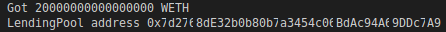
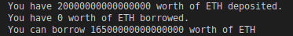
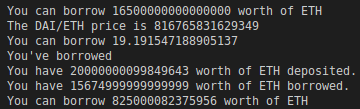
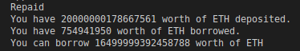

## Hardhat Defi and Aave

[Defi](https://chain.link/education/defi) is one the best use cases for smart contracts. Defi stands for Decentralized Finance.We move away from the area of traditional agreement and that's what smart contracts are all about. They're about removing the centralized entity from our financial world and especially from the financial institution that have a conflict of interest.They are in the business to make money not to keep our money safe not to make us money and we want to work with the system where everything is transparent especially when it comes to our financial services.

So we want to move to this world of smart contracts especially when it comes to our money.Defi is going to be the industry that effects the masses the quickest because of how much fair how much better decentralized finance is than centralized finance and at the moment the rates, the yeild and the interest that you gain in the defi is much better then centralized finance because remember we go away from centralized protocols saying "Hey trust us.We'll give you access to markets.Put your money in us and we'll keep it safe."Instead of having to trust these entities to cryptographic math based agreements which is what we want and additionally the more our oracle networks get better and the more Oracle's network work with these smart contracts platform like Ethereum, Polygon etc the more data and the complex financial product we can do.

We can actually see a pretty good summary of what's going on in [defi](https://defillama.com/).It shows total value locked in all the different decentralized protocols and we can see alot of them are across multiple chains.Aave is the number one protocol for total value locked.Aave is the protocol that we're going to be going over today.

**What is Aave?**

Aave is a borrowing and lending protocol.It allows us to borrow and lend cryptocurrencies.We can actually put down a token as collateral.It's kind of similar to putting money in a bank and earn yeilds on other people borrowing that collateral from us.Almost exactly what a bank does except for the fact it's what's called `noncustodial`.So the Aave team never touches the money.Nobody ever touches the money.It's all just smart contract.It's all just programmatic code.So we can be rest assured no one's going to run off with our money.No one's going to do anything bad and we also gain these higher yeilds.

Borrowing and lending is a critical piece for creating really any interesting financial applications.If you want to short sell something or leverage up on some asset or more complex financial products, you need borrowing and lending.Now alot of typical Fintech or financial technology or finance terms do apply here.

For more details of Defi and Aave check out [day16](https://github.com/spo0ds/Journey-to-become-a-Blockchain-Engineer/blob/main/Day16/Day16.md), [day17](https://github.com/spo0ds/Journey-to-become-a-Blockchain-Engineer/blob/main/Day17/Day17.md), [day24](https://github.com/spo0ds/Journey-to-become-a-Blockchain-Engineer/blob/main/Day24/Day24.md), [day25](https://github.com/spo0ds/Journey-to-become-a-Blockchain-Engineer/blob/main/Day25/Day25.md), [day26](https://github.com/spo0ds/Journey-to-become-a-Blockchain-Engineer/blob/main/Day26/Day26.md) and [day30](https://github.com/spo0ds/Journey-to-become-a-Blockchain-Engineer/blob/main/Day30/Day30.md) for more details but if you in a hurry don't miss day16 and day17.

**Programatic Borrowing and Lending**

We're going to be working with Aave V2 protocol.If you want to try out the V3, you absolutely can.We're going to make the new folder `mkdir hardhat-defi` and open the folder in vscode.We're going to create a new project `yarn add --dev hardhat`.We'll run `yarn hardhat` and select empty hardhat.config.js.Copy paste the hardhat.config.js from the past project into this one so that we don't have to go through that boilerplate setup again.Also copy paste this:

`yarn add --dev @nomiclabs/hardhat-ethers@npm:hardhat-deploy-ethers ethers @nomiclabs/hardhat-etherscan @nomiclabs/hardhat-waffle chai ethereum-waffle hardhat hardhat-contract-sizer hardhat-deploy hardhat-gas-reporter prettier prettier-plugin-solidity solhint solidity-coverage dotenv`

Copy paste the prettier file i.e .prettierrc.

```json
{
    "tabWidth": 4,
    "useTabs": false,
    "semi": false,
    "singleQuote": false,
    "printWidth": 100
  }
```

Now we've a minimalistic project spun up.Let's go ahead and get started learning how to interact with the Aave protocol.

First we're going to be able to do how to programatically deposit collateral and in doing so we earn yeild.We earn that percentage return just on our deposited collateral.But let's say we want to go one step further.We want to get into these more interesting financial products.So after we deposit some collateral, we're going to learn how to programatically borrow another asset.Deposited collater is going to be ETH/wETH and we're going to borrow another asset which is DAI.The reason that we're using DAI is because DAI is what's known as a stable coin.So DAI is actually a token on the blockchain created by the makerdao where the price of the DAI token is always pegged to $1 and then we'll just repay the DAI.We'll repay almost everything back.If you want to learn about short selling do checkout [day30](https://github.com/spo0ds/Journey-to-become-a-Blockchain-Engineer/blob/main/Day30/Day30.md) of the journey.

One other protocol that I want to talk about quickly is the Uniswap protocol and it's become the heaven for trading.It's a decentralized application that allows us to trade assets and tokens with eachother on something called an `automated market maker`.It ends basically a decentralized Stock Exchange but with tokens and again tokens aren't exactly stocks.They're very different.

So when looking to get some assets like wrapped Ethereum or DAI or Link token, on a mainnet oftentimes you're going to use one of these decentralized exchanges and obvioulsy these decentralized exchanges are much fairer because everything that happens on them is transparent much fairer than centralized finance.You can see everything that's going onchain.

Let's go ahead and get started.Let's create a scripts folder because in this project we're not going to create our contract ourself.We're just going to learn how to interact with these protocols.We'll put all staking and borrow into scripts called "aaveBorrow.js".Since this is a script, it's going to have the same setup as we've seen before.

```javascript
async function main() {}

main()
    .then(() => process.exit(0))
    .catch((error) => {
        console.error(error)
        process.exit(1)
    })
```

If we go to the [protocol](https://docs.aave.com/developers/v/2.0/the-core-protocol/protocol-overview), we kind of read through the docs and eventually we'd find out the protocol treats everything as an ERC20 token but we know the Ethereum or the native blockchain token that you're using, isn't an ERC20 token.The reason that it treats everything like an ERC20 token is that it's just much easier.Everything is using just ERC20 token standard and it's much easier to send in and interact with it.

**WETH (Wrapped ETH)**

On a lot of these protocols, when we go to deposit Ethereum or Polygon etc, they send your Ethereum through WETH gateway and swaps it for WETH.It's basically Ethereum but in an ERC20 token contract.So we want to do that same thing.We're going to skip kind of using the WETH gateway and we'll just get the web token ourselves and we'll use that as a colleteral.So in our scripts, we're going to make another file called "getWeth.js".In here we're actually going to go ahead and build a script that will deposit our token for WETH token.We can see the WETH token in [etherscan](https://rinkeby.etherscan.io/token/0xc778417e063141139fce010982780140aa0cd5ab#writeContract).

The way it works is you actually deposit Ethereum and in return, it'll give you the WETH token.

In our getWeth, we're not going to add calling main bit.We'll create getWeth just as kind of a module and import it into our aaveBorrow.

```javascript
async function getWeth() {}

module.exports = { getWeth }
```

We're going to export it so that our aaveBorrow can use this getWeth script that we're creating right now.In order to interact with the contract, we're going to need an account.

```javascript
const { getNamedAccounts } = require("hardhat")

async function getWeth() {
    const { deployer } = await getNamedAccounts()
}
```

Now we want to call the deposit function on the weth contract.How do we call the weth contract? How do we call any contract? Well we need the ABI and then the contract address to interact with the contract.We know that the if we give our project the whole contract, it'll get the ABI but we also know if we just do the interface, that's just as good.It won't give us all the functionality but it'll give us the ABI.It'll tell our ethers what functions it can use.So we're going to create a new folder "contracts".In here we're going to create a new folder inside of that called "interfaces" and this is where we're going to create our weth interface.

Weth interface is going to be really similar to ERC20 interface.So if you want to go ahead and try to add it yourself feel free to do so or you can copy from the Github repo.

In order for it to compile, we need to use 0.4.19 version of solidity.So we come over to our hardhat.config,

```javascript
solidity: {
        compilers: [{ version: "0.8.8" }, { version: "0.4.19" }],
    },
```

In order to make sure we get the ABI, do `yarn hardhat compile`.

Great we compiled the interface, now we have the ABi to interact with.Let's go ahead and get the contract address.But for reasons that we're going to learn about very soon, we're actually going to just work with mainnet.We're going to copy the address of [mainnet](https://etherscan.io/token/0xc02aaa39b223fe8d0a0e5c4f27ead9083c756cc2).We've the ABI compiled from the interface and contract address from mainnet.Let's go ahead and create this contract now.

```javascript
async function getWeth() {
    const { deployer } = await getNamedAccounts()
    const iWeth = await ethers.getContractAt(
        "IWETH",
        "0xC02aaA39b223FE8D0A0e5C4F27eAD9083C756Cc2",
        deployer
    )
}
```

We're saying "Let's get this weth contract with the ABI of IWeth at that address connected to deployer."Now we could go ahead and deposit some amount.

```javascript
const AMOUNT = ethers.utils.parseEther("0.02") // outside getWeth function

const tx = await iWeth.deposit({ value: AMOUNT }) // inside getWeth function
await tx.wait(1) 
```

Then we'll just get the balance.

```javascript
const wethBalance = await iWeth.balanceOf(deployer)
console.log(`Got ${wethBalance.toString()} WETH`)
```

So we're using the mainnet address in here and depositing some amount then get the balance.We're depositing our Ethereum so that we can get the ERC20 version of Ethereum.

**Forking Mainnet**

Now you might be thinking `"Why are you putting the mainnet address in here?Let's create a mock Weth token contract address, deloy the mocks first and then we'll go ahead and use that same setup that we've been doing the whole time. Why are you directly hardcoding the address in here?"`

Well there's another way we can run tests in our smart contracts and this is with something called mainnet forking.We can actually do something where we fork the mainnet and run a local hardhat node that's pretending to be a mainnet node.All we have to do is update our hardhat config to do so.

We've an example of blockchain.It's going to be something similar to a testnet or a mainnet like Rinkeby, Ethmainnet, Polygon etc.This is going to be the blockchain that we deploy to.There're whole bunch of blockchain in here.We have this huge chain that we can work with and all the information on the blockchain is public information.Each one of the block can have whole bunch of transactions.In addition to all these transactions, it's going to have things like pricefeeds contracts, aave contracts, weth token contract etc.all this contract information is public.So hypothetically, if it's already there, we should be basically able to copy this to our local environment and do some simulations ourselves and that's exactly what forking does.

A forked blockchain literally takes a copy of an existing blockchain and bring it on our local computer.We actually have control over our blockchain that's running locally because it's going to run on a local computer similar to hardhat.Now, everything that we do on this local forked blockchain is not going to affect mainnet because it's a simulated blockchain.It's just running in our local environment.So we can actually interact with this forking this kind of local blockchain that resembles that mimics the actual blockchain.Here's what forking doesn't do.It doesn't download the entire blockchain into our local setup.Anytime we `reference an address`, we make an API call to our Ethereum node which again we're using `Alchemy` and say "What's at this address" and it'll return just that specific contract for us.This way we don't have to download the whole blockchain and it's alot quicker and we can also do this forking to run our tests to run our scripts to do everything.

You might be thinking "This sounds awesome.Why don't we do this for everything?"Well there're some trade offs.The pros are that it's quick, it's easy and a test will resemble what's on mainnet.Now the cons are that we need an API, some contracts are complex to work with and mocks might just be better.But using a forked network might be a good way to run your tests.It might be good alternate to just using mocks.It really depends on what's right for you and right for your project.It's a fantastic tool especially for Aave where we can quickly test some things.

Now the hardhat forking will also give us some fake accounts.So we'll still get a bunch of fake accounts on mainnet that will be given Ethereum.We'll get fake mainnet accounts for the forking.Let's go to our hardhat.config.js, go to our networks and we'll add hardhat there.For the url, we're going to use Alchemy.Alchemy is fantastic at these forked blockchains.So we can come to Alchemy dashboard, create a new app which will be for Ethereum mainnet and create it.We'll garb our API key and add it to our .env.In our hardhat, we're now going to be forking from mainnet RPC URL.

```javascript
const MAINNET_RPC_URL = process.env.MAINNET_RPC_URL

networks: {
        hardhat: {
            chainId: 31337,
            forking: {
                url: MAINNET_RPC_URL,
            },
            blockConfirmations: 1,
        },
```

We're now going to be forking from mainnet RPC URL whenever we work with the hardhat blockchain.Now that we've this in here, let's go ahead and try to run this getWeth function because since we're forking the blockchain, we should be able to go ahead and simulate this.

Back in our aaveBorrow, we'll import getWeth.

```javascript
const { getWeth } = require("../scripts/getWeth")

async function main() {
    await getWeth()
}
```

So to run our scripts here, we'll do `yarn hardhat run scripts/aaveBorrow.js`

Now we've a way to interact with a mainnet locally.

Let's set up the rest boilerplate in aaveBorrow.

```javascript
const { getNamedAccounts } = require("hardhat")
const { getWeth } = require("../scripts/getWeth")

async function main() {
    await getWeth()
    const { deployer } = await getNamedAccounts()
}
```

**Depositing into Aave**

Now we're going to start interacting with the Aave protocol.Well what do we need? We're going to need the ABI and the address.So we can go to the [Aave docs](https://docs.aave.com/developers/v/2.0/) and find the contract address in here.The way Aave works is they actually have a contract which will point us to the correct contract.The contract that we're going to be doing all the lending with is the [Lending Pool](https://docs.aave.com/developers/v/2.0/the-core-protocol/lendingpool) and there's actually a contract to get that contract address.To get the lendingPool address we've to go to the [lendingPoolAddressesProvider](https://docs.aave.com/developers/v/2.0/the-core-protocol/addresses-provider/ilendingpooladdressesprovider).It's this contract that will tell us what the address of the lendingPool is.We can actually see the [deployed contract section](https://docs.aave.com/developers/v/2.0/deployed-contracts/deployed-contracts) and see the address of the LendingPoolAddressProvider.We can copy the address and make note of it.

```javascript
// LendingPoolAddressesProvider: 0xB53C1a33016B2DC2fF3653530bfF1848a515c8c5
// LendingPool: get from LendingPoolAddressProvider
```

Let's actually create a function that will get us the lendingPool address from the LendingPoolAddressProvider.We can use the interface right from the [documentation](https://docs.aave.com/developers/v/2.0/the-core-protocol/addresses-provider/ilendingpooladdressesprovider).Let's create a new file inside interface "ILendingPoolAddressProvider.sol" and paste it in here.We see we're just using 0.6.12 so be sure to put it in our hardhat config. 

```solidity
solidity: {
        compilers: [{ version: "0.8.8" }, { version: "0.4.19" }, { version: "0.6.12" }],
    },
```

Then we'll compile `yarn hardhat compile`

```javascript
async function getLendingPool(account) {
    const lendingPoolAddressesProvider = await ethers.getContractAt(
        "ILendingPoolAddressesProvider",
        "0xB53C1a33016B2DC2fF3653530bfF1848a515c8c5",
        account
    )
}
```

In our LendingPoolAddressProvider, there's a function call `getLendingPool` which returns the address of the LendingPool.This going to be the function that we're going to call.

```javascript
async function getLendingPool(account) {
    const lendingPoolAddressesProvider = await ethers.getContractAt(
        "ILendingPoolAddressesProvider",
        "0xB53C1a33016B2DC2fF3653530bfF1848a515c8c5",
        account
    )

    const lendingPoolAddress = await lendingPoolAddressesProvider.getLendingPool()
}
```

Then we'll have this contract give us the lendingPool contract by doing:

`const lendingPool = await ethers.getContractAt()`

So we need the [interface](https://docs.aave.com/developers/v/2.0/the-core-protocol/lendingpool/ilendingpool), the address and then the account.

Now with the interface if we scroll to the top, we notice that we're importing from some local places that we actually don't have in our contracts area.

```solidity
import {ILendingPoolAddressesProvider} from "./ILendingPoolAddressesProvider.sol";
import {DataTypes} from "./DataTypes.sol";
```

We can once again go ahead and add the aave/protocol-v2 from NPM and just use it as our imports.

`yarn add --dev @aave/protocol-v2`

Now that we've the aave protocol in our node_modules, we can update the imports to point to our node_modules instead of a local file.

```solidity
import {ILendingPoolAddressesProvider} from "@aave/protocol-v2/contracts/interfaces/ILendingPoolAddressesProvider.sol";
import {DataTypes} from "@aave/protocol-v2/contracts/protocol/libraries/types/DataTypes.sol";
```

Again to make sure this is right, we'll do `yarn hardhat compile`

Now we could get the lendingPool address and return it.

```javascript
const lendingPool = await ethers.getContractAt("ILendingPool", lendingPoolAddress, account)
return lendingPool
```

Now that we've this function getLendingPool, back up in our main function, we can do:

```javascript
async function main() {
    await getWeth()
    const { deployer } = await getNamedAccounts()

    // LendingPoolAddressProvider: 0xB53C1a33016B2DC2fF3653530bfF1848a515c8c5
    // LendingPool: get from LendingPoolAddressProvider

    const lendingPool = await getLendingPool(deployer)
    console.log(`LendingPool address ${lendingPool.address}`)
}
```

To run the scripts `yarn hardhat run scripts/aaveBorrow.js`

You'll encounter this error "There are multiple artifacts for contract "ILendingPoolAddressesProvider"."

This is because in our node_modules, import all the stuff from contracts and in here there's already and ILendingPoolAddressesProvider.So actually we don't even need these ILendingPoolAddressesProvider.So we can delete it.Now there's one to pick from which we downloaded from npm.



This is the actual lendingPool address on Ethereum mainnet.

So we got the lendingPool address, got some weth token what do we need to do now? Now we want to deposit.What do we need in order to deposit the token? Well if you look at the deposit function in the Aave [Github](https://github.com/aave/protocol-v2/blob/master/contracts/protocol/lendingpool/LendingPool.sol), we can see it eventually will call `safeTransferFrom` which is basically going to be the transfer function.Since we're calling transferFrom, it's going to be aave contract that's actually going to pull the money out of our wallet.So in order to give the Aave contract the ability to pull the money out of our wallet, we need to `approve` the Aave contract.So first before we can even deposit, we're going to need to approve it to get our weth token.We're going to have to get the weth token first.

```javascript
// deposit
const wethTokenAddress = "0xC02aaA39b223FE8D0A0e5C4F27eAD9083C756Cc2" // exact same as in getweth
```

Then we want to approve.Let's create an approve function cause we need it couple of times.

```javascript
async function approveErc20(erc20ContractAddress, spenderAddress, amountToSpend, account) {}
```

A spenderAddress is going to be the contract that we're going to give the approval to spend our token.

```javascript
async function approveErc20(erc20ContractAddress, spenderAddress, amountToSpend, account) {
    const erc20Token = await ethers.getContractAt("IWeth", erc20ContractAddress, account)
    const tx = await erc20Token.approve(spenderAddress, amountToSpend)
    await tx.wait(1)
    console.log("Approved!")
}
```

Now if you don't run this function before you try to deposit, you'll just get an error saying "Hey token is not approved."

Back up in our main function, we'll run this function.

```javascript
// approve
await approveErc20(wethTokenAddress, lendingPool.address, AMOUNT, deployer)
```

We're giving the lendingPool the approval to pull all our weth token from our account.We gave some amount which we'll import from getWeth.Once we approved, we can go ahead and deposit it.

```javascript
console.log("Depositing...")
await lendingPool.deposit(wethTokenAddress, AMOUNT, deployer, 0)
console.log("Deposited!")
```

deposit takes the address of the asset that we're going to deposit, how much of that asset we're going to deposit, address onBehalf of we're going to do it on behalf of ourselves and then a referralCode which right now is always going to be zero because the referral code has been discontinued.

So let's try this script to see if it works.

`yarn hardhat run scripts/aaveBorrow.js`

**Borrowing from Aave**

We've deposited our collateral.So now we've some collateral to use to borrow other assets.So in order for us to borrow, we probably want to know how much we can borrow and we want to know more about our account.We want to know how much we've borrowed, how much we have in collateral and how much we can borrow.So there's a function that Aave comes with called `getUserAccountData` which will return the user's account data across all reserves.The total value in it's ETH price, available borrows in ETH, current liquidation threshold, loan to value etc.These are really important metrics.If we have one ETH in collateral that doesn't mean we can borrow 1 ETH of assets.Each one of these tokens have some different values like [Loan To Value](https://docs.aave.com/risk/v/aave-v2/asset-risk/risk-parameters).For example If you have 1 ETH, you can only borrow 0.75 DAI token.This is to reduce risk of the collateral and reduce risk of people not having enough collateral down as price fluctuate.There's a liquidation threshold of 80%.If you have 1 ETH as collateral and 0.81 ETH borrowed, you'll get what's called liquidated.

When you put down collateral and you borrow, if the amount that you've borrowed pass the liquidation threshold, people can liquidate you.This is when they payback some of your loan that you took out and they also get to buy some of you collateral at a cheaper price.This keeps the Aave platform solvent and it makes it so that there's never more borrows than there are collateral. In order to borrow assets, we still need that collateral down.So basically if you borrowed more money then you've put up, other users can take the money that you've put up in return for them paying for your loans.So we obviously don't want this to happen and the Aave protocol programmatically doesn't want to have not enough money to do this.So they incentivize users liquidate, incase of these failures.

The protocols comes with `HealthFactor` which if the HealthFactor is below 1, you go ahead and you get liquidated.The actual function to liquidate somebody is `liquidationCall`.You can actually build a bot and you can liquidate users who go insolvent and you can make a fee, reward for actually doing this.These protocols need need to stay solvent, they need to have enough money to lend out and they programmatically enforce this which is why this is so great.You can read more about liquidation [here](https://docs.aave.com/developers/v/2.0/guides/liquidations).

So let's create a function that can grab user account data first.We'll pass the lendingPool contract and the account that we want to get the data for.

```javascript
async function getBorrowUserData(lendingPool, account) {}
```

We can pull out just the value that we want.We could pull out the totalCollateralETH, totalDebtETH and availableBorrowsETH.

```javascript
async function getBorrowUserData(lendingPool, account) {
    const { totalCollateralETH, totalDebtETH, availableBorrowsETH } =
        await lendingPool.getUserAccountData(account)
    console.log(`You have ${totalCollateralETH} worth of ETH deposited.`)
    console.log(`You have ${totalDebtETH} worth of ETH borrowed.`)
    console.log(`You can borrow ${availableBorrowsETH} worth of ETH`)
    return { availableBorrowsETH, totalDebtETH }
}
```

So in our main function, we can do:

```javascript
// borrow
let { availableBorrowsETH, totalDebtETH } = await getBorrowUserData(lendingPool, deployer)
```

If we run this, we can see how much we can borrow.

`yarn hardhat run scripts/aaveBorrow.js`



That's how much we can borrow.So let's use that to go and borrow some DAI.So we've this total amount that we can borrow in ETH but we need to figure out what the conversion rate of the DAI is.We're gonna get how much we can borrow in ETH but we want to borrow DAI.So how much of a DAI can we borrow based off of the value of ETH? To do that we're going to get the DAI price.How are we going to do that? We're going to use the Chainlink pricefeeds.If you look at Aave documentation, we can see [Price Oracle](https://docs.aave.com/developers/v/2.0/the-core-protocol/price-oracle) which is a contract that you can actually use right directly from Aave but the first thing it does is check from a Chainlink Aggregator, which we already know how to do.So we're going to go ahead and call directly from the Chainlink Aggregator.

So let's get that AggregatorV3Interface.We're obviously looking for latestRoundData which will give us the answer which is going to be the [price](https://docs.chain.link/docs/ethereum-addresses/).On our new function called getDaiPrice,let's grab that.

```javascript
async function getDaiPrice() {
    const daiEthPriceFeed = await ethers.getContractAt(
        "AggregatorV3Interface",
        "0x773616E4d11A78F511299002da57A0a94577F1f4"
    )
}
```

For this one we don't need to connect to this to the deployer account since we're not going to be sending any transactions.We're just going to be reading from the contract.So reading don't need a signer sending need a signer.

```javascript
async function getDaiPrice() {
    const daiEthPriceFeed = await ethers.getContractAt(
        "AggregatorV3Interface",
        "0x773616E4d11A78F511299002da57A0a94577F1f4"
    )

    const price = (await daiEthPriceFeed.latestRoundData())[1]
    console.log(`The DAI/ETH price is {price.toString()}`)
    return price
}
```

After you call that function, we can test this out by `yarn hardhat run scripts/aaveBorrow.js`

Now that we've the DAI price, we can figure out how much DAI we want to borrow.We've the amount we can borrow in ETH, we need to convert it to DAI.

```javascript
const amountDaiToBorrow = availableBorrowsETH.toString() * 0.95 * (1 / daiPrice.toNumber())
```

So this will give us the amount of DAI that we can borrow.If you print this our right now, it'll output not in Wei units but we want in Wei units.So to get the correct units, we'll do:

```javascript
const amountDaiToBorrowWei = ethers.utils.parseEther(amountDaiToBorrow.toString())
```

Then we can go ahead and start actually borrowing now.So we'll create a new function called borrowDai.

```javascript
async function borrowDai(daiAddress, lendingPool, amountDaiToBorrowWei, account) {
    const borrowTx = await lendingPool.borrow(daiAddress, amountDaiToBorrowWei, 1, 0, account)
    await borrowTx.wait(1)
    console.log("You've borrowed!")
}
```

So we now have the borrowDai function.Back up in our main function, we can call it.

```javascript
const daiTokenAddress = "0x6B175474E89094C44Da98b954EedeAC495271d0F"
await borrowDai(daiTokenAddress, lendingPool, amountDaiToBorrowWei, deployer)
```

You can get the Dai token address from [here](https://etherscan.io/token/0x6b175474e89094c44da98b954eedeac495271d0f).

Then we'll run getBorrowUserData again just to print out the information about where we're after we do that.

`yarn hardhat run scripts/aaveBorrow.js`



We now have borrowed DAI.The reason that we're doing *0.95 is we don't want to hit that cap of the maximum amount that we can borrow.You can see the amount of ETH that we've deposited is actually higher because we're actually gaining interest just by having the ETH deposited and now that we've some DAI borrowed, we borrowed 19 DAI.We still have a little bit more we can borrow because we only borrowed 95%.

**Repaying with Aave**

Let's repay at least some of it here.so we're going to have to create a new function that's going to use the `repay` function in the contract.

```javascript
async function repay(amount, daiAddress, lendingPool, account) {
    
}
```

Once again to repay, we're going to have to approve sending our DAI back to Aave.So the first thing that we need to do is we actually need to call approveERC20 function. 
```javascript
async function repay(amount, daiAddress, lendingPool, account) {
    await approveErc20(daiAddress, lendingPool.address, amount, account)
    const repayTx = await lendingPool.repay(daiAddress, amount, 1, account)
    await repayTx.wait(1)
    console.log("Repaid!")
}
```

In our main function, we're going to call it.

```javascript
// repay
await repay(amountDaiToBorrowWei, daiTokenAddress, lendingPool, deployer)
await getBorrowUserData(lendingPool, deployer)
```

We're going to give back all of the DAI that we've borrowed.However we're still going ot have a DAI balance.



We've this tiny tiny amount of ETH borrowed here.So why do we still have this tiny tiny amount of ETH borrowed? Well the reason is because as we borrow DAI, we actually  accrued interest.So we still owe DAI back.Now we could do something like Uniswap to actually swap our Ethereum for DAI to repay the rest of our debt here.That's how we could finish repaying all the debt.If you want you can do the exact same thing to grab the uniswap code, to programmatically repay your debt as well.


