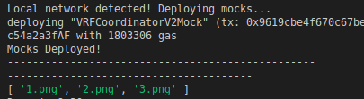

## Deploy Script

Let's go ahead and create a new deploy script "02-deploy-randomNft.js" and this is going to look really similar once again to our lottery contract that we've already done.We can copy some boilerplate from our basicNft deploy scripts.

```javascript
const { network } = require("hardhat")
const { developmentChains } = require("../helper-hardhat-config")
const { verify } = require("../utils/verify")

module.exports = async function ({ getNamedAccounts, deployments }) {
    const { deploy, log } = deployments
    const { deployer } = await getNamedAccounts()
}
```

Now since we're working with Chainlink here, we're going to be working with mocks again.So in our deploy folder, we're going to create a new scripts "00-deploy-mocks.js" and you can copy paste with the earlier section that we did with raffle since we're going to be doing the exact same thing.

```javascript
const { developmentChains } = require("../helper-hardhat-config")
const { network } = require("hardhat")

const BASE_FEE = ethers.utils.parseEther("0.25") // 0.25 is the premium. It costs 0.25 LINK per requests.
const GAS_PRICE_LINK = 1e9

module.exports = async function ({ getNamedAccounts, deployments }) {
    const { deploy, log } = deployments
    const { deployer } = await getNamedAccounts()

    const args = [BASE_FEE, GAS_PRICE_LINK]

    if (developmentChains.includes(network.name)) {
        log("Local network detected! Deploying mocks...")
        // deploy a mock vrfCoordinator
        await deploy("VRFCoordinatorV2Mock", {
            from: deployer,
            log: true,
            args: args,
        })
        log("Mocks Deployed!")
        log("-------------------------------------------------")
    }
}

module.exports.tags = ["all", "mocks"]
```

Once we've done that, we need the chainId to decide if we're actually on developement chain.

```javascript
module.exports = async function ({ getNamedAccounts, deployments }) {
    const { deploy, log } = deployments
    const { deployer } = await getNamedAccounts()
    const chainId = network.config.chainId

    let vrfCoordinatorV2Address

    if (developmentChains.includes(network.name)) {
        const vrfCoordinatorV2Mock = await ethers.getContract("VRFCoordinatorV2Mock")
        vrfCoordinatorV2Address = vrfCoordinatorV2Mock.address
    }
}
```

Then we want to create a subscription exactly the same as what we did with our lottery.

```javascript
if (developmentChains.includes(network.name)) {
        const vrfCoordinatorV2Mock = await ethers.getContract("VRFCoordinatorV2Mock")
        vrfCoordinatorV2Address = vrfCoordinatorV2Mock.address
        const tx = await vrfCoordinatorV2Mock.createSubscription()
        const txReceipt = await tx.wait(1)
    }
```

We're going to get the subId from this exactly the same way we did it in the lottery section.

```javascript
let vrfCoordinatorV2Address, subId

    if (developmentChains.includes(network.name)) {
        const vrfCoordinatorV2Mock = await ethers.getContract("VRFCoordinatorV2Mock")
        vrfCoordinatorV2Address = vrfCoordinatorV2Mock.address
        const tx = await vrfCoordinatorV2Mock.createSubscription()
        const txReceipt = await tx.wait(1)
        subId = txReceipt.events[0].args.subId
    }
```

That's what we do if we're on the development chain else:

```javascript
else {
        vrfCoordinatorV2Address = networkConfig[chainId].vrfCoordinatorV2
        subId = networkConfig[chaiId].subId
    }
```

We'll just double check our helper-hardhat config so that Rinkeby has both the vrfCoordinatorV2 and a subId.

Now we need to pass the arguments of the constructor.So we need the vrfCoordintor, subId, gasLane, callbackGasLimit, catTokenUris and a mintFee.

```javascript
const args = [
        vrfCoordinatorV2Address,
        subId,
        networkConfig[chainId].gasLane,
        networkConfig[chainId.callbackGasLimit],
        // catTokenUris
        networkConfig[chainId].mintFee,
    ]
```

**Uploading token images with Pinata**

We don't have this array of tokenUris.We're going to learn to upload programmatically our own images to IPFS.So let's go ahead and do that.If you want to use your own images for this, feel free to do so but if you just want to follow along with us, then we're going to use these [images](https://github.com/spo0ds/Journey-to-become-a-Blockchain-Engineer/tree/main/Day47/ImagesAndMetaData/RandomIpfs).We want to upload them in a way that anybody can actually pin them and work with them.So before we do all the arguments to the constructor, we're going to need to get the IPFS hashes of our images.There's a couple of ways we could do this.
- To do with our own [IPFS](https://docs.ipfs.io/) node
- Pinata
- NFT.storage

Pinata is a service that basically you just pay to help pin NFT for you and this is going to be the one that we're looking at.Now the issue with Pinat of course is that we're just paying one single centralized entity to go ahead and pin our data.We're kind of trusting that they're actually going to pin it and that they're not going to go down.The final way that we could look into actually depending our data is `nft.storage`.It uses the filecoin network on the backend to pin our data.Now filecoin is a blockchain dedicated to pinning IPFS data and storing decentralized data for us.Process is a little bit more complicated but nft.storage makes it really really easy.

Working with nft.storage will be one of the most persistent ways to keep our data up but it's still good to upload your own data to IPFS node.But for now, we're just going to work with Pinata.Uploading our metadata and tokenUris up to IPFS will give us the list of tokenUris for our three cats.So up at the top we're going to do a if statement.

```javascript
let tokenUris

if (process.env.UPLOAD_TO_PINATA == "true") {
    tokenUris = await handleTokenUris()
}
```

We're going to create a function called handleTokenUris which is going to upload our code to Pinata.

```javascript
async function handleTokenUris() {
    tokenUris = []

    return tokenUris 
}
```

We need to do two things.
- store the image in IPFS
- store the metadata in IPFS

So first we're going to create a store images function and this is where we're going to actually get to go to our utils and we're going to create a new file called "uploadToPinata.js".We're going to add all of our code for actually uploading to Pinata in here.We need to create an account in Pinata.We'll see the setup looks really similar to an IPFS node because that's essentially what pinata is.It's just an IPFS node run by somebody else.So a mannual way we could do is just hit the "upload" CID just like an IPFS node to put the hash of some IPFS file and pinata would pin it for us.But for we're going to leave this blank because we're going to want to do this programmatically.

So we can come over to our profile, we'll open up API keys and documentation and the documentation pretty much has everything that we need to get started.If you scroll down to pinata [SDK](https://docs.pinata.cloud/sdks), this is basically what we're going to be working with.They've already created an SDK for us that we can work with.We're going to go ahead and install pinata SDK for node js.

`yarn add --dev @pinata/sdk`

We're going to be doing `pinFileToIPFS` because we're going to upload our files and also `pinJSONToIPFS` since JSON is going to be the metadata and file is going to be the actual image.

```javascript
const pinataSDK = require("@pinata/sdk")

async function storeImages(imagesFilePath) {}
```

So we're going to use this function to pass it randomNft filepath and we're going to have it everything in that folder.To help us work with paths, we're also going to install path package.

`yarn add --dev path`

```javascript
const pinataSDK = require("@pinata/sdk")
const path = require("path")

async function storeImages(imagesFilePath) {
    const fullImagesPath = path.resolve(imagesFilePath)
}

```

If we give it the ./images/randomNft the path.resolve will give us the full output of the path.

```javascript
const pinataSDK = require("@pinata/sdk")
const path = require("path")
const fs = require("fs")

async function storeImages(imagesFilePath) {
    const fullImagesPath = path.resolve(imagesFilePath)
    const files = fs.readdirSync(fullImagesPath)
    console.log(files)
}
```

To actually test this is working, we're going to export it.

```javascript
module.exports = { storeImages }
```

and then back in our deploy script, comment our args, import the storeImages and call the function.

```javascript
const { storeImages } = require("../utils/uploadToPinata")

const imagesLocation = "./images/randomIpfs/"

await storeImages(imagesLocation) // inside module.exports
```

We should be able run it after adding some tags to this deploy script.

```javascript
module.exports.tags = ["all", "randomipfs", "main"]
```

Also I need to create a test folder and add that VRFCoordinatorV2Mock.

```solidity
// SPDX-License-Identifier: MIT
pragma solidity ^0.8.0;

import "@chainlink/contracts/src/v0.8/mocks/VRFCoordinatorV2Mock.sol";
```

To check that pinata script is working fine, we'll do:

`yarn hardhat deploy --tags randomipfs,mocks`

Now we could see the images present inside the randomIpfs folder.



So we're getting the files correctly here.

Now We'll create a read stream. Since we'll be working with image file, it doesn't work exactly the same as just like push the data.We have to create a stream where we stream all the data inside of the images because the images even though, they're really a big file with all the bytes and data in there.

```javascript
let responses = []
for (fileIndex in files) {
    const readableStreamForFile = fs.createReadStream(`${fullImagesPath}/${files[fileIndex]}`)
}
```

Then we're going to send it in a try catch.

```javascript
try {
        const response = await // stuff
    }
```

If we go back to the Pinata docs, there's some stuff about keys in there.If we go to the profile then API keys, you could create a new key.Make it an admin key, give it all the pinning access and give it a name.We wanna grab the API key and secret key in our .env file.

Then outside of the storeImages function, retrieve those env variables.

```javascript
const pinataApiKey = process.env.PINATA_API_KEY
const pinataApiSecret = process.env.PINATA_API_SECRET
const pinata = pinataSDK(pinataApiKey, pinataApiSecret)
```

In order to work with Pinata, we need to pass it an API key and API secret so that Pinata knows it's us who's working with them.So once we initialize Pinata thing, now we could run it for the responses.

We want to work with pinFileToIPFS which takes the readableStream which is why we created that readable stream.

```javascript
try {
        const response = await pinata.pinFileToIPFS(readableStreamForFile)
        responses.push(response)
    } catch (error) {
        console.log(error)
    }
```

Then we're going to return responses and files.

```javascript
return { responses, files }
```

We need to add require for env so that API key and API secret can be pulled from the env.

```javascript
require("dotenv").config()
```

Now to check whether it's working or not, we run that same command.

`yarn hardhat deploy --tags randomipfs,mocks`

If we come back to Pinata after we run it, we'll be able to see the images uploaded.If we come back to our project, we see our three files have been uploaded and we see they each come with their own CID.Now if we go to IPFS and hit import from IPFS, we could upload that CID into it and see the image.

So we've got to get those images up onto our IPFS.

**Uploading Metadata with Pinata**
