## Dynamic SVG On-Chain NFT

We don't need to host the data on IPFS.We can actually host our data and metadata directly on-chain if we want to.However there's some pros and cons.

Hosting on IPFS
- Pros: Cheap
- Cons: Someone needs to pin our data

Dynamic SVG NFT
- Pros: The data is on-chain and you never have to worry about somebody actually pinning the data.
- Cons: Much more expensive

The images are actually surprisingly large and storing them on-chain can actually get pretty expensive.So instead on pngs that we were using, we're going to use svgs.

**What is a SVG?**

[SVG](https://www.w3schools.com/graphics/svg_intro.asp) stands for Scalable Vector Graphics and these are much much more minimalistic files that we can go ahead and upload to the blockchain.So that's why we're going to use them because since there's so much more minimalistic, they're alot cheaper to upload.Remember the more data that you upload to the blockchain, the more expensive it is.SVG actually work right in HTML.So if you want to use these for your websites, you can as well.We're going to go one step further, we're going to make it dynamic.We're going to make this actually change based off of some data on-chain.

We're going to make the NFT dynamic in the sense that if the price of ETH is above some number then we're going to have it be happy face and then if it's below, we're going to make it a frowny face.Our NFT is going to change based off of some real world parameters and this is obviously really powerful and really cool because we can have an NFT that changes based off stats or really whatever.We're going to store all the data 100% on-chain.It's going to be little bit more expensive.

**Initial Code**

So we're going to create a new contract called "DynamicSvfNft.sol" and it's going to look really similar to what we've been doing.

```solidity
// SPDX-License-Identifier: MIT
pragma solidity 0.8.8;

contract DynamicSvgNft {}
```

Now let's talk about what the architecture of this is going to look like.It's going to look like pretty normal Nft with a couple of caveats.We're going to give it a mint function to mint the NFTs.We also need to store SVG information somewhere and then we need to have some logic to say "Show X image" or "Show Y image" which is just switching the tokenUri.So let's go into how we'd actually do this.

So first we know this is going to be an ERC721.We can go ahead and import that from OpenZeppelin.

```solidity
import "@openzeppelin/contracts/token/ERC721/ERC721.sol";

contract DynamicSvgNft is ERC721 {}
```

We're not going to call that setTokenURI function.So we can just use the raw ERC721.

Now we'll call the constructor of the ERC721.

```solidity
constructor() ERC721("Dynamic SVG NFT", "DSN") {}
```

Then we also need a mint function.

```solidity
uint256 private s_tokenCounter;

function mintNft() public {
        _safeMint(msg.sender, s_tokenCounter);
        s_tokenCounter++;
    }
```

We've a way to mint and we've done some basics here.But what is this token going to look like ? We want these to look like SVGs and we want it to be based off the price of some asset.

**Base64 Encoding**

In our constructor, we'll add low and high arguments and in our code, we'll save the low and high which will be the images that we'll import as parameters here.

```solidity
string private immutable i_lowImageURI;
string private immutable i_highImageURI;

constructor(string memory lowSvg, string memory highSvg) ERC721("Dynamic SVG NFT", "DSN") {
        s_tokenCounter = 0;
    }
```

But if we just passed the SVG data, SVG data is going to look like HTML which is definately not an imageURI.We need the imageURI.Right now the way that we're going to pass it in is like the with the SVG code because we want to just pass the SVG code and then have the contract handle everything else.So how do we actually do this?

We can create a function called "svgToImageURI" and on-chain we can convert from SVGs to imageURIs.So instead of having IPFS as their start, we're going to use something called `Base64 encoding`.You can actually encode any SVG to a [base64](https://en.wikipedia.org/wiki/Base64) image URL.We can convert SVG stuff to am image URL.That's exactly what we want.

Now if you take the SVG image from the Github repo, right click and copy the image address, head over to the [base64.Guru](https://base64.guru/converter/encode/image) site, change the data type to remote URL and paste the image address there and click on "Encode SVG to Base64".


This Base64 encoding represents the SVG that we just got and in our browser if we type `data:image/svg+xml;base64,*paste that encoding here*` and you'll get that svg.With this base64 encoded image, we can use this on chain as the image URI for our images and then for our metadata, we'll just bake that directly into our tokenURI.

```solidity
function svgToImageURI(string memory svg) public pure returns (string memory) {}
```

We're going to give this function an SVG which we're going to pass in from our constructor and we're going to return a string which is going to be that base64 encoded URL.

```solidity
string private constant BASE64_ENCODED_SVG_PREFIX = "data:image/svg+xml;base64,";
```

We'll use this to generate our SVG.We're going to encode the SVG in base64 ourself by adding the base64 encoding on-chain.We don't really have to rewrite that ourselves because somebody has already done [this](https://www.npmjs.com/package/base64-sol/v/1.0.1).We can add the Github code where they have basically everything that we need to encode and decode base64.

`yarn add --dev base64-sol`

Once we've added it, we can go ahead and import it.

```solidity
import "base64-sol/base64.sol";
```

This contract comes with an encoder.

```solidity
function svgToImageURI(string memory svg) public pure returns (string memory) {
        string memory svgBase64Encoded = Base64.encode(bytes(string(abi.encodePacked(svg))));
        return string(abi.encodePacked(BASE64_ENCODED_SVG_PREFIX, svgBase64Encoded));
    }
```

Just these function will take an any SVG and spit us back out URI.

## Advanced Section Encoding, Opcodes and Calls**

**abi.encode & abi.encodePacked**

From a really really high level `abi.encodePacked` is how you concatenate strings.We're going to jump over to remix to actually explore this abi.encodePacked a little bit more.This is really advanced.We're going to go over really low level stuff and how solidity works behind the scenes, how the binary works and this thing called opcodesLet's jump over to remix.  

In our contract section let's go ahead and create a new file "Encoding.sol" and let's just make iur basic code here.

```solidity
// SPDX-License-Identifier: MIT

pragma solidity 0.8.8;

contract Encoding {}
```

The whole purpose for this is to understand what's going on `string(abi.encodePacked(BASE64_ENCODED_SVG_PREFIX, svgBase64Encoded))` and more about the abi.encodePacked stuff.So let's first just write a function that shows us wrapping abi.encodePacked with some strings and wrapping around string is going to return a string.

```solidity
contract Encoding {
    function concatenateStrings() public pure returns(string memory){
        return string(abi.encodePacked("Hello! ", "How's it going?"));
    }
}
```

Let's go ahead and deploy this.

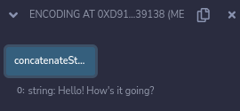

We get that whole string output "Hello! How's it going?".So we're encoding "Hello!" and "How's it going?" together into its bytes form because abi.encodePacked returns a bytes object and we're typecasting it by wrapping in the string.

abi.encodePacked is one of these globally available methods and units and actually in solidity there's a whole bunch of these.There's this [solidity cheatsheet](https://docs.soliditylang.org/en/v0.8.13/cheatsheet.html?highlight=encodewithsignature) which has a whole bunch of operators and global variables.In `0.8.12+`, you can actually do string.concat(string1, string2) instead of doing abi.encodePacked.

Let's focus on encodePAcked thing.What's actually going on here? Well before we dive deeper into this encodePacked, let's understand a little bit more about what happens when you send a transaction.

So when we compile our code, remember back to ethers.js we have two files.We got a `.abi` file and a `.bin` file.

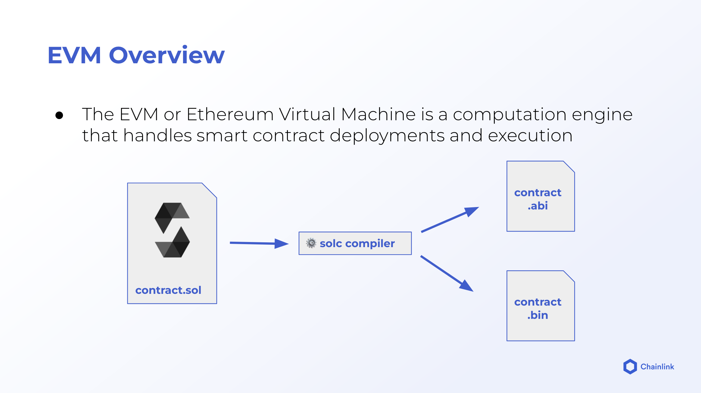

Back in our ethers SimpleStorage, when we ran `yarn compile`, the two main files that we got were the SimpleStorage.abi and then the SimpleStorage.bin which is the binary.You can see that in remix too, go to compilation details, you could see the ABI and BYTECODE bit.It's the object that has the same stuff those random numbers and letters.


This is actually what's getting put on the blockchain.It's this binary.It's this low level stuff.

When we actually send the contracts to the blockchain, we're sending the binary thing.Remember again back in our ethers project, we saw what is a transaction.

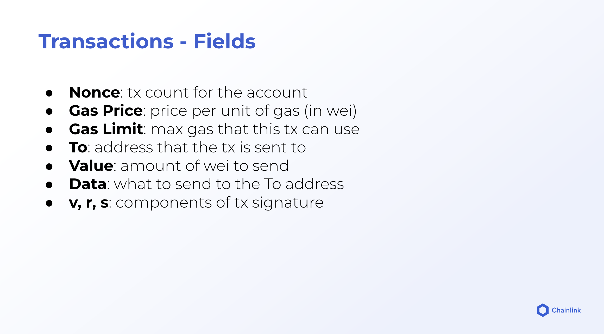

When we send the transaction that actually creates a contract, the two is going to be empty.We're not going to send the contract deployment to any address but the data of this is going to have the contract initialization code contract bytecode.So when we compile, we get all this code like how you initialize the contract and then the contract actually looks like.So if you look at any of the contracts that you've deployed let's look at raffle contract, if you go to the transactions of the contract, you can see the `createRaffle` and click there to the transaction.We can see the input Data thing and it got all the random number and letters which is the binary data of the contract initialization code and the contract byte code.What we send in our transaction is the data thing.We send the bunch of garbled nonsense.

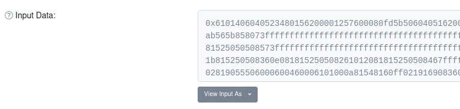

In order for the blockchain to understand what do these numbers and letters even mean, you need a special reader.Ethereum or the blockchain needs to be able to read all the stuff.It needs to be able to map all these random numbers and letters to what they actually do.`How does Ethereum or Polygon or Avalanche know that all the nonsense is basically telling it to make a contract?`

You kind of think of it as like some saying "Let's go for a walk".The only reason that we as a human beings understand what let's go for a walk means is that we understand English.For solidity and blockchain, instead of English they read those nonsense numbers and letters which kind of like words.Just instead of let's go for a walk, it's like deploy contract and the contract does xyz.The bytecode represents the low level computer instructions to make our contract happen and all the nonsense number and letter represent kind of an alphabet just like how let's go for an walk is an alphabet.When you combine them it makes something that to us makes sense.You can kind of think of the alphabet for these as whats called `opcodes`. 

If you go to [evm.codes](https://www.evm.codes/), we'll get to the place where it has a list of all instructions.On the left side you can see `OPCODE` and you can see `NAME`.The OPCODE section is saying "If you see a 00 in the bytecode, that 00 represents STOP which halts execution."If we look at our byte code, `61`, which is place 2 byte item on the stack.That's exactly how Ethereum or blockchain is reading it.Any language that compiles down to the opcode stuff, is what's known as the EVM (Ethereum Virtual Machine).So being able to read these opcodes is sometimes abstractly called the EVM.

The EVM basically represents all the instructions a computer must be able to read for it to interact with the Ethereum or Ethereum like application.This is why so many blockchains all work with solidity because solidity compiles down to the bytescode.Polygon, Avalanche, Ethereum they all compiled down to the exact same type of binary and they all have the exact same readers.

Why do you need all these information because abi.encodePacked just concatenate strings?

abi.encodePacked can actually do way more.If we look at the cheat cheet, abi.encodePacked is like what the third one down the list because it's a non standard way to encode stuff to the binary stuff that we just talked about.We can actually encode pretty much anything we want to being in the bytecode format.Let's take a look at encoding something.

```solidity
function encodeNumber() public pure returns(bytes memory) {
        bytes memory number = abi.encode(1);
        return number;
    }
```

We're going to encode number down to its abi or it's binary format.A lot of the times when we say "What's the ABI?", we go to the compilation details and view the ABI which is kind of the human readable format of the ABI.

We want to encode our numbers down to basically it's binary.The abi.encode is going to be a little bit different than the ABI that you see in the compilation details.Compilation detail ABI is technically like the ABI.Technically is how to interact with the contract however it's not the actual binary version of it.So we're saying encode the number 1 down to its binary version so that our contracts can interact with it in a way that they understand.So we're just saying "Let's make that number 1 to machine readable."We compile and deploy our code.


We get the big hex thing.This is how the computer is going to understand the number 1.Now we can encode pretty much anything.We can encode a string.

```solidity
function encodeString() public pure returns(bytes memory){
        bytes memory x = abi.encode("Hi");
        return x; 
    }
```

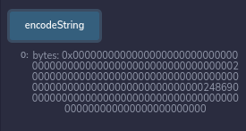

You notice here a tons of zeros and those zeros take up space.That's alot of space for the computer to take up even though they're not really doing anything.So solidity also comes with `abi.encodePacked` which performs packed encoding of the given arguments.You can kind of think as encodePacked as a sort of compressor.It's the encode function but it compresses stuff.If we want to encode some string and we want to save some space, we didn't need the perfect low level binary of it, we could use the encodePacked.

```solidity
function encodeStringPacked() public pure returns(bytes memory){
        bytes memory x = abi.encodePacked("Hi");
        return x; 
    }
```

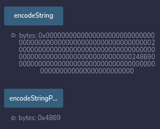

It returns much much smaller bytes object.If we're trying to save gas encodeStringPacked is going to be a way for us to save a lot more gas.

Now abi.encodePacked is really similar to something that we've done before which is typecasting.

```solidity
function encodeStringBytes() public pure returns(bytes memory){
        bytes memory x = bytes("Hi");
        return x;
    }
```

These encodeStringBytes and encodeStringPacked are going to look identical.

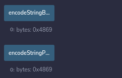

The two of these get the same result but behind the scenes, they're doing something a little bit different.You can check it out [here](https://forum.openzeppelin.com/t/difference-between-abi-encodepacked-string-and-bytes-string/11837).

This is exactly what we're doing in our NFT.We're combining two string with abi.encodePacked and then we're just typecasting them back from bytes to string.

This seems pretty cool but this encode and encodePacked aren't just here to concatenate strings.Not only you can encode stuff like strings or number or really anything, but you can decode stuff.

```solidity
function decodeString() public pure returns(string memory){
        string memory x = abi.decode(encodeString(), (string));
        return x; 
    }
```


We can multi encode and multi decode.

```solidity
function multiEncode() public pure returns(bytes memory){
        bytes memory x = abi.encode("Hi", "there");
        return x; 
    }

function multiDecode() public pure returns(string memory, string memory){
        (string memory x, string memory y) = abi.decode(multiEncode(), (string, string));
        return (x, y); 
    }
```

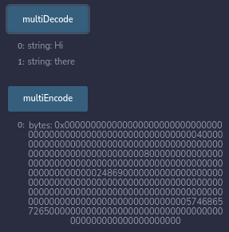

You can even multi encode with that packed thing but decoding isn't going to work this because it's the packed encoding.

```solidity
function multiEncodePacked()public pure returns(bytes memory){
        bytes memory x = abi.encodePacked("Hi", "there");
        return x;
    }

function multiDecodePacked() public pure returns(string memory, string memory){
        (string memory x, string memory y) = abi.decode(multiEncodePacked(), (string, string));
        return (x, y); 
    }
```

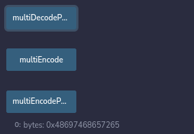

But instead we could use the typecast.

```solidity
function multiStringCastPacked() public pure returns(string memory){
        string memory x = string(multiEncodePacked());
        return x;
    }
```

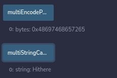

**Introduction to Encoding Function Calls Directly**

Now that we've learned more about abi.encode and decoding, we know that this is what the computer, Ethereum or any EVM compatible chain is looking for.It's looking for the bytecode.We just learned a little bit more about how to encode different variables into the binary into that data bit.

Well what do we do now?

Since we know that our transactions are going to be compiled down to the binary stuff, we can actually populate the data value of our transactions ourselves with the binary that code is going to use.For a function call, the data piece is going to be what to send to the address.

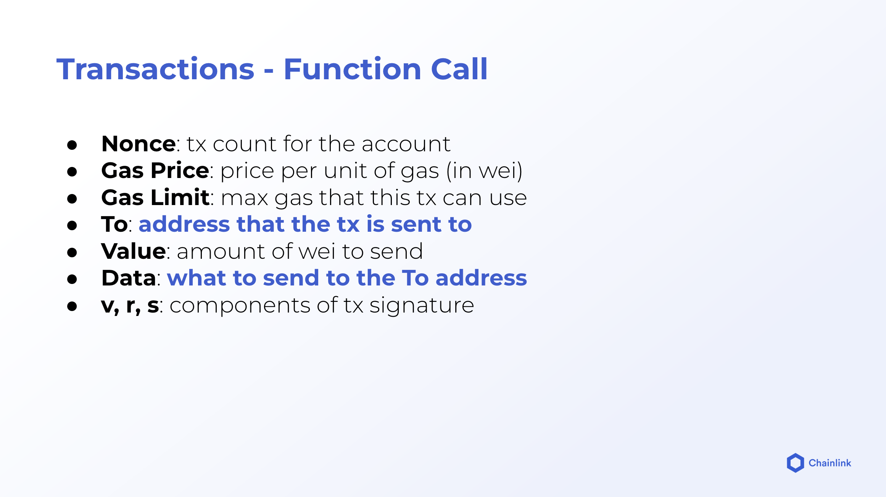

Let's look at another transaction on the etherscan on our Raffle contract.I'm going to look at enterRaffle.

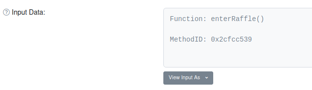

But if we look at the original,

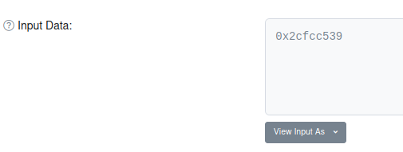

This is what getting sent to the data field.It's this hex weird low level bytes thing.This is how the Ethereum blockchain or any EVM chain that you're working with knows which function to call.It translates this into a function and we can do the exact same thing and call these functions ourselves.

We can actually send the data field of a transaction ourselves in a transaction call.Remember back in ethers throwback, the data thing was the contract creation code.

```javascript
const tx = {
      nonce: nonce,
      gasPrice: 20000000000,
      gasLimit: 1000000,
      to: null,
      value: 0,
      data: "0x60806...",
      chainId: 1337,
    };
```

Instead we can populate this data thing with our function call code, the exact function that we wanna call in the binary in the hex edition.

Now you might be thinking "Why would I do that? I can just use the interface, the ABI all tht stuff."What if maybe you don't have that.Maybe all you have is the function name, maybe all you have is the parameters you want to send or maybe you want to make your code be able to send arbitrary functions or make arbitrary calls or do random really advanced stuff.That's where sending our function calls directly by populating the data field is going to be incredibly important.

Remember we always learned that we need the ABI and the contract address to send a function.Now when I said you always need the ABI, originally we're kind of talking about big JSON thing which is the human readable ABI.You can also do it with the non human readable ABI and additionally you don't need the whole JSON stuff.You can really use just the name of a function and then the input types to send a function call.

`How do we send transactions that call function with just the data field populated?`
`How do we populate the data field?`

Solidity actually has some more low levels keywords namely `staticcall` and `call`.We've actually used call in the past.

```solidity
(bool success, ) = recentWinner.call{value: address(this).balance}("");
// require(success);
if (!success) {
    revert Raffle__TransferFailed();
}
```

We sent money doing the recentWinner.call.We use the call keyword.`call` is how we call functions to change the state of the blockchain.`staticcall` is basically how at a low level we call our view or pure functions.We updated the value directly of our transaction in solidity.So which again, if we have the transaction fields, and we just directly updated value in the `curly ({})` brackets of the call.We can also direcly update gasLimit and gasPrice directly if we wanted to.The parenthesis is where we're going to stick our data.Since all we wanted to do with our withdraw function previously was send money but don't pass any data.Keep that data bit empty.

**Encoding Recap**

If we want to combine strings, we could do abi.encodePacked and then typecast it to the string.In newer version of solidity, we can do string.concat.Then we learned lot about low level stuff.When we compiled our contracts, we get an ABI file and the weird binary file.That numbers and letters stuff that gets when we deploy a contract that gets sent in the data field of our contract creation transaction.So for contract creation, the data is populated with the binary code.For function calls is going to define which functions to call in with what parameters and this is what we're going to go over next.

We learned we can actually encode stuff into the binary into the low level code and any program or any process that can read the low level stuff and execute accordingly is considered EVM compatible.We can encode numbers, strings or pretty much anything.To save space we do encodePacked.We can decode stuff that we've encoded but we can't decode stuff that we've encodePacked.We can multiencode stuff and multidecode stuff.Finally we can use the call function and add data in there to make any call that we want to any smart contract.

**Encoding Function Calls Directly**

Let's learn how we can populate data field so we can call any function and we can do essentially what the blockchain is going to do at the low level.We can work with just the binary or bytes or hex to interact with our smart contracts.So let's create a new file "CallAnything.sol".

Now in order to call a function using only the data field of the call, we need to do:
- encode the function name
- encode parameters that we want to add

We need to encode these down to the binary level so that the EVM or Ethereum based smart contracts and solidity stuff can understand what's actually going on.In order to do this, we need to work with two concepts.To encode the function name so that EVM or solidity can understand it, we actually have to grab something called `function selector`.It's going to be the first 4 bytes of the function signature and the function signature is just going to be a string which defines the function name and the parameters.

Well if we have the transfer function `transfer(address, uint256)`, this is known as the function signature.So the function name is going to be the transfer and it's going to take address and the uint256 as it's inputs.If we encode the transfer function, we take the first 4 bytes of it which refers to the function selector.So that's how solidity knows.This is one of the first thing that we need to use call to call any function that we want.We need to get the function selector and one of the ways is by encoding the function signature and grabbing the first 4 bytes. 

```solidity
// SPDX-License-Identifier: MIT

pragma solidity 0.8.8;

contract CallAnything {
    address public s_someAddress;
    uint256 public s_amount;

    function transfer(address someAddress, uint256 amount) public {
        s_someAddress = someAddress;
        s_amount = amount;
    }
}
```

Here's going to be the function that we're going to be work with.The function selector for that function is `0x9059cbb` and the function signature is `transfer(address, uint256)`.

We can write a function to get that function selector.

```solidity
function getSelectorOne() public pure returns(bytes4 selector){
        selector = bytes4(keccak256(bytes("transfer(address,uint256)")));
    }
```

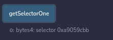

This tell our smart contract "When we make a call to this contract, if you see 0x9059cbb in the function data, this is referring to our transfer function with an address and a uint256 as input parameter."

We can also see what happens when we call the transfer function.It takes an address and an amount so let's just give it it's own address and 7 for the amount.This is us directly calling transfer.When we directly call transfer, we're basically saying "Hey grab this function selector and do some other stuff."

Now we have the function selector, what else do we need? We also need the parameters  we want to add.So we need to encode those parameters with our function selector.

```solidity
function getDataToCallTransfer(address someAddress, uint256 amount) public pure returns(bytes memory){
        return abi.encodeWithSelector(getSelectorOne(), someAddress, amount);
    }
```

It's going to give us all the data that we need to put in that data field of our transaction to send to the contract to let the contract know "Hey go use the transfer function, pass in someAddress and amount."

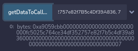

This thing right here is what we're going to put in the data fieldof our transaction in order for us to call transfer from anywhere.So this is the binary encoded data of transfer function with the address that we specified with 7 amount.

Once we have all this, we can call the transfer function without even having to directly call it.

```solidity
function callTranferDirectly(address someAddress, uint256 amount) public returns(bytes4, bool){
        (bool success, bytes memory returnData) = address(this).call(
            // getDataToCallTransfer(someAddress, amount)
            abi.encodeWithSelector(getSelectorOne(), someAddress, amount)
        );
        return(bytes4(returnData), success);
    }
```

This function have us directly call the transfer function by passing the someAddress and amount parameters without us having to do like contract.transfer or transfer.You can do this across multiple contracts just by changing the address that you call on.

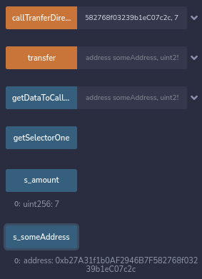

We can also do encodeWithSignature instead of Selector.

```solidity
function callTranferDirectlySig(address someAddress, uint256 amount) public returns(bytes4, bool){
        (bool success, bytes memory returnData) = address(this).call(
            // getDataToCallTransfer(someAddress, amount)
            abi.encodeWithSignature("transfer(address,uint256)", someAddress, amount)
        );
        return(bytes4(returnData), success);
    }
```

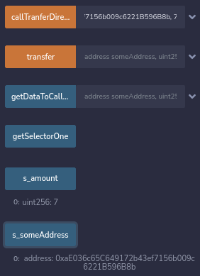

We're going to create a new contract below in CallAnything.sol.We're going to call the transfer function just by using the address and the function selector signature and stuff.We're going to update the storage variable s_someAddress and s_amount in our CallAnything contract from another contract just by doing the binary calling.

```solidity
contract CallFunctionWithoutContract {
    address public s_selectorsAndSignaturesAddress;

    constructor(address selectorsAndSignaturesAddress) {
        s_selectorsAndSignaturesAddress = selectorsAndSignaturesAddress;
    }

    

    // with a staticcall, we can have this be a view function!
    function staticCallFunctionDirectly() public view returns (bytes4, bool) {
        (bool success, bytes memory returnData) = s_selectorsAndSignaturesAddress.staticcall(
            abi.encodeWithSignature("getSelectorOne()")
        );
        return (bytes4(returnData), success);
    }

    function callTransferFunctionDirectlyThree(address someAddress, uint256 amount)
        public
        returns (bytes4, bool)
    {
        (bool success, bytes memory returnData) = s_selectorsAndSignaturesAddress.call(
            abi.encodeWithSignature("transfer(address,uint256)", someAddress, amount)
        );
        return (bytes4(returnData), success);
    }
}
```

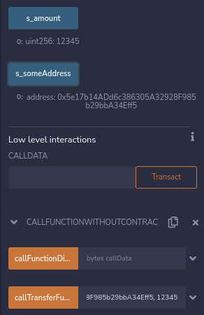

Doing this call stuff is considered low level and it's a best practice to try to avoid it when you can.So if you can import an interface, it's much better to do it like that because you're going to have the compiler on your side, you're going to be able to check to see if the types are matching and all other stuff.So usually doing these low level calls, some security auditor checkers might say "This spooks me out a little bit."

If you want to check other ways to call transfer function, it's in my Github repo.If you want to learn more, I recommend you to check out [Deconstructing Solidity](https://blog.openzeppelin.com/deconstructing-a-solidity-contract-part-ii-creation-vs-runtime-6b9d60ecb44c/).It really breaks down exactly what's going on behind the scenes of a contract if you want to learn more about opcodes, about low level stuff.It breaks down little bit more than what we went over here.


