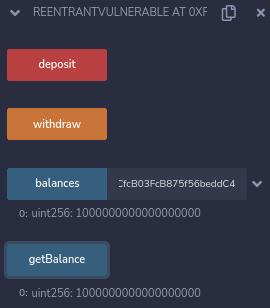
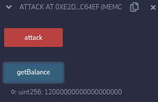

## Full Stack NFT Marketplace

This is going to be the most complicated frontend using the web3 stack and using a lot of really advanced web3 and blockchain tools.In this project we're going to learn more about how events are so important and why events are so important especially for off-chain services.We're actually going to look at two different ways to work with them.One using the Moralis or centralized database and then one using The Graph.Oftentimes, when people are looking to scale the projects, looking to get things done really quickly, taking a more centralized approach can often be a little quicker and you can sometimes add more functionality to your website.There's still lot of protocols that have decentralized backends and centralized front ends.One such example is OpenSea.It has the ability to actually like different NFTs.Now this isn't something that we'd actually want to spend gas on but it is something that we're going to have to store in some type of database somewhere, so that people have the ability to do that.

**NFT Marketplace Contracts**

**Hardhat Setup**

We're going to create a new folder called "hardhat-nft-marketplace" and open the folder in VScode.Run the below command in the terminal.

`yarn add --dev @nomiclabs/hardhat-ethers@npm:hardhat-deploy-ethers ethers @nomiclabs/hardhat-etherscan @nomiclabs/hardhat-waffle chai ethereum-waffle hardhat hardhat-contract-sizer hardhat-deploy hardhat-gas-reporter prettier prettier-plugin-solidity solhint solidity-coverage dotenv`

Copy paste the .prettierrc and .prettierignore file from the Github Repo.For linting with solidity, also grab .solhint.json and .solhintignore.We're also going to bring our hardhat.config.json from lottery, utils folder and .env.

Before we write our contracts, let's go ahead and write a little docs saying what our contract is even going to do.We're going to create a decentralized NFT marketplace.What does that mean? Well we'll probably need some type of `listItem` function because we want to list NFTs on the marketplace.We need some typeof buyItem to buy the NFTs, need maybe like a `cancelItem` to no longer want to sell it, maybe an `updateListing` to update price  and then maybe a `withdrawProceeds` to withdraw payment for bought NFTs.So when somebody buys NFT, I'm going to have to withdraw from the contract since the contract is going to be the one to actually hold those funds.

So let's create a new folder "contracts", create a new file called "NFTMarketplace.sol".

**NFTMarketplace.sol**

So let's get our boilerplate.

```solidity
// SPDX-License-Identifier: MIT

pragma solidity ^0.8.7;

contract NftMarketplace {}

```

So let's start with listing the items.How are we going to keep track of listing people's items? We're going to start with listItem function and we're going to make it look really really good.so we're going to do natSpec and everything.It's going to be an external function because we probably don't want any of our internal funtions calling listItem.It's going to be called by external projects or external accounts.We probably going to need NFT address, the token id and set a price.

**listItem function**

```solidity
function listItem(
        address nftAddress,
        uint256 tokenId,
        uint256 price
    ) external {}
```

So first off, we probably want the price to be greater than zero.So we'll put a if statement inside the function.

```solidity
if (price <= 0) {
            revert NftMarketplace__PriceMustBeAboveZero();
        }
```

Now in order for us to list this,we can actually do this one of two ways.We could send the NFT to the contract.This would require us doing like a `transfer`.We could have the contract hold the NFT.We could do this but this is kind of `gas expensive` for someone to list NFT or we can have the owner of the NFT be our NFT marketplace.The issue with this though is that the market place will own the NFT and user won't be able to say like "Hey I own this NFT.It's in this marketplace."They technically would be able to but they would have to withdraw it.

We might do this in a slightly different way where we might say where we can say Owners can still hold their NFT and give the marketplace approval to sell the NFT for them.Now of course owners of the NFT could withraw approval at any time and the marketplace wouldn't be able to sell it anymore.However this would be really easy for people to actually read.All they have to do is read like is approved for marketplace and they can actually see if the item was really listed or not.We're going to go ahead and write it the second way.This is the least intrusive way to to have the marketplace.People will still have the ownership of their NFTs, and the marketplace will just have approval to actually swap and sell their NFT once their prices are met.

So since we want to make sure the marketplace has approval, let's make sure the marketplace has approval.So we can call `getApproved`(EIP-721) function on that tokenId to make sure that the marketplace is approved to work with the NFT.To do this, we're going to need IERC721 Interface and we can actually grab that from OpenZeppelin.The Interface will wrap around an address and we can call getApproved on that address.

```solidity
import "@openzeppelin/contracts/token/ERC721/IERC721.sol";;
```

Since we're doing an import from OpenZeppelin, we'll do `yarn add --dev @openzeppelin/contracts`

Now that we've the IERC721 interface, we'll wrap around the nftAddress.

```solidity
IERC721 nft = IERC721(nftAddress);
```

And then we'll check whether the tokenId is approved or not.

```solidity
if (nft.getApproved(tokenId) != address(this)) {
            revert NftMarketplace__NotApprovedForMarketplace();
        }
```

Now that we've got this, we probably want to have some type of data structure to list all the NFTs.Typically we get to choose either to use array or mapping.What do you think it makes more sense to put in an array or mapping?

If you said mapping I would agree with you.You could do an array and you wouldn't necessarily be wrong but it's not the way that I would go about that.for an array anytime someone wants to buy an item, we're going to have to traverse through the array.We're going to have to make massive dynamic array and might get little bit dicey as the array gets really really big.So we're going to go ahead and make this a mapping which is going to be the state variable.

`mapping(address => mapping(uint256 => ??));`

We want the tokenId to map with price but we also want to keep track of sellers.So we could make another two mappings or just create a new type of type "Listing".

```solidity
 struct Listing {
        uint256 price;
        address seller;
    }
```

Now that we've the new type, we'll map tokenId with the new type "Listing".

```solidity
// NFT Contract Address -> NFT TokenID -> Listing
mapping(address => mapping(uint256 => Listing)) private s_listings;
```

Now in our listItems function, we're going to update that s_listings.

```solidity
s_listings[nftAddress][tokenId] = Listing(price, msg.sender);
```

Selle is msg.sender because they're the one who's actually listing the item.Since we're updating the mapping here, we need to emit an event.Especially for this project you're going to see why emitting an events is so helpful.

```solidity
// below mapping declaration 
event ItemListed(
        address indexed seller,
        address indexed nftAddress,
        uint256 indexed tokenId,
        uint256 price
    );

emit ItemListed(msg.sender, nftAddress, tokenId, price);
```

This looks pretty good however we probably want to make sure we only list NFTs that haven't already been listed.So we can add like an if then here and this is where preference comes in a little bit but I'm going to create a modifier called "notListed".So we make sure we don't re-list NFTs that are already listed.

```solidity
modifier notListed(
        address nftAddress,
        uint256 tokenId,
        address owner
    ) {
        Listing memory listing = s_listings[nftAddress][tokenId];
        if (listing.price > 0) {
            revert NftMarketplace__AlreadyListed(nftAddress, tokenId);
        }
        _;
    }
```

Let's just make sure this actually compile `yarn hardhat compile`

We'll add the modifier to the listItems function listItem function.

```solidity
function listItems(
        address nftAddress,
        uint256 tokenId,
        uint256 price
    ) external notListed(nftAddress, tokenId, msg.sender) {
        
    }
```

What else should we check for? Well we should also check that the NFT that's being listed is owned by msg.sender.This way only the owners of the NFT can actually list here.So we'll add "isOwner" modifier.

```solidity
modifier isOwner(
        address nftAddress,
        uint256 tokenId,
        address spender
    ) {
        IERC721 nft = IERC721(nftAddress);
        address owner = nft.ownerOf(tokenId);
        if (spender != owner) {
            revert NftMarketplace__NotOwner();
        }
        _;
    }
```

Now we'll also add isOwner modifier.

```solidity
function listItems(
        address nftAddress,
        uint256 tokenId,
        uint256 price
    )
        external
        notListed(nftAddress, tokenId, msg.sender)
        isOwner(nftAddress, tokenId, msg.sender)
    {
    }
```

So now our listItem checks to see if it's already listed, make sure that only the owner of the NFT of that tokenId can list it and then it goes ahead and list it.

This is our listItem method here.Let's go ahead and do a little bit of natSpec here.

```solidity
/*
 * @notice Method for listing your NFT on the marketplace
 * @param nftAddress: Address of the NFT
 * @param tokenId: the Token ID of the NFT
 * @param price: sale price of the listed NFT
 * @dev Technically, we could have the contract be the escrow for the NFTs
 * but this way people can still hold their NFTs when listed.
 */
```

Now that we've a listItem function.What's next? Let's make a buyItem function for people to buy the NFTs after they have been listed.

**buyItem function**

```solidity
function butItem(address nftAddress, uint256 tokenId) external payable {
        
    }
```

External function because we know only people or contracts outside of this contract are going to call buyItem and payable so that people can spend ETH or layer1 currencies to actually buy these NFTs.

We're going to choose which NFT in which tokenId, we're going to buy.So what's the first thing that we probably want to do? Well we probably want to check that the buyItem is actually listed.So we're going to make a new modifier called "isListed".

```solidity
modifier isListed(address nftAddress, uint256 tokenId) {
        Listing memory listing = s_listings[nftAddress][tokenId];
        if (listing.price <= 0) {
            revert NftMarketplace__NotListed(nftAddress, tokenId);
        }
        _;
    }
```

If there's no price, nft is not listed.

```solidity
function butItem(address nftAddress, uint256 tokenId)
        external
        payable
        isListed(nftAddress, tokenId)
    {
        Listing memory listedItem = s_listings[nftAddress][tokenId];
        if (msg.value < listedItem.price) {
            revert NftMarketplace__PriceNotMet(nftAddress, tokenId, listedItem.price);
        }
    }
```

We're making sure that they're sending us enough money.When they send the money, it needs to belong to whomever listed the item.So we actually need to keep track of how much money these people have.So let's create another data structure called "proceeds" where we keep track of how much money people have earned selling their NFTs.

```solidity
// Seller Address -> amount earned
mapping(address => uint256) private s_proceeds;
```

When somebody buy's an item, we'll update their proceeds.

```solidity
s_proceeds[listedItem.seller] = s_proceeds[listedItem.seller] + msg.value;
```

Now once we buy this item, we're going to delete the listing.so to delete a mapping from a wreck, we'll just use `delete`.

```solidity
delete (s_listings[nftAddress][tokenId]);
```

So we remove that mapping and then finally, we're going to go ahead and transfer it.

```solidity
IERC721(nftAddress).transferFrom(listedItem.seller, msg.sender, tokenId);
```

Now you'll notice something here.We don't just send the seller the money.Now why's that ? 

Well solidity has the concept called [Pull over Push](https://fravoll.github.io/solidity-patterns/pull_over_push.html) and is considered best practice when working with solidity.You want to shift the risk associated with transferring Ether to the user.so `instead of sending the money to the user, we want to have them withdraw the money`.We always want to shift the risk of working with money and working with ETH or any layer 1 you're working with to the actual user.We want to create s_proceeds data structure and we can have them withdraw from it later on.

Now we could probably do some checking here to make sure NFT was transferred and if we look at IERC721 though, we look at the transferFrom, we don't see it actually has a return.But if we go to EIP-721, we can see none of these have a return type however we do see `safeTransferFrom`.SafeTransferFrom is going to be a litte bit better because look at the [EIP-721](https://eips.ethereum.org/EIPS/eip-721).So instead of transferFrom, we're going to use safeTransferFrom just to be little bit safer.

```solidity
IERC721(nftAddress).safeTransferFrom(listedItem.seller, msg.sender, tokenId);
```

Then since we're updating a mapping, we're going to emit an event.

```solidity
function butItem(address nftAddress, uint256 tokenId)
        external
        payable
        isListed(nftAddress, tokenId)
    {
        Listing memory listedItem = s_listings[nftAddress][tokenId];
        if (msg.value < listedItem.price) {
            revert NftMarketplace__PriceNotMet(nftAddress, tokenId, listedItem.price);
        }
        s_proceeds[listedItem.seller] = s_proceeds[listedItem.seller] + msg.value;
        delete (s_listings[nftAddress][tokenId]);
        IERC721(nftAddress).safeTransferFrom(listedItem.seller, msg.sender, tokenId);
        emit ItemBought(msg.sender, nftAddress, tokenId, listedItem.price);
    }
```

**Reentrancy Attacks**

Now is this buyItem, we set this up in a way that is safe from `Reentracy Attack`.Well technically not because event has been emitted.We've been coding the contracts in a way where we kind of do all the state change first and then we transfer the NFT.But why are we doing that ?

Cognitively we think it might make sense to first send the NFT.

```solidity
function butItem(address nftAddress, uint256 tokenId)
        external
        payable
        isListed(nftAddress, tokenId)
    {
        Listing memory listedItem = s_listings[nftAddress][tokenId];
        IERC721(nftAddress).safeTransferFrom(listedItem.seller, msg.sender, tokenId);

        if (msg.value < listedItem.price) {
            revert NftMarketplace__PriceNotMet(nftAddress, tokenId, listedItem.price);
        }
        s_proceeds[listedItem.seller] = s_proceeds[listedItem.seller] + msg.value;
        delete (s_listings[nftAddress][tokenId]);

        emit ItemBought(msg.sender, nftAddress, tokenId, listedItem.price);
    }
```

This is actually a huge security vulnerability and to understand why let's learn about one of the most common hacks in blockchain "The Reentrancy Attack".The code that we're looking is based off of [solidity by example](https://solidity-by-example.org/hacks/re-entrancy/) one.

Now I've a sample contract here.

```solidity
// SPDX-License-Identifier: MIT
pragma solidity ^0.8.7;

contract ReentrantVulnerable {
    mapping(address => uint256) public balances;

    function deposit() public payable {
        balances[msg.sender] += msg.value;
    }

    function withdraw() public {
        uint256 bal = balances[msg.sender];
        require(bal > 0);

        (bool sent, ) = msg.sender.call{value: bal}("");
        require(sent, "Failed to send Ether");

        balances[msg.sender] = 0;
    }

    // Helper function to check the balance of this contract
    function getBalance() public view returns (uint256) {
        return address(this).balance;
    }
}
```

It's a place where you can deposit and withdraw your ETH.It has a mapping called "balances" where you can call deposit and it'll update how much you've deposited into the protocol.It also has withdraw function.It first grabs your balance from the balances mapping, makes sure that you've more than zero and the way that we've been sending eth the whole time (msg.sender.call) and then we update the balance of msg.sender to 0.This `balances[msg.sender]=0` is the line that makes this contract incredibly vulnerable.

If we run this right now though, we'll say "It looks like as we expected."We deploy the contract, copy the address that deployed the contract, we see the balance is 0.We'll deposit 5 Ether and hit balances of that address, we see it's updated to 5 Ether.Then we'll hit withdraw and the balances of that address goes back to 0 and it seems like it's working as intended.

Now there's actually a way we can attack withdraw function to drain all the money in the contract and this is what's know as reentrancy attack.The two most common kinds of attacks in the space are going to be reentrancy attacks which is what we're talking about here and oracle attacks which usually only happen when a protocol doesn't use a decentralized Oracle.Lucky for us we've been using decentralized orcale(Chainlink) from the get go so that we're protected.It's these two types of attacks that often result in the most amount of money lost.There's a lederboard called [rekt.news](https://rekt.news/leaderboard/) which keeps track of many of the top attacks that have ever happened in the defi space.With many of them if you go into the retrospective are either an Oracle attack or a reentracy attack.

You might be saying "We're just talking about NFTs and this doesn't have anything to do with NFTs."We'll get there don't worry.Below we're going to create a new contract called "Attack".We'll grab the "ReentrantVulnerable" and create a variable of it.

```solidity
contract Attack {
    ReentrantVulnerable public immutable i_reentrantVulnerable;
}
```

Then we'll set the address of the global variable in the constructor.

```solidity
contract Attack {
    ReentrantVulnerable public immutable i_reentrantVulnerable;

    constructor(address _reentrantVulnerable){
        i_reentrantVulnerable = ReentrantVulnerable(_reentrantVulnerable);
    }
}
```

We're going to create a function called attack and it's this function that's going to call withdraw in a malicious way.

```solidity
function attack() external payable {
        i_reentrantVulnerable.deposit{value: 1 ether}();
        i_reentrantVulnerable.withdraw();
    }
```

Now at first glance this seems pretty harmless but remember when we call `msg.sender.call` like in above contract, we're calling back to the `"Attack"` contract.When we call the Attack contract, `is there a way to execute any other code ?`

Well there is.Remember how we learned about fallback functions.If we put a fallback function or receive function in here, when the Contract runs `msg.sender.call` sends the contract Ether, we can have it trigger our fallback function to call withdraw again so that we'll send our contract more Ether than it's do before we update the balance i.e `balances[msg.sender] = 0`.

```solidity
fallback() external payable {
        if(address(i_reentrantVulnerable).balance >= 1 ether){
            i_reentrantVulnerable.withdraw();
        }
    }
```

Then we'll put getBalance function in our attacking contract.

```solidity
function getBalance() public view returns (uint256) {
        return address(this).balance;
    }
```

We're going to attack ReentrantVulnerable by calling withdraw function.When we get to the `.call` section, we're going to have our fallback function calling withdraw again.Now when we call withdraw again, balances of msg.sender has not been zeroed out yet.So the contract code will go "So you still have money in here" and send that Attack contract that which again triggers the withdraw.So we'll keep calling withdraw untill we're done.So let's see what this looks like.

First we'll deploy ReentrantVulnerable contract.Let's do the deposit of 1 Ether.



Now we'll deposit 10 Ether so the total balance of that address is 11 and also the contract balance.If we withdrew, we'd withdraw all of it.If we switched accounts to somebody else, we hit withdraw it'll error out because it doesn't have anything.

On a different account, let's deploy the Attack contract and we'll pass it the address of the ReentrantVulnerable Contract.Now we'll call attack and you'll see even though Attack contract doesn't have anything deposited in the ReentrantVulnerable contract, we'll steal all the funds in here.We're going to deposit just 1 Ether and we're going to withdrawing because our fallback function is going to keep calling withdraw.All we had to do is deposit 1 Ether and we'll be able to pull all the money money that are in ReentrantVulnerable contract.



It's 12 because 11 from the ReentrantVulnerable contract and 1 we've deposited.The new balance of the ReentrantVulnerable contract is now zero.


Basically since we call a function in another contract in the middle of our withdraw, we allow code to run on a different contract and the code that runs of caller contract recall withdraw before balances is set to zero.

This is an issue obviously and there's two way we can prevent it.There's the easy way and then the mutex way.So one of the things that you always see in security tools is you always want to call any external contract as the last step in your function and we want to update balances to zero before we call that external contract because of balances[msg.sender] = 0 before we call external code then if it were to try to re enter the contract, it would hit the require step`require(bal>0)` and just cancles out and wouldn't be able to send any Eth again.

```solidity
function withdraw() public {
        uint256 bal = balances[msg.sender];
        require(bal > 0);

        balances[msg.sender] = 0;

        (bool sent, ) = msg.sender.call{value: bal}("");
        require(sent, "Failed to send Ether");
    }
```

The next step that we can do is using something called a mutex lock and this is what OpenZeppelin does with one of the modifiers that they have.We can have some type of boolean called "locked" and we can say `require(!locked)` otherwise revert.

```solidity
bool lock;
function withdraw() public {
    require(!lock, "revert");
}
```

And the first thing that we do is we can set locked to true and then the last thing that we do is set locked to false.

```solidity
bool locked;
function withdraw() public {
    require(!locked, "revert");
    locked = true;
    uint256 bal = balances[msg.sender];
    require(bal > 0);

    balances[msg.sender] = 0;

    (bool sent, ) = msg.sender.call{value: bal}("");
    require(sent, "Failed to send Ether");
    locked = false;
}
```

Using the lock in here we only allow one piece of code to ever execute in here at a time and we only unlock it once the code finishes.

Now OpenZeppelin comes with a [ReentrancyGuard](https://github.com/OpenZeppelin/openzeppelin-contracts/blob/master/contracts/security/ReentrancyGuard.sol) which we can use in our code and it has a modifier `nonReentrant` which does essentially what we're talking about with our locks.It creates a variable called `status` and changes it to entered whenever function has been entered,runs all the code and changes it back to not entered when it finishes.Whenever any code runs, it requires that it's not entered.

So if we wanted to use this in our code, we can import it.

```solidity
import "@openzeppelin/contracts/security/ReentrancyGuard.sol";
```

We can inherit the Contract and then any function that we're nervous is going to have the reentrancy issue, we're going to add the modifier nonReentrant.This will add that mutex that locking mechanism that we talked about.

But How does this relate to NFTs?

Well imagine for a second instead of msg.sender.call, it's nft.transferFrom and instead of doing some fallback stuff, our nfts function transferFrom does some malicious code to reenter into our withdraw.If we update the balance at the last step, since we're still calling an external contract with nft.transferFrom that transferFrom in that external contract could be malicious and try to reenter our contract.

As a best practice you always want to change you state before you call any external contracts that you might not have control of.

**Marketplace.sol Continued**

Now we know why we're doing the `safeTransferFrom` at the bottom of our function because if our safeTransferFrom function is little bit higher maybe what ends up happening is we send multiple NFTs to the wrong address before we update them.

We have our buyItem and listItem functions.Let's do a cancelItem now.

```soidity
function cancelListing(address nftAddress, uint256 tokenId)
        external
        isOwner(nftAddress, tokenId, msg.sender)
        isListed(nftAddress, tokenId)
    {
        
    }
```

We want to make sure only the owner of the NFT could cancel it(i.e isOwner) and make sure that the NFT is actuallylisted(i.e isListed).

Now to cancel this all we're going to do is delete the listings of the NFT address.

```solidity
function cancelListing(address nftAddress, uint256 tokenId)
        external
        isOwner(nftAddress, tokenId, msg.sender)
        isListed(nftAddress, tokenId)
    {
        delete s_listings[nftAddress][tokenId];
        emit ItemCanceled(msg.sender, nftAddress, tokenId);
    }
```

Now let's update our listings.

```solidity
function updateListing(
        address nftAddress,
        uint256 tokenId,
        uint256 newPrice
    ) external isListed(nftAddress, tokenId) isOwner(nftAddress, tokenId, msg.sender) {
        
    }
```

To update our  listing, we'll just update the price. 

```solidity
function updateListing(
        address nftAddress,
        uint256 tokenId,
        uint256 newPrice
    ) external isListed(nftAddress, tokenId) isOwner(nftAddress, tokenId, msg.sender) {
        s_listings[nftAddress][tokenId].price = newPrice;
        emit ItemListed(msg.sender, nftAddress, tokenId, newPrice);
    }
```

We only have one more function to do.We need to have withdrawProceeds.

```solidity
function withdrawProceeds() external {
        uint256 proceeds = s_proceeds[msg.sender];
        if (proceeds <= 0) {
            revert NftMarketplace__NoProceeds();
        }
        // before sending any proceeds
        s_proceeds[msg.sender] = 0;

        (bool success, ) = payable(msg.sender).call{value: proceeds}("");
        if (!success) {
            revert NftMarketplace__TransferFailed();
        }
    }
```
    
 Let's just create a couple of getters.
    
```solidity
// Getter functions

function getListing(address nftAddress, uint256 tokenId)
        external
        view
        returns (Listing memory)
    {
        return s_listings[nftAddress][tokenId];
    }

function getProceeds(address seller) external view returns (uint256) {
        return s_proceeds[seller];
    }
```

Let's run a little compile here.

`yarn hardhat compile`

Guess what you have successfully created a minimilastic NFTMarketplace that's completely decentralized.But we're not done we need to write some deploy and tests. Let's jump into that.
