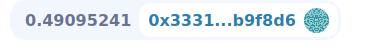
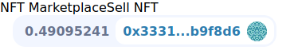
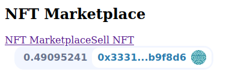
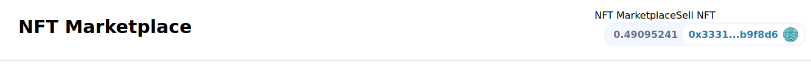
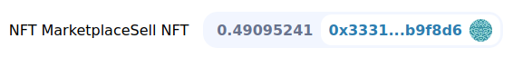
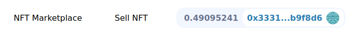

## Moralis Front End

Of course smart contract is all code and people can interact with this if they're software developers which is great but we want to allow anybody to be able to interact and list their own NFTs on our marketplace.So we're going to build the frontend for this.

We're going to build one of the most sophisticated frontend that we can using the tools that we've.

**NextJS Setup**

Now we know what it looks like on the contract side, let's figure our how to do it on the frontend side.Create a new folder called "nextjs-moralis-nft-marketplace" and open it in VScode.

Now that we're inside the folder, we're going to create a next-app.

`yarn create next-app .`

Copy and paste prettierignore and prettierrc from previous project.

Here we've a minimalistic react project.If we run `yarn dev` we'll open up an UI on that site.We go to the index.js and only keep the things below.

```javascript
import Head from 'next/head'
import Image from 'next/image'
import styles from '../styles/Home.module.css'

export default function Home() {
  return (
    <div className={styles.container}>
      <Head>
        <title>Create Next App</title>
        <meta name="description" content="Generated by create next app" />
        <link rel="icon" href="/favicon.ico" />
      </Head>


    </div>
  )
}
```

Now we've some minimalistic nextJs project.Let's create a README.md file to discuss how we want our website to look.Well we want to make a home page and in this home page we'll have it show recently listed NFTs.If you own the NFT, you can update the listing.If not you can buy the listing.Then we'll have the sell page.In this page you can list your NFT on the marketplace.

```markdown
1. Home Page:
    1. Show recently listed NFTs
        1. If you own the NFT, you can update the listing.
        2. If not, you can buy the listing.
2. Sell Page:
    1. You can list your NFT on the marketplace.
```

These are going to be the two main pages.We're going to have a ton of component but we really only going to have these two main pages.So let's also create a new page in the pages directory called "sell-nft.js" and copy paste everything of index page for now.

Let's work on home page first.We're going to be in the index.js and start buiding it.Change the heading of the index paget to the one shown below.

```html
<Head>
        <title>NFT Marketplace</title>
        <meta name="description" content="NFT Marketplace" />
        <link rel="icon" href="/favicon.ico" />
</Head>
```

In our index page what's the first thing that we're always going to need to do? We're going to need a little connect button.We need our users to be able to connect to web3.So let's create a components folder to add our component and add "Header.js" file.So to use the connect button, we're going to run:

`yarn add web3uikit moralis react-moralis`

So in order to use web3ui component, in our app.js we're going to import moralis provider and wrap whole component thing in a moralis provider.

```javascript
import { MoralisProvider } from "react-moralis"

function MyApp({ Component, pageProps }) {
  return (
    <MoralisProvider initializeOnMount={false}>
      <Component {...pageProps} />
    </MoralisProvider>
  )
}
```

If you get error while starting the moralis like `Can't resolve 'moralis-v1'`, the do `yarn add moralis-v1`.

Now that we've wrapped our app in moralis provider, we can go back to header and create a component.

```javascript
import { ConnectButton } from "web3uikit";

export default function Header() {

}
```

Then we're just going to return the connect button.

```javascript
export default function Header() {
    return(
        <ConnectButton />
    )
}
```

Back in our app.js, we could import Header and put it above the component.

```javascript
import Header from "../components/Header"

function MyApp({ Component, pageProps }) {
  return (
    <MoralisProvider initializeOnMount={false}>
      <Header />
      <Component {...pageProps} />
    </MoralisProvider>
  )
}
```

We're going to add some stuff to the header but let's just make sure we're importing it correctly.




What else we want to put in our header? Well we probably want to give it a name, make it look a little bit nicer and probably want to give it a link as well for our sell-nft page.So let's create a nav bar.So instead of just returning the connect button, we'll return nav bar using nav tag.

```javascript
export default function Header() {
    return (
        <nav>
            <ConnectButton />
        </nav>
    )
}
```

In next js we can actually make links using next js link tag.Link allows us to connect to different urls or links in our application.

```javascript
import { ConnectButton } from "web3uikit";
import Link from "next/link"

export default function Header() {
    return (
        <nav>
            <Link href="/">
                <a>
                    NFT Marketplace
                </a>
            </Link>

            <Link href="/sell-nft">
                <a>
                    Sell NFT
                </a>
            </Link>
            <ConnectButton />
        </nav>
    )
}
```



**Adding Tailwind**

Now we've incredibly minimalistic header.Obviously it looks terrible.So let's just do a little bit of formatting.To use our formatting, we're going to use [tailwind](https://tailwindcss.com/docs/guides/nextjs).

`yarn add --dev tailwindcss postcss autoprefixer`

Then we'll do:

`yarn tailwindcss init -p`

Now we've got our postcss and tailwind config.We'll grab tailwind.config.js from the [site](https://tailwindcss.com/docs/guides/nextjs) and paste it in our project.Then we're going to grab gobal.css from the site and put it in our global.css.Now we've tailwind in our project.We could do some tailwindy stuff here.

Let's create a div for all the Link tag.

```javascript
<div>
       <Link href="/">
           <a>
                NFT Marketplace
            </a>
        </Link>

        <Link href="/sell-nft">
            <a>
                Sell NFT
            </a>
        </Link>
        <ConnectButton />
</div>
```

We'll make a big section for a sign saying NFT Marketplace.

```html
<h1 className="py-4 px-4 font-bold text-3xl">NFT Marketplace</h1>
```



Let's give our whole nav a class name.

```html
<nav className="p-5 border-b-2 flex flex-row justify-between items-center">
```



Let's make our div have a class name too.

```html
<div className="flex flex-row items-center">
```



We'll also give a class name for the link.

```html
<a className="mr-4 p-6">
    NFT Marketplace
</a>
```



We need to make moralis auth false so that we're not automatically connected to the moralis database.

```javascript
<ConnectButton moralisAuth={false} />
```

We just want to connect with our metamask and we'll change the NFT Marketplace link to home.

```html
<a className="mr-4 p-6">
    Home
</a>
```
