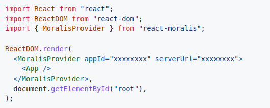
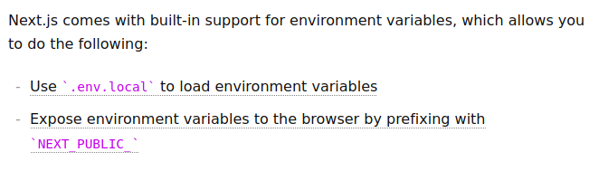
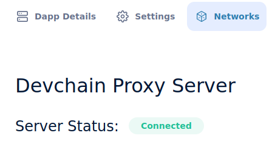

## Moralis Front End

Of course smart contract is all code and people can interact with this if they're software developers which is great but we want to allow anybody to be able to interact and list their own NFTs on our marketplace.So we're going to build the frontend for this.

We're going to build one of the most sophisticated frontend that we can using the tools that we've.

**NextJS Setup**

Now we know what it looks like on the contract side, let's figure our how to do it on the frontend side.Create a new folder called "nextjs-moralis-nft-marketplace" and open it in VScode.

Now that we're inside the folder, we're going to create a next-app.

`yarn create next-app .`

Copy and paste prettierignore and prettierrc from previous project.

Here we've a minimalistic react project.If we run `yarn dev` we'll open up an UI on that site.We go to the index.js and only keep the things below.

```javascript
import Head from 'next/head'
import Image from 'next/image'
import styles from '../styles/Home.module.css'

export default function Home() {
  return (
    <div className={styles.container}>
      <Head>
        <title>Create Next App</title>
        <meta name="description" content="Generated by create next app" />
        <link rel="icon" href="/favicon.ico" />
      </Head>


    </div>
  )
}
```

Now we've some minimalistic nextJs project.Let's create a README.md file to discuss how we want our website to look.Well we want to make a home page and in this home page we'll have it show recently listed NFTs.If you own the NFT, you can update the listing.If not you can buy the listing.Then we'll have the sell page.In this page you can list your NFT on the marketplace.

```markdown
1. Home Page:
    1. Show recently listed NFTs
        1. If you own the NFT, you can update the listing.
        2. If not, you can buy the listing.
2. Sell Page:
    1. You can list your NFT on the marketplace.
```

These are going to be the two main pages.We're going to have a ton of component but we really only going to have these two main pages.So let's also create a new page in the pages directory called "sell-nft.js" and copy paste everything of index page for now.

Let's work on home page first.We're going to be in the index.js and start buiding it.Change the heading of the index paget to the one shown below.

```html
<Head>
        <title>NFT Marketplace</title>
        <meta name="description" content="NFT Marketplace" />
        <link rel="icon" href="/favicon.ico" />
</Head>
```

In our index page what's the first thing that we're always going to need to do? We're going to need a little connect button.We need our users to be able to connect to web3.So let's create a components folder to add our component and add "Header.js" file.So to use the connect button, we're going to run:

`yarn add web3uikit moralis react-moralis`

So in order to use web3ui component, in our app.js we're going to import moralis provider and wrap whole component thing in a moralis provider.

```javascript
import { MoralisProvider } from "react-moralis"

function MyApp({ Component, pageProps }) {
  return (
    <MoralisProvider initializeOnMount={false}>
      <Component {...pageProps} />
    </MoralisProvider>
  )
}
```

If you get error while starting the moralis like `Can't resolve 'moralis-v1'`, the do `yarn add moralis-v1`.

Now that we've wrapped our app in moralis provider, we can go back to header and create a component.

```javascript
import { ConnectButton } from "web3uikit";

export default function Header() {

}
```

Then we're just going to return the connect button.

```javascript
export default function Header() {
    return(
        <ConnectButton />
    )
}
```

Back in our app.js, we could import Header and put it above the component.

```javascript
import Header from "../components/Header"

function MyApp({ Component, pageProps }) {
  return (
    <MoralisProvider initializeOnMount={false}>
      <Header />
      <Component {...pageProps} />
    </MoralisProvider>
  )
}
```

We're going to add some stuff to the header but let's just make sure we're importing it correctly.


What else we want to put in our header? Well we probably want to give it a name, make it look a little bit nicer and probably want to give it a link as well for our sell-nft page.So let's create a nav bar.So instead of just returning the connect button, we'll return nav bar using nav tag.

```javascript
export default function Header() {
    return (
        <nav>
            <ConnectButton />
        </nav>
    )
}
```

In next js we can actually make links using next js link tag.Link allows us to connect to different urls or links in our application.

```javascript
import { ConnectButton } from "web3uikit";
import Link from "next/link"

export default function Header() {
    return (
        <nav>
            <Link href="/">
                <a>
                    NFT Marketplace
                </a>
            </Link>

            <Link href="/sell-nft">
                <a>
                    Sell NFT
                </a>
            </Link>
            <ConnectButton />
        </nav>
    )
}
```


**Adding Tailwind**

Now we've incredibly minimalistic header.Obviously it looks terrible.So let's just do a little bit of formatting.To use our formatting, we're going to use [tailwind](https://tailwindcss.com/docs/guides/nextjs).

`yarn add --dev tailwindcss postcss autoprefixer`

Then we'll do:

`yarn tailwindcss init -p`

Now we've got our postcss and tailwind config.We'll grab tailwind.config.js from the [site](https://tailwindcss.com/docs/guides/nextjs) and paste it in our project.Then we're going to grab gobal.css from the site and put it in our global.css.Now we've tailwind in our project.We could do some tailwindy stuff here.

Let's create a div for all the Link tag.

```javascript
<div>
       <Link href="/">
           <a>
                NFT Marketplace
            </a>
        </Link>

        <Link href="/sell-nft">
            <a>
                Sell NFT
            </a>
        </Link>
        <ConnectButton />
</div>
```

We'll make a big section for a sign saying NFT Marketplace.

```html
<h1 className="py-4 px-4 font-bold text-3xl">NFT Marketplace</h1>
```


Let's give our whole nav a class name.

```html
<nav className="p-5 border-b-2 flex flex-row justify-between items-center">
```


Let's make our div have a class name too.

```html
<div className="flex flex-row items-center">
```


We'll also give a class name for the link.

```html
<a className="mr-4 p-6">
    NFT Marketplace
</a>
```


We need to make moralis auth false so that we're not automatically connected to the moralis database.

```javascript
<ConnectButton moralisAuth={false} />
```

We just want to connect with our metamask and we'll change the NFT Marketplace link to home.

```html
<a className="mr-4 p-6">
    Home
</a>
```


**Introducing to Indexing in Web3**

Now let's move on to showing these NFTs in our marketplace.We're going to grab the Head piece from index.js and just going to have it in app.js.

```javascript
import Head from 'next/head'


function MyApp({ Component, pageProps }) {
  return (
    <div>
      <Head>
        <title>NFT Marketplace</title>
        <meta name="description" content="NFT Marketplace" />
        <link rel="icon" href="/favicon.ico" />
      </Head>
      <MoralisProvider initializeOnMount={false}>
        <Header />
        <Component {...pageProps} />
      </MoralisProvider>
    </div>
  )
}
```

This way no matter what page we're on, we're always going to have that header as our header and we don't have to define it in each page.

So we want the home page to show recently listed NFTs.Let's go back to the marketplace smart contract.How do we actually see where the NFT is stored in the contract? Well it's stored in the s_listings mapping.However how do we see all of the listings that are in the mapping? 

This is a mapping which means we've every single address on the planet.We can't loop through the mapping.We have to loop through every single address on the planet.What are some solutions that we can take this problem? 

One of the first solutions might be to create an array of listings.This might be a good approach but what if we want to get some other data like we want to get all the NFTs a use owns?There's no array of NFTs that a user owns.That's just a mapping.What if array will be very gas expensive? IF we make it an array and to loop through would be really gas expensive.

We don't want to change our protocol for just the website.If we were to make s_listings an array it'd be really gas inefficient and much harder to make the NFT Marketplace.As you build more and more complex protocols, you're going to realize that having an array for every single mapping that you've isn't feasible.`This is one of the reasons where events some into play`.

So every single time we list an NFT, we'll call the listItem function and we emit ItemListed event.This ItemListed event is stored in a data structure that's still on chain but smart contract can't access it.However off-chain services can access these events.What we do in this case?

We'll index the events off-chain and read from our database.We're going to setup a server to listen for those events to be fired, and we'll add them to our database to query.Every single time an item is listed, we're going to index it in a database and we're going to call our centralized database to do that.

Now the question that becomes isn't that centralized? The answer to that is not necessarily.The grap protocol does exactly this.It's a protocol that indexes off-chain and sticks them into the graph protocol and does it in a decentralized way.Moralis does it in a centralized way which might be a route that you wanna go for speed, extra bells and whistles.So that you can do local development or any of the other functionality that moralis comes with.

Something to keep in mind is that even though we're adding a centralized component, our logic, our smart contract is decentralized and you can verify all you interactions are working with this decentralized smart contract.We've actually been using that alot of protocols are centralized like etherscan, opensea and some of these centralized protocols are really important to the space.

Let's learn how we can list the most recently listed NFTs.

**What is Moralis?**

We've been using the [moralis](https://docs.moralis.io/docs) open source packages and tools however moralis also comes optionally with a sever backend to give your web3 application more functionlity.

**Connecting Moralis to our Local Hardhat Node**

This is where we're actually going to start using Moralis with it's sever capabilities.We're going to sign up for a sever and use Moralis as our backend for our application.So we'll create a server.For now we're going to choose local dev chain sever.We can actually index our events from our local hardhat node which is incerdibly powerful.You can give any region and chose Ethereum chain for working with any EVM chains while create a server in Moralis.

Now that we've our server, we can go to the Moralis documentation and look at [events](https://v1docs.moralis.io/moralis-dapp/automatic-transaction-sync/smart-contract-events).Basically this server our database is going to looking for these events to be emitted but before we do that we need to hook up our application to our server.If you go to the react-moralis Github, right at the top you can see:



When you have the MoralisProvider, in their docs they actually pass an app id and a server url.This is how we can actually connect to our servers on Moralis.

So we're going to go back to the app.js and originally, we've been saying initializeOnMount = {false}.When we say this we're saying we're not going to use a moralis server.We're just going to use the open source moralis tools that you all provide.Now we actually do want to use their servers .So we're going to change that.So instead of saying initializeOnMount= {false}, we're going to give the app id and the server url.


But instead of hard coding them, we're going to put them into environment variables.So we'll create a new file called .env and this is where we're going to put all of our environment variables.Nextjs comes in built in support for environment variables which allow us to do:



So there's a couple of different environment variables paths we can use.We can use `.env.local` or other but we're going to use .env to keep it simple.In order for our frontends to read from our .env files, we've to do `NEXT_PUBLIC_XXXXXX`.NextJs will look into .env file for variables that start with NEXT_PUBLIC and only stick these environment variables into our application.

```javascript
// outside function
const APP_ID = process.env.NEXT_PUBLIC_APP_ID
const SERVER_URL = process.env.NEXT_PUBLIC_SERVER_URL

<MoralisProvider appId={APP_ID} serverUrl={SERVER_URL}>
        <Header />
        <Component {...pageProps} />
</MoralisProvider>
```

This is how we can connect our application to the moralis server.

We need to tell our server that you need to start listening for events so we can show the most recently listed NFTs and whenever somebody buys an item or cancels an item, you need to remove that from your database.How do we start telling moralis to start listening for an events?

Well first off we need to connect it to our blockchain.Then we're going to say which contract, which events and what to do when it hears those events.

How do we connect our Moralis server to the hardhat blockchain? Let's go and start running our hardhat blockchain inside the smart contract directory.

`yarn hardhat node`

Now that we've the node running, we could go to view details in our Moralis Server.To connect with the blockchain, we need to download the [reverse proxy](https://github.com/fatedier/frp/releases).


The main thing that we're going to need are going to be frpc and frpc.ini. frpc is going to be the executable.It's going to be what we're going to run to connect our blockchain node to Moralis and frpc.ini is going to be basically the config file to do this.

So create a new folder inside hardhat-moralis-nft-marketplace called "frp" and copy frpc and frpc.ini and paste inside the folder.We're going to adjust frpc.ini file.

```
[common]
  server_addr = wciosc5v5doe.usemoralis.com
  server_port = 7000
  token = kUEUiuIbh2
[hardhat]
  type = http
  local_port = 8545
  custom_domains = wciosc5v5doe.usemoralis.com
```
  
Create a new terminal, go inside the frp directory and run `./frpc -c frpc.ini`

If you want to run this you absolutely can but I'm going to show you another way to do this and this is using the Moralis Admin CLI.

`yarn global add moralis-admin-cli` 

and you should be able to start moralis admin cli using `yarn moralis-admin-cli`yarn 


One of the big ones that we're going to be working with is `connect-local-devchain`.Running frpc is same as running connect-local-devchain.We'll jump into package.json and we'll create additiona script in there for us to just run yarn and whatever the name is we want and just to do that.And also to make it easier for us to connect to devchain.

```json
"moralis:sync": "moralis-admin-cli connect-local-devchain --chain hardhat --moralisSubdomain *App URL** --frpcPath ./frp/frpc"
```

APP URL will be `abcdefgh.usemoralis.com` this part only.

If I run `yarn moralis:sync`, it's going to ask to specify API and Secret key.We can go into our .env and we can add those as environment variables that Moralis is expecting.

We don't need to name them as NEXT_PUBLIC_XXX because these are not going to be the part of our frontend.These are keys that we're using on the backend to test for our local devchain connection.If you see the image below, you're connected to the Moralis server.



  
  
