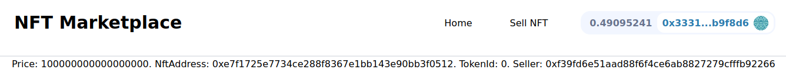

**Resetting the Local Chain**

Let's say I've closed my hardhat node .If I've stopped my hardhat node, come back to Moralis admin now I'm disconnected from the server because I'm not running my hardhat node.If I restart my node, connect local devchain command is still running,and if I refresh it, it'll now say connected.However if I go back to my hardhat-nft-marketplace smart contract and run mint-and-list script, go back to my database and do refresh, we don't see the item listed in here.On Moralis server is looking to make sure that the blockchain that we're working with is the same one.

We reset our hardhat node.So our database is going to get really confuse.We have to hit `reset local chain` to make sure that our new local chain is running  which will tell Moralis to continue doing so.Once we hit reset local chain, we're not going to see item listed in the database, however if we go back  and re-run mint-and-list, go to the moralis database and hit refresh, we now can see the item there.

**Moralis Cloud Functions**

The reason that we're doing this in the first place is that in our index.js, we can start listening for events.Now we have a database of listed NFT.We can just query ItemListed table and grab everything in there.However we've an issue here.What happened if someone buys a NFT? 

If someone buys a NFT, the ItemListed event will still be in our database but technically it won't be on the marketplace anymore.It'll be gone.So what can we do?

There's number of architectural choices we can make to get around this problem.One of the things we can do is to use [Moralis cloud functions](https://v1docs.moralis.io/moralis-dapp/cloud-code/cloud-functions).It allows us to really add anything we want our frontend to do from the Moralis server.

In our frontend code section, let's make a new folder called "cloudFunctions" and create a new file called "updateActiveItems.js"For the command, we're going to open package.json and make another moralis script.

`"moralis:cloud": "moralis-admin-cli watch-cloud-folder --moralisSubdomain gscy6u59g2ht.usemoralis.com --autoSave 1 --moralisCloudfolder ./cloudFunctions"`

Now I could run the script by `yarn moralis:cloud`.

Right now we're trying to figure out  we've ItemListed but if someone buys a NFT  technically it shouldn't be listed anymore but our ItemListed table will still have the item.

We can create a cloud function that runs whenever we want.We're going to create a cloud function that only runs whenever any one of the events are synced.We're going to create a new table called "ActiveItem", and it's active anytime it's listed but we'll remove if it's bought or canceled.

```javascript
Moralis.Cloud.afterSave("ItemListed", async (request) => {

})
```

afterSave keyword means that anytime something is saved on a table that we specify , we'll do something.It takes what table that we want to do something after it's save and some action.Anytime some item is listed in ItemListed table, we'll run some async function.We've put request in there because anytime something get's saved, it comes with a request.So anytime item is listed in ItemListed table, we want to add it to ActiveItems list.

Request comes with the flag called `confirmed` because every event gets triggered twice .Once the transaction goes through,it triggers a save and once again, once that transaction is actually confirmed.We actually only want to update ActiveItem table, when the transaction is actually confirmed.

```javascript
Moralis.Cloud.afterSave("ItemListed", async (request) => {
    const confirmed = request.object.get("confirmed")
})
```

Then we're also going to make logger.
```javascript
Moralis.Cloud.afterSave("ItemListed", async (request) => {
    const confirmed = request.object.get("confirmed")
    const logger = Moralis.Cloud.getLogger()
})
```

We can actually write logs to our Moralis database with the logs thing.

```javascript
Moralis.Cloud.afterSave("ItemListed", async (request) => {
    const confirmed = request.object.get("confirmed")
    const logger = Moralis.Cloud.getLogger()
    logger.info("Looking for confirmed Tx")
})
```

In our logs, we should see "Looking for confirmed Tx", once an item listed and saved.Now to test this out, let's run `yarn moralis:cloud` and run mint-and-list script and we should get those logs.

Now in our logs here, we only see that "Looking for confirmed Tx..." once and I just told you "It actually triggers twice."If we look in our database at the ItemListed, and scroll all the way to right, we can see confirmed equals false.So we only want to count the ItemListed event in our ActiveItems when confirmed is true.So we want to update our scripts to add one block confirmations on top of our local hardhat blockchain so that these can be changed to confirmed.

So we'll create a utility script that we can utilize in our mint-and-list script.We'll create a new file inside utils called "move-blocks.js".This will be the utility to actually move the blocks.So when we run our own hardhat node, we actually have complete control over what we want our hardhat node to do.

We can actually manually mine node and actually move blocks ahead so that Moralis knows the transaction is confirmed.We're mining the block with the transaction and that's it and Moralis is just going to be forever be waiting for the next block.So we want to add some functionality to our scripts where we mine a block after it's done.

```javascript
async function moveBlocks(amount, sleepAmount = 0) {

}
```

sleepAmount is going to be the optional parameter.If we want to move blocks and sleep maybe a second between blocks to resemble a real blockchain, we can have that in here too.   

```javascript
const { network } = require("hardhat")

async function moveBlocks(amount, sleepAmount = 0) {
    console.log("Moving blocks...")
    for (let index = 0; index < amount; index++) {
        await network.provider.request({
            method: "evm_mine",
            params: [],
        })
    }
}  
```

This is actually the same way we can make raw calls to our blockchain nodes.

Then if we specify sleepAmount then we're also going to have the script sleep or wait a short duration.

```javascript
function sleep(timeInMs) {
    return new Promise((resolve) => setTimeout(resolve, timeInMs))
}
```

In order for us to wait for sometime, we got to use promises.Promise is going to take a function with resolve as an input parameter and sleep using setTimeout.

```javascript
if (sleepAmount) {
            console.log(`Sleeping for ${sleepAmount}`)
            await sleep(sleepAmount)
        }
```

So since sleep returns a promise, we can call it with a await to wait for the sleep function to finish.

Now we'll export the function.

```javascript
module.exports = {
    moveBlocks,
    sleep
}
```

Now back in our mint-and-list, we'll import the function.

```javascript
const { moveBlocks } = require("../utils/move-blocks")
```

Down in our script at the bottom, we'll do:

Now if we comment everything and only let sleep function to run, we can see confirmed is set to true in ItemListed table.And if we see in our logs, we could see logging item happened twice.

Back to our updateActiveItems script.If it's confirmed, we're going to do some stuff.We're going to create a ActiveItem table and add item to the ActiveItem table.

```javascript
if (confirmed) {
        logger.info("Found Item!")
        const ActiveItem = Moralis.Object.extend("ActiveItem")
    }
```

This we're saying, "If ActiveItem exists, grab it but if not create it."

```javascript
const activeItem = new ActiveItem() // creating a new entry
activeItem.set("marketplaceAddress", request.object.get("address"))
activeItem.set("nftAddress", request.object.get("nftAddress"))
activeItem.set("price", request.object.get("price"))
activeItem.set("tokenId", request.object.get("tokenId"))
activeItem.set("seller", request.object.set("seller"))
```

All of these requests from events come with the address that they're coming from which for us is the marketplace address.nftAddress, price, tokenId, seller are all the parameters of our event.

```javascript
logger.info(`Adding address: ${request.object.get("address")}, TokenId: ${request.object.get("tokenId")}`)
logger.info("Saving....")

await activeItem.save()
```

Now we've a cloud function that's going to create a new entry in a new table called ActiveItem anytime ItemListed happens.So after item is called, the trigger for our cloud function and there's a whole bunch of different triggers for different Moralis cloud functions.

Now if we upload the new script to our Moralis cloud server by `yarn moralis:cloud `, go to our database, we don't see ActiveItem table.But if we go back to our our mint-and-list script, and run it , we should see ActiveItem update.

If you get the error below while running moralis cloud,

"TypeError: Cannot read properties of undefined (reading 'afterSave') in Moralis"

It's because you're importing Moralis cloud.We should not import it because cloud function works on the Moralis environment so everything is set up there.

If we restart the whole thing, we need to fix one issue.The thing is our database will still have entries even when we refresh it even though we reset the local blockchain.These entries in our database are entries from a blockchain that no longer exists.What we could do is manually delete the entries in database and run `mint-and-list` script.Then on a Moralis server, we now see ItemListed is one and ActiveItem is one all at the same time.This is how we're going to make sure that Moralis always indexes whenever we call a function.We're just going to mine one additional blocks to tell Moralis that transaction has indeed confirmed.

**Moralis Cloud Functions II**

What if somebody buys a NFT or sells a NFT? We should have ActiveItem removed.Right now if we but an item, ActiveItem will still show that item is listed.Let's go ahead and update cloud function to also say anytime an item is bought , we remove that item from being active.First we'll build for cancelling the item then we'll build for buying the item.

```javascript
Moralis.Cloud.afterSave("ItemCanceled", async (request) => {
    const confirmed = request.object.get("confirmed")
    const logger = Moralis.Cloud.getLogger()
    logger.info(`Marketplace | Object: ${request.object}`)
    if (confirmed){
        
    }
})
```

If the transaction is confirmed, we're going to remove it from ActiveItem.We're going to be using the `query` to first find that active item that's getting canceled.We're going to get that table by:

```javascript
const ActiveItem = Moralis.Object.extend("ActiveItem")
```

We're going to create a new query, to query our ActiveItem table before we set or save anything.

```javascript
if (confirmed){
        const ActiveItem = Moralis.Object.extend("ActiveItem")
        const query = new Moralis.Query(ActiveItem)
    }
```

So we're going to query our Moralis database to find an ActiveItem that's in there that's going to match the request, so we can cancel it.

```javascript
query.equalTo("marketplaceAddress", request.object.get("address"))
```

We're looking for an ActiveItem where the marketplaceAddress is going to be the same as the address of the ItemCanceled.

To find the first active item in the database that has the same marketplaceAddress, nftaddress and tokenId that just got canceled:

```javascript
const canceledItem = await query.first()
```

But if query doesn't find anything, it'll return undefined.If if founds, we remove from the activeItem.

```javascript
if (canceledItem){
            logger.info(`Deleting ${request.object.get("tokenId")} at address ${request.object.get("address")} since it was canceled.`)
            await canceledItem.destroy()
        }
```
 Else we'll just print item not found.We can upload this to the Moralis cloud by running `yarn moralis:cloud`.
 
 To test this is working, let's create a new script in our hardhat-nft-marketplace called "cancel-item.js".
 
 ```javascript
 const TOKEN_ID = 0

async function cancel() {

}

cancel()
    .then(() => process.exit(0))
    .catch((error) => {
        console.error(error)
        process.exit(1)
    })
```

We want to delete tokenID=0 item that's present in ActiveItem table that was minted and listed using mint-and-list script.

```javascript
const { ethers, network } = require("hardhat")
const { moveBlocks } = require("../utils/move-blocks")

const TOKEN_ID = 0

async function cancel() {
    const nftMarketplace = await ethers.getContract("NftMarketplace")
    const basicNft = await ethers.getContract("BasicNft")
    const tx = await nftMarketplace.cancelListing(basicNft.address, TOKEN_ID)
    await tx.wait(1)
    console.log("NFT Canceled !")
    if (network.config.chainId == "31337") {
        await moveBlocks(2, sleepAmount = 1000)
    }
}

cancel()
    .then(() => process.exit(0))
    .catch((error) => {
        console.error(error)
        process.exit(1)
    })
```

Let's go ahead and run this:

`yarn hardhat run scripts/cancel-item.js --network localhost`

Now if we go back to the datr ItemCanceled, we could see it's been removed from the ActiveItem table.

We also need something for buying item.

```javascript
Moralis.Cloud.afterSave("ItemBought", async (request) => {
    const confirmed = request.object.get("confirmed")
    const logger = Moralis.Cloud.getLogger()
    logger.info(`Marketplace | Object: ${request.object}`)
    if (confirmed) {
        const ActiveItem = Moralis.Object.extend("ActiveItem")
        const query = new Moralis.Query(ActiveItem)
        query.equalTo("marketplaceAddress", request.object.get("address"))
        query.equalTo("nftAddress", request.object.get("nftAddress"))
        query.equalTo("tokenId", request.object.get("tokenId"))
        logger.info(`Marketplace | Query ${query}`)
        const boughtItem = await query.first()
        logger.info(`Marketplace | CanceledItem: ${boughtItem}`)
        if (boughtItem) {
            logger.info(`Deleting ${request.object.get("tokenId")} at address ${request.object.get("address")} since it was canceled.`)
            await canceledItem.destroy()
        } else {
            logger.info(`No item found with address ${request.object.get("address")} and tokenId ${request.object.get("tokenId")}`)
        }
    }
})
```

To test out this part is working, we'll write another script called "buy-item.js".We'll run mint-and-list script first because our ActiveItem table is empty.

```javascript
const { ethers, network } = require("hardhat")
const { moveBlocks } = require("../utils/move-blocks")

const TOKEN_ID = 2

async function buyItem() {
    const nftMarketplace = await ethers.getContract("NftMarketplace")
    const basicNft = await ethers.getContract("BasicNft")

    const listing = await nftMarketplace.getListing(basicNft.address, TOKEN_ID)
    const price = listing.price.toString()

    const tx = await nftMarketplace.buyItem(basicNft.address, TOKEN_ID, { value: price })
    await tx.wait(1)
    console.log("Bought NFT!")
    if (network.config.chainId = "31337") {
        await moveBlocks(2, sleepAmount = 1000)
    }
}

buyItem()
    .then(() => process.exit(0))
    .catch((error) => {
        console.error(error)
        process.exit(1)
    })
```

We'll run the script `yarn hardhat run scripts/buy-item.js --network localhost`.We'll do little refresh on our database and boom item is removed from ActiveItem table.

One more thing we should do.In our NftMarketplace, we actually have an updateListing function that also emits an ItemListed event.So we also want to check to see is coming from updateListing.So back in our ItemListed cloud function, before we actually start saving stuff, we want to check to see if it already exists.

```javascript
const query = new Moralis.Query(ActiveItem)
        query.equalTo("nftAddress", request.object.get("nftAddress"))
        query.equalTo("tokenId", request.object.get("tokenId"))
        query.equalTo("marketplaceAddress", request.object.get("address"))
        query.equalTo("seller", request.object.get("seller"))
        const alreadyListedItem = await query.first()
        if (alreadyListedItem) {
            logger.info(`Deleting already listed ${request.object.get("objectId")}`)
            await alreadyListedItem.destroy()
            logger.info(`Deleted item with tokenId ${request.object.get("tokenId")} at address ${request.object.get("address")} since it's already been listed.`)
}
```

We'll delete that item and resave it for it's updated price.With this now we have a way to constantly have this ActiveItem table only be the item that are actively on our marketplace without having to spend any additional gas in our application and this is going to be way better for user experience because they're not going to pay extra gas to keep all these NFTs in maybe in array or some data structure.

Now let's learn to call all the object in our ActiveItem database.

**Querying the Moralis Database**

It's time to finally come back to our index.js and answer the question "How do we show the recently listed NFTs?"

We only want to show the active NFTs on the marketplace.Now we've the system for getting one the ActiveOnes, only the ones that are currently on the market because we're indexing these events .

We're going to use this thing called "useMoralisQuery" which allows us to fetch and make queries to our database in a react content.We're going to import the useMoralisQuery.

```javascript
import { useMoralisQuery } from "react-moralis"
```

If you look at the [docs](https://github.com/MoralisWeb3/react-moralis#usemoralisquery), it returns data, error and isLoading which will automatically run the query the instant our index pops up.So to get all the active items from the database,

```javascript
export default function Home() {
  const { data: listedNfts, isFetching: fetchingListedNfts } = useMoralisQuery(
    // TableNAme to search on
    // Function for the query
  )

  return (<div className={styles.container}></div>)
}
```

So the table name that we're going to be looking for is the ActiveItem and the function is going to limit only 10 items in descending order based off the tokenId.

```javascript
  const { data: listedNfts, isFetching: fetchingListedNfts } = useMoralisQuery(
    // TableNAme to search on
    // Function for the query
    "ActiveItem",
    (query) => query.limit(10).descending("tokenId")
  )
```

It's going to save the reasult of the function to the listedNfts section.To see if it's working, let's print the listedNfts on our console.We've our local blockchain running, we've our connection to Moralis server and we've our frontend running.

We'll go to our frontend, do a little refresh, right click and hit inspect and go to console tab.We can see Array being spit out.

The first time it console.logs, it's empty because when it initially loads listedNfts hasn't returned yet.But when it finished loading, we're going to get an array of size 1 because ActiveItem only has one item.

So how do we actually show and list the NFT for people who aren't developers  and aren't going to go to the console.log?

First we should check to see we're fetching those listedNfts.

```javascript
{fetchingListedNfts ? (<div>Loading...</div>) : listedNfts.map((nft) => {
      console.log(nft.attributes)
    })}
```

.map basically loops through and does some function on all of the listedNfts.We're looping through each nft and logging the attributes of the Nft.Inside of the attribute, there're different pieces that we want.We can get those pieces by:

```javascript
{fetchingListedNfts ? (<div>Loading...</div>) : listedNfts.map((nft) => {
      console.log(nft.attributes)
      const { price, nftAddress, tokenId, marketplaceAddress, seller } = nft.attributes
    })}
```

We can show them by returning some HTML.

```javascript
{fetchingListedNfts ? (<div>Loading...</div>) : listedNfts.map((nft) => {
      console.log(nft.attributes)
      const { price, nftAddress, tokenId, marketplaceAddress, seller } = nft.attributes
      return (<div>
        Price: {price}. NftAddress: {nftAddress}. TokenId: {tokenId}. Seller: {seller}
      </div>)
    })}
```

Now if I go to the frontend, I can information about our NFT from the database.



If we go back to NftMarketplace smart contract and mint another one, refresh our frontend, we could see it's also getting displayed in the frontend.

We've a way to show the recently listed NFTs in our marketplace.

**Rendering the NFT Images**

We should come up with the component to show our listed NFTs that looks a lot nicer.So instead of just printing raw information, we probably want to show the image.So we're going to create a new component that we're going to return in index.js to format all of our NFTs appropriately.So we're going to go to component, create a new file called "NFTBox.js" and this is where we're going to grab all the information on how to show what our NFT actually looks like.

In our index, we've all the attributes information so we're going to pass all those variables to our NFTBox component.So to do that we'll add them as input parameter to our component.

```javascript
export default function NFTBox({ price, nftAddress, tokenId, marketplaceAddress, seller }) {
}
```

Tokens have their token URI which points to an image URL of what the actual token looks like.We're going to call that token URI and then call the image URI to show the image.So we're going to actually have to wait those two API requests to get the actual image and we're going to save that image as a state variable on NFTBox component.We're going to work with useState to keep track of that imageURI.

```javascript
import { useState } from "react"

export default function NFTBox({ price, nftAddress, tokenId, marketplaceAddress, seller }) {
    const [imageURI, setImageURI] = useState("")
}
```

Now let's create a function called updateUI to update our UI and grab the tokenURI and the image URI.First thing we've to do is get the token URI and using the image tag from the tokenURI, we'll get the image.We get the tokenURI from the useWeb3Contract.

```javascript
import { useState } from "react"
import { useWeb3Contract } from "react-moralis"

export default function NFTBox({ price, nftAddress, tokenId, marketplaceAddress, seller }) {
    const [imageURI, setImageURI] = useState("")

    // const {runContractFunction: getTokenURI} = useWeb3Contract({
    //     abi:
    // })

    async function updateUI() {

    }
}
```

Now to get the abi, once again we need to update the frontend.Move to the smart contract piece and in our deploy script we've update frontend script which is only updating contract addresses.We're also going to want to add ABIs to our frontend.So let's create another function called updateAbi and we'll pass ABI as well.

```javascript
async function updateAbi() {
    const nftMarketplace = await ethers.getContract("NftMarketplace")
    fs.writeFileSync(`${frontendAbiLocation}NftMarketplace.json`, nftMarketplace.interface.format(ethers.utils.FormatTypes.json))

    const basicNft = await ethers.getContract("BasicNft")
    fs.writeFileSync(`${frontendAbiLocation}BasicNft.json`, basicNft.interface.format(ethers.utils.FormatTypes.json))
}
```

Now we've the updateAbi function, let's also add this to our module.exports. 

```javascript
module.exports = async function () {
    if (process.env.UPDATE_FRONT_END) {
        console.log("Updating front end ....")
        await updateContractAddresses()
        await updateAbi()
    }
}
```

We'll run just the part of our hardhat frontend `yarn hardhat deploy --tags frontend`.If we go back to the frontend, go to constants and we can see two json objects in there which are going to be the ABI of the BasicNft and the NftMarketplace.

Now that we have them, we can import those into our frontend.

```javascript
import nftMarketplaceAbi from "../constants/NftMarketplace.json"
import nftAbi from "../constants/BasicNft.json"
```

Now in our runContractFunction, our tokenURI function is the part of the nftAbi.

```javascript
const { runContractFunction: getTokenURI } = useWeb3Contract({
        abi: nftAbi,
        contractAddress: nftAddress,
        functionName: "tokenURI", // function in our smart contract
        params: {
            tokenId: tokenId
        }
    })
```

So in our updateUI, we'll get the tokenURI.

```javascript
async function updateUI() {
        const tokenURI = await getTokenURI()
        console.log(tokenURI)
    }
```

Make sure updateUI is called to the useEffect and make sure updateUI will run only isWeb3Enabled is true.

```javascript
useEffect(() => {
    if (isWeb3Enabled) {
        updateUI()
    }
}, [isWeb3Enabled])
```

Let's add this NFTBox to the index to see if it's working well so far.

```javascript
<NFTBox
          price={price}
          nftAddress={nftAddress}
          tokenId={tokenId}
          marketplaceAddress={marketplaceAddress}
          seller={seller}
          key={`${nftAddress}${tokenId}`}
        />
```

Also we need to import isWeb3Enabled in our NFTBox component.

```javascript
const { isWeb3Enabled } = useMoralis()
```

As long as we're on the Hardhat-LocalHost, you could see the IPFS url.The piece that we want now is the image bid.For this it's a HTTPS which technically isn't decentralized.It need to come from IPFS:// but actually having it as HTTPS://ipfs.io for now it's good.

Now that we're getting the tokenURI, we can call the URL and get back the image that we want to actually show on the frontend.Not every browser is going to have IPFS companion, so we're going to have to cheat a little bit.We're actually going to change the tokenURI from it's IPFS edition to a HTTPS edition.This is using IPFS gateway which is a server that will return IPFS files from a normal URL.We're going to use IPFS gateway, which we can just make regular HTTPs calls to and it'll return those IPFS files.

So technically, are we making it centralized doing this? Yes and is that ideal? No.However untill the world adopts IPFS, it's kind of what we have to do right now because otherwise frontend will just show up as blank to them.

```javascript
if (tokenURI) {
            const requestUrl = tokenURI.replace("ipfs://", "https://ipfs.io/ipfs/")
        }
```

```javascript
if (tokenURI) {
            const requestUrl = tokenURI.replace("ipfs://", "https://ipfs.io/ipfs/")
            const tokenURIResponse = await (await fetch(requestUrl)).json()
        }
```

fetch is a keyword that you can use in Javascript to fetch or get an url.So await to get the response and we await to convert the response to json.So now we've whole tokenURI in javascript. 

```javascript
if (tokenURI) {
            const requestUrl = tokenURI.replace("ipfs://", "https://ipfs.io/ipfs/")
            const tokenURIResponse = await (await fetch(requestUrl)).json()
            const imageURI = tokenURIResponse.image
            const imageURIURL = imageURI.replace("ipfs://", "https://ipfs.io/ipfs/")
        }
```

that's how we get the url and we can finally set the URL.

```javascript
if (tokenURI) {
            const requestUrl = tokenURI.replace("ipfs://", "https://ipfs.io/ipfs/")
            const tokenURIResponse = await (await fetch(requestUrl)).json()
            const imageURI = tokenURIResponse.image
            const imageURIURL = imageURI.replace("ipfs://", "https://ipfs.io/ipfs/")
            setImageURI(imageURIURL)
        }
```

Now we've our imageURI.

But there are number of better ways that we can do this.
 - We could use Moralis to render the image on our server and just call our server.
 - For testnets and mainnet, Moralis actually comes with bunch of hooks like useNFTBalances that will show us all the information about NFTs but it only works on testnet and mainnet.
 
 Now that we're setting the imageURI, we have what this actually looks like.So finally we can create a return in here.
 
 ```javascript
 return (
        <div>
            <div>
                {imageURI ? (<div>Found it</div>) : <div>Loading...</div>}
            </div>
        </div>
    )
```

So how do we actually show these NFTs? We finally have the URL that we can use to show the NFT but we want to actually use them.

NextJS actually comes with the component called the Image component that we can use to render images really easily just by using a URI.Because we're going to use the Image tag and does some optimization on the backend, that means this website won't be able to be deployed to a static site like IPFS because now our website requires a server.Technically it requires a server just because we've used Moralis.

```javascript
return (
        <div>
            <div>
                {imageURI ? <Image
                    loader={() => imageURI}
                    src={imageURI}
                    height="200"
                    weidth="200"
                /> : <div>Loading...</div>}
            </div>
        </div>
    )
```

If we did this right, after we save we should see image on our UI.

Let's make this look a little bit nicer.We're going to use web3uiki.It has a section called `card` where we can make clickable card and we can display some information about NFTs.So let's import card from web3uikit.

```javascript
return (
        <div>
            <div>

                {imageURI ?
                    <Card>
                        <Image
                            loader={() => imageURI}
                            src={imageURI}
                            height="200"
                            weidth="200"
                        />
                    </Card>
                    : <div>Loading...</div>}
            </div>
        </div>
    )
```

Now in our frontend we'll get the clickable section that looks little bit nicer.We could even label it with title and description.We can grab them from tokenURIResponse.So let's do that as state variable. 

```javascript
const [tokenName, setTokenName] = useState("")
const [tokenDescription, setTokenDescription] = useState("")
```

Now in updateUI bit, we'll call setTokenName.

```javascript
setImageURI(imageURIURL)
setTokenName(tokenURIResponse.name)
setTokenDescription(tokenURIResponse.description)
```

Then we'll use those description and title in the cart.

```javascript
<Card title={tokenName} description={tokenDescription}>
```

Now we've the name and description of the NFT.

Well we probably want who it's owned by.So we'll put a div inside the card.

```javascript
<Card title={tokenName} description={tokenDescription}>
                        <div>#{tokenId}</div>
                        <div className="italic text-sm">Owned by {seller}</div>
                        <Image
                            loader={() => imageURI}
                            src={imageURI}
                            height="200"
                            weidth="200"
                        />
                        <div className="font-bold">{ethers.utils.formatUnits(price, "ether")} ETH</div>
</Card>
```

Now we'll go back to index and add some formatting there too.

```javascript
return (<div className="container mx-auto">
    <h1 className='py-4 px-4 font-bold text-2xl'>Recently Listed</h1>
    <div className='flex flex-wrap'>

      {fetchingListedNfts ? (<div>Loading...</div>) : listedNfts.map((nft) => {
        console.log(nft.attributes)
        const { price, nftAddress, tokenId, marketplaceAddress, seller } = nft.attributes
        return (<div>
          <NFTBox
            price={price}
            nftAddress={nftAddress}
            tokenId={tokenId}
            marketplaceAddress={marketplaceAddress}
            seller={seller}
            key={`${nftAddress}${tokenId}`}
          />
        </div>)
      })}
    </div>
  </div>)
```

Now we've done a home page to show recently listed NFTs.We only want the NFT to show if we're connected to web3.So we need to update it a little bit.So in our index.js, right before we checking to see fetching the NFT, we'll check for web3 enable.

```javascript
{isWeb3Enabled ? (
          fetchingListedNfts ? (
            <div>Loading...</div>
          ) : (
            listedNfts.map((nft) => {
              console.log(nft.attributes)
              const { price, nftAddress, tokenId, marketplaceAddress, seller } =
                nft.attributes
              return (
                <NFTBox
                  price={price}
                  nftAddress={nftAddress}
                  tokenId={tokenId}
                  marketplaceAddress={marketplaceAddress}
                  seller={seller}
                  key={`${nftAddress}${tokenId}`}
                />
              )
            })
          )
        ) : (
          <div>Web3 Currently Not Enabled</div>
        )}
```

