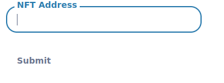
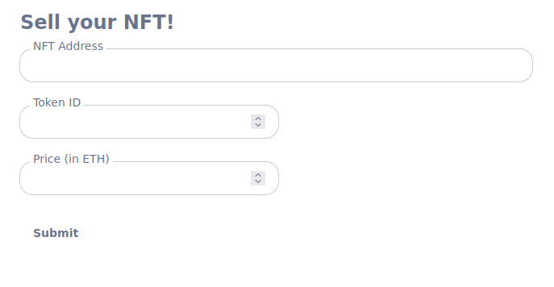

**Updating the Listing**

Now if you own the NFT, you can update the listing.Let's figure it out if somebody is actually the owner of the NFT.Well we can get the person Metamask by grabbing the account from useMoralis.

```javascript
export default function NFTBox({ price, nftAddress, tokenId, marketplaceAddress, seller }) {
    const { isWeb3Enabled, account } = useMoralis()
    ....
}
```

Then we can check for the account.

```javascript
const isOwnedByUser = seller === account
```

or if the seller is undefined.

```javascript
const isOwnedByUser = seller === account || seller == undefined
```

Now instead of saying owned by seller on the frontend, we could say:

```javascript
const formattedSellerAddress = isOwnedByUser ? "You" : seller
...
<div className="italic text-sm">Owned by {formattedSellerAddress}</div>
...
```

Now if I go to my Metamask and switch account to owned account, I can see owned by me.Since when we switch back and forth, the diameter of the image actually changes, so we want to truncate the seller address.Let's create a function outside of the export default function because it doesn't depend anything inside our app.

```javascript
const truncateString = (fullStr, strLen) => {
    if (fullStr.length <= strLen) return fullStr

    const separator = "..."
    const separatorLength = separator.length
    const charsToShow = strLen - separatorLength
    const frontChars = Math.ceil(charsToShow / 2)
    const backChars = Math.floor(charsToShow / 2)
    return fullStr.subString(0, frontChars) + seperator + fullStr.subString(fullStr.length - backChars)
}
```

```javascript
const formattedSellerAddress = isOwnedByUser ? "You" : truncateString(seller || "", 15)
```

Now we need to figure out the way to update the listing.If the NFT is owned by us, when we clicked on the NFT, we want to update the listing on the marketplace.So to do this, we're going to create a new component called "UpdateListingModal.js".Modal is something that pops up.For example while connecting a wallet, different wallet pops us.So that's the modal.We probably want to pass the parameters from the NFTBox so the modal knows what function it needs to call in our NFT marketplace.The way we're going to update the listing is by calling the updateListing function and it takes nftAddress, tokenId and new price as a parameter.

```javascript
export default function UpdateListingModal({ nftAddress, tokenId }) {

}
```

To make the little pop up, we're not going to code it ourselves, we're once again use the web3uikit.
```javascript
import { Modal } from "web3uikit"
```

One of the key thing in modal is weather or not it should be visible.

```javascript
export default function UpdateListingModal({ nftAddress, tokenId, isVisible }) {
    return (
        <Modal
            isVisible={isVisible}
        >

        </Modal>
    )
}
```

In our NFTBox, we need to tell our modal when it's visible.We'll make that code in a little bit.Inside of the modal we're giving the input field for how to update it.

```javascript
return (
        <Modal
            isVisible={isVisible}
        >
            <Input
                label="Update Listing price in L1 Currency(ETH)"
                name="New listing price"
                type="number"
            />

        </Modal>
    )
```

When the modal pops up, it's going to have input in there.We can import this component in our NFTBox.

```javascript
import UpdateListingModal from "./UpdateListingModal"
```

So right below imageURI we'll add div and inside it we'll call the UpdateListingModal and for now we'll set isVisible to true. 

```javascript
{imageURI ?
                    <div>
                        <UpdateListingModal
                            isVisible={true}
                        />
                        .....
```

Now if our frontend we'll get a little box to update the price.If we've multiple NFTs then we need to close the pop up to the total number of NFT present.So we need to tell the modal only to pop up when somebody clicks the NFT that they own.To make this work, we're going to update the Card.So whenever we click our card, we're going to create a function called handleCardClick and it'll update a variable for whether or not we should show the modal.

```javascript
const handleCardClick = () => {
        isOwnedByUser ? // show the modal : buyItem
    }
```

Since we want our whole UI to rerender once we change the variable to show the modal, we're going to do this as a useState.

```javascript
const [showModal, setShowModal] = useState(false)
```

Setting to false because by default we don't want to show the modal but if it's owned by the user  we're going to set it to true, else for now we'll log to "Let's Buy!".

```javascript
const handleCardClick = () => {
        isOwnedByUser ? setShowModal(true) : console.log("Let's Buy!")
    }
```

Now instead of isVisible to false, we'll set it to showModal.Now we've a way for that modal to actually show up correcty.

Now when the person who owns the NFT clicks the NFT, we want to send the transaction to update the price of the NFT.In our input, we'll have our label onChange to perform certain action when it's changed.

```javascript
<Input
                label="Update Listing price in L1 Currency(ETH)"
                name="New listing price"
                type="number"
                onChange={(event) => {
                    setPriceToUpdateListingWith(event.target.value)
    }}
/>
```

events.target.value is going to be whatever in the input box.So we'll create that setPriceToUpdateListingWith to have this be a useState because we want to change the UI based off it.

```javascript
const [priceToUpdateListingWith, setPriceToUpdateListingWith] = useState(0)
```

Now whatever value that we're going to pass is going to get updated with the useState.

Now we can create field called "onOk" this is going to be the function that we call when we hit the ok button on the pop up modal.We're going to call the updateListing function on the blockchain.We need to grab that function so we can use it.

```javascript
import { useWeb3Contract } from "react-moralis"
```

We'll create a new hook.

```javascript
const {runContractFunction: updateListing} = useWeb3Contract({
        
})
```

This is going to be the function that we're going to call on our NFT marketplace.
```javascript
const { runContractFunction: updateListing } = useWeb3Contract({
        abi: nftMarketplaceAbi,
        contractAddress: marketplaceAddress,
        functionName: "updateListing",
        params: {
            nftAddress: nftAddress,
            tokenId: tokenId,
            newPrice: ethers.utils.parseEther(priceToUpdateListingWith || "0"),
        }
    })
```

In our NFTBox, we need to pass those parameters.
```javascript
<UpdateListingModal
    isVisible={showModal}
    tokenId={tokenId}
    marketplaceAddress={marketplaceAddress}     nftAddress={nftAddress}
/>
```

As we code and test this something that's going to be really annoying when I click the NFT first time, modal pops up but if I click on x(close the modal) then click again, nothing shows up.Technically showModal is still true right now even though we exited out. In our NFTBox, we're also going to pass an onClose , pass is a hideModal variable that we'll create.

```javascript
<UpdateListingModal
    isVisible={showModal}
    tokenId={tokenId}
    marketplaceAddress={marketplaceAddress}
    nftAddress={nftAddress}
    onClose={hideModal}
/>
```

Right under showModal, we're going to create hideModal to be a function.

```javascript
const hideModal = () => setShowModal(false)
```

We're going to pass this function to updateListingModal.

```javascript
export default function UpdateListingModal({ nftAddress, tokenId, isVisible, marketplaceAddress, onClose }) {
```

and in our Modal, onCancel we're going to call that onClose function or onCloseButtonPressed we're also going to call that onClose function.

```javascript
<Modal
        isVisible={isVisible}
        onCancel={onClose}
        onCloseButtonPressed={onClose}
>
```

Now if we refresh our website, click  the NFT modal pops up, click on x  and click it again, it'll pop back up because now we're properly setting it to false then resetting it to true.

Now to actually send updateListing function, we're going to pass another thing.We're going to pass onOk which is going to be the function as well which is just going to call updateListing.

```javascript
 <Modal
    isVisible={isVisible}
    onCancel={onClose}
    onCloseButtonPressed={onClose}
    onOk={() => {
                updateListing()
    }}
>
```

Now it's always a good idea to add onError.

```javascript
onOk={() => {
                updateListing({ onError: (error) => console.log(error), })
            }}
```

Now if we go back to the UI, if we add any value in the input box, we see metamask pop up to make a transaction.

Let's also do it for unSuccess.When onOk event goes through successfully, we'll call a function call handleUpdateListingSuccess and this will be a function that we can call when onOk goes through corretly.

```javascript
onOk={() => {
                updateListing({
                    onError: (error) => console.log(error),
                    onSuccess: () => handleUpdateListingSuccess()
                })
            }}
```

We'll have the function set up a new notification for our application.So for us to use notification we're going to use web3uikit's useNotification.

```javascript
const dispatch = useNotification()
```

Since we're using notifications, back in our app.js, we've to import it in there.

```javascript
import { NotificationProvider } from 'web3uikit'
```

And inside of our MoralisProvider, we'll wrap the header and component with NotificationProvider.

```javascript
<MoralisProvider appId={APP_ID} serverUrl={SERVER_URL}>
        <NotificationProvider>
          <Header />
          <Component {...pageProps} />
        </NotificationProvider>
</MoralisProvider>
```

Now in our handleUpdateListingSuccess inside the function, we'll say:

```javascript
const handleUpdateListingSuccess = async (tx) => {
        dispatch({
            type: "success",
            message: "listing updated",
            title: "Listing updated - Please refresh (and move blocks)",
            position: "topR",
        })
}
```

Then we'll do onClose.

```javascript
const handleUpdateListingSuccess = async (tx) => {
        await tx.wait(1)
        dispatch({
            type: "success",
            message: "listing updated",
            title: "Listing updated - Please refresh (and move blocks)",
            position: "topR",
        })
        onClose && onClose()
        setPriceToUpdateListingWith("0")
    }
```

We need to add tx to the handle function.Whenever we call runContract function , they've onSuccess or unError.This unSuccess automatically passes the result of the call to whatever callback function is there.For example updateListing returns a transaction and we'll pass that transaction to whatever you add to the unSuccess.The handler tx parameter  is going to be the transaction that's going to go on the blockchain to update the price.Also we want to make it an async function so we can do await tx.wait(1).


When we call updateListing function, we're going to emit an Itemisted event.Inside of our Moralis dashboard, the price should actually update in our ActiveItem because of our cloud function.

Now we're going to put this all together.We'll update the price of the NFT,hit ok, metamask is gonna pop up, confirm the transaction, now if we go to ActiveItem, give it a little refresh , right now we see ItemListed event but the issue is that it's not confirmed yet.So we're going to move a block by one.

So in our NftMarketplace we're going to create a new script called "mine.js" just to move a block once.

```javascript
const { moveBlocks } = require("../utils/move-blocks")

const BLOCKS = 2
const SLEEP_AMOUNT = 1000

async function mine() {
    await moveBlocks(BLOCKS, (sleepAmount = SLEEP_AMOUNT))
}

mint()
    .then(() => process.exit(0))
    .catch((error) => {
        console.error(error)
        process.exit(1)
    })
```

Now we want to mine these two blocks.so we'll run `yarn hardhat run scripts/mine.js --network localhost`.Now if we go back to the database, go to ActiveItem we can see it's been updated because now in our ItemListed that event is a confirmed transaction.Since this is confirmed back in our frontend, if we give it a refresh, we can see the updated price.

**Buy NFT Listing**

Let's go back to our website, switch user to a different account.We'll go back to NFTBox  and somewhere we did a handleCardClick.If the NFT is owned by the user, we'll have the modal pop up.If not  let's do the buy functionality.So we're going to do another runContract function.

```javascript
const { runContractFunction: buyItem } = useWeb3Contract({
        abi: nftMarketplaceAbi,
        contractAddress: marketplaceAddress,
        functionName: "buyItem",
        msgValue: price,
        params: {
            nftAddress: nftAddress,
            tokenId: tokenId,
        },
    })
```

Now that we've the buyItem, on handleCardClick, otherwise we'll call buyItem.

```javascript
const handleCardClick = () => {
        isOwnedByUser ? setShowModal(true) : buyItem({
            onError: (error) => console.log(error),
            onSuccess: () => handleBuyItemSuccess()
        })
    }
```

We'll create a new handle for this right underneath it.

```javascript
const handleBuyItemSuccess = async (tx) => {
        
    }
```

For this we'll also have ot do a little notification.So we're going to import useNotification from web3uikit.

```javascript
const dispatch = useNotification()
```

Then in handleBuyItemSuccess,

```javascript
const handleBuyItemSuccess = async (tx) => {
        dispatch({
            type: "success",
            message: "Item bought!",
            title: "Item Bought",
            position: "topR",
        })
    }
```

Our homepage is done.


**Sell Page Listing NFTs for Sale**

In the sell page we need to list the NFTs and withdraw proceeds.We can remove the head stuff from our sell-page.For us to submit a new NFT, we probably need a space to add the address, tokenId and the price.We need a form to do this which we can also grab from web3uikit.

```javascript
import Head from 'next/head'
import Image from 'next/image'
import styles from '../styles/Home.module.css'
import { Form, From } from "web3uikit"

export default function Home() {
    return (
        <div className={styles.container}>
            <Form>

            </Form>
        </div>
    )
}
```

The parameters that we can add to our form is the data piece which is going to be an object.



```javascript
<Form
                data={[
                    {
                        name: "NFT Address",
                        type: "text",
                    },
                ]}
            >
            </Form>
```

Now if we save that and go back to the sell page, we can now see a NFT address and a submit button.

```javascript
<Form
                data={[
                    {
                        name: "NFT Address",
                        type: "text",
                        inputWidth: "50%",
                        value: "",
                        key: "nftAddress"
                    },
                    {
                        name: "Token ID",
                        type: "number",
                        value: "",
                        key: "tokenId"
                    },
                    {
                        name: "Price (in ETH)",
                        type: "number",
                        value: "",
                        key: "price"
                    }
                ]}
                title="Sell your NFT!"
                id="Main Form"
            />
```



Right now our form doesn't do anything.We probably want to give it the functionality to actually do stuff.So we'll create an onSubmit to actually create a new function to list a NFTs.We're going to create a function called approveAndList.We have to approve our marketplace to pull the NFT from our wallet.

```javascript
 async function approveAndList(data){
        
    }

    return (
        <div className={styles.container}>
            <Form
                onSubmit={approveAndList}
                data={[
                .....
                
                .....
```

On our form when we hit on Submit, it's automatically going to pass the data object to our approveAndList function.That's how we're going to get the value of the address, tokenId and the price.

```javascript
async function approveAndList(data) {
        console.log("Approving...")
        const nftAddress = data.data[0].inputResult
        const tokenId = data.data[1].inputResult
        const price = ethers.utils.parseUnits(data.data[2].inputResult, "ether").toString()

    }
```

We're going to specify the approve options for the listed NFT.

```javascript
const approveOptions = {
            abi: nftAbi,
            contractAddress : nftAddress,
            functionName: "approve",
            params: {
                to: marketplaceAddress,
                tokenId: tokenId,
            },
        }
```

In our NFTBox we're getting marketplace address directly from index and index is getting from our database.We want our app to be smart enough to be able to grab the nft marketplace itself.In our constants we have it in our network mapping.We need to grab of the chainId of the nftMarketplace at 0th index

```javascript
const { chainId } = useMoralis()
```

ChainId actually comes in it's hex form from Moralis.We need to convert the chainId to its string readable version.

```javascript
const chainString = chainId ? parseInt(chainId).toString() : "31337"
```

Now we can grab the marketplace address.

```javascript
const marketplaceAddress = networkMapping[chainString].NftMarketplace[0]
```

This is all we need to call approve function on our NFT.We can now call runContract function for approve.

```javascript
const { runContractFunction } = useWeb3Contract()
```

We could import just runContractFunction and then pass all those options to it.

```javascript
await runContractFunction({
            params: approveOptions,
            onSuccess:"do something",
            onError:(error) => {
                console.log("error")
            }
        })
```

Now on success, once we send the transaction after the approve goes through we're going to want to call the list function.Right underneath we'll call handleApproveSuccess.

```javascript
await runContractFunction({
            params: approveOptions,
            onSuccess: () => handleApproveSuccess(nftAddress, tokenId, price),
            onError: (error) => {
                console.log("error")
            }
        })
```

```javascript
async function handleApproveSuccess(nftAddress, tokenId, price) {
        console.log("Time to list")
        const listOptions = {

        }
    }
```

listOptions is going to be all the options for calling the list function.

```javascript
async function handleApproveSuccess(nftAddress, tokenId, price) {
        console.log("Time to list")
        const listOptions = {
            abi: nftMarketplaceAbi,
            contractAddress: marketplaceAddress,
            functionName: "listItem",
            params: {
                nftAddress: nftAddress,
                tokenId: tokenId,
                price: price,
            },
        }

        await runContractFunction({
            params: listOptions,
            onSuccess: () => handleListSuccess(),
            onError: (error) => {
                console.log("error")
            },
        })
    }
```

Now let's make the handleListSuccess which is going to call dispatch to make a notification.

```javascript
async function handleListSuccess() {
        dispatch({
            type: "success",
            message: "NFT listing",
            title: "NFT listed",
            position: "topR",
        })
    }
```

Now to test this out, we need to create another script.In our hardhat-nftmarketplace, create a new file called "mint.js".We're just going to mint the NFT so we can list our selves from the UI.

```javascript
const { ethers, network } = require("hardhat")
const { moveBlocks } = require("../utils/move-blocks")


async function mint() {
    const basicNft = await ethers.getContract("BasicNft")

    console.log("Minting....")
    const mintTx = await basicNft.mintNft()
    const mintTxReceipt = await mintTx.wait(1)
    const tokenId = mintTxReceipt.events[0].args.tokenId
    console.log(`NFT Address: ${basicNft.address}`)
    console.log(`Got tokenId: ${tokenId}`)

    if (network.config.chainId == "31337") {
        await moveBlocks(2, sleepAmount = 1000)
    }
}

mint()
    .then(() => process.exit(0))
    .catch((error) => {
        console.error(error)
        process.exit(1)
    })
```

to run the script `yardhat run scripts/mint.js --network locahost`

We can grab the nftAddress and tokenID and you can now list your NFT.You can see new item listed in our ActiveItem table.Withdraw proceeds is same like we've done.
