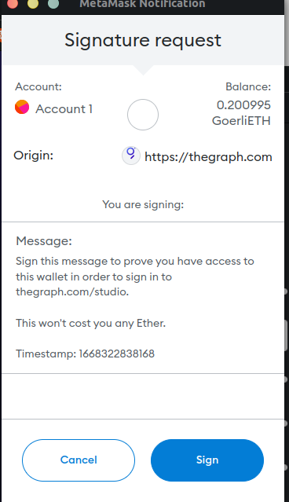
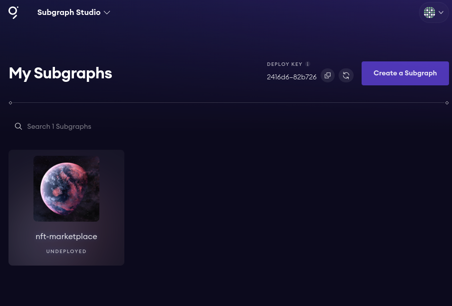
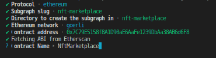

**The Graph Front End**

We've done all of the frontend using the moralis.Instead of indexing all of our events with the centralized server now we're going to build this using the graph which is a decentralized event indexer.Alot of the code is going to be exactly the same.So instead of us starting from new, we're going to copy everything into new folder "theGraph-nft-marketplace" and open it up in VScode.

First thing we're going to do is deploy our contract to Goerli.We'll grab our Marketplace.sol and run deploy script on goerli.

`yarn hardhat deploy --network goerli`

Be sure to take note of the deployed marketplace and basicNft contract because we need them in our graph section.

We've deployed it to goerli but we also need to update our networkMapping.If we did everything correctly, we can see network mapping gets updated in our frontend section.So we can copy that network mapping in our theGraph section as well.

```json
{
    "5": {
        "NftMarketplace": [
            "0x7C79E5158f8A1D90aE6AaFe1239DbAa38AB6d6F8"
        ]
    },
    "31337": {
        "NftMarketplace": [
            "0x5FbDB2315678afecb367f032d93F642f64180aa3"
        ]
    }
}
```
We're going to delete the cloudFunction folder beause we're not working with the server anymore.There's not going to be any backend to run.We don't need frp anymore because we're not going to connecting our local blockchain to the graph.We're only going to be working with the testnet here.In our app.js, we're connecting to moralis provider like this:

```javascript
<MoralisProvider appId={APP_ID} serverUrl={SERVER_URL}>
```

We're going to switch it back to false.

```javascript
<MoralisProvider initializeOnMount={false}>
```

We'll not connect to the moralis database like we did.We're just going to use the hooks.The only thing that's going to change is index.js.Right now in our index.js we're getting  our list of NFTs from our Moralis query.So we're going to change this.Let's update the readme.

```markdown
1. Instead of reading the events from Moralis, we will
    1. Index them with The Graph
    2. Read from The Graph
```

**What is The Graph?**

Graph is going to be a decentralized layer for storing event data.There are all these different blockchain and storage networks and the graph is a network of different nodes that read from blockchain and index the data.It exposes an API for us to call to read that data.

**Building a Subgraph**

If we try to run the app as it is, it will fail because index.js right now is reading from Moralis.First thing we need to do is index from the graph and we can adjust the project to read from the graph.

In order for us to tell the graph network to start indexing the events from our contract, we go to graph.com then to products and then to [subgraph studio](https://thegraph.com/studio/).This is going to help us enable us to create a subgraph for other nodes to start indexing our events.So we're going to connect our wallet.We're going to get a signature request from the graph similar to the website  that we just built.The subgraph website has some signing functionality with the database on the backend.So we're seeing in real life, exactly the methods that we just use.So instead of signing with Moralis, they just have their own custom sign in here.



So that graph website knows that it can interact with us.Click on sub-graph



There's a ton of instruction and documentation to view."nft-marketplace" needs it's own folder.Create a new folder called "graph-nft-marketplace".So we're going to go back one directory `cd ..`, create a newdirectory `graph-marketplace` and open that in VScode as well.

In this window(`graph-nft-marketplace`) we're going to create the whole sub-graph and push it to the sub graph studio.First thing that we want to do is install the grapg command line interface globally.

`yarn global add @graphprotocol/graph-cli`

This command line is going to help us build graph and build instructions for the graph to actually start indexing our events.

Then we can initialize the graph.

`yarn graph init --studio nft-marketplace`



The contract address is the one that we've deployed to the goerli testnet that we can get from networkMapping.json.

Now that it's done we can see "subgraph nft-marketplace created in nft-marketplace."I don't want it to be in another nft-marketplace folder, so I'm going to move it down a directory.

`mv nft-marketplace/* ./`

Then we can delete nft-marketplace folder.

Let me walk through exactly what's going on here and what these files are that we just created.So first folder is going to be an ABIs.In order for graph to index events, it's going to need the ABI of our events.So we got the ABI of the entire marketplace from etherscan.If we didn't verify an etherscan, we can just create an ABI folder ourselves and add the NftMarketplace json in here.

Then we've the generated folder which is an auto generated file.You can kind of think this as the build folder  where we compile graph code.Node_modules is going to be dependencies.SRC is going to be where we define and we tell the graph how to actually map and how to actually work with our contract and it's a typescript file.Then we've networks.json which gives us all of our network information about which networks, what are the addresses and what are the different contracts that we're going to be indexing.

schema.graphql is going to be graph QL schema which is also going to be how we tell the graph how to actually work with our events and index our events.This schema follows the GraphQL syntax.Subgraph.yaml tells our subgraph how to combine all the files together.So we've data sources from where they're coming from, different addresses, different entities or events, abis, different event handlers and the main file which is NftMarketplace.ts.

With all this code, we're now going to update all the code to tell the graph to start indexing our events so we can read our events from the graph in a decentralized context as opposed to from a centralized database.After we build everything, we're going to run through auth and deploy code which is to authenticate ourselves, and deploy our code to the graph to start indexing.

So the first thing I'm going to do is add highlighter for .graphql file.So in our extensions, we're going to look for graphql.This schema.graphql is going to define what entities we have in our contract.If we were to analogous to Moralis, these are going to be how we're going to define what our tables are going to look like, events plus that active  item table that we created.We're not going to have an example entity.so remove it.

```graphql
type ActiveItem @entity {
   
}
```

There are the different types we have in our graph that we can actually query on.The inside of ActiveItems, we're going to tell the graph what parameters each one of these ActiveItem types has.

```graphql
type ActiveItem @entity {
   id: ID!
   buyer: Bytes!  # Address 0x000000000... if no one has bought yet
   seller: Bytes!
   nftAddress: Bytes!
   tokenId : BigInt!
   price: BigInt
}
```

The `!` means that ActiveItem will have ID, buyer and so on.We're going to leave price as not required.So price can be null.


What else that we're going to need? What other tables do we have in Moralis? Well we're going to need ItemListed, ItemCanceled and ItemBought.

```graphql
type ItemListed @entity {
  id: ID!
  seller: Bytes!
  nftAddress: Bytes!
  tokenId: BigInt!
  price: BigInt
}

type ItemCanceled @entity {
  id: ID!
  seller: Bytes!
  nftAddress: Bytes!
  tokenId: BigInt
}

type ItemBought @entity {
  id: ID!
  buyer: Bytes!
  nftAddress: Bytes!
  tokenId: BigInt!
  price: BigInt
}
```

With just this information,we've defined what we want our subgraph to keep track of.Now we need to tell our subgraph to actually listen for these events.We're going to `NftMarketplace.ts`.It's this file that's going to tell our subgraph how to actually map and how to actually store all the event information that we have.If you look in it right now, it might even give you kind of a sample event.

```typescript
export function handleItemBought(event: ItemBought): void {}
```

It says "Whenever ItemBough events occure do the handleItemBought function."We're actually getting ItemBought from ` "../generated/NftMarketplace/NftMarketplace"`If we run `graph codegen` ,it grab all the stuff that we have in schema.graphql and puts it in generated file.Now that I've run graph codegen, you can ItemBought class, schema.ts file and we can even find new ActiveItem that we created in our schema.So any time you update schema.graphql, you always want to run graph codegen so you can update those types.If this failed, it means that you messed up something in schema.graphql.


Now in our NftMarketplace.ts, we're actually importing ItemBought, ItemCanceled and ItemListed from generated NftMarketplace from our generated code.These are going to be our events and we're not going to do anything with the NftMarketplace.For now let's delete everything inside handleItemBought function.

```typescript
import { BigInt } from "@graphprotocol/graph-ts"
import {
  ItemBought,
  ItemCanceled,
  ItemListed
} from "../generated/NftMarketplace/NftMarketplace"
import { ExampleEntity } from "../generated/schema"

export function handleItemBought(event: ItemBought): void { }

export function handleItemCanceled(event: ItemCanceled): void { }

export function handleItemListed(event: ItemListed): void { }
```

We've these three functions.Whenever we get an ItemBought even, we're going to do handleItemBought and so on.All this code is defined in our subgraph.yaml.You can see different entities  and the eventHandler.Anytime ItemBought gets fired with an address, address, uint256 and uint256, you call handleItemBought which again we're getting in NftMarketplace.ts.So that's exactly how that exactly works.Let's figure out what to do when an item bought event triggers.ItemBought, ItemListed and ItemCanceled  is little confusing so let's change it to:

```typescript
import {
  ItemBought as ItemBoughtEvent,
  ItemCanceled as ItemCanceledEvent,
  ItemListed as ItemListedEvent
} from "../generated/NftMarketplace/NftMarketplace"

export function handleItemBought(event: ItemBoughtEvent): void { }

export function handleItemCanceled(event: ItemCanceledEvent): void { }

export function handleItemListed(event: ItemListedEvent): void { }
```

So here's our minimalistic code.So whenever we list an item, what we need to do? Well we need to `save that event in our graph` and `update activeitem` exactly as we did with Moralis.So first thing that we're going to do is either get or create an itemListed object and something that we need to know is that each item needs a unique ID and we actually need to create that Id.So I'm going to create a function called "getIdFromEventPrams".

```typescript
function getIdFromEventParams(tokenId: BigInt, nftAddress: Address): string {
  return tokenId.toHexString() + nftAddress.toHexString()
}
```

BigInt and Address are special types that comes with the graph.This function gives id as a combination to tokenId and nftAddress.

Now that we've a way to get a special Id for each item in our function, we have to either get or create a new itemListed.Right now we've ItemBoughtEvent but we don't have ItemBoughtObject.So ItemBoughtObject is going to be what we save and ItemBoughtEvent is just the raw event.We've to create an ItemBoughtObject from our ItemBoughtEvent.In Typescript these are going to be two different types.So we've to import these ItemBoughtObjects.Those actually autocreated from generated/schema.ts.In here we've ActiveItem, ItemBought, ItemCancelled etc.So we're gonna import those types from there.

```typescript
import { ItemListed, ActiveItem, ItemBought, ItemCanceled } from "../generated/schema";
```

Let's go ahead and get or create an ItemBoughtObject.

```typescript
export function handleItemBought(event: ItemBoughtEvent): void {
  let itemBought = ItemBought.load(getIdFromEventParams(event.params.tokenId, event.params.nftAddress))
}
```

Since we're buying an item, we probably will also have an ActiveItem as well.We haven't made it yet an ItemListed but this is going to be similar to what we did with Moralis.So we know that every time we list an item, we also list an ActiveItem.

```typescript
let activeItem = ActiveItem.load(getIdFromEventParams(event.params.tokenId, event.params.nftAddress))
```

Even though these are going to have the exact same Id, it doesn't matter becaue they're the same Id across different types(ItemBought and ActiveItem).Now if there's no itembought then we're going to create a new itemBought object.

```typescript
if (!itemBought) {
    itemBought = new ItemBought(
      getIdFromEventParams(event.params.tokenId, event.params.nftAddress)
    )
  }
  ```
  
  Then we're going to update all of it's parameters.So back in our schema.graphql, ItemBought has an Id, buyer, nftAdress, tokenId and price.So we're going to populate the value.
  
  ```typescript
  itemBought.buyer = event.params.buyer
  itemBought.nftAddress = event.params.nftAddress
  itemBought.tokenId = event.params.tokenId
  ```
  
  ActiveItem will be from ItemListed and ItemListed should give it all these parameters, except for it won't have a buyer.So we just need to update the buyer on our ActiveItem.
  
  ```typescript
  activeItem!.buyer = event.params.buyer
  ```
  
  Now similar to moralis, we're going to save it in the graph protocol.
  
  ```typescript
  itemBought.save()
  activeItem!.save()
 ```
 
 This is our full function of handleItemBought.Whenever somebody buys an Item, we update a new item bought object and we update our active item to be a new buyer.We're not going to delete it from our ActiveItem list, we're just going to update it with a new buyer.Also we'll say if it has a buyer, it means it has been bought but if not then it's still on the market.


